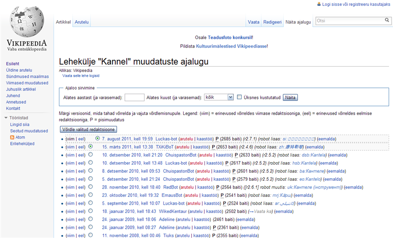
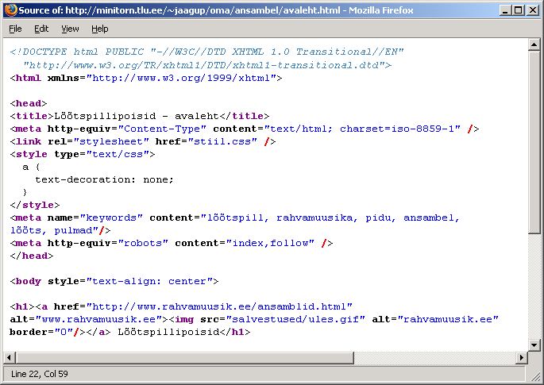
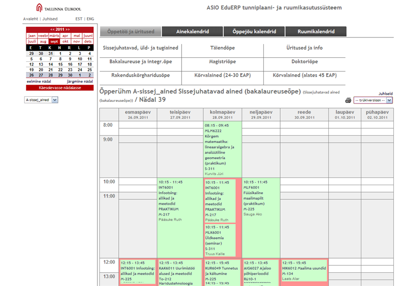
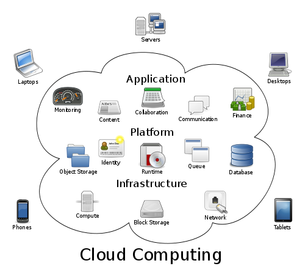
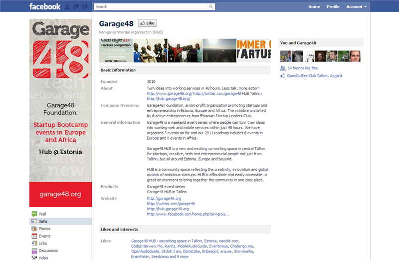
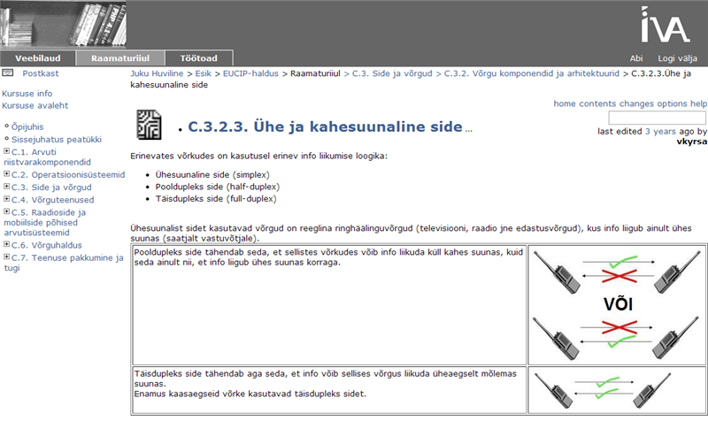
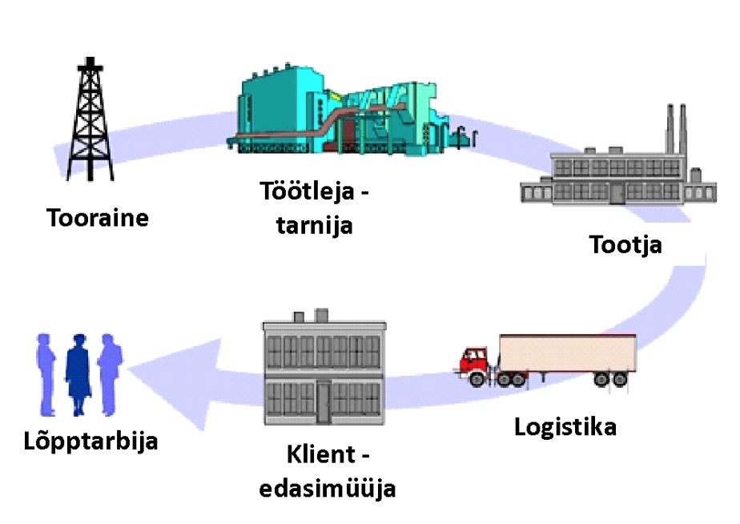
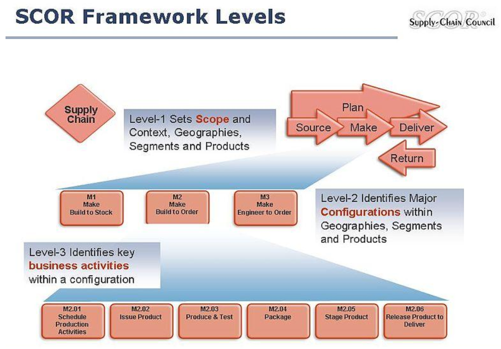
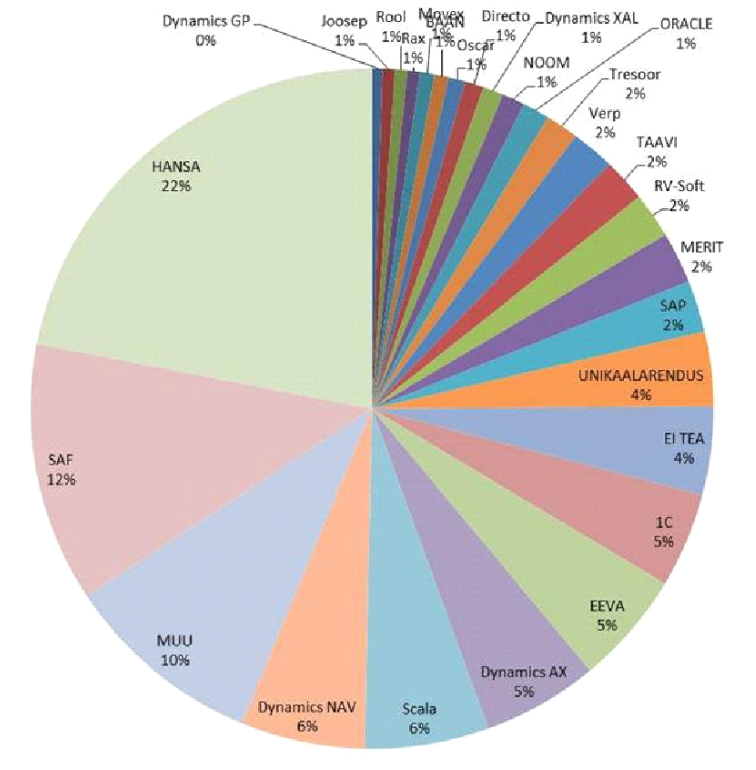

# A.4 Ülemaailmne majandusvõrgustik

::: danger Vananenud materjal

Tegu on oluliselt vananenud õppematerjaliga

:::

Selle teema materjale läbi töötades saad teadmised infoedastuses viimastel aastakümnetel toimunud hiiglasuurtest muutustest. Kasutades eri valdkondade näiteid nii igapäeva kui oluliste tegevuste puhul, selgitatakse on-line maailma toimimist.

## A.4 Uued võimalused

Selle alateema materjale läbi töötades saad teadmised infoühiskonnaga seotud uutest võimalustest.

### A.4.1 Uued võimalused infoühiskonnas

::: warning Õppekava

Defineerida globaliseerumise mõiste ja sellest johtuvad võimalused ärile.

:::

::: danger Nõrk seos

Õppekava punkt ja õppematerjal on nõrgalt seotud. Globaliseerumise definitsiooni ei anta, teema käsitlus on hoopis õppematerjali punktis **_A.2_**

:::

Informatsiooni- ja kommunikatsioonitehnoloogia (IKT, tihti kasutatav samaväärselt IT-ga) – sealhulgas Interneti – areng on teinud võimalikuks hulga teenuseid ja ärimudeleid, mis mõne aastakümne eest sugugi võimalikud ei olnud. Teabe kiire liikumine koos automatiseeritud andmetöötlusega lubab pakkuda hulgaliselt teenuseid arvuti ja teiste sidevahendite (nt mobiilid, tahvelarvutid, infokioskid jne) kaudu, mille jaoks veel hiljuti tuli ise kohale minna.

Ning kui elektroonilisele andmesidele lisada veel arenenud postiteenistus (lisaks tavapostile, kullerteenus, automatiseeritud pakiteenus nagu Eestis nt SmartPost) füüsiliste esemete transpordiks, siis suudetakse enamik suuremat aega nõudnud toimetusi korda ajada kodust või kontorist lahkumata.

Web 2.0 on tänaseks saavutanud küpsuse. Tegemist pole mitte järjekordse uue programmiga või tehnilise lahendusega. Pigem on tegemist mooduste ja tavadega, kuidas veebikeskkondi pruugitakse. Sotsiaalvõrgustikud nagu Facebook, Google+, Twitter, Foursquare jpt on üheks **Web 2.0** oluliseks eristajaks varasemast veebi kasutusest (ehkki mitte ainult nagu allpool juttu tuleb).

Üheks tähtsaks eripäraks Web 2.0 juures on **sotsiaalsus** ehk kogukondade loomine ning kaasamine, olgu siis loetava sisu loomiseks, info jagamiseks või muu uue väärtuse tekitamiseks suhtlemise ning koostöö kaudu. Nii näiteks ei eristu sotsiaalvõrgustikes autorid ja lugejad enam kuigivõrd. Igaühel on võimalik kaasa rääkida, oma fakte lisada ja omi arvamusi avaldada. Kas tehniliseks lahenduseks on ajalehe kommentaariruum, foorum, Wiki või midagi muud, polegi nii tähtis.


Joonis 4-1. Artikkel kandle kohta Vikipeedias

Selline osaliselt **iseorganiseeruv keskkond** hoolitseb, et igasugu uudistele on võimalik saada kiirelt kontrollivat tagasisidet. Teave heast arstist või meistrimehest levib kiiresti. Ning et kirjutajaid on tunduvalt rohkem kui üks, siis tuleb peagi välja ka tõik, kui keegi püüaks midagi tühjalt kohalt üles upitama või maha tegema hakata.

Vähemalt ideaalis, sest sellise infovahetuse kriitikud (eriti peavoolu meedias) on ette heitnud avaldatavate faktide kontrollimata jätmist enne avaldamist ning vastutuse puudumist või selle nõrkust avaldatu eest. Osaliselt on neil õigus, kuna kogukondlikud võrgustikud suudavad ka kuulujutte võimendada märksa kiiremini ja efektiivsemalt kui tavameedia, ent ilmselt on kogukasu Web 2.0-st siiski suurem kui kahju (seda kasvõi nt suurte loodusõnnetuste järel infot jagades ja päästetöid organiseerides).



Joonis 4-2. Kandle artikli tekkimine ja muudatused aja jooksul

### A.4.1.2 Veebiotsing

::: warning Õppekava

Kirjeldada Interneti ärilist väärtust äriorganisatsioonidele.

:::

::: danger Nõrk seos

Õppekava punkt ja õppematerjal on nõrgalt seotud.

:::

Veebis orienteerimiseks on asendamatuks muutunud otsinguvahendid, tuntumad neist maailmas Google ja Bing, Eestis neti.ee. Tunduvalt rohkem kasu kui kallist reklaamist ajalehe esiküljel, võib olla veebilehest, mis otsimootorites kohe lahti lööb. Otsimootorid on muutunud algsega tunduvalt intelligentsemateks. Otsimootorid suudavad teistelt lehtedelt tehtud viidete kaudu hinnata lehestike usaldusväärsust ning sealtkaudu sobivaid teemasid soovitada. Samuti on õige ülesleidmise huvides endiselt veebihaldureil otstarbekas panna lehele teemakohased märksõnad ning lehele määrata selgelt mõistetav pealkiri.



Joonis 4-3. Märksõnadega (ingl k keywords) veebilehe lähtekood

Lisaks märksõnadele on veel mitmeid võimalusi oma veebilehe otsimootorites kergemini leitavaks tegemisel, nt veebilehe optimeerimine (selle ümber on tekkinud terve teenusharu SEO e search engine optiomisation), kohakaardi (ingl k sitemap) lisamine, registreerimine erinevates otsimootorites ja temaatilistes kataloogides nagu Yahoo või www.ee (ootamata nendepoolset indekseerimist), ristviitamine teiste samalaadsete veebilehtedega jne.

### A.4.1.3 Ekstranet ja intranet

::: warning Õppekava

Intraneti ja ekstraneti kasutamine ärivaldkonnas.

:::

Veebivahendid nagu ekstranet ja intranet aitavad internetitehnoloogiat kasutada ettevõtluse huvides.

- **Ekstranet** on defineeritud kui internetipõhine eravõrk (st tavaliselt kasutajanime ja salasõnaga piiratud juurdepääsuga), mis on nii firma klientide kui ka tarnijate ja äripartnerite kasutada. Tavaline pilt klienditeenindusest eeldab, et tarbija läheks kohapeale teenindaja juurde, et ostujärgset abi saada. Aga tänapäeval on võimalik hulk sellest tehnilisest suhtlusest tuua ekstranetikanalisse ja säilivad nii tarbija kui ka klienditeenindaja jaoks eelmiste kontaktide andmed ja ajalugu. Näiteks võib tuua ekstraneti, kus autoremonditöökoda tellib varuosade hulgimüügifirmadelt kaupa, mobiilifirma või elektriettevõtte avab veebis iseteeninduse või riiklikud avalikud teenused (rahvastikuregister, tervishoiu digilugu, e-maksuamet jpm) on ööpäevaringselt kättesaadavad.

- **Intranetti** on tihtipeale määratletud kui firmasisest töövahendit, mis küll ka avalikul internetil põhineb. Põhiideeks on lubada asjaosalisi (reeglina oma töötajaid) dokumentide, tarkvara või andmebaaside juurde ja hoida vajalike turvameetmete abil asjassepuutumatud isikud eemal. Mõnel pool tähendab see lihtsalt üht faili, mida kõik kirjutada/lugeda saavad. Mõnes kohas tegemist failide kataloogiga, kus vajalikele dokumentidele kohapeal ligi pääseb. Kuid üha enam on kasutuses terviklikke keskkondi, mille sees ajaplaneerimise vahend, suhtlusosa, ühiselt kasutatav andmestik, meeldetuletused, tööaja arvestus jms (nt ülikooli ressursihaldus keskkond tunniplaani, ruumibroneeringute jms). Ettevõtetes, kus antakse üksteisele andmeid digitaalkujul edasi, on selline korralikult toimiv keskkond ideaalseks andmevahendajaks.



Joonis 4-4. Tallinna Ülikooli elektrooniline tunniplaan

**Ettevõttesisene teabehaldus** ei pruugi sugugi füüsiliselt piirduda ühte majja ehitatud arvutivõrguga. Ikka kipuvad hooned linna peal laiali olema, harukontorid veelgi kaugemal. Turvaprotokollide abil luuakse virtuaalne privaatvõrk (ingl k virtual private network e VPN), kustkaudu saab andmeid vahetada pea sama turvaliselt nagu sisevõrgus. Ning nagu igasugu piirid kipuvad hajuma, siis kasutaja jaoks ei saa kuigivõrd eristada lihtsalt turvalise ühendusega (https) veebipõhist teabehalduslehestikku tehniliselt tugevamini lahutatud sisevõrgust.

Peab küll nentima, et viimasel ajal on ekstraneti ja intraneti vahe hägustunud, sest mõlemad tähendavad organisatsiooni elektroonilistele ressurssidele kaugelt ligipääsu võimaldamist ja põhierinevus kipub piirduma ligilubatavate kasutajagruppidega.. Et ekstranet ja intranet kasutavad tavalise interneti võimalusi, hoitakse kulud madalal ja kasutajakeskkond ühetaolisena.

Uusi võimalusi pakkuvate tehnoloogiatrendide hulgas tasub mainida (ja huvi korral lähemalt uurida) ka **asjade interneti** (ingl Internet of Things) tärkavat kasvu võimaldavat Web 3.0 ehk semantilist veebi (kus seadmete omavaheline suhtlus muutub märksa levinumaks kui täna).

### A.4.1 Kordamisküsimused

::: tip Kordamisküsimused

1. Web 2.0 puhul on tegemist uue…

- tehnoloogiaga
- viisiga veebi kasutada X
- veebiprogrammiga

2. Veebi otsimootorid hindavad lehe usaldusväärsust…

- tema mahu järgi
- seal leiduvate piltide resolutsiooni järgi
- teistelt lehtedelt sinna tehtud viidete hulga ja kvaliteedi järgi X
- inimeste tagasiside põhjal

3. Ekstranet…

- tekitab kinnise ühenduse firma osakondade vahel
- ühendab ülikoole ja kolledžeid omavahel
- ühendab ettevõtte kliendid ja koostööpartnerid interneti vahendite abil piiratud sisevõrku X
- tuleb 2010 aastal kohtvõrkude asemele

:::

## A.4. Protsesside muutmine üleminekul e-ärile.

ehk "Äri- ja turundustrendid uues majanduses".

Selle alateema materjale läbi töötades saad teadmised äri- ja turundustrendidest uues majanduses.

### A.4.1 Äri- ja turundustrendid uues majanduses

::: warning Õppekava

E-äri olulisemad mõjurid organisatsioonidele.

:::

Traditsioonilise majanduse juures on tähtis asukoht. Igas maakonnas leivatööstus, igas vallas ametnikud, kes elanikke vastu võtavad ja nende muresid lahendavad. Ning iga ametnik või perearst või muusik peab olema küllalt laia profiiliga, et paari kolme inimesega terve valla vajadused ära katta. Mitmekülgsusel on küll oma võlu, aga "universaalid" ei saa omale üldjuhul muretseda spetsiifilisi, sageli kalleid vahendeid eripäraste ja suhteliselt harva ettetulevate toimetuste tarbeks.

Kui 1930-ndatel peeti loomulikuks, et iga talu kasvatas enamjaolt kõike, mida võimalik oli, vaja võis minna ja müüa sai, siis 70 aastat hiljem on selliseid talunikke päris vähe. Vanasti oli paljude kultuurtaimede kasvatamine hädavajalik juba riskide maandamiseks - kui vili ikaldus, siis kartul ikka midagi andis. Riskide maandamine on ka nüüd vajalik, aga selleks sobivad ka kindlustused ja muud kanalid. Palju uut juba töötab. Märgatav kogus ühenduskanalite ja andmetöötluse arengust tingitud enamjaolt veebipõhiseid lahendusi on juba meie ellu jõudnud. Elektroonilised ajalehed, uudisteportaalid satuvad ehk kõige enam silma alla. 1990-ndate algul ei osanud ehk unistadagi, et märgatavat osa väljaandeid võib vabalt värskelt arvutist lugeda. Aga ega praegu paarikümne aasta peale ette ennustamine ei pruugi kuigi palju rohkem täppi minna.

**Uudsed ühenduskanalid** pakuvad väikestele ja kiiretele firmadele tugevaid konkurentsieeliseid. E-kaubanduses ja -vahenduses eristatakse kolme suunda:

1. **Ettevõtjalt tarbijale** **_Business-to-Consumer_** / **_B2C_** puhul on tegemist suhteliselt traditsioonilise müügiga. Lihtsalt arvuti abiga on võimalik mitmeid toimetusi paindlikumaks muuta.
2. **Ettevõttelt ettevõttele** **_Business-to-Business_** / **_B2B_** liikuv vahendus aitab ühel ettevõttel pakkuda tervikteenust tehes ise lõike, mis omal hästi välja tulevad ningv ostes sisse teenust ülejäänute jaoks.
3. **Tarbijalt tarbijale** **_Consumer-to-Consumer_** / **_C2C_** vallas on toimunud kõige suuremad muutused, kuna internet pakub võimalusi paljude sarnaste huvidega või vajaduste eraisikute kokkuviimiseks, olgu nendeks siis huvialaringid või vanakraami müük. Kui varem pidi lootma pigem piiratud tutvusringkonnale või aeganõudvale kuulutuslehtede sirvimisele, siis spetsiaalselt neil eesmärkidel loodud veebikeskkonnad (nt oksjontite korraldamiseks või kasutatud asjade müügiks Ebajy või osta.ee) lihtsustavad otsimootorite, filtreerimiste jm tööriistade abil märgatavalt miljonite hulgast selle inimese leidmist, kellest probleemi lahendamisel võib parasjagu abi olla.

### A.4.2.2 Pilveraalindus

::: warning Õppekava

Kuidas kasutada IKT-d organisatsioonis muutuste läbiviimisel.

:::

::: danger Puuduv seos

Õppekava punkt ja õppematerjal pole omavahel seotud.

:::

::: danger Vananenud või ebapiisav sisu

**_cloud computing_** vajab tunduvalt põhjalikumat käsitlust.

:::

Infotehnoloogia ja arvutivõrkude areng on toonud uued tuuled ka ettevõtlusesse. **Pilveraalindus** **_cloud computing_** on toonud arvutiressursside (serverid, andmebaasid, ärianalüütika) sisseostmise ka väikeettevõteteni. "Pilv" sisaldab nii taristut, platvorme kui ka rakendusi, mida kasutatakse erinevate vahenditega (nagu illustreerib allolev joonis).

Kui tavakasutajale tuttavaks **pilveraalinduse** – sisulisel kõikjalt kasutatava arvutiteenuse – näiteks on tavapäraseim veebimeil (Hotmail, Yahoo või Gmail), siis firmadele tähendas arvutikasutus kuni suhteliselt hiljutise ajani oma sisevõrku, servereid ja hulka kallist korporatiivhinnaga süsteemitarkvara. Ehkki see pole veel kuskile kadunud (st töökindluse ja turvalisuse mõttes eelistavad paljud firmad endiselt seda lähenemist), on ometi pilves (st sisuliselt internetis) jagatud teenuste leviku tõttu hinnabarjäär hakanud märkimisväärselt langema. Nii on võimalik osta Amazonist serveriruumi S3 teenust, arvutivõimusust Amazoni EC3 teenusega või on-line majandustarkvara teenust Eesti juurtega firmalt Erply, sealjuures piirdudes oma ettevõttes vaid terminalide, lauarvutite või viimasel ajal pigem sülearvutite ja netbook'ide hankimisega. Veelgi enam – sülearvutute hinnalangus ja iPad'ist tuule tiibadesse saanud tahvelarvutite uuestisünd on toonud arvutikasutuse lähemale ka mobiilsetele töökohtadele nt laomajanduses, logistikas, transpordis, metsanduses jpm.



Joonis 4-5. Pilveraalinduse komponentide ülevaade (diagrammi autor: Sam Johnston, allikas: [Wikipedia](http://en.wikipedia.org/wiki/File:Cloud_computing.svg)) Allikas: [http://en.wikipedia.org/wiki/File:Cloud_computing.svg](http://en.wikipedia.org/wiki/File:Cloud_computing.svg) Litsents: CC Attribution-Share Alike 3.0 Unported)

### A.4.2 IT rakendamine teistes valdkondades

::: warning Õppekava

Kuida luua tõhus klienditeenindus ja hallata e-äris kliendisuhtlust.

:::

::: danger Puuduv seos

Õppekava punkt ja õppematerjal pole omavahel seotud.

:::

Infotehnoloogia kasutamine kõigis majandus- ja sotsiaalvaldkondades (haridus, tervishoid, energeetika, põllumajandus jne) ongi see, millest tõuseb kõige suurem ja märgatavam kasu IT-st. Seda tuleb rõhutada, et erinevalt arvutite seostamisest pelgalt IT-sektoriga (või IT-haridusega), mis on küll oluline uuenduste võimaldaja ja eeldusena, tuleb peamine efekt siiski teistest (rakendus)valdkondadest.

Eestis on heaks näiteks ja eestvedajaks olnud riik, mille e-teenused (ID-kaart, digiallkiri, e-maksuamet, e-valimised jne) on tähelepanu tõmmanud ka rahvusvaheliselt. Tehnoloogia tõeline potentsiaal vallandub siiski alles selle laiema levikuga kõikidesse elu- ja ärivaldkondadesse. Tänu IT-le võivad mõned uutest firmadest sündidagi globaalseina, st erinevalt tööstusajastu ärimudelist ei pea laienema füüsiliste asukohtade haaval (nagu nt poeketid). Heaks näiteks on siin Skype, mis sünni hetkest on ülemaailmselt kasutatav.

## A.4. Globaliseerumine

Globaliseerumine on osaliselt infotehnoloogia arengu tulemus, ja samas IT levik omakorda võimendab üleilmastumist. Ühest küljest aitab info leviku lihtsustumine ja kiirenemine traditsioonilist äri piiriüleselt paremini teha (vrd kasvõi e-kirja saatmise kiirust tavakirjaga) ja teisalt on see loonud võimalused täiesti uute ettevõtlusharude, toodete ja teenuste sünniks. Uued võimalused ei piirdu ammu enam kiirema suhtlusega, vaid võimaldavad kliendibaasi laiendamist üle regiooni või isegi maailma (nagu nt ennist mainitud Skype), meeskonnatööd üle eri ajavööndite, oskustööjõu kasutamist ilma seda füüsiliselt kohale toomata, aga ka klientide kaasamist toote või teenuse arendamisse.

### A.4.1 Rahvahange

Rahvahange (ingl k crowdsourcing) tähendab kliendi kaasamist toote või teenuse arendamisse. Varemgi toimus see kasutajate tagasiside põhjal ning varajasemas väljatöötamise faasis ka fookusrühmades ning muudes kontrollitud keskkondades. Uuel sajandil on avatud innovatsiooni märksõna alla koondatud firmade tegevused, kus nad ideede ja nende väljaarendamise saamiseks pöörduvad organisatsioonist väljapoole.

See võib toimuda nii ideekonkursi, teenuse väljaarendamise kui prototüübi katsetamise näol. Näiteks kui Lego tahtis välja töötada oma järgmise põlvkonna Mindstorm robootikakomplekti, pöördus ta entusiastide poole, kes panustasid oma teadmiste ja ajaga Mindstorm NXT sündi. Kogemus oli niivõrd edukas, et praeguseks on Lego muutnud mänguklotside fännide kaasamise tootearendusse süsteemseks, oma LegoDesignByMe nimelises veebikeskkonnas.

Vaata muid rahvahanke näited veebis olevast loetelust aadressil [http://www.openinnovators.net/list-open-innovation-crowdsourcing-examples/](http://www.openinnovators.net/list-open-innovation-crowdsourcing-examples/).

Samm eelnevast edasi on rahvahankel tuginevate **uute ärimudelite sünd**. Nii on esile kerkinud vahendajad, kes loovad keskkonna selleks, et tootearendajad ja tegijad kokku tuua. Huvitavaks näiteks on pioneer graafilise disaini valdkonnas 99design.com, kus logo, visiitkaardi, veebikujunduse vms tellija paneb soovitu saamiseks välja konkursi ja määrab ise hinna, mis ta on nõus selle eest maksma. Selle peale kujundajad üle maailma hakkavad kavandeid pakkuma. Soovitu mitteleidmisel saab tellija raha tagasi. Nii see kui paljud teised rahvahanke tööriistad on alguse või vähemalt inspiratsiooni saanud sotsiaalvõrgustike suhtluskeskkondadest.

### A.4.2 Suhtluskeskkonnad

Arvutivõrgu kaudu toimivaid keskkondi mõistab kindlasti igaüks päris mitu üles lugeda. Hulgi on meelelahutus- ja suhtlusportaale ning alati polegi võimalik täpset vahet teha, kus läheb meelelahutusega seotud suhtlus üle erialaseks/hobialaseks suhtluseks. Erialainimeste võrgustikud (nt LinkedIn) on heaks näiteks, kus ühendatakse meeldiv kasulikuga. Laiema levikuga on loomulikult kindla fookuseta suhtluskeskkonnad nagu äärealadele tõrjutud Orkut, selle kannul hiigelsuureks kasvanud Facebook või hilisem tulija, ent mitte väiksema kasvupotentsiaaliga Google+.



Joonis 4-6. Alustavate ettevõtete 48 tunni jooksul loomise ürituse Garage48 lehekülg Facebooki suhtluskeskkonnas

Lisaks on Web 2.0 suhtlusvõrgustike ajastule omaseks saanud mitmed spetsiifilisemad kasutajate vahelist suhtlust ja kogemuste vahetamist hõlbustavad vahendid (vt põhjalikumat kataloogi lehel [http://www.go2web20.net/](http://www.go2web20.net/)) nagu lühisõnumitele spetsialiseerinud Twitter, kasutaja asukohale ja selle ümbruskonna infole üles ehitatud Foursquare ja Gowalla, pildijagamiseks mõeldud Flickr ja Picasa, ajaveebi tööriistad Blogger ja Wordpress jpt. Nende keskkondade esiletõus on oma mõju avaldanud ka ettevõtlusele.

#### Sotsiaalvõrgustikud turunduses

Sotsiaalvõrgustike kasvades sai üsna kiiresti selgeks, et firmad saavad neist kasu lõigata oma **toodete ja teenuste tutvustamisel**. Nii on seal kasutusele võetud nii gerilja-marketingi (st kui reklaam ei ole otseselt kokku viidav reklaamijaga) võtted kui ka otseturunduse meetodid. Varasemate lahendustega võrreldes on eeliseks interaktiivsus – võimalus suhelda kliendiga otse, mitte massimeedia vahendusel. Seega annavad uued kanalid võimaluse mitte ainult enda tutvustamiseks ja tagasiside saamiseks, vaid ka oma kliendi ja tema soovide tundma õppimiseks.

Kasutajaprofiilide andmete põhjal on reklaame võimalik veelgi täpsemalt suunata. Nii on Groupon'i eeskujul loodud paljudele odavpakkumiste jahtijale Eestis tuttavaks saanud ja poole aastaga 100 miljoni kroonise turuväärtusega firmaks tõusnud Cherry.ee eelkõige turunduskeskkond, mille tegelikeks klientideks (ja tulu allikaks) on turunduseelarvet sinna ümber suunavad sooduspakkumisi tegevad firmad. Näiteks on Groupon'i vahendustasu tehingu hinnast tavaliselt 50%, aga võib kohati ulatuda 90%-ni – sellisel juhul pole soodustuse pakkuja vaatenurgast tegemist enam kauba või teenuse allahindlusega, vaid turunduskuluga kliendi saamiseks.

#### Õpikeskkonnad

Omaette valdkond on elektroonilised õpikeskkonnad – olles alates lihtsast abivahendist õppematerjalide kättesaadavaks tegemisel või õpilaste küsimuste/kodutööde kokkukogumisel omaette väikeste maailmadeni, kus saab gruppidena arutleda ja arutluse tulemusi süstematiseerida. Seal on simulatsioonivahendid seadmete ja seoste tundmaõppimiseks. Samuti on õpikeskkonnas võimalik koguda automaatset statistikat õppurite käitumise kohta ja seda edasise kursuse kavandamisel arvestada.



Joonis 4-7. E-õppematerjalid IVA õpikeskkonnas

1990-ndate aastate jooksul arenesid välja mitmed **terviklikud õpikeskkonnad** , kus oli püütud sihtgrupi õppurite kõik võimalikud mured lahendada. Sellised süsteemid võisid saada küllaltki täiuslikuks. Kuid probleemiks osutus õppematerjalide ja muude andmete nihutamine ühest süsteemist teise (e migreerimine). Selline vajadus kipub tekkima nii koolide ühinemise, litsentsitingimuste muutumise kui näiteks riistvaraliste võimaluste täienemise/kokkukuivamise puhul. Samuti oludes, kus koostatud kursusi soovitakse muutunud mahus mujal õpetada.

Andmete hoidmiseks ja ülekandeks on välja mõeldud **haridustehnoloogilised standardid.** Ühised tunnused õpiobjektide (raamat, peatükk, joonis) kirjeldamiseks, testide ja testiküsimuste hoidmiseks ja esitamiseks. Eeldatavalt on tulevik pigem üksikuid eraldiseisvaid teenuseid ühendavate keskkondade päralt. Eraldi kohas on õpiobjektide ait, materjalide loomise vahend, materjalidest kursuse koostamise vahend, testiküsimuste graafilise renderdamise vahend. Iga konkreetse keskkonna puhul lihtsalt seotakse need vahendid ühiste standardite abil omavahel kokku. Kui kellelgi on tahtmist või põhjust kasutada oma ajaveebi või muud keskkonda andmete lugemiseks või esitamiseks, siis saab needki standardite abil loodetavasti kokku siduda. Nii nagu kuuemillimeetrise keermega polt ja mutter sobivad enamasti kokku, nii püütakse ka mitmesugused keskkonnad omavahel mugavalt andmeid vahetavaks teha. Kõike ei õnnestu - nii nagu keermeid on laiemaid ja tihedamaid. Aga pea igas valdkonnas hakkavad välja kujunema standard või paar, mille kaudu suudab enamik selle valdkonnaga seotud rakendusi andmeid suuremate kadudeta vahetada.

XML-põhise standardi näide:

```xml
<topicMap>
  <topic id="mapprop">
    <baseName>
      <baseNameString>Maakera</baseNameString>
    </baseName>
    <occurrence id="description">
      <resourceData> </resourceData>
    </occurrence>
     <occurrence id="fontindex">
      <resourceData>1</resourceData>
    </occurrence>
  </topic>
</topicMap>
```

### A.4.5 Kordamisküsimused

::: tip Kordamisküsimused

1. Globaliseerumise peamine mõju IT vallas on see, et …

- arvutite kellaegade sünkroniseerimine muutub keerukaks
- firma asukoht ei oma suurt tähtsust X
- transpordi osatähtsus kahaneb maailmamajanduses
- sülearvutite tootmine kasvab märgatavalt

2. Pilveraalindus tähendab …

- kõrgema protsessorijõudlusega arvutivõimsust
- ilmaennustamist
- uut internetitehnoloogiat
- arvutiressurssi kasutamist või jagamist internetis X

3. Rahvahanke puhul …

- korraldatakse avalik konkurss uue toote või teenuse loomiseks
- kasutatakse kliente ja fänne firma teenuse või toote väljatöötamisel või parendamisel X
- valitakse odavaim lahendus
- hangitakse vajalikud seadmed järelturult

4. Infotehnoloogia peamine efekt tuleb …

- selle kasutamistest võimalikult paljudes muudes valdkondades
  peale IT-sektori X
- IT-sektori suurusest
- arvutite läbimüügist
- arvutite kasutamisest kodudes

:::

## 3. Uued mehhanismid ja struktuurid äris

Selle alateema materjale läbi töötades saad teadmised uutest mahhanismidest ja struktuuridest aris.

### 3.1 Uued mehhanismid ja struktuurid äris

Infotehnoloogia pakub palju võimalusi **organisatsiooni paindlikkuse suurendamiseks**. Üheks võimaluseks on rutiinsete tööde automatiseerimine, mis vabastab inimesed teiste keerukamate ja loovamate tööde tegemiseks. Sõltuvalt töö iseloomust võivad nendeks rutiinsemateks töödeks olla tüüpkirjade masspostitus kontoritöös, laomajanduse korrastamine klassifikaatorite abil või tootmisliini kiire ümberhäälestamine eelprogrammeeritud parameetrite alusel.

Omamoodi automatiseerimine on organisatsioonivälistele tööprotsessi osalistele (nt kliendid, partnerid, alltöövõtjad jt) IT abil firma **ressurssidele juurdepääsu andmine**. Siia alla käivad kõikvõimalikud veebipõhised iseteenindused (sh internetipangad), ekstraneti lahendused tarnijatele, aga ka paljud avalikud e-teenused (nt e-maksuamet). Lisaväärtuseks seejuures on paljudel puhkudel ööpäevaringse ettevõtte tekkimine – ka tööajavälistel tundidel, kasvõi öösel, ehk kasutajale sobival ajal ligipääsu võimaldamine firmale.

Organisatsiooni paindlikkust suurendab ka **kaugtöö** võimalus (ametites, kus see kohane). Seda näiteks personalivärbamise mõttes laiendades haaret geograafiliselt ja suurendades võimalike kandidaatide hulka, aga ka pakkudes seeläbi töötajatele temale sobivaimat lahendust töö tulemusse panustamisel. Tasub arvestada ka kokkuhoidu kontorikuludelt kuna kaugtöö puhul langeb tihtipeale ära vajadus sisustada töökoht ettevõtte pinnal.

**Virtuaalorganisatsioon**

Peetakse loomulikuks, et küla väikesesse autoteenindusse minnes ei suudeta seal uusima automudeli kõiki elektritöid teha. Aga "uue majanduse" puhul ei pruugi enam sellist piirangut ees olla. Kui külateeninduses on käepärast tööpink, mille robotkäsi saab kaugelt juhtida, siis hea korralduse puhul võiks kohalik remondimeister keerukamate lõikude jaoks suhteliselt kergesti abi paluda firma mujal asuva esinduse kogenud töölistelt, et mõni keerukam seadistus lasta neil teha. Tavalise keevitamise ja kruvimisega saadakse ka kohapeal hakkama. See on üks näide virtuaalsest organisatsioonist.

Virtuaalne organisatsioon on määratletud kui organisatsioon, mis kasutab internetti, rendiliine, WiFi't või muud sidevahendit, et luua võrku liidetud arvutite abil suhtevõrgustik oma töötajate vahel. Akadeemilises kirjanduses (http://www.idi.ntnu.no/grupper/su/fordypningsprosjekt-2004/Jacobsen2004.pdf) on

Olulisemateks virtuaalorganisatsiooni tunnusteks peetud toetumist IKT-le, ühisele eesmärgile keskendumist, vertikaalset integratsiooni, koostööd ja globaalsust.

Virtuaalorganisatsiooni talitlus sarnaneb paljuski iga teise organisatsiooni omaga, selle vahega, et tal on vähem füüsilisi piiranguid, ent teisalt peab töö olema täpsemalt korraldatud ning eesmärgistatud. **Füüsilisi piirangud** aitavadki maha võtta IT-vahendid: töö ei pea toimuma samas asukohas, pole vaja saata ega saada pabereid, asünkroonne suhtlus lisab kellaaegade osas paindlikkust jne. Samas paneb meeskonna otsese kokkupuute ja õlg-õla kõrval töötamisest tekkiva sünergia puudumine **täiendavaid nõudmisi töö korraldamisele**. Olulisemaks muutuvad täpne ja õigeaegne infovahetus, ühiste inforessursside töökindlus, meeskonnaliikmete töö planeerimine, eesmärkide selgus ning üheselt mõistetavus, ja mitte vähemtähtsana motiveerituse hoidmine virtuaalmeeskonnas.

Virtuaalorganisatsioonis kasutatakse tihtipeale **virtuaalmeeskondi**. See tähendab ühise eesmärgi nimel töötavat gruppi inimesi, kes reaalselt ei puutu üksteisega kokku või teevad seda harva. Selline töövorm on eriti levinud rahvusvahelistes projektides, kus mitte ainult reisikulude mõttes pole otstarbekas töötajaid kokku tuua, vaid tihti pole see inimeste muude tööülesannete või isiklike põhjuste tõttu võimalikki.

Töö virtualiseerimisel muutub eriti oluliseks **teadmushaldus**. Selle all mõeldakse kogu selle info kogumist ja haldamist (süstematiseerimist), mida organisatsiooni eesmärkide saavutamiseks vaja läheb, aga aja jooksul tekkivat kogemust (mille jäädvustamine on tavaliselt eriti keerukas). Lisaks tavapärasele talletamise eesmärgile on virtuaalorganisatsiooni liikmete otseste kokkupuudete vähesuse ja asünkroonse suhtluse tõttu seda olulisem tööks vajaliku info kättesaadavus elektroonilisi kanaleid pidi.

Siin tulevadki mängu selliste lühenditega nagu CRM (ingl k customer relationship management e kliendihaldus) ja ERP (enterprise resource planning e ettevõtte ressursihaldus) tarkvaralahendused ning paljud teised tööriistad (grupitöö vahendid, jagatud kalendrid, kontakti- ja failihaldus, telekonverentsid jne), millest tuleb lähemalt juttu allpool ettevõtlustarkvara allpeatükis.

Tehnoloogia rakendamine avardab organisatsiooni tegevusvõimalusi märgatavalt. See saavutatakse läbi efektiivsuse ja paindlikkuse kasvu ning globaliseerumise võimaldamise.

**Efektiivsuse kasv** saavutatakse eesmärgini jõudmiseni kuluva aja ja pingutuse vähenemise teel IT vahendeid kasutades ehk sama aja ning pingutusega saavutatakse rohkem. Kui kassapidaja ei pea tšekki käsitsi kirjutama (ja mitte väga kauges minevikus see just nii oli), vaid selle väljastab kassasüsteem (sisuliselt eriotstarbega arvuti ja tarkvara), siis jõuab ta sama ajaga teenindada ära märksa enam kliente. Tehnoloogiat kasutavas firmas **kasvab paindlikkus** eelkõige piirangute vähenemise teel töö teostamise aja ja koha osas. See paindlikkuse kasv võib väljenduda näiteks suhtluskanalite lisandumises, osade tööde automatiseerimises, eksperimenteerimise kulude kahanemises vms.

Eelkõige suhtlemist lihtsustavad ja kiiremaks teinud tehnoloogiad **on toonud maailma lähemale** igale ettevõttele. Mõned majandusharud on selle tulemusel hakanud toimima ülemaailmse ühisturuna (nt finants), mõned tunnetavad globaliseerumist konkurentsi tihenemisena, ent paljud lõikavad turuvõimaluste kasvamisest kasu laiendades kliendibaasi, mitmekesistades tarnijatevõrku või pääsedes ligi uutele teadmistele.

### 3.2 Kordamisküsimused

::: tip Kordamisküsimused

1. E-äri laialdane levik …

- võimaldab ettevõttel fokusseeruda põhitegevusele X
- tingib arvutite kasutuselevõtu kaupluste kassades
- muudab kliendihaldussüsteemid mõttetuks
- tingib e-raha kasutuselevõtu

1. Virtuaalorganisatsiooni iseloomustab …

- väiksemad füüsilised piirangud kui tavaorganisatsioonil X
- füüsiliste piirangute puudumine
- Second Life jt virtuaalkeskkondade kasutamine
- Rahvusvahelisus

1. Tehnoloogia rakendamine avardab organisatsiooni tegevusvõimalusi läbi …

- efektiivsuse ja paindlikkuse kasvu X
- suurema hulga arvutite
- uue tarkvara

:::

## A.4. Ettevõtte rakendused

Selle alateema materjale läbi töötades saad teadmised ettevõtte rakendustest.

Rakendusteks nimetame erinevaid tervikliku funktsionaalsusega IT teenuseid ja infosüsteeme, mis on kasutusel ettevõtte erinevates äriprotsessides. Samas tähenduses kasutatakse tihti kõnekeeles ka termineid tarkvara ja programm.

Sõltuvalt valdkonnast, mille toetamiseks rakendus on mõeldud, saab neid jagada kaheks:

- ärirakendused, s.o. ettevõtte põhitegevust toetavad ärispetsiifilised rakendused (näiteks: tootmise juhtimise infosüsteem, laosüsteemid, logistikarakendus jms), sh universaalsed tugiprotsesse, üldist koostööd jms tegevusi toetavad rakendused (näiteks raamatupidamistarkvara, personaliarvestus, kliendihaldustarkvara, dokumendihaldus jms)
- IT baasrakendused, s.o. IT infrastruktuuri baasteenuseid toetavad rakendused (näiteks viirustõrje, varunduslahendus jms).

Organisatsiooni IT juhtimiseks on oluline omada tervikpilti organisatsiooni äri- ja IT arhitektuurist, s.o. terviklik ülevaade ja kaardistus äriprotsessidest ja neis kasutatavatest IT süsteemidest, nende seostest serveripargi ja muu IT taristuga. Üksnes sellise tervikpildi alusel on võimalik põhjendatult määrata rakenduste ja IT taristu arendusvajadused ning -prioriteedid.


Joonis 4-8. Ettevõtte arhitektuur ja rakenduste koht selles (Autor: Ants Sild, Baltic Computer Systems AS, 2011)

Infotöötluse iseloomu järgi jagunevad rakendused kahte peamisesse gruppi:

- **Operatiivsüsteemid** **_On-line Transactional Processing_** / **_OLTP_**
  Operatiivsüsteemides on infotöötluse peamiseks sisuks reaalajas toimuvad kiired transaktsioonid (andmete lisamine, uuendamine, kustutamine). Peamine rõhk on väga kiiretel järjestikulistel andmepäringutel, andmete terviklikkusel paljude kasutajate puhul ning süsteemi efektiivsusel, mida mõõdetakse reeglina transaktsioonide arvuga sekundis.

- **Analüütilised süsteemid** **_On-line Analytical Processing_** / **_OLAP_**
  Analüütilistes süsteemides on transaktsioonide hulk suhteliselt väike aga andmepäringud on tihti väga mahukad ja keerukad, hõlmates suurte andmehulkade ühildamist ja analüüsi. Analüütiliste süsteemide efektiivsust hinnatakse tihti reaktsiooni ajaga.

Ettevõtte rakendusi saab liigitada veel arenduse- ja kasutuse tüübi järgi:

- Spetsiaalarendused – unikaalsed, ühe kliendi jaoks tema erivajaduste alusel loodud tarkvara
- Pakett-tarkvara
- Tarkvara teenusena **_Software as a Service_** **_SaaS_**).

Pakett-tarkvarade eelised:

::: danger Kallutatud info

Välja pole toodud kõigi kolme tarkvara kasutustüübi (spetsiaalrakendused, pakettarkvara, **_SaaS_**) eeliseid ja puudusi

:::

- suur(em) installatsioonibaas
- reeglina paremini testitud
- hinnalt spetsiaalarendusest reeglina soodsam (võrreldava funktsionaalsuse korral)
- sisaldab tööstusharu-põhise teadmise parimaid praktikaid
- suurem hooldus- ja tugipartnerite võrgustik
- süsteemne ja pidev toote edasiarendus.

Levinuimad ettevõtete ärirakenduste paketid on:

- Kliendihaldussüsteemid **_Customer Relationship Management_** / **_CRM_**
- Tarneahela juhtimise süsteemid **_Supply Chain Management_** / **_SCM_**
- Terviklikud majandustarkvara lahendused **_Enterprise Resource Planning_** / **_ERP_** ja **_Enterprise Resource Management_** / **_ERP_**.

### A.4.4.1 Kliendihaldussüsteemid

::: warning Õppekava

Kirjeldada kliendihaldussüsteemi eesmärki ja kasutamise võimalusi.

:::

Kliendihaldus **_Customer Relationship Management_** / **_CRM_** on laialt levinud strateegia ettevõtte suhete ja tegevuste haldamiseks oma olemasolevate ja potentsiaalsete klientidega, vt ka http://en.wikipedia.org/wiki/Customer_relationship_management

Lisaks strateegilistele põhimõtetele ja tööprotseduuridele hõlmab CRM reeglina ka tehnoloogilist rakendust, mille eesmärgiks on automatiseerida, korraldada ja sünkroniseerida müügi, turunduse, klienditeeninduse ja tehnilise toe tegevusi.

Kliendihalduse üldeesmärgiks on uute klientide leidmine, nendes huvi tekitamine ja endale võitmine ning olemasolevate klientide rahulolevana hoidmine. Kliendihaldusrakendus (infosüsteem) peab seda võimaldama kõrgema efektiivsuse ja väiksemate kuludega. Kliendihaldussüsteemi ülesandeks on kliendisuhte muutmine ainult vahetult klientidega suhtlevate müüjate või teenindajate tegevusest tervet ettevõtet hõlmavaks tegevuseks.

Hästikorraldatud kliendihaldussüsteem moodustab suure osa tänapäevase ettevõtte struktuurkapitalist ja väärtusest.

CRM-i kolm põhivaldkonda on:

- **Müük** – s.o. kliendi kontaktinfo haldus, müügiinfo ja müügiprotsessi haldus, müügijuhtimine - müügiorganisatsiooni efektiivsuse prognoosimine, jälgimine ja juhtimine
- **Turundus** – müügikampaaniate haldamine, sihtrühmade valimine, turunduse efektiivsuse jälgimine ja juhtimine
- **Teenindus** – järelteeninduse ja kliendi probleemide haldus.

### A.4.4.2 Tarneahela juhtimise süsteemid

::: warning Õppekava

Kirjeldada tarnekanalite halduse süsteemide eesmärki ja kasutamise võimalusi.

:::

Tarneahela hõlmab endasse tooraine, pool- ja valmistoodete liikumist ja ladustamist alates tooraine lähteasukohast kuni lõpptoodangu tarbimiskohani (vt Joonis 9).



Joonis 4-9. Tarneahela põhimõtteline skeem (Autor: Ants Sild)

Tarneahela juhtimine **_Supply Chain Management_** / **_SCM_** http://en.wikipedia.org/wiki/Supply_chain_management) kujutab endast toote või teenuse tootmise ja lõpptarbijale tarnimisega seotud äriüksuste tegevuse koordineeritud juhtimist eesmärgiga tõsta ahela kui terviku ja kõigi tema liikmete efektiivsust ja nende poolt loodavat väärtust.

SCM on sisseostu-, logistika-, tootmise-, finantsjuhtimise, müügi ning klienditeeninduse integreeritud ühisosa üle kõigi tarneahelas osalevate ettevõtete. Tarneahelate juhtimine on protsessijuhtimine selle klassikalisel kujul, mis eeldab loobumist funktsioonipõhisest organisatsioonistruktuurist ning kõikide tarneahela osapoolte ühist keskendumist lõppkliendi nõudluse võimalikult kvaliteetsele rahuldamisele minimaalsete kogukuludega. (vt. ka http://www.sensei.ee/index.php?option=com_content&view=article&id=144&Itemid=126)

Tarneahelate juhtimise kaasaegseks lähtekohaks on tarneahela mudel **_Supply Chain Operations Reference Model_** / **_SCOR_** http://supply-chain.org/scor) (Joonis 10), mis hõlmab ettevõtte viite standardset protsessi: planeerimine, hankimine, tootmine, tarnimine ja tagastamine.

Tootmisprotsessi kolm põhitüüpi on:

- tootmine lattu (ingl k **_Build-to-Stock_** / **_BTS_**
- tootmine tellimisel **_Build-to-Order_** / **_BTO_**
- kavandamine ja tootmine tellimisel **_Engineer-to-Order_** / **_ETO_**

mis jagunevad omakorda kuueks alamprotsessiks:

M2.01 Tootmistegevuste planeerimine; M2.02 Toote kavandamine ja tootmisse laskmine; M2.03 Tootmine ja testimine; M2.04 Pakendamine; M2.05 Valmis toode ; M2.06 Toote väljastamine kliendile tarnimiseks.



_Joonis 4-10. Tarneahela mudel SCOR ja selle mudeli kolm detailsustasandit.
(Allikas: http://en.wikipedia.org/wiki/File:SCC_processes_1.jpg – Public domain)_

### A.4.4.3 Ettevõtte ressursiplaneerimise süsteemid

Ettevõtte terviklikud majandustarkvara lahendused ehk Ettevõtte ressursiplaneerimine **_Enterprise Resource Planning_** / **_ERP_** kujutavad endast integreeritud tarkvaralahendusi, mis võimaldab koondada ühtseks tervikuks ettevõtte sisemise ja välise juhtimisinformatsiooni ettevõtte kõigi oluliste tegevuste kohta http://en.wikipedia.org/wiki/Enterprise_resource_planning.

ERP süsteemid hõlmavad järgmisi valdkondi:

- Finantsarvestus ja raamatupidamine
- Tootmise juhtimine
- Laomajanduse ja logistika juhtimine
- Inimkapitali juhtimine
- Palgaarvestus
- Hankimine
- Projektihaldus
- Varahaldus **_asset management_**.

Tehnoloogiliselt iseloomustavad ERP süsteeme järgmised tunnused:

- Töö toimub reeglina reaalajas või reaalajale lähedaselt, mitte andmete pakettvahetuse režiimis
- Ühtne andmebaas, millel töötavad kõik moodulid
- Sarnaste põhimõtetega kasutajaliides kõigi moodulite jaoks
- Terviksüsteemi juurutamine ei nõua mahukat moodulite ja andmete integreerimistegevust.

ERP süsteemide oluliseks lisaväärtuseks juurutajale on see, et suuremates pakettides on olemas valdkonna ja tööstusharu põhised loogilised mudelid **_Cross-Industry Business Maps_**, st kasutaja saab enda käsutusse lisaks tarkvarale ka suure teadmusbaasi, kuidas antud valdkonna töö reeglina on korraldatud, millised tööprotsesse, põhimõtteid ja mudeleid kasutavad teised sama valdkonna ettevõtted.

Levinuimad valikukriteeriumid ERP pakettide valimisel:

**Toote valikukriteeriumid**

- Funktsionaalsus
- Spetsialiseeritud vertikaallahenduste olemasolu antud tegevusalal
- Integratsiooni võimalused teiste kasutatavate rakendustega.

**Tarkvara tootja sobilikkuse hindamise kriteeriumid:**

- Esindatus kohalikus regioonis
- Tootearenduse strateegia
- Partnerlus juurutajatega.

**Juurutaja pädevuskriteeriumid:**

- Meeskonna suurus ja kompetents
- Referentsid sarnastest ettevõtetest.

ERP-süsteemi põhifunktsionaalsust (finantsarvestus, personali- ja palgaarvestus, vara- ja projektihaldust vajab reeglina iga ettevõte. Sõltub ettevõtte suurusest ja keerukusest, kas selleks on otstarbekas kasutada terviklikku ERP paketti või lahendatakse need vajadused eraldiseisvaid rakendusi kombineerides ja integreerides. Senine praktika ütleb, et ERP tervikpakettide juurutamine on sobilik ja jõukohane pigem paarisajale Eesti suurimale ettevõttele. Samas ERP-pakettide lihtsustumine ja tarkvara teenusena kasutamise levik muudab need rakendused sobivaks järjest väiksematele ettevõtetele.

Need paketid saab jagada järgmistesse gruppidesse:

Suured rahvusvahelised paketid

- SAP
- Oracle
- Baan
- ...

Keskklassi rahvusvahelised paketid

- Dynamics AX, Dynamics XAL
- Dynamics NAV
- Epicor, Scala
- Movex
- ...

Piiratud ERP funktsionaalsusega paketid (majandusarvestuse fookusega)

- Hansa
- SAF
- 1C
- Oscar
- ...

Põhiliselt majandusarvestuse fookusega kohalikud paketid:

- Eeva
- Verp
- Taavi
- RV-Soft
- ...



_Joonis 4-11. Majandustarkvarad Eesti ettevõtetes käibega üle 50 miljoni krooni ja töötajate arvuga üle 10. Allikas: Turuuuring, Microsoft Eesti, 2009 (Autor Fred Viidul)_

### A.4.2 Kordamisküsimused

::: tip Kordamisküsimused

1. Vajaduse kliendihaldustarkvara (CRM) kasutuselevõtuks tingib …

- vähese arvu klientide kohta rutiinse info hoidmise vajadus
- serveriga kaasatulnud tasuta litsentsi ärakasutamise vajadus
- püsiva kliendisuhte hoidmise vajadus X
- müügiinimeste võimalus töötada kodust

:::
