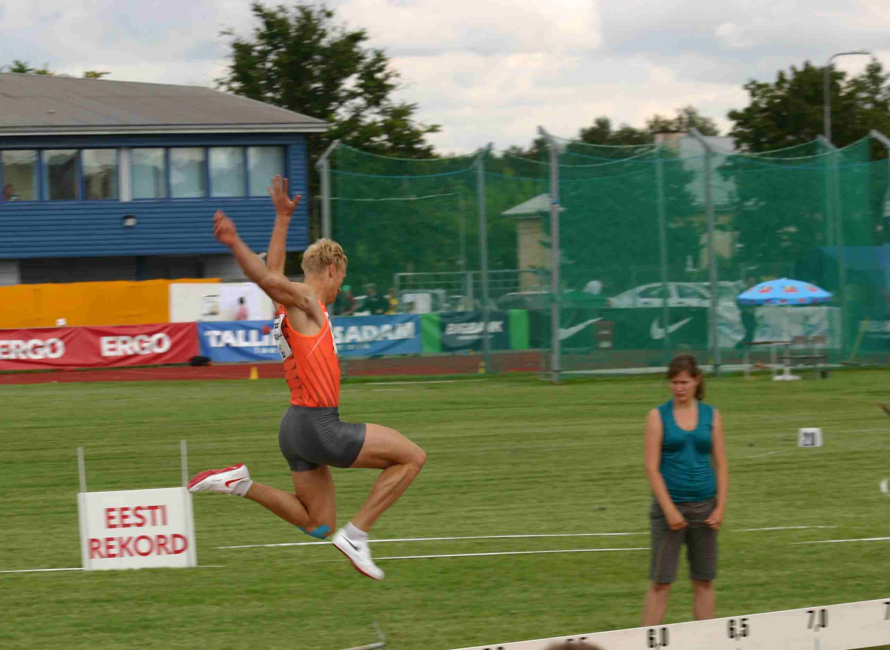
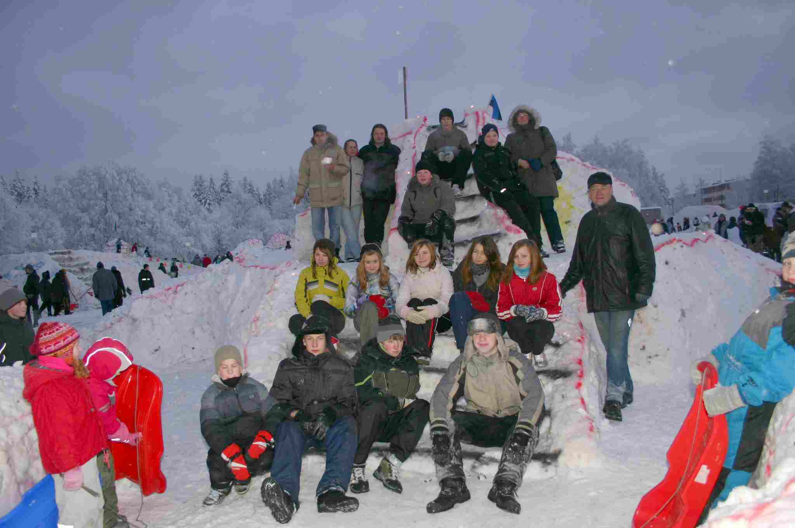
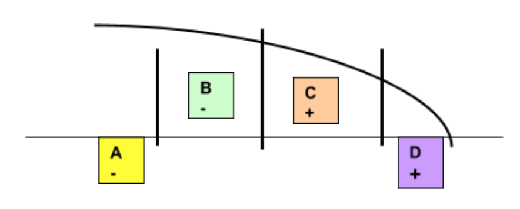

# 6. Koostöö ja kommunikatsioon

Selle teema materjale läbi töötades saad üldteadmised meeskonnatööst ja kommunikatsioonist organisatsioonis.

## A.6.1 Meeskonnad

Selle alateema materjale läbi töötades saad teadmised meeskondade liikmete rollidest, koostöö toimimisest ja eelistest.

::: warning

**A.6.1.1**
Määratleda mõisted grupp ja meeskond ning kirjeldada nende motivatsioonitasemete erinevust.

**A.6.1.2**
Selgitada meeskondade rolle ja teha vahet sisu loomisel ja meeskonna töö toetamisel.

**A.6.1.3**

Tuua välja peamised väljakutsed, mis esinevad rühmade ja meeskondade koostöö puhul.

:::

Inimene on oma olemuselt sotsiaalne s.t. ta püüab olla koos teistega ja tegutseda ühiselt. Koostöös on enamuse elutarvilike ülesannete lahendamine jõukohane. Alates kaubanduse, ja eriti tuntavalt manufaktuuride, tekkimisest süveneb erialane spetsialiseerumine. Selle eesmärgiks on töö tulemuslikkuse tõstmine. H.Fordi loodud tootmisliinid viisid selle tootva tööstuse jaoks viimase mõistliku piirini. See kõik toimib tootvas tööstus. Teenuste ja teadmistepõhises ühiskonnas, mille aluseks on loov mõttetegevus ei ole niisugune töökorraldus tulemuslik, sest mõttetööd ei ole võimalik väga täpselt piiritleda. Samas annab mõtete ühendamisel tekkiv sünergia oluliselt paremaid tulemusi.

#### Loomine

Ühiste tulemuste saavutamiseks luukase meeskonnad, mis peavad toimima ühtse tervikuna. Kõigepealt on selle aluseks üksikute meeskonnaliikmete kokkusobivus ja võime aru saada meeskonna lühi- ja pikaajalistest ülesannetest. Viimased põhinevad reeglina otseselt kogu organisatsiooni, mille raames meeskond töötab, põhiväärtustel ning on sõnastatud tavaliselt organisatsiooni visiooni ja missiooni kaudu. Need sõnastused annavad väljapoole organisatsiooni teada, milleks see on loodud ja mille nimel tegutseb.

Samavõrra tähtis on see ka sisekommunikatsioon töötajatele ja juhtidele. Igapäevatöös peavad kõik juhtimis- ja tegutsemistasandid silmas pidama neid põhiväärtusi. Tavalise keelekasutuse korral mõistetakse meeskonna all väiksemat üksust, mis tegutseb operatiivülesande lahendamisel. Organisatsiooni põhiväärtuste ja eesmärkide laiema sõnastuse kaudu ja nendest juhiste kujundamise läbi on võimalik meeskonnatunne saavutada ka rahvusvahelistes korporatsioonides. Eriti oluline on see tänapäeval, kus valdkondade juhtimine on geograafiliselt hajutatud.

#### Eesmärk

Väiksemates meeskondades suurema organisatsooni sees ei ole reeglina mõttekas ega võimalik sõnastada väga üldiseid eesmärke. Siin on oluline, et kõigile meeskonna liikmetele oleks selge tehtava töö eesmärk ja selleni viivad tegevused. Rõhutada tuleb, et arusaamine eesmärkidest peab olema kõigi jaoks samasugune. Erinevused, mis paratamatult tekivad inimeste mõistete erineva tõlgendamise tõttu, ei tohi viia põhimõtteliste erimeelsusteni.

Meeskonda sobivuse kõrval on oluline ka iga selle liikme motiveeritus pühenduda eesmärgile. Siin tuleb arvestada, et oluliseks on emotsionaalsed ja alateadvuslikud mehhanismid, mille käsitlemisele on pühendatud palju töid.

#### Käitumine

Inimene lähtub oma tegevuses kindlatest vajadustest alates kõige ilmsematest, milleks on ellujäämine ja füüsiline heaolu, kuni keerukate eksistentsiaalsete elu mõtte otsinguteni. Tulenevalt inimese sotsiaalsest loomusest on paljudele olulisemaks ja mitmeid vajadus katvaks tegevusvaldkonnaks on töö kõigi oma majanduslike, sotsiaalsete ja eneseteostuslike tagajärgedega.

Kõige elementaarsemate s.o. füüsilisest ellujäämisest, staatusest ühiskonnas lähtuvate vajaduste seisukohalt annab töötamine soovitud tulemuse. Samas Maslow püramiidi. (Maslow A.H. (1943) "A Theory of Human Motivation", Psychological Review, 50, 370-396, American Psychological Association, Washington poolt määratletud kõrgemate vajaduste - rahulolu ja eneseteotus ei pruugi see nii olla.

Paljud autorid on kirjutanud vajaduste ja motivatsiooni psühholoogiast ([Ruth Alas](http://www.raamatukoi.ee/cgi-bin/isik?5), [Jaana Liigand](http://www.raamatukoi.ee/cgi-bin/isik?18030) ja [Anu Virovere](http://www.raamatukoi.ee/cgi-bin/isik?18029) Organisatsioonikäitumine [Külim](http://www.raamatukoi.ee/cgi-bin/kirjastus?48) 2005), inimeste vahelistest suhetest ja organisatsiooniteooriast (Lemmik, J. Organisatsiooni struktuur ja disain. [http://www.riigikantselei.ee/arhiiv/atp/Koolitus/oppematerjal/](http://www.riigikantselei.ee/arhiiv/atp/Koolitus/oppematerjal/) orgstr.htm Riigikantselei 1999). Oluline on teada inimeste käitumise põhjuseid erinevates olukordades ja organisatsioonides. Neid teemasid käsitleb organisatsiooniteoorias otsustusi käsitlevad osad.

Inimeste käitumine organisatsioonis on määratud paljude tegurite kombinatsioonist, milles oma osa mängivad hetke kontekst, kultuur, isikuomadused ja palju muud. Näiteks korra- ehk distsipliini austus, mis väljendub kehtestatud eeskirjade järgimises, strateegiliste ja operatiivsete tööplaanide jälgimises ja meeskonna liidrite arvamuse arvestamises.

Väga oluline on sobivus meeskonda, mis põhineb kõigepealt isikuomadustel ja seejärel isiklike huvide ja ühiste eesmärkide kooskõlalisusel. Täpsemalt väljendub see töö sisu ühildamises oma isiklike huvidega, tööandja poolt saadavate otseste rahaliste või majanduslike hüvede väärtustamises või ametikoha vastutustasemest tuleneva prestiiži ja võimu kaudu. Töö korralduslike möödalaskmiste tõttu (kontrolli nõrkus, või ka vastupidi ülejõu käivad ülesanded) tekib oht käitumise mugandumiseks. Tekib omakasupüüdlikkus. Niisugusel juhul on organisatsiooni juhtkonna ülesandeks rakendad motivatsioonimehhanisme, mille aluseks on inimest mõjutavad keskkonna, kultuuri ja ka emotsionaalsed tegurid. Motivatsioonimehhanismide kaudu pakutakse töötajatele tunnustuse ja materiaalsete vajaduste rahuldamist. Materiaalsete viiside aluseks on palga- ja preemiasüsteemi kooskõla organisatsiooni üldise töökorraldusega. Eraettevõtetes on sageli kastusel ka osaluse pakkumine töötajatele s.o. motiveerimine läbi omanikuks olemise. Tunnustamine algab eelkõige töötajate kaasamisest ettevõtte otsustusmehhanismi.

#### Sobivus

Pöördudes tagasi meeskonda sobivuse teema juurde peab rõhutama meeskonna loojate vastutust liikmete valikul, eelkõige isikuomaduste järgi. Kui võimalikul kandidaadil on olemas tegevusvaldkonna põhiteadmised, siis meeskonna ees seisva ülesande lahendamiseks on võimalik juurde õppida vajalikud konkreetsed teadmised. Samas isikuomadusi, mis määravad meeskonda sobivuse, ei ole reeglina võimalik muuta suurtes piirides. Isikuomaduste pinnalt võib tekkida asjatu rivaalitsemine, mis väljendub näiteks kolleegide arvamuse eiramises, ja teiselt poolt eirataval võib tekkida üksindustunne. Viimase äärmuslikud vormid võivad viia ka destruktiivse käitumiseni. Juhtimisvead "lamedas" organisatsioonis omavad seejuures olulist rolli. Ühe kolleegi või väiksema rühma liigne võimukus, mida meeskonna loomisel ei eeldatud võib halvata töö tulemuslikkuse.

Meeskonda sobivuse hindamisel tuleb arvestada kandidaadi kultuurilist tausta (päritolust tulenev meelelaad, religioossus jne.) ja isikuomadusi, nagu teiste innustamise võime, arusaamisvõime ja kaasamisoskused. Taibukus, loomingulisus, taktitunne ja huumorimeel on alati hinnatud. Tööülesannete järgi peab vaatama kandidaadi sobivust lähtuvalt tema haldamis- ja juhtimisvõimetest ning analüütilisest või strateegilisest mõtteviisist.

#### Koostöö

Motivatsiooni osa tänapäeva "lamedas" organisatsioonis tuleb järjest rohkem esile. Hierarhilises organisatsioonis on (õigemini oli) suurem osa ülevalt alla lähtuval käsul. Teadmuspõhise töö korral on oluline arvestada igaühe panust vastavalt tema oskustele, teadmistele ja kompetentsidele. Alluvussuhted on olulised, kuid mitte niivõrd enam töö sisu osas. See tähendab, et suhted inimeste vahel on rohkem tasakaalustatud ja suunatud kõigi kaasamisele.

Väga mitmeid näiteid saab tuua, kus koostöö ja võistluse omavaheline suhe on väga ülevaatlik analüüsiks. Eesmärk on meeskonnas vältida sisemist räiget rivaalitsemist ja ühiste eesmärkide saavutamiseks luuakse hea emotsionaalne õhkkond. Joonisel toodud piltidel on tegutsejad täiesti erinevates olukordades - meeskonna eest võistlemas nn. individuaalalal ja koos meeskonnaga midagi ehitamas. Esimesel juhul tuleb igaühel saavutada parim tulemus ainult ise-enesele lootes. Teisel juhul on oluline saavutada hea koostöö parima ja üldistele eesmärkidele suunatu saavutamiseks.





_Joonis 6-1. Võistlusolukord üksikalal ja meeskonna koostöös tehtav lumelinn, mis ilmestavad erinevaid käitumismalle meeskonnas sõltuvalt olukorrast (autori fotod)_

Üldjuhul on meeskond määratletud inimeste kogumina, kes püüavad saavutada ühiselt püstitatud eesmärke jagades selleks omavahel rollid ja ülesanded nii, et igaühe võimed, oskused ja kogemused saaksid kõige paremini rakenduse ja leiaks väärtustamist. Selle saavutamiseks peab iga meeskonna liige teadma oma võimeid ja oskusi ja neist ka ilmutatult teistele teada andma, allutama oma töö koostöö huvidele parima tulemuse saavutamise nimel.

Igale organisatsioonile on oluline saavutada oma eesmärgid. Eespool oli juba mainitud põhiväärtuste edastamise vajadus iga töötajani. See ei saa olla tulemuslik, kui ei arvestata ega väärtustata inimestevahelisi suhteid. Need põhinevad individuaalsetele võimekustele, mida tuleb arendada meeskonnatöö oskusi silmas pidades. Asjakohased treeningud annavad meeskonnale parima tulemuse ühise õppimise kaudu. Sobivaks vormiks saab olla näiteks meeskonna treening ja arenguvestlus..

#### Rollid

Nii nagu meeskonnad võivad ka rollid projekti meeskonnas olla lühiajalised või pikemaajalised, kuid neil on palju ühiseid jooni rollidega pidevalt toimivas organisatsioonis. Ka väga kiirelt muutvate vaheeesmärkidega ja rollidega projektides (nn. "agiilne" või ekstreem või XP tarkvara arendus) on otstarbekas määrata osalejate rollid s.o. vastutusala ja panus eesmärgi saavutamisse väga täpselt. Parim meeskond on see, kus kõik liikmed on aktiivsed ja oskavad koos töötada s.t. toimub pidev taktikaline infovahetus ning see aitab kaasa probleemide lahendamisele, mitte ei tekita neid juurde. Vastupidisel juhul tuleb kulutada lisaaega ja jõudu koostöö reeglistiku selgitamisele, et vältida sisekliimat halvendavaid ja tulemuste saavutamist pärssivaid mittemõistmisi.

#### Töövahendid

Tänapäeval ei ole tehniliselt väga oluline, kas koostööd tehakse ühises geograafilises paigas või ollakse üksteisest eemal. Olulisem on ühise töö tegemine vastastikku tunnustatud väärtuste alusel. Ilma ühiste arusaamadeta ei teki edukaks tööks väga vajalikku meeskonna vaimu. Vahemaa meeskonna liikmete vahel võib piirduda vaid korrusega suuremas hoones või olla üle mitme ajavööndi. Niisuguse "virtuaalse meeskonna" töö nõuab hästi toimivat kooskõlastamist, sest kõik liikmed on suhteliselt sõltumatud. Töö eelduseks on eelkõige koostöövalmidus, selged organisatsioonilised protseduurid ja kindel meeskonna liikmete omavaheline struktuur.

Tehniliselt sobivad paljud IT rakendused meeskonnatöö korraldamiseks kaugemate ja lühemate vahemaade korral:

- e-post (meiler, veebirakendus arvutis või telefonis)
- listid (Addressbook list, listi server oma ettevõttes või vaba kasutus, näiteks [www.yahoogroups.com](http://www.yahoogroups.com/), [http://groups.google.com](http://groups.google.com/) vms)
- ühiskasutuses serveriruum (FTP)
- IPVoice (Skype, MSN)
- videokonverents (videokonverentsi lahendused, Skype, MSN)
- failide kiirvahetus (Skype, MSN, e-post, veebirakendused)
- arvuti töölaua jagamine (erirakendused, MSN)
- jututoad (Skype, MSN).

Sõltuvalt koostöö vormist on vahel otstarbekas eristada koostöö vorme. Inglise keeles kasutakse mõisteid "co-operate" ja "collaborate". Eesti keelde tõlgitakse need mõlemad koostöö tegemisena. Esimene tähendab reeglina erinevates meeskondades (organisatsioonide või struktuuriüksuste tasemel) töötamist ja teine ühises meeskonnas tööd. Esimesel juhul on suhted formaalsemad ja põhinevad rohkem lepingutel või virtuaalsete meeskondade puhul selgetest protseduurireeglitest s.t. see on koordineerimisel põhinev koostöö. Teisel juhul jagatakse ühiseid töömeetodeid ja -vahendeid, mis on sisulisele tööle palju lähemal s.t. see on koos töötamisel põhinev.

### A.6.1 Kordamisküsimused

::: tip Kordamisküsimused

1. Missugune on trend organisatsioonide juhtimise struktuuris viimastel aastatel:

- organisatsioonid muutuvad tsentraliseeritumateks
- organisatsioonide juhtkonna suurus kasvab kiiresti
- organisatsioonide juhtimine muutub "lamedamaks" s.t. organisatsioonid muutuvad paindlikumaks X

2. Mis määravad organisatsiooni lühi- ja pikaajalistest ülesanded:

- projektimeeskondade ettepanekud muudatusteks tööprotsessides
- põhiväärtused, mis on sõnastatud tavaliselt organisatsiooni visiooni ja missiooni kaudu X
- organisatsioonide juhtimises kasutatava parima praktika alus kujundatava igapäevatöö

3. Kas isikuomadusi, mis määravad inimese meeskonda sobivuse, on:

- suurtes piiride muudetavad
- inimese põhiomadused ja neid ei ole reeglina võimalik muuta suurtes piirides X
- on õpitavad ja kohandatavad iga meeskonna jaoks eraldivõetuna

:::

## A.6.2 IT mõisted ja määratlused - kasutamine suhtluses

::: danger Puuduv seos ja materjal

Õppekava peatüki ja õppematerjali peatüki vahel puudub seos, hajutatud meeskondade õppematerjal puudub:

**6.2 Ülemaailmselt hajutatud meeskonnad**

**A.6.2.1**

Kirjeldada ärilist väärtust, mida on võimalik saada ülemaailmselt hajutatud meeskondadega.

**A.6.2.2**

Loetleda tüüpilised ärivaldkonnad, mida saab katta ülemaailmselt hajutatud meeskondadega.

**A.6.2.3**
Tuua välja organisatsionile ja juhtimisele esitatavad väljakutsed ülemaailmselt hajutatud meeskondade poolt.

:::

Selle alateema materjale läbi töötades saad teadmised ettevõttes kommunikatsiooni korraldamisest.

#### IT mõisted ja määratlused - kasutamine suhtluses

Tavaliselt on igas organisatsioonis koos töötamas mitme eriala inimesi. Eelmises peatükis kirjeldasime organisatsiooni meeskonna loomise ja koostöö põhimõtteid. Märkisime suhtluse olulisust edukaks koostööks. Suhtlemine võib olla suuline või kirjalik, vahetu või vahendatud. Igal juhul peavad olema olemas kommunikatsiooniks täidetud teatud tingimused.

Kommunikatsiooniprotsess meenutab postiteenust:

- saatja peab saatma saajale teate
- teade edastatakse saajale arusaadavas kontekstis
- saaja on võimeline teadet lugema (dešifreerima)
- teade saatjalt saajale edastatakse "vahendaja" (näiteks serveri) kaudu, mis täidab postiljoni rolli.

Informatsiooni võib edastada erinevalt:

- tekstina
- heli ja pildina.

Kommunikatsiooni peetakse edukaks, kui info edastati saatjalt saajale, saaja sai aru, mida saadeti ja dešifreeris selle korrektselt. See väide kehtib nii tehnoloogilises mõttes (näiteks infovahetuskeskkonna X-tee teenus), kui ka psühholoogilises (inimestevaheline suhtlemine).

#### Suhtlus

Organisatsioonis tekib erinevaid olukordi, mis määravad info edastamise viisi, mis sõltub kommunikatsioonis osalejate arvust ja edastamise suunast. Nende järgi võib suhtluse liigitada:

- üks-ühele ühesuunaline (inglise keeles: mono-, unidirectional). Edastatakse käsk, tellimus, teade, kiri jne. Telekommunikatsioonis on kasutusel mõiste "simpleks" side
- üks-ühele kahesuunaline (inglise keeles: bidirectional). See on dialoog, vestlus, suuline eksam jne. Telekommunikatsioonis on kasutusel mõiste "dupleks" side
- üks-mitmele ühesuunaline. Edastatakse käsk või palve, koosoleku sõnavõtud, kõne, reklaam, hoiatussignaalid jne.
- üks-mitmele kahesuunaline. Loengu või konverentsi vorm osalise kahepoolse infovahetusega
- mitu-mitmele. Koosolek või koosviibimine, konverentsi paneeldiskussioon.

Näited

Näidetena saab tuua järgmisi kommunikatsiooni viise:

- **loeng või kõne,** mille esitab organisatsiooniliselt (kas loengu pidajana ajutiselt või organisatsiooni struktuuris pidevalt) hierarhiliselt kõrgemal positsioonil olev inimene paljudele kuulajatele
- **ettekanne või esitlus,** milles ettekande pidaja viib kuulajad läbi teema poolt etteantud teed pidi kasutades selleks eelkõige oma isiklikke oskusi ja sarmi ning seejärel esitlustehnikat ja muid toetavaid vahendeid
- **ümarlaud,** milles osalised on asjatundjad. Nad esitavad oma arvamuse käsitletava teema kohta. Reeglina ei kasutata pikemaid ettevalmistatud ettekandeid vaid piirdutakse sissejuhatava sõnavõtuga ja selle järgneva aruteluga.
- **koosolek** kindla päevakorra alusel aruteluks ja reeglina ka otsuste vastuvõtmiseks, kui koosolekust osavõtjatel on selleks olemas kõik pädevused. Arvamuste avaldamine toimub järjekorras ja rangelt päevakorda järgides.
- **ajurünnak** n mitteformaalne koosolek uute ideede saamiseks mingi olulise probleemi lahendamisel. Üks vältimatuid reegleid on kriitikast hoidumine s.t. ei asuta kohe pakutud ideid arutama ja hindama vaid püütakse neid edasi arendada.
- **dialoog/vestlus** kahe või enama inimese/spetsialisti vahel.

Näidetest on näha, et kahesuunalisus suhtlus eeldab osapoolte füüsilist või virtuaalset kohaleolekut sama ajal. Ühesuunalisus ei eelda seda ja võib seega olla asünkroonne s.t. ajalise nihkega.

Sõltuvalt kommunikatsiooni eesmärgist ja valitud teest selleni luuakse vahendid. Teadma peab seejuures mõju mida avaldavad erinevad lähenemisviisid - usalduslikkus ja "silma tegemine", formaalne ja külm või vaenulik ja pealetükkiv esitlusviis. Rõhuasetus ja toon annavad teoreetiliselt samasugusele sõnumile või edastatava sisule täiesti erineva tähenduse.

#### Sõnumi edastamine

Sõnaline suhtlus on kõige enam välja arenenud, seda nii inimestevahelises suhtluses ja tinglikult ka inimeste ja masinate ning masin-masin suhtluses. Inimestevahelises suhtluses on oluliseks teguriks sõnumi edastaja usaldatavus ja sellel on paljudel juhtudel allutatud sõnumi sisu ratsionaalne vastuvõtt. Usalduslikkust hakatakse looma esimesest hetkest ning sõnalise suhtluse kõrval on olulised veel ka mittesõnalised elemendid ehk märgid, mille annavad rääkija kehakeel, riietus ja enese ülalpidamine. Väljakujunenud traditsioonidega suhtluskondades (äri-, spordimaailm jne.) on enamusel juhtudel oluline jälgida väljakujunenud tava. Eneseväljendus on siin suure tähtsusega.

Ühte teadet võib edastada mitmel viisil. Ajalehe uudised, mis teatavad ühest ja samast sündmusest: "Hundid murdsid viis lammast" ja "Jahimees tappis koleda kiskja" kannavad väga erinevat sõnumit lugejale. Pealkirjas on juba sees ajakirjaniku suhtumine kannatanud lammastesse või tublisse jahimehesse. (M.Ehala, Ajaleht Postimees, lisa AK, 3.mai 2008)

Sõnalise suhtluse juures on oluline keelekasutus. Kindlaim viis on kasutada väljakujunenud ja kõigile arusaadavat terminoloogiat oma ideede ja arusaamade selgitamisel. Pikemaajalisel suhtlemisel võivad tekkida inimeste vahel spontaansed meeskonnad ja sõpruskonnad, mille sees areneb välja oma keelekasutus, mis laiema leviku korral täiendab olemasolevat žargooni. Selles kogukonnas on välja kujunenud keelekasutus õigustatud ja probleeme sellest ei teki. Esinedes muudes auditooriumites tuleb jälgida žargooni kasutust ja parasiitsõnade siselipsamist teksti. Žargooni kasutus on õigustatud vaid juhul, kui kõik osalejad valdavad seda täielikult ning tegu on mitteformaalse infovahetusega.

#### Sõnumi täpsus

Sõltumata sellest, kas kasutatakse väljakujunenud klassikalist terminoloogiat või kitsama ringi keelt e. žargooni on peaaegu vältimatu, et tekivad arusaamatused ja vääritimõistmised suhtlemisel. Alati on erineva taustaga inimeste arusaamad mõistete sisust ja ulatusest erinevad. Probleemiks on ka mõtteviis, et täislauseteta ja hoolimatu keelekasutus võimaldab täielikku ja ise-enesest mõistetavat teabe edastust. Selle aluseks on võimetus mõista teiste mõttemaailma ja tausta. IT spetsialisti eetikakoodeks kohustab kõiki hoidma kõrgel kutseväärikust ja järgima kõrget erialast eetikat. Kahtlemata on siin üheks osaks ka väga hea keelekasutus. Kindlasti ei kuulu niisuguse keelekasutuse juurde akronüümide (esitähelühendid) ja muud mugandused, žargoon ja släng. Nende kasutamine nõuab kindlasti selgitusi asjasse mittepühendunutele.

Lubamatu oma eriala žargooni pealesurumine koostööpartneritele ja klientidele. Žargooni ja slängi kasutamine tekitab ikkagi arusaamatusi ja vääritimõistmisi. Eriti on see tuntav maades, kus inglise keel, millest pärinevad enamus infotehnoloogia termineid, pole enamusele emakeel. Selle põhjuseks on paljude lühendite mitmetähenduslikkus ning edastatav sõnum läheb kuulajate/lugejate jaoks lihtsalt kaotsi. Avaliku esinemise korral viib niisugune olukord hetkeliselt auditooriumi huvi kaotamiseni pakutava vastu.

Oma seisukohtade edastamisel laiemale kuulajaskonnale tuleb jälgida keelekasutuse kõrval auditooriumi arusaamise ja vastuvõtuvõime taset, mis võimaldaks edastatava teabe omandada igavust tundmata või arusaamatud ja liigkeerukaid kohti kohates s.t. triviaalsused ja keerukused on iga auditooriumi puhul suhtelised mõisted. Näidete ja võrdluste esitamine peab andma võimaluse kasutada assotsiatiivset mõtlemist teabest arusaamiseks. Akronüümid ja lühendid teevad esituse kohati kompaktsemaks ja väldivad lohisevaid lausevorme, kuid liigsel pruukimisel teevad materjali raskesti jälgitavaks. See on täheldatav, kui kasutatakse mingite kindlate tehnoloogiate puhul loodud kujundlikke termineid või ujutatakse kuulajad/lugejad üle kindla tarnija tootenimede ja tehniliste arvandmetega.

Igal ettekandel ja sõnavõtul peab olema selgelt püstitatud eesmärk, mida tahetakse saavutada. Teabe edastaja peab teadma, mis on asjakohane, huvitav ja arusaadav esitada oma auditooriumile või suhtluspartneritele.

Kurbadeks näideteks on mitmesugused teadaanded. Olgu siinkohal toodud üks e‑kirjaga saabunud kutse (tekst esitatud lõika-aseta toimingutega), mis kindlasti ei saavuta oma eesmärki, sest lugejale asjast arusaamine on tehtud liiga raskeks:

```
Tere,

14. mail toimub seminar / tootetutvustus!

Kutsume sind osalema mõne tunnisel seminaril, kus tutvustame ja näitame kuidas töötavad:

ZXTM – 5.0 uus versioon uute ja põnevate omadustega

ja

ZXTM Global Load Balancer (ZXTM GLB)**

Juttu tuleb ZXTM uuest versioonist, kus on mitmeid uusi ja põnevaid, kui mitte ütelda vingeid, omadusi, mis veelgi tõhustavad võrgu- ja veebitoega rakenduste ning nende andmesideliikluse koormuse jaotust ja haldamist, nii ühe kui mitme datacenteri vahel.

Loe lähemalt ZXTM kohta: http://www.zeus.com

Seminar on TASUTA
```

#### Kordamisküsimused

1. Serveriruumi uksel on silt "Kõrvalistel isikutel ruumis viibimine keelatud!". Kas see teate edastamise viis on:

- üks-ühele teabe edastus
- üks-mitmele teabe edastus X
- mitu-mitmele teabe edastus

2. Millal on otstarbekas korraldada ajurünnak?

- täiesti uute lähenemiste saamiseks probleemi lahendamisel X
- mitteregulaarse operatiivinfo edastamiseks
- osakonna tootmisülesannete tutvustamiseks

## A.6.3 IT spetsialistide ja äripersonali dialoog

::: danger Puuduv seos ja materjal

Õppekava peatüki ja õppematerjali peatüki vahel puudub seos, sotsiaalvõrgustike õppematerjal asub:

**A.6.3 Sotsiaalvõrgustikud**

**A.6.3.1**

Kirjeldada sotsiaalvõrgustikke ja nende põhiomadusi.

**A.6.3.2**

Näidata sotsiaalvõrgustike kasutamise võimalusi ärirakendusena nt uued reklaami- ja marketingistrateegiad, uute ärivõrgustike loomine, tõhusam koostöö virtuaalkeskkondades.

**A.6.3.3**

Selgitada sotsiaalvõrgustike mõju uute koostöövormide ja sotsiaalse kaasatuse tekkimisele.

:::

Selle alateema materjale läbi töötades õpid:

- Määratlema infotehnoloogia rolli ettevõtte eesmärkide saavutamisel
- Kirjeldama infotehnoloogiat kui võimaluste kogumit organisatsioonis
- Kirjeldama infotehnoloogiat kui organisatsiooni osa.

### A.6.3.1 IT spetsialistide ja äripersonali dialoog

Vähe on neid ettevõtteid, kus täna ei kasutata infotehnoloogia vahendeid töö korraldamisel otseselt või kaudselt. Paljudes organisatsioonides on IT lahenduste kasutamine missioonikriitilise tähtsusega s.o. ilma nendeta ei saa toimuda organisatsiooni põhiprotsessid. Kindlasti on niisugusteks täna pangad ja riigiasutused Eestis.

Sõltumata sellest, kas organisatsioonis on olemas oma IT spetsialistid või ostetakse see teenus sisse, peavad põhitegevuse eest vastutajad ja IT teenuste ja lahenduste pakkujad leidma ühise keele eesmärkide saavutamiseks. Eelmises peatükis oli juttu kommunikatsioonist ja keelekasutusest. Nüüd tuleb vaatluse alla võtta ka suhtluse üksikud vormid.

Lähtudes suhtlemise praktikast on ilmne, et asjaliku ja tulemusliku arutelu saavutamiseks peab tähelepanu kommunikatsioonis olema pööratud võtmeisikutele väiksema suhtlusringi korral või kogu auditooriumile suurema osavõtjate ringi korral. See puudutab teabe edastusvõimet, kuulamisvõimet, arusaamist ja samastumisvõimet auditooriumiga (empaatia).

Näost-näkku kohtumistel s.o. seminaridel, koosolekutel, esitlustel jne. on oluline igaühel, kes juhatab üritust või esitab oma seisukohti ja mõtteid tarvilik silmas pidada järgmist (A.Kotchubei, Koosoleku juhtimise kunst 2006, Äripäeva Kirjastus):

- Kokkusaamise õnnestumisele aitab kaasa põhjuste ja eesmärkide selgitamine. Erandiks võivad siin olla perioodilised formaalsed kooolekud. Koosoleku päevakorra üksikpunktid ei kuulu selle erandi alla.
- Kokkusaamise osalejad saavad ühteviisi aru eesmärkidest ja kui võimalik, siis saavutada see aktiivse kaasamisega, mitte vaikiva nõusoleku kaudu.
- Täpselt sõnastatud ootused kokkusaamise tulemustele.
- Kohe kindlaks määratud piirangud esinemiste ajale ja diskussioonile ja ka sõnavõtjate kompetentsusele. Kompetentsuse nõuded esitab ka kutse-eetika koodeks.
- Seisukohtade täie selgusega esitamine.

Tehniliselt on arutelu hästi jälgitav, kui see sisaldab näiteid. Tsitaadid ja anekdoodid ilmestavad ettekannet ja tekkivate seoste kaudu aitavad paremini meelde jätta esitatavat sõnumit. Kõneleja peab olema suunatud nii otseselt kui kaudselt oma mõtetes auditooriumi poole ja seda sõltumata auditooriumi koosseisust. Kaasa aitab silmside, mis loob meeldiva õhkkonna ja võimaldab kaasata kõiki arutelusse ega tekita "kõrvalejäetuse" tunnet. Koosolekud ja ettekanded tuleb lõpetada kiirete kokkuvõtetega esitatud seisukohtadest ja piisavavalt peab jääma aega küsimuste ja vastuste esitamiseks. See aitab sageli tuua välja ettekannete tõelise sisu.

#### Tehnoloogia vs äri

Oluline on aru saada, "tehnoloogia inimeste" ja "äri-inimeste" suhetest organisatsioonis. Sõltumata sellest, et oma erialaselt kasutakse kitsamas ringis kutsealale omast väljendusviisi, peavad nad suutma üksteisele selgitada oma seisukohti ja põhjendada valitud tegevusi. Üheks olulisemaks teguriks siin on korralik ja loogiline s.t. üldarusaadav keelekasutus. Infotehnoloogia spetsialistid peavad suhetes oma klientidega, kelleks on ka teiste erialade kolleegid samas organisatsioonis, suutma selgitada oma tegevusi ja plaane vaatamata sellel, et klientidel ei ole tehnoloogiavaldkonna sügavaid teadmisi ja oskusi selle kasutamiseks. Erinevate spetsialistide koostöös peavad kõik osapooled alati silmas pidama organisatsiooni üldisi ja konkreetseid eesmärke, mille nimel võetakse uued tehnoloogiad ja infotehnoloogilisi vahendeid.

IT spetsialistidel on siin kahene roll. Tuleb seista ettevõtte põhiprotsesside toimimise eest ja kindlasti teha ka ettepanekuid nende muutmiseks, kui uute tehnoloogiate kasutuselevõtmine aitab muuta tööd tulemuslikumaks. Enamasti eeldab see tegevuste ümberkorraldamist organisatsioonis. Ohuks on siin tehnoloogilise üleküllastuse lõksu langemine, mille puhul unustatakse tehnoloogiate rakendamise majanduslik mõttekus. IT spetsialistide kohustuseks ongi näidata infotehnoloogia kui võimaldaja rolli organisatsiooni arengus. Näidetena on siin asjakohane tuua nüüdseks juba loendamatu hulk "e-" ja "m-teenuseid" alates internatipoodidest panganduse ja mobiilparkimiseni.

#### Sõnumi täpsus

Näiteks lihatööstuse üldiseks eesmärgiks on oma toodanguga pakkuda kaaskodanikele rikkalikku toidulauda ja see eesmärk sõnastatakse missioonis kujul: Pakume parimat maitseelamust tervislike lihatoodetega. Siit on näha, et peaeesmärgiks on toiduainete tootmine, millele korralik infosüsteem saab anda vaid lisaväärtust põhiprotsesside tagamisel. Infosüsteem võimaldab juhtkonnal teha juhtimisotsuseid kiiremini ja täpsemalt, kui neile esitatakse asjakohane informatsioon. Samuti peaks infosüsteem tagama tootmisprotsessis retseptidest täpse järgimise andes seadmetele õiged juhised komponentide lisamiseks ja muude tehnoloogiliste operatsioonide sooritamiseks.

Kokkuvõttes annavad kirjeldatud tegevused oma osa ettevõtte äri hindamisel. Seetõttu hinnang infotehnoloogia rakendamise tulemuslikkusele saab olla vaid läbi põhiprotsesside toetamise kriteeriumite. Vähetähtsateks osutuvad üksikud ülikavalad ja keerukad tehnilised "nipid" infosüsteemi sees, kui need ei vii heale või üliheale lõpptulemusele ehk organisatsiooni toimimise oluliste tunnuste parenemisele. Üldiste eesmärkide nimel on paljudes organisatsioonides ühildatud infotehnoloogia juhi kohustused mõne teise valdkonna kohustustega sõltuvana kogu toimimise eesmärkidest ja äriprotsesside loogikast. Nii välditakse suunatust vaid ühele kitsale valdkonnale, mille käigus laiem eesmärk võib ähmastuda. Organisatsioonides, kus IT omab missioonikriitilist tähtsust s.t ilma IT-ta ei saa toimida põhiprotsessid, nii toimida ei tohi.

Infosüsteemide tulemusliku toimimise eelduseks ja nende muutumine osaks ettevõtte väärtusahelas, on hea planeerimine ja plaanitu elluviimine hea projektijuhtimise kaudu. Ilma üksteist mõistva suhtluseta on see võimatu. Organisatsiooni mõlemad osapooled meie vaadeldaval juhul - "äri" ja IT - peavad suutma ennast väljendada korrektselt ja teisele osapoolele (ja mitte ainult neile) arusaadavalt. Tehnilised väärtused kummalgi pool ei tohi saada väärtuseks omaette, vaid peavad olema kooskõlas põhieesmärkidega - kliendi rahulolu, kvaliteet, tööviljakus jne.

### A.6.3.2 Kordamisküsimused

Missugune alljärgnevatest viib organisatsiooni, mille tegevuses on IT-l väga oluline roll, arengus parima tulemuseni, kui tegevuses peetaks silmas eelkõige ainult üht tegutsemisviisi:

- IT-spetsialistid annavad endast parima oma isiklike eesmärkide saavutamiseks
- äri- ja IT juhtide vahel on kindel üksteisemõistmine organisatsiooni üldiste eesmärkide saavutamise teedest X
- ärijuhid arvestavad organisatsiooni arendamisel ainult inimestest tulenevate võimaluste ja piirangutega

## A.6.4 Muutuste algatamine

Selle alateema materjale läbi töötades õpid:

- Kirjeldama tõhusa suhtluse vajadust ettevõtte talitluses
- Tundma uue tehnoloogia aktsepteerimiseks vajalikke motivatsioonitegureid
- Tundma muutustele vastuseisu põhjustavaid tegureid.

#### Muutuste algatamine

Muudatused võivad olla kas oodatud või mitte oodatud, aga tänapäeval on nende vältimine võimatu. Muudatuste juhtimine peab sisaldama oma olemuselt mõttelist arengut, planeerimist, hoolikat rakendamist, seiret ja konsultatsiooni ning selle kõige juures inimeste kaasamist protsesside mõjutamisse. Muudatus peab olema realistlik, saavutatav ja mingil viisil mõõdetav. Muudatuse protsessis peavad olema mõningad indikaatorid iga etapi edu mõõtmiseks juba enne alustamist. See võimaldab näha iga etapi arengut ja teeb progressi nähtavaks.

Muudatuste juhtimine on osa organisatsioonilistest muutustest ja teisalt ka osa individuaalsetest muutustest. Ei ole olemas kindlat üheselt mõõdetavat lähenemisviisi muudatuste juhtimisele. Iga organisatsioon peab hindama oma unikaalset kultuuri ja vastuvõtlikkust muutustele ning arendama sellele profiilile vastava muudatuste juhtimise strateegia.

Muudatuse tegemine nõuab võimet ja valmisolekut loobuda paljuski endisel viisil mõtlemast ja asju teostamast. Töötajad võivad muudatuste läbi viimise ajal toimida ebakindlalt. Võime võtta riske ja valmisolek uuesti õppida protsesse on juhtimise jaoks oluline faktor. Antud juhul vaatleme põhiliselt juhtimise perspektiivist, kuid töötajate perspektiiv on samuti tähtis.

#### Juhtkonna osa muutustes

Inimesi ei saa tagant sundida ja kiirustada muutuma. Juhtkonnal on vastutus muudatuste juhtimisel, töötajatele ei saa vastutust panna. Nende vastutusalas on teha oma tööd parimal viisil muudatuste protsessi jooksul. Juhtimine mõjutab suuresti organisatsiooni-kultuuri ning võib seda teha positiivselt või negatiivselt.

Viis, kuidas töötajad käsitlevad muudatusi, on iga isiku jaoks erinev ning sõltub suurest hulgast faktoritest: vanus, sugu, isiksus, motivatsioon, senine muudatuste kogemus. Erinevaid inimesi, erinevaid muudatusi ja erinevaid muudatuste faase tuleb juhtida erinevate meetoditega. Neid individuaalseid erinevusi tuleb respekteerida, toetada ja ära kasutada.

Olulisim asi juhtimisel on näidata inimestele, et nad on üks osa muudatuste protsessist. Inimesed tahavad tunda, et nad on osa millestki suuremast ja olulisemast kui nad ise. Kui nad mõistavad suunda ja nende osa soovitud tulemuste teoks saamisel, siis nad võivad efektiivselt koostööd teha. Juhtkonna vastutusalas on hõlbustada ja kergendada muudatusi ning samuti aidata töötajatel mõista põhjusi, eesmärke, nagu ka kogu strateegilist raamistikku koos missiooni, visiooni ja väärtustega. Oluline on vastata positiivselt (mitte hinnanguid andvalt) muudatusele ja töötajate reaktsioonidele. Juhtimine peab aitama töötajail näha muutust kui võimalust ja juhtimine peab demonstreerima seda nende endi reaktsioonis muutusele. Tähtis on ka näha tasakaalu muudatuse ja püsiväärtuse vahel.

**Toetavad funktsioonid, kommunikatsioon ja motivatsioon**

Joonis A.6.2. Muudatuse juhtimise protsess

#### Vastuseis

Inimeste vastuseis muutustele on üks peamisi väljakutseid, millega ettevõtted muudatuste alustamisel silmitsi seisavad. Tavaliselt on kaks peamist põhjust, miks inimesed on uute tehnoloogiate või uuel viisil töötamise vastu: esiteks, neil ei ole piisavalt oskusi tehnoloogiat kasutada või sellega kasu teenida. Teiseks, nad ei mõista, kuidas nad muudavad äritegemisi viisi ja protsessid teostuvad. Kui ei ole valmisolekut muutusteks või organisatsioonis valitsevad kahtlused ja hirm, siis piltlikult öeldes muudatus võistleb käesoleva staatusega ja on väga raske arvata, kumb neist võidab.

Tugev vastuseis muudatustele on sageli tingitud senisest juurdunud kindlustundest. Inimeste aitamiseks niisuguses situatsioonis on tarvis kannatlikkust ja tolerantsi, et näha asju teisiti, järk-järgult. On tarvis meelde jätta, et muudatusteks on vaja mõistlikkust ja loogilist mõtlemist, muidu töötajad ei näe, miks nad peaksid olema osa muudatuse protsessist.

Juhid peavad vastama järgnevatele küsimustele:

- Kas juhtkond on läbi mõelnud ja uurinud kõik ülejäänud võimalused?
- Miks me vajame just sellist muutust, miks ei või organisatsioon jätkata töötamist nii nagu praegu?
- Mida me soovime saavutada antud muudatusega?

Oluline on töötajatele rõhutada, et vastuseis on täiesti loomulik fenomen, keegi ei oota neil maagilist muutumist, transformatsiooni, lihtsalt ava oma vaim ja mõte tulevikule ja muutu. Tuleb meelde jätta, et suuri muudatusi rakendatakse väikeste sammude kaupa. Kui sa pead elevandi ära sööma, siis sa ei söö teda korraga ära, vaid ikka väikeste suutäite kaupa. Sama kehtib muudatuse protsessi kohta. Fookuses on üks muutus korraga, kuid põhieesmärki silmast laskmata.

Iga töötaja on eriline ja omab erinevat tausta ning sellest tulenevalt küsimusi, mis põhjustavad stressi.

Tavaliselt põhjustavad stressi järgnevad faktorid:

- tunne, et olukord ei ole kontrolli all
- tunne, et liigutakse sihitult
- süütunne edasilükkamiste tõttu või võimetus täita kohustusi
- rohkem kohustusi kui nende täitmiseks on aega
- muutused, eriti need muutused, mida sa ise ei algatanud
- ebakindlus
- kõrged lootused (eelkõige endalt)
- muudatus kahjustab inimese enesekontrolli-tunnetust (asjad on kontrolli alt väljas!).

Juhid peavad leidma erinevaid meetodeid töötajate ebakindluse vähendamiseks muudatuste läbiviimisel ja uute tööprotseduuride rakendamisel. Tuleb meeles pidada, et kui töötajad ei saa muudatusest otseselt midagi kasulikku, siis nad võivad kibestuda. Inimene ei ole masin. Avatud kommunikatsioon muudatuse kasuteguritest võib neid veenda ja rahustada.

Inimesed annavad endast parima, kui neile antakse selleks motivatsioon. Juhid peavad kontrollima tegevusi ja võtma enda peale vastutuse. Nad peavad teadma, kuidas ja millal aidata. Juhtimine ja mõistmine on teemad, kus tuleb mängu inimlik faktor.

Juhid peavad vastama järgnevatele küsimustele:

- Kas mul on tööd uues organisatsioonis, pärast muudatusi?
- Mis juhtub, kui ma teen vigu?

Töötajatega tuleb olla kannatlik. Suuremate muudatuste jooksul nad peaksid aktsepteerima, et nad ei omanda kohe kõike ja ei saa kõiges õigesti toimida. Asjad võtavad aega, aga positiivne suhtumine innovatsiooni aitab neid muudatuse protsessi jooksul. Töötajad ei tohiks karta rääkida juhtidele asjadest, mis põhjustab neis segadust või stressi.

#### Töötajate arendamine

On tarvis veenduda, et töötajad mõistaksid enda rolli tähtsust organisatsiooni võrgustikus ja neile ka tutvustada organisatsiooni põhiväärtusi ja peamisi funktsioone ning kuidas see töötab. Inimestele tuleb rääkida, mida muudatus tähendab ja kuidas see mõjutab nende tööd. Samuti tuleb töötajaile rääkida, mida neilt oodatakse ja julgustada neid lahendusi pakkuma. Inimestele tuleb pakkuda võimalusi otsuste tegemiseks selles osas, mis puudutab või mõjutab nende tööd.

Rohkem tuleb rõhku panna inimeste ja juhtide koolitusele, selgitustööle, mõistmaks uute töömeetodite kasutegureid ettevõtte jaoks muudatuste rakendamisel. Koolitus tuleb läbi viia uues äri-keskkonnas.

Juhi peavad vastama järgnevatele küsimustele:

- Kuidas see projekt muudab paremaks ärikeskkonda, nii organisatsiooni, kui seal töötavaid inimesi?
- Kuidas võib projekt mõjutada töötajaid, nii heas kui halvas mõttes?
- Kuidas töö iseloom muutub?

Töötajatele tuleb rõhutada, et neil on õigus nõuda ja nad peaksid nõudma vastavat koolitust.

#### Positiivne suhtumine

Müügitöödest üks raskemaid on müüa oma ettevõttele uusi ideid ja uusi võimalusi. Juhtimine peab looma ettevõttes hea õhkkonna ja "müüma" kõiki eeliseid, mida plaanitav muudatus pakub. Muudatuste rakendamine peab näima ettevõtte konkurentsivõime ja reputatsiooni tugevdamisena. Töötajaid tuleb sellele kohaselt tunnustada, nii et nad tunneksid oma panuse väärtuslikkust.

Töötajate motivatsiooni ja positiivsete tunnete toetamiseks võib kasutada nn "super-tiime" koostöös juhtkonna ja juhtimisega. Nn super-meeskonna liikmed oskavad kergemini töötajaid siduda. Kui õige inimene töötab õiges kohas koos sobivate oskuste ja emotsionaalse panusega, siis see aitab tunduvalt muudatuse protsessi läbi viia. Super-meeskonna liikmed on aktiivsed (vt alloleval joonisel A.6.3 grupp D). Neil on positiivne suhtumine muudatustesse, nad mõistavad muudatuse tähendust ja seda, kuidas see mõjutab inimeste igapäevaelu.

#### Muutustes osalejad

Tavaliselt võib töötajad jaotada nelja erinevasse rühma muudatuste juhtimise protsessi ajal:

- Grupp A tähistab inimesi, kes on avalikult muudatuste vastu – "oponendid"

  Võtmesõnad: erimeelsus, positsioon, aktiivne, kriitiline, kannatav.

- Grupp B tähistab inimesi, kellel on negatiivne suhtumine muudatustesse – "traditsioonide kaitsjad"

  Võtmesõnad: veendumus, turvalisus, hirmunud, tagasitõmbunud, tunnustav püsivale.

- Grupp C tähistab inimesi, kellel on positiivne suhtumine muudatustesse – "kõrvalt-vaatajad"

  Võtmesõnad: samm-sammult edasiminek, koostöö, heakskiitev, positiivne.

- Grupp D tähistab inimesi, kes avalikult toetavad muudatusi – "muudatuste tegijad"

  Võtmesõnad: enesejuhtimine, visioonäär, motiveeritud, kommunikatiivne.



Joonis 6-3. Nelja tüüpi inimesed muudatuste juhtimisel

Meeskonnas tuleb tuvastada Grupp B tüüpi inimesed ja seejärel tegeleda kõige rohkem nende motiveerimise ja toetamisega. Peale B-rühma inimeste motiveerimist tuleb enamik töötajatest muudatustega kaasa. Väga tähtis on kõigile töötajatele anda positiivset tagasisidet.

Töötajad tahavad tunda, et igaühe panus protsessi vältel on väga tähtis. Ka positiivsed mõtted ja küsimused suunavad asja paremuse poole. Arutelu kolleegidega muudatuse positiivsete külgede ja tulevikuplaanide üle julgustab ka neid, kes seni ei ole asjas kindlad. Tuleb meeles pidada, et isegi keerulised ja rasked muutused võivad anda positiivseid tulemusi. Tegelemine asjadega, mis sulle ei meeldi, on ajaraiskamine; selle asemel pööra tähelepanu potentsiaalsetele kasuteguritele ja võimalustele, mida muudatus võib tuua.

#### Motivatsioon

Töötajad kardavad muutusi, mida see endaga kaasa toob ning millist mõju see avaldab nende tööprotsessidele ja konkreetsele situatsioonile. Uued ideed ja uusi tööprotseduure tuleb töötajatele tutvustada ning üksikasjalikult nende tööga seonduvat kirjeldada. Juhid peavad rõhutama kasutegureid, mida muudatuste rakendamine töötajatele toob.

Motivatsiooni võib jaotada sisemiseks ja väliseks. Väline tuleb tavaliselt väljapoolt organisatsiooni (tugev konkurents, valdkonna areng jne). Sisemine tuleb inimese seest (töökirg, väljakutsed, huvid jne). Rohkem tuleks toetada sisemist motivatsiooni, kuna see kestab tavaliselt pikemat aega ja aitab tõsiselt pühenduda.

Inimestel tuleb aidata mõista kõiki protsesse, nagu oma rolli mõistmine muudatuses jne. Tuleb luua uus töökeskkond koos uute rutiinide ja töömeetoditega. See üksnes täiustab usaldusväärsust. Kõik saavutused on tähtsad, seega liikudes edasi samm-sammult tuleb töötajaid motiveerida. Käesolev etapp tuleb lõpetada enne uue alustamist. Töötajate premeerimine ja uute võimaluste pakkumine muudab nende suhtumist paremaks ka uute töö-poliitika ja -protseduuride suhtes. Positiivne tagasiside nende tööle avaldab märkimisväärset mõju.

Juhid peavad vastama järgnevale küsimusele:

Mida ma võidan sellest muudatusest?

**Kui juhtkond märkab motivatsiooni vajakajäämist töötajate seas, tuleks tegeleda järgnevate küsimustega:**

- Kas muudatuse protsessi kohta on piisavalt informatsiooni, kommunikatsiooni?
- Kas kõik eelised on välja toodud konkreetses ja arusaadavas vormis?
- Kas töötajatel on olnud võimalus osaleda otsustusprotsessides, mis puudutavad nende töömeetodeid?
- Kas töötajaid on piisavalt kiidetud, tänatud ja tunnustatud?

Töötajatele tuleb rõhutada, et nende motivatsioon on tähtis ja arvestatav ning et nad peaksid oma arvamust avaldama ning nad peavad saama ise vastata küsimusele: Missuguseid uusi võimalusi see konkreetne muudatus toob mulle?

### A.6.4.1 Kommunikatsioon

::: warning

Kirjeldada tõhusa kommunikatsiooni ülesannet ühiste eesmärkide teadvustamisel.

:::

Muudatusi tutvustades ja juhtides on oluline osa kommunikatsioonil. Muudatus põhjustab tavaliselt hirmu erinevate asjade suhtes. Kommunikatsioon peab olema äärmiselt avatud, aus ja julgustav. Kommunikatsioon peab toimima kõigi osapoolte vahel. Muudatuse juhtimisel on alati kindlad teemad, mis tuleb läbi käia, nagu miks see muutus, muudatuse faasid, kesksed eesmärgid jne. Kommunikatsioon peab olema interaktiivne ja mis kõige tähtsam, katma kõik protsessi etapid plaanimisest kuni monitoorimiseni. Silmast-silma kommunikatsioon on ülioluline, igaüks peab tundma, et teda hinnatakse.

Usalduslik ja siiras kommunikatsioon julgustab töötajaid. Ülioluline on kommunikatsioon, kuhu on haaratud kõik töötajad ja kogu muudatuse protsessi jooksul. Kommunikatsiooni plaani koostamine (mis, kus kellega...) hõlbustab kommunikatsiooni. Kogu teadaolevat informatsiooni tuleb jagada nii kiiresti kui võimalik. Tuleb silmas pidada, et tõeline kommunikatsioon on vestlus, kahe-suunaline ja tõsine diskussioon. See ei tohi olla lihtsalt juhtkonnapoolne esitlus.

Tuleb osata kuulata, küsida küsimusi selguse huvides ja usaldada informatsiooni, sõnumi saatjat.

Valmisolek muutuda tuleb usaldusest ja mõistmisest. Et aidata töötajatel muudatusi omaks võtta, peab juhtkond nii-öelda "kohal olema". Juhtkond peab asjaga tegelema, julgustama, inspireerima, kahtlusi ja hirme hajutama, seadma kesksed eesmärgid ning ka tunnustama ja tänama edu korral. Takistuste kõrvaldamine, konstruktiivse tagasiside tagamine ja liidritelt toetuse pakkumine ning edusammude korral tänamine ja premeerimine – need on peamised teemad, mis loovad usalduse juhtkonna ja töötajate vahel. Eksimuste korral ei tohi karistada, selle asemel tuleb töötajaid jätkuvalt ja enam julgustada, et nad õpiksid uut süsteemi ja protsesse tundma.

Ausus on tähtis. Töötajatel on õigus teada, mis neid ootab. Kõik funktsioonid, ülesanded, vastutusalad ja töökirjeldused tuleb väga hoolikalt läbi käia ja tutvustada. Tuleb üle vaadata, mis jääb ja mis muutub, mida on täiendavalt vaja ja mis tuleb välja vahetada. Samal ajal tuleb kindlaks määrata kõik võimalused, oskusteave, talendid, huvid, füüsilised ja ajalised ressursid ja koolitusvajadused ning anda toetus igale töötajale eraldi. Seda tuleb teha väga hoolikalt ja samal ajal väga ausalt, nii et igaüks teaks, mida temalt tegelikult oodatakse. Kohtle inimesi kui täiskasvanuid, aususe, terviklikkuse ja järjekindlusega.

Juhid peavad vastama järgnevale küsimusele:

- Kuidas juhtimine kaasab ja toetab muudatuste protsessi?

Töötajad peavad teadma, et nad võivad diskuteerida juhtkonnaga erinevatel teemadel ja esitada küsimusi. Usaldus ja mõistmine peavad olema täielikud.

### A.6.4.2 Isikutevahelise suhtluse vormid ja kõnepruuk

::: danger Õppematerjal asjub mujal

Alljärgneva õppekava punkti A.6.4.2 materjalid asuvad hoopis õppematerjali [A.6.2](#a-6-2-it-moisted-ja-maaratlused-kasutamine-suhtluses) all:

**A.6.4.2**

Tuua välja isikutevahelise suhtluse vormid ja näidata vajadust kõnepruugi (žargoon) ja IT terminoloogia ühese mõistmise järele.

:::

### A.6.4.3 Tehnilised muudatused

::: warning

**A.6.4.3**

Loetleda uue tehnoloogia aktsepteerimist motiveerivad tegurid.

**A.6.4.4**

Loetleda põhjusi muutustele vastuseisu osutamiseks.

:::

Nii juhid kui töötajad peavad mõistma, mida tähendab uute protsesside ja süsteemide kasutuselevõtt. Asjad ei muutu päeva jooksul, aga detailne planeerimine aitab kogu protseduuri tehniliselt paremini läbi viia. Vajadused tuleb hoolikalt kaardistada ja hinnata. Otsustusprotsessi tuleb kaasata uued vajadused, mida inimesed rakendavad oskuste ja motivatsiooniga. Ka nn tuleviku-kasutajad tuleb kaasata rakendamise protsessi juba varajases staadiumis. Osalemise võimalus suurendab motivatsiooni ja edu protsesside läbiviimisel.

Asjad, millele tuleb hoolikalt tähelepanu pöörata muudatuse rakendamise protsessis:

- vajadused: detailne planeering ja hankimise plaanid
- tulevik: tulevikku vaadates see, millest tänaseks piisab, ei pruugi tulevikus küllaldane olla
- koolitus: nii tehniline kui ka inimressursid, organiseerida kõigile töötajatele
- kommunikatsioon, motivatsioon, juhtkonnapoolne toetus
- tuleviku kuvand: tööprotseduurid, süsteemid jne
- rakendamise faas
- täiendav testimine, kvaliteedikontroll
- jätkuprotsess.

Juhid peavad vastama järgnevatele küsimustele:

- Miks just see süsteem?
- Kas see on turvaline?
- Kas see süsteem on meile piisav?

Töötajatele tuleb teada anda, et nad saavad tehniliste muudatuste läbiviimisel kaasa aidata esitades küsimusi ja hinnates uusi võimalusi. Tavaliselt teavad kasutajad ise kõige paremini, missugused teemad on kontrolli all ja mida tuleks täiustada, paremaks muuta. Tuleb meeles pidada, et pärast rakenduse faasi protsess jätkub (tarkvara)täienduste, uuenduste ja koolitustega jne. Seega tuleb kannatlik olla, alati tuleb ette üllatusi, aga nendega saab tegeleda.

### A.6.4 Kordamisküsimused

::: tip Kordamisküsimused

1. Missugune alljärgnevatest viib organisatsiooni, mille tegevuses on IT-l väga oluline roll, arengus parima tulemuseni, kui tegevuses peetaks silmas eelkõige ainult üht tegutsemisviisi:

- IT-spetsialistid annavad endast parima oma isiklike eesmärkide saavutamiseks
- äri- ja IT juhtide vahel on kindel üksteisemõistmine organisatsiooni üldiste eesmärkide saavutamise teedest X
- ärijuhid arvestavad organisatsiooni arendamisel ainult inimestest tulenevate võimaluste ja piirangutega

2. Missugune alljärgnevatest aitab paremini kaasa muudatuste elluviimisele:

- töötajatele antakse teada ettevõttes möödunud kuul tehtud muudatustest
- töötajatel on võimalus osaleda otsustusprotsessides, mis puudutavad nende töömeetodeidX
- kõik muudatuste võimalused lähiaastateks selgitatakse töötajale üldjoontes juba töölepingu sõlmimisel

3. Missugused alljärgnevad käitumismallid soodustavad üldjuhul kaasaegses ettevõttes muudatuste vastuvõtmist töötajate poolt:

- selge ühesuunalise juhtidelt töötajatele käsuliini jälgimine

- ainult töötajate poolt tehtavate muudatusettepanekute arvestamine

- diskuteerida juhtkonnaga erinevatel teemadel ja esitada küsimusi X

:::

## A.6.5 Audiovisuaalsed vahendid

Selle alateema materjale läbi töötades õpid:

- Tundma enamkasutavad audiovisuaalvahendid
- Kirjeldama audiovisuaalvahendite kasutamise võimalused
- Kirjeldama audiovisuaalvahendite kasutamise eelised
- Tundma tehnilised nõuded audiovisuaalvahendite kasutamisel.

::: warning

**A.6.5.1**

Loetleda kõige laialdasemalt kasutatavad audiovisuaalsed töövahendid.

**A.6.5.2**

Tuua välja valdkonnad, kus audiovisuaalseid tööriistu võiks kasutada.

**A.6.5.3**

Tuua välja audiovisuaalsete vahendite eelised.

**A.6.5.4**

Loetleda nõuded audiovisuaalsete vahendite kasutamisel.

:::

### A.6.5.1 Audiovisuaalsed vahendid

Audio-visuaalsed (AV) vahendid on tavapärased igapäeva töö ja koosolekute korraldamisel. Need aitavad paremini edastada oma ideid ja vajalikke andmeid. Reeglina mõistetakse nende all traditsioonilist esitlustehnikat alates arvutist koos digiprojektoriga (ka data- või videoprojektor). Tänapäeval on kasutatavate vahendite hulk ja võimalused oluliselt suuremad. Paljudega nendest puutuvad kokku ka IT spetsialistid klientidele tehnilisi lahendusi pakkudes ja teenuseid osutades.

AV vahendite võimalusi saab kasutada erinevate kommunikatsiooni meetodite ja näidetena toodud viiside puhul.

### Esitlustehnika

Esitlustehnikat kasutatakse reeglina loengutes, õppetundides ja koosolekutel esitatava teabe ilmekustamiseks eesmärgiga tuua sõnum mitmel viisil kuulajate ja kolleegideni. Samuti on hea kasutada tehnilisi vahendeid erinevat liiki arutelude ja ajurünnakute tulemuste pidevaks fikseerimiseks.

Oht, mis varitseb siinjuures on "esitlustehnika lõks" ehk lektori langemine täielikult tehnika meelevalla alla, selle asemel, et seda ise valitseda. "Lõksus" lektor loeb maha vaid ekraanile kuvatavat teksti ja puudu jääb elavast esitlusest. Veidi leebem variant sellest on kõikmõeldavate efektidega või teabega liiga ülekoormatud esitlused, mille sisu jälgimine muutub raskeks. Seepärast ei tohi unustada, et esitlustehnikal on sõnumi edastamisel abistav osa ja lektor peab oma sõnumi "kohale viimisel" ise põhiraskuse kandma.

Tehniliste vahendite ülesanne on kuvada esitatav pilt, heli või video vastavalt auditooriumi suurusele valitud ekraanile või seinale. Reeglina on nendeks:

- digiprojektor koos arvuti, ekraaniga, LCD ekraaniga või puutetahvliga ja asjakohase esitlustarkvaraga
- televiisorid, videokaamerad ja sobivad DVD, CD, video- ja heli mahamängijad;
- grafoprojektor
- LCD projektor.

Kaks viimast on jäänud selgesse vähemusse digiprojektorite võidukäigu tõttu, kuid improviseerivale lektorile on kiledelt või paberilt pilti edastav dokumendiprojektor sobilik. LCD projektoreid, mis on sisuliselt läbivalgustatav ekraan on veel mõnes kohas alles.

Omaette kasutatavad on traditsioonilise koolitahvli edasiarendused - pabertahvel ja valge tahvel. Aruteludes ja ajurünnakutes on sageli kasutatav ka märkmepaberitele kirjutatud ideede ja ettepanekute riputamine/kleepimine seinale, et pakutu oleks kõigile nähtav s.o. seinatehnika.

Ürituste korraldajal ja koosoleku või konverentsiruumide eest vastutajatel lasub alati kohustus kontrollida esitlustehnika valmisolekut alates arvutite ja projektorite koostöö võimest kuni tahvlile kirjutusvahenditeni. Sülearvutite ühe laiema leviku tõttu on oluline kindlustada ka piisava arvu elektripistikute võimalus ja vajaliku läbilaskevõimega Interneti ühendus koosolekuruumis.

Esinduslikumate ja suuremate ürituste korral on vajalik tagada helitehnika töö. Sõnavõtt tehakse kõigile kuuldavaks personaalsete mikrofonide või käest-kätte antavate mikrofonide abil. Sünkroontõlke kasutamise puhul on helitehnika kasutamine vältimatu sõltumata koosolekuruumi suurusest.

Koosolekute ja seminaride korraldamine ning õppetöö ei pea olema alati seotud kõigi osaliste ühte ruumi kokkutoomisega. Telekonverentsid on hea vahend lühema või pikema reisi pealt aega kokku hoida. Palju kasutatakse videokonverentsi vormi, mis on audiovisuaalse, info- ning telekommunikatsiooni tehnoloogia ühendamine, mille tulemusena saavad eri kohtades asuvad inimesed või inimeste rühmad reaalajas kõnelda ja üksteist näha. Osalejatel on võimalik vahetada ka teksti, andmeid, pilte ja heli sisaldavaid faile. Videokonverentsi ajal saab jagada ka rakendusprogramme.

Väiksemate gruppide operatiivülesannete lahendamisel on sobivad ka ainult teksti, teksti ja heli või teksti, heli ja pilti edastavad levinud rakendused nagu Skype ja MSN, Samuti videotelefonid ja desktop konverentsisüsteemid.

Viimased on omandanud juba kindla koha suuremate gruppide konverentsisüsteemides, sest arvutivõrkude läbilaskevõime võimaldab pakkuda pakettühenduse puhul pidevat ja head pildi- ja helikvaliteeti. Gruppide tööd võimaldavad konverentsisüsteemid edastavad pildi, mille saab kvaliteedis allahindlust tegemata esitad suurel televiisoril või suunata ekraanile. Pildi ja heli, mille tekitavad mitmest kohast head juhitavad kaamerad ja mikrofonid, sünkroonsus tagatakse vastavate videokonverentsi seadmetest moodustatud täislahendustega. Niisugused täislahendused ei vaja eraldi arvutit konverentsi korraldamiseks.

Nagu öeldud on sidekanaliteks reeglina IP-ühendused, kuid on ka ISDN ühendusega seadmeid, et tagada kindel kanali läbilaskevõime. Kõik uuemad videokonverentsi lahendused võimaldavad pildi ja heli kõrval edastada ka andmeid s.o. näidata üle võrgu asjakohaseid esitlusi ja muud vajalikku. Kasutades samal ajal failide või töölaua ühiskasutuse rakendusi on võimalik väga tulemuslikult koos dokumente luua s.o. koostada lepingut või kirjutada ulmeromaani.

Laialt kasutatakse videokonverentsi koolituses, kus seeläbi suureneb võimalus kasutada välislektoreid.

### A.6.5.2 Kordamisküsimused

::: tip Kordamisküsimused

1. Mis allpool toodust on peamised telekonverentsi eelised:

- kena on vaadata vestluskaaslasi koosoleku laua taga ja ekraanil üheaegselt
- ainult kahes kohas inimesed saavad üksteisega suhelda
- eri kohtades asuvad inimesed või inimeste rühmad saavad reaalajas kõnelda ja üksteist näha ning kogu protsessi saab salvestada X

:::
