# B.4 Kasutajaliides ja veebidisain

Selle teema materjale läbi töötades õpid tundma kasutajaliidese ja veebidisaini põhimõtteid.

## B.4.1 Inimese ja arvuti vastasmõjud: juhtnöörid ja standardid

Selle alateema materjale läbi töötades õpid tundma vastasmõjude võimalusi ning nende tehnilisi lahendusi.

### B.4.1.1 Kommunikatsiooniteooria põhimõisted: saatja, sõnum, vastuvõtja

::: oppekava

Määratleda kommunikatsiooniteooria põhimõisted: saatja, sõnum, vastuvõtja.

:::

Selles peatükis tutvud info edastamise mudeli põhimõistetega.

#### Info edastamine

Kasutajaliidese disain on seotud selliste mõistetega nagu **kommunikatsioon** ja **info edastamine**, millede põhieesmärgiks on võimaldada kasutaja koostöö arvuti ja teiste kasutajatega.

Kommunikatsiooniprotsess meenutab postiteenust:

1. saatja peab saatma saajale teate
2. teade edastatakse saajale arusaadavas kontekstis
3. saaja on võimeline teadet lugema (dešifreerima)
4. teade saatjalt saajale edastatakse "vahendaja" ehk serveri kaudu, mis täidab postiljoni rolli.

Informatsiooni võib edastada erinevates vormingutes:

1. tekstina
2. heli ja pildina.

Kommunikatsiooni peetakse edukaks, kui info edastati saatjalt saajale, saaja sai aru, mida saadeti ja dešifreeris selle korrektselt. See väide kehtib nii tehnoloogilises mõttes (näiteks raadiosaade), kui ka psühholoogilises (inimestevaheline suhtlemine).

Tähtis on veenduda, et saaja omab teate lugemiseks piisavaid tehnilisi vahendeid. Näiteks helifaili elektronpostiga saatmisel peab veenduma selles, et saajal on seade, millega see maha mängida. Vastasel juhul ei saa teate edastamist edukaks lugeda, sest saaja ei saanud vajalikku infot kätte.

#### Shannon-Weaveri mudel

Termin "kommunikatsioon" eeldab, et info edastatakse kujul, mis on arusaadav nii saatjale kui saajale. Kõike seda kirjeldab kommunikatsiooniteooria.

Selles teoorias kirjeldatavateks objektideks on teade, saatja ja saaja. 1949. aastal pakkusid Claude Elwood Shannon ja Warren Weaver välja matemaatilise mudeli, mis kirjeldas lineaarset teate edastamist ja kommunikatsiooni põhiobjekte.

Mudel sisaldab viit järjestiku elementi: **infoallikas, edastaja, sidekanal, vastuvõtja** ja **sihtkoht**. See on lineaarne mudel.

Edastatavat infot nimetatakse teateks. Teade liigub infoallikalt edastaja kaudu sidekanalisse ja sealt omakorda saajale.

Lisaks defineeris Shannon ka **müra** (hiljem seoti see **entroopia** ja vastupidi **negentroopia** mõistega) ning **liiasuse** mõiste.

**Entroopia** (müra) on kommunikatsiooniteoorias seotud välisfaktoritega, mis moonutavad teadet, rikuvad selle terviklikust ja saaja poolt vastuvõtmise võimalikkust. Igat müraga kanalit iseloomustab selle info edastamise piirkiirus (Shannoni piirväärtus). Edastamise kiirus, mis on piirkiirusest suurem, tekitab vigu. Samas võib kiirus läheneda piirväärtusele altpoolt ükskõik kui lähedale ning vastava kodeeringuga on võimalik saavutada väga väike vea tõenäosus ka suvalise mürasisaldusega kanalis.

**Negentroopia** (negatiivne entroopia) on seotud juhtumitega, kus mittetäielik või moonutatud teade on vastuvõtja poolt kätte saadud tänu viimase võimekusele vigast teadet lahti kodeerida.

**Liiasust** , ehk teate elementide kordust, mille eesmärgiks on kommunikatsiooni ebaõnnestumise ennetamine ning mis on entroopiavastane vahend, demonstreeritakse tavaliselt inimkeelte näidetel. Arvatakse, et kõikides keeltes on liiasuse tase umbes pool kogu infost. Kui kustutada tekstist või raadiosaatest pooled sõnad, on sellest arusaamine siiski võimalik. Üheks näiteks võib olla ka telegramm, kus pooled sõnad puuduvad, kuid teksti sisu on ikkagi mõistetav.

Teiselt poolt on liiasus kasutajaliideste disainimisel täiendava müra allikaks. Seda juhul, kui sõnumi sisu ise sisaldab müra.

Katsetage enda peal liiasust – ühte inimkeele põhiomadust – proovige lugeda teadet, millest osa on vihmaga maha pestud.

Kasulik teada: [http://en.wikipedia.org/wiki/Shannon-Weaver_model](http://en.wikipedia.org/wiki/Shannon-Weaver_model)

### B.4.1.2 Kommunikatsioon ja informatsiooni edastamise efektiivseimad viisid

::: oppekava

Selgitada, kuidas kommunikatsioon toimub ka inimeste vahel ja tuua välja tõhusamad teabe edastamise meetodid.

:::

Selles peatükis tutvud info edastamise võimalustega tsüklilise protsessina.

#### Osgood-Shramm'i mudel

::: vananenud

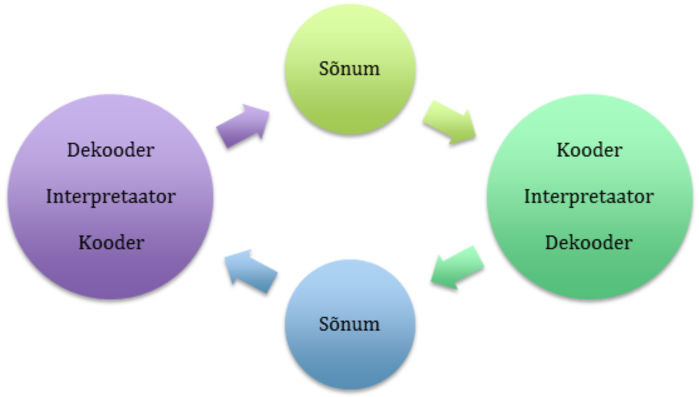

_Joonis 4-1. Osgood-Shramm'i kommunikatsioonimudel_

Osgood-Shramm'i tsükliline mudel loobub lõplikult kommunikatsiooni käsitlemisest ühesuunalise lineaarprotsessina. Selle põhiline omapära seisneb massikommunikatsiooni esitamises tsüklilise protsessina. Teine mudeli omadus seisneb tähelepanu osutamises kommunikatsiooni osapoolte käitumisele. Osapoolteks on saatja ja saaja, kelle põhiülesandeks on info kodeerimine, dekodeerimine ja interpreteerimine.

W.Shrammi poolt koostatud kommunikatsiooni definitsioonide ülevaade näitas, et neis kõigis eeldatakse infomärkide kogumi olemasolu. Märkide kogum võib sisaldada fakte, asju, aga ka emotsioone ja latentseid (varjatud) väärtusi. Adekvaatseks teate tajumiseks peab eksisteerima ala, milles saatja ja vastuvõtja kogemused on sarnased ja arusaamine kasutatavatest märkidest ühesugune. Saatja ja vastuvõtja omavad "kasutatavate väärtuste fondi" ja "ühtivuse piire"; eduka suhtlemise ala asub "piiride" ühisosas. Kommunikatsiooni edukus sõltub samuti ka osavõtjate ootustest teineteise suhtes.

Mudeli kriitikat võimaldab asjaolu, et see jätab mulje kommunikatsioonipoolte "võrdväärsusest". Tihti aga on protsess balansseerimata, eriti kui on tegemist massikommunikatsiooniga. Siin ei ole saatja ja vastuvõtja kuigi võrdsed kommunikatsiooni osapooled ning mudel, mis näitab neid ühe ahela lülidena, ei kajasta adekvaatselt nende rolli kommunikatsiooniprotsessis.

:::

#### Info edastamine internetis

::: vananenud


Joonis 4-2. Kommunikatsioon internetis

Internetis kasutatakse kahte põhimõistet: aadress ja protokoll. Iga internetti ühendatud arvuti omab unikaalset aadressi. Isegi ajutise ühenduse puhul eraldatakse arvutile unikaalne aadress. Igal ajahetkel omavad kõik internetti ühendatud arvutid erinevaid aadresse - nagu postiaadress iseloomustab unikaalselt inimese asukohta, iseloomustab arvuti asukohta võrgus selle internetiaadress.

Üldjuhul on protokolliks koostöö või suhtlemise reeglid. Näiteks, diplomaatiline protokoll määrab, kuidas käituda väliskülaliste vastuvõtmisel või vastuvõtu läbiviimisel. Võrguprotokoll määrab reeglid võrku ühendatud arvutite käitumiseks. Standardprotokollid panevad erinevad arvutid "rääkima ühte keelt". Nii antakse võimalus ühendada internetti eri tüüpi arvuteid, mis töötavad erinevate operatsioonisüsteemidega, kuid on võimelised siiski suhtlema.

**Protokoll** on standard, mis määrab teadete vormi ja edastamisviisi, nende interpreteerimise protseduurid, erineva võrguriistvara koostööreeglid.

Kõiki koostööreegleid ei ole praktiliselt võimalik ühes protokollis kirjeldada. Sellepärast ehitatakse võrguprotokollid hierarhilisel põhimõttel. Nii näiteks madala taseme protokoll kirjeldab väiksemate infoportsude edastamist ühest arvutist teise, sest väikeste infoühikute edastamise jälgimine on lihtsam. Kui osa infost oli häirete tõttu edastamisel moonutatud, nõutakse vaid moonutatud osa edastamise kordust. Järgmise taseme protokoll kirjeldab, kuidas suured andmemassiivid tuleb lõhkuda tükkideks ja kuidas tuleb neid pärast jälle kokku panna. Sealjuures väiksed osad edastatakse madalama taseme protokolli abil. Järgmisel, veel kõrgemal tasemel, kirjeldatakse faili edastamist. Ka siin kasutatakse madalamate tasemete protokolle. Uue kõrgema taseme protokolli realiseerimiseks internetis ei ole vaja teada võrgu töö omapärasid, vajalikud on vaid teadmised madalama taseme protokollide kasutamisest.

Mitmetasemeliste protokollide analoogiaid kohtab ka igapäevaelus. Näiteks saate edastada dokumendi teksti telefonikõne ajal. Selleks ei ole teil vaja teada, kuidas telefonivõrk töötab. Teate, et peate valima numbri ja ootama kuni teine inimene tõstab toru.

Dokumendi kuju edastamiseks võib kasutada faksi. Te panete dokumendi faksimasinasse, valite teise faksinumbri ja edastate dokumendi. Te ei pea üldse mõtlema sellest, kuidas dokument telefoniliini kaudu edastatakse. Te lihtsalt kasutate kõrgema taseme protokolli: "panna dokument faksimasinasse, valida number, vajutada nupule Start". Tegevuse käigus kasutasite Te vähemalt veel kahte protokolli: telefonivõrgu tööprotokolli ja fakside edastamise protokolli.

Samuti on ka internetis mitme taseme protokolle, mis töötavad koos. Madalamal tasemel kasutatakse kahte põhiprotokolli: IP - Internet Protocol (interneti protokoll) ja TCP - Transmission Control Protocol (infoedastamise juhtimise protokoll). Sellepärast, et need kaks protokolli on väga tihedalt seotud, pannakse need kokku ja nimetatakse TCP/IP protokolliks, mis on interneti baasprotokoll. Kõik teised protokollid ehitatakse TCP/IP protokolli baasil.

TCP lõhub info tükkideks ja nummerdab neid selleks, et vastuvõtmisel oleks võimalik need õigesti üheks tervikuks kokku korjata. Samal eesmärgil nummerdatakse palkmaja palke nende teise kohta üleviimisel selleks, et seal need õigesti kokku panna. Järgnevalt edastatakse IP‑protokolli abiga tükid saajale, kus TCP-protokolli abil kontrollitakse, kas kõik tükid on saabunud. Põhjusel, et info osad võivad liikuda internetis mööda erinevaid kanaleid, võivad need saabuda mõnes muus järjestuses. Peale kõikide osade kättesaamist järjestab TCP need õigesse järjekorda ning korjab kokku üheks tervikuks.

TCP-protokolli jaoks ei ole tähtsust, milliseid teid mööda info internetis reisib. See on IP-protokolli ülesanne. Igale saadud info kogumile lisab IP abiinfo, mis sisaldab saatja ja saaja andmeid. Töö sarnaneb postisaadetise saatmisele, kui saadetis pannakse ümbrikusse ja ümbrikule kirjutatakse saaja ja saatja aadressid. Nüüd tagab IP-protokoll, sarnaselt tavalisele postiteenusele, kõikide pakettide saabumise saajale. Erinevate saadetiste teekonnad ja saabumise kiirused võivad olla erinevad. Internetti kujutatakse tihti hajuva pilvena. Te ei tea info liikumise teekonda, aga õigesti vormistatud IP-paketid jõuavad alati kohale.

:::

### B.4.1.3 Kasutajaliides ja selle erinevad tüübid (tekstiline, graafiline, heliline)

::: oppekava

Defineerida kasutajaliides ja loetleda liideste liike, näiteks tekst, graafika, heli (auditory).

:::

Arvutisüsteemidel on mitmeid erinevaid tüüpi liideseid. Tehnilised liidesed võivad ühendada erinevaid arvutisüsteeme omavahel või füüsiliste protsessidega, näiteks temperatuurianduriga. Riistvaraliidesed ühendavad arvuti erinevaid seadmeid omavahel ja vooluallikaga. Rakendusliides (application programming interface e. API) on operatsioonisüsteemi või rakendusprogrammiga määratud reeglistik, mille alusel rakendusprogramm kasutab operatsioonisüsteemi või teise rakendusprogrammi teenuseid. Kõigi nende liidestega suhtleb kasutaja aga ainult kaudselt, tehes seda kasutajaliidese kaudu. Arvutisüsteemi kasutajaliides võimaldab kasutajal suhelda nii operatsioonisüsteemi kui rakendusprogrammidega, olles ka ise samal ajal programm kui tarkvarasüsteem.

Üldise mõistena on kasutajaliides vahend, mis võimaldab inimesel suhelda masinaga ehk kõik, mida näeme, kuuleme, tunneme. Teised süsteemi osad on harilikult varjatud. Masinaks võib olla nii arvuti, telefon, auto või mistahes elektroonikaseade. Arvutisüsteemi kasutajaliidese välisteks komponentideks loetakse ka ekraani, klaviatuuri, hiirt. Nendeks võivad olla näiteks kõlarid, mikrofon, spetsiaalsed nupud või puutetundlikud seadmed, millelt signaale vastu võetakse. Kasutajaliidese all võib mõista ka sisend- ja väljundseadmeid: ühelt poolt on vaja vahendeid, mis võimaldavad arvutile käske edastada, ning teiselt poolt vahendeid, mis võimaldavad arvuti poolt teostatud operatsioonide tulemust tajuda.

#### Graafiline kasutajaliides **_Graphical User Interface_** / **_GUI_**

Tänapäeva arvutites on enimlevinud kasutajaliidese tüübiks graafiline kasutajaliides, kuna see lihtsustab programmide kasutamist ning võimaldab kuvada graafikat. GUI komponendid on kuvaril liikuv kursor, osutusseade (harilikult hiir), klaviatuur, ikoonid, aknad ja rippmenüüd. Uuemat tüüpi kasutajaliidese seadmed on veel puutetundlik ekraan, puutelaud, **krihvel** **_stylus_**, teleripult, millega saab teksti töödelda, joonistada, navigeerida. Viimased on aga praeguse tehnoloogiaga halvasti integreeritud ja võimalused alles kasutamata. Tuntumad graafilise kasutajaliidesega operatsioonisüsteemid on Windows ja Macintosh.

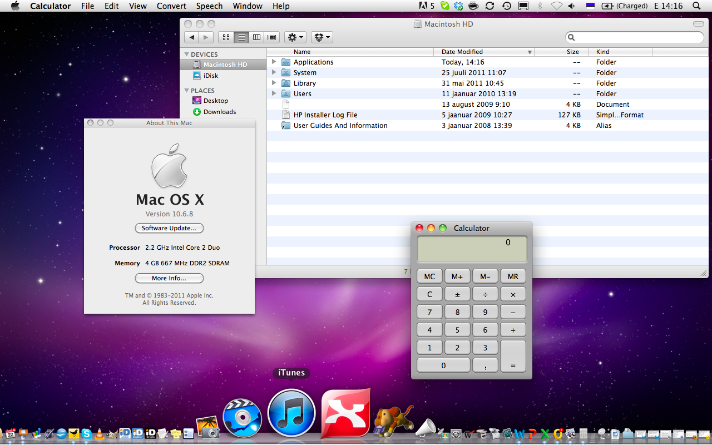

_Joonis 4-3. Mac OS X operatsioonisüsteemi graafiline kasutajaliides_

#### Käsurealiides **_Command Line Interface_** / **_CLI_**

Käsurealiides on operatsioonisüsteemi või rakendusprogrammi liides, millele saab klaviatuurilt reahaaval käske trükkida. Kui kursor on ekraanil, tuleb käsk trükkida ning edastada see arvutile sisestusklahvi (enter) abil. Pärast ühe käsu täitmist saab sisestada järgmise. Käsurealiidese osadeks on seega vähemalt klaviatuur ja kursor.

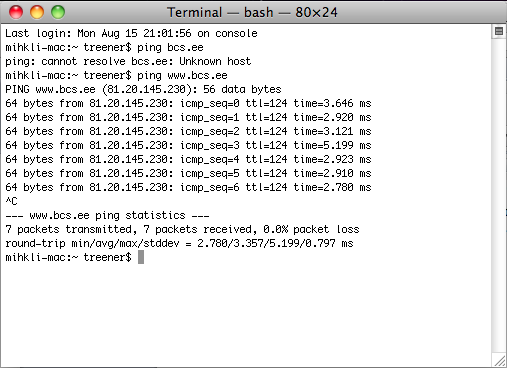

_Joonis 4-4. Käsurealiides_

#### Veebiliides

Ainult veebikeskkonnas töötavate rakenduste kasutajaliideste puhul sõltub lõppkasutaja arvuti operatsioonisüsteemist ainult osa komponente, näiteks nuppude või dialoogiakende välimus. Ülejäänud elementide kujundamise võimalused on piiratud veebisirvijate võimekusega.

Tänapäeval räägitakse kasutajaliideste disainist valdavalt just veebiliideste loomise kontekstis.

#### Hääleliides (voice user interface e. VUI)

Häälrakenduste juures on menüüde asemel kuuldavad instruktsioonid, mis on varem salvestatud või reaalajas kõnesüntesaatoriga tekitatud. Samuti reageerib liides kasutaja häälkäsklustele. Hääleliides on populaarne mobiilsetes seadmetes, mille kasutamise ajal võivad käed mõne muu tegevusega hõivatud olla. Hääleliidesed ei ole seni veel kuigi populaarseks muutnud ning puudub tehnoloogia, kus arvuti saaks tervikuna inimkõnest aru. Käskude andmine rääkides võib osutuda väsitavamaks kui ekraanil hiirega klõpsimine, sest viimasel juhul saab teha paralleelselt rohkem toiminguid.

#### Käsiliides

Käsiliidese puhul on arvutile võimalik käske anda käeliigutustega. Tegemist on alles tulevikus laiemat kasutamist leidva tehnoloogiaga. Selle rakendamist on katsetatud näiteks virtuaalse reaalsuse kolmemõõtmelises graafikakeskkonnas, milles süsteem oskab teatud hulka liigutusi eristada. Kasutaja saab käeliigutuste abil otse objektidega suhelda, neid valida ja liigutada, samuti menüüvalikuid teha ja kursorit liigutada.

### B.4.1.4 Erinevad kommunikatsioonitehnoloogiad (helid, visuaalsed metafoorid, digitaalsed lõhnad, kompamine)

::: oppekava

Tuua välja tehnoloogilised vahendid , millega saab infot edastada, näiteks helivahendid, tüübid, nähtavad kujundid, digitaalsed lõhnad, haptilisus/liikumine.

:::

Peamised tehnoloogiad, millega informatsiooni edastatakse, on olnud seotud meie nägemisega, hiljem kuulmisega. Tekstiliidesed olid esimesed omasuguste seas ning informatsioon edastati tekstina. Tekstist parema arusaamise eesmärgil kasutati mitmesuguseid märgendeid, mis ütlesid lugejale, millise tekstistruktuuri osaga on tegemist – pealkiri, rõhutatus, autor, tsitaat, kuupäev, jne. Graafiliste kasutajaliideste tekkimisel hakkas informatsioon edasi kanduma erinevate muude visuaalsete metafooridena – esialgu kujundatud tekstina, hiljem piltidena. Nii nagu sõna on tähemärkidest moodustatud visuaalne konstruktsioon, mis meie ajus omandab kindla tähenduse, niisamuti võivad informatsiooni edasi kanda ka muud visuaalsed konstruktsioonid. Näiteks Visa logo e-poe lehel annab teavet, et siin saab ostu sooritada krediitkaardiga.

Pilte kasutatakse laialdaselt tekstiliste sõnumite tegeliku tähenduse selgitamiseks. Näiteks kui lausele "Mary had a little lamb" lisada väikese tüdruku ja lambatalle pilt, siis me saame aru, et tegemist on reaga kuulsast lastelaulust, mis on ühtlasi ka esimene salvestatud ja taasesitatud inimkeelne fraas. Kui aga pildil on kujutatud lambakarree, siis on tegelik tähendus teine – "Mary sõi väikese lambaprae".

Tänapäeval on laialdaselt kasutusel informatsiooni edastamine heli abil – alates videosalvestustest kuni konverentskõnedeni.

Vähemlevinud on kasutajaliidesed, mis kasutavad inimeste puutetundlikkust. Näiteks pimedatele on loodud spetsiaalsed ekraanilugerid ja klaviatuurid (ka klaviatuuri katted), mida saab kasutada informatsiooni ülekandmiseks kompamise teel.

Uued väljakutsed on seotud meie lõhna- ja maitsetajudega. Tänapäeval on juba olemas tehnoloogia ja seadmed lõhna edastamiseks internetis. Sisuliselt on tegemist kõlari sarnase seadmega, mis ühendatakse arvutiga USB liidese abil ning mis produtseerib erinevaid lõhnu umbes samamoodi nagu tindiprinter kannab paberile erinevaid värve. Lõhnaseadmes on kassett rohkem kui saja erineva kemikaaliga, millest elektrooniliselt edastatud valemi abil koostatakse unikaalne lõhn. Piiranguks sellise tehnoloogia laiemaks levikuks on praegu hind – vastavad seadmed ja lõhnakassetid ei ole kodukasutajale veel taskukohased. Lisaks on piiratud ka edastatavate lõhnade nüansirikkus – kõrgetasemelisi parfüüme ja eripäraseid toidulõhnu täna veel edastada ei saa.

### B.4.1.5 Kasutajaliidese efektiivsuse testimine võrdluses nõuete ja eesmärkidega

::: oppekava

Loetleda kasutajaliidese tõhususe testimiseks sobivad disainieesmärkidele vastavad mudelid.

:::

#### Kasutatavuse kriteeriumid

Kasutatavuse mõistet saab laiendada viie kriteeriumiga, mille mõõtmisega määratakse kasutajaliidese toimimine:.

- Efektiivsus
- Võimekus
- Kaasamine
- Vigade tolerantsus
- Õpitavus

**Efektiivsus** on terviklikkus ja korrektsus kasutaja poolt soovitud eesmärkide täitmisel. Mõõdetakse kahte asja – kas kasutaja sai oma soovitud tegevused sooritatud; kas süsteemi poolt tehtud töö on kvaliteetne.

Efektiivsus sõltub suurel määral sellest, milliseid valikuid, millises sõnastuses ja millises kujunduses on kasutajale serveeritud.

**Võimekust** kirjeldatakse kui kiirust, millega kasutaja sai eesmärgi korrektselt täidetud. ISO 9241 kohaselt on väljendab võimekus kõiki ressursse eemärkide täitmisel, sh aega, hiireklikke ja klahvivajutusi.

Kasutajaliides on **kaasav** , kui ta on meeldiv ja köitev. Selle omaduse kõige tähtsam osa on visuaalne väljanägemine.

**Vigade tolerantsus** – ülim eesmärk on veavaba süsteem. Paraku ei eksisteeri päris veavaba süsteemi kasutamist – isegi kui kõik süsteemi komponendid töötavad õigesti, leidub alati olukord, kus viga tekib. Veatolerantne kasutajaliides on disainitud kasutajapoolsete vigade ennetamisele ning aitab vigade esinemisel neid parandada. Hea kasutajaliides käsitleb veateateid liidese loomuliku osana, jagades mitte ainult arusaadavat infot vea olemuse kohta, vaid juhendab kasutajat veaolukorrast väljumiseks.

Nende vigade korral, mis asuvad väljaspool kasutajaliidese ulatust (süsteemsed vead, võrgukatkestused), tuleb kasutajat viisakalt ja asjalikult juhendada.

**Õpitav** kasutajaliides võimaldab kasutajal teadmisi koguda suurema pingutuseta. Mõõdetakse kahte olukorda – kui kiiresti jõuab eesmärgini esmakordne kasutaja ning kui efektiivselt tegutseb korduvkasutaja. Õpitavust saab suurendada õigeaegsete instruktsioonide, väheste valikute, õige tekstilise ja pildilise semantika kasutamisega.

Mõned näited kasutatavuse kriteeriumite sidumisest kasutajate eesmärkidega:

- Võimekus – "Kasutaja viib registreerumise edukalt lõpule vähem kui 3 minutiga."
- Efektiivsus - "Vähem kui 5% kasutajates kohtab vigu, mis nõuavad tugiisiku sekkumist."
- Kaasavus - "Vähemalt 80% töötajatest eelistab süsteemi kontori külastusele."
- Veatolerantsus – "Süsteem kontrollib üle majutuse ja toitlustuse valikud ning laseb enne registreerimist kasutajal hinnad üle vaadata."
- Õpitavus – "Kasutajad on võimelised boonused välja arvutama ilma välise abi või abimaterjali lugemiseta."

Kasutatavuse efektiivsuse mõõtmise meetodid:

- Võimekus – Aeg (või klikkide, klahvivajutuste, lehekülgede arv) reaalsete ülesannete täitmiseks. Testimisel on vaja kasutada vähemalt töötavat prototüüpi tegelikkusele lähedase andmekooslusega.
- Efektiivsus – Hinnake kui kvaliteetselt eesmärgid saavutati ja kui tihti tekkis kasutamises vigu.
- Kaasavus – Meetoditeks on rahulolu uuringud ja kvalitatiivsed intervjuud.
- Veatolerantsus – Testimisel tuleb kasutada stsenaariume, mis tõenäoliselt põhjustavad vigu.
- Õpitavus – Valige hoolikalt testrühma liikmeid (erinevate kogemuste, oskuste ja ootustega) ja kontrollige testimisel abimaterjalide kasutamist.

::: vananenud

#### Rahvusvahelised standardid

Interaktiivsete süsteemide valdkonnas on kehtestatud rahvusvahelisi standardeid, millede hulgas on ka kasutajaliideste väljatöötamisega seonduvaid:

- **ISO 14915**: Tarkvaraergonoomika multimeedia kasutajatele – sätestab kujunduse põhimõtted ja raamistiku, multimeedia navigatsiooni ja juhtimise, meedia valiku ja kombineerimise.
- **ISO 13407**: Inimkeskne kujundusprotsess interaktiivsete süsteemide jaoks.
- **ISO 9241**: Ergonoomilised nõuded kontoritööle visuaalsete kuvaterminalidega – sätestab juhised töö nõuetele, töökeskkonnale, kasutatavusele, informatsiooni esitlusele (sh. näiteks käskude grupeerimine menüüs); nõuded kuvaritele, klaviatuuridele ja teistele sisendseadmetele, tööjaama planeeringule ja kehahoiakule, peegeldusega kuvaritele, kuvatavatele värvustele.
- **ISO/IEC 9126**: Tarkvara projekteerimine – tootekvaliteet.

:::

### B.4.1 Kordamisküsimused

::: kordamiskusimused

1. Mis teeb kommunikatsiooni edukaks?

- sõnum saadeti välja
- sõnum jõudis kohale
- sõnumist saadi aru X

2. Milline protokoll tagab informatsiooni liikumise internetis ühest arvutis teise? Milline protokoll transpordib internetis andmeid ühest arvutist teise?

- TCP
- IP X
- TCP/IP

3. Mis on kasutajaliides?

- Suvaline seade, millega saab teisele seadmele anda sisendinformatsiooni X
- Kõik kuvarid, sh telerid, arvutiekraan, mobiiliekraan, jne
- Brauserid

4. Millega mõõdetakse kasutajaliidese võimekust?

- kasutaja eesmärkide täitmisega
- töö kvaliteediga
- töö tegemise kiirusega X

:::

## B.4.2 Graafiline disain

Selle alateema materjale läbi töötades õpid tundma graafilise disaini põhimõisteid, graafika võimalusi ning nende lahendusi tarkvara juures.

### B.4.2.1 Joonised, pildid, värvid ja animatsioonid – peamised graafilise disaini põhimõtted

::: oppekava

Tuua välja graafika ja animatsiooni mõisted ja edastuskuju (raster, vektor), digitaalaudio ja –video ja näidata nende erisusi, kasutamist ja standardformaate.

:::

Selles peatükis tutvud värvimudelite ja graafikaformaatidega.

#### Värvimudelid

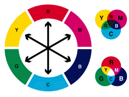

_Joonis 4-5. Osavärvid. Allikas: http://www.cs.ut.ee/~kerstit/gimp/arvutigraafika.html_

Tehnilisel tasemel on tähelepanuvääriline fakt, et kõik värvid (vähemalt need, mida inimese silm eristab) on võimalik kokku segada kolmest põhivärvist.

Need kolm värvi on kunstniku seisukohalt **_magenta_** (purpurpunane), **_cyan_** (helesinine) ja **_yellow_** (kollane).

Füüsiku seisukohalt on need värvid **_red_** (punane), **_green_** (roheline) ja **_blue_** (sinine), mis kannavad ka spektri põhivärvide nimetust.

Värvide esitamine digitaalseadmetes (televisioon, arvuti, video, skanner, fotokaamera, jne) RGB mudelina põhineb kolmel spektri põhivärvil **_R = red_**, **_G = green_**, **_B = blue_**, kus värvide liitmisel tekib valge värv. Sellepärast nimetatakse neid värve ka aditiivseteks (valge saamiseks tuleb värve lisada) põhivärvideks. RGB mudel on värvide segunemine valguskiirguses. Piltlikult võib öelda, et kui valgust üldse ei ole, siis on pimedus; kui kõiki osavärvi valgust on maksimaalselt palju, siis on tulemuseks valge.

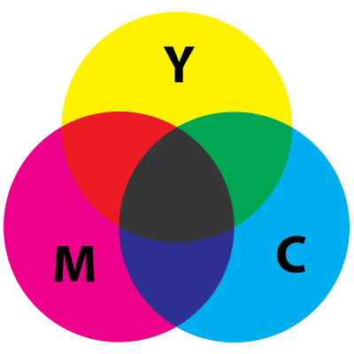

_Joonis 4-7. CMYK värvimudel. Allikas: http://en.wikipedia.org/wiki/CMYK\_color\_model_

Iga graafikaredaktor on võimeline tekitama suvalist nähtavat värvispektri värvi, muutes selleks punase, rohelise ja sinise värvi intensiivsust. RGB-mudelit kasutatakse värvi näitamiseks põhiliselt arvutiekraanil. Trükkimiseks kasutatakse teist mudelit, mille nimetuseks on **CMYK** **_C = Cyan_** **_M = Magenta_** **_Y = Yellow_** **_K = Key_**, mis põhineb värvide lahutamisele ja on subtraktiivne mudel (valge saamiseks tuleb värve eemaldada). Piltlikult: kui värvi üldse ei ole, siis on valge paber; kui osavärve on maksimaalselt palju, siis on süsimust.

Teoreetiliselt saab musta tulemuse ka kolmest põhivärvist CMY. K ehk **_Key_** võeti kasutusele trükitehnoloogia omapära tõttu. Nimelt ei ole paber võimaline vastu võtma maksimaalses koguses CMY värve – paberile tekiks lomp ja tulemus jääks porine. Värvihulga vähendamiseks võetigi kasutusele must värv põhivärvina ja nimetati see võtmevärviks (siit ka nimetus Key).

Kõik **värvid veebilehel** määratakse RGB-mudeliga, sest värvide kuvamiseks arvutiekraanil kasutatakse just seda tehnoloogiat. Värvide väärtust saab määrata kuueteistkümnend- või kümnendarvuga, aga ka nimetusega.

Näited:

Selleks, et saada valge värv, peab iga põhivärvi väärtus olema maksimaalne.

```css
#FFFFFF /* FF-punane, FF-roheline, FF-sinine */
```

Nüüd määrame punase värvi samas formaadis:

```css
#FF0000 /* FF-punane, 00-roheline, 00-sinine */
```

Värvi saab määrata ka kümnendarvuga. Siis näeb see välja nii:

```css
rgb(255,255,255); /* Valge */
```

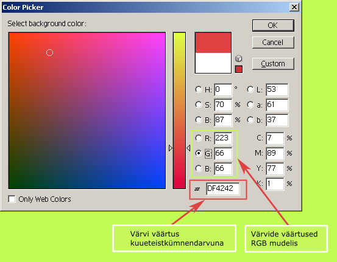

**Joonis 4-8. Veebivärvide määramine graafikaprogrammis**

#### Rastergraafika

Andmete graafiline kuju realiseeriti esmakordselt eelmise sajandi 50-ndate keskel suurtel arvutitel, mida kasutati teadustöös ja militaarsetes uuringutes. Sellest ajast on andmete graafiline esitusviis muutunud arvutisüsteemi, eriti personaalarvuti, lahutamatuks osaks.

Arvutigraafikat võib liigendada erinevatel põhimõtetel. Sõltuvalt sellest, kuidas moodustub kujund, eristatakse **raster** -, **vektor** - ja **fraktaalset** graafikat. Eraldi tüübiks peetakse **kolmemõõtmelist** (_3D,_ Dimension – dimensioon) graafikat, mis väljendab ruumilisi kujundeid kahemõõtmelistel ekraanidel.

Värvikasutuse alusel eristatakse must-valget ja värvilist graafikat. Lähtudes inimtegevuse valdkonnast on saanud oma nimetused inseneri-, teadus- ja veebigraafika.

![](data:image/png;base64,iVBORw0KGgoAAAANSUhEUgAAAd0AAABmCAYAAACOR0tsAAALY0lEQVR42u3dsY4TSReGYW6BW9iciGvgFrgEsv3DSQkmISUkJiMkJZiRCCYhmIgMiZWIJ5t4Vh/6j9Rr2XWKnZ5ej3le6Qiwjd1VXXXerrb79JM7AACwCU90AQAApAsAAOkCAADSBQCAdAEAIF0AAEC6AACQLgAAIF1sw+3t7TC+fft2d3l5eRJxdXV19/37X8O4ubkxKNDOmYyTQ5HnQbrAXiLVUfz55//unjx5chLxxx9/3L1582YYnz9/Nigw5MuXL3efPn06GHkepAuQLumCdEG6IF3SBemCdEG6pAuQLkgXpEu6IF2QLkiXdEG6IF2AdEkXpAvSBemSLkgXpAvSnZHu2dnZMM7Pz+8uLi4ePF6/fn336tWrg/Hy5cuf4h1FtjdJcxQ47fnQjedExtqhePfunY4kXeDhpJskM4qPHz9u0pb3798PV7ERb9eWiHm0ikngdLm+vr578eLFMDJGRgd3GWsgXYB0SRekC9IF6ZIuSBekC9IlXdIlXdIF6YJ0SRekC9IF6ZIuSBekC5Au6YJ0Qbog3VWIECPeQ5FrKGek++HDh2HgdMl12M+fPx8G6YJ0QboTpNrU06dPh5GVTFe1CqfL1dVVW0CFdEG6IF3SBemCdEG6pAvSBekCpEu6IF2QLkiXdEG6IF2QLulKqKRLuiBdkC7pgnRBuiBd0gXpgnQB0n0Y6X7//tfPzxrF6Cboa0W2dVQsJJFtvb29vVekoET3OWu0pxtn6debm5thZCx229mNkWfPnrXFM7r++PHjRzuOuspoafMaY+Tt27fDyIHIKEfMtCWVvkbzIful245uXia69qa4TZfzSBek+8ikm8/p3qPr0zWi2jOKGVF1kX3cfc4a7ekqRaVfZ8bzaDvzPlv0eyTUcXZ2Noy1trVb2Ud4I/nnoKujK9Ga/dJtRzd3E1uWeSVdkC7pki7pki7pgnRJl3RJl3RJFyBd0iVd0iVd0gXpki7pki7pki5Il3RJl3RJl3TpA6RLuqRLuqRLuiBd0iVd0iVd0gVOSbqZvKNKQTPJf2ZSdpH36D4nF+mP4uLiom1v+nXU70nM3XZUBaX7RPq1S4bdOEuBhU7uXVKuwhSj+Pr167BPt6pI1Ulo5sBsDYHMHCCmGEh3oNrt34zH0Wek37r2VnGLUWwJ6YJ0SZd0SZd0SRekS7qkS7qkS7oA6ZIu6ZIu6ZLu6ZMkQrqkS7qkS7qkiw24vLz8OYH/61/2ki7pki7pku5K0s1tu5Lcl5HHcBzSrcE0ewkB6ZIu6ZIu6R6xdLORGSTL68PSSWngvyXSzs7GetKtiOC2Pu1MuqRLuqRLuitKN7H7XWIGznJllcdqJbz72jy2fG3+nU7e97p9q+j8X6vrOenWxeq5GP0xSbcrBJDksMVN26u4waHotjORvu/6pItM/m5bk/xHMTNn8roUJjgUSXRbSbf7nO6m7jnI6Pq1u8l52tsl5e6gdivpnp+ftwcIkd0o8h73vSF7xtno5vKJ7qAqcysHgKPobkI/I92Mk27eHKV0Q3ZYCTYNqaOVDKg8Vztj+XiS788PWiTaOtre97p87nKAPJS4tkjmDxHdIEtf7h4EHat0jyW61VaSQ7cqn6mu81iIyI5FuiNJJarvR7EFW0k3r+sqbHVS3mpl10k3+f2+Yyh5ppu/OQA4Jg5KNx22uxpYSjB/X65kS8h5bQk0R4d1Snp3pZvOqP+/XEXXZz0k+YzHIoR/GzkoIl3SJV3SJd1HJt1KnvtOXUakebwaXqea63uDJP46LbOUbv0Cd1fqy38/9ClaK13SJV3SJV3SPRrpLsUXse6uPuv0bxqd55ennrNirULUaXR9d3tIuvuKVmdw5H19r3u63+mSLumSLumS7oHvdGslWol/eaq5Tg/Xyne50ioZL6Wb15eM857dXR4y0Mj3sHQf66+XSZd0SZd0SfeAdCO9DJz8WdJMg+vyojq9XD+QWq5g8/qsfvN4fde4m5RrUC5/lba8BdXyO2DSPY3rdEmXdEmXdEn3/4l93/eCEWo9HvmWnJP4l8/Vd6ZZ9S5XYBFuHs9j6fBKeHmsrg/LhF9G/k8GLPHe/ePU/ClUpCJd0iVd0iXdDaiEnA7JpMkkj0zq+q4M4Ip6rMSbP39nTqn2MumSLumSLuk+MFkh14TKSjgTfCnaOiW9nDR5PKvg+u73oS+HwTbSXaMiVVfooc6UjCKTf5TEkui6qke3t7f37tMqTDGKTkKJLul2v6GYiU66M3M0czrVr0bRJdQ1Dqoihy65d78p2Uq6eY/ucx7LwW62dQ3pdv2RffNbSzeiTYfXD6xKuEk4OXVcl8Tk78vI83V97UMVzQDpki7pki7pnpR065RSJtSucJNAK1nvlunK88sfEYF0SZd0SZd0SXdSulnxlnAzudJ5ifrFcv07kdeUeGui+SUz6ZIu6ZIu6ZLuL0i3VrjdQEnyTSJPgq3XblF1CaRLuqRLuqR7EtJNh9Up5STpDOrcpqtuK1bJLI8l8nxe6/Qy6ZIu6ZIu6ZLuJJWMq7BDSbfkWtJNEluKN4O+bjn2u182RLqkS7qkS7qkO0X9GCqDPZNuKd0kr5poSWK74l1+3wvSJV3SJV3SJd1fOMWchLYr3fxZnbSUbl0ulEmiDjPpFsuvIPZFxlKX2CPdrjhGdzP1mR/2dUUcqmDEKGak20XXH0nsW0g346Qq0R2KLukmL8zs31Fk/3b9nm0ZjbOM1a2KY8y0pyuecQx3TMvvenZvfL8byQOkuwLLXyHXaeaSbq0alivd8/PzfxwdHUtVJtL976XbkTHUyW5Z4/vQSmmNKj9de9eo0JR+7ySU+TZatafft5DuGiwPzA9FJ9SZ1WFX+WrmjMpWFam6/Z8DiMdC+pV0V6JujFBJrS4NqolS3+HuS4g5miNe0iVd0iVd0iXdX1zxzgz4+t6FeEmXdEmXdEmXdFfo2H3fI0WsdVeiGnDES7qkS7qkS7qkuxHES7qkS7qkS7qkS7ykS7qkS7qkS7qnJ13iJV3SJV3SJV3SJV7SJV3SJV3SJd3TlC7xku5sYh5FJm9X4amrapT2XlxcDKNLhhFA9zndAUSE2u2bSlaHYo3iGDNRhThGMSpIUdf2d/u36/fuoCuRg6rRdkRkM0UpRpF6BB0pKNG1p5NQXtONo44UNcr8HEXa1BV66bZDcYxHIl53ICLdNY+md8fXvqjV7ii6VWqtukaxRjnKEvyhmJFQJ91cdbBGe7txNnOA3cl/5gxDxuKo31M9qVtRd9JNn913rCZmxmpXCaxjpmRpdwYhC6RuO3KQQbpHSiV5K13SJV3SJV3SJV2QLumSLumSLukCpEu6pEu6pEu6IF3SJV3SJV3SBemSLumSLumSLumCdEmXdEmXdEkXpHuc0s3kHt2gPsmwu342STXXWd4nkgy7BNJdG5norhcu4Y2ia2/eo7tJeSeHtLe7IftovyRm2ju6JjkxI/+8z+ha4Eiok2rX5zPXraa9XZ/MFOno9k3Xp5mfM9c/j7YjbXadLvAbSnfmqL4rfJDJ3YlqpmhF9zldn85EJfhRMZBuO7qVW90dbBRVhWsUa7S32y/Z3m4spgDGiNz/uxNZt/LLtnT9PlO4Yo1iIGvEGlXLVKQCSJd0SZd0SZd0QbqkS7qkS7qkC9IlXdIlXdIlXdIF6ZIu6ZIu6ZIuSJd0SZd0SZd0AdIlXdIlXdIlXZAu6ZIu6ZIu6eIU6W4cHonkvsajmLlB+bG0tbuIPxM7VYlG0fVZEnf3OV2fzkRuQN5Ftx3d/8/+78g+vr6+HsYa7e32S7a3G4tdpa/af6PIGOm2s+v3mYpj3cHdWv06M85G/TEzv/Oa0XukPenXURzbrV5JFwAA0gUAgHQBAADpAgBAugAAkK4uAABgG/4GsmOTfFymr8wAAAAASUVORK5CYII=)

**Joonis 4-9. Rastergraafika koosneb pikslitest. Allikas: http://www.barcode-us.com/digital/graphicFiles.html**

Elementaarühikuks on rastergraafikas **piksel** (ekraanipunkt). Rasterkujutised tuletavad meelde ruudulist lehte, kus iga ruut on kaetud teatud värviga, moodustades kujundi (_bitmap_). Rastergraafika põhiomadusteks on lahutusvõime ja värvi sügavus.

**Värvi sügavus** on bittide arv, mis on ettenähtud värvi kodeerimiseks. Koodi pikkus määrab erinevate värvide arvu, mida saab ühes pikselis kasutada. Nii näitab värvi sügavus, mitme erineva värviga on võimalik antud kujutist värvida. Näiteks, kui värvi sügavus on 24 bitti, saab kujutis sisaldada 16,8 mln erinevat värvitooni (2<sup>24</sup> ≈ 16,8 mln). Mida rohkem värve on kasutusel kujutise edastamiseks, seda täpsem on info iga pikseli värvi kohta. Samas tuleb arvestada, et rikkamad värvid suurendavad faili mahtu.

**Lahutusvõime** on pikslite arv pikkuse ühiku kohta, nende tihedus määrabki kujutise kvaliteedi. Kõige tihedamini kasutatakse pikkuse ühikuna tolli, kuid mõnikord võivad esineda ka millimeetrid. Kujutise lahutusvõimet mõõdetakse ühikuga ppi (piksleid tollis).

Mida suuremaks muutub lahutusvõime, seda kvaliteetsemaks muutub pilt, kuid samas kasvab ka faili maht. Sellega peab arvestama piltide loomisel ja redigeerimisel. Kui pilt on mõeldud näitamiseks arvutiekraanil, võib lahutusvõime olla väiksem kui trükitaval pildil (pildi näitamiseks ekraanil on piisavaks lahutusvõimeks 72 ppi, printimisel ja trükkimisel peab see olema 150 ppi kuni 300 ppi (sõltuvalt trükipaberi kvaliteedist).

Rastergraafika eelised:

- suure värvide arvu esitamine
- värvide üleminekute ja varjundite edastamine
- suure hulga väikeste detailide edastamine.

Rastergraafika puudused:

- pildi vähendamisel kvaliteet halveneb, kuna kaovad väikesed detailid
- pildi suurendamisel kvaliteet halveneb, kuna suureneb punkt (raster)
- mida suurem lahutusvõime ja värvi sügavus, seda suurem fail.

**Rastergraafika programmid** on ettenähtud nii olemasolevate kujutiste (fotod, skaneeritud kujutised) redigeerimiseks, kui ka uute kujutiste loomiseks. Mõned näited: Adobe PhotoShop, Corel PhotoPaint, GIMP.

![](data:image/png;base64,iVBORw0KGgoAAAANSUhEUgAAAd0AAABmCAYAAACOR0tsAAAP4UlEQVR42u2dT44cSRWH+wg+go/gI/gIPoKP4CN4DSx8BB/Be0YjMxgYDRrUIDEIkMDrYeOld41+Lb0mSVVV/uJvRmR+n5SacVV3V2VWVnzxXryIuHsAAACALtxxCQAAAJAuAAAA0gUAAACkCwAAgHQBAACQLgAAACBdAAAApAsAAABIFwAAAOkCAAAgXQAAAEC6AAAASBdgm8+fPz+8fPly83j16tWU56f3vXVur1+/5kYAAKQLfXj+/PnD3d3d5nF/fz/Veen9Ouf19u1bbgIAQLrQB0nHkdObN2+mOi9FsM55KdqH4/Dly5fHe5rOFCBdGBJJx5GTIuKZePbs2eY5zZo2h8t8+PDhKXODdAHpwrBIPo541ajN0vg65/P+/Xs+/IN0HDU+z7ABIF2YAsnHkdQsRUdOJ0KRMMzPteERpAtIF4bGScfOICqN6R1xjBr+n48fP94sAkS6gHRhaCShI6Rk3717RwHVCYRLVTogXZgad4rN6MVHL1682DwH/QwgXQCkC8MLS4dSuCPiVmJTQIV0AZAu7I5bUDWqtJwUucalR+00ANIFpAsnwi1CGjU966yuxbKPSBcA6cIwzLqSkzs3d7blLAHpAtKFkzdoOlQlPFtnYbZVtQDpAtKFE+CkaUcSmJsWH62jAEgXkC6AvQnCKKlatwCMAiqkC4B0YTjcqTejrOq0XneXAiqki3QB6cJUOOsXj5BidjsIs2zWAEgXkC6cEDdlu7fMnFQ4BVRIFwDpwvA4myDsnbZ1ir5aN8CSgF5D10Kp7kvXTY/pOWUQ9LOzTF3SOLg6VnrPev/XVi3T43peQw7qsLWcUjaDdOOe0Oe9dU/ovtHP6ndmQZ+vPuv10I6+j3pspnsc6cIwuCs8jRzxtJpTrNdWY+l0TG5dO/2N0RoniVaV3u6yoLcWUdHfyS1gc8bqS47aklNnw92beuue6CHgre/Ppfegz9Kdyx8SLrkHkC6cCncThL2WhXS+/LU3aFBDVCqjS4cEs3eko85JSoOaIhJFPqkN7wzS1Tnp3Eo6X7eE1fK7lSpdtQdOZunaPTDLlD2kC7viCGavnYechq5WoyUhtZZAXMveUYFez93asVS+KTUAo0tX55IrodSMQYtsSIp0df+XdiyQLoCZMhtxDqzzvmqlvvVaLSKZW++7V9RbEr3kHu5Us1Glq3u9NI08grRc6ep8a2R3ZkkxI13YFXe1p94pZqfRqzGPuEcEuNc1dTtULQ6nAG9E6aqT0mJ4IeW61ZKXK90a34GZ5skjXdgdZ5yv585D7tzc0gKqFuObo4h3T+G6DfFo0pVwe2Y8bn3XaojXka5brHikefJIF3ZnzyrhSyjN1roTkCNcvaaiAr2/aLDiiClFOY12bfHmCjemguj3l+emf+u8c9LUt1KmMSVlfTiRZkxduXWkjJPmClfvQ5/7tXtCGZucv6v33/p7XWvMerZ58kgXhsD58vUqlHAa3RJRpUpJjWpKh0ONWWoUV6uQJlUeqVM+1JC3Prfe83RzxjRTp4Ll3BOlKdut61gr0zDKcrFIF6ZilJWfnGlMkkpu+s2dJhWNUkl0r4bWFaCubY2UYoo8cqb5pGQjcqO23tJNKZoqrTROuSdK07YlqePojK3PVX9zPcd7tL23kS5MgTuO2nqhB6eooyQCcKVUK6pPiaJKIwZXhLWqp1Oi6pTX6yldSa13sVDKPVHSwcyVrntt9fnPuBwn0oVh6FUxfAunEc8Vvyul2mOsKY1sbtSg13CunX6mZsfJlVZKtNtTuu6YZu3q3JR7Ive1c6S710I4SBdOiTPW2TLF7DTgua/vSqnVuLVe32ngcxtYt0PRYn6wW5Tmdih6Sdcd2281HaZ1ZyxVumfZRALpTsbRN0p3xNRqeoATaedK0Wlga1SM1mgEcxrYPTeGqN2h6SVd55q1nirnpuhzxJ8i3TPt1IV0J0M3sm7Qo+7f6kQtLXr+7iIduZ0ep4HtURDiXN9UobQuPnNwxuJdgfWQriukHiuHOUWMOZ9finTPkFa+Kl1d2GtjLmoUZqsUO6J0l5HRrNtblTbgtXEi0VzZO+fUa0Ud572kRh2O8FqnDt1CvFGku1fnsiRTkCpGV7p77iQ2jHSv9ejVU8yJsGK/TGiTIlSjd6S0c+t5srmvmZtdcKTUszPrnGvK+3Gi+B7357XzWu4r65xXD+k6kuu5K5QT7aZuPOJKd68NTYaRrtBFWDdqkftf/vvaTaHHlxGYPtD1Tbr1+0cfu6ydlpppa6stnKKcml9UJ0oqGXPaklzPJS7dToB7LznXrlejqvccG7arg5QrrdbSbZFtGClTkCrdo7RbRdLVDbtuCPRFjeka6jXGMmj6bwg2xByPx2bJ68nw8bxeY/n7sQRb9Epbiis6ArMdW2kpXc+9902tke7quatIy/Socy69s0BOY+iK0knLz9aotpau06ncY5UlJwNSe75z74h+WOlGymgZrUqm6g3phll+IZf/1n/jCxbl6PqdZaR76/dj7dURUimzH7MXJjhjXrXOsWWRk9Pw9C6KczoCbqTldFhmqztoLV3n3t5DRE67mNKBcqV7Nu5ufZmit6XGLSLfiEKX0VdcuGsXcCld/f76horfu/Qcke75It3ItvSYTuG8Tkl61GnI9pCSM6bo4KyfOxutpetcsz2G15zvQkoE7lzHM00V2pSuevYxhrsc470k3bgBS6Srvx8pZ/1MRM1US3s38pHGdHtEoL0iaufv74HT8Dudty159x6vnkG6o4rIGdetvbJX67npU0l3me5dztFST2d5w+mDit6PvmDLL6oanKhcjt9Z/7671i3yvX4jH616uVW661KadUsapdMZWu/Zuvd+sEdsVPeW7p7XrLd0z1a5vCld9fDV6CyLmiICjmhXvbK4AWMHC0kg9vZUwxa7QuhDWP7+cuA+Cq9+8ctfPR76/2WDVXvN1iNI94jzdFN73iVRgVMEVFrQMrN0tyJ8Z2y411zTWaQ7UrV3bnZplM7LIaUb0ca6YQ+R6rl1bzgKp5Z7ZMbPx5c4xBsy1c//+ptvn45vP373dETaGfH+70Y+8opUOdLKvSecv12aYZm5GG+rQTxqo9ryvEa/ZjXH6JFupnRbECnlGIcM0f7mu08Pv/30+4dPv/vD06F/6/EQ7xkH3tcdnjPRKhp1Io4a45FIF+kiXaS7q3SXjZ3SyCFbCfb77394bEAl1h/++OPToccl5oiOz7ROJ2wX6+R0xJy5kjXuM6SLdJEu0t1VutHYKYqQcBXJSqqS649/un+q9rz/81+eDj2u56OwZsaKSMjHqQBOTbdvjV3VWqAf6SJdpIt0d5VufKiKaEO4kqrk+tef/vaUev77P/75eOgxHXpekj7rhOozU3vDgJ4bECBdpIt0ke4Q0lXEG8KNhTh0REXz8jFFuSHeiFCoZD4XW0vUpUztcSLnWveXM26sxmnEY6uIDOkiXaQ7mXQl06VIb6UOI+qNnz3bep1np+YYbIsx4tzXmnmoZKQtC2eR7uhThmoWFyLdwaSrIipFuRKphPqvf39+WmhDz//883+eDj2u5/VzpJfPiTMn1Gmsei/Qf8RlElMaaRbHmOua9V4cA+l2IKSqBjLGcSVTiVWCjefVyOpYijeinbNPGzorTlp4q/hJ913PdW9HXWd3xMjoLNJtvQpay8xFShSOdAeRbnwQurE0DWgZ5YZ09dzXr18fjxCvnl+O98L5cBZkv5Vi3mMFJWcpy5mHStjw4DgdMScLlHLeSHcQ6S5vOkl0LV39VwVWYindaLxii0E4J1vj/7ciK2dcuPZKX85rztzwOJmDnkWP+vxj05RYGc8pCuspixZT4GrgrIOfMncd6Q4k3djsfrl+cEg30sohXB3LaEGN7tlWZYK0yPFaA7tVAd1i2MJJ2c1cTOV8Hj0Xs6lxrc+6ib2z7nJKBwrpDiTdSBUu11+OqUEh3hjDvZSK0RcH8Z4Tp/rzUiGU83utGgBn79qe2ZtIs8cWmrkRoduw9qrGrbWVXGtZOB2x3nUrzvcjdagA6Q4m3bj5nN6VGq21fBHvedkaE7sUzZREyKU4KdiejY8TaaV8v5zCoB7fVSc96kSQPWThtHs9x/qda5faeUK6A0o3UPrpUsOkL74+lPjCrsdCEO85cQo+1gLdauRaRmPO++0lJrfBT4m0nE5FjxSzc17OWGkPWTjjur2mDjn7SudMpUO6A0u35GZFvOdkq5FYNhBO6qylFJyq6V4NkNMBSH0vTlV563Sp08C7U3F6yMJ5jV7RrpMFyskEId2DSBfxghMpLFPMW+nUHvMincimdaWvG9HkNLAtIqUUnGk47nSwXrJwIvPWRXbLotbamSCkeyDpIl5wilHiftiqWu5RKeoWqrS8j500cG4D60RLatxbdCqcSDslanRkUWM+t5t1aLWUpu6zre9GScSNdA8mXcQLWw2GGjVHdr0qh91ot8V97BRPlTSwbhRd+9zcSC1lfNTp0NUab3Wi3RbiTRFu7rki3QNKF/Gemy2RKGLbiiZ6zpGV3N30rt5Xrc5AinBLGnf3dXRuNSJeV7g5HYkWKfiSKL2meFOEW3KeSPeg0r0kXnYgOgdbBUpqkLdSqj0XbkgVoN5/yTioro+bUq5VQe025nqtklWXlvP8W6TLe3aMUj6j0g5LynUrHYdHugeWroh5ZkS658JN2e49TSe3kY3KX3UO3Pcaq7ilNK61lh5MieYjdZnyumrInaKp0s/YTfvGOeh6rw9XyKmRZ0S9KfLVNU65bjWm0SHdg0sXzklKem6UvV5zGtl1A6/zXm44Lynr8dSGtUUxWc5nIjnq89A5LM9Lhx7TcykiLK0Gz72OuVFiSqp83SHTtYkVxdbXTeLM+bs1gheki3ThoOQ0xr0X4q8p3tpHi86HW5nb8igZOnDnrtbsyOSKt/ZRK1uIdJEuHJScBnKEPZlHEG/LaF/S20sipWP17hSv2lW/7tK4rQ5FxrWGXJAu0oWDktNAtlyoIRVn3dsWR49r0FsiNecCl9QLlCy6IunVSG/vfT8gXaQLBya1kRqt2E4NVC851ZqykyKRHh2LmlFarUxEyfuRBHtkCvTdaTFXHekiXTgwKWOIexVQuefRSr5RBb1nx6JFBKe/2WqaYKl4S99XbiX63tcN6SJdOAFuw1Rjakxr9B7VOShtbKMqeKRzVlSlyLe0c6Hz6jUnP1d8tTo5kq/+VmnkrWuua98j04F0kS7AlKiBVKpRklF0ck1WelzPL6eQzHJuEsGtc9NzSh/HlKI9O0PxXi9JWFLUc/qZWIa0RfSt9xFTxK5lD9b3w57V+oB0AQAAkC4AAADSBQAAAKQLAACAdAEAAADpAgAAIF0AAACkCwAAAEgXAAAA6QIAAADSBQAAQLoAAABIFwAAAJAuAAAA0gUAAACkCwAA0Jf/AtGvS+1ovoDpAAAAAElFTkSuQmCC)

**Joonis 4-10. Vektorgraafika on sama kvaliteediga kõikides suurustes. Allikas: http://www.barcode-us.com/digital/graphicFiles.html**

#### Vektorgraafika

Vektorgraafika elementaarühikuks on joon (sirge või kõver). Kujutised ehitatakse joontest ja kõik parameetrid määratakse arvude ja valemitega koordinaatsüsteemi suhtes (joone pikkus, nurk telgede suhtes; ringjoone keskpunkti koordinaadid, selle raadius; valem kõvera kirjeldamiseks). Kujutise suurendamisel või vähendamisel arvutatakse kõik parameetrite väärtused uuesti, tänu millele pildi kvaliteet ei muutu.

Vektorgraafika eelised:

- võib teisendada, suurendada, vähendada kujutist, säilitades selle kvaliteedi;

- väiksem fail, kuna andmetena salvestatakse mitte kogu kujutist vaid ainult vektori koordinaadid.

Vektorgraafika puudused:

- võimatu on luua selliseid detailirohkeid kujutisi nagu fotod.

Vektorgraafika programmid on mõeldud kujutiste loomiseks. Näideteks on Corel Draw, Adobe Illustrator, Xara Xtreme.

#### Graafikaformaadid

##### GIF (CompuServe Graphics Interchange Format)

Firma CompuServe poolt väljatöötatud formaat rastergraafika edastamiseks võrgus, GIF-formaat ei sõltu riistvarast. Ta kasutab LZW-pakkimist, mis lubab edukalt pakkida faile suurte ühevärviliste pindadega (logod, pealkirjad, skeemid). GIF-formaat lubab salvestada kujutist "üle rea" (Interlacing), tänu millele on võimalik taastada kogu pilt, kuid väiksema lahutusvõimega. Seda võimalust kasutatakse laialdaselt internetis. Alguses näete pilti robustselt, kuid uute andmete saabumisega pildi kvaliteet paraneb. GIFis võib ühe või rohkem värve deklareerida läbipaistvaks, siis ei ole neid interneti brauseriga ja mõne teise programmiga näha. Läbipaistvus tagatakse lisa _Alfa_-kanaliga, mida salvestatakse koos failiga. GIF-fail võib sisaldada ka mitut rasterpilti, mida brauser laeb alla ükshaaval, failis määratud sagedusega. Sellist faili nimetatakse GIF-animatsiooniks. GIFi põhipiirang seisneb selles, et kujutist saab salvestada ainult 256 värvi režiimis.

###### PNG (Portable Network Graphics)

PNG on hiljuti väljatöötatud formaat, mis peab asendama GIFi. Kasutab kadudeta pakkimist. Värvi sügavus võib olla suvaline kuni 48 bitti, kasutusel on _Interlacing_, mitte ainult ridade, vaid ka veergudega, **toetab sujuva üleminekuga läbipaistvust**. PNG-formaadiga failis salvestatakse info gamma-korrektsioonist. Gamma on üks arv, mis iseloomustab arvuti ekraani helenduse sõltuvust pingest kineskoobi elektroodidel. See arv lubab korrigeerida kuvamisel pildi eredust. Vajalik on ta selleks, et ühte tüüpi arvutiga tehtud pildid paistaks samasugused ka teist tüüpi arvutite ekraanidel. Nii on see omadus abiks WWW põhiidee rakendamisel, milleks on info peegeldamise sõltumatus riistvarast. PNG-faile saab luua enamikus graafikaprogrammides.

##### JPEG (Joint Photographic Experts Group)

Tegelikult ei ole JPEG formaat, vaid pakkimise algoritm, mis ei põhine ühesuguste elementide otsimisel, nagu RLE ja LZW, vaid pikslite erinevusel. JPEG otsib sujuvaid värvimuutusi ruudus 9x9 pikslit. Tegelike väärtuste asemel salvestab JPEG pikselist pikselisse muutuse kiirust. Algoritmi seisukohalt üleliigne värviinfo jäetakse välja, asendades mõned väärtused keskmistega. Mida suurem on pakkimise tihedus, seda rohkem andmeid jääb välja ja seda madalam on pildi kvaliteet ning väiksem on fail.

Kasutades JPEGi võib saada 10–500 korda väiksema faili kui TIFF! Formaat riistvarast ei sõltu, PC ja Macintosh toetatavad seda täielikult.

JPEGga pakkides annavad parema tulemuse fotod, sest nendes on rohkem värviüleminekuid, logode ja skeemide ühevärvilistel pindadel võivad tekkida häired. Paremini pakitakse suurema lahutusvõimega (200–300 ja rohkem dpi) kujutisi kui väiksema resolutsiooniga (72–150 dpi) pilte. Suurema resolutsiooniga failis on üleminekud pehmemad, sest töödeldavaid 9x9 ruute on rohkem. JPEG-formaadis tuleb salvestada vaid töö lõplik variant, sest iga salvestamisega läheb kaduma andmeid.

::: vananenud

##### Tagged Image File Format

Riistvarast sõltumatu formaat TIFF on tänapäeval üks kõige rohkem kasutatavatest ja turvalisematest formaatidest, seda toetavad praktiliselt kõik graafikaga seotud programmid PC ja Macintosh arvutitel. TIFF on parim valik rastergraafika importimisel vektorgraafika- ja küljendusprogrammidesse. Salvestada saab kõike värvimudeleid: must-valge, RGB, CMYK ja samuti Pantone lisavärvid. TIFF saab salvestada Photoshopi vektoreid, Alfa-kanaleid maskide loomisel Adobe Premiere'i videoklippides ja palju muid andmeid. On olemas kaks TIFF-formaadi liiki: PC ja Macintoshi jaoks. Põhjuseks on see, et protsessorid Intel ja Motorola kasutavad erinevat arvude esitusviisi. Reeglina loevad graafikaprogrammid mõlemat liiki formaati. Kõige suuremaks probleemiks on LZW-pakkimine, mida TIFF vahest kasutab. Rida programme (näiteks, QuarkXPress 3.x ja Adobe Streamline) selliseid faile lugeda ei oska, pealegi nende printimine võib võtta rohkem aega.

:::

### B.4.2.2 Piltide ja värvide kasutamine

::: oppekava

Kirjeldada jooniste, piltide, värvide, animatsiooni kasutamist ja graafilise disaini põhireeglite nagu tasakaal (balance), kooskõla (harmony), kontrastsus, varieeruvus (variety) arvestamist.

:::

Graafilise kujundi tajumine sõltub paljus selle värvist. Värv teeb kujundi ilmekamaks, edastab tuju, teravdab tunnetamist, annab vormile erilise tähenduse.

Värvikeskkond mõjutab inimest pidevalt: värvikarakteristik on häälel, emotsioonidel, tujul ("ergas hääl", "helesinine unistus", "must masendus").

Värvi tähtsaks omaduseks on tekitada emotsioone teate saajale. Emotsionaalne efekt võib olla seotud saaja kultuurilise kuuluvusega. Näiteks, lääneriikides sümboliseerib valge värv puhtust ja seda kasutatakse tihti pulmades, kuid idas sümboliseerib see muret, värvi puudumist ning on kasutusel matustel. Mõnedeks tüüpilisteks reaktsioonideks värvile on erutus (punane värv), vaikus, rahu (sinine ja helesinine värv), lootus (roheline).

Värvil on kolm atribuuti:

- **Värvitoon** on selline atribuut, mis lubab eristada neid kui punast, kollast, rohelist, sinist või mõnda vahepealset värvi. Värvitooni erinevus sõltub eelkõige silma tabava valguslaine pikkusest. Visuaalselt saab värvitooni kujutada ringjoonena, mis läheb punasest roheliseks, siis siniseks ja tagasi punaseks.
- **Heledus** puudutab tooni heledust või tumedust. See on määratud peegeldusega füüsilisest pinnast, millele valgus satub. Mida suurem heledus, seda heledam värv.
- **Küllastatus** on värvi intensiivsus. Seda mõõdetakse kui antud värvi erinevust sama heledusega hallist. Mida madalam küllastatus seda hallimaks muutub värv, kui küllastatus on võrdne nulliga muutub värv halliks.

![](data:image/png;base64,/9j/4AAQSkZJRgABAgAAAQABAAD/2wBDAAgGBgcGBQgHBwcJCQgKDBQNDAsLDBkSEw8UHRofHh0aHBwgJC4nICIsIxwcKDcpLDAxNDQ0Hyc5PTgyPC4zNDL/2wBDAQkJCQwLDBgNDRgyIRwhMjIyMjIyMjIyMjIyMjIyMjIyMjIyMjIyMjIyMjIyMjIyMjIyMjIyMjIyMjIyMjIyMjL/wAARCAA8AQ8DASIAAhEBAxEB/8QAHwAAAQUBAQEBAQEAAAAAAAAAAAECAwQFBgcICQoL/8QAtRAAAgEDAwIEAwUFBAQAAAF9AQIDAAQRBRIhMUEGE1FhByJxFDKBkaEII0KxwRVS0fAkM2JyggkKFhcYGRolJicoKSo0NTY3ODk6Q0RFRkdISUpTVFVWV1hZWmNkZWZnaGlqc3R1dnd4eXqDhIWGh4iJipKTlJWWl5iZmqKjpKWmp6ipqrKztLW2t7i5usLDxMXGx8jJytLT1NXW19jZ2uHi4+Tl5ufo6erx8vP09fb3+Pn6/8QAHwEAAwEBAQEBAQEBAQAAAAAAAAECAwQFBgcICQoL/8QAtREAAgECBAQDBAcFBAQAAQJ3AAECAxEEBSExBhJBUQdhcRMiMoEIFEKRobHBCSMzUvAVYnLRChYkNOEl8RcYGRomJygpKjU2Nzg5OkNERUZHSElKU1RVVldYWVpjZGVmZ2hpanN0dXZ3eHl6goOEhYaHiImKkpOUlZaXmJmaoqOkpaanqKmqsrO0tba3uLm6wsPExcbHyMnK0tPU1dbX2Nna4uPk5ebn6Onq8vP09fb3+Pn6/9oADAMBAAIRAxEAPwD3LVNUtNHsHvb15FgV0T93E8rFncIoCoCzEsyjAB61mf8ACZ6X/wA+uuf+CK9/+M0eM/8AkB2//YV03/0thrdoAwv+Ez0v/n11z/wRXv8A8ZpP+E00r/n21z/wRXv/AMZreqNqAMT/AITXSf8An31v/wAEV7/8ao/4TbSP+eGtf+CO9/8AjVazVA1AGf8A8Jxow/5Y6z/4I73/AONUn/CdaKOses/+CS9/+NVaaq70AM/4TzQx/BrH/gkvP/jVJ/wn2hDqNX/8Et5/8aqN6rSUAWz8QNAH/QW/8E15/wDGqT/hYXh4dW1T/wAE15/8arLkqrJQBun4i+HB1k1P/wAE95/8apD8R/DQ6y6l/wCCi7/+NVzMlVJKAOvPxK8MDrPqP/gou/8A41SH4meFh1udQ/8ABTd//Gq4aSqklAHoR+J/hQf8vd9/4Krv/wCNUh+KPhIdb29/8FV1/wDGq8zkqpLQB6sfip4QHW/vP/BXdf8Axumn4reDh11C7/8ABZdf/G68gkqpJQB7Sfiz4MHXUrr/AMFt1/8AG6T/AIW34KHXVLj/AMFtz/8AG68MkqrJQB73/wALe8ED/mLT/wDguuf/AI3Sf8Lg8DDrq83/AIL7n/43Xz1JVaSgD6NPxi8CD/mMy/8Agvuf/jdJ/wALk8Bj/mNSf+AFz/8AG6+aXqs9AH09/wALm8Aj/mOP/wCAFx/8bpP+F0eAB/zHW/8AAG4/+N18tPVd6APqz/hdPw+/6Dzf+ANx/wDG6T/hdfw9/wCg+f8AwCuP/jdfJrVC1AH1x/wuz4ef9DB/5JXH/wAbpP8Ahdvw8/6GH/ySuP8A43XyE1NoA+v/APhdvw8/6GH/AMkrj/43XoFfAFff9AHP+M/+QHb/APYV03/0thrdrJ8UQWFxoMo1PU/7MtY5YZvtnmRx+U6So6HMgK/fVRyDnOK5j+2NC/6K7/5N6Z/8ZoA72o2rhv7Y0L/orv8A5N6Z/wDGaadX0E/81c/8m9M/+M0Ads1QNXHnVNAPX4uf+Tem/wDxmmnUfDx6/Fv/AMnNN/8AjNAHVvVd65s33hw9fi1/5Oab/wDGaabvw0evxZ/8ndN/+M0Abz1WkrIM/hg9fix/5O6b/wDGaYZPCp6/Ff8A8ndO/wDjNAGhJVWSq5HhM9fir/5Pad/8aphi8Inr8VP/ACe07/41QAslVJKsG28HHr8U/wDyf0//AONUw2Pgs9fij/5P6f8A/GqAM+SqklbB03wQevxQ/wDKhp//AMapp0jwKevxP/8AKjYf/GqAOelqpLXUnRPAR6/E3/yo2H/xqmHw/wDD89fiZ/5UrD/43QBx0tVJa7k+Gvh4evxK/wDKlY//ABumnwr8OT1+JP8A5U7H/wCN0AeeyVVkr0k+EPhsevxI/wDKnY//ABumHwZ8ND1+I3/lUsv/AI3QB5dJVaSvWD4I+GJ6/EX/AMqll/8AG6YfAfwuPX4if+VWy/8AjdAHkD1WevZj8P8A4WHr8Q//ACq2f/xFNPw8+FR6/EH/AMq1n/8AEUAeJvVd69yPw4+E56/ED/yrWf8A8RTT8NfhKevj/wD8q9n/APEUAeEPULV72fhl8JD18ff+Ve0/+IpD8L/hEevj7/yr2n/xFAHgDUyvoD/hVvwgP/M+/wDlXtP/AIik/wCFWfCD/ofP/Kxaf/EUAeAV9/18/wD/AAqz4Qf9D5/5WLT/AOIr6AoA4n4t/wDJNdS/67Wn/pTFXiVp2r234t/8k11L/rtaf+lMVeJWnavGzXeJ93wn/u1X1X5G5adq3bTtWFadq3bTtXyuIPRxRt2vat207VhWvat207V4eIPm8UaD/dH0qlL3q6/3R9KpS964qZ8zjCjL3qhL3q/L3qhL3rvpnyuMKMveqTfeq7L3qk33q76W58ri9x61KtRLUq19Fg+h5siZalWolqVa+qwfQwkSr0qhd96vr0qhd96+pwuwUviMO771h3fety771h3fevdw59BhDCu+9Yl33rbu+9Yl33r3MOfSYUoR9avRdqox9avRdq66h9Ng+hei7Vei7VRi7Vei7Vw1D6vB9C/D2q4v3apw9quL92uCrsfU4TYY1QtUzVC1fOYw9GJE1QtUzVC1fKYw3iUdT/5Bl3/1xf8Aka+uq+RdT/5Bl3/1xf8Aka+uq4sH9o+F4w/jUvR/mYPi/wAPN4p8MXWjrdC1adonExi8wKUkV/u5Gc7cdR1rgI/gxqMf3fFFqfrpbf8Ax+vXaK6KlGnU+NXPmcPjsThouNGbin2PLY/hRq0fTxNZfjpT/wDx+rUfw41yP7viTT/x0l//AJIr0iiueWXYWW8EXLM8XLeozgo/BHiGL7viLS/x0iT/AOSKtR+GPE0fTxBpH46PJ/8AJNdnRWTyfAy3pIxliq0t5HJHQPFJHOv6N/4J5f8A5JqJvDPiduviDSP/AAUS/wDyTXZUVKyXL1/y6RzyfN8RxDeEfEjdfEOk/wDgok/+SaibwT4hbr4h0v8A8FEn/wAkV3lFUsowK2po55YWjL4onnreAdfbr4j03/wUyf8AyRUR+HWuE5/4STTv/BS//wAkV6PRVrLMItqaMJZXg5b00ecj4ea6P+Zj07/wUv8A/JFOHw/14f8AMx6b/wCCl/8A5Ir0Sit44SjH4Yoz/sbAf8+kefDwFr4/5mPTf/BRJ/8AJFOHgXxAP+Zi0z/wUSf/ACRXf0V0R934Rf2Ll/8Az6RwQ8EeIR/zMWmf+CiT/wCSKhk8Aa9J18R6b+Gkyf8AyRXodFbxxNaO0gWS5etqSPMZPhhrMvXxLYfhpL//AB+qsnwg1OT73ie0/DSm/wDj9esUVtHMcVHabNo5bhI7U0eOSfBC+l6+Kbf8NLb/AOPVVk+ANzJ97xXF+GmH/wCPV7bRWsc4x0dqrN44WjHaJ4Yv7PMy9PFkf/gsP/x6pV+AFyvTxXF/4LD/APHq9uoqnnWYPeqzePu/CeLr8CLxenimD/wVn/49Uq/BC+Xp4pt//BW3/wAer2Oioeb4571WdEcVWh8MjyJfgxqK9PFFr/4K2/8Aj9SD4P6mB/yM9n/4Km/+P16zRUvM8W96jN45pjI7VGeSn4O6kf8AmZ7T/wAFTf8Ax+mn4Naif+Zotf8AwVN/8fr1yisJYutL4pGn9s4//n6zyE/BfUT/AMzRa/8Agrb/AOP00/BS/P8AzNFt/wCCtv8A4/XsFFc8ve+If9tZh/z9Z4zP8Db24t5IX8U24WRSpxpbZwR/12r2aiipjCMPhRyYnGV8U1KvJya7n//Z)

**Joonis 4-11. Kromaatilised ja mittekromaatilised värvid**

**Mittekromaatilisteks** värvideks on valge, must ja nende vahepealne hall. Nendel värvidel ei ole värvitooni ega küllastust.

**Kromaatilised** värvid on kõik valgest, mustast ja hallist erinevad värvid, ehk kõik, mida me nimetame värviliseks.

Värv sõltub mitte ainult füüsilistest nähtustest vaid ka värvitaju psühholoogilistest seadustest. Kõrvuti asetsevad värvid mõjutavad teineteist. Meie silmade värvitaju sõltub sellest, millised värvid antud värvi ümbritsevad.

![](data:image/png;base64,iVBORw0KGgoAAAANSUhEUgAAAIAAAACACAYAAADDPmHLAAASlklEQVR42u2d248cxRXGB9ZrLpGSp7wjJf8AygsEQ5CCFBHJGOUiHPFCICFgyEXiKeQhthEi+AkrCEQeEEghiFyFIEACSMbXgGVgfVt8W++M1+udXc/uzO7s+gau1O+rPr29w6xtRDZm22eko+7prjp16tTX55yqrq6qhEql4nTpkivBAeDkAHByADg5AJwcAE4OACcHgJMDwMkB4OQAcHIAODkAnBwATg4AJweAkwPAyQHg5ABwcgA4OQCcHABODgAnB4CTA8DJAeDkAHBafACYGG+HyfZImJpsh+mps2GiWQunzu4PU63ToVqthqMj+8OxkWpotVq63pxohmZrRPcnmqM6b0+3wrHh4+IxOdWIxxPhVNgVWuNnwlB9p/LUjhwMreaMeIpHc1LEf4g87Zm6yp85c0B8j9RGw1BtOJUfecET/sjcbDXCZGsiTLXHVf7QUFX8W1N94o98Sh/TnD5blaxHhw+nMgeHw8z0ydBujalc6qh7Md94oxVak0Pn1AHlWV0pw66hg4mjI7lekI006JcyKdtkgFejMaJ6jTVTnawdVL8oSy5DzMs5aZuTm6Uf9EQazilbdZReRlSHgcP7JAfp0AH6h9rtaV03PVamP94Zxo+flEJReK3a1A0aA6Zcp2LKGK+jDM65Pt5o5MKiqFMnTyeQxHsDAwMSDEJINU4GACrJtcnJSVU+v4eSsgogNLwQFGUhNGngzTkNSBqOatyjw5JFDRjTobgjtUEpjUaWMjIFke/48bFA3dVA023JJAVzP8p1Lh0g++jYkNIJ8LEs0wGNiNwAl/vUiXzIBViMrwAYdcNDNxbTFdsBkJDO0sKHOlAW7cMRfvA4dLAmoEmuE6nuAJj6whtZLS/1gxe6omx4VGY+eVcFWmM1a00JkjdC9iSjACpDZoQwEMAYpYEulCA+3NPT1MhBYw0HyFA+yqIcBAal8FVFYhqeDJTKfRqANMhIg/KkUwk1dAQGfKm4LEz8j8URUDIrIIVgiWKDwI9ykFlP7EiyRqZAZEMf4n8eHaSnazS3PKYDNdD0QQGBRhWwYoMgp9UZPuQpgrXYDvZAmAyyKFFOjrJIsXx0hGyUY0805VMHiDLhgc6wOAJp9pAn611LFgCBeXJRAoUdPnZElQHFcgkxEfeoCAwwQVSaRlYjxUZGKVSKc1U6pjfzBS8pOeYfrY+HWrMuwUmHUsmTKzwSFUQJKB2EyxxH+dJTlKwFvHUOAHAv1VkXowbQE9PI0sWn7FQy37mryJ4Qc2nWgKQt/p9PBzxVyE9aGgClmg7IR2MCctIiN/WlbvDSQ5aBk/96KiOPYjtwj0Y2GeQu0X08UhY85DIyF0TdKMOecIEou5bcRbJ+6ERWJqsjeSvyJbFRqQBC0AAHdibU4E+lXNwC6VrJl8mPR0vRrB4J9VZ/MvnVDbqOgjmncK7z3/y8FBvLMpRKaDVGLQKjqqPxVxmjfenJQq54HXmQjTy6H2XM89T65tQBGSR7BJzKjgrhKORTXrwn1xJ9NnWhfLNu4nE01bGog/Qkj+jIU25PmeKOTAeQGo84ZyLpzUw3VshkkKuJPJIrbeUPl+pFGcibyaA6ZrETR3jJXQ9tk9yms3R9MD9H9ykmqamtIACitssezEoeVEVlzpwcyyulJyoiSn5oupWZj8HQf2CjGM9MtvIgB39vgR8IA/2GRJnceA5P/FmutMz0oRT5OQVAJ1IQejI9AfxXvHCilZt30g+ODSdL0k6BFhXGWuAuZEGyYNKe+nq9nssz3k4uaqo5lcsJTzVqrAs84Ak//DyyKN7I/D06wEp+dGxQ8Qt6QkbTAWBQo0fZKBdLhb4450lMAeQJPdmjYwO5FTHLoPMoH/oxGSyeMABwz/6b1aL9rJ0UD0yfzGMms9LKk1k6BZtRnkoybbORcB5ARBMnZcR7HMmMyTIFy09PtmfRC2WRq5lWKS0TVA0QKwZiLbCSqc8CPcy0Itfxdl6++eOUPikJeQHAmPG2CkUwoTyeIovirfzkElJQZfJYj4K04l+Iui22sAgf/h+Het5TomxAQH4aF5lyHWRmO5ncdl6+uSu7LgswldyUwDeZzDyA4pq5EAWOmY/nP2mR0QJUPTTjSa7cfWX6Vu8EMMU85po58nAhD1QxwVCeFFFLTHp6esLePXucSkBLllydd2kNGAILALAuhREmjERkcuWVg3iYt27bEN7fuS309X0gt4JbxW3IAmAazCfjvzBRS5a4BSgL9S7tCe9sfCds3/6eAke6vxY7VM6eTf5E/oXgop2iRncB5bIA/3z1jfD+jvdlBYgBiDE0DmCBj42EWT+6p2dpV0aLna6sXDavouh2luH3KQsQ6/3cc8+Gv/7lH+H1198Mu/d8qOCVgLBi3SUana6V/seoEWX19+/9FABQoL1L4HwxETL3nsOylRUAtFulcnlYu2ZNWL/+6bB582MCAT2ZikaN4pOvWAArEINARuyuvLKnK6MiABYjXYoAoM73/OTu8PNfrArr1q0Lr73+stxB/0cfxiAwNr6Nw6cx7pq6g91iAAfA4gXA7bcvD3fddVdYvebh8MILf1RAyOBVRaNyrTT2zoiRXllGIHTrBiZTUnEALEIXcMst3w533PFDWQFiAQDAm8SKRoWI/nm3ztDsUBpdms8COAAWHwDo0t94441h+fLl4YEHVskCbN68KQGAxmZgwCZ64ALoIy5ZcoUDoEQWoBMA27b9RyODFRt7JwC01524hPm6gQ6AxQuAFStuFwD+9OKzYevWLeHgwYOhYi9SeIvHIBC9AK4xeuQAKBcACARXrbpXFoCRQYaFZQFslgzvmO1tlscA5XQBBIHP/OGp2RjAphvJ/MejTWbwGKCcFuDBB3+ZuwB1A+0dQAr+GvkcN48BygWAG5Z9UxbgZ/fdIwBs27ojxQDW/UtzAtOEgxQEugso00BQ0QIQA7y3fVP4YMfuzAVEv4/pz+fMxbjAAVDOGAAAEAMAgDwI1FQtpnU3JzVlC7fQ6wAoJQCsF8A4wNHjm6ILYB5dNpEwfUGTZqDO9zLIAbA4XcCyZcsEgPvvu18xABZAQSCTO/NeAF+lZJMFFsoFXOyXSZeqBTAAFAeC1A20yYH2eZN9NrQQ3cCvXn5ZOFEfDCdbxy6YTs80cjpzph2efmrtFxoAu956Pqe+V575TESevZtf+r+5gPr4B7wLaOfTrovThRfCAnztmms+d+UA0BcZAP8LK7UQAPjWzTeFW2/9Tj4QBAAOHNqdAMBHBLwUMhCkXsBSB0CJAGDvAgAAFuDtt99KvQBMvz5Tzr4G4sMKPllyC1AeAPRmA0EAgCDQuoGzI4HR5DNPXJ+JZd+tuQUonwWwcQCLATQSqE+r2i29DcQNMA7gMUB5XUBxQogsAEPBfOSoRRBGqumrXX0Z5AAoEwBwAQwF8y5AbwO3/itZAL6SBQD6gDL7yDF9F+AAKKMLIAjkGwHmAyQAxCCQ+eF8HcQCArbqhQOgXEGgvQyyt4F8KygXYN++20obfP/uFqCcACAG4PsAjQNs3ZHeBRSXc7HlTggMPQYolwuwoWDrBWze9G7mArJVPmyxB1s+5aqrvuQAKNk4AAC496f35/MB+FC0Yitw2MpeACC9C7jaAVBCAPz47h8pCJwdCmaJGKL/bFk3LSMW/y/ErGAHwMXtBgKAhx76lQCQjwPg/7WCpC0wpJHAhgeBJewGWi8AANALSJ+GDR9OASCLGbUmsmXKGu4CSmoB8qFg6wXYkmR8Eq6l2GrDcgML8S7gG9de+7krtxjmA9i7/c9K5FvI+QBYAHsbiAVIs4K17GojxQHZwotYhIX6MshnBF2cGUHXX3+9AMDbQHsZxLJ8aZEo1gmMroB3AawSokmh/mlYqQDAhBCbEUQMQDdQMYAWS2SFsGgB6A6ODKfVo3xWcPkAYDOCGArmXYAAwPKwTAjRosrZfgEMCvl3AeWcFGouIH8XYEuLaj3+6A40H2CelUIdAIsfAHkQuHWLzQk8kS9RzoshrVQdAeAuoFwA6JwTOOfrYFsiJpwNaauTCIqFeBnkALi4ADAXwBpBW7bsDQcP9ccYINvOpbijRBoIcgCUEQDFJWI0EGQ9AOYEMimEtWQZHvZuYHktgE0L10AQgZ+6ftns4LRVScODwBICgIEgJoQwDiAA4AIs6OOFkDZJyjYucACU0wLYp2F6G8hIYNrmLe1eoV0pst0mPAYopwWwSaEaCrZxAAI/GwCybcncApRzKNgAkC8Tx15BZgW0KdHgcNYNvNrXCi4RAHgdzFBw7gJsTqD21ItWIC0R21YvABdQ1l7AufYLGN6/qfQuwOYDvPn2K2HXnu3RBWSLQtkulbYt2XwAWOwW4FLdMKJzPkAeA2hDxKm06aJtXIgV6BYD9GYA8B1DFud8AFwAA0H5nMDqhmyFkGwwSFuZZvsG+q5h5doziJdBvAuwGEALRdINtE2fbS9dbc481fBNo0oIAJsVzHyAfByAp18bObNDd+z+MTOI+QHd5gQ6LdJt4woDQTYtnBggnxFke9Rrv/tqNZ8Qkmip3AFBIQtHcY1Bogvxt72FY+8FpMv/L+0plLP0M5VVJPIXZe3t6Zkjvx17L4BXz3nq0K3sbnL0Zv975+Gb7l9xXt693fIutfaaPbc0jAOwYwgAmLtETLZINL0ALRIVYwDt0csmkuNt9ReZPvTqa3/WjFzGku9YuSLctuK72oYEZEGYGPqanNsRouDi/eK9TiJQKf4nT/Go/DfcNId38V5n2k7+3Lvuuut0j3PLXyzHzruVb+lNBqtbZ7nF6914Uc9u5RgVZS/qtShjUVbKg6xenfqnnXj62TPoNw//WhaALWO0YYSCwPEzGgjCFWAFcAH2ToC+Imj59xsbw9/+/lL48ld+qzdKK1euDN//wffEmOCCI90MIyJOyK5zhBAI8Nj/IhmfTp7FNOTtlr+YrvO8k0exnAu51nmP8uHJdeNtaW67+dY5ZRbPu5XRrfxi/bh+PnlNnmI9LR9EO9155535rmGMAbBOsADARFBtGJl9HWRbrtunYviJ/fsGwo6+NwWE369+JKxZ8zuZEhgysAAg6F5Ads6RiJP7pIP4b9c52j3LW8xvZPeLxyJZOuPJx49FHlzv5IUVs7KQoShHt7p0Umf5HIv1NupWvuXhut0rll9MX9Rj8X+R/3xlcM140lY8+TQ+n4Zj0fft26eAXwNBfAxiYwD0DXEFWjO4eiQNGMRruzZs1IaDL65+Pqx/Yn14fF0CApsRrl49SxTCNe6xSeHa9Wv0H/fB/bnnT+o/ebgGT66Td83ar+c8H3n0OaUjPWnha/ktTVEO5c/IZLW83OcalOR/co7sTzy2Npf/kUfXiownae0a8q5b/XjSQ5S1WD58eFCMt9XTZCC/8TM9cSzKX5Sh87/lM91Sl045VcfIF92ZDvH9uHIAgGuv1+tplTCWiBljj/vYE9CnYfHpr7f6s3cEjTDzybtCC1aCzMYAiwBAmGNOt4K+Jb4F4jqEueEzJLsHiJiRSn7ub//wZaUhf+LzmNKyhg33SIP14Z7xNBnYBhVe8Ff58I35yau0XI/lkM7SoCCT1fKYdSMP15guJVkyGVSnTBbjbbERsnMkvcml+md11jGWgQs1/nae1xO9xCPpjCf/TQbpOx7Jp/pFHsafc+NJ/qI+c51EWfsPbBQPrDntyEOOhVcMwKogmH7eCGINaGyGhXlRZF8OMU7A7mKkrR6tqg/JUCLLjR7aP6JzRhAxLbxk4NtziEkH1VqfZqAyBQnlck4ESh6I9AiIuyE9u1pyfffuXbpmaTgSkwDSofpOlctR96I88Nd893idMvFzlMN1Kk3lbW0cRj6Rj+vIwxtRk4E67Ozbq/RssUq5so6ZHJIzHkfHBpIeIpkO3hsY1H90YXJxnW14SQNPZKKOyMc95KNMrpMnyTOYywDBBx7cNxmQCX1oQ+jIw+4hM3q0c8qw9Mhl60Bo93A2jGSNQKwAFgBzz9tArmtb+Rgf0FUEFGqweJ/vCFlQGiWiBBaW5D/nmBWAQhrOKYigEsRxpOLHho8rfVLikNIRgHJO5bVw5VSfjlaWKR/h+YKJPKS18vlPOkBLHstHWsqTbMPTmv2EMvmfn8e0pLMNs1AWssCXdPSQ4E8DoliuiWc97bbKPdMBfKiz9BHvq171cfElHTJA8Kcc0xfpeNCMX6qbyTCUn2M5VN/Iw2RAnqT/pHeuAxrxjv/RXZEHbh/g89BXFv3rPafPRa4EB4CTA8DJAeDkAHByADg5AJwcAE4OACcHgJMDwMkB4OQAcHIAODkAnBwATg4AJweAkwPAyQHg5ABwcgA4OQCcHABODgAnB4DTYqT/AtGx7b2Whxl4AAAAAElFTkSuQmCC)

Valge ruut mustal taustal tundub suurem, kui samasugune must ruut valgel taustal |
![](data:image/png;base64,iVBORw0KGgoAAAANSUhEUgAAAIAAAACACAYAAADDPmHLAAATd0lEQVR42u2d3Y+fxXXHf4BNRe76F/S2N70HCqVSI1VUcoyEWlCp1NCkCZA0rVqpErlodh3cNiGVAFWo6UVEpSZR31+UhqgobTbBdjAixSaYyrHD7tprWHvX3t++GOx9mc7nO/N9frPrdYgaO7APZ+Xj5/nNM3PmzMx3zpx5H6TBYBD0/qXIhABAUAAgKAAQFAAICgAEBQCCAgBBAYCgAEBQACAoABAUAAgKAAQFAIICAEEBgKAAQFAAICgAEBQACAoABAUAggIAQQGAoABAUAAgaOcBYOHCSlpcfiMtLQ3T4nA1LQyn06WN43o/NT2ZZmaPpzfenErD4VDuPBeGs8Xvwrzel1eG6Y0zc2lxcSktLs2npcW30qX0Srowf0nhCTN16gdpuHBRPAmHm9xnptLk5JTCLF+cVfwXV38gvqemz6bT02cUP/HBE/7IbB7LK+cV/+nTU+I/XDoid8vA++WNafmfOfN6iXPyTFpevpiWhufkDxn5dv78fKZF5cePygPiIzyyEIfdyIPhqdkuX/guyvyIk/CWAZo/X/Lx3EJJk8sBGRwX3wnLO/k5XJxQ/py/MCM/vBM3aSQc8fKcmj5S3qs/8h9CbstGnIOVtaNijAMZPj21IAYUhjIueyZhBMSdzBCThfkuw3hSiJcuXSpCL5XfyqiVIiSRUUC4AxTcEIywKrhMJBSBN2XA0nyXWfhxopBBAECu/Htm5oziODt7oWRmLTyeFLIzhifh5ubmEmmHvwoT8KoCzOr9R+UBsp89d7pUGgo4h3MeGDwAFz4GG+EAi/niRt4Qdm5pMbXlUMC42PmFD2ngG+XDU9+WS55RCfj99tuLyiNkoHzeWlmXrA6rvMgyk1fETZjBxfUXFKFrEghGkK4Qak0mA4iMwAhhEAhJOYNAF5ng2uHCpTDgL6FzQQEyMp/Cga9qc6718DUv/CEs3ykAEgUPwqimD0e1BBlIuDQMNezsEfknbhVo5g8fCkQaqcZDeqnVRebz8ods5AcZ/k554FpuzeM8UAGtnFAhCGAAiwLJ3wGI+RCf+FNgWc62HJQnVe5RrZ5XnPAgflWILBu8lV85TcRPGiDcrXHlL8fhSi7A5jDSAAgMUowiVDIRWv0Iafmb0Y4KItGqNRX5ZAqJ4p1E49/hXePICGrn1EJRScqcGt4ZDiEwICLTi7qalmYptahoC3jrvYKMNLiJ4R1Zlxbnq79cuy5N1eaiNBXwdBoNUmsIZXj9fbU8oFYhv2TPGU2mOg8IR2ECcmsX4iZtJZ+HHTg7yjzacsBNIKsyGOg8icsgcRPkJoVwTqfdkBWwED95omYEfjk8YQdkxtzwkBKAECDs+LEfFga5PcUNcqbhDz9q66ZyzV1+TcKdeH1C7mQw7xaa3xSqwqDqM4CM0lKLpkUAQ8/KHzp34RXFqQKmDc3yvPzSq/InfrJHShjavDYNp84cKOEyX/vl6fj4pjTmdMzNrMiftZvCzZQ0bpcHPKnlPG13OA8gawjLZ9WNFhrJMFt4LBR1zpNykI1UK41lwL9rMuHhpTzMaURu51lxnxQpvtOj8JSV0kPzN7PSxTGwMSC0vH2uS5TbT76BqGKUTabvHT0oxl37V9v71vAD/UaiVG6u4eJTjTy3+fAnU9TOYQCprS41nnBqu3JYtW2o99nStr7+5iklnDDUBtkbuabRXOj94sj4QYbZ2dKOuma4ViIn6VB7nXmRFnjAk9pIO69aicFY00seEP/RmUkZbzasnAcCA4We+REvtZ384t0Gs/Iq1+zZudc7LVI0cH1fLvljGZCP+A0A5V/VftZaTqvL0zxsqwESeFjT2RgcSLU1lrDQslBUOZnBNz1rL8EZjFqxcaOaXCMiYVatav9kUJV3GS254OBX2uGRoYealuWahYc38bs9tiFWMm9eBYDh1CbIqhQN01nxGE9Lw04OeBcre77rUeC3WNDzncq39rKFD/82D+CDDIRXc4hKrnlgtS0VXeO1OrbqbS1x+QUwyFc1Jm6A0zJ0tlbVmMhgA1WVJvMELLYp3OSqd1KbUTfNPKlclmfQtR8106QmMhO6ifxtbKRNz9W1t9Pq5SSS2zr/Lo38rFfKf9Rku2+sVr8bS53b2lqm9XW58c6fvq+P/IpnDsxTcaar/K2Pwotv5Y0Ma5fXigw1zlRYjvivj9K3Kc2r/m/kDim9DlNlcx7wW3FU960ymofkrX4JCyErWhi5nR5Hjz/Hp9/Zj8uAMuE36XRY+a/y33jDLV2vCBC3NpSaAIyzTpVkFQZ6brpxd82gDdH75a8vaW3Ljcp88NC31Hy//PL/qFlxszrwYIr7zlZHN950Q0Xs+6fw+whkNMKuXbvSxMREevHwYTWzpftbxm8GqB4ZZwvzo0GEDAJQs7Yxf0Wt6E0NcVqaJmunp62t9W1aKMv/+No3VPvRAtgA2BgaCLLh45Ew96MHg92lfc4AWa3t3xtf3LXjaeqJXWo7R7m2KqIVPjzxZPq5X/jojifZPKsjUACAZ575UvrHf/iX9Oyzz6VXvn9UxiYGocYBunH52he3BsDKlHGS/wdPzsA2M3cSWW4biDKYeggAl5eSVgEAje8bS08+8VT674m/SMdeO6KezMDj0V3/OBuBGIW7f2Yg6xIAbDQaoM3InUgzT+8qljjt48ZaSRu9m0x9AcDWhozC/8hHH0y/96lH0uc+/3j6+rP/JnsAEAw8Po4hWIYfp1XzbQMYACn1AwDIL+M2jQgg9AkAaX1T71Vlec89e9KHP/zb6TN/8un05S//rQBw8uSJNPAoYJmpKn1DgEDfUX3+xmDqgw1QNMDGFQZTn5oAVdot3cAPfvBX0n33/Xr6wz/6A9kCAsCJqTTQqJBHjxiaPV2GND0QFADY+QCgS3/XXXelPXv2pE984hFpgOefnygAoLAZGPC0I00A7wwEBQD6owG2AgANwLD+wGPvdP08x68RotoNDADsbAC4F3DnnXekvXvvEQC+8tUvpYMHDxQbwBMpWo3CZEruBeCG2mAoOADQDw0AADAEH3nkY9IAjAwyMCQAeJWM5ujrbJZ6AWvRBPQJADQBdAW/+NdPj2wALwzwihtPFdIE0JcIAPSnCUADfPKTv7+5CdAyr4WL1fgr89FaKzbYHU1AjzTAL95xuzTAxx/6iABw6OBLBQDu/nlFioeGoxvYTxsADYANcPjF72h53aB0/Wal+rv1atIAg9AAPbQBAAA2gACAEeglSl5WXSaEZkMD9BQA7gUcOvRdLSodeBMBQChr78rCSiaDtNwoANALANxxRwHAww89LBsADSAbgEEgjQXUbV1eLHC9NMC7PZn0fgfApoEguoFeUuxNGt42pKHga9wN/Nff+fk0Njb2E9EXHv3UexYADz649ydOHwSfn0YTwC6qQbvsetNy4cG1bwL6DgDoWgDgoY/vuS5zAXff/avdQBAAOHHyWBpokyIbH+oGSm+yZBwgANAfAHguAACgAb75X8+VXoA3Cmp3bu4JsD2JLUtFA2wEAHoCAAaCAABGoLuBZTaw22dftxXVfWsaCl4PDdCnJsDjALYByoqgXNhssyq7R9/qdu9ej15AAOCnDwCSuHU6WAtCvvNC0QAU9rm6r40NA9o/7o0h0QvoVRPAUDBzATQB333x2ToXkNt+AOCNlAv1PTRAXzTAxhXTwewRYD1AmQ3MRiDrw9kdxM5b71AVAEID9AoA1gAaCDr0rQIA75WHfMBAjAP00wjEBmB/gMYBDr5U5gLa41x83AmGITbAtV4TGAB49zSAh4LdC8AILBqAM2nqWTZlZXA5PuWWWz5wzaeDAwDvrhEIAD72uw936wHYKNoNBXtJGABgTICNIWEE7nwAoMVbANAEYASOhoJ1PNz5et5MPUYsa4RoAvoJAHYGAYCuCaD910FHK8Pm1K7ZMAJ7OBfgXgAAUC9AW8M4xLGeIOlTqKQBognopQ3QDQV3vQB2A9UjVgEAR5LRDFyPnUF9B8BvPvAb77n1AFvHATwb2I0D+Bg37IDuYMOsEXbdXLaHx4qgfuwLuO222wQAZgM3TQb5ZG2aAuYCdABjNQJjUWifNofe2a0IwgbQmkBsAG8M8SmZ5czfxVgV3EMAeEUQQ8GaCwAAHEzohaGcNulj4gIA/V0VTBOwaTawDADNdvsC2pNCAwD9AkBnBB48UAaC2ssEfIZtB4DYHNqrjSHtmkB2B2tBiG/ioPbjHwAAijAC+7c72E0AZwQdOHCsaABd3VKPbvc9Pe4FxM6g/gHAS8K6rWEUPmMArAlkUQhnyTI8DADilLB+agAvC+/GAXTVycLoiLjrNRcQAHj3t4d7NhAAqAnQ9vALK1oG5nMCAUP0Avq9O1hHxHg2sL3jzsvDig2wEQDomQbwdLCGgk/UY+Iw/OYXyhUrvpYsNEC/bAAPBXtVcHdGEHcFWQv4Vk11A5kOXk/KGJ0WdrmcFXzy8Zt3PgAaUHvRRJ8A4JtuVpuzgpkOZii4awK8IITLmmwDoAHoGrQbQzpDsEf3Bayky6MLI+qdAbitn/1KPzQA9y5dXu/uLNrujCCMwFdePTy6L8C3VPpaMq4Z0WURXK6QmZFBfTkt3MfFtwBAy3GOfi80QO6+dxdTNcvC2/UA3XQwK4B9cSRXrgEAxgIIpNuo1goAdD3rEzu/CSANy2tL5a6Aqv4BAG59AYDSxw1iayMAsB6AJoCBIK0JfL5cclmujavTwb40Cnvg5ps+0DGwoeRbNnbq3TrdJREbabMhWG8N6W4Q2bGXBm2fBk8GMRdgG6AzAn06mI+IlS2wNN9NBl0NADuVWgC018bs9LS19x9traTtbCDdQNYDSAMwEETt5/Ig3dCdu3+6uvzCTDkf4CpXkfXxbr2dnKbNl15emY72fIArxgF8faqWhi3VVcF1QUih3eoS0ivgHbfyPrhuZP5tnP9fPtvJupn/9U3DdnK8U7wc0PXj8r7SfXcT34gPAPCNIV0v4PtHvSi0HBDhO4N8hTnu9BdZPvS1r/99evqvxjWWfN/9e9OH9v6ariGhewGhYuhr8u4nxABE+93fEMhPE4ZK604Yh+U3YW+//Zc28bYf8936uyW+3XrrrfpmnjzbePzub+3T75bBadsqY+vefveTdNp/+81UeIzia/PMMm6VlTidrtY/RDlR+7kz6NOPPioN0F0Y4S4gNoCagvzbF0igHegrgpb//Ma30z/989+lG3b9sWaU7r///nTvvfeKMcYFT7oZJixOyO48IQQCPP7dkvls5dn6Iex24Vt/W9+38mjj+XHctn4jfnjibt7286FfvntTnO37dnFsF3+bPtzfSV7L06bT4SDK6bceeEC1n1vDnvvmv+ucYHaCD1gICgC8O8jnBfl6ctqJ48d+qI2EAOGpffvS+PjnxAxiYAFA0L2A/M4Ti5Pv9D0hftudp785bBve5O/tsyX7M082P7Y8cN/KCy3muJChlWO7tGylrfHzbNNt2i5+h8Hd39r4W/9tPra/W/5XiwM386ScqPkUPlvD0ejHXvvfcg4EKp/NIIwFoBLoG9IUcLc9N4lrE2F2e3Xi2xoq/erY36Qnn3o8M/usgLBvnM0M+yqNKRLc+MYlhfueHC8XFuYwfOedpmR8bDz7+0v93r//z+QGT/zwe2z8Z7uNEp/d/0z60/zEP/zhOzZefo9lPsTN97HxsS488VuGx/78M11YvuOGPOPj+yuPDOoqOwCHF2Efe2xcVPgXv/we31/S84XxzxeZs6zwUh6Mj/iYt9NpGYp8hZ9l5Gk5nK+WYfR7v+ImHDzIW+RyGskL81UaM5F3uPGk7acpBwA07bOzs8UI5IgYDorSUXGT5bBIJod0bkD+fnH9BaEFIrAZoBEACGvM6VbQt0RT0L7gDsnPwZf0DX8MtrArhfB8Z3UqKonw3ffsl3B8ww88+WaeloFrUOEFf8Wf381ffnHP8eDPfshM3IjDYazdCIMby6WIj2/IQHosi5+2jZCdJ/4tl9Jf06xn5kMTav5+5zvf8M9T+fJ84Uk8lgGe5kH68GP+yGGeltf56fThx005NR9tTyXX5dFlR/BktysIbVDWBiwmJorcFGAXcLsYfqdmpsREM4dnj6STx99UU8E8An1LBhjIVIjfjCzyRMt4LRqHFOIPHjzRMvDgm++0w0oFkPYDkZA2Xp6EgYhf692zO3HSzhEPfpCXpsxn48AX+XBX2OmzkgF3Mom48c+T+CTDiSrHifLORhrL5TyAJ7+RpfuWCZ74gScyibJ8TkubJ0WeyU4GCDnFo/KzTOQH4dr4COdy4N3y4h9/ujj6Qj0NjgsjafPP1RPDyQRmA3H36CBPQOEmgn2EMCGzaCo4WJLfAAa1AlDwwzsR8RvEASIKlxVI+EdAvuEPA5R3BNdCVS6vImyNyyDgNxlPGPw6fn5bBvw4HH6JD/e5mZV0bmbYheO95ekLs8gsZBHf7A8bCf4UoMPCk3BqLvM35wF80J68813pyk8qkWSsMsCfeJxf+PNZzXNvlngsg/KzvqM55IbMVQbkIT6edidd4p1/O5/Ng26/BwAH17VDH/Sep8iEAEBQACAoABAUAAgKAAQFAIICAEEBgKAAQFAAICgAEBQACAoABAUAggIAQQGAoABAUAAgKAAQFAAICgAEBQCCAgBBAYCgAEDQTqT/A40B1EuoBfSsAAAAAElFTkSuQmCC)

Hall värv sinisel taustal saab oranži varjundi, oranžil taustal aga sinise varjundi |
![](data:image/png;base64,iVBORw0KGgoAAAANSUhEUgAAAIAAAACACAYAAADDPmHLAAATWklEQVR42u2d749ex1XHnyZ2UNr3lXjB/5HQpFSiEgqSm4gfSlDehBZampaC1FcQie46MWlMgRpQUXlRBaGqAgoI1JKqTaXaCXbqUBo7cYMSB3vXXttr79r77A8ntnefy3y+M995Zh9vmqqtG+/NWfn43mfuzJkzZ75z5szcuTODbjAYBL1zKZQQAAgKAAQFAIICAEEBgKAAQFAAICgAEBQACAoABAUAggIAQQGAoABAUAAgKAAQFAAICgAEBQCCAgBBAYCgAEBQACAoABAUAAgKAARtPwAsXVrrllfPdisrw255eK1bGs52V0av6H721Klu7twr3dlzM91wOFQ416XhfI67tKj7tbVhd/bMQre8vNItryx2K8uvd1e6F7tLi1eUnjQzs692w6XL3czMjNIRBpEHYaRZvTyv/C9fe1V8T82e707PnlH+5AdP+COzeayuXVT+p0/PiP9w5YjCLQP3V0ezij935kSW5eTZ7vLaG93K8ILinTh3Ss8uXlxMtCx9/DAdkN/q6ppkIQ+HoYPhqfmqF56LEj/yJL1lgBYvZj1eWMplcj0gg/PiOWm5R5/D5QPSz8VLc4rDPXlTRtKRL1f0rfsSj98Qcls28hysrR8VYwJQ+OzMkhhQGVJcikzBSEg4yhCTpcWqMK5UIkqV0Cv5N4JBqtCUmQEAUAhDMNKq4niWCorAmxSwsliVRRwXirykgHTl99zcGeVxfv5SViaKm8nAoZKtGK6kW1hY6Ci7KijFEXjVAOZ1/8N0gOznL5zOjaaktw4MHoADH8rkdIDFfJFbulkddQsry11bDxmMyzUufCgDz6gfrpIj8Zg5cUqNQL+vLktHyED9wBtZnVa6SDKjK/ImzeDyxmFl6JYEghGkVkJpySiAwpAYIQwCISkpCHShBLcOVy6VAWgkdKooQIbyURB81ZpTq4eveREPYXlOBVAoZETBaunDcStBBvKUhaGFnT+i+OStCk384eP8nA/lpVUTj3viIRv6QOFvpQO3clse60AVtHZclSCAASwqhOdJfvMhP/GnwpKcbT1IJ0XucateVJ7wIH81iCQbvKUvGl3KnzJAhMPb+hLISyMXYFMaWQAEvnplVFGEOSRDmx+hMD0z2jFBMJUJNPKTUiiUAJAKTXynd4tDEbTOmaVskqSckt4Kd0VRoSgdhKtLSNfcirK1gLfuC8gog7qa9Ix7ZF1ZXizxUuu6kpXgrgKeLqNBagshhZffb6YDmd0kv2RPikap1gHpqExALqCVxkDZaJG55RWrY0o82nogTCArMhjo7r4MEndB7lJI53I6DFkBC/mjE3Uj8EvpSTtAGYvDQ0IWQnB95Vjpp1J/ShhkpWFyIPV1M6nlrr4s4Y6f2F9bKPcWmt/q50mDqU8AMkpzK5oVAQxdUwHhA1249KLylFz0oUmeF753LMebmSn+SEkze0RXl2H29MF8n/g6rvyPkh/PVMZUjoW5NcWzdROdymXcSgdcaeVc7XdYB5AthOWz6cafGcswn3ksZXPO1fXgRmMZ2vK6ntRdpzKqfEVnagizJ5VO+dH6S3rqSuWh+5tbq3kM7AwILW9cqIXCnNiEgiibu/85elDX2v+V/r51/EC/kSiTm1o4fOzkuc+HP0pRP4cDpL46OaFX3lA69V0prRFNKyc+VoqCk4bWYP+D7oJ7+Nn5Ie38/PwmPm6VyEk54AkvygIPeMKPfl79KA5jKS9lJ/+jcyflvNmxsg4EBio98SNfWjtpuLfDLF2llj2/cKJakWyBy/1q9pcsAxVK/gaA9Fesn62Wy+r6lI9E11R8NUACD1s6O4MDmbYkEMqlDxJalrIpRxk807WMEqxgzIqdG7XkkhEFs2lV/yeHKt9LUani4IegMvXF0cNMy3NNwsOb/N0f2xHLyltUBeA4tQWyKcXCVC8e52llWOWAd/ayF+uIgrjZg16sJt/Wyx4+/FsdwAcZDAiZ5KIDm22Z6JKvzbFNb+uJKy6AQb5iMQkDnJah+lrFYiKDHVQ1Gio8AdU+hbtc+OS8ZmvXzJXGZXkGtf8oSpOZSEwYJvI3GnWbruvr17prVzv1V6P1FLDBvyvjOBuF0h8t2eE17milhsFnPT0gjHv+9HxjHFc8R9dq/CLG9X8b4/TkpbgpETIgM2HisZ458Lzy3xiXb1OZ13PebTik8jpNkc064LfKUsInZWx1obhJHtJCyIoVRl6XR3HL1fllWUa1Dq5uvF5/O63KX+S/5V231yEtIG59KHUBOGfVlCQTBnpuvWVnUdBI9E7560tZ23qjMR889B113y+88H11K+4OB55M8djZ5uiWW99VEPvOqfw+AhmLsGPHju6ZZw50zz9/WI5jHv7m+ZsBpkfO2dLieBIhgQDUrI8WrmsVvWkhLkvTZW33srWtvi0Ldfn1r31DrR8rgA+Aj6GJIDs+ngnzOHow2Cn0AJD10v+d/eKObU8zn99R/Q332RC98Fe/8mfd1NTUtif7PAYCAHjyyS91X/3nf+ueeupb3YsvHZWziUOoeQA7gh6L2wLgZco5Sf+DJyuwVeZ2IsuN44WS5DD1EACur+w4juq7n927p7p9+/62e/bZx7sfvHxEI5mBxo5l6KPxZ3ICcQp3/tygWoBRYwFaRW5HmvvCjuyJd3kEMirdQZ8AMNmRUfkf+Z0Pd7//qYe7vXv3dv/51L/LHwAEA8+P4wjm6cdZtXz7AAZA1/UDAMivltGNCSD0CQBy3tc3A+C++3Z1Dz30UPeZqT/qvvzlf+i++9zR7rXXjncDzwLmN1V5bAgQGDvKTDYOUx98gGwBRtc5TH0CgBrtxDDwgx/85e7++39TVgBfAAtw/NXU0DUr5NkjpmZP5ylNTwQFALY/ABjS33333d2uXbu6T3ziYVkAhoUCAJXNxIBfO9IFcM9EUACgPxZgEgCHDj2naf2B594Z+vkdv2aIyjAwALC9AeBRAAC49977KgAOHvyv7AP4RYpWo6zmV66EYTaYCg4A9McC4Ag+/PBHaxfAxJAA4FUyekdf3maRSC9rAgC96gJwAr/4d1/QuwH5AF4Y4BU3flVIF8AESQCgP10AFuCTn/yDzV2AlnlpTdtsXbygtWKDndEF9MgCvO+uX5QFcBdw6OD3MgA8/POKFE8NxzCwnz6ALcDh55/R8rpBHvrNy/TX9WqyAIOwAD30AQAAPoAAgBPoJUpeVp1fCM2HBegpAGoXcOi5bu7CgeQDlI8IAEJee5cXVvIyiPnkAEA/AHDXXXcJAB//vY/XLkA+AJNAmgson3V5scCNsgBv98ukdzoA2okgDQO9pNgfafizIU0F/5SHgd/81C90R/9y8BPRs5/9+ZsWAH/+yK6fuHwQfH4mXcD5I6kLaJZdb1ounBKR/mYDwPf/4ua2ADcrAH7pA+/v7rnnV+pEEAA4/toPugEOoD58KB9Q+iNL5gECAP0BgN8FAAAswNNPP51HAf5Q0F8D8XkSnyxlCzAKAPQEAEwEAQCcQA8D+Vxv4Ld/9bOi8t2apoI3wgL0yQJ4HsA+QF4RlCqbz6zy16Ov1693b8QoIADwswcARdzqdfCzz3w3rwegsi+U79r4YEDfj/vDkJtwFBAA+PG7AKaCP/axj6gLeO6/nyrvAlLfDwD8IeVSuQ8L0BcLMLrudTDfCOzf/+3yNjA5gawP5+sgvrwFAHxEKACEBegVAGwBNBF06DsZAN5rRxsSeGOEmAfo7TDQXQCvg/UuoN3Oxdud4BjiA8QwsD8WwFPBHgXgBMoCaE+aspdNXhmct0+5/fZ3/9RfBwcA3l4nEAB89HfHL4P4ULROBXtJmHaTWBvqw5BwAvtjAQyA3/7wb8kJHE8FJwvg1UCQhoHJIkQX0E8AfPrTfygA1C6A/p8pYG0EtdTOBIYT2Dcn0KMAAFBXBbMxlHeQ9C5UsgDRBfTSB6hTwXUUsLpWt1j13nR0A/lt4CjWA2zz9QCT8wB+G1jnAbyNG35A3dgwWYQdt+XPw2NFUD++C7jzzjsFAC8Jqy+DvLM2XQHvArQBY3ECY1Fof5aEsSDEK4LwARgGygfwhyHeJTPv+bscq4J7CACvCMIC8C5AAGBjQi8MZbdJbxMXAOj3quDqA3hrdX8jqPUAzU6hAYB+AaA6gawKZiKoPUwgb8/ebBUbH4f26sOQdk0gn4drSZhP4qD1Ex8AAIpwAvv3dbC7APYIYh5AFkBHt5St23UewMmzzVRwAKBvAGi3iNFEEJXPHABrAlkUwl6yTA8DAHahDgD0zwJ4WXidB9BRJ0vjLeJu1LuAAMDb/3k4G0YyDwAA1AXo8/BLa9oYwvsEAoYYBfT762CcwPo2sD3jzsvDbsTr4ADA228BvCh0/F1AOS5tcSkfseJjycIC9MsH8FSwAVD3COKsIFsBH0umYSCvgzfyJsrsrg2hwP/73G3bHwANqGXl1nu2XXzZKXy92SuY18FMBbsLqAtCOKzJPgAWgFFA+2FIdQR7dF7AWnd1fGBEOTOAsFMvfakfFoBzl65u1DOLttoj6Fvf/o/uxWOHx+cF+JRKH0vGMSOYEg4ighkK6s1u4aPuOgBg4fpiAfIhUuOTULZaD1B9AFYA+8BCjlzToY2zR/J28etZMQDg6pVFKW+7dwGUgTN2dVZAMf+2AH0BgMrnuisAYD0AXQATQfgA2iz6xP5ybFx5HexDo/AHbrv13ZWBHSUdRbKNTxGrh0SMus2OYDk1pJ4gsm0PDdq6DH4ZxLsA+wDVCfTuYN4iVr7AymJ9GTR5INF2pxYABnT2dbZ3udrzjyYbafs2kFXBdbt4JoJo/RwepBO60/BPR5dfmsv7A7zJUWR9PFtvO5dp86GX15ejnQjysnB9F+AVQdolnKVhK2VVcFkQkmmnhoSMCrgnLN8PbhiZf5vnj8tnK1k387+xZdhKjrfKlw26flTe14fvbPIb82EegBNDbAGYCub0sLIoNG8Q4TODfIQ54YwXWT70ta//U7fvrx/VXPL9D9zbfejeX9UxJCALwsQw1uTeV4iM2+fts0nCUWl/k6a9Kv373r+Jd/tsMu4kf57dcccdesa907f5+H6r/B3fMrhsk/m24Vvxopxb5WNqZW/12srYykp+kMs1qX/qidbPmUGPPPLHsgAcGVM3iKDydTgzXUH67QMksA6MFQEAiPmXf/3H7j3v+RO9UXrggQe6X/+NXxNjnAuuDDNMeJyQw7lCCAR4/Lsl85nk2cYh7Vbp23iT95M82nx+lLDJZ+QPT8LN23E+9IF7NuXZ3m+Vx1b5t+Uj/K3ktTxtOZ0Oop4efPDBemoYcwDsE6xtAFgICgD8dZD3C/Lx5PQTrxw7oQ8JAcJf7d7dTU8/IVMCQyYWAATDC8j3XPE4eU48iN8O5+pnTtumN/l5e23J8cyTjx9bHoRP8sKKOS9kaOXYqiyTNJk/17bcpq3ydxrC/azNv43f6rH93fJ/szwIM0/qipZP5fNpOA7gyy//bwYAJv/07Jk6F8BMIF0BZ9tzkrichTRePLb/gGbKvjL19+oKntj7qIDw2DRjz92FppQJYTzjkMLd+6a7KQ4sTGk0Ti3301PT3e7pv9HvPXserzyJw+/p6ffWce2je57sHk9X4sMfvlPTJX3iQ948J2yc/oksw+f3dY999jM1Lc8Jg6an9xQeCdRFdgBu+R97bFrE8z+dynH5Pb0nl+Fz03uLHt4rXtJBksF8zNvltAxZvszPeuJqOaxXy8CVQx9JQ96kgwe6RS6XEV2Yr8qY+KI7wrjS99OV05Dp2ufn57MTyBYxbBTFSMAbRPBySPsGpOeXNw5reAiBHggGdAsAhDXmhDG2pG+BCIcwNyw/8jNOrWRFKul5zl41xCE9fPQ8xUVInjkOz8yTuDznGFR4cQae8odv4a+4KV/yIR73xEGZhJGHKMWFv8tCHOKSn58hdysLV/tGrezWjcpfyqxr4vPNbxyo/H3v/InPFeI5PF1mwsjHPCifZSQ9cpin5bVMVScpjrtyWj7Wnkauw6O1PezsyfpVENYgrw1Y7nhR5K4Av4DTxYjLc5jozeH5I3qBxKQC1oOxJfd0GZB+n8zrz1iCRGVxzyaFxIMHV6wM3Q3PUAhheKksXIT4rbBjh2u+xNc1pTF/r3dnNpN+jnwIR17CvTcOMiOfwlNa3ogiA3mhJPKm65MMzI4WOSVr4sOVD2kmw+BpXfgZBE+VLxEyiZJ85Id8rU64R8eWIZfnVfEwP+klyYQ+XMaqo5eO1nrg3vLZwuvg6EtlNzgOjGTq8ELZMRwl8DaQcM8OcsUykCnP+Y4QJvymq2BjSX4DGMwKQCEO92Qk4CTEASIqlxVIxEcwnhEPB5R7BNdCVQ6vIq3zKhXAbxRPGuI6f35bBuI4HXHJj/CFubXuwtywpuO+5ekDs1AWsohvioePpPwKQAmDJ+nUXaZn1gF8sJ7c81zlSlcakWQsMqisiZ/1RTzv1bxw7pwajWWQPss9lkNhyFxkQB7y4+pwyiXe6bf1bB4M+z0BOLihA/qgm55CCQGAoABAUAAgKAAQFAAICgAEBQCCAgBBAYCgAEBQACAoABAUAAgKAAQFAIICAEEBgKAAQFAAICgAEBQACAoABAUAggIAQQGAoO1I/w9dmH0E8++BAwAAAABJRU5ErkJggg==)

Tumedam oranž värv hallil taustal tundub erksam kui sama värv heledamal oranžil taustal |
![](data:image/png;base64,iVBORw0KGgoAAAANSUhEUgAAAIAAAACACAYAAADDPmHLAAAUaElEQVR42u2d7Y/dx1XHf9cPQCuUIvEirUgaEP8DahRRIVEJBSklEn1BpLyh6gsUlTaKUDGVgGzc0ndRg6CoUZsaRFqQWsQbIqpKlISStNDEjhObxrHb3XXWztr7dPfBznp37zCfM/OdO/fuXXftvU73Xp+Vj+d35zcPZ85858yZh99ME5qmcbp9yYXgAHByADg5AJwcAE4OACcHgJMDwMkB4OQAcHIAODkAnBwATg4AJweAkwPAyQHg5ABwcgA4OQCcHABODgAnB4CTA8DJAeDkAHByADiNHgCWFtfC8urFsLLSDsvtjbDUng7rnTP2fH56Mlx8O1G73TZ/3KX2bAq7NG/Pa2vtcPHCXFheXgnLK/NhZflqWA+vhcX59XB+5g2LM3X+J6G9dMVc4uEn/8nJKYuzemXW8r+y8aale376Unhr+oLlT36kSfrwrDRW1xYs/7femrT02yuvmr944PlaZ9rCWxjynLwQrqy9E8MkXn8yO23vFhbmIy2bPK4nA/JbXV0zXshDfsigfX62yIX3RjE98iS+eIDmF5IcLy+lMqke4EF58Z64PCPP9vLzJp+FxRkLwzN5U0bikS/u1PSJ9JzDUQ8QfIs38mzWNk9awngg8OmpJUuAyjDBxcAUjIj4l0SW5ovAcKlEhGpMr6TfMAZZhcbMqCD8AQp+MEZcqzjAEQsKwz0CWJkvwiKMCkVeJoDo8ntm5oLlcWl2MQkzVx4ulSzB4BJvbm4uUHaroBjGwGsNYNaerycDeL90+XxqNDm+ZCDwAFzSoUyKB1iULnybbFY7YW5lOdT1kMC4XMKSDmXgHfWDa3zENCz92Ajs97VlkxE8UD+kDa+Ka7KIPCMr8iZOc2XrB5ahWhIIhpFSCbklIwAyIzJMCASGJFprBAZCUOtQ5VIZvDOmY0UBMoRP5ZCutebY6klXaREOZnlPBVAoeCSOWpD4gwfylKY5f+FFC0/eVqExfdKhQnCVD+WlVROOZ+Mz8oY8EPhPk4FauTSPZGAVtHbWKsEABrCokPgegCgd8rP0qbDIZ10PJpPMd7dVz1uepEH+1iAib6Rt8qIB08pjGSD8SRuZWThAnhu5ATbGMQ0Aw+vr6wVFqEMylPoxFMZ3QjsqyBhdXSvIRygUygAQC014xVeLQxC0zqmlpJJMODm+BG5dRmSYCkXoINy6hOimVpS0BWnbcwYZZTAAxHc8wyvqPYWLrWt9KuWZuwrSVBkFUmkIE3j+vZMMTO1G/o33KGiEKhkQj8oE5Aa03BgoGy0ytbysdUQxjboe8DOQZR4EdAN4zEsgURekLoV4Kqf84BWwkD8ysW6E9GJ84jYIY27pJSsATICwM6d/nBKI/Sl+kIRGOMKYppiaChcXTxlz5yafN38EzLOYVsu1OKj6CCChNLWiaSOAYW5O38LH/MmT/K0Pjb9PvHzKwtl7s0dSHPq8ugzwYPFiugqLq/x4Z2WM5ZibWbNw0m4WD5slvhskA1xaOa7sDskAkoYQf1LdaKEuD7MpjaWkznGtHrCRcqMRD4RXSya+AR4ZRm0H35JZ8k/ytvzQTjk+dWXlofubWSt5NDIGDC3vXC6FInOpUBCVjLLJ8NqppKpK/5f7+9rwA/1Coqnc2MJJR0ae+nzSRyjWz2EAWV89bS2BeNZ3xbhCNK2c8GgpCk4cWoPsD7oLnklPxg9xZ2dne9JRq4RPymH9dUyLspAGaZIe/bz1oxiMubzIgPxPzkya8YacSE8ySKCdtvTIl9ZOWXiWwWyyii2bxiMtkjRwfl5N9pJ4gD/yFwBMfln7SWuprKpPs5HomrKtBkhIQ5pOxmBjqi0yRH9Y1ONSUuUIg3fm5lGCBIxakXFjLTlnRMGkWq3/M4MqPROeiiM9GDVVnw091LRZrpF50iZ/9ccyxJLw5q0CMJzqAkmVomGKFY/xtNIufJB2srLny4iCsMmCni8qX9pLFj7p1zIgHXiQwWYqOctAattUdM5X6liqt7bELSyAgb+sMfEDnOKh2FpZY8KDDFRrNFR4BKpsCnW5pJPymi5dMy6AFD9N6T+y0ExNxESaVhP463RCj7u5uRE2rgWjzc3oscW/9W6YrUzxj5Zc/Ddy2M5K8SP+ZmfT/CytkN9vdcNa3M6GueSZ2dj+t9WNb+lukkfHeIDn9DuUfEirpL/VLV9vWVPetT9k5VWczJtkwG/F63S281h42OqGJS4Er2hh+FV5xK/4Fz+UTXVwbetq9TvFtXgbKfyB1s+XUREgrm0o6wIwzooqiSoM9BApCahjdLv8jUtZ63qjMb/00ovhh698P5w4cdy6FXWHjSZTNHaWOjINsBVuq8ofRyCjEQ4dboUX/usFAwDdbBr+pvmbBtVjxtnSfHcSIYIAAGx25ra1irFpISpL1WWNetnqVl+Xhbp87rnnrPUDAmwAbAybCJLho5kwjaPpAkAPANnM/d8zzQfCsdY90f3VkaKvNR+M7l3h6eaecLR12PrKrtQ2jOiFty5/Lcy/0grzx5vRosjzwvEDhcwO2OiCAgAcO/ZM+Na//LMB4bXXT5qxiUFo8wBlXj6PxaUBsDLNOIn/gycA8HjrLhMoQECYo0THml83NxmJG0lQfQCYe7mJ1BoxaozefqEJk883pb7C5lYBADQxMRGeeupL4Xvf+4KBgJFMY2PHPPSx8Wc0AjEK6TekATqVBqgBwO/9TMcir72UQGvWfEgjkE7uDroAaCUtMEqUtYCA0N+RUfmf+MTHwx9/6pHw5JNPmhagKzj9o1dDo/lxDME0/ThtLV82gAAQsgaY6FGvd+1rqiseArgAAPWoihcQag0wcl1AX1dgNs1GLwA++nu/Gx5++OHw+MRnw7PP/mN48b9fDefOnQ2NZgHTSlUaGwIE2QCblcEEABDiqBAg6D4n0CYN0NlmMI20DZBpAQBEskbbNwz8yEd+Ozz00B+Exx77dPjmN//VhoXnzk6FxmaFNHvE1CzTvMtXy0SQA2A8APDhD/9meOCBB6wbQAMwLDQAUNlMDGjZkS6AZzSAA2D8APDII39kAEADMK3faO6doZ/W+NEG3gWMBwA0CgAADz74oAHg6994JnUB2ABaSLHdKCymxFEAfowCbF7dATA2GgBDUBqALoCJIQOAdsnYGn1ezbJRwKZ3AeNoA3z5y3/btQG0MUA7brRUaDZAx7uAceoC0ACf/OSnersA2+Zle9qmCwCwC7QaeLMAqKdhbycAzL2yPzXAfffdV4xAAFDmATT8044UTQ3vdRj4s6581wCDbQA0gEYBbK9r0tBv1lp+2a/GbtEYaRhGoGbl9lKJNe17AAxzevcW2AAAABvg+//z7WQEaouSbUAsC0Kze9cArUzbpmW7U7O7o964Jd3W/gQAU7Gal9+PAKjnAdhU2ugjAoCQ9t6ljZVpMWg4XQCrcFaZ0f1S65fCVw7ctWt6uvX+Xr/Wz4V/aN0dvtr8yv4AQK4wKn429/+XTqTn3azgFfrhL4RLLx+yuNDNAOFGbIBiBDIJZHMB+bMubRYYpg2gZwDAYpIBYpdEZdf0d6xGHrhz3wBAQp/TenwGwxKVGt2d6PLxQz2kiofaJw9bGje6MHXDAGAYqC3F+khDnw3tdRio1Te1fOjrH7wjnHjsUHjtyO7p1JFWD734sTusK0Ab7AcAUGFzueKpOPF5+k+bcPozh3dNbxx5n8U5/hcHQ/v4Lw5dA+zcBVTbrnu2C8dItoN1CPMAyRb4QPinX74znHo0C+cm6I0/P5AAEMG0G17eLQ0ACEz4Z1rh1T9pDLg3UzYDz6NJmyjNYQLg/vt/p0wEAYCz506HBgMwfSl7tYBA8wAOgPECAGsBWg38j+9+J40C9KGgvgbi8yQ+WUoaoOMAGBMAYANoMQgNwI6gtBqYV//KZ0X5uzVtC3cAjI8G0DyAbIC0IyhWNp9Zpa9Hr5avd4e5IcQB8LMDAEXsXw7WaqBpACr7cv6ujf7fvh/XhyFDWgxyAOyPLoCpYDaHaiYwrQXEvh8A6EPKpfzsGmBcNEBn23Iw3wjYcrCtBkYjkP3hfB3El7cAgI8IXQOMHwAG7gjSWTtQORjB5wHGdhioLoDlYJsIqo9z0XEnGgX4MHB8NICmgjUKKF2AnUmTz7JJO4PT8Snvec97h7Yn0AGwP4xAAIAGAADMA0BlKlhbwuw0ibV2OHzwvUM1AlnIMQAcuTkAEG9fAuDlA8XdCwC0hvD6pw8aAIa1FtCvAf7w4w+ZEdidCo4aQLuBIBsGRo3AcvAt6QKO3LwGKItBYwyAU48euqUA4MugnlEA/T+Gnx0EtdQ7E3hLjMA9aAAHwN63hNEFSAPYcjCfgukESZ1ChQYY5pdBAIDl271qAJZNxxUABQQRAAvHb92GkHoqOI0CVtfKEat2lu10mg1Mq4F77wK0tQsQsB/gzc+0tq3xX48GdQFpi9k9+2pLGLuBtR/A1vjrVr0LYh8AwMFduAVdgDSAVgO728LzMW7YAeVgw3Y6V4bPw4ehAayyDtyZv9lv3VDcrxy6O20Fwz10d9kOtpsNou82AHA5pGHhOjuBdqRXunsKe/YTDgkA9957b8+XQQUAOlmbroDDg+wAxmwEDvPj0GN5Kxd0I1vCyn5CfeNvQErbyvbjplDbC2iVeHDbtq/r0eL/NkZsJcO9lTuCemwAfRiiUzLTmb/L/nn4GH4XoB1BTAWXT8M4mFAbQzltsueYOAfA2ACg3hRKF9CzGpgmgGbLdwH1SaEOgPECQG0E2kRQfZlAOp69OirWPw4dqy6g3hNYNoToJg5aP+EBgB8RM55fB6sL4IwgVgNNA9jVLfnodt3Tg0YY5kygA2B/AaBnIojKZw6APYFsCuEsWaaHGQZyCrUDYDwBwLbwMg9gV50sdY+IG/ZagANg/9gAWgsAANYF2Ofhi2vl2jRdluA2wHifEtazGljfcdf7aVjHATBmGkDLwWUmUNelzS+9aRNAupbMNcB42gDaFVzWAriISVpAt2oyDLTl4K10iDLnBHDEOt/q83n30wd/bSTOChZp8UinhXcqUJuW2+yeFs5c/KhRPwDslpmN1HjriSCmgrd1AVzWhBbQ7V4MDXBtMSjfe6P7AvR9PqtzSbijc2cAoNVp4WvhWvfCiHxnAH4CgAQ5KtQPCLt3yY6KDzueEYQRyA1w5b4A3VKpa8nsoMjYLuyipnc6JiAqf6IS5leb/U1lLwKrh9EFuPVx8TUA7PKmCAA7nWPEVH//0nK6RKp7E8qgmcDSBbADWBdHcuUaAGAuIB0UmW/bigC4tj5vdwXUANDy7qiQugDu2LW7ArL6rzXA+ZOj1/f3awArX667/i6g58ugyefztXF5OViXRmEPsCtYCchQItFRvkWsXBLRCb2GYL41pNwgMrKXBg0uQ//n4T0aQF8C6YhY2yOYp4J778zrjAXVABCgk60z2uWq7z/qb6T9u4K1H8Amgmj9XB6EiyFoE0KLM2UYOOgqsnG8W2+Uy9R76eX2ctTDwG3zALo+1baGreRdwXlDiIjuAKOQoWHtf6uIvN6NfPYr3ayca7n1yxAAcGPIZ//sSHcU8PpJbQpNB0ToziBdYY4/qoLA//bct8IX//qozSWTEEMKriEhYQgVA+lZ/v3vB72rwwz6Xbu7CXM9Hj70od/YxutO6Q9Ka6cyXC/f/vds0ByUz6Dfg3jaSZY7+VNPtH7uDAIAaIByRIyGgHY5M11B/K0LJNAOjBUBwLf//T/t3rk73veXZkgAgt//2IOWMMaFXICBi8UJ4Y8fLgQz9e+alE5/mnUY4g6KX/v1P/en0f97J9oND3IV5qO/db8998vkRvKt+a/T2qkM4qdffiLqicpH/XNr2He++6ydE2zHALARFAAwI6j7ZOWyOEQ/ceb0jw0xAOGLT3w+HD36V5YYxMQCgMCtn3H1zNADkl//u37/mhRX4erfUJ0XhIZSuEFp1WFqvnficVD8QTwNCj9MOfy09Pt50zNhqCdaPpWvuwJO/9+PEgBQ+XwMwlwAKoGxIV0BawPcJG7GQvR7PUbiwsFvPP731hUAAojLCGsiE1zecUnhE08lf+IojJ6fmPibElZp6vfExN0l/NHPHSvhlW4dv5/EG+8Jq2fxhh/P8q95B+B1GjVPyl9lUGOoea3TUdq1q3z7y1PLss6znwfJw/h5KvnVaSpd0rR0s+xw6fvpygEANDs7m4xAjojhoCg7Km4yHRYJAOzcgPj+ytYPbHQAKTJEtwBAIH7rhmr5QWgNth/pHSCqw7M7lTD6rff48U5h9Ky4EBcg8pv05Ud8hZU/fOoZQSmvfh7kJ36VL3zXvNQ81LzLT3nXcpCs+uU2KF3KVfvjh0s8yqc86jyVJuGIX/OCq67cWn7U9jRyuzya/6hYfRWENkgvly2gugLsAm4XQ20wd8AYEo1xcfFUOHfmbesqWEfAnwkGXVXOb2YWcdEy2ovGO8KZ1okuDJIG74jLM1YqgFQYheM3vJEv+RMHIn+b4Yr+5Ek/Rz420xl5pivTThjStdu0c1lYEUXT4Y+QyJvwuORnPJzNfJxNz3xII74kAytH/A0v5V0k0iQMacKTUeTPypLlJpkkfiYLD1BJI6cnnsiPeHV+xFM98Cx+lZddHL2YT4PjwkimDi/nE8MRAquB+Gt2MN0nNFm6CL4jJBGEBSg4WJLfVAZqBT/C8ExG/LZuJYKIQrMDifAwyDvCYYDyDOO2UZXLq4ib8xII+K04hKUSyJ/fhOO8IwuT4xGW/OBtbmYtXJ5pWzz8eVaapKMLsxCWyoWLjUT6VKDyJE3iUS7eFRnEd2hPyzu+t3JFl0ZkPGYeSJd8JC/C6axmla3mQc+0aPOD58wD71RW+VMuSzv+lpyVBsP+chRQaBqn25hcCA4AJweAkwPAyQHg5ABwcgA4OQCcHABODgAnB4CTA8DJAeDkAHByADg5AJwcAE4OACcHgJMDwMkB4OQAcHIAODkAnBwATg4Ap1Gk/wc8R41bh1sU3gAAAABJRU5ErkJggg==)

Oranž värv punasel taustal tundub kollasem, kollasel taustal punasem

**Joonis 4-12. Värvide vastastikuse mõju näited**

William von Besoldt, tuntud 19. sajandi kanga disainer, avastas, et isegi vaid ühe värvi muutmine võib muuta kompositsiooni tundmatuseni.


**Joonis 4-13. Värvikompositsiooni muutumine ühe värvi asendamise tulemusel.**

Antud reegel kehtib pealmiselt kompositsiooni dominantvärvidele. Nii asendati toodud näites erkkollane taustavärv mustaga ja kõik teised värvid jäid samaks. Tulemusena ühed varjundid, vormid ja mustrid tõusid esile, hakkasid domineerima, teised aga jäid vastupidi tahaplaanile.

"Besoldt efekti" saab veel selgemalt demonstreerida järgmistel kujunditel. Kujunditel on erinev vaid triipude värv: ühel on see sinine, teisel kollane. Kujundi tunnetamine muutub kardinaalselt.

### B.4.2.3 Pilditöötlemise vahendid

::: oppekava

Kasutada üldlevinud pilditöötlusvahendeid lihtsateks toiminguteks: suuruse, kuju,värvide, kontrastsuse, läbipaistvuse muutmiseks.

:::

Põhilised veebidisaini jaoks vajalikud rastergraafika töövõtted on järgmised:

- Pildi suuruse ja lahutusvõime määramine,
- värvitasemete korrigeerimine,
- kontrastsuse ja heleduse korrigeerimine,
- läbipaistvuse loomine (sh piltidele erineva visuaalse vormi andmine).

Tihti läheb vaja ka piltide masstöötlemist, näiteks albumite loomisel.

Pilditöötluseks on olemas suur valik töövahendeid, mis jagunevad kahte suurde gruppi: kommertstarkvara ja vaba lähtekoodiga tarkvara. Esimest gruppi iseloomustab see, et tarkvaral on üks arendaja. Vaba lähtekoodiga tarkvara arendab suurem huviliste (sageli vabatahtlike) grupp.

Vaba lähtekoodiga tarkvara on kõikidele kasutajatele tasuta isiklikuks kasutamiseks. Ka kommertstarkvarade seas on hulk töövahendeid, mis on tasuta kasutamiseks.

Kommertstarkvarade lipulaev pilditöötluses on Adobe Photoshop ning spetsiaalselt veebidisaini jaoks mõeldud Adobe Fireworks. Paraku on Adobe tarkvarad isiklikuks kasutamiseks kallid.

Tasuta kommertstarkvaradest on populaarsemad IrfanView ja Picasa. Avatud lähtekoodiga tarkvaradest on parim Gimp, mis oma võimekuse osas on sarnane Photoshopiga.

Detailse ülevaate graafikaprogrammide sobivusest, võimekusest ja litsentsidest saab Wikipediast: http://en.wikipedia.org/wiki/Comparison_of_raster_graphics_editors

### B.4.2 Kordamisküsimused

::: kordamiskusimused

1. Milline värvitehnoloogia käsitleb valguse värve?

- RGB X
- CMY
- CMYK
- RGB ja CMY

2. Kui suur on veebis kasutatavate piltide lahutusvõime?

- 72 ppi X
- 92 ppi
- suvaline

3. Millised graafikafailid võimaldavad kasutada veebibrauseris läbipaistvust?

- JPG
- PNG
- PNG ja GIF X
- JPG, PNG ja GIF

:::

## B.4.3 Veeb ja hüpermeedia: võimalused ja piirangud

Selle alateema materjale läbi töötades õpid tundma veebi ajalugu ja tähtsust, lehestiku ja lehekülgede põhikomponente ning veebilehtede rolli mitmesuguste organisatsioonide juures.

### B.4.3.1 World Wide Web ajalugu

::: oppekava

Rääkida veebi ja Interneti ajaloost.

:::

**Veeb** ehk **_web_** / **_World Wide Web_** / **_WWW_** ehk on üks paljudest interneti teenustest.

#### Interneti sünd

Internet ise sai alguse 2. septembril 1969. aastal kui California ülikooli teadlasel õnnestus esmakordselt kahe arvuti vahel andmeid edastada. Esialgu kandis võrk nime ARPANET (Advanced Research Projects Agency Network). Eesmärgiks oli luua sidevõrgustik, mis töötaks edasi ka siis, kui mõni selle osa rivist välja viia. Silmas peeti muidugi tuumasõja ohtu.

Esimesena loodi side California ülikooli (Los Angeles) ja Stanfordi uurimisinstituudi vahel, 1969. aasta lõpuks ühendati võrku ka California ülikool Santa Barbaras ning Utah ülikool. 1971. aastaks oli ühendatud 15 erineva asutuse 23 arvutit ning 1983. aastaks oli võrku ühendatud arvuteid juba 500.

1973\. aastal mõeldi välja FTP (File Transfer Protocol) protokoll, mis võimaldab andmete ülekannet erinevate internetikeskkondade vahel ning võimaldab ka veebilehtede üleslaadimist, publitseerimist veebiserveritesse.

Eesti ühendati ülemaailmsesse võrku (sel ajal küll FIDONET) 1990. aastal ning esimene TCP/IP ühendus käivitati Eesti ja muu maailma vahel 26. märtsil 1992.

#### Veebi sünd

1989\. aastal pakkus Tim Berners-Lee koos oma kolleegidega Euroopa tuumafüüsika laboratooriumist (CERN) välja uue infovahetuse protokolli. Mõeldi välja hüpertekst _hypertext_, tekst kus mingi võtmesõna kaudu saab pöörduda sellega seotud dokumendi juurde) ja hakati teadusdokumente hüpertekstiks ühendama - linkima. Esialgu kasutati uut süsteemi vaid tuumafüüsika alase info levitamiseks aga peagi lisandusid teised valdkonnad ning tekkis akadeemiliste infomaterjalide võrk. Sellest sai 1991. aastaks World Wide Web.

Esialgu oli WWW vaid tekstipõhine. 1993. aastal aga lõi Marc Andreessen oma meeskonnaga NCSA-s (USA National Center of Supercomputing Applications) valmis graafilise kasutajaliidesega veebilehitseja (browser) Mosaic. See võimaldas veebilehtedele ka pilte lisada. Peagi lõi Andreessen järgmise veebilehitseja – Netscape, mis nautis turuliidri positsiooni, kuni 1998 tõi Microsoft turule Windows 98 operatsioonisüsteemi, millega oli integreeritud veebilehitseja IE (Internet Explorer).

Sellest ajast peale on toimunud konkurents erinevate veebilehitsejate vahel, järjest on loodud võimalusi, mida üks veebilehitseja toetab ja teised mitte, huvitav aga kasutajatele ning veebiloojatele väga tülikas.

Veebilehed talletatakse veebiserverites, mis neid maailmale edastavad. Veebiserverite juhttarkvaradest on tuntud näiteks Internet Information Service (IIS) Microsoftilt ja Apache HTTP server, mis töötab Linuxi kui ka Windows keskkonnas. Leheküljed paigutatakse serveris spetsiaalsesse kataloogi, mille lugemisõigused on ka väljastpoolt pöörduvatele kasutajatele.

Veebiserverid kasutavad veebilehtede edastamiseks klientidele (veebilehitsejatele) **_HTTP_** protokolli **_HyperText Transfer Protocol_**.

Igal veebilehel ja muul ressursil veebis on oma aadress ehk **_URL_** / **_Uniform Resource Locator_**, mis koosneb domeeninimest ning vajadusel alamkataloogi ja/või failinimest ning mille ette kuulub kasutatava protokolli tähis (veebilehtede puhul http). Näiteks:

```
www.domeen.ee/alamakataloog/veebileht.html
```

Selleks, et kõik veebilehed käituksid ühtemoodi ja erinevad veebilehitsejad saaksid neid samal viisil näidata, on loodud veebistandardeid ja reeglistikke haldav World Wide Web Consortium (W3C, [http://www.w3.org](http://www.w3.org)). W3C poolt kehtestatud standardite järgimine tagab veebikülastajatele parima kasutajakogemuse.

::: vananenud

Veebimaailm on läbi teinud tohutu arengu. Algselt vaid tekstipõhisest süsteemist on arenenud erinevaid tehnoloogiaid rakendav, praeguseks praktiliselt interneti sünonüümiks kujunenud keskkond. On jõutud juba mõisteni Web 2.0, mis ei piirdu enam dokumentide omavahelise linkimisega nagu kunagises ARPANETis. Tänapäevane veeb võimaldab inimestevahelist infovahetust ja koostööd sotsiaalvõrgustike, vikide (Wiki), veebipäevikute (ajaveeb ehk blog), RSS-voogude (RSS-feed), ühisjärjehoidjate, ühismärgendamise, ühistarkvara, veebi-programmiliideste ning mitmesuguste veebiteenuste kaudu. "Web 2.0" terminit mainiti esmakordselt O'Reilly Media poolt 2004. aasta konverentsil ja see kannab endas nn. WWW uue versiooni mõtteviisi.

:::

#### Veebidisaini esimene põlvkond

Esimese põlvkonna veebilehtedeks loetakse aastatel 1991 – 1994 loodud lehti. Märksõnaks oli: "Tee leht valmis ja kasutajad tulevad". Selle aja veebilehed olid peamiselt staatilised ning kujunduselt väga lihtsad, sisaldades vaid pealkirju ning tekstilõike, vahel ka viiteid teistele veebilehtedele. Väheseid tehnoloogilisi võimalusi "kompenseeriti" aga kirjude taustapiltide jms abil. Levinud olid inimeste isiklikud kodulehed, mille täna on suures osas asendanud ajaveebid (blog).

Tolle aja veebilehtede kasutajamugavuse suurimaks piiranguks oli tehnoloogia. Turvalisus ja privaatsus olid suureks probleemiks, kuna nõudsid tehnoloogiat, mis ei olnud veel saadaval.

Veebilehtede loomine käis sõna otseses mõttes käsitsi arvutitele arusaadavat HTML koodi kirjutades, veebilehitsejaid oli aga mitmeid erinevaid ning puudusid koodistandardid, mis tagaksid veebilehtede ühtse väljanägemise kõikjal.

Esimese põlvkonna veebilehti iseloomustavad kõige paremini järgnevad omadused:

- Vähe värve, kuvarid olid väikesed ja näitasid sageli ainult mustvalget pilti
- Andmemahud olid väikesed, lehed lihtsad. Internetiga ühendumiseks kasutati modemeid ja telefoniliine, mille kiiruste juures kuluks täna mõne veebipõhise ajalehe avalehe avamine aega mitmeid minuteid.
- Väga palju kasutati kolmandate osapoolte standardiseerimata laiendeid. Seetõttu paljud lehed erinevate veebilehitsejatega ei töötanud
- Veebilehtedele sisestatud informatsiooni edastati e-posti abil, kuna puudus võimalus info salvestamiseks andmebaasidesse

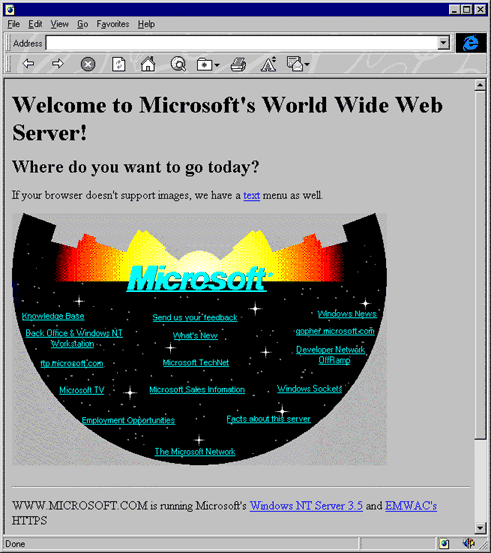

**Joonis 4-14. Microsofti esimene koduleht. Allikas: http://www.microsoft.com/misc/features/features\_flshbk.htm**

Tolle aja veebilehed uuenesid harva, eelkõige kuna käsitsi HTMLi muutmine oli ebamugav, pealegi tol ajal piisas ka lihtsalt veebis olemas olemisest.

#### Veebidisaini teine põlvkond

Veebidisaini esimese lainena jõudsid veebi entusiastidest kasutajad isiklike veebilehtede ning lingikogudega. Järgmisteks tulijateks said ettevõtjad, sest levis tõdemus, et kui sind ei ole veebis, siis sind ei ole olemas! Seega märksõnaks "Reklaami seda, mida müüd, veebis ja kasutajad tulevad!".

Veebilehed hakkasidenam keskenduma sisule ja külastajatele – lisandusid külalisteraamatud ning alustati külastajate arvu järgimist. Mitmekülgsemaks muutus ka disain. Lihtsad pealkirjad ja tekstilõigud asendasidvärvilised ja vilkuvad tekstid/pidid, andmetabelid, reklaambännerid.

Veebilehtede loomine oli nüüdseks samuti lihtsam, sest eksisteerisid mitmesugused veebitoimetajad **_HTML editor_**, mis päästsid kasutajad käsitsi koodikirjutamisest. Jätkuvalt oli probleemiks standardite puudumine. Tolleaegsete brauserite turuliidrid Internet Explorer ja Netscape, kuvasid tihtilugu HTMLi erinevalt ning võimaldasid laiendusi, millest vaid üks lehitseja aru sai. Seetõttu oli aina keerukam luua veebilehti, mida näidataks ühtmoodi kõikjal.

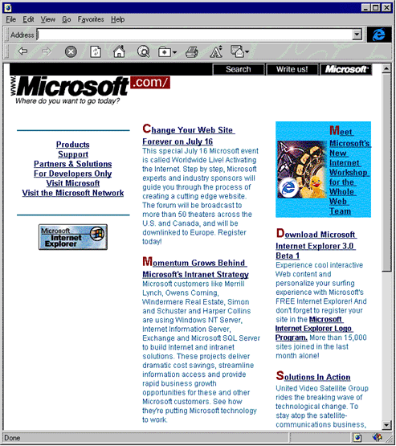

Joonis 4-15. Teise põlvkonna Microsofti veebilehe näide. Allikas: http://www.microsoft.com/misc/features/features_flshbk2.htm

#### Veebidisaini kolmas põlvkond

Kolmanda põlvkonna veebilehtede kujundus ja struktuur sõltus lehe eesmärgist, enam ei keskendutud niiväga hetkel kuumale tehnoloogiale vaid sisule ning mis on just selle kuvamiseks parim viis. Aina olulisemaks muutus navigatsioon - veebilehtedel oleva info struktureerimine ning selle kiiresti ülesleidmine.

Populaarsust võitsid kindlale sihtgrupile suunatud veebilehed – näiteksportaalid ja kommuunid, kujunduses hakati aina enam sisu jaotama tulpadesse.Veebi muutis elavamaks ning vahetumaks uus tehnoloogia Macromedia Flash, populaarseks said tervituslehed (intro).

Kolmanda põlvkonna veebilehtede loomine oli eelnevatest märgatavalt hõlpsam, seejuures oli kujunduse jaoks palju rohkem võimalusi. Varasemast olulisemaks sai aga informatsiooni värskus ning veebilehtede uuendamine. Selle lihtsustamiseks alustati kujunduse ning sisu eraldamisega – kasutusele võeti CSS stiililehed, mis võimaldasid need kaks hoida erinevates failides ning emba-kumba teist puutumata muuta.

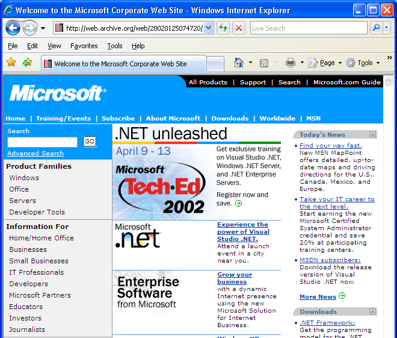

Joonis 4-16. Kolmanda põlvkonna Microsofti leht. Allikas: http://www.microsoft.com/misc/features/features\_flshbk2.htm

#### Veebidisaini neljas põlvkond

Nüüdseks on enamik veebilehti paika saanud oma sihtgrupi ning sisu. Järgmisena on vaja viimistleda kasutusmugavust ja juurdepääsetavust.

Neljanda põlvkonna veebilehtede hulka kuuluvad Web 2.0 rakendused. Selle põlvkonna kujundus on tõepoolest interaktiivne – olulise sisuna on veebi liikunud videod. Tihti kohandub veebilehe kujundus vastavalt külastaja rollile või tegevusele, samuti võib ühel veebilehel olla mitu erinevat kujundust tagamaks ühtmoodi head kasutajakogemust olenemata sellest, kas veebilehte külastatakse kasutades lauaarvutit, taskus olevat nutitelefoni või elutoas pesitsevat mängukonsooli.

Oluliseks on saanud ka **juurdepääsetavus** **_accessibility_**– kui hästi on veebilehe sisu edasiantav vaegnägijatele kasutades ekraanilugeja tehnoloogiaid. Hästi kujundatud lehed püüavad infot visuaalselt struktureerida ning kasutada intuitiivset navigatsiooni igal lehel. Tähtis on vastavus standartidele, et siis veebileht näeks kõikides standardeid toetavates veebilehtedes välja just nii nagu kujundaja ette on kujutanud.

Veebilehed pole enam vaid staatilised ressursid, mida ainult tarbitakse. Veebilehe külastaja on üks paljudest, kes loob selle sisu. Wikid ja ajaveebid annavad igale inimesele võimaluse avaldada oma arvamust ning jagada oma mõtteid. Üks veebileht ei uuene enam mitte iga kuu või päev vaid iga sekund.

Oluliseks veebi osaks on saanud sotsiaalvõrgustikud (Facebook, Twitter, Orkut, Rate jpt.), mis toovad kokku ühesuguste huvidega inimesi ja võimaldavad olla pidevalt kursis oma sõprade ja tuttavate igapäevaste toimetustega. Värskeks trendiks on asukohapõhised sotsiaalvõrgustikud nagu Foursquare ning Gowalla, mis võimaldavad igal hetkel leida lähedalasuvaid sõpru ning avastada ümberkaudsete kaupluste parimaid pakkumisi.


Joonis 4-17. Neljanda põlvkonna Microsofti leht. Allikas: http://www.microsoft.com/en-us/default.aspx

#### Muud veebitehnoloogiad

::: vananenud

Lisaks HTMLile on veebis oluliseks saanud tehnoloogiad, mis võimaldavad veebilehe sisu ja käitumist jooksvalt kohandada vastavalt külastaja tegevusele.

Sellised tehnoloogiad nagu AJAX (Asynchronous JavaScript and XML) täiendavad veebilehtede kujundust. AJAX võimaldab info edastamist ilma lehte taas allalaadimata. AJAX on kasutusel näiteks Bing Maps teenuse juures selleks, et võimaldada kaardil ringiliikumist ja sisse/välja suumimist nõnda, et iga uue kihi laadimine toimuks märkamatult ilma kogu lehte uuesti laadimata (http://[www.bing.com/maps](http://www.bing.com/maps)).

Lisaks AJAX-ile on laialt kasutusel sellised tehnoloogiad nagu Flash ja selle konkurent Microsofti Silverlight. Neid kasutatakse peamiselt RIA _Rich Internet Applications_ rikka sisuga veebirakendused) rakenduste loomiseks, mille üheks ülesandeks on tuua töölaua rakenduste töökindlus, lai funktsionaalsus ja kasutajakogemus veebi või vastupidi teha veebirakendused kasutatavaks töölauarakendusena.

Mobiilne internet võimaldab info edastamist mobiiltelefonidele ja taskuarvutitele. Üks mobiilse veebikujunduse peamistest väljakutsetest on piirangud kujundusele, mille seavad ekraani väikesed mõõtmed. Teiseks väljakutseks on töö tagamine erinevate seadmetega, mis võivad käituda erinevalt, kuna puuduvad standardid nagu WWW algusaegadel lauaarvutite veebilehitsejates. Lahenduseks on loomulikult standardiseerimine, millega tegeleborganisatsioon W3C.

:::

#### Veebidisaini tulevik

::: vananenud

Kui Web 2.0 lõi pinnase erinevate võrgustike tekkeks, siis Web 3.0 annab tööriistad, et praegust veebiruumis vohavat infokaost paremini struktureerida, filtreerida ning ühendada. Web 3.0 sünonüümiks on semantiline veeb, mis tähendab, et masinad on tulevikus võimelised mõistma iga infokillu tähendust, kuuluvust ja konteksti. Kujutlegem ette otsingut, mis ei anna kunagi ebaolulisi tulemusi või tööriistu, mis suudavad lahendada ise probleeme tänu sellele, et nad mõistavad veebist leitava materjali semantikat. Web 3.0 võib ka nimetada intelligentseks veebiks, mis toob kindlasti kaasa suured muutused veebidisainis.

Sõna dünaamiline veeb saab tulevikus uue tähenduse, mille esimesi samme võib näha kaasaegsete veebistandardite HTML5 ja CSS3 näol. Uued standardid toovad kaasa ka uue põlvkonna tööriistad, mis teevad veebiarenduse ja -disaini kiiremaks ning valutumaks.

Kasvavad trendid interaktsiooni maailmas – puuteekraanid, geotagimine, augmenteeritud reaalsus, multiplatvormi rakendused, pilverakendused, uut tüüpi mobiilsed seadmed jne. muudavad jõudsalt seda, kuidas me masinatega suhtleme ja kuidas neid kasutame. Näiteks pole välistatud, et tulevikus võtavad puuteekraanidega seadmed üle suurema osa arvutite turust, mille tulemusel muutub veeb intuitiivsemaks ning interaktiivsemaks. Uuteks väljakutseteks on väikeste ja suurte ekraanide jaoks kujundamine. Iga aastaga on keskmised kodu- ja tööarvutite ekraanide suurused muutunud aina suuremaks, mille tulemusel lähitulevikus ilmselt 960 piksline veebilehe laiuse standard kaob ning asendub rohkem dünaamilisema sisu paigutamisega ekraanil. Ühtlasi on uuteks suundadeks trükimeedia liikumine digitaalmeedia poole, mis tähendab interaktsiooni- ja veebidisaini mõttes uusi väljakutseid ja standardeid. Mitmed ajakirjad ning ajalehed vaatavad veebi, kui odava platvormi poole, mille abil kvaliteetset ja toimetatud infot müüa. Esimesed seadmespetsiifilised internetiväljaanded on juba ilmunud. Eestiski on nii Eesti Päevaleht kui ka Eesti Ekspress kättesaadavad tahvelarvutitele mõeldud rakenduste näol.

:::

### B.4.3.2 Hüpertekst ja hüpermeedia ning nende tähtsus veebidisainis

::: oppekava

Määratleda hüpertekst ja hüpermeedium ning tuua välja nende tähtsus veebilehtede disainimisel.

:::

Hüpertekst on tekst, mis sisaldab viitasid teistele dokumentidele. Viitade arv dokumendis ei ole piiratud. Hüperteksti mõiste on tihedalt seotud WWWga. Kuid hüperteksti kasutatakse mitte ainult veebis. Klassikaliseks näiteks võib olla entsüklopeedia, kus viitasid kasutatakse sama teksti piires: ühes artiklis on viidad teistele artiklitele.

Hüperteksti struktuur on mittelineaarne. Võrdluseks võib tuua raamatu. Raamatu struktuur on lineaarne, kuna me liigume järjest ühe lehe pealt teisele. Veebis võib igal lehel olla mitu viita, mis viitavad omavahel mitteseotud dokumentidele, mis võivad asuda eri serveritel ja eri kontinentidel (olete kindlasti märganud, et liikudes mööda viitasid avastate ennast saitidel, mis ei ole üldse seotud ei teema ega sisu poolest nende saitidega, kus te paar minutit tagasi olite). Ühe saidi piires moodustavad veebilehed puukujulise struktuuri, kus ülemisel tasemel on pealeht, millelt võib liikuda kõikidesse jaotistesse ja alamjaotistesse.

Hüperlink (viit) tavaliselt erineb ülejäänud tekstist, reeglina on see allajoonitud ja teist värvi. Paigutades hiirekursori viidale, muudab see oma kuju. Hiirekliki tulemusena viidatav dokument avaneb kas samas või uues aknas. Hüperlinkide abil võib viidata nii veebilehtedele kui ka graafika-, audio- või videofailidele. Näiteks, kui hüperlink viitab videoklipile, võib seda kohe ka vaadata (tingimusel, et süsteemis on vastav programm).

Esimene brauser suutis näidata ainult tekste, kõik viidad olid samuti tekstilised. Mosaic brauseri ilmumisega tekis võimalus paigutada veebilehtedele ka graafikat. Tänu graafikale läks navigeerimine lihtsaks. Sujuvalt lisandusid hüperteksti ka muud võimalused - sellised nagu video, audio, erinevad graafilised elemendid, ja hüpertekst muutus hüpermeediaks.

Veebilehti, mis sisaldavad ainult teksti, võib pidada hüpertekstilisteks. Lehed, mis sisaldavad multimeedia komponente, kannavad nimetust "hüpermeedium". Kui edaspidi jääda selle terminoloogia juurde, kuulub enamik veebilehtedest hüpermeediumisse, puhtalt hüpertekstilisi lehti on väga vähe.

#### Viitade tüübid

::: vananenud

Liikumine mööda saidi lehekülgi ja jaotisi on korraldatud teksti- või graafiliste viitadega.

**Tekstiviidad**

Eelised:

- lihtsalt redigeeritav (nii viida tekst, kui ka uue viida lisamine);
- ühilduv kõikide brauseritega;
- suur laadimise kiirus.

Puudused:

- ei saa kasutada erinevaid kirjakujusid ega efekte.

**Graafilised viidad**

Eelised:

- näitlikkus;
- efektne (viidad tõmbavad endale tähelepanu).

Puudused:

- kui brauseris on graafika laadimine keelatud ja saidi looja ei ole kasutanud atribuuti `alt`, ei näe kasutaja ei nuppu ega viita;
- keeruline redigeerida (viida teksti muutmiseks tuleb muuta terve nupp, nupu lisamiseks tuleb see eelnevalt luua graafika redaktoriga, nupu lisamine võib olla raskendatud, kui saidi loomisel ei olnud ettenähtud veel ühe elemendi lisamist);
- suur arv graafilisi elemente aeglustab lehe allalaadimist.

:::

#### Veebilehe komponendid

Veebilehe planeerimisel kasutatakse komponente, mis jagunevad püsivateks ja sisust sõltuvateks komponentideks.

Püsivad komponendid on näiteks:

- Päis – lehe ülemine serv, mis sisaldab esmast infot selle kohta, kuhu külastaja sattus.
- Jalus – lehe alumine serv, mida tavapäraselt kasutatakse esmase kontaktinfo ja formaalsete materjalide esitlemiseks (saidi kasutustingimused, reeglid, privaatsusteave, jne).
- Navigatsioonikomponent - võib olla nii horisontaalne kui vertikaalne; kasutatakse ka kombineeritud versioone.
- Sisukaart – levinud abivahend, mida kaasaegsetes veebides kasutatakse püsiva komponendina lehe jaluses.
- Kontaktinfo – esmane kontaktinfo peab kasutajale olema püsivalt kättesaadav.
- Otsing – rohkem kui 100 lehekülge sisaldaval saidil on soovitav kasutada saidisisest otsingut.
- Sisu – sisuala on eraldi komponent, mille sees kuvatakse kõik sisust sõltuvad alamkomponendid.

Sisust sõltuvad komponendid on näiteks: lehe sisu, veateated, abitekstid, vormid, madalama taseme navigatsioon, jne.

### B.4.3.4 Sisevõrgu ja välisvõrgu veebilehtede kasutus ja vajadus ettevõttes

::: oppekava

Kirjeldada sisemiste ja väliste veebilehtede kasutamise vajadust ettevõttes.

:::

Veebiserver võib asuda nii internetis kui ka kohalikus võrgus. Kui veebiserver asub kohalikus võrgus, võib korraldada ka oma sisevõrgu sarnaselt internetile. Sealjuures osa saidist võib olla avalik (www) ja osa ettenähtud vaid sisemiseks kasutamiseks (intranet).

Intraneti kasutajateks on asutuse töötajad, samas kui saidi avalik osa on mõeldud ettevõtte klientidele. Intranet sisaldab tööks vajalikku infot, kuid see ei tohi olla nähtav klientidele ja konkurentidele.

Välimine ja sisemine saidi osa esindavad kahte erinevat infokeskkonda, kumbki orienteeritud kindlale kasutajate ringile. Iga keskkond tagab erinevate ülesannete lahendamise ja omab erinevaid tehnilisi piiranguid, sellepärast peab lähenemine nende keskkondade projekteerimisele olema erinev. Intraneti kasutajaliidese disain peab erinema avatud saidi disainist, et kasutaja näeks, kus ta antud hetkel asub, kuid mõlema liidese stiil peab olema sama ja lähtuma ettevõtte üldisest disainist. Intraneti väljatöötamisel on tähtis arvestada, et riist- ja tarkvara on ettevõttes ühtlane (kasutusel on sama brauseri versioon, sama platvorm ja operatsioonisüsteem, samad kirjafondid); samas kui interneti kasutajad võivad omada väga erinevaid arvuteid, operatsioonisüsteeme ja brausereid.

### B.4.3.5 Ettevõtte veebisaidi haldamine

::: oppekava

Tuua välja mõningad probleemid, mis on seotud äriettevõtte veebilehe ülalpidamisega.

:::

Veebisaidi haldamisega on seotud mitmed väljakutsed:

- Kuidas teada, et valmis on saanud õige asi?
- Kuidas teada, et sait täidab oma eesmärke?
- Kuidas kindlaks teha, mis vajab parandamist?
- Kuidas pakkuda kasutajatele väärtust püsivalt ja pikaajaliselt?

Esimesed kolm väljakutset on seotud saidi kasutamise statistika kogumise ja analüüsimisega. Kui sait on valmis ja sisuga täidetud, tuleb selle kasutamist mõõta. Selle jaoks on olemas tasuta ja tasulised tarkvarad. Kõige populaarsem nendest on tasuta Google Analytics. Analytics katab ära enamiku ettevõtete vajadused. Kes soovib sügavamat kasutajate analüüsi läbi viia, nende jaoks on olemas erinevad tasulised versioonid, näiteks Snoobi, Omniture Site Catalyst, Gemius, jt.

Väärtuse pakkumine pikaajaliselt on otseses seoses kvaliteetse sisu loomisega ning saidi pideva täiendamisega. Ärieesmärke täitev veebisait ei saa kunagi valmis – sarnaselt Tallinnaga on seda vaja pidevalt täiendada.

Tänapäeval tuleb lisaks tegeleda veel kasutajate privaatsuse kaitse ning veebisaidi turvalisusega.

### B.4.3 Kordamisküsimused

::: kordamiskusimused

1. Millistel eesmärkidel hakati looma arvutivõrku?

- sõjalistel
- teaduslikel X
- ärilistel

2. Mis on hüperlink?

- brauseri nupp
- viide suvalisele failile X
- viide teisele tekstile

3. Kelle eesmärke silmas pidades luuakse veebisaite?

- saidi omaniku X
- kõikide internetikasutajate
- spetsiifiliste sihtrühmade

:::

## B.4.4 Veebidisaini nõuded ja meetodid

Selle alateema materjale läbi töötades õpid tundma veebilehestiku koostamise juures vajalikke etappe.

### B.4.4.1 Sihtrühma vajaduste analüüs

::: oppekava

Näidata veebilehe sihtrühma vajadused, kelle jaoks leht on loodud.

:::

Veebilehe disainimisel on hea tava analüüsida, millised külastajad hakkavad saiti külastama. Et olla kindel saidi loomise eesmärgis (näiteks firma toodete esitamine, online-müük või lihtsalt reklaam), peab disainer töötama koos tellijaga, arvestama kõikide tema soovidega ja looma kujunduse, mis on orienteeritud kindlale saidi külastajate ringile (sihtrühmale). Peale saidi esimese prooviversiooni valmimist peab disainer tegema koostööd sihtrühma liikmetega (prototüübi testimine), kes teevad süsteemi kasutamise käigus märkusi ning avastavad nõrgad kohad protsessides ja kasutajaliideses. Toetudes testi tulemustele jätkab disainer saidi väljatöötamist ning parandab leitud vead.

Saidi analüüsimine ei tähenda alati, et see vastab kõigile kasutatavuse nõuetele ja on kasutajatele mugav. Saidil võivad ikkagi olla puudused, mida ei arvestatud või ignoreeriti. Seepärast on mõistlik teha prototüübi testimist vähemalt kaks korda ning testijate arv ei tohiks olla väiksem kui kuus. Selline testijate hulk on piisav, et esile tuua 90% olulistest vigadest.

### B.4.4.2 Infohulk veebilehel

::: oppekava

Tuua välja riskid, mis ilmnevad kui ühel lehel on liiga palju sõnumeid.

:::

Sobiva sisustruktuuri valikul tuleb meeles pidada, et ühel lehel ei tohi olla liiga suurt infohulka, sest paberkandjal ja ekraanil nähtava teksti omandamine on erinev. Arvutiekraanilt on suurem infohulk halvemini omandatav, sellepärast tuleb lõhkuda info väiksemateks tükkideks ning rõhutada tähtsamaid tekstilõike. Näiteks, kui saidil on esitatud suur toodete valik, on mõistlik koostada kataloog. Liikudes kataloogis, saab külastaja juurdepääsu lehele konkreetse kauba kirjeldusega, samal lehel on ka viidad kõigile teistele saidi jaotistele.

Jakob Nielsen on läbi viinud uuringuid teksti hulga ja selle loetavuse vahel. Selgub, et mida rohkem on lehel teksti, seda väiksemat osa sellest loetakse. Tervikuna loetakse ainult väga lühikesi tekste. Juba 100 sõna korral on loetavus ainult 50%.

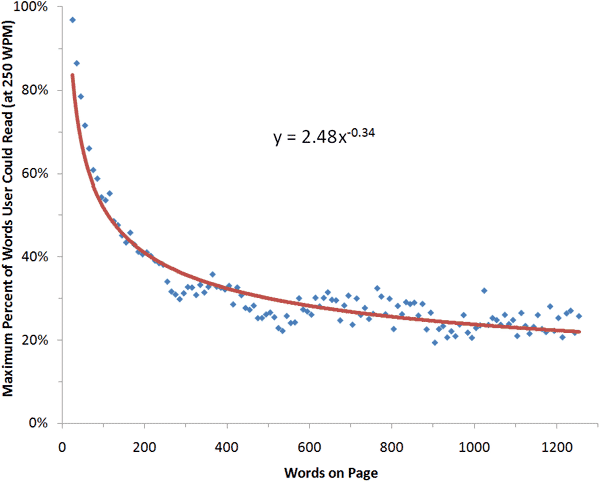

\_Joonis 4-18. Teksti hulga ja loetavuse suhe. Allikas: How little do users read?, Nielsen's Alertbox, http://www.useit.com/alertbox/percent-text-read.html

### B.4.4.3 Värvide valik

::: oppekava

Loetleda probleemid seoses halva värvivalikuga lehel.

:::

Veebilehel kasutatud värvid omavad samuti suurt tähtsust. Värvide valikul peab arvestama, et ka värvid on võimelised edastama infot ning hea värvivalik võib saiti oluliselt parandada ja teha see külastajale atraktiivsemaks. Valesti valitud värvid halvendavad saidi omaksvõtmist (näiteks valge teksti paigutamine kollasele taustale teeb loetavuse halvemaks). Omavahel mittesobivate värvide kasutamine võib ühest küljest äratada oma ebatavalisusega külastaja tähelepanu, teisest küljest võib see muuta veebisaidi kasutamatuks.

Ebasoovitav on heleda teksti kasutamine tumedal taustal – meie silmad ei ole harjunud selliseid visuaalseid konstruktsioone kasutama ning teksti omandamine on raskendatud. Raske on ka vastandvärvides kombinatsioonid, näiteks roheline tekst punasel taustal või vastupidi.

### B.4.4.4 Kasutajasõbraliku veebilehe arendamine

::: oppekava

Tuua juhtnöörid hea kasutajasõbralikkusega veebilehe loomiseks: loetavus, prioriteetidega sisujaotus, liikumise lihtsus ja järjepidevus, kus-ma-hetkel-olen asukoha tuvastus.

:::

> Kasutatavuse põhimõte: mida rohkem nõuab või võib nõuda miski ajalisi kulutusi, seda väiksem on tõenäosus, et keegi hakkab seda miskit kasutama.

Steve Krug

Hea kasutajakogemus toetub neljale põhikomponendile:

- **Funktsionaalsus** **_functionality_**. Funktsionaalne asi on spetsiaalne tööriist konkreetse probleemi lahendamiseks. Tarkvara peab tegema seda, milleks ta mõeldud on.
- **Ilu** **_beauty_**. Välimus on väga tähtis. Ilus välimus, hea disain soodustab erilise emotsionaalse suhte tekkimist kasutaja ja toote vahel. Emotsionaalne suhe on see, mis toob kasutaja meie juurde tagasi.
- **Atraktiivsus** , külgetõmbavus **_affinity_**. Midagi erilist, mis paneb kasutaja just seda toodet tahtma. Külgetõmbavus saavutatakse hea välimuse, hea funktsionaalsuse ja tavaliselt veel mõne erilise omadusega, mis muudab toote teiste seas vastupandamatuks.
- **Lugu** **_story_**. Heal kasutajakogemusel on alati olemas lisaväärtus. Kasutajal peab tekkima õige meeleolu toote ostmiseks. Kasutuslugu on sama, mis lugu inimesest, kes kasutab toodet.

Ühestki nimetatud komponendist eraldi ei piisa, et toode oleks edukas. Hea kasutajakogemus tekib kõigi nelja komponendi koostoimel. Head kasutajakogemust pakkuv toode suudab konkurentide seast eristuda, suurendada efektiivsust ning avab uusi ärivõimalusi.

Kaks kõige olulisemat reeglit, mida võiks veebilehe kujundamisel meeles pidada:

- veebileht tuleb luua kasutajatele,
- need inimesed ei mõtle tingimata samamoodi nagu disainer või arendaja.

Eksisteerivad **üldised hea kasutajakogemuse reeglid** , mida nimetatakse ka kasutatavuse heuristikateks. Reeglid on välja töötanud Jakob Nielsen - maailmas tunnustatud kasutatavuse guru:

- **Kasutaja peab saama tagasisidet toimuvast** - Keskkond peaks alati kasutajat mõistlikul ajal informeerima süsteemis toimuva kohta asjakohaste teadetega.
- **Süsteemi ja päris maailma sobivus** - Süsteem peaks alati rääkima kasutaja keeles. Tehes seda sõnade, väljendite ja mõistetega, mis on kasutajale tuttavad. Süsteemile orienteeritud keel ajab kasutaja segadusse. Tuleks järgida päris maailma vestlusi, mis muudavad informatsiooni loomulikuks ja loogiliseks kõigile kasutajatele.
- **Kasutaja kontroll ja vabadus** - Tihtipeale teevad kasutajad süsteemis vigu. Selle jaoks tuleks neile jätta varuväljapääse, et ei peaks läbima ulatuslikke muudatusi. Tühistamise ja uuesti tegemise funktsioonid on hädavajalikud.
- **Järjepidevus ja standardid** - Kasutaja ei tohiks mõelda, kas erinevad sõnad, situatsioonid ja meetmed tähendavad kõik sama. Järgi platvormi konventsioone.
- **Vigade ennetamine** - Veateatest isegi parem lahendus on hoolikult loodud lahendus, mis ei lase veal üldse tekkidagi. Veaaltid olukorrad tuleks elimineerida või üle kontrollida ning anda kasutajale võimalus valida, kas rakendada funktsiooni või mitte.
- **Selgus ja intuitiivsus** - Kasutaja mälu kasutamist ei tohiks üle koormata. Objektid, funktsioonid ja valikud peaksid olema alati nähtaval või kergesti ligipääsetavad. Kasutaja ei peaks kunagi meelde jätma ühe vaate informatsiooni, et seda järgmises kasutada. Süsteemi kasutamise instruktsioonid peaksid olema alati nähtaval kohal ning kergesti kasutatavad.
- **Kasutamise paindlikus ning tõhusus** - "Kiirendajad", mis võivad algajale märkamatuks jääda, kiirendavad tihtipeale interaktsiooni edasijõudnute ja süsteemi vahel. Süsteem peaks toetama nii algajaid kui edasijõudnud kasutajaid. Kasutajal peaks olema vabadus kohandada korduvaid funktsioone.
- **Esteetiline ja minimalistlik disain** - Dialoog ei tohiks kunagi sisaldada ebavajalikku ja kontekstivälist informatsiooni. Iga lõik lisainformatsiooni vähendab põhiinfo olulisust ning vähendab selle üldist nähtavust.
- **Aita kasutajatel vigu ära tunda ning nendest välja tulla** - Veateated peaksid alati olema selges inimkeeles (mitte süsteemi kood), täpselt ära märkima probleemi allika ning pakkuma välja lahenduse.
- **Abi ja dokumenteerimine** - Olgugi, et on parem kui süsteemi peaks saama kasutada ilma abiinformatsioonita tuleb seda vahel kasutajale pakkuda. Iga selline info peaks olema kergesti üles leitav ja otsitav, keskenduma kasutaja võimalikele probleemidele, näitama ette täpsed sammud, et leida lahendus ning ei tohiks olla väga mahukas.

Lisaks heuristikatele on olemas veel terve hulk häid tavasid, mis on veebiajaloo vältel välja kujunenud ning oma paikapidavust tõestanud:

- Aseta oma logo ja/või nimetus igale veebileheküljele (lääne kultuuriruumis päises vasakule) ning muuda logo lingiks esilehele (välja arvatud esilehel, kus logo ei peaks olema klikatav: kunagi ei tohiks luua lehele linki, mis viib tagasi samale lehele).
- Otsing tuleks kindlasti lisada kui veebileht sisaldab rohkem kui 100 lehekülge.
- Kirjuta lühikesi ja konkreetseid pealkirju lehtedele. Pealkirjad peaksid selgelt edasi andma lehe sisu ning olema arusaadavad ka kontekstivälistes keskkondades nagu otsingumootorid.
- Struktureeri lehekülg nii, et seda oleks võimalik silmadega skanneerida, et kasutaja ei peaks läbi töötama korraga suuri infokoguseid endale olulise informatsiooni kätte saamiseks. Näiteks kasuta grupeerimist ning alampealkirju, et jaga tekst väiksemateks ja paremini haaratavateks lõikudeks.
- Selle asemele, et kogu info ühele lehele ära mahutada tuleks kasutada linke, et luua lihtne navigatsioon, mis annaks esilehel ühtlasi ka ülevaate, mida kasutaja läbi klikkima hakkab. Oluline on mitte raisata kasutaja aega kui ta peab kogu materjali üksikasjalikult läbi töötama, et leida mõni informatsioonikild.
- Kasuta tootefotosid, kuid hoidu kasutamast suurte piltidega üle kuhjatud lehekülgi. Selle asemel kasuta pisipilte ülevaate loomiseks, mis on lingitud edasi suurematele piltidele. Mõned pildid vajavad isegi suurendatavaid ja keeratavaid lahendusi. Toote esileht peaks olema kiire, ülevaatlik ning piiratud pisipiltide kasutamisega.
- Kui luua pisipildid, siis mitte kasutada lihtsalt skaleerimist. Skaleerimise tulemusel võib väikepilt muutuda lihtsalt pikslimüraks ja kasutuskõlbmatuks. Selle asemele tuleks suurendada detaile, mis algse pildid puhul on olulised ning kasutada selleks kombinatsiooni pildi lõikamisest ning vähendamisest.
- Kasuta linkide puhul lingi pealkirju (link titles), et anda kasutajale vihje kuhu ta klikates satub.
- Tee kindlaks, et kõik olulisemad lehed on ligipääsetavad erivajadustega inimestele. Eriti pimedatele.
- Tee nii nagu teised: kui keegi on loonud mõne interaktsioonielemendi, mis töötab hästi, siis kasuta samu meetodeid. Oluline on ka, et veebilehed käituksid üldiselt võrdlemisi sarnaselt, sest kasutajad ootavad seda. Tuleks meeles pidada Jakob Nielseni kasutajakogemuse põhireeglit: kasutajad on mõtetes alati mõnel teisel leheküljel, mis tähendab, et nad loovad oma ootused teiste juba töötavate lehekülgede baasil.

### B.4.4.5 Peamised veebilehe kvaliteedi kriteeriumid

::: oppekava

Kirjeldada üldisemaid veebilehe kvaliteedi tingimusi: veebilehitseja võimekkus, HTML valideerimine, teksti tihendamine (condence), õigekirjakontroll, väike baidisuurusel graafika (small byte-size graphics).

:::

#### Lehe allalaadimise kiirus

Saidi kasutamise mugavus sõltub mitte ainult värvigammast, struktuurist ja navigatsioonist, vaid ka internetiühenduse tüübist. Paljud kasutavad kiiret DSL-ühendust, kuid on ka neid, kes kasutavad telefoniliine, paremal juhul ISDNi või mobiilset internetiühendust.

Saidi loomisel peab arvestama graafika ja muude efektide hulgaga, sest külastaja ei hakka ootama, millal see kõik alla laetakse. Erinevate uuringute tulemusena on selgunud, et külastaja on nõus ootama lehe allalaadimist kuni 10 sekundit. Kui selle aja jooksul ei ole info laekunud, külastaja lihtsalt lahkub. Peale "raske" graafika võib saidi allalaadimist aeglustada ka paljude üksteise sisse paigutatud tabelite olemasolu, sest tabel ei ilmu ekraanile enne, kui on allalaetud kogu selle sisu. Sellepärast tuleb saidi loomisel elementide paigutamiseks kasutades CSSi, mitte tabeleid.

#### Ühilduvus erinevate platvormide ja brauseritega

Veel üks kasutatavuse probleem seisneb erinevates brauserites ja operatsioonisüsteemides. Paljud interneti saidid on optimeeritud kindlale platvormile või brauserile. See ei ole parim lahendus, sest siis jääb risk kaotada külastajaid, kes kasutavad, näiteks, teist tüüpi arvutit.

Lehe väljatöötamisel peab võimalusel testima seda erinevates keskkondades, sest sama brauser erinevatel platvormidel võib näidata lehte erinevalt. See aitab vältida probleeme lehe kuvamisega.

Mingil juhul ei tohi kirjutada veebilehele, et see on häälestatud mingisugusele brauserile ning lehe avamiseks tuleks kasutada just seda. Kasutaja peab ise otsustama, mida on tal mugavam kasutada, keegi ei saa sundida teda kasutama programmi, mis talle ei meeldi.

Probleemi lahenduseks on HTMLi ja CSSi standardite järgimine. Standardite loomise ja levitamisega tegeleb World Wide Web Consortium. Kõik spetsifikatsioonid on kättesaadavad [http://www.w3.org/](http://www.w3.org/)

#### Kuvamise ja omaksvõtmise eripärad

Lehe disainimisel tuleb arvestada kõikide võimalike probleemidega, millega võib külastaja kokku puutuda. Selliste probleemide hulka kuuluvad näiteks graafika kuvamine, info omaksvõtmine, liikumine mööda viitasid.

Graafiline info ei ole külastajale alati kättesaadav (graafiline väljund on välja lülitatud, külastaja näeb halvasti ja kasutab tekstibrauserit). Sellepärast kõikidele kujunditele tuleb lisada alternatiivtekst (märgendi `img` atribuut `alt`). Siis saavad külastajad teada, milline kujund on lehel. Kui navigatsioonisüsteem sisaldab menüüd, mis koosneb graafilistest nuppudest, oleks hea teha ka alternatiivne tekstimenüü (sellise menüü olemasolu on teretulnud ka sisukaardil).

Arvestama peab ka kirja suuruse määramist. Parem on määrata suurus kasutades suhtelisi ühikuid (%), et külastaja saaks vajadusel seda muuta, näiteks suurendada. Absoluutühikutes (px, pt) määratud kirjasuuruseid kasutaja muuta ei saa.

### B.4.4.6 Lihtsalt navigeeritav veebileht

::: oppekava

Selgitada nõuet lihtsaks liikumiseks veebilehel.

:::

Nagu varem mainitud, peab saidi disainimisel arvestama potentsiaalsete külastajate vajadusi ning näha ette probleeme, mis võivad saidi kasutamisel tekkida. Selleks, et lihtsustada saidi projekteerimist ja kasutamist, tuleb koostada saidi mudel (kaart).

Mudeli loomiseks on olemas meetod, mida nimetatakse kaartide sorteerimiseks **_card sorting_**. Sihtrühma liikmetele antakse sisuühikute nimetused eraldi kaartidel ning nad koostavad saidi navigatsiooni vastavalt oma parimale äratundmistele ning eeldustele. Sellisel viisil saadakse navigatsioonile parim vundament. Mudelit kasutatakse selge loogilise struktuuri ja lihtsa ning arusaadava navigatsiooni loomiseks. Heaks tavaks on sait eelnevalt ka testida (prototüübi testimine).

Vaata ka [http://en.wikipedia.org/wiki/Card_sorting](http://en.wikipedia.org/wiki/Card_sorting)

Sobiva struktuuri variandi valikul tuleb meeles pidada, et ühel lehel ei tohi olla liiga suurt infohulka, sest paberkandjal ja ekraanil nähtava teksti omandamine on erinev. Arvutiekraanilt on suurem infohulk halvemini omandatav, sellepärast tuleb lõhkuda info väiksemateks tükkideks ning rõhutada tähtsamaid tekstilõike. Psühholoog George Miller leidis, et inimese lühiajaline mälu töötleb maksimaalset infohulka 7±2 ühikut. Sellest tulenevalt on meil raskem kasutada navigatsioonikomponente, kus on rohkem infoühikuid. Näiteks kui saidil on esitatud suur toodete valik, on mõistlik koostada struktureeritud kataloog. Liikudes kataloogis, saab külastaja juurdepääsu lehele konkreetse kauba kirjeldusega, samal lehel on ka viidad kõigile teistele saidi jaotistele.

Vaata ka: [http://en.wikipedia.org/wiki/The_Magical_Number_Seven,\_Plus_or_Minus_Two](http://en.wikipedia.org/wiki/The_Magical_Number_Seven,_Plus_or_Minus_Two)

### B.4.4.7 Vahendid veebilehe arendamiseks

::: oppekava

Loetleda veebilehe loomise töövahendid.

:::

::: vananenud

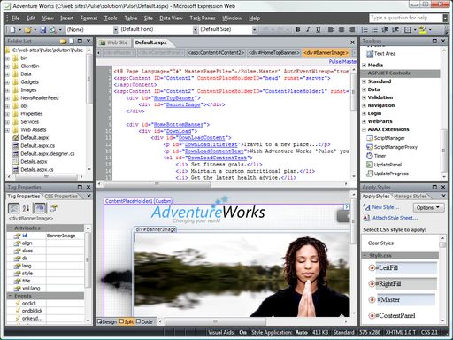

_Joonis 4-19. HTMLi redaktori vaade (Microsoft Expression Web). Allikas: http://expression.microsoft.com/en-us/dd450355_

Veebilehe loomiseks võib kasutada erinevaid vahendeid lihtsatest väga keerulisteni. Vahendite valik sõltub sellest, kellele ja millisel eesmärgil sait luuakse (firma saite loovad elukutselised spetsialistid kallimate programmide abiga, harrastaja poolt tehtud sait on loodud lihtsamate vahenditega). Lihtsaks programmiks on näiteks tavaline tekstiredaktor Notepad, keerulisemate hulka kuuluvad MS Expression Web ja Adobe DreamWeaver.

Lihtsaid ja odavaid vahendeid ei ole alati lihtne kasutada. Selleks, et luua veebileht Notepad'iga, tuleb väga hästi tunda HTML-keelt, mis Expression Web'i kasutamisel ei ole üldse kohustuslik. Siin sõltub HTML-keele kasutamise vajadus programmis seadistatud vahendite komplektist.

Veebisaitide loomise programmid jagunevad kahte kategooriasse: visuaalsed ja mittevisuaalsed.

**Visuaalseid redaktoreid** nimetatakse ka WYSIWYG-redaktoriteks ("What You See Is What You Get" - "Mida näeb, selle ka saad"). Saidi haldamiseks on kiirem ja lihtsam viis kasutada visuaalseid programme, mis lubavad töötada veebilehega disainiaknas. Kasutaja redigeerib ja vormindab teksti, lisab pilte, tabeleid, nagu tekstiredaktoris (näiteks, Wordis) ja programm paneb ise kokku HTML-koodi. Veebileht näeb välja brauseri poolt kuvatuna samasugune, nagu selle loova programmi aknas. Levinumad visuaalprogrammid on DreamWeaver, MS Expression Web ja SeaMonkey.

- Eelised:
  - lihtne kasutada
  - ei vaja HTMLi tundmist.
- Puudused:
  - ptimeerimata kood, mille tagajärjel suureneb faili maht
  - lehe koodi on raske redigeerida
  - dokumendi kuvamine erinevates brauserites võib olla erinev.

HTML oli esialgu mõeldud käsitsi kodeerimiseks ning allub halvasti automatiseerimisele. Sellepärast ükski visuaalne redaktor ei taga HTMLi täielikku kasutamist ja ei genereeri täiesti korrektset koodi. Nii tulebki igat lehte lõpuks käsitsi korrigeerida. **Mittevisuaalsete redaktorite** kasutamisel on võimalik luua optimaalne kood, milles saab vältida liigseid konstruktsioone ja mida on hiljem lihtne korrigeerida. Töö lihtsustamiseks on ettenähtud märgendite kiire sisestamine, võtmesõnade märkimine erivärviga, saadud koodi ja viitade kontroll. Mittevisuaalseid redaktoreid nimetatakse tihti lihtsalt HTML-redaktoriteks. Selle liigi redaktorite näideteks on AceHTML, 1st Page, HotDog, Arachnophilia. Professionaalsetel programmidel on reeglina olemas mõlemad kasutusvõimalused – nii visuaalne kui ka koodi redigeerimine.

- Eelised:
  - optimaalne kood
  - kasutatakse kõike hüperteksti märgistamise võimalusi
  - süntaksi värvi kasutamine, koodi korrektsuse ja viitade kontroll
  - paljud redaktorid on vabalt saadaval.
- Puudused:
  - peab tundma HTMLi reegleid.

Erinevate redaktorite võrdlused on kättesaadavad Wikipediast: [http://en.wikipedia.org/wiki/Comparison_of_HTML_editors](http://en.wikipedia.org/wiki/Comparison_of_HTML_editors)

:::

### B.4.4.8 Struktuuriskeemi vajadus veebidisainis

::: oppekava

Tuua välja struktuurskeemide vajalikkus veebi disainimisel.

:::

Kui saidi struktuurskeem on välja töötatud, võib seda kasutada saidi kaardina, lisades viidad üksikutele elementidele ja luues otsejuurdepääsu erinevatele saidi jaotistele.

Kui saidi struktuur on loodud, võib lisada sellele ka **märkmete tahvli** **_storyboard_**, mis näitab skeemina saidi vormi ja sisu. Tahvel on eriti tähtis saitidel, kus kasutatakse palju animatsioone. Veebisaidi loomisel peab arendama tihedat koostööd kunstnikuga, valmistades kujutiste seeriat, mis illustreerib saidi käitumist selle peal liikumisel, alates pealehest kuni kõikide jaotisteni.

Kõik saidid ei sisalda animatsiooni. Siis tuleb disaineri või kunstniku abiga teha joonis või saidi eskiis, kus on näidatud idee ja lõplik tulemus.

#### B.4.4.9 Navigatsioonisüsteemi peamised meetodid

::: oppekava

Kirjeldada peamisi veebilehel liikumiseks kasutatavaid meetodeid.

:::

Navigatsioonisüsteeme on erinevaid:

- Lame navigatsioon
- Põimitud navigatsioon
- Maatriks-navigatsioon

#### Lameda navigatsiooni

korral juhatatakse kasutaja lineaarselt ja väga kiiresti soovitud leheni. Teistele lehtedele jõutakse tavaliselt esilehe kaudu. Selline navigatsioon sobib väikese mahuga ja lineaarse struktuuriga saitidele. Näiteks sellistele, mis on loodud Wordpressi programmiga ja mis sisaldavad nii veebilehti kui ka blogi – mõlemasse alajaotusesse saab esilehe kaudu.

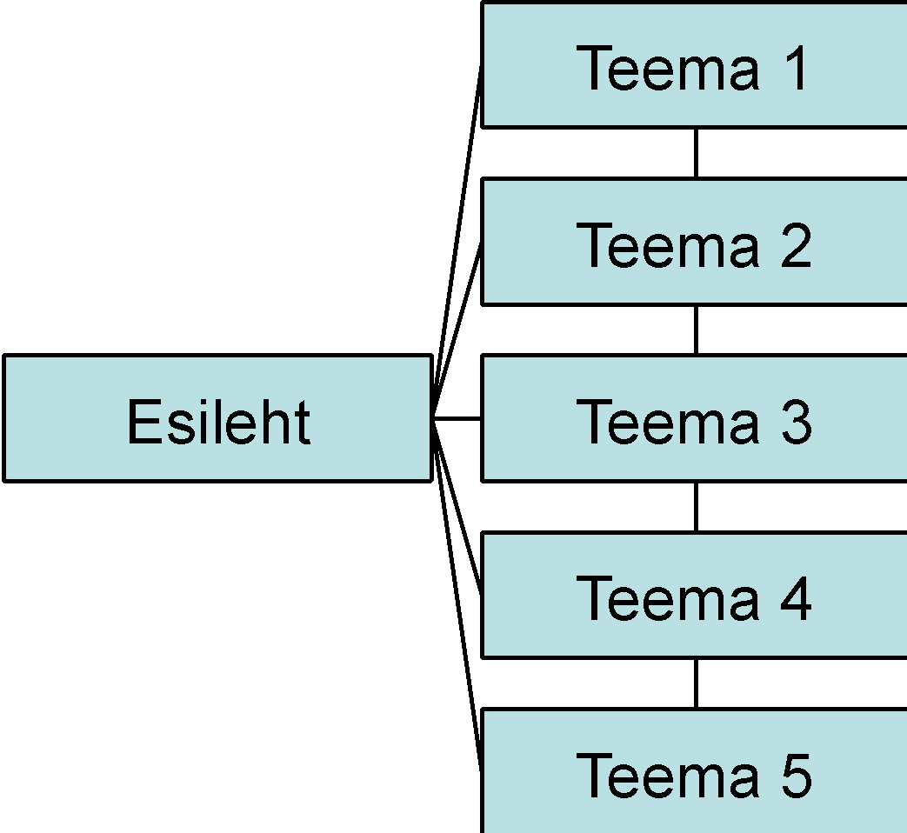

_Joonis 4-20. Lame navigatsioon_

#### Põimitud navigatsioon

on enim levinud ja see on kasutajasõbralikum kui lame navigatsioon. Põimituse mõte seisneb selles, et kasutaja saab kõikidelt lehtedelt liikuda ükskõik, millisesse saidi ossa. Ei teki olukorda, kus kasutaja "ära eksib".

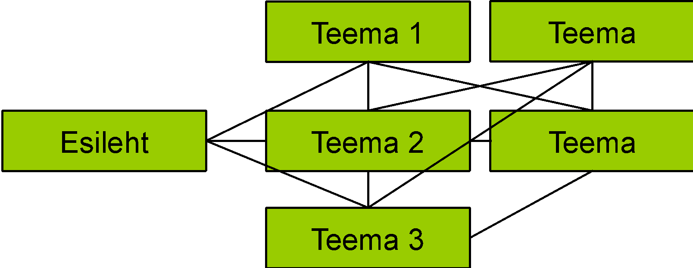

_Joonis 4-21. Põimitud navigatsioon_

Suure sisumahuga saitidel võib tekkida probleem, kus navigatsiooniloogika läheb kasutajale keeruliseks ja suure hulga tõttu hoomamatuks. Sellisel juhul on mõistlik kasutada maatriks-navigatsiooni.

#### Maatriks-navigatsioon

koosneb mitmetest põimitud navigatsioonidest, mis on piltlikult laotud üksteise peale. Iga alam-navigatsioon teenindab kindlat spetsiifilist hulka sisu. Kasutajat juhitakse õige tulemuseni vastavalt tema kasutusmustrile ning ülearune hulk navigatsiooni kaob pildilt ära – järele jääb ainult kasutajale vajalik osa. Et maatriks-navigatsioon hästi töötaks, tuleb kasutajaid ja nende vajadusi väga hästi tunda.

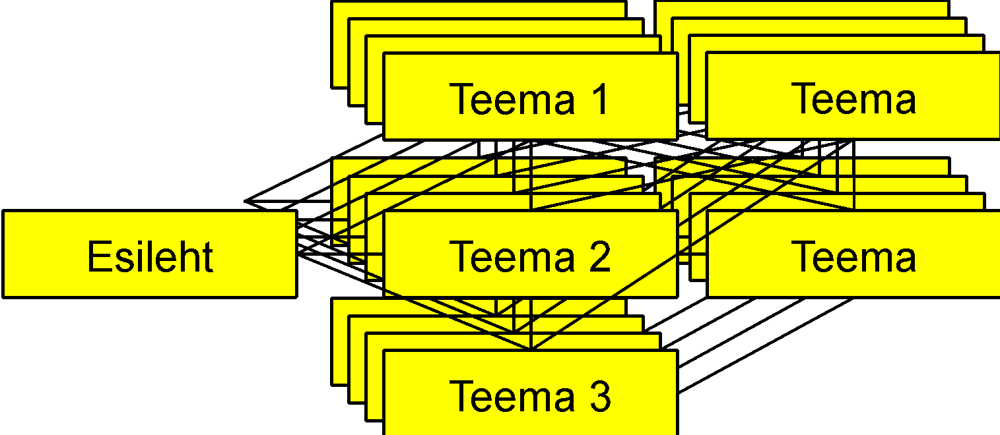

_Joonis 4-22. Maatriks-navigatsioon_

Navigatsiooni meetodeid eristatakse ka tehnoloogiliselt:

- Yahoo stiil – kogu navigatsioon koos järgnevate jaotustega on kohe näha. Plussiks on informatiivsus. Miinuseks see, et suurema infohulga korral muutub navigatsioon liiga pikaks ja seega kasutamatuks.
- Ülerullitav (rollover) menüü – alama taseme navigatsioon ilmub nähtavale kui kursor on kõrgema taseme kohal.
- Flash-menüü – navigatsioon on animeeritud Flash või Silverlight tehnoloogias.
- Kokku-lahti menüü – alama taseme navigatsioon avaneb, kui hiirega kõrgemal tasemel klikkida.
- Allakukkuv (drop-down) menüü – navigatsioonielemendid on paigutatud horisontaalselt ning alama taseme navigatsioon avaneb, kui kõrgemal tasemel klikkida. Jääb mulje, et navigatsioon "kukub allapoole lahti".
- Väljalendav (fly-out) menüü – sama nagu allakukkuv menüü, kuid navigatsioon on vertikaalne ning alam tase avaneb kõrvale.

Kasutajatel tehtud testid näitavad, et kõige vähem kasutajate vigu esineb Yahoo stiilis ja allakukkuval menüüdel.

Vaata ka erinevate navigatsioonimeetodite uuringut: [http://www.eastonmass.net/tullis/WebsiteNavigation/WebsiteNavigationPaper.htm](http://www.eastonmass.net/tullis/WebsiteNavigation/WebsiteNavigationPaper.htm)

### B.4.4.10 Veebi disainimise meetodid

::: oppekava

Kirjeldada projektitööd veebidisainis ja üldlevinud meetodeid nt kadreering (storyboard), visand (rough draft).

:::

Veebi disainimiseks kasutatakse järgmisi meetodeid:

- Süžeetahvel (storyboard) – veebilehestiku graafiline skeem, võib olla paberile joonistatud, loodud mistahes graafikaprogrammiga, genereeritud mõne veebiredaktori (HTML editor) poolt.
- Sisukaart (site map) – reeglina tekstipõhine ülesehituse kirjeldus.
- Sõrestikmudel (wireframe) – kest, mis näitab loodavaid veebilehti. Iga leht on joonistatud informatsiooniplokkidena, mis näitavad kus ja kuidas paiknevad erinevad komponendid. Selliselt esitatakse objektide visuaalne paigutus (layout), kuid mitte lõplik välimus.
- Stsenaarium (scenario) – kasutuslugude tekstiline kirjeldus.

#### Süžeetahvel

**Süžeetahvlit** **_storyboard_** kasutatakse lisaks sisukaardile, aitamaks teha otsuseid disaini, tehnoloogia aga ka eelarve osas. Hea süžeetahvel pakub kõigile projektiga seotud inimestele selget ülevaadet loodavast veebilehestikust. Süžeetahvlil ei ole näha kõiki üksikuid veebilehestiku lehti, kuid see katab peamised lehestiku funktsionaalsed osad. Reeglina pannakse iga lehe kohta kirja pealkiri ja mõned märkmed tema sisu kohta. Süžeetahvel ei sisalda mingit infot lehtede visuaalse disaini kohta, kuid võimaldab saada ettekujutuse, millised põhielemendid igal lehel olemas on. Süžeetahvli võib sarnaselt sisukaardile luua pliiatsiga paberile joonistades või mõnda graafikaprogrammi kasutades.

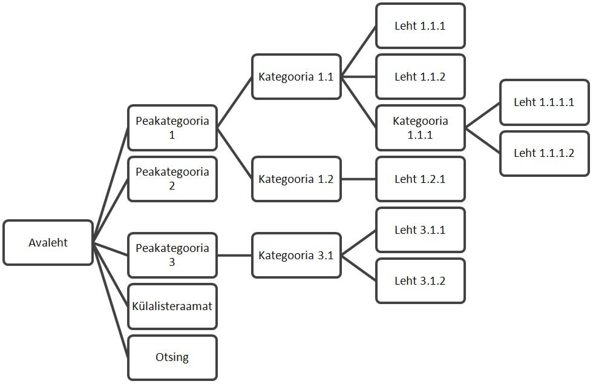

_Joonis 4-23. Tüüpiline süžeetahvel. Allikas: http://www.eneta.ee/oppimine/veebistuudium/Lehed/veebidisain.aspx_

#### Sisukaart

Sisukaart _site map_ on üks kriitilise tähtsusega ja laialt kasutatav vahend veebidisainis. Kuna sisukaart näitab veebilehestiku üldist struktuuri ja hierarhiat, siis kasutataksegi neid veebilehestiku üldise ülesehituse ja navigatsiooni kavandamisel.

Alustada tuleks lihtsast, jämedakoelisest eskiisist, lisades sinna lihtsalt esmaselt planeeritud, olulised lehed. Vältida tuleks detailse info lisamist sisukaardile. Sisukaart muutub ja täieneb projekti edenedes. Sisukaardid on enamasti tekstipõhised, kuid vahetevahel ka graafilised. Iga lehe kohta pannakse kirja pealkiri ning talle viitav link (URL). Töö käigus võivad disainerid sinna lisainfot kirja panna (näiteks lehe olulisus terviklikus veebilehestikus, viimase muutmise aeg, kui sageli seda lehte muudetakse jne). Vägagi sageli lisatakse HTML sisukaart valmis veebilehestikule. See on eriti kasulik, kui veebilehestik sisaldab paljusid lehti, lihtsustab navigatsiooni ning võimaldab ka otsingumootoritel veebilehestikku läbi uurida.

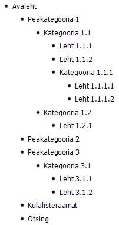

_Joonis 4-24. Tüüpiline veebilehestiku sisukaart. Allikas: http://www.eneta.ee/oppimine/veebistuudium/Lehed/veebidisain.aspx_

#### Sõrestikmude

Sõrestikmudel (wireframe) veebidisainis on veebilehele paigutatavate elementide skemaatiline esitus. Võtmesõnaks sõrestikmudeli puhul on kiirus. Neid kasutatakse uute ideedega eksperimenteerimiseks, testimiseks ja sobitamiseks, aga mitte kujunduse detailseks kuvamiseks. Kliendiga suhtlemisel lasevad sõrestikmudelid kliendil keskenduda lehe ülesehitusele (layout), laskmata end disainielementidel (pildid, kirjastiilid jt) oluliselt kõrvale kallutada. Sõrestikmudeli loomisel kasutatakse lihtsaid graafilisi kujundeid (mitte reaalseid pilte), lisatakse neile pealkiri. Sõrestikmudelil peavad nähtaval olema kõik tähtsad veebilehe elemendid.\_

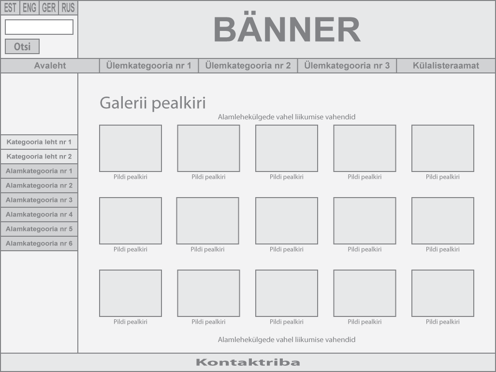

**Joonis 4-25. Tüüpiline veebilehe sõrestikmudel. Allikas: http://www.eneta.ee/oppimine/veebistuudium/Lehed/veebidisain.aspx**

#### Stsenaarium

Stsenaarium **_scenario_** on tekstiline prototüüp, mis kirjeldab loodava veebilehe ülesehitust. Siia alla kuuluvad ka kasutajalood **_user story_**, **_use case_** - tegevuste, valikute ja tulemuste tekstilised kirjeldused.

### B.4.4 Kordamisküsimused

::: kordamiskusimused

1. Kui palju sihtrühma liikmeid läheb vaja kasutajaliidese testimiseks?

- 6 X
- 10
- rohkem on parem

2. Mida tähendab kasutajapoolne kontroll ja vabadus kasutatavuse kontekstis?

- Kasutaja kontrollib süsteemi tööd.
- Kasutaja võib luua sellist sisu nagu ta soovib.
- Kasutajal on õigus teha vigu. X

3. Mida väljendab George Milleri maagiline number 7?

- Maksimaalset navigatsioonielementide hulka ühes grupis.
- Toimingute korduste arvu, mis on vajalik veebisaidi funktsioonide õppimiseks.

4. Milline navigatsiooni meetod viib kasutaja kõige kiirema tulemuseni väikesemahulise saidi korral?

- lame X
- põimitud
- maatriks

5. Milline on kõige efektiivsem veebi disainimise meetod?

- süžeetahvel
- sisukaart
- sõrestikmudel
- stsenaarium
- erinevate meetodite kombineerimine X

:::

## B.4.5 Veebilehe loomine

Selle alateema materjale läbi töötades õpid tundma veebilehe koostamise tehnilisi külgi – peamiselt HTMLi võimalusi, aga ka muid vahendeid.

### B.4.9.1 Märgendikeeled

::: oppekava

Tuua välja mõiste **märgistuskeel** **_markup language_** tähendus ja kirjeldada HTML peamisi omadusi.

:::

Selles peatükis tutvud veebilehestike koostamisel kasutatavate märgendi-, kujundus- ning skriptkeelltega.

#### HTML

::: vananenud

**_HTML_** **_HyperText Markup Language_** ehk hüperteksti märgendite keelt kasutatakse veebilehtede loomiseks. HTMLi abiga luuakse dokumendi loogiline struktuur ja määratakse iga elemendi väljanägemine (elementide vormindamiseks soovitatakse kasutada CSSi mitte HTMLi). HTML ei ole programmeerimise keel! Veebilehe fail sisaldab ASCII kodeeringus teksti ja omab nimelaiendit **.htm** või **.html**. Teksti märgistamine failis toimub märgendite (tag) abil. Märgendid paigutatakse kolmnurksetesse sulgudesse.

:::

Märgendite liigid:

- üksikud märgendid `<tag />` ei nõua sulgemismärgendit, näiteks `<br />`
- paarismärgendid `<tag></tag>` nõuavad alati sulgemismärgendit, näiteks `<b></b>` vahel olev tekst on paksus kirjas.

Märgend võib omada atribuute. Atribuudid täpsustavad märgendi toimet. Atribuut paigutatakse alati avamärgendisse, sest brauser loeb infot alati vasakult paremale ja ülevalt alla. Mõnel märgendil on atribuutide kasutamine kohustuslik. Näiteks, pildi lisamise märgendil `` on kohustuslikuks atribuudiks `src` , mille väärtuseks on faili nimi koos teekonnaga: ``

::: vananenud

Märgendeid võib kirjutada nii suurte `<TAG>` kui ka väikeste `<tag>` tähtedega, brauseri jaoks see tähtsust ei oma. Samuti ei oma tähtsust ka reavahetused. Loetavuse huvides on soovitav märgendites kasutada alati kas ainult suuri või ainult väikseid tähti, alustada uut elementi uuest reast ning lisada kommentaare.

:::

Tühikud:

- tühik on kohustuslik märgendi nime ja atribuudi vahel
- tühikut ei tohi olla atribuudi nime ja väärtuse vahel
- HTML-dokumendi tekstis mitu tühikut on sama, mis üks; selleks, et panna järjest mitu tühikut, tuleb kasutada erisümboleid.

**HTML-dokumendi struktuur**

::: vananenud

Iga veebileht on märgendite `<html></html>` vahel. Dokument koosneb kahest osast:

- päis `head`
- keha `body` või _frameset_)

**Päis** paigutatakse paarismärgendite `<head></head>` vahele. Siin paikneb dokumenti puudutav abiinfo. Seda infot ei kuvata. Erinevate märgendite abil võib määrata lehe kodeeringu `<meta name="Content-Type" content="text/html; charset=windows-1251">` või võtmesõnad, mida kasutavad otsingusüsteemid lehe indekseerimiseks `<meta name="keywords" content=võtmesõnad">`

Siia võib paigutada ka CSS-stiilide kirjeldused `<style></style>` või skriptide stsenaariumid `<script></script>`.

**Keha** plokk paigutatakse märgendite `<body><body>` vahele. Kogu brauseris kuvatav info (tekst, viidad, kujundid, tabelid, vormid jne.) asub lehe kehas.

HTMLi märgendite spetsifikatsioon (versioon 4.01): [http://www.w3.org/TR/html4/index/elements.html](http://www.w3.org/TR/html4/index/elements.html)

HTMLi atribuutide spetsifikatsioon: [http://www.w3.org/TR/html4/index/attributes.html](http://www.w3.org/TR/html4/index/attributes.html)

:::

#### Skriptikeeled

:::

Interaktiivsete veebisaitide arendamisel kasutatakse sageli skriptikeeli (näiteks javascript). Interaktiivsete veebisaitide arendamisel kasutatakse sageli skriptikeeli (javascript, PHP jne.). Nende vastavad koodilõigud loetakse serverist koos veebilehega brauserisse ning täidetakse seal. Näiteks javascriptis kirjutatud lõik html-tekstis näeb välja nii:

```html
<html>
  <head>
    <title>Tere!</title>
  </head>
  <body>
    <script>
      document.writeln("Tere kõigile!");
    </script>
  </body>
</html>
```

:::

#### XML

::: vananenud

**XML** on W3C soovitatud üldotstarbeline märgendikeel, mille eesmargiks on struktureeritud info jagamine erinevate infosüsteemide vahel, eelkõige veebipõhistes rakendustes. XML on vabalt laiendatav keel, mis tähendab, et märgendeid saab vabalt juurde luua vastavalt vajadusele. XMLi baasil on loodud palju erinevaks otstarbeks mõeldud standardeid, näiteks RSS uudisvoogude edastamiseks ja SOAP veebiteenuste kasutamiseks.

Erinevalt HTMList iseloomustab XMLi väga range koodi korrektsus, mis tagab viimase stabiilse töötamise kõikides keskkondades. Selleks, et ka HTML oleks kõikides brauserites samamoodi nähtav, on kasutusele võetud XMLi karmid esitluse reeglid. Tulemuseks on **_XHTML_** **_Extensible HyperText Markup Language_**, mis on veebiarenduses uus standard. XHTML on XML-i rakendus. Lihtsamalt öeldes on XHTML-i puhul tegemist HTML keelega, mis on realiseeritud XML-is.

Erinevalt HTML-ist on korrektselt vormistatud XHTML dokumendi puhul võimalik kasutada XML-i tööriistu.

:::

#### B.4.5.2 HTMLi peamised komponendid

::: oppekava

Kasutada põhilisi HTML käske ja näidata kujunduskäskude täitmist: tugev formateering, pehme formateering, erisümbolid, eraldajad, joondumine, päised, piltide sildid, taustad, värvid, lingid, loendid, tabelid, vormid, raamid.

:::

Dokumendis võib olla kuni kuue taseme **pealkirju** (märgendid `<h1></h1>` … `<h6></h6>`.

Kõrgema taseme pealkiri on märgendite `<h1></h1>` vahel, seda kuvatakse kõige suurema kirjaga. Madalaima taseme pealkiri on `<h6></h6>` märgendites ja see kuvatakse kõige väiksema kirjaga. Atribuudi **align** abil võib pealkirju joondada vasakule, paremale ja keskele.

**Lõigu** loomiseks kasutatakse märgendeid `<p></p>`. Iga lõik eraldatakse brauseris eelmisest tühja reaga. Lõiku saab joondada vasakule, paremale, keskele ja rööpselt. Lõigu vormindamisel tuleb meeles pidada järgmist:

- reavahetuse sümbol (Enter-klahvi vajutus) ei oma koodis mingit tähtsust, kui rida on vaja vahetada, peab kasutama märgendit `<br />` ;
- kõiki sümboleid ei ole võimalik korrektselt kuvada, see on seotud erinevate kodeerimissüsteemidega (näiteks, **ä** tähe kuvamiseks tuleb kasutada erisümbolit);
- teksti ridade kuvamisel arvestatakse tühja ruumiga, millele tekst paigutatakse (näiteks jätkab brauser teksti järgmises reas, kui see brauseri aknasse või tabelisse ei mahu).

**Tekstis** võib kasutada ka **jäika vormindamist**. Seda tehakse juhul, kui lõigulõpud, tühikud ja tabulatsioon on kindlalt paigas. Märgenditeks on `<pre></pre>`. Kogu tekst väljastatakse fikseeritud laiusega kirjas. Sellise vormingu põhipuuduseks on see, et teksti ei tõsteta järgmisele reale isegi siis, kui ta aknasse ei mahu. Selle asemel tekib horisontaalne kerimisriba, mis raskendab lehe jälgimist.

**Tsitaatide** vorming toimub märgendiga `<blockquote></blockquote>`. See märgend tekitab taande vasakust lehe servast ning eraldab tsitaadi muust tekstist tühja reaga alt ja ülevalt.

**Joonte** loomiseks teksti osade vahele kasutatakse märgendit `<hr />`. Erinevate atribuutide abiga saab muuta joone paksust ja laiust, värvi ja joondust.

**Loetelusid** võib olla mitut liiki:

- tärnitud (järjestamata) – märgendid `<ul></ul>` ;
- nummerdatud (järjestatud) – märgendid `<ol></ol>` ;
  - loetelu elementide loomiseks kasutatakse märgendeid `<li></li>` ;
- definitsioonide loetelu – kasutatakse märgendeid `<dl></dl>` , `<dt></dt>` ja `<dd></dd>`.

**Tabelandmete** väljastamiseks võib veebilehel kasutada tabeleid. HTMLs on tabelitel veel üks funktsioon: tabeli abil võib paigutada elemente ekraanil erinevatesse kohtadesse, kasutades selleks tabeli lahtreid. Tänapäeval sellist meetodit ei soovitata enam kasutada, kuna parem on seda teha CSS stiililehtede abil.

Tabeli loomiseks on märgend `<table></table>`. Tabel ise koosneb ridadest ja lahtritest, read luuakse märgenditega `<tr></tr>` , lahtrid märgendiga `<td></td>`. Esimest tabeli rida kasutatakse tavaliselt päisena, seal asuvad veergude pealkirjad. Esimese rea lahtrite märkimiseks võib kasutada märgendeid `<th></th>`.

#### Teksti vormindamine

Peale dokumendi struktuuri loomist võib asuda teksti vormindamisele. Soovitav on kõik kirja vormingud korraldada stiilide abil (CSS). HTML lubab samuti teksti kujundada, kuigi võimalusi on siin vähem. HTML kasutab kahte vormingu viisi: füüsilist (vormindatud teksti väljanägemine on täpselt määratud) ja loogilist (märgendite abil määratakse tekst, mis peab muust tekstist erinema, teksti kuvamine sõltub brauseri määrangutest).

Füüsilise vormingu märgendid:

- `<b></b>` (poolpaks kiri)
- `<i></i>` (kaldkiri)
- `<tt></tt>` (fikseeritud laiusega kiri)
- `<u></u>` (allatõmmatud)
- `<strike></strike>` (mahatõmmatud).

Loogilise vormingu märgendid:

- `<em></em>` (tavaliselt kuvatakse kaldkirjana)
- `<strong></strong>` (tavaliselt kuvatakse poolpaksuna)
- `<cite></cite>` (tsitaatide rõhutamine, kaldkiri)
- `<ins></ins>` (lehe uuendamisel näidatakse teksti, mida enne ei olnud, allatõmmatud)
- `<del></del>` (mahatõmbamine)
- `<acronym></acronym>` (lühendite eristamine)

#### Erisümbolid ja kommentaarid

| HTMLi kood                            | Sümbol |
| ------------------------------------- | ------ |
| `` | jäik tühik, mis on alati kuvatud |
| `&quot;`                              | "      |
| `&lt;`                                | <      |
| `&gt;`                                | >      |
| `&amp;`                               | &      |
| `&laquo;`                             | «      |
| `&raquo;`                             | »      |
| `&Auml;`                              | Ä      |
| `&auml;`                              | ä      |
| `&Ouml;`                              | Ö      |
| `&ouml;`                              | ö      |
| `&Uuml;`                              | Ü      |
| `&uuml;`                              | ü      |
| `&Otilde;`                            | Õ      |
| `&otilde`                             | õ      |

Koodi loetavuse ja redigeerimise lihtsustamiseks on soovitav lisada kommentaare. Samuti, kui olete teinud uuendusi, ei tasu vana varianti kohe kustutada. Jätke see kommentaarina sisse, nii saate alati tulla vana versiooni juurde tagasi.

`<!-- kommentaar -->`

**Piltide lisamine**

Veebilehed on tavalised tekstifailid, millesse ei saa integreerida teisi objekte. Pildi lisamiseks tuleb viitamisel näidata pildi faili nimi ja asukoht ning brauser kuvab pildi veebilehe sees.

Pildile viitamiseks on märgend ``. Seda märgendit kasutatakse alati atribuutidega. Pildi faili nime ja asukoha näitamiseks on atribuut `src`: ``.

Pilti saab lehel joondada kahel viisil: sarnaselt teksti osale lõigu sees, näidates selle vertikaalset joondamist rea suhtes, või nagu eraldi lõiku, näidates horisontaaljoondamist. Kasutatakse atribuuti `align`. Rea sees saab joondada rea ülemise servaga ( `top` ), alumise servaga ( `bottom` ) või keskkohaga ( `middle` ). Kui joondada pilti eraldi lõiguna, on atribuudi väärtused `left` (vasak serv) või `right` (parem serv). Tsentreerida pilti ei saa.

**Hüperlingid (viidad)**

"Ülemaailmse ämblikuvõrgu" töö ei oleks viitadeta võimalik. Hüperlingid asuvad veebilehtedel ja ühendavad omavahel nii erinevaid lehti kui ka saite. Kusjuures saidid võivad asuda serverites, mis paiknevad üksteisest sadade tuhandete kilomeetrite kaugusel. Lingi loomiseks kasutatakse märgendit `<a></a>`. Nagu pildi märgendil, on viida märgendil kohustuslik atribuut, mis näitab faili nime ja asukohta `<a href="teekond">`).

Viitasid on kolme liiki:

- välised – viitavad välisressurssidele, mis antud saidile ei kuulu
  `<a href="http://www.eucip.com">`
- sisemised – viidad saidi piires `<a href="folder/file.html">`.
- viidad ühe lehe piires – võimaldavad liikuda ühest dokumendi osast teise, lahkumata lehelt; viita näidatakse `<a href="#ankru-nimi">` , kus `ankru-nimi` on märgistatud koht veebilehel, mida märgistatakse nii: `<a name="ankru-nimi">`.

Hüperlingi kuvamiseks võib kasutada nii teksti kui pilti. Näiteks viit `<a href="pealeht.htm"></a>` kuvab brauseri aknas pildi failist `logo.jpg`, klikkides viidal jõuate failile `pealeht.htm`.

**Vormid**

::: vananenud

Vormi abil luuakse andmete edastamise võimalusi. Vormidesse sisestatud andmete töötlust teostatakse skriptide või spetsiaalsete rakenduste abil, mis tavaliselt asuvad serveris. Sisestatuid andmeid võib saata e-postiga, näiteks lehe autorile.

:::

Vorm luuakse märgendite `<form></form>` abil. Ühel lehel võib olla ka mitu vormi. Selleks, et vormi andmeid saaks töödelda, näidatakse atribuudi `action` väärtusega, milline rakendus käivitada, ja atribuudi `method` väärtusega, millise meetodiga andmeid töödelda. Atribuut `method` võib omada väärtust `GET` või `POST`.

::: vananenud

Andmete saatmiseks e-postiga kasutatakse meetodit `POST` ja kogu märgendi kirjapilt võib olla, näiteks, selline:

```html
<form method="post" action="mailto:address@server.com"></form>
```

:::

Juhtelementide loomiseks kasutatakse märgendeid `<input />` , `<textarea></textarea>` , `<select></select>`.

Märgendi `<input />` abil luuakse vormi juhtelemente, nende tüübi määramiseks on atribuut `type`.

Atribuudi `type` väärtused

- Tekstiväljad
  - `text` – tekstikast;
  - `hidden` -varjatud tekst;
  - `password` – parooli väli (sisestatud andmed näidatakse tärnidega).
- Valikud
  - `checkbox` – valikkast;
  - `radio` – raadionupp.
- Nupud
  - `submit` – sisestamise kinnitus;
  - `reset` – katkestamine, väljade puhastamine;
  - `file` – failivaliku akna kuvamine;
  - `image` – graafiline nupp;
  - `button` – lihtne nupp.

Märgend `<textarea></textarea>` lubab luua tekstipiirkonna mitmerealise teksti sisestamiseks. Kui kogu tekst aknasse ei mahu, tekib kerimisriba.

Näiteks:

```html
<textarea name="textarea" cols="25" rows="4"></textarea>
```

Märgend `<select></select>` - selle märgendi abil luuakse menüütüüpi juhtelement. Iga menüü element luuakse märgendiga `<option></option>`. Menüüst saab valida ühe või mitu väärtust. Menüü liigi määrab atribuut `size`. Kui selle väärtus on 1, kuvatakse hüpikmenüü. Kui atribuudi väärtus on ühest suurem, kuid elementide arvust väiksem, tekib kerimisriba.

Näide:

```
<select name="list" size=3>
  <option value="element 1" selected=selected>rida 1</option>
  <option value=" element 2">rida 2</option>
  <option value=" element 3">rida 3</option>
</select>
```

### B.4.5.3 Teksti vormindamine ja kirjutamise printsiibid

::: oppekava

Tuua välja tavateksti kujunduse põhimõtted: kirja suurus, vaba ruumi osakaal

:::

Info edastamisel on kõige tähtsam teate tekst. Sellepärast omab teksti väljanägemine ja selle loetavus samuti erilist tähtsust. Teksti loetavus sõltub paljudest faktoritest, nagu

- kirjatüüp,
- kirja suurus,
- rõhutamine.

#### Font (kirjatüüp)

Tähtis on teada, et kirjatüüpe on kahte liiki – proportsionaalsed (proportional font sizes) ja fikseeritud laiusega (fixed font sizes).

**Fikseeritud laiusega** kirjatüübis eraldatakse igale märgile ühesugune ruum, sõltumata selle enda laiusest. Nii võtavad tähed _I_ ja _M_ ühepalju ruumi. Selliseid kirjatüüpe kasutati kirjutusmasinatel.

**Proportsionaalne** font arvestab märgi suurust. Sellises fondis on täht I umbes kolm korda kitsam kui M. Enamik tekstidest, ka antud tekst, on kirjutatud just sellist tüüpi fondiga.

#### Fontide liigid

**_serif_** - Selle liigi fontide märgid omavad otstes sälke **šeriife**. Lühikesed horisontaalsed kriipsud ühendavad visuaalselt tähti, kergendades lugemist. Sellised fondid on paberilt paremini loetavad ja sellepärast on kasutusel rohkem trükistes. Liigi esindajad on näiteks fondid Times New Roman ja Garamond.

**_sans serif_** - Selle liigi fondid sälke ei kasuta. Tekste on lihtsam lugeda kuvari ekraanilt või muudelt väiksema resolutsiooniga elektronkandjatelt, sellepärast kasutatakse neid rohkem veebilehekülgedel ja esitlustes.Antud liiki kuuluvad fondid Arial, Tahoma, Verdana, Helvetica.

![](data:image/png;base64,iVBORw0KGgoAAAANSUhEUgAAAZAAAACNCAYAAACZgCw9AAAM+klEQVR42u2d61Esuw5GJwNCIAgCIASyIA1C4DdREAIJkAMhEALnfFNX5wojd7tnum2PvVZV12bPq1+SP1m21acfAACACzhxCQAAAAEBAAAEBAAAEBAAAEBAAAAAEBAAAEBAAAAAAQEAAAQEAAAQEAAAAAQEAAAQEAAAQEAAAAABAQAABAQAAAABAQAABAQAABAQAABAQAAAAAEBAABAQAAAAAEBAAAEBAAAEBAAAEBA4JZ4+Dz92QAAEBBYFY6t7wEAICCTi8eenwOgBw4ICOKBiAA9cIQEAQEEBIAeOAICjcQDRwICKGwfAXF8fHz8vLy8/Nm+vr66PF4d1/Pz88/j4+PP6XT6tem1p6en4mNfcoa3t7c/1wQnAgQE20dAHPf3938aYm1qpHtDjXh0rOn2+fl5tTNEAoUTQS98f3//Cf7e39/Pr+8lBvotC6QQEQQk7H3kGuG7u7tNxng0ErQS8fANPQICa/b/+vp6U8dsPfAl+9f7Jb6bs2MFYPoNtQGRT2H/CEhRo6zooxenKRWPh4cHBATK7v+/tqL7KiG5BeSPatR9mlb/Rj1zfW6tJ+7tWIIjMbVrshSUYf8IyNlgosb30sb4SHKpKwmguu1qALTp762il3OGnIDgPOP0PnpO1+aCvZxPqvHfmkUwW9ZnlMrWPiROCAgCskpqcDLMyAh7iM6ixjzNy14chSIgU5Le357StSkKjEqyAlHjv+S/OVuOMhMICALyi3TwXEYTpYp6iM6ixnxPh48cItonjjMGkZ3vFZAckSnwYxFLgqDP+ixCSQYhsmmJFOlbBKSo+26bopxcw9l6Su/SeMSeIuKdw++z55W4lJ64PB3kNwVUt5ApKAmcJAD63qUD6VH7gIAgIFkHUoSzFH20js5qCMhSg3z0PvcQvNL3Zica+0uDqJ5Ibf8oWyoREGwKAQkdKE1T+S5zKjCjC0jLfV7q8Nd+biaW1hLpnnfXoFQOnCIB6SUgmaG33f0ZRQPlaYoqcrKaU3rTVeDRYsdo9fyeA/4tBUSRcG61vZxGr+t8SxZMIiK/gycLjnLTVXuqwBCN1bRopFsHTzP1trs/k7QxjqKuyHBrRmdRw1my7ZlqayEgOv609xcJSJq7XxJ3BOR3YOKFIgpMeprSuzQWMeJ+6W13LiCRYeQan2hKYGmJEARke2Sci4iXxCMV+NygKSLyO3gykcgtwOtlSu/sAjJjna6uz2Bp8DxKo7SKzmYTkCXxUKOnY9EmB1nqoUj0EZB1e7ZAKDeg3ksFhtkERPdD98lS0rLbNC2te5dLVSMgB9+crYIQdfFbRGcjD6LnomA1Yum19oOcOZGNZhIhIP+/n2kqNprS26oCwyVB0xELfmsLiOw8vQ++t23lW2w8dClQvHVb7/boo8HztZRU5Fwtis+NLCCpSC/VMEqdI7o/US9kdgHxDWIU0R7dIG8JJvwW3d9o8sjej1+oKSC6/n5igwVAslmrBpz6IgLSgLShKomyosH0FguuRhWQqPFa6hWmzpGuUs71EmcXEGuIc7YbpRB7GEwfPYVlNbisPfJ2uxQsISAdGGJpTyJqSGsvuBpVQKL7stZwRY4lEbFxkjQanV08fBCUG9uIFs/2UB9rdAHx6du0TVkqL4SANIrALnGOyLlqL7iaSUBKK6iWQu/juajnHPXkWldgGF1AfM8vTRkulVhBQCpyyeB5SZqk5oKrkcdAomu719qO2cXD2+6aGESTGVrXxxpdQNbapMh+JTq5e8ksrAPYo0R71IOpmSOebRZW2tvTPUwH1qmFVX5tS9Z25B5a1rI+1kwCEk0eiWxYvoCAVKS0DMjSFglIzQVXIwtI6SJCP51RTmQ9QKrxrtt+abATLZ5tWR9rdAGJZiCmPe9o4kiU/WAleiVD2HOrteBq9GKKW0QkTbGocaxVIeCWSMuWXOMvrepjjS4guUdqy/d820ItrEasPfP82q1WjniWarxymqjHWLLpeBES17D8T5C3plp7qo81wzTepcoK6Vgg1XgrsvTcgz23GguuZivnLiFQo3WJmPRShmOknner+lgzlDKRra/Z+drqcwTkAKLBcysHcOkWpVly9ZcQkH1Q+kSisEVQeniOfUvs3vk6Ylu2KCpuIcyz1MKKSpnkhGT0XnY3AnJEHauowGKNHDEPlPorKNGAb88PRqp5fa4V0l7qY81WTFH3rkRIRu5ld9HKRAawV08hN6sLAanPUuTWS0ny2pQuHCwVoZY9u1nLuZcIyag9kVNPTnSEauem9CIglzmqzWvXdb10sDY61hnTWH7c71p7j65p7cH02Z8HIiHJVZ0etZd96smJjmjgc9HZkd3KUQUkGlO6pOcQLUacQUByj1/dw957qI81wzTe0nvRuhrG0AKSc6SjIqfwWd0H5YhbPaO5hoDkynXv8TsjOldqEylqZPac3tkiXbtm+yMJyBZBjo5pxCDp1NqR/iuP7BrbvS90Ljrbcz/+3NLGvIYztSrnvvQ8kNxvpNFZ6xpOR9v8mk2eF2buYB+RMNe4tmbfUaNZw/ZrCsiW5wulPomA7OxIOYM7Ik0WdSn36umkx5xrzI90pFpps2g/urYlNZh0v3uZctpSPHzg5CeLXGsfuYdNHXl9/TEvNeRH2n5NAdmyxiZN1Y44UeTU0pFyRQ+PMLajZv8sPQegpiPVEhClmnKrca3yqMRETm2bXpttcHHpXvuGxUe0e9hGzYWF6fFGPX3fOz3K9msXUywNPH2bU2P92VQCklt5rgbqCEPLRWfX5ohnE5BcGuqSLX2q2wzikV67NCVyrX3krvURM7JKHlmclvY4gmi/R6SLtlxPn/XQv6OO8Z1aOVK08twPbB9hbNEg4zU54twxrjXmR5xb7ZlfJSUdljY54MhrP6J7rJ5ZKrxpRddLbaNkdbSi4L0asvQ4c2X+dX6+Md/b9nPBzBHBSelzcHS+NmNx6xghAlLYyEaNz97d+RLRuiZHPLOA+LTF0irzqBrvyDOuontcWiRUjc5W29D131oZee0BYKXnt1RKJTo3fVbf22NM5pzqLjjvtFLutQJyvkfBfu1a+HZt9CCpqYAc9b0e0hQjnNslKPKSs6Y1yRR5zyAaM9nGjLbv01ayZ9m17FsBlAlI+vyb0UFAODfANjg/QEBwIrhl+7glu8D2oYqA4Eg4EAIypm1g+4CAcG7QgX3col1g+3DCkTg3ON4+Rn1GNraPgOBInBtUtJHRnpGN7SMgOBLnBoDtQ/8CAgAACAgAACAgAAAACAgAACAgAACAgAAAAAICAAAICAAAAAICAAAICAAAICAAAICAAAAAICAAAICAAAAAAgIAAAgIAAAgIAAAAAgIAAAgIAAAgIAAAAACAgAACAgAAAACAgAACAgAACAgbfn+/v75+Pg4b/obAPAdQEBWjf/5+fnndDr92vTaUDf533OSg4uvr6+fh4eH82uPj494AHTlO7JT/Y6BvSIg3fLy8nI2zPf39/9ee319Pb/29vY2zHn66FDnfH9/f35NzgnQk+9Yj8bvB3tFQLpEEU0U1SiKSiMpOYqMWdvn52fYQOtfvR85kH1fTrbmCPr93L7W3rdj0XvmiPaa9qvzUkRHygFq+05k+6m9egHBXhGQm4ii1ODnjFOvy4Dv7u7ODmPdaR956f96XZGSPpN25fW3fV+f0d85EdHvWnc92pcdszlwui87Fu/glsKy79rmIz2AvX3HhCb1HR9gpfbqU1jYKwLSPT6PKwOW0frGXY23HMA7ib7joy999+np6U9X3r/vnUbfzzmDftcLgn5Lm0VkOhbf69Df/rUoD+2dT+dHLhlq+I5sXuLgfUevyV69bXp7TcdAsFcEpHtk4BIKGbJ6CGnUb4Yt47ecbCogXhBSJ/BR2FoKy/cwdDxeLPRd+x2/6TV9LzoWBARa+Y6CKvMVv3l7XPMd7BUB6dbwc3lVSzVZhG+O4bvaWwRE+1Djb114bdbgR0io5Hw+ujNn0rHY+Iffcg6JgEAr3zE/iezVgigEBAG5SSQMMlRLD0W9AIuifHoql8LKOYGJh3c+//uReKQpNPt96/6njuu/g4BAL76T+onZvx83QUAQkJvF0j9+fMLGPCwvK/FQz0Gvy7gt77tFQPR7+h1bcKW/c05hg422PzmQiYY2RXf+feupICDQm++Y0Jjt632bbFLae8deEZCuu+K5xVAWIalhtrytvSen0d+lUZQcyaev5FC5cRD9pk9f2RRGQ99beh8BgV58x3xhyfYREARkCGegHAMAvgMICAAAICAAAICAAAAAAgIAAICAAAAAAgIAAAgIAAAgIAAAgIAAAAAgIAAAgIAAAAACAgAACAgAACAgAAAACAgAACAgAACAgAAAAAICAAAICAAAAAICAAAICAAAICAAAICAAAAAAgIAAICAAAAAAgIAAAgIAAAgIAAAgIAAAAAU8A/q0nJnOz731AAAAABJRU5ErkJggg==)

**Joonis 4-26. Seriifidega ja ilma seriifideta fondid. Allikas: http://alexpoole.info/which-are-more-legible-serif-or-sans-serif-typefaces**

**Script** Selleliigi fondid imiteerivad käsikirja. Tihti kasutatakse neid selleks, et rõhutada dokumendi mitteametlikust: kutsed, õnnitlused, reklaamid. Selliste kirjatüüpide liiga tihe kasutamine ei ole soovitatav, sest need fondid ei ole ladusalt loetavad.

![](data:image/png;base64,iVBORw0KGgoAAAANSUhEUgAAALQAAAC/CAYAAABXCvbxAAAH3ElEQVR42u2d0ZKjMAwE8/8/vfeeS4glzUg2dFfdyyVLjGiMLUB+/QHciBchAIQGQGgAhAZAaEDoc3fg9fr5+fs/QOhtZb6S9P0zpEboY4X+9hlCI/SRQw56Y4S+144hNEIjNCA0QgNCIzQMC/0tnxvJA0d+J/L3375P/hmhQ1Ku5IAjYn06Wa7+NpO2g4cLvXLzInoCXP3/p+9ERUdohLYIvTKkUAxPEBpSQq/IsXo7WiEhQoN0DI3QcLzQkYndr38IDSNCR8SuiITQ0Cr0yrgaoeE4oa+kRmjYPssREapydw6hYTuhV6VWDFcQGlJCR1NwZDlge6GjY+WKzCsirt4qR2qE/jrkyIgSGX6sbj+S60ZqhAZAaACEBkBoAIQGhAZAaACEBkBoAIQGhAZAaACEBkBoAISG/0UQ1l5BaDhC6BOeMUdoSAnNkAMeMyRBaEBohAaERmhA6O8z3OgOVt7KXi1XkKnp4Zy5u+NWjVkmvkdnORRlAhTlBlaWpVCXQHCJ3FGaeDVmjxbame7JiPjrO679UVyiq/urLt7TFZdRoSuXtkwgqrL++p5if5TjTUXcFDFD6IGJh+LE6Nof5QkRLYnm6EwQ2nAQnyp05fsIbd6RrvVXdqhKqir8XplQI3QhuNVtTI3FXbN3VXYCoQfy0B0TE/XjjVVB1HJOZFoeLfROWY6pMay6V0foTYX+tsNTFfkVwZ8cayP0BlmOE4TuOimUcSNtd6jQu6XtJoWObKPrqvaotF01qJ0z9q43M5RxU9z6RuhkCqmae1Ys6Klqj0roqQepELpwgCp/7xy+uPanK27R2CE0wI1AaEBoAIQGQGgAhAaEBkBoAIQGQGgAhAaEBkBoAIQGQGgAhAaEBkBoAIQGQGgAhIaHCx198zr7VrDiTejqtpTtWt3We7tX46l4S71zTZmrfXS0bakux6cGXTU28tp89LPV9kUDqW7XyvdXyy2sbkvVnozMlX1Utu3lOsDV4KsOkvr3Iu1SCeH4zY62R6VX/N5LEezIZ5kes0PCqXYpD7ZKanUHoOrgthO6Uq/Z3UNMtcshqGI8vOPVYCnuCO1pV3dvidAIbRf6atbuuKxHTjRFrUKV0NW1ZBC6UeiuCa1yX3fvoRlDbyq0q23VCTlCI/T2QqszJeqSw0cKnWn8iWk79bYUMnbnlp1ObCX01KWvc1uOk6Pa/uit5+7vynLaE0J39rwTsqpu977/nnOy974siGpiq5Y+fWOluihNdVmITLqn8j1Vuz5JqEzblR/eMa1kq3zgqRSvP9ia3dc02S5ehAChERoQGqEBoRGaA4TQCH0Xkd2LgiI0AEIDIDQAQgMgNCA0AEIDIDQAQgNCAyA0AEIDDxwh9I1ERmaEvoXEyIzQtxMaEPoxwwzER+hbjX8ZmmwmdNfbFRPb7pCtUmejcowQekHi5Vq+xYImqu+vrODUIUGlIE7lOCH033rVJJfQqhPg14FWLjvXLXSl8tWjhI7I2t3bZk68q/9TlNxyDamqnQpCBy9znXJGeyhn9kG5KGb2aqW8Qp4k/cvVe3TKGf0b5++qCylWe+cnyTwmdMeYVCFz5eBn26sY0lXH1o8Q2tU7Z3q9Sk+XXeIhKphTaEWJ4zvKPCJ0dvkwRS+pqlkc+f9s5iY6mVWlUk+WuV3oSg+hElo55lcUDI/2tM4i8nfIfrQIfZXbXc2UVC/7jqFSNR0WHTq4cvuueB0jdPVsd4xJO25ZK28YZU4KR27/TjLbhc5ekiNydt2uVt7Sz2yjawJ9Oi/HQc3eco3O0FcXvlGOnStCZ+YPyvx7ZT7zGKEzs2nFw0wdt3UV41j3Kl/O43R7oR1pIdclUrm0WHXC5+plO47T7YVWXBI7xm/KrEw1v+x+SMl5jB4j9K2DIlyQEhB6K6FZ4wShbys2IDQAQgMgNABCA0IDIDQAQgMgNCA0AEIDIDQAQgMgNCA0AEIDnCl09A3ryWInrmKQykr/06+rKV9e6KjzLRU68xax4h3Drm2o3lZ3xccln7psmDLWNqE7DtjKb6naWDmwuwmtjK+inEQ1dlahuw7a7kG+WmvFGRv1iTHVvmyHY+mhu3qhzu1ke79uobvjom6j80ozOuToPHAr28qO604UerJD6prctk8KO3vobE/QLUhnXKbaOpHh2CrLMSl0NW03NSFUyeaIffbzLfLQioYrSm91CK289HbFRV0Ic+X3JmROC21piODgXwWvq+eQp6FEcemsF11dc6ZF6F9nnvPAZe+sZS6Hbgkn49JZ/WmqhJpM6GqVTPXByJx8uwntikubXKcJrTwL1QusZ8TdtYd2LDzfkhMeqAsor+CvDq5L6G+S7NZDdxctdz0Eta3Qjh66W+irMfadhZ54Iu4ooZVj6Amhq2uAnyT01OpY3WWIx7Mczps0md/d5RLb9QCRO0uxrdC2e+/mu2vdqSXXmuidUjvmR9sKPTULdlwqHb20azk5x9XIvfTbtlkOd08WFVXVVrXQaglUcel+/sSVMbmN0NXnbTuEnpCg89UxVTzGhXbkPx3iKR/sVy90ORkXldTK8f+Y0J1nbkW8yXfcuh7mV0izg8xjj49OPfPseJG1K9/a9WaKc511Re5/co3HbYYczole18TllJIAHb3otkK7ZqvO4iTZbTvy6jvFpVu67Z+2A9gdhAaEBkBoAIQGQGh4MP8APIzs0DAx25UAAAAASUVORK5CYII=)

Joonis 4-27. Erinevate fondiperekondade näited. Allikas: http://www.htmlcodetutorial.com/character\_famsupp\_194.html

#### Rõhutamine

Selleks, et rõhutada osa tekstist, kasutatakse erinevaid vormindamisvõtteid. Tüüpiline on teksti tegemine poolpaksuks või kaldkirja kasutamine. Harvemini esineb ka allatõmbamine ja suurte tähtede kasutamine.

#### Kirja suurus

Kirjasuurust mõõdetakse punktides (pt). Üks punkt on võrdne 1/72 tolliga.

Tähtis on meeles pidada, et kirjasuurus mängib suurt rolli. Näiteks kui tekst peab olema trükitud, on selle optimaalne suurus 10 kuni 12 punkti. Kui tegemist on esitluse tekstiga, ei tohi selle suurus olla alla 18 punkti (suurus on vahemikus 18 kuni 72 punkti).

Veebilehel on hea tava määrata erinevad kirja suurused proportsionaalse mõõtühikuga (%). Näiteks 80% või 120%. Sellistel juhtudel kuvab brauser kirja väikemalt või suuremalt võrreldes brauseri vaikeväärtusega. Selline kirja suuruse määramine jätab kasutajale vaba võimaluse reguleerida teksti suurust vastavalt oma nägemise võimekusele ja lugemise mugavusele.

#### Tekst veebis

::: vananenud

Veebilehe teksti vormindamisel tuleb arvestada probleemidega, mis võivad kerkida lehekülje avamisel brauseriga. Erinevatel kuvaritel võib muutuda fondi suurus ja samanimelised fondid võivad omada erinevat väljanägemist. Peab arvestama ka võimalusega, et veebilehel kasutatav font ei ole lehe külastaja arvutis installeeritud. Siis näeb külastaja vaikimisi seadistatud fondiga teksti. Sellepärast põhiteksti vormindamisel on soovitav kasutada standardfonte, mis on kõikides arvutites olemas. Pealkirjade, nuppude ja üksikute elementide vormindamisel võib teisendada teksti graafilisse kujusse. Siis võib kasutada suvalist fonti.

:::

Teksti lugemine ekraanilt on keerulisem kui paberkandjalt, mistõttu on tähtis kasutada erinevaid teksti struktureerimise meetodeid: tühi ruum, suurem kiri, suuremad reavahed.

### B.4.5.4 XMLi kasutamine

::: oppekava

Loetleda XML põhielemendid ja nende kasutamine, areng HTML-ilt XHTM-ile.

:::

::: vananenud

- XML on info struktuuri loomiseks, säilitamiseks, jagamiseks.
- XML elemendid ja atribuudid ei ole fikseeritud nagu HTMLis.
- XML keelereeglid on samad, mis XHTMLis.

XMLi näide:

```xml
<?xml version="1.0" encoding="…" ?>
<root>
  <child>
    <subchild> …. </subchild>
  </child>
</root>
```

![](data:image/png;base64,iVBORw0KGgoAAAANSUhEUgAAAgkAAADXCAIAAAAfq1XZAABC6ElEQVR42u2dC1gUV7bvV2bOOXPmnnvImRnmTsjIGBwZNYwaQgiOUdFEHWMIEINoMr5FRaNGUdCgSAxCxESJwUfwOQQj6igkJCcGHKJElJhkRDE+ugEb6EZBbQTCU2jqrl0bKp2mu6mGbp7r/+2Pr6iurq7aVbV+tfbae20QSCQSiUT6qYCqgEQikUjEBhKJRCIRG0gkEolEbCCRSCQSsYFEIpFIxAYSiUQiERtIJBKJ1L3YUFhYCADr16+X1uAyrsH17Mst+nF3P11j8GnbRyNje0v32XlV2Z0OrM2DKS0t3bNnD98MF3rBKduo9nrrOZJIHfUbEhMT8dnIysrCZfyLy7jGgAQKhQL/xb99gQ3IxXfffbens4GDAQnB8W/0jHrWKXcVG0xVDonUy9mAelFUeXk5XzB4hHBNeno6/ot/cbnXs8HUAfQsNli0cY845W5beyRSr2UDdxe4uAOh/1S8Kwr/5QvtYAN+KzAw8NKlSwbbp6SkcNjgQutHkW/PnRhTP8qXcUtOtXRRfBlXGrxEG/0hfCvU3x70ZMpG6B+YqbMwtR5f5HmrHa9Y/NfMwbR58HixcGPzb7VYIfrNSq0PwFqnLOda6G+j35LZ5m4trRmj2xu9D/WX26wc4gSpb7FBaAkzGDyu/EngxoX/y5ctYoPUZsUXpO35rrJE8T3r75M/lgatW6aWcQ/o9EhHy7+LVsDgALhRMPghXM+3lxwm8y/RBgdm6ixMrcej4jvn+5Eq3NTBmD94/NSgGdBA/OekqjB1AFY5ZTnXwsxht7lbi2rGzPYG96H+cpuVQ2wgERt+8grG3/WkZYseFf4maOY55OsNzIfBe6V5NphfNjgAgx8yv9y6NgwOzNRZmFrPDwb3oP8+2/GD128JNOoUSn6D0QOwyim34xrpH7alu7X0spq6D1tvI7NySKS+3qYkPXut3WpL4wfylyUsdZwN0EodYUMHD4w3p0g216CxpeMH3+YlMHoANj1lmYfdmZfVoqtDbCD1XTaYj0UbNE10jt/A3RSDJpeO+w2WQqv19gYHZqnfwKVQKHjLhtGGrHYcvBm/wegGBgdglVPuQr+hHR6Ymcsts3JIpF7Ohjb7sErbmA8Lt7l/g1iF+fZlQYxMSuu54SgtLTUT8DC1LB2A0bZvS9lgcGCWxht42x0eCW+Ub/NgzB88fmoQJZbEew3gt/gBSNFaowdglVOWf12MHralu7X0spq6D/WX26wc4gSpr7BBztg3iRmcH3L8+tZ2invoRvspoYz2U+JI4A4Nd/bxXzMBDzPPsBR+bN01yGjDQuvQi6kDM3UWptbjV6TeNfgTbR6M+YPHN1yjHX4EMZrK8SDnAKxyyvKvC/+51t2rLNqtpZfV1H2ov9xm5RAbSH2rTYlE6qTbkWwriURsIJGIDSQSsYFEIjaQSMQGEolEIhEbSCQSiURsIJFIJBKxgUQikUjEBhKJRCIRG0gkEolEIjaQSCQSidhAIpHaYyZo0AmxgUQikYgNJLrkJBKJ2EAiNpBIJGIDidhAIpGIDSRiA4lEIpGIDSQSiUQiNpBIpM42E9SmRGwgkUgkYgOJLjmJRCI2kIgNJBKJ2EAiNpBIJGIDidhAIpFIJGIDiUQikYgNJBKps80EtSkRG0gkEonYQKJLTiKRiA0kYgOJRCI2kIgNJBKJ2EAiNpBIJBKJ2EAikUgkYgOJROpsM0FtSsQGEolEIjaQ6JKTSCRiA4nYQCKRiA0kYgOJRCI2kIgNJBKJRCI2kEgkEonYQCKROttMUJsSsYFEIpGIDSS65CQSidhAIjaQ+oy+++7S22/vDgxcl5h4Ijc3nyqE2EAiNpD6tLZu/egXv9gL8AXAUYAYgFUAfk895fX1199Q5RAbSMQGUl/UnDnb3N3vR0cLw4frAEoBLgAkAkQAzAMYnZh4jKqIRCI2kPqWDh/+FCD/yBEhI0PYsEFwcsJ33kKAcwAHAcIA/AE8MjPPU0WRSMQGUh/Sr3+9BuDu7NlCbKzw4ouCg4Mgug7fAfwDYCvAEoCJw4d71tTUUF1ZYCa6qE0pNzc3pUVZWVkXL14sKSkpKyujK0JsIJEsMiX5YtvRTQDdsGEcDA9Ev+FbkQ3bAVYAeAO4kuvQI9hw7Nix99sr/K7EldTU1It6QuSUtFI3rPaqqir9I8TDlk4hKSmpsLCQ2NBjnh9TosrpHCUmnhDZkAVQDFAOcB9ADaAU25QOi0FpZIMvwIgTJ5Kpuro/G9DE79mzB42gvomsr6832Aw9CaMG9MyZMyl6+vDDDy2iC26fYlbclZEjo19vN/kQDDt37mxdD8SG7suDImMiTnSaYmPjAIIAjoiNSAqRCldEVHwOEA+wCWApZ0NwcChVV49gg63fjlElxoS/e9FyGdCotctiRka9GXQdjB4zRyaxoVtTocgSESRsquPHPwaYAbBZxEMaQLpYkkUwbBVj0XMBJgK4xcbuourq5mxAbwDZYMo49nFxr4XY0BuoYBQSVJnWlUKBjsIE0TmIAtgtIgHLXoAtAOFiIHo6gCfAkNTUU1Rd3Vz41oxsoHowxQb0SIgN3Q4MRdYQORC20NixPgBTRAysE3nAy1qAQICZotMwAqC/VquluurLbMjMzDwhQ7iZQrY6s3L27Nlz8eJFYkMvBAM5EDZ75s8DuIudkZAE80UkzAWYLXoM4wFGAgzYuze+2x5/znffrXVzW//wwwi3qVhGjjwUH9/lPW675Ba1KRuCVi6DrtOLXpPxALCsWrVi9aqVvPi9/PKVK1fkHHx9fT3WDLGhN4OB8GALxcbuAhgOMAZgUksZLzYlITMG/Od/Bm7YcLV7Hvl2Fxd1//737e2VAKfEtrBgkRCeTk7nMzOJDdZlw6G/76i4qzRfStQ5//o6TX7JPP0J7lZ++WBH9OtLA7DMnoHXGWQ6H7xmbN3vlkxSF4OB8GALpaaecnNDGLgAuIoFUTEQoH9oaEJaWg1ARXr6ne52zJsef/zBzJlCWpqwapXOwaEAIAPggNgc5gfgBtCFeOh9bJg7Z6YcNnRaQa7IZ8PVq1eJDX0CDMoC5aHvD3kcAo+JdDmsppqaGiQE+hArV6J1Xffuu6c+/VTr4NCQkcHSafzud7fU6mrr/mJ6amrCgQNxsbH//OILS+MZnx4/fhbt77p1jA3vvCOMHn0f4CLAx2L/qqWi7+M5dGhXhUl6HxvwjFL/90j3YUOB8hv5bMjKyuqEKD0Zo64EA94RcTlx4VcG5+Z56k72OzuXLodNtGbNzcGDdYgEgBpn50ZccHZuGj26sKam0Tqv/JMmHX/oof8FSAB4G2ChGPIOXblSvimf7+SEJNDZ2QkLFgiTJwt2dncBcsREsrsBQsQ8UO64//j4rnoKeh8b8FW9+7ABi3w28HF8xIauZ4MtqJBzM2f3legvFGPqzgxsePMvTa4Da0JCoqhlyTZSKCrt7Mo5EgBuc9cBfYg33lB1cM+1NTVH/+u/HsyaJSxbVmdnlwfwJcA+gNUAXvimP2SIRq2W4+IsATgDoOV4sLOrEhN9XAD4DCBObFaaLobRFwcE9J2r1gfZILNbKh+wTWzoSWyQ+iH4+vp6eHgY9TmQCkdzVxRnjKnbOlI3+emq96Lvnjypvweqc1voySfzOBIASiQ8oBFOSbndkd1ucHevfuIJ4csvWVuQn1+1nd01cRD2doDlAJNlNAQ11NRcTE2dL47WuygigZfvxXjDUYDYFjZ4AvTvS7eHrdlQoPymW7HhSdehJ06ckHPwndBJidhgzQYl3DIkJOS7765kZwtZWaxcuFCVlJTEIYEbZOalXrs4v3znuNrNc8s/OnArJ4eC0p2m+Hi1o2Md8sDevuG553Ls7X+QUNHuwMPVK1f2AtQ7OAhbtghRUcKYMeg6oFk/LSYEXwfwqviyvys2Vp8EFQpF8fHjqogIpY+P+pFHSvEFVow2bxW9hLOiu3BOBEOSuJ9NImb8AUZ1HRt6WZsSOmp4RryDEC/vbN5gUf8iLBb1X8LSJorwMOSzITc3l9jQM5wG3DIqKio/X4iOFsLDfyz79wsq1S0fd3fFybXaAwHa1E80SiV1WOp8abV1iAGEAV4U9CFWrlQ6OTUHHp54QtW+wMOyqVMPiQ1BLOPryJHohpQD5ItmPV4ccTdf7Dw7EOD6pk1IAlW/fiViCkDEic7ZWXBxEURAaT/99DkxDxS6CB+J8eckceGgOJ6bJ/rwAsBXDH8fH2KDNW4GbbBprV69ShpzYLR4e3vZaNyDfDZ0QuJYMkNWY0Ntba0BGHhJTsaX1niLdkU1bwstXJjb4itUZGeXSa1MDg4NgYHtmU16+lNP7RUbf7SixdeKbUGXxBROnA0Lxf5FQwBu9OsnkcCwuLg8cHT0/vnP/cUoRZTYHrVdzBm7UQTDQtH/8BT3o++C9Ho2cCPYy25CtVptZmS1zM4LnVMtvdYMmeez1dkQEhKi0RgBAy9KpZLYYCP961/fJCUlbtwYfOJE4nffXTCzJfKANyWhrxAWlq9WVwPckgIP8fFqS3966rBhkWJ04aKY9FUhThOBTsNxMYAcLo7GnijadOWhQ/okqLa3vweg6t8/b/p0VUxMcWrqqcTEkWJQIVAkxFqxLBc9BgTDONFp6I/46Ut9WHslG3pQtfQ2M9RmxmyLkqHKN+geHh6VlcbBgK96586dIzZYV7W1NRs3To+N/bd9++D99yEyEpYsgSlTYPz4/xcZGWbKhg4bls9N9COP3K6paUxPv2NnV9niTNxTKCotOoY5Xl4rAHYCpIjDmDPE1K9HxbagKNHEzxTf9weJzEAS5Pv5qaKjkQQVCkVDqzQYi+bMGSG2HfmLX+RZPrzFPeD6AV3XgZXY0K3UaSkIe48ZsjQ9qhw8yNzb7a+Ob50GaWlpp08bYUN+vrBgwQKZu6J4gxxdufLdyZMPV1f/pbbW5d49+5wcSE+HgwchIgICAsDLCzw9/3T+vJFRxOgcODk9ECPS9XxodEREvqPjAx6HcHS0LPAQHRExDSBUbAI62JL0NU4EQ6j4yu/bEkAuRaeyLdXU1ARMnTpUDF97thRcHiruoatak7r8Bbl7zshGbOhhYLB6MlQz+9QoleWffHj/77Nu7X/hX5ej+U4QD1lZzFGQAtHXrlWGhIRYSix6AMzo9u3iTz/9WVNToCCkCUK4IIyuqrJXKODUKYiPh02bYOFCmDwZhg+H1niQItIuLsL48fmiRW6cODG3JfCgmzYtT/6RXMrOfkZ8x1+tl/E1XPx3bkuQAC17aHCwzB3mrVlzwsHBf9So/iIPeFkcEIA/1GcbT4gNxIYuAEObFrn1nm/l5JR/dKBu3fSqdzwufjf1M8URg/34+vru2LEjSRSnQjtGSNADYEarVjlptQ6C8JEgZAhCoiD8TRBcCgvh228hJQXi4mDdOpg5E8aNg0GDQKMxjCKg9W9pRLrPe6/i30ce0bQEHmr27LEg8LBozpyxYivQXDFUICV9nSIGCdxF466Unb1Z1a8fD0t8+8gj+C2l7OBkL25T6oTOmsSG3skGa+W0MIMH/PTOmTNV70XrJj9dH/5kccaYuBuvnFGeMb83yrhnC505k7Z3L5SX2wmCtyDECcJrguApCM7IhpycH12HpUvB2xs8PCA01PCdPT39jr19NVpgJyddWFi+tJIPnOaBh6+/lmuR0XZ7urmNEPuqeomNSF4tSV9dRTAky+uVyHaVnV1pZ4dH0OTsrIqJ6W5PWVexoRMGeREbeiEbrJvsyKhp9gCo7weNK93qzgxMueG69fIG81SgbKw2VWDgRLT+WFXIA0GYJILBtbEROBsyMhgbNm+GoCCYPh08PWHAACN9e/r1K2hpRCqWAgwxMQUODvU88IAbaLV18vEQGhw8qCXjq5T0dcR//MfZ9HT5p6ZcuJANesjI+AGgSq3ubg8asYHY0EfBYMY67zsMITkQcTEi52ZOmx2fDERgsK5mzbLbt49hQKsFnQ6rC+rq4PZtxoZz5yAtrZkNa9fC7NmMDUOGoDNhmKMGMcAz7tnZ1egn6548WcmZ4ejYhMsWHZhSodgVG4uQeG3EiM2/+c2pd9/V/uY3RbJ7FjXU1Kjw6os/n+/m1g2fta5ig37iIMRwl09z1OXiE/sQGzoVDGa6kMJokD5d4LAgyikqbVia0kWpBGUt1GIt3j15Vz4zaH7QdmvKFIiJgS+/BIWC8UAqFy8ypyEpibFh40ZYvfpHNiQnn2j1pl8HcAft8ODBgp/fTf31jz5a1BJ4qAt8KSbwz4HzH5s/a8Cs6a7TI9dHymn9r9NqS1qsvKpfvwZ5tqw0Pb3K3h6/onNyKoqP74aPW3dgQ0BAgPlxS63GMAcZH/lsdtizfln62mLcSV5eXiefeG5ursZ03zZiQxs3qy3AkHQtySPVcB4FD/CIgqg0SFP9UiW4ic0YUnEUqxCE6ohqS3tGSZwgMMiURqN+/nnYsAEOH4bTp1nwGR2IS5eYx4Bg+PxzBoadOyE8nMUbXn3VJBv0XQSAMv3mo6+/1trZaT/6+43j/3G8yKHoBtw4C2ePwJEIiJgP85+FZ3fG7Gzz1TUvLIy3DtXb28s09DdefVWHpMrIKAeoo7msW7Rnz55jx47xZZ4ESU4io+RjB+SnRdLPqtS6zJrhLz91trWEZ/rb3/52+nR/M2ygnBmdx4acmzkhFwNOap5ovN7/H0Eg6A2Y2AE7OACwNDk3CSN+ZIPOW8fX64brOtKDlsAgU6NGwYoVsHUrJCTAZ5+xRqT0dPaXewx79zKnYd065jSgh4FsGDTIOBukiLSjoy4mpkD/o01vfvvlQ182bWoS0ChNEMqh/CJcPA7HoyE6AAImwIRFcxbJdx2K7B9p03VoqGmQGpRU48bRVZaEToP0jpyZmdn5ibUtmo7NWoqNjeU24caN68SGLm5QisuJi897uv7M400v/Lnxr+NaN/6UXChpnNhoFA9NzzXx9Uablaw4EI+E8vYe7e/PwglbtsD+/YwHUtm9m4EBnYaFCxkbxo8HBEn//mB0EFxNTaPUfIQL+h+98dgb5X8sZ2D4XBCWs8udD/npkL4f9odC6HSY7g7uySeSZboOtfb219Ynmd+4+HjxzV9Mwo0f2Nvnbj/cPZ+4LmfDiRMn8DC6ZKrOzgxycAS+EbL8SdehQSuXERts6DSYb+g/ozyTdPXZin8+rZs8rHrTBjNbapSampCa1nhomtwk2FvWrESEaLd27YodN46Z/tWrGQY2b24umzaxf9Fj4GDw9WVOw9ChjA2mggRhYfnOzjqeTCkz8y5fefXK1d2wWwtaYQwDg+AqNEJjIRRmQAYCKAqiFsLCiTDR09XTvL1A16FYdAWqHBxuPpKDnoGZjfM988sPXC4c6XUTvqyT3T+q77ChrKyMs+GF58d3MhuSjx3ozHNXq9VPPeU2a8bUEnXOob/vMOWyUI7ujrKBj0RLS0tTKpWXLl3asYPVtbIlRbayQHlaMbfi0NP1y168f+iQRkyH1+ae7x+63xoPvGWpfc1KRAiLhIbexQUmTmSj2xADQUHMh8ASEsJiDHPnMjD4+TEwjBzJwIAsMf0cVtvZlfGI9Lx5zQMd3nz9zTiIU4KyDuoEB0EHurtwF/0GzgbEUCAETobJQ2HopexL5g/1+uuZBQ9HF05f/cDxQVF8kanNqtRVlXaVQobQNLhJsVTRbZ+4LmQDf0dGNry+NKCT2YAG2s3NtdPCDD4+3k+6DuMzPSAe0HVYFfS6UTbQ3D7tb1BicYIdO+7erTt5Ujh8mJWsLEGj0Xh4eOCn/7ocfffgC1XvB5dcuKBvkeXYbql9qekxPe/hqaYONisRHmQqISEeHQL0HpABSAL9MmMGy5bBwTBgAC64m+9ZJGXLALjLI9JznpsTARFn4SzygPeBUoEqC7K+gC+QDZtgE7LBG7xdwbXNZiX0AEqghI3dzhCKHi0y5TrkrcnTOetwmyq7qtLMUmKDvtACdi0bNqwLMtWwY3VFRkZiPV+//JU+mYy6DsSGDjkN6DEgGAwmVEBOoBvxQRDcTd7b2hbLt91S+1KTY5MwssV1sBNwpXVHWhAejCo0NHjIEBZOQEJMmtRc0JlAKmBxc2sGQ+uEGQZKT7/j4FDDMynxHN1zfOYEQVACJJyG0xfgAhbkxCk4hWt2w+5wCJ8Lc/HXhsPwE4ltD3jOC8vTOTK7b8p1QGBoHDScH/mO+d35oetyNvzjWGIns+GDHdGzZ0x9fflratsPRUxNTWXzRf/vEf0DMOU6EBvazwbcJj4+HknQOisqAsNgD+2ObPP2Jd0InTBaUD6tPO1wOolN2NXOsW+EB0u9h/79wcWFkWDECFY8PFh+vYEDWVOSj88vCgrabpCtqWkEaM6kNHQo660UGRY5A2agf7Af9h+H4ymQgn/RY4iDuI2wEbExE2YigAbBoMRfJ6qiVebDA226DqXppbX2tfhpg2PDzZ036bKaZ0PnxBt4Wz++v6Nd/p+H7ebPm2PrrkrIHvwJRJHRRq3Wv451giwhNrSTDUlJSYcPG2GDRiO0ZkO7zfcCWLB1/Fb0Ra5ezcM9SzNF4/KlSypcj+5LR/bfi9mQnLwnJsZ+7154801YtAheeumxuLhYizqEKJWKXbtikQT6ZerU/3Pq1Lta7W9KSj6Xs5M1a24OHtwckc7OLjufeX48jA+EQHQRtsLW7bAdyxbYgv+uhtWzYbY3eI+CUfhTmuManbPuPty/6XMTTXz7XAf8LicHIqR7RqG7DxuOHz/eOf2UMk9/gj80a8bUqIg3pPezbJulwsV73tv7xQ3rgkyBChG1etVKAzboDwkkNljMhuRk27KhJaQhGIUQFlyPP2fRhKB9xHWIjR35ww8v63Q+ZWXwzTfwj3/AW2/BtGnw4ot/abMhqLXwK8gJLPfvF5eWgpifNTwvb4qc7yoUlTzLnrNz07x5+figerp4eoHXPJiHXoIY516LVEBaIBimwBR0GlzAZe1/r+U2nRd899c4aIy6EQauQ6W28srlK+mp6d9d+O77b77XgNig5CLcmHyjmz90XfK7hYWFEhukXv/mZX4sGy/4hm5mNNz72zbxXf3ud7/lC/G2HKm+adOmFyZPQAaYYtU7mzcYuA4poogN7WGDRqncunx5fr6RKdguXbpkFTbwTlCVlYLROaINaCR/bp++4Drs2fOmVjtUEL4UhCRB8NRq4fx5+PBD1tdoyhTw8Rnbke7kN25M5gb7zh2oq5M1wFiaOBqgRKutu5R9aSgMRe/BD/xmwAxEwkyY6Q/+k2ASggE/Gu06+nzk+XzH/Gr76iaXJokQ6Ebcg3u503IN3AjuOmRszQj696D1sH4DbAiF0MWweCpMHQ2jQ/1Dc36VY8bz6Mts4HnlOBsSExM/2L3zH8cSzRf9jBergl4PWrmsHWX6ND8JNgEBAbYb38DDDOYH9BUov+HpQPS/1QlpM3pbP6W7X6XdPeCv+nguDIFz587pT8SGYNBo6rmZBjY5V1QIhHRkUiDcFToN5sGA5do1YsNPtHHjv4tJtqMFIUgQXMvLWeqLjz9mwxTmz2fBZKMjmWWqtDSzpsYeTXVDg2NRkay50o4fv+XoWCdOBteAy7jmfOb5gTDQHdzHwBjP5gi3pwd4DIJBnu6eGrVGihbg+34plOqcdPpuBDIDXQRVTLMbgX/DIEzhoLjteFttr74IFz+Hzw/Cwbfh7aWw1Bd88Yf27dpHbDDPhk4Wvqf7+PjYtDWpdZgBMYBeQmtUGLgOvKmN2CDLdbiVk/PDvpiaLRNvpntn5qXqtyzdvVuHb+5YlEolt9Hxg+PLR5Tjqf+w7YeOtyllZZkDA8IJj4HalCT9859fbNvGkmzrdGjBh+l0UFzMMuUhG7Zvh8BA1uNoypSJ7d5/Q0MNPnHcSBcUDJHX4NsIUMxdhyeeUDUHMxTK0ODQn8Yy+u+K3dW6U2yVuio3IhdhgEgQXH4kBALjLtzNm5cX9lhYlXOV8HdBeI91aat1qs2F3AzI+Ag+2gpbEQ/ooIyEkbhzYkP3YQMqODgYT9xGnZTEMIP3C8+P129N4gzIPP2Jcddh9Sr+3dzcXKyW+vp6YoM5NmiTkupDAxpWDLt6bnz81R3mE9stgAXqQermdBd2Ql1gXQdj0bxl6eTJ02fPliEG+EAKLLiMaz79NPPVN98c7OtLXZUkxcXFRkVBZiY+clBaysCQm8sy5X30EfMbOBuGDOnQ+ebmRjQ1OaN5rqy002gy0tNSsZz7KsPM/GtLl+byiDTADwpFpf4DLAYyWGmDSTUN3I1AHui7ERu8N+RAjrBN/PdLQVgkCE8LWtDiyjRIQ++Bj5mYDJPdwK3NMRN9jQ08H3VXsYFHCm3UQ4mHT97ftmnDuiB0FJAQuIBrEA88Hn7o7ztMuQ6dg8yeygbmKGzb1uQ68ME2t+u5I7ZeWW5qcgX9PkWsy+kzOimFqsQGa3U2RU6EhITMjYvzS0t76sKFZ7Tat3S6cHxZvn+/fVlae1+DErJh2TI4dAi++kocPnChObf23r0s6cXcuWyYArKhqqr9L2sVFYo7d+xiNry6etTP1o+GME9Y9ReY7wreg2D0HyBoycLz5wwzLGVnl9nZVfKI9Jo1HepLqu9GFA8q3ggb1aBmk9QdFoR3xNnqnmb5+xSg4K5DDMSEQMgMmOEJngNhoMxJQHO/zw17Mmz9L9evh/WvwWtT7KYELwq+cvmK0OvUhWzgqY1OtDVzX6YoS2dvXbVqxZOuQ1+d/pL+k+7r/TwyIGT1a7j8+JBB+sllT6exblrz58/rNGT2VDb88Djotv+pUDXytX+NO3njpKzwgMgGVkb+mCOvg0McDAw6//fjH35AHszQ6RBA4wWB4yGhpiZfozE5Us/eN8klqdShVDqk3pql9cyZ9GnTWPqj/fvh6FFWEhIYGNCZCApiA5s9PVnzTUUFqFRDVaoYrdbi1t5Pjx0+6PPQmdlwcSFkzoVTMyDJH3ZOhjfHwhJ3mDIERjrCvL+9ovlpW8GwYflSRFqaDK79TVuiG7Hi0RX7YF8hFArDRCp4iy8lTgL6FpwNWAFxEBcO4bNh9iSYJNN1iJ0de8v9Vo1rTQmUIF6PwbF34J2FsPBZeDY6Irr3saGrpn7j8YDIyEgzG7i7u0sPKboCEiGQFvhRcHCwqe9mZ2e/6PU8WC4+mQRWy9WrV4kNRhT1IZuLLS4nTlmglGm7cQEdBeY6TGCuQ+O0xtaGuCNUkJZzSkrCxTAr908kPOx88AA/MqQC+N74zQ39lK4apaYXtyzhwzNiBMybx/Libd7MJurBv+gxIBhmz2YNSm5uEB29gLfI6HTOlZV2RUWP5uWtkQmJ99evuhH8x6Z/hglfbRKSZjVscS4Ogm8XQNrfIN4XtkyAoL/Aq0NhbH/wfGq4Ph7i49VOTg/EiHR9Ssptq5ys9x+9P4APciAHHQXBQRAGC4K9UAVVSItrcA3ZkAiJEhvwThgBIxYHLDa/zz1v7rnnfk/4X0E4IggjmAvyLXyLjOEpxMfBuMg3I3tNm5LQ1dOC4omjiTf1qT4Y9Ds14U3OPzLDhtY/hGiRf2ApKSm2rpYeO3/DEJDmYpNjwVuCE1rGhnEiG6YyNpRcKGk3Hoxuz1dua2xEGCxpbOR4eF4Q3mxqwjVROt1XWq20sQd48Gnj+JRBOj+Ws+/OmTu9O/bw/vvbRo9m8zkvWcImY1i+nHVPQo8BwcDzIF2+/H+RCoJe15+mJueqKjuNxkGhWKr4dFPVPeNTYh3/8EDaTBBOvymovmQla6tw9GXd246FK+DCfPjib3DQBzaNg+UeMP3PMOYP4OnuKuFBnAyuhM8XPX68ddJXPAfP4Rv9aTidC7m34XYplOJfnqPpHJxLh/R4iN8JOyU28FF1yoXKotgibba29WiJMm1Z3M/iGp5qYCnE4wThRaHevh5dkC/gi72wNwRC/MAPnY/zmed7DRs+/PDDThgDbEpmwtHcqzAlhIT8Dk58V+hqyD8wrBNbD3Ho/fNFG2zWPA3DaNFmtzLE8nNdmNkM1/NmpfWC4NXUxPHg3YIHLEerq/M1Gr4HnpepcXJjs5cBAgKsd4em8cVq0aI5Hh4stODlxfJpIxU8PVnSCwRDQkI8ugjoKOTnO6LT0AoSg+siHO4Gw403HlUkh1eW/jhZY1mZNtzz55ogYB6DxIaU+cJ2l9LVcP01yJgNiS/D7hcgbAzMdQWvP8GIfuD/ko/Ue33hQin1XoVaXW0VNqyDdfhSfxbOoqOASEAwXIfrWZCFTgPPxrEFtoRBGGfDGBiDbMATbXRqrLWvvQ/31aBWPa/KX5mPtKhQVGwJ2ZIESeh5sBTiLwroi+AysgHxg7vijMGd+Pv49xo2dM44LzMm2NTYNz6fhFFFRkZaNCSCBzYsCnqj0yDNiEdsaCceDDaoiKtgOfLGNPFwtFFD3CYh5HzKMbC0hQ0cDxtb8CDt4VbOLf0oCB4SHmGv77mET86uXbEDB7IMSK6uzXmQPD3dDebhqahQqFQxKtXQ+/ehsdGpmRCFzaUhyhEhoVht9/3eOWVFV95YPOfvPqANAeHTRYwKWE6vFz56XogZjGxA1wHZkDKdtSxtHMtchxnDwLM/DPktJCedaGkCLrO3/wHZ4OTUFBZmBddhNIxeDsu3w3bEAHoJGSzuzgqacjTxPE2TlI1jEkwaASM4GwyLC0u5UW1fPR2mH4bDyJgaqGG5HaEG4cG7PElswP0MgSHSIIxewAZbG8E23+h9fHxMuRRG1Wb42kC8z5JFOOEjxokN7WdD6w24LW6cwN7Tdc/pzBhiMynz5ACJNyuFtwSlJTxENDUZ7LMZV2ObeMihzWSuvSn2cOpUanLyCSxIBTPPRlWVGiGhVLrfvQvoN6C5lwiBpXGzU8VamD38oUMvQTH6DdtdhOPTmMeAYNg7Qthohyv12bB5PKwdBbOfgIl/BPdHmesg/ZCjo4q7Dg4OxR2PSHv+yfNv8Dd0HWIhFm330ebo+1E+VR3P34dOw3yYz/spuYHbX/77L2jutaCtc6hD70F/wASWSQ9PioGYTMiUUoij04BOCZJmL+zVZ0ObnW57EBs6YZyXGZkaAWdFNuBPmIlqGFVZWRlWS1VVFbGhDTyYad5pvbI6oprNzOMpNPo28uFv7ehXKucrnA1BP84f2owHg69rlBrdcJ3OXcdDDrxnbZ/NwWdedXVaxRfh1zY9qgmC6nD7pm3NkPju0w+WPQ3IhuuvQeUbIGx2ZIRAhGy0u7+GgYG3KRmwwetPMOoP0P9/QIo6xMQUODs3ihHp2vT0Ox082rfWvYWWeiEsRABshs07YSfyAMtu2L0VtoazGHz4UliKBn0yTObpXd9+823mMCkqSjNLi+KLrgVcy38i/xbcQlqg6zDx3ya+AW+g64BeSBZknYNz6IV8Bp/xtqm1sBZ3hfuxOhu6UFlZWV3LBv5S3zpQbKZNyaKh1AqFwnxvKFOydTfW3mBfzNhroyvvnLnDw7+NMxotMsQWZd6W2IDFR6V6Wql0SUpyFueea70HHiTnEWn93lOEB1Oqrii+8c/oy1FD1Kuhar1dnN9vkQ17vCBrHiNB6WooX8sKb03isWhkw1E/xoaoZ5vZ4DuYNSshG061RDvFiPQdZIOLixUi0uczz6Mr4Au+6Bmg4eYwkAquQWygNfcDPzTovEHpk1GfGJ0FiNNihvsM3BVPIZ4IieiCJEDCQTjISYN7w13xoIV125S6UPqpWLtEaOj5s2YwgsEMGywa68Cn9GlHvP3YsWM27cbae4xLa8Ntxo4/mP6ABaU9BTlsMDDE8tmA+r2Hh8EwBXOHxCPSjka6sRIbTKmhoSb/fNzGl/vNd4WYv8Jnr7Aeq6rXm5GABZdxDYKBd2Pd7w3hnoZskEIOqGnTpNR7ZR2PSC+as2gkjPQCr5kwE836EliyAlagr8CpwEPQCAY06ANgQOgroQ0ODTcm3zA1SdyxxGN/hb9Kjsh22I5U4A1TuGf8ifEw3h3cPd09rf5w9Vk2CC19VQ06pCIAjILBaHDCTLNqO3DChTixaTfWXmVcDNp8zBhxfE/XuevKnyl/z+49+W1EguzOUdK35AdImr2ZkUKlS+UCWCCzrxSxgStuZ+wrf2ZBZrT+p2YwEqCjkBPY7C5gSZ8JH01hn26fxNiw3IOxYbKzETakp9+xt69GNjg66mJiCjp4YPj+7unGfAK02oiB6TCdIwEXpsAUXIlgQHgMgkHPwDOa4xreSSn32VyjeEAL4jmEpRDHPSBgVrA+wIw0c2HuDJgxESaOglHIGKvn3ujCO43nDiosLOzCu0tyEQy6EhkNOVg0TIHvoR0NSpyaNu3d2zuNi5zGnwv/eeG9t97TaDS1tbVpaWlyYtrynQYzbDCzPWs+fjLjyL4jSUlJ8fHxHqLPQa6DLP/6SKL3IDaubcsEBoCU6QwGnAqnZ8Hnr0LCS2z93hcZGHgfVmTDuMea4w36bED161eAbHj33T1vv/1oVNS/rV3L5paYM8frzJn09uFhtOvooTAUDbeU1ZUXdBdcwRWtOb7pXzpyqRRKecy5ybmp8KnCKnWV0XYq3NVYGOsN3tPZKJHp/uCPy+NgHGdMm6PnehYbeO6gLhz+Jojd6qRRCwao5pFqSehhyMzNh/uUZqRoXzo/5KVNe/f2ZstivptpVFTU3bsscXd0NEujbR4P7WaDwUNl/usIA5Xq1smTLFsf/q2oqFuwYAGxQY7On8sc/Qdm7teNZng46MNIYFB2v8AcC2TD0qfZln6PM6fB/VEx3pD2rv5kDxER+bt3P15Z+XJV1Z+xmr/6CvbsgdWr2WiMlSsD25HNP/94fqxdLLooaLtdwAV5gPYdl3l61+jIaN6kUJpeqo8HVT+VKTwMhIFu4IYw4IxBvwR3iLsKDQ61xWQDfZwNgt7MQq37IGVmZuKn6AHg67/MpiGeUYPv0KIhb/riXZWIDdZnA15FBIOUTLuyUvA1mzC1HWxo7TqYP6Rz587pTyGHy61nIiI2mGq3Hfo7lk1voRvDAzIg5q8Q59VcYp9nfZOQChIYZg6H8QMYGwbZMzaUlv7+7l1QKt1VqpiqKvXbb/vV1r4s5k3dIwjOajXgmwMah+XLYcIEhMQySw+PTeuWIWg/1R6Fo2tXrkULzkvyiWQDa6LN1t5+5HabeMBv7Yrdhd6GlD8c3QWrD4fuDmyoqqrqDmyQAgNo041ac0Rydnb2CVG4YBQSuB4pIlEBcdKOMIO+bJqpu4+yATGg0fxkooWsLGHHjh3yE+rJkbJACaEWsEGpVBpM/4DEIjbIVOia4JGOzBuY68oalzgJ9AsyI/ApBgYp0uDxewaG6KgF0giCxkanggLYv/+h+vo/iWAIQjbgy/yFCyyL+Lp14O+P1gEMxuiZV5227jaI5n6YkDcvr21rqK4qerRIGtNgCg99R92BDcJPM+uhWUcGSOEHBENAQEDrwENOTg4HBroU+smXfHx82u0u/KQp9dgx20Xp+ygbQkJCDObkSU5mk/C0L0mGKUVcjIi/QGzoJCkVCnQCxvyBZVpF64+EWOIOK0awstyD+ROcCugxTBrIwDDqDzDgV4wN589BdbV9U9NgbowPHnz90CF0K4GlpBCcHjxgU02cO8cGrW3ezOLIo0YBvvPLP7DilOI6hzrcN/4tPl4s62VZXYVIYN2fRTyof6P+IfeHvsyGM2fOdIcjMcoA+UIkIDCsQgWulJQUYoP12XDt2k+s8MmTVmbDGeWZ4wVudzdRm1LnKSE+nuMBrb+/SzMMpIJU8B3M4s8IBvQweGsSfqWhoaa0NF2hWKrROFRV2a1aZRcXx6aiu32bzT5UWAjXrsHp02wo88aNjA08i7j8o2K+gmjiS6G0dfo8mXi48z93OB7QPKWnpr8b9u6ubbsSDiR0zhi3rr3NkA1dmFKptVJTU80MijaQk5MT54Et5o+zaTbWPsoGDw8PfCU3mNU5KirKimyIzPFuOv772v/6ifmmWLSttXhBwMBfsyR6CAAsCAleJv6xeQ2PP3OPIXRNcKtm5ex58x5/6y023VBWFpvI+sIFBobERNi5k7UpSWwogqKCYQWKqQpVtKoonqVNrVBUtD6ehpoGqUFJOdEyO454yHfMZ2P4RTx8D9+vdVy7+6Hd+2DfNtgWCZFLYIkv+I77w7hjicdsN989scGUD8Hbi5AT48ePN4MHG80qSmywCRvwI3wlR/vLwbB/v1BbW2tpaiYzir+6ozzrL01PPF6CpkU2G/BTxEN8fDzvw/rykSPzzp0jNlj6xO7aEYt2f8hvGQNG/eFHJKCv4OYASA78FAtuZnQPBw/uCQiArVtZgOHjj+H48ebZh9BpWL6cxRtGjgT/8T5SFrymwU08Ed59uF8MxSpQ5XnlKVYqimKLSjNLCxILauxrcMt6h3qZDUoGeFA4KxAPaRFp39h/U/9s/QOXB6V2pd/BdymQEgdxYRA2C2ZNgAnzXplnu7HQxAbz4nkvTMl2oxBsOsShj7KBh6ORB+guZGcL9fXMaWiz9cZM1ib9T3Nu5ly/9Kxu8tMIBoOuSjLH2Q329Z1bVjZezLehP98DsUGmLmVn+7/kwxnQuuBHl0xnvLl0KXvCBFi6FNB7QEJs3w5btrAcFytWwMyZgC+Iw4fDzsfeN8iCZzRzap1j3Q24wdfchbtX/a4yJyORZduWH15Gz+PYk8fO250XNos9p/CeeIZN6YNuxOfw+V7Yy1N8j4WxnsM9beQ9EBvaFE99YWouB9uxwXY103fZoP+S7jNv3pzLl9u0wqZSNuEe0AvBvfE1J68tbJj5DAeDRd1Y9bVeTK0U1ti4rbGRwNBuQiTEx69aEbBm9X+Hrnll1QrYGxd9SUYetHnzXvHyYs1H6ChIsw8hGCZOZE5D//6Q814Oegaq51UF/QruwJ0yKKtzqEMYMGDoMaMhrYFNFp3BDPrNP9/EjxqdGnGzCrsK/Ap+lPdYntJHmReWV7SHORnIjNbDodHcb/zlxkrHSjbjNO4qgeVrbHJsKoTCs3A2ERJjIGYFrPADv1EwKjQ4tFeyoWvT7cl0WA3GwenLRswmNtiEDZKFfS4qKqiubrlOZ8oKm29Q4mHt06eb48aZeak1YaMkMBhlg5wDw4OZ1djoLb4mfl5RQWxotyoqFPX1jmhWq6vtS0tldRHRaNSe+BLuCd7ebOohLIiKceNY79UBA+C4+zEDC442HUtRfBG6BbnTcguGFdyG21rQqh9WV9tX8zQYmjCNKQ9DN1in3yqFRh+BcX329aLYouKU4piQmANw4AeHH1gK33cE4W/iW4O9gJtdgAtSyxK6DuNh/FAY2msysDa3qonjG7o8pZIc8Sl6jMqieXuIDZ3BBjlWGC3v6y1W+F937ljEBh63iI5mQYu7dwX3ie5l8RP1wdCOzBlc++rqXhenFN2k00XpdPkaDYGhvcZFLXZIzXjwwLGoaI/MbyEeFi8OcHFhUw/9OPtQf/fzuzJZvqOI3Db3UKetuzbjWtNgFkm+B/cKxhSoQIXAqLSrRBLonHTmWqVchCYXFsZAd8Qf/A/BISQBm256tFichUqoxDVZkIVs4LP6LISFXuDlDu7RkdG96fLxcdEytWfPnhTr6aKFysrKcsE7xpiSk5ONfiU3N7fEhOQMaiM22NZ1QB6sEGdni9TpjlZXW9qgJI2hy8oS9m9epb5wqiMZ9/SJtVx8QQwQp4rTP7BeM3F0p0mPDbEWfVGpVPCph7CcOppa+ItCbrsr7CvufX2vza8XQfMQtrxhefpOhjZbi05GXlheoVchOhl34A4yo96hvsGxoTUwvMEb/YYcyGFdYKEOSzmUIxhyITcDMpIgaT/sRzYEQiB6OCNghNWTsApdPS76yJEjCQkJPO2opMLCwhLbC3/FIjzMnj3bKBs++OADPkmRVSShy6YTphIbGBuCRSu8RqdDK3zj1i35bFiwYEF29o/DEYyOkDD6XLWJh3/ev7++ZTqgCBEPOSUl5DS0T6WljA06nbNCsbIj+0GDXmNX0zwe7RG1+cEKCACpQUkVo2rDAqqrkBnFKcVFsUXKGcqikUV8Pp+cX+UgG7bC1jRIuwbX+FxvHAxn4Ww6pCdAwk7YiWyYD/M5G9isor0r3tCDZCrkYKYbK/oHpsh09erV1vhBRiIP0EOSOEFssFWzUr5GEy6a4GkmGvfNsEF/fLVFbGjz2JBY4S3ziXJo7cNXRvIY2iWVqj9vqVEopnZwV2i4dQ46jgeWJcm0ciNy+dAENPHtS3rRUNNwMfXi8/D8Olh3EA6eglNZkHUBLuBfPul0IiTGQ3wUROEGfPI4YkMXykxPVlv8XFlZGcKDxkXb1nVAyztLbNzHN/QonU5+BtaOsME8HtB9waNaKbLh+Zb5455csICe0nZIo3mOs0Gp9OngrtBes+HKYn6NOsc6Mw6B+vdqjpCCIR2aBALNfSAEIgAQD0mQlAIpWHABPQYEA5/xbSksnQkzx8E4d3AnNnSVTHVjNZgUqMdYzr7AhjbxsK2xcRkP/DY2hv90SIFN2SCYnWoiXG+u6flq9TMhIfSItk8FBb688V6hcOr43u59fa8Myrjdv2d3r/xyudEGpSq7KtxA56RTRag68nMvPffSFJiyGlZvgk07Yed+2I9IQE7sht0IDAQDfiTNH+cCLraIRdONJ0emEmnYdAYeYoNtXYd9dXX8DZ0Hfnc+eCBzKtAFCxZ0kA0GhND/lZUazbra2pGXLzuKVKDnswPO/ko+7gCvhnUaqWJUdXZ1HA/5jvmtByXkbs7VObOmpwqo6GAW1eQTyc/AM6/Cq8theRiE6c84jf/iSgQDfsrnj0OnwXaZuknmNXPmzNZgcHd3t2k6E2KDbV2HhJoa/oY+vqX1JqekxKCt0Oge3hsP+fk/ZuszmpFJvk03uKsG+/oSEqyioqLY2tohFy/GqdVWq0zlRGWTIwsn6AbrlDMMhxTkDsi1SoOSIA6q8hzuORbG+oP/XJjLZ5zGggv4L4IB14+DcWNgzCAY5O/jT5e7q7Rw4cLWbGg9FxCxoSfh4fOKivCW1ptNYuB33rlzBna59dfL31/05luQlXWNsyE72/jsQGTcu7Q1KW/NGrcdO362dSug9zV7Nrz44mNxcbEdf5Wr09apH2mOKFQ7VBfFFx1458DqQatXP7x6Bszw/ZnvOv91l/tf7mCDEhe6Amj30fpPgkl+4MenAsWCy7iGzy3KZ5GzUUoluoflaCveZD/VwIEDe6jT0IfYYB4PnA08HL1cp1tXWzt5xw7zuS6qo167mjkdF3bs2HH4MJtY9OrVPFNjIOix6RKlpSVdvvxQY+PC8nK73FxIT2dTewYHg58feHo6aTQdzY5Zml5aARXIhtsnbn/20GfaIdrbcPtb+DYZkrfBtkAInAgTF09ZbBXrgHgYAAPcwR0xYDDjNK5snnE6+5Ltnh26ndoUuggGbFi2bFnPPZ2+dclNBX55h9HFIhvGl5QY7Q6k/8XaqNV3Tnjk3Mzhpv/kydPoPZiaUpSeqy7RjRvff/vtQ4JwUExQt6axkeEhLQ1274agIJYGw9PzTx3HQ15YXqld6amfn2ra1CR8LggvCVVQ9T18nwIpMRCzBJb8Ff4675V5VsGDUqH09/FH52AIDJEKnxA0NDjUdklYiQ2WsiExMbFH91Dqi2wQTER9ORumKxTOortgZkQC8xg2bajbNuwf1w8YjH4wk6WVHpvO16pV/crK7AQhTBASBeE1QXAqLWVTMuBjGxXFcueNHQuLFs3p4K801DSs+OWKMvsy4YjA2LCcJbQohMLTcPogHAyH8FkwaySM3BW7y1rnhc5BQnyC/ozTNqUCsUG+UlNTpRiDFIgmNvRgQqB+7+HBfYU2+5tWR0To5vaPv+Qvf5Ifeq46X+gQbNwIYuTZXhBeRYOt07F/L1xgU3tu2cJScHt5sSxJHXQdiouLoyCqBEqE4YIwXxBcBR3okA0ZkHEUjm6Gzeg6TIJJg2BQB2eN7/LnhW6qNiWNfUM2SFOHEhv6hNIAmtx+/6/rbmeUZ+SDgZ6rzldcXGxEBJvX8/59qKuzq6lhE3zm50NGBvMbNm9mHX18fVle1eTkDnUjSTiQsA22XYNrdVAnODAwaEGbD/nIho/gI2TDCljhC76u4Hoq9RRdl77DBmkcHLGhTyg7ACpznth2aZtFTgOxoUvYsGYNfPIJfP99cwai3FzWoJSWxqZ93rQJlixhbBgxAqKjI2Xuk6c8MihrX137FryVCqkKUPBMRypQZUFWGqTxbBZLYSlnQ0J8Al2XPsIGPleoTWduIDZ0L+1IgBXZjysLlNSg1M3F5/Xcvp3llzh9mrkLWD7/nM3uGRsLYWEwdy5MngxubhA+dv21gGtKHyUW1fMqzXOaopFFN+EmliIoUoO6GIrRFZDKfbhfDuVY6h3qHzg+2P2r3ctg2QE4gDDgyY7OwtlTcCoBEuIgjqfA8wIvZIMVQw7UptTN2YALEhtsNHMDsaGbVZYXwAIoskT0UHWJTp1K9fZmAxoQDwcPMl+BFwRDeDgLNsyYwXqADh0Kyc4nmidrMz/Hp4lyKPTQNJi2ATbshb2JkHiUhTOO4k8hGDbCxiAI4mmOXMAl+UQysaF3S58HxIa+hwcgNvQAabVaV1c2i2dQEGzcyAIMWHABPQYEw+zZzGkYNYp1/9ScUBtMqtO6PHB6gC6CQalxqEHv4RpcGwNjAiAgDMK2wJbtDEbbcQE9hhAImQtzfcEXN7DdqDRiQ/dRPL59tLQjERuIDRRs6KZ6//1to0eDvz/rrsqnfUYqzJ3LgIFgQKdhyBBY9mhgc/PRyCLNc5rCiYW8cen67OvXAq4pViqKYot+LPFFRSdYMQg5zPKaNQEmzIbZy2H5WliLBamwFJbiGj/w4/nvFgcs7um3Pd1RbUrKtWfgQxAbiA3kNHQj4bvbokVzRoyAiRNZ2BkhMWVK87TPY8YwMHh6ululXyk6BENgyFgYOwWmzIAZiISZMNMf/Hk2i6EwtKc7DcQGmeJ9k/iYBokNPfii0xW19CGRjwd6orocD6GhwYgBd3fWJQmLhwcb0zBgACxeHNDxQdGSzmee93T1NEho4QEeyAybprIgdStxHvCx0FJcmthArgM1KHVTnT+fGR0diV5CfzG/BNIC11j9V9AFiY6Mxl8YAAMGwkCeymJX7K4ePeSN1A42xMfH8/uB2ECuA7GB9KOnolQoeem5HduN3vN0cWWyITMzU99QEBuIDQQGUm++56kSZLJBrW5uq+ShaWID4YHYQCI2EBt+rChiA7GBwEAiNpAEnmJP+jc2NpZydBMeDMFAzxKJ2NDXFBkZKcFAoVAEiJKw4e7unpqaSmzoo3ggMJBIfVYIBj47tDS4YfLkyfhvdnY2/1ffqyA29Ak8GIiqhUTqa+KdVpEKarUaXQRc9vPz4zDw8fHBf9Gr6FkdmsmQWQEPrq6uRAVS777JqRLMKzY2FmuJYwDZkJ6e7i6KT/KDn/a8i04XlUQiERs6opqaGqnZAHmArkNmZqa0Bj2GHnnR6bqSSCRiQ0ek1Wp5OxIHg6AXckBPooeOgqRLTiKRiA1WwAP6ChIGkBDBwcHoMUhD4YgNJBKJ2EDq+RedqoBEIpFIxAYSiUQiERtIJFIHzQS1KREbSCQSidhAoktOIpGIDSRiA4lEIjaQiA0kEonYQOrlbABSW+prNovUB+8HuqydcN17HhuI51Q/dD/08fqh694J9UNsoHuCzpfqp4fVM113YgPdE1Q/dL7EBrruxAa6J6h+6HyJDXTdiQ10T1D90PkSG+i6ExvonqD6ofMlNtB1JzbQPUH1Q+dL9UPnRWyge4Lqh86X6ofOi9jQ3c+5g3Vk01vQFjsnNpjZ0oojg3pKPfflNiVT27T5XaufbOfXHrFB1sYdqSZiQ++4H1pvpr+mHZVm5ivd6hIQG7rDiRAbiA3Ehh75/khs6CNs6KqzIDb0GDZI6402L+ivNzAfBl+Rswc5Oyc2dAkbDK6I/kUxdY3M4MTgDjG1pRl/xejNRmyw1nVvExVGL1mbl88iM9LmDrtVm2evZYP562Hq09aXytRXZO7B/H1AbOic820TD3KurBk2yLzo8tnQ3Wx6T2eDnPaldrDBUjPSvjuK2NCpbLDoZdAWeyC/ofPvBzPOXEduFfkwsMhvoPvBWmyQc93b7TdY+qR3wkUnNhAbiA3tDBXIfOOTc6Hlt1QQG7qEDWbab4kNfZEN5hOa25QNpn6X2NBN2GAVJ8BMSKBXsqGHtimZb1bqVmwQKN7QaWywCro77jfIvzWJDT2LDZbeG8SGrmpT6kj7QWeywYoVTmzoAWwgv6Eb2ghr+Q3EBmIDsaHX2gJBdj+ldjzw1E+px70ryLxk7eunZD7OQWzoBDtgaf23o8eRVS46saHbsUEwO75B/gsIjW/obm1KZnJmmL8ocu4HwVjMSc7+Ze6c2GALOyD/Ybd0pEI7LrpA8QayfVQ/dL5UP935vHpBpREbSMQGuh+IDVRpxAayBVQ/dD90Rf30kbl9bBQFJDaQLaD6ofMlNtB1JzbQPUH1Q+dLbKDrTmyge4Lqh86X2EDXndhAtoBsJZ0v1Q+xgdhAtoDuCTpfqh86L6ofYgPdE3S+VD90XlQ/xAa6J+h86X7oDfVM153YQPcE1Q+dL7GBrjuxge4Jqh86X2IDXXdiA90TVD90vsQGuu7EBronqH7ofIkNdN2JDXRPUP3Q+VL90HkRGzrhnEnm1deeAVIfvB/osnbCdSf8kkgkek8nERtIJBKxgURsIJFIxAYSsYFEIhEbSMQGEolEbCARG0gkEolEbCCRSCQSsYFEInU3M0FtSsQGEolEIjaQ6JKTSCRiA4nYQCKRiA0kYgOJRCI2kCzV/wcpUzqqbMb03wAAAABJRU5ErkJggg==)

Joonis 4-28. XMLi komponendid. Allikas: BCS Koolitus, webmasteri põhikursus.

XML dokumendi näide:

```xml
<?xml version="1.0" encoding="UTF-8" ?>  <!--versiooni ja kodeeringu deklaratsioon-->
<!DOCTYPE tootajad SYSTEM "dekl.dtd"> <!--dokumendi tüübi deklaratsioon -->
<?xml-stylesheet type="text/css" href="kujundus.css"?> <!--viide kujundusfailile-->

<tootajad>
 <tootaja emakeel="eesti">
  <nimi>Juhan Juurikas</nimi>
  <aadress>Pronksi 4</aadress>
  <kirjeldus>Võlgnik</kirjeldus>
  <oskus>Joonistamine</oskus>
  <oskus>Kirjutamine</oskus>
  </tootaja>
  <tootaja emakeel="eesti">
    <nimi>Aarne Sammal</nimi>
    <aadress>Pronksi 2</aadress>
    <kirjeldus>Võlgnik</kirjeldus>
    <oskus>Joonistamine</oskus>
    <oskus>Kirjutamine</oskus>
  </tootaja>
</tootajad>
```

HTML elementidega määratakse kuidas kuvada andmeid. XML elementidega määratakse, mis on asja sisu, st missuguste andmetega on tegemist. CSSi abil luuakse kujundus.

Kui eelmisele XML dokumendi näitele lisada selline CSSi stiilileht:

```css
tootajad {
  background-color: #ffffff;
  width: 100%;
}
tootaja {
  color: #000000;
  font-size: 12pt;
}
nimi,
aadress,
kirjeldus,
oskus {
  color: #000000;
  margin-left: 10pt;
}
```

...saame tulemuseks pildi brauseris:

![](data:image/png;base64,iVBORw0KGgoAAAANSUhEUgAAAgkAAAClCAIAAABZQfkTAAA8n0lEQVR42u2dCVwU5/3/taZJWpOYwyT1l5raNMffnj+jSdMmtTExJuYwNak5TFpj84vmMtb7jiLiiaLcC8Jy3wJy38sNwgoIioIHIgqCIAKiIsLz/84+MExmZmdnd2dxId/P6xuzzM7OzHN938/3eWbmGUFQKBQKhfqhRmSiUCgUCvVDIRtQKBQKJcaGESM2mWsjqdkw9pN+GwW2uc/u6Lef2g7YndS2MHZXv929ZeTddn32s377+dYBG01tG2P39Nu9YNv77L5+G7NjwO5n7Cf372TsgX57EGxXnz3Ub2PtB+xharsZe6TfHt0zYL9gbNQvHEaN49j/gO1l7DGO/XLfgI2n5jjqcY79CsyJsQkDdsevnQfsCWoud/yGY0+CuTL2FMeedhuwZ6i53/H/ODbR/acTVYz9lmO/8xiw34N5MvYHjv1xf5/9iTWvn/5vv01i7M5J3ow9y7HJ6j6bwprPnc/12/PUfBn7M8de8Ouzv/TZXX/xv+uv/fYitQDGXuLY3wL7bCprQXf9vd9ephbM2LQBu/uVkD57lVooY9P77TWwsD6b0W+vhw/YG9QiGJvZb29G/OzNA332Vr+9HTlg71CLYmxWv70LFt1n/+i32QcH7D3Gfv5eDGPv99s/wWL7bE6/fRA3YB9Si2fso377OGHA5jI2em7i6E849ilYEmP/4ti/kwdsHrWU0Z9xbD5YKmP/GbB7Pk8bsP+jln7PFxxbAJbB2EKOfakZsK+oZd7zNce+ybz3myzGvuXYouwB+w4sh7HFHPtvbp8tYS3v3qX9toyx+5blM7acYysK+mwla4X3req31dQOMbaGY2uL+mxdn41ZVzxmfb9toKZl7HuObTzcZ5tYKxlj02+bqZUyZttn928pU9xE2LBq1aqt+oVsQDYgG5ANyIYfKRv0zU6oVKo5c+YgG5ANyAZkA7LB2thg3FTziBGG56LF2dB9RWjABvhXBA/IBmQDsgHZgGy43WyQOZewadMmygbj5hu4bBixQAvGsgGoMLlf7P4iwBGwoW+7qWygPwcw9H3gsKFviww20D0HgQ30RMgGZAOyAdkwJNgwQlTic9E6JLBgmLyAtLW1wQetVguhA8CDGzr0+X3JuMFybJAfNyAbkA3IBmQDssF0NiwA96/VTp7M2AJw6Au0FAzwb1NTE8UDsgHZgGxANiAbhg0bDI8pqVSAAxU7jgR4GKHtw0OTTg0NlYAHOWzo294/39D3Zz8Y+v68s//DXVtE50N4bODggT+mxP9hPxt42ykbfrBFx4a+zw/1f/ghG/o2PtL/4dE9oleLbEA2IBuQDcOQDcxMg1Y1eQHhjilRY8Ggjw38yQbBXLRMNkDc0Ofc77Zj8WAUG4AKfR/6wcCLG/o+6OIGFg+msQGCBpYK/A/IBmQDsgHZMAzYAGDQqhZMXqClbKBxAx1NAirAB6CCUXGD8D4lUTzoCLFFPhtGjubgQcAGOqYkhw380KGfCgNg+OGY0sC3utEkZAOyAdmAbPhRsGHevHkq1YIRk5m4AYx+zcw6MKhQGYwbhhwbhPMNyAZkA7IB2YBs4LMBdtbNPy+gPGCNCwYz4wYuHkweU6LPN/RtMZsNOKaEbEA2IBuGHxtEbzsyfb6BmXkesekOnQAJ1HhgMDjfwE458OaibwsbzJmL7vuAbEA2IBuQDcOdDYbvYQU80GffuPetcsEgZAM+F43PRSMbkA3Ihh/Fc9FN/aIw4IIB2YBsQDYgG5AN1smGTbJF2SC1gygbtIaEbEA2IBuQDcgGq2LDCGUlyoY5MoRsQDYgG5ANyIYf0Tu6cW0fZAOyAdmAbEA2oFAoFAolmIvehEKhUCgUby4a/kdQKBQKheKu+0bZgDEUCoVCDVcZGwMgG1AoFArZgGxAoVAoZIN+9fb2XjuwB9mAQqFQyIYB3Wy73LvjVWQDCoVCIRsG1FWaSva+hmxAoVAoZAOHDRFbifMMWWwQe83GwL/mS+JdsuwOZp5O+Ftlk2By0sxPiJVcsCVSJ3FMS+cDCvXjZENPT8/NfR8Qp+ly2WDR9mnwONwdTDupPjZYWhY6yyAQ4rZcErIBhbq9bLjZcJbYv0ocX/mxsEGpgyAbkA0o1DBmw42imB6/D684/sNENvAGZMwcM5Fgj+hAlvmhA/fKRZMg8cH8pOk7l/T16MsEYeabP34lWuKiZ9GXk4qzQfR0yo7XoVDIhpqai9qckoOlV+SyQV/LVGrAR9T1iKJI2bhBXxIUZINR8ygyr0eCK2ZesBwfLad0zM8uaXwqVfdQKGQDq6s3er4Mvbg0pXttVq8CcYP5060SflNBNkj7NYnJdnPOKx03mOzxhUGDPk86yGywEJPk3A2BbEChzGRD0emrK5Kvr0jv3ZAr77log2xQ1hPdFjYYTKAl5sAVYYP8LB0cNigV20knE9mAQinOBp+8FogYVmp6N+QoFDeYP6Y0OGzQ532kpyIUdHYSh5UznvZjGFMyyAaMG1AoS7Chp7d3fVzz6iyyJpuszbipABsylZiL1jflIBxGsPSohUFnbYkxJdELkzk3jnPROBeNQpnPhotXbv439spKDdmQS5bFX5XFBhTKOoVIQKGUYkN6Zfu6rJvr84jzsZ41yfLuU0KhkA0o1PBmQ1pFs1vW2bD8muyyuoySc8gGFAqFQjbg+g0oFAqFbEA2oFAoFArZgEKhUChkAwqFQqEsx4ZNKBQKhRq+MsrPjzCBJygUCoUa3sIxJRQKhULxhWxAoVAoFLIBNUQmzTAfUFiFkA0/au1NatoWekqOLd8UE55YZG3HN6jIffuc58/3WLQo2ssLG7ax0qTG+656KnT9I/GBdpgblmZDSkpOYmIumEaTrewlJSSk2doGubom67PIyNTMzKyhx4a0tLSoqKjAwEBPT0+VSuXu7u7t7e3n5xcdHZ2RkTEMKhOkIjY2Njg42NfXlyYQ/oUERkREpKamWvTUDgkNkP+9vb09PT3d3d1dXV03bty4fv16Z2dnR0dHW3t7y+UrTc2XwcB32wUcD4svtKrjc5WnSTodt60qyfGQJnaADfPnq0aOPDLjyeqV/7Rcw4ZSUqliv98YstYmwm538j73PEfHdF/f1PT0oV0zw/bMqSkJaK9833/DpB+VfwefExcXFx4eHhYWBs4nKSnJomwAKvj6FqlUWtbCwgqUJURgYPzxE/XdPURoTc0d7u4piYmaocQGKKHQ0FAfHx8onuTkZPgTNkI5RUZG+vv7u7m5OTs7ww5DuhZC0gB1QUFBkC6AhEajSU9Ph42ACi8vLycnJ4BESkqKhc6+J/Y8OG59dwt03SI3ukl7F2Pgu20OnLdVl4fG5lvP8blguB7wFgl5lRx8m6R+cD37q7qCPcdyAw7O/8TSbDhwIG3rjph9wcUHK1syG2/kXelJre8KK29zCq7YaZ8QFZU6dCsnIKHr6nlyenLEhrt/JFSIiYk5cOAAfDh16tSxY8cqKiqKi4uhAQYEBEAjTZdBe2OrEIBh//7i2BhN83k/0u5OmtyqCsPUXoe8vYshhlCysTtEX75OhNbY3g2hA7iZIcOGhIQEcJrx8fElJSVQPHl5ebARCAE8BzaE6wQFBt4TIJE+BHtoQAIgHDAAknb48OHCwsLs7GzgHyT54MGDNIHQbYFoad++fRAkWeIadkfXQnde2nG3XmcMfPenSeRr/1obj8MBUXlWcnwWDB2hHzBgiJ0FYCC580jxAlL0BdHMJQmzm3e+0LjkWQuxISI8zXV/5vGzLT2ENBNSdJ1ktJPsa6S4m6RfIi7plzduTThwIGWIOsoI20mkM4dUPZPvfGdi+L7hTQUAADiWqqoqqLF1dXWHDh2CjhpsBEeUk5NTVlYGf0JAD/soWIUoGDQZyaTTnbS5k4uu5LwrOenSVeGeHJaibAChVsek5tXUXiFCO3CwxMMjbWiwITY2Vq1WSzhNroANLi4uQwsPAAYICCA5paWlRUVFubm5UPMgdIBuS0REBC+Bvr6+u3fvhu2KX4b9gTM3b94UddzXb5K2G4zXbrzKGPhu1las9jf5+BBFABLowVt0B6/vMP34oMMpwR1hH5LwGSTuXZL+Ecn7jGgXkkP/RzI+JvH/YLb7vtTrPuXM9o8UZ0NCQpaLd07pmRaatENNRNNEQquJ71ESfoZorpL8duKe2bJhU0RammbI+UqAQX7oEtJkR449VhMxMtJ5/vAGA7iXqvqqJaFL/mTzpwfW/2zshtEPLB87efvsz713eqUfdfGDfloYeCHwS9JjFfKrUB8Y0pLJVXdy2Y00uJJaV1LtQo46kxInctipJtlXvb9QwQDC0V1T1UyEpj3ZBqFDmtXQQS8boJw8PDwADDynCREDeFJAhRAPwAYgxBCqiwAG6IBotdr8/PysrKzU1FSomrAFUgdpZAMjVhAh2dvbKz64tDOs+saNGzzfzQPDxQ7GDmQ2eATX7/O+sMv9/PKVfuYcv6q15rvcJVMPTvvbwWm2WocTLa0jVSNNOz6AoTvodRLxOoMBgEHBfxgwwL8ACYghIJLw/guJmNuRZHvKdmp+kKOCbIBSCwjMDsk4CWTo7iGd3URTR+LOk5gLJPYCiW8gcfUk6xrJaSN7Qisc9oTD/kPLXQIMakqjyJlXSNm9Xfkjh/GUA53RdEhzGLvmoXGO9z4f98uXYyZM8hz3mM19dy26Y+TCkU/ZTPKpqvHLq3JydT9w4ABEDyEhIWZWoT4wpCaTDnfS7EYuuJIaF1LlQsp1YNA6knx7kruzPXlPrF9fAGF+Svc6xmovEFEDNgQFWcv4p142QDcZHCXPacK/tbW1F3RKTk4W4gFcp8Fwz1panW6+BIJWiIcg3ElMTKTxEKSLJrC6ulqIB+AlIFDZK9kRfLyzs1O0U8+C4RxEna2kso5kZJCoKOLrS5au8DX5+J7H1UACro0P+DX8a8LxD6eFdge/QSJnMmDQzCWFnzNggLgh9QNm1qEfDL032ju7bp0I3p7y3Rspahel2JCakr0/oDDl1OXqW6TkMompISHVJLWFaNpI7jVyqJsUdpOsDlLcSyIqO1avDYD9h5bHZCYb2o6S408Q7UhSOnoYTzlAQDBXNXf0xjsfD7h/Suxjj+8aM81+mjpfXdNcQ5pO3CLENl/tVK6Jq2sPrWjYYb8HOmo7d+7UN0EtpwrFxORn+6nrk5xuFS/pPvTfm2XrySkXcsKFlDkxYCjeC2CoT/aoOeihDQtJ9o2lE9Tmp9TDIzq6pD31NBFaYMxR6xlWEmcDxAfe3t45OTlcp8kFAwj24flNKF0fH5+tW7eKjixx39Rh1CUau7/M0SRPT09asXjTJ5BMNo1CPEAku23bNjpRppS2+1d0dHRwwdB1rJQLhvqqGgAD9I2rm8nRRlJ+kSSmkyXL1aYdv6ixlAcG1ow9PgOG0DdJ9Fsk6X2S+QkzuwBgyJ3XB4agacTz+e6wT3quM2Bou3azqe1Gtso+/JuPkgJ8FWFDQnyOu39x7tWbBR0kvZHEnCNJzQwPSgkpJ6SSkGOEHCHkMCEZjTc27oiF/UXagNIrTht7KE1qfIx6TWL4PmrwJ/tV1I6/kbZIUv4gw4aj4/I9HuVOObA/gZ+nJYTqS5dSqbPcKnvgZL52/RrAMCGEAcM4u3shgGB7M1B3jxOiJSTkSNXfXp6266A2pOTMrl27oJfm5ORkWhUCMICjL0+KGhjCrTt0/WTqlUL3dq33maR9ub52AY7eXi7xsFusOinWK0EpNoSHJ7pFVsVWEaFFlV1zc0uxkjtZxdkAYKB3JbFOkwcGCCaEYIAQLzg4ePv27aKxHvetTUa5e0vc7Q60g8BI3/QJpE6IB0gggAGSBsGss7Ozghez1ae0vb2dBUN3tJpMGdn1/fy+oaTDpT0vP9C+dj7ruCH2zMwni5d4mXb8v8dMAwysLLDRNtYcaqh5I242ywajjt8HBmBA8j9J1qfMzDMYfABOQBgR8HcAw42QT7lgqG+9fra5M8nNNWjN2oTQAwqwISHHzbewqKc3poH4V5K4iyTnOkMCcCWnCanR2SlCKggpu9Wz3TUV9pfwd0r5PmOPA8FBfugSbayNNvI/2ujPYu2nxdpPid3xuO+qp5jJhvqV5PAoUnInqZ5Yk/6899JxEbaPMzvYT8v3f0cb+QXzw1ibCJunB8eVW+KwjmrHOxaPGh8w5tmY/3kp+lcQMTDOmpArhNQTUqUjfVRV1dRp0+Yusok+RZKbiFNQhJubu53d9jSxEXrpKhQdzYAhIiy7vUglmObrJeQ6IVd1J29qr9e0nAq/kGYT7B7vpS71Dyo3P7EJCQlb3PLDjhFq8dVEc5YcayIV5zuO1zaHhORGRCRYKRugT+3q6gphAes0pcHAOk0AQ1BQEPhNUZhzz2KUu7cEG/z9/eGCReecRfEAgQKbQPjtxo0bFbwYu/3Fra2t1HHfOFcDYKB2bf18Cgb6Z73KgTru4vOksJQsWuxpwvEPXSy9X/1A5oVSOv989FLr70InsWyA0ET+8U8n7iIx7zAhQva/+m5JomA48AYDBo/nrgX9q/dGx42bPe3Xuy+1dzVcuV7b3Hm66erR2uYIR2+frd5xkSlmsyFX5V+c13kzpZkEQc+rnhR0M7ECIOGi7p6lSzrncgJCh2tdO12TYP9B8HTGHjNg9biu8mmk7jNyPY705DFd5N7T5NYp0lVBeq6SqilM0FAxltS8SJrnk55aJk23KsnVA8zcad0yUv0qOf+fZIcnhy4bXln/ykMOP//TwXHTU3/zR9Wj6nw1gOGCzk7r2HCwHwz+x0huCylrJ4GFR/fudXV23i/RE9V3OvYJhrrijB+C4SYhnbpApVlXg+D8Z7qulkYEZwMYKpo7w2OrFBk967zRff5Kj7aq/siRI3l5eTk5OfQhKvC9oaEpgYHJ4JeSkpLA8VoXG+CCoGvMOk0eGMBRFnJUoFN+fj7AMDAwMCAgwMPDY8eOHfLZIBxo4m1hd1ZwcAkuEhw9TSCER4VigpSyqa6qqoISpQkEbd68GeIqpS7GVlXY3NLCzjF0RqpZPLB2/YNJR0+3guMuOk/yzpGicvLNIg9jj3/tJll7yOZgjYaC4dwVwhtTMvb4/gnFzAiSdmHfvaqcW5LaXF+71VYvBMPxhvYj59uKTjUHeiZ5OmeK3vshnw1JSTnuftrEmracdhJRQ5KbSVEPEzTUEdKq6/5dI6SFkGpCDrV0rN8cBvvL9HTCoRjeFuFn7p+8HQwMfKvX+C27tyZiJKl8nNzYQoiKXLchLQvI+Zmk6hkmYgA2nHiK+fPKYtLjzOzQsZKcf5vOQ7Tn3BtrOzpszxw5SRO9VN5nfSkVpktfLhlV/6EBjv/veAqGD3J+N0X1mKZKA5328+CYCcmtr/fXaAAMr8+eG1zF3GIQW0daekjSJWJntzMwMBGclWlsUHsfOl6QoYtPQLd0leWqruI0EtJAyFkAU9fVkogQBgza5k6oVyEKsaFeJ+h8g3dN1gk6o8XFxSdPnjx/Hr652NTUVFRUBE4V+q9WxwZRMEgI6AdOE/rUXl5e69evNzjfwD0jd6CJ/Za7hf0s7TJ47x+X2BMiGyghmkbAgJwEAh6ghwIJ9PPz27p1qwQb5F8GlY1LbmPTJe7k85VwtSgYDukcd3YtKTxCvvrGXWYZs8e/coOsLrRhwQBW2tBncPDCOqOP751UA3i4nv81c3tS3Lsk7DXi8+Itt+daXV/rbqzWB4bD564U1FzOqmpycMiIj88zhw0aTbZvQL5v2tm8ayShkWFDcQ8TJZzTNfFbugGCmzovk1B2dtOmQNG71EUdnISH5TpK0Z31OV/pKYeQ7TNjbUa2Z48m9bMY13/xIyZQAFoAGI6MIWeeJ41zybVNDBhu7mLIAd8eGaNVjfReOk70uQfpyQZeKuRskZNwE2IL8ID3rb3770kT3s+a+EXx5Oc8Hsuo0pzVER0ihi8WLnRwcJgyZcrna+xX71XZ+MaGVJPO+prGRbOd7B2iovLd3d1NYENlTWuSpoaZS4jNr79wTkeFNkKayI3C+pr88kNJ2pzUqpJ4Coai5k5mWJKQoB+ywagZncTERIgPoM8NwQF8gIghNzcXeHD+/Hnm9QRtbRDcX758ubm5GcDQ0NAAiKioqIiOjo6NjbUWNsCluLm5GcsGSC04TV9fX2DDmjVr5M83CJee4GFDFCcG/TI9kb7d9u7dyw4fyWQD5ENkZKSvTra2ttK3Y8m8jD7fvS+z4WIjd/K5KUvDDiWBXV49nwuG9DOM717wldzbpdjjt/Q/J6GPDWDJp1vlHx/YEF152ftQw9nYFfSWpG6351qcZxgEQ+7plvSqpg0b/M0fRTwYk73bqyTy+NXC6ySjjRlTqiSklmnlpKO/vtVdvrrbJSU8PFHmaIlom+dtkfCDJs9hgIsPWD0O3D0p140gVU8kZfcybDg+gZybTlq/Id27GTZ0fk8a3q/PeCJoxSiJJx6k4waTPb7BXJKf3pnbZ07aMOmPa//40IafUzB8e+QvH6U/++u1v/6r/bQ/20+zzVd/OHfu119/Pe31WbPmLgSbv8rev5Jcr69p/79pbs7uiYnHRO+bN8iG4/XtEB0c1w0TwZ+atPz25rx8TbLauwD+DAwqj4qtUqtL4XNOc6dWNxOuFbAhU/aNDOBIDx8+fOLEiaNHj8KHM2fOlJSUZGdn9723hgOGxsZGOjaTmpoK8URSUhIEELdlcEmcDS4uLqzr5OGhvLw8Pz8/j6McnSD2AaepVqvht/riBuGYEi9KELKBFzfIn5+Qdi6Ojo4Q5YiOKbGjZAB2IRh8fHwgjTY2NgZvVZIJBtDGPWl1F+pZMLSEiowpXVo5nwVDymlSUEa+WOAkM0O4xwcqCG9PomAAKjwdPOlgdav84wMboo5djr/Ytf9we1bovhsuz593eC1eU9p9q7fjendLR9fFthvnWq4dqjgfp6n0Dspz2q8pPHs590xLRvWllBMKsCE/Myk5I8fVPWW7Z8nB6quHbpKSXubGpCrdlAPtDTZevhoYVezkZPiZdqPcvSXYQAXuPmrjvfWxI8mxx+itq+TkHwEG5OoaBgw9zl0NC/K9JvhvmCS8N0maDfpGkExmg5kTEmvUa+5Zc9fUpAmzdWD4quT5FdWvbKx7e1vznGUnZj5jO0nT2Rp+on6DWuOa3x59jsScJ8HVJPMCMwxUeo18/71dWtoZV1dXE9hQUt9+tv9WhbyaVt+gcmaUSV16pKr5ctctiCAuE3KyudNbXRqhqcnvIjnXiKad+EVWmZbeHTt2nDt3rqamhsXDqVOnIGKArygYAAmlpaUajYYOMUFsAf7n7NmzsBt8ADdlFWxISUnZvXs3d2KWiwf4ABgICgqiI+90jIV1mt7e3vDbbdu2yWcDbyNvi2nzDQY9i4eHB1yz8FYrdlId0shNMoCBTSAERsuWLYMI0fzLoPp+V3Jt3QX2dlXuUNIFdwf2zxNqNQVDwknGd//nc0eZucEeXzjHsDzXgQXDs+HTXoqanXzKiOMDGw4cbYk6dz3y7HXfio5daS0701oOHO3gguHMpasLF6qobdwSyYIh7thFc9iQlZVZk2h3Ps02Oy3G1d13686w3d5av8yzqQ0dh2/cPNHbe+zGzZKWjuTSsz6hh9xUCRqNYQcqxz8a5UxNnrmNUa/ReM4gzWp66yqp/TsziNS1nU5F1GS9IuchOPnQkv5s0TGlOXvmPLnnwf8UPQtgWF41DcBg1/S+3aUPHlnzqPpUadZVxiOntjDPMAIYQk4ydxxUt5EeQpIuNDs6BkZEFEPDNIENh+rbj/ff5VxBSHJ5I3NLa03rJd1UwwVdxwLIkV3VDNuD08/FNxCAk3e4ifMNe/fubWpq4uEBPp88eTIuLo7yID09HYKJ8zpVVlZC9xQIAdvBHXl6eloFG0D79u0LDAzk+k1IANdXRkdHC6ngpdPmzZv1zQ6JzjfwxpR4c9GitDBfwDZ23IwHBviKBwYIEdQ60TQ6ODisW7dOwTJYvz3+TG1dg85x17SSxmA1BUPFKWaO4bQf82f98vksGGKrSV4p+Wy+g2nH57LhmeBJCzJsPkxecq/3A/DnjmKNUccHNoSVNQMYQqo7A45f9Snv8Cptj668ygXDiYZ2lg3fb4lkwRBV0WAOG84m2PakzCFRbxft+thp17aEhISIiPRdjkmb96Xv2p/pFlzge7BMHXHY2z87JCRNozHgQ4XDAhJz0aIAMDjBa5RCts+sr4whlZOYu1erJ5L6f5D25aTXjbG2paTu9dC1D3IfgzBnTEm4p77kiH4wfy560oZJrwT/ZtmJl9fXzgQw7O74ZPzmh2zzozKuMFQApxx7gRys6wNDah0DhoabRBUbm5hY7eDgA0VvAhty69vLCCnRjRRlN3fuV5em5J+r7Y8kqnTYAGaUAjZ0ePDJbPY9SjyDTWSDhydzhw74nOrqai4eLl68WFdX19DQAOSAr4qLi5OSkqKiosAjubu7b9myZcOGDS4uLuBmrYUN4PTZYSXWafI8JmzngWH//v2QniVLloiWFjt2JBxpEW4X/mlsZ1xaEBvt3LkTEiW8B/fgwYNsMiGmo2BgEwgA37hxo+j0l8laZxdTfaaWOu6TLeREM6mNjqJgoHMMhzNLuWCIOs747n9/tse04+t78G12whI4fvQJI44PbAgpaQYwBJ7opGBQFbeFlbc36sBQc6kTwHD0QhvLhg22B1KrGDBEVzSEltWbzAYGDOlzeyNnnrF9MWrRP9W73bKys3WzmunBwQkBwUlRsVkJyYWxsdkpQ/ANe+D0g9b+mnSW9t26euYFcmkeuRFASAQTOjTPJ2ee1+4fDbFF5rBQfGr87zdO/OLQS1sa3wMwvOD11LcxDrG6t54wVDhPDtQwVKBguNFDunpIQVvnDntVfn7Hzp37TKhCzARDfTtQoaiH5HcR/4jKwIhKLg/gq0O3mK+yO0n6FRJewEQVqviLKv9KkzujnZ2dEBYAHsCHlJWVUTyUl5cDIdLS0qAvDv4HPAx0PaF7DSAB1wqRhEPCBrf0LfBza2EDdZ0QGXCdJlw9hAus38zOzuY5TQ8PD0iVvb39kKiRrq6uUE68BAYEBOTl5fHAQOMhmkCIqJYtW6bsig5rbCKPV59hwVDRSMp0zzFwJ5+5YIioJDkl5NN/25tw/OOXCB1K4j7yxoLB2OPHx+cBHoKqOn0q+sDgkn8lpLSt7vK1mubOqosdx+rbS85dYdmw3vZAfOXFg0cvhpXVB5VeMI0NZ+M392R8QqLePG370oHvPvbZtC/QJzMjIztzuCjaY1F5ymZSM183C/0EOT+zKm16fsgcQtrJNUdyYRZsbNeM9F311LBJsle01/j1j9g2zpmT8sK0vR+nNpOiKyS5noSe6qNCwllmKOkWYcBQcoPYObqkpJxTqWL1DcQbZEPSmfaMNiYuCck4B0FDrm7CmcuDlGaS2Kgj01kSdpp4RTM3Nak8S0xLIPQ4u7u7AQ+tra0QH1B/Am62oKAAPMyePXtsdAIwgNeFvjUdYgIfCx9ycnKsiA2ZuqfDAA/gLlmnSWcXIiMjz+oEnOA6TdDu3bv/+9//6gsarE2Q6du2bQO2UTCwCaThESQwIiKCJR9NIOBk+fLl8EHZK1mzKeJo1Wn5YAip0PnuT3cZe/zKS8zxgQT0liTnMs1naTarctW+R2vYiMHY40dH57iFVVIwuBZeccxp9S++wgVDUW0rUOGrrzy/+87HZmc8CwYf7XkT2FAbv7FH8ykTMWx56cCij9U2Tv7qrNTUnMxhpIA1v+xqr+m7dfX0ZG3QbwEDkc7zY+3/2tVxkjSuoq/QSN5+t/Rc9NCSXaDd2LX3PbHiCVv7bRHH6pMukoqr5FIPua6JurVwWhch3YRcvslEDPb7vePjq5OTz4FL1Xc0g2w4UMFMbocUtTK3sVY0i/Ig8ATzNl/vI8SzhKgO3VKFnDT5nRlJSUl0ZS2KBzqCBK7G0dGRIgF8bFRUFDhVCgZws+Bnvvjii7lz52q1Wutigy4HVeA9/fz8ROecuU4T9oTkffvtt5DCIVQdIWiwtbWFtOhLIJd8Li4uS5cuFX2sz0yt+j60/PhJ+WDwP0KyDpO5n+y0kuMnJmY5ehe75LYAGHZrLqsLW7lgyDvTsnRpwOrVYevXR+5yyQQweGuqdwUUfL8zztY2yKiGfTbeBsAAEQOAIXLRxz42+/y8socZGOID7TTq+aTeBrx/V+ljGqexIdtn0q9i1GsiNj3W3lROzn5OSkdXRT0ufN5tSMvG12a783ZojNDK9gWExZ69nHSJaItKz21dor1KNM2dQfn5ttv2QcQAYPj+exuJQxlkg09Bu8/hLg+v0oCEmoSLzHyGOA9yrqmSLqnCz6j8jpnzPiV6P+Tp06e7urpYPJw7d+7IkSPQNwVHRMEA/nPXrl1LlixZuHChnZ3d3r17YSO4WfraHitiAwQ1Tk5OcIngHyWcJp0zATCI3jBg5QoJCYHkA73pgwvcOWeWfJBAIJ+FwABauS645GiVQccdfqzPcfuUGee7LX18HR4y93nm2CfW70xr8cy9XKkDQ7EODFmnmm1sYu3sknbuTN+9N2uHfaKTU2xAQGJiYrpRDfts4uYezb8gYqjZ8reIRZ/46sCQnj6swMAMTNv+rflcKSn/dVfBnREb7o72WPSDwd5oL7+V45tPRZEWT3Juut+KscMs+dAe6Zyti4vr7t2O2x2c7FVeW51c96p8t21zCQ8vys/vUKvTHBwcpcd1DT8Xndaq8q/0DKwMOXEr4DjxqSBeZf08yLqqimtQhZ1W+VRQHvj6FoWFFcTH56WlmV7fIEqgT7FdvHiRxcPRo0cpGAADb7/99vTp0+fNm8cFQ35+/smTJ+kylFbEBirwlbADBBBQYMIxlq1bty5evHj58uUWWhNtEBQXFwdsgzRCYQDwuNMnNB5at27dd999J3obtTJsWBOYlNGQlNGWmNbKWOplsISUloTkZrD4pEvxiU1gcQmNcfEXwWLjGlzjGoxgg4WP39+TyNy1J3FLxFm3zJbSuiva2tbE4trQpMqAA8ecnTP9/LIPHsyV2bREK2SEx/cQMdTYvXRg0VwAg69n1vADA+O2Fo4kDVuak0eGrrkXYgjhDoAH31VPVeWryfWsfP/Jw28luKSkJHt7++3bd3l6+oeHZ0RF5ScmHktJqU5IqPbxSdm40U7O4IRhNqjLVftLPXM7PbS9qsJuVUabKuaCKrha5X2E8sDf/1BkZEFiYq6yS0aDn4QEHj58uKWlBfAAfp9GDHv2eMyaNYcFAzifY8eOATnoC0/hX+saU+KWFvSdN27cuHLlyg0bNqxdu3bNmjUrVqz4+uuv4cNQDBeEggoHhADIrdMJ0rV69WpAAmwBZlh0EmXFan8TTL7vtvTxuXiAmMDWJW+XY/LqtQF790ZB2zahqyVaIX28vfas/Cxq8ae+No6++yFiyM4cjgrbMyfWZqTfsnuBAfr20aTG+2+YpFF/BHGDwTtZhy4hoCe6c+dOe/u9zs77oUpA50x+B1TWu/ZCT6kia1WBJ1SeJfDn/v3FQUGF0FNXdoFoobKysoKCgtLS0k6cOFFTU0PnGFxcvLdujbK19Y+IiILtBQUFwIPb9bYMI9jADYu4Kxkoe7uONQhSxL5kMCwsbKjMq1uVIiNTJcaLTG7YUByuLi5b1n0f6JMzXMHARgYydxuuYDBfMt/D6u1dHBJSGBOTn5Iy2DEoXUbTxcVlz549jo6OwcHBzLJ3Dn6hoTEQNIDn0Whu8xK2xrEBhbrtDRuFwiqEbEChUCgUsgGFQqFQVsWGTSgUCoVC6TTABhQKhUKhqKxxTAmJjUKhbruG1ki74hdspWwYgUKhULdPmWKvfM7Ly6urq+vu7pbqb/fyN9Alk5ENirEBYzoUCqWUjHOLetgAYDjVcmp58vL50fM/CPtgVtCsmf4zX/V59TXf117ze22G74yXvP72nMdzUzymPOs+6bfOEyfsnvCcw3PldeXwQ2SDkmzo7teqVau26he7GzYAFAqljw0y96T+R5QNsGVV6qq9hXudi5ztsu1Wpq5cnLj4q7ivFsYsXHhw4RcxX3wc8cGc0PffDfrHm4Fvvuzz8mT3yU/ueHLSxkngnZANlmKDvoJUqVRz5sxBNqBQKINskO9/9LFhQcwCt2I3j8MeO3J3rEtftyx52XcJ330VC3hY8FnUvz8K//C9kH/MCn7nrYC3pvtOf8HjhYm7Jj7y7SOD4GB/3GzoviI0YAP8S/GADQCFQlmUDR9HfAxU2J2/e5Nm09Kkpd/EffPFwS/mRc6Lr46Hb98Lnf120Fsz/GdM85n2oteLz6me+53978YtHjcM2SCx9Kv0SuWWY8OIBVowlg1Ahcn9wgaAQqEsyob3Q95fm752Q8aGpclLv4z9cn7k/E/D//VRyEfsiaYHTJ/qO/UF7xcme0ye5DbpD7v/8PjSx0VPLbp2t7JskO+lRfYcEmwYMWITRQILhskLSFtbG3zQarUQOgA8ABK82sC78UD4rQk1jP6K91s5h7LQ7DpO2qNQg8mGWUGzFicuXpK85Jv4bz6P+vyT8E8/CJkzO3j2O8HvsOd6zvf5P3r/6feef/iD2x//sEecDTxvab7zlMkGI/y5BBvo3kZwxjJsADAsAPev1U6ezNgCcIgLtBQM8G9TUxPFgygbFPeqomy4jU4c2YBCDSYbXvB84b2Q9z4K/2hu+NyPwj56P+Sfs4P/8U7QOzODZr4a9Cp7umd8Jz7l89Rv1L95wvmJR5f+whyvPWTYIIyDeFtEv+L9XN+fQjYAGFQqwIGKHUcCPIzQ9uGhSaeGhkrAA7IBhULJYYO+BxrksGGy++S3A9+eEzrnw7APPwj74P2Q92cFv/tm0Jszgma8HPzyC8EvsGccH/j4eN/x411/+dDyR4zy2qYNNBk1piTqq/kf5BxU+DNRcvC2GPxKdE8eG5iZBq1q8gLCHVOixoLBKDZwN4p+Zr0/OxLFHZISfuABgzd+JRzUEv4perXGXg8KhZIfN+gDg0E2/N7l96/5vvZu8LtyTjoucNyj7o8+uPx+CQcr7GqbFlsYywZRb/yDs1uUDaJBhkF4smwAMGhVCyYv0FI20LiBjiYBFeADUEE6btA32SCHDTK3i1JBGF4Y3GKQDdLbUSiUUWNK+rrnSrIhaNwjwIYV98ufbxg0NkjQwjAbpD27UXGDUZMwLBvmzZunUi0YMZmJG8Dot8ysA4MKlWlxgzQeJLrz+py7sSTQF0mIXptR14NCoYyab5Domxpkw/sh7/8z9J/vhb43K2TWzOCZr4e8PjVs2pSIKQNgiBg3LugXD7s9ev/KocEGWXGDsUe00JgS/F83/7yA8oA1LhhMnm+4XWyQZgCyAYUaNDaYMBf9tNPTU72nzvSf+W7Qu7NDZr8b8u7bwW+/EfLGGyGvvxw2lT3dY9GPPRr16NjgsQ+4PTB66WiDAzNWwgbD8w0S9yDJmYuWiNqMnYsGKsC/d+gESKDGA4M5bNA3aCPTF/NmGoxiA44poVBDjg2/cvjVnz3//KrPq28GvPlO0DtvBb01M+iNGcGvvRoyjT3XhIO/Ghcz7qHoh+4Lve8e13vuWnIXkXy+waDbNIcNov5ZVi/f+p+LBjzQZ9+4961ywSBnvkFi8tZybCDGz0WbvB2FQg0CG8bZj/uT259e9HrxVd9XX/d/fUbAjOkB018JfJk90VPhT40/MP6R6EfGRI35eejoO13uHLV4FMF3ZljuueimflEYcMGgjw0oFAqlLBse3vnw005PP+v+7F+9/jpVPXWqz9SXfF76q+9fA44GwLf/z3/ihMBfjwsd92DYg/eE33Nn4J2jHEf95NufIBssyAatISEbUCiUpdkwZsuY8fbjJzpO/F/X/53iPuU51XPPqp6d5PEs0OK3Hr99wuuJ/1E/NtZ37H1B990d8LNRXqNG7hg58suRyAYLsmGODGEDQKFQ+thgxFLJetjQ09MzcfvEsRvH/nLzL5/Y9sTT259+ZsczT+146sldT4I9ses345x+Mdbx4TEuY37uMvqnjj/9ya5RI9eNnLBsArJBYTagUCiUIlJk3bcLFy6U1ZZNXDfxvoX3Pfjtgw99+9DD3z78yDcPPbz4kV8sHffY8sceWfPw2LVjH1g55mfLfjZqyU9/8s3ICcsnlNaUwg+RDcokMhOFQqFuq4ieNUH14aent7en99bN3ls9t27Bf3RtUAg1cE1QJYsEhUKhrGEkaqjIUmxAoVAoFGpg0gX76SgUCoXiz9Bg3IBCoVAokbiB3heEQqFQKNTArVp4zygKhUKhRMaUkA0oFAqFQjagUCgUCtmAQqFQKGQDCoVCoZANKBQKhUI2oFAoFArZgEKhUChkAwqFQqGQDSgUCoVCNqBQKBQK2YBCoVAoZAMKhUKhkA0oFAqFQjagUCgUCtmAQqFQKGQDCoVCoZANyAYUCoVCWQcbGhsbg4OD33nnnaGYd+t1GuqpGJwiY/NqGKdxuFaP21J21lxhpK/tdl254udVng3CZUcldv7yyy8N7jNoF2NyYUCzt2gqTEgmXJKHhwd4JcXPZVpiZVZcuGZzsrG2tlaiuIXbCwoK4LO9vT38EPKKdd+KVEuLVg+LVmwTyu7KlSsWaly3sREJa1R6erpSbLD+HLNI3ECTDYIPMovEckVu1MWYWbFub1eXew1Qp6GiwJ9VVVVDJbFlZWWKHJl6fMCM8Cto29CF53IOagXkFeABfgIXYKE0WiLHBqdiy1RMTMwwGJcWzVK6EWqOsvls/TlmqTEl+Y1hELzq8DiFsddAaQFd4CGRWGh4FGaKHBl8vWjCYbvMWMr62WAltY6WHY2NyNCXMEuhznA7DT+eHBsMNvDCXtE/WZBCk2ZbL+QgHWQAgeOg27mjt/Qn8Bm6fuZfjMRXcFI4F+1mwhXSi+EOInN/CF0M7m9FU8FWO9rDpX5c8Wotcf1sDkMq6G7cMSjpTJZIrGii5Ay4U6+tlLOjQwHcEIHFD2+LaPKFmQnJpI2ZSxeJXJJfPZQtcYkUmVbcwrITli8Ldek6LzwLVEV6FnpV7J/cPQ22d9iBXhJsp2M+SmUpHFmYh7xrk3ALEv5kSOTYYLBBONwhzLKCggL4XFVVxe3q0mFf+Dn9Cd3Ojt7Sn3C/MvNiJL7inhQ6EXA63iAy74fcKiWaCtrGaIGxXWZlPQWNhYWZRq+fHVShYy90tJ3WcoOZLJFY0UQZHHCHCkpPpGBHmNZ+7jgANBheB1Bf8nlXQhsYvULWt9KmpS+X5FcPZdkgkSLTipuXEH2Vlncl0i2XlgId+oOvpE8qXRVpQmgngELXzD4+e17wRZBY4Q76rk3oFuT4PWvOsUEaU5L4U+IrqHyi/kj64Ba6GOFApOgPIaN53VWJVHA7bkqxgZY023Rp/RC9floz2GugNY+9eDm5JEysvkRJlBHtnSk+SEL7GeDWua2aBySZyRdmBes1ZNYliRxTsJVJp8j84pZfvqa1XIO5J/yTopr7lZnzsfTgNBqQPw5h0C0Y/MoKc8yq2cDylvYBrYEN0lUE2pu+CEaYCtpTgKJSao6Ld5cFFLn05Cq9AF6cIToMIj+x+hIlUUbcSWNlB9BpP451hTynLD/5vD1NqDAGq4cirUw6RWYWtwnla2zLNcHTsX1kpW7ZYjtYwhFgk92CzB9aW45ZOxvAcUBiaB/Q+tlAmcx21aVTAX+y5SQavSo7Myl9/SZkhWhi9SVK37VBB407EqosG2gLpyOq7MisCcmnx6FooZ9Nixv0VQ8LtTJLeDH55WtCyzXB01no5mDqpumwmxAPFmKDteWYVbOBtiXapIcEG9hZJm590pcK1u/Qvpj5eDCWDbSR8yZgRQNb+YnVlyh91zZCj5QNHbhTLKYlHxjGTt9x4w9j26q+HFOkxKVTZH5xyy9f01quyZ5OwRu1uQenA7O0/liaDVaYYxZkA3cYy3x3bCYblL0YiW/p3WlcTySRCjYwp73RQWYDrxvL3sctPytEEyuaKJkeX/FuIL0G0fsx5CcfwKBv3M/Y2ivMMQVbmXSKzC9u+eVrWss14Vf03h7IBHpV9A4cZRsRPQXXmVqCDVaYYwqzgd4IQasdF7a0l0Hzl06Csber0s+0O8M+e0L/pD0dYCkbZzXqxJ3/4f3EnIuRc53cGVR9l0RvDGCH0UVTwTZs2lOg44zm5LxEPhDBLRPsT7hRM/gO7s0M+jJZOrGiieKV8mCygS1ToXOXk3y2pHiiVUJOLhnMMQVbmUSKzC9u6UrLBiV0i5yWyzuyaI4ZbO/st6ykb2eX2YiEsyls9CB6bfrqsISrsf4cU5gN+rppdPCOvW+EBua8qySCtxpwZ4ToPD7vEXYi9iIEky9GznXy5u5EB0N4N7CLpoL03/JBRyoU6exIZIXw+lmnwN5VzZ1glMhk6cSKJkr+YJEl2AD5r88Ry0w+HEE4g8e+V8NgLknnmLLBkL4UKVXc+iotb/LWhJYrM/eEdYl9BYBwSkmRRiTnwrjNindt+lyN9ecYvocVhTIg6MrxmhDt3GHOoAanf3N7EoJsQKEkJPo4An3AGDMHJcoGS7yoBtmAQlmX6OA+N26AoMGc2QLUsBS9o4kOBJn/6g5kAwpl7aIhAju7AC5geLR8lOLxJY0Yhk31QDagUCgUCtmAQqFQKGQDCoVCoZANKBQKhUI2DAsNreXmTbtaa14d3kIlwiZ5aJWvlZSdNVcYRZaMtvIcszgbeG8Gvl2ir0dmbyRQfCFvRXLJnEsSfVZTqTVkeDK4Vo+xFbe2tpZbOuZcG+9pUtH3GXC30zcZ0CVr6LInSpUIN8mm5ZixJX57nY7ibWrwPaxolvJqFK2firDBynPMsmxgs1XxBVeNBQN3GRP2FQjWFcGZ3byF60zRJ+MVfEulglfLbSH0jQLsipXcBXnMKXHRpxCgbXMfW6Nrn7HvzZde8cJKcoznXETfFjX4oqvjDfUIXjRL2fcSKpvPVp5jlmUDtDea/tv7rJAwdlHkvadW6G1FXwhoiac0FfR0PBIodWSoe6IJ5y74PJje3EJdeyt5QwN9kd8weVeEIEuhzijeu7X+HLMgG9il20Wrr761syXW5jZ5XWxaBsKXsBu8GBMW8pbeU9+5LMQG7hZh3rLXY+z68rwTCV8eJ1xuXv6Au1IwozEr780WbJ3kbhFNPhFbcZNWJC5dJHKJl2TpHFOwxCVSZFpxC8tOWL40QuUmSsE2pYgTMC1L6dsJeXnIuzYJl6XvtX1DIscsyAZ26XaaYJ5rll47W7g2tznrYtMogdZm0ahQqYW8De6p71wWYgONhfXlLQtOY9eXJ4KXTXLbj+hy8zIH3OkFmz+mxHVh3BJn6yS33yCafCJYwoHNCta30qalL5d4SZbIMWXZIJEi04qblxDR8iV6Fig1v00ZrIoynYAJWVpVVSX6gmR918ZzWaLDvBKrLFhbjlmKDZSiXNfMG1aSXjtb39rcxNR1saGY2dlF4buLlV3IW/pPmecyp1rTkmabLrucizBvzV9fHs7F65vLXG5eVLRvrtSoLn1bKpc0vMBFfvKFWWHasqCiOaYgG6RTZH5xyy9fZduUIk7AqCyl0YCcbJd2WfKdhrXlmKXYkK4T9/SiGW1w7Wyi6Eri7N1Kop1TpRbyJjJWppOTcJOrNSsocunJVTPXl6f5KRqEyVxuXtgjU3A5ZdK/Jihb+jynLD/5vD1NXsBLNMcUZIN0iswsbhPKV6k2paATkN/B4o36SrNB5rcGm7z15Jil2CB6et4NM3LWziYWWEkc2id3wQ35F6MUG2QmXPGZSYN5a2y15i0zyfbWZS43LxyEVPyeBdrCaTdFuJKJ/OTT41C00M+mxQ2iOaZgiRtVoKZ5Mfnlq2CbUtwJyMlSujIPu1LeILDBqnLMImwQdtC4TYsb1xhcO5sosS628CY/3sCfsgt5ywno5CR8ENhg/vrydNhK2HgMLjcv3N9CN7PT0IE7xWJa8qEnwU7fcWuysW1VX44pUuLSKTK/uOWXr7JtynwnYFqW0oFZdkFQi7LB2nLMImyASiMcMqYENjZJRIl1sUXfqK4vmrY0G+QnfBDYYP768vRWPK7blbncPFe8ghP142aGDqL3Y8hPPoBB3yyIsWUtzDEzS5zLVOkUmV/c8stX2TZlvhMwpxHRU3CdqSXYYG05pjwboP6JdgBpd4ntcEmvnc31Guavi80+0MgehDYSti+g1ELeBvc0eC5zupO8zBH6X9H7Hc1ZX55+RYMwdjhIdLl5iQTSuyZ45ajUrUrcIXKhc5eTfPqVcIAU9pRet12ihvByzLQxW3rTHe8mE4kUmV/cbFYIy5cblNAtSrUp6UyW7wSMbUTC2RQ2ehC9Nn1soHWPcoVO/vPuLLLaHFOYDfrOJ7wU6bWzeT16M9fFZu9I494+zO0FKLiQt8FrlnMu82ehhccRXfecKLG+PO9ufdHl5iUujL07QGJqyvzQQZ8jlpl89ll6Hh5MW97d/OcbJIIhfSlSqrhFy5dXsZVtU4o4AXMakZwL0zcoQict2O4OHZAUZpEV5hi+aw+FMixgFa8J0c4d5gzK2KHdIZMKZAMKZXCYVHTwQcHHFFDDjA2WeFENsgGFsi7RwX1u3EDHJzFnUFzRO5roQNAwWDUa2YBCGRANEdjZBXABw2a9eJSy8aUi75lHNqBQKBQK2YBCoVAoZAMKhUKhhqj+P/wyMfPozXPfAAAAAElFTkSuQmCC)

Joonis 4-29. Kujundatud XMLi näidis. Allikas: BCS Koolitus, webmasteri põhikursus.

:::

### B.4.5.5 Stiililehed ja nende kasutamine disainis (CSS ja XSL)

::: oppekava

Kirjeldada laadifaile nagu kaskaadlaadistik (CSS) ja laiendatav laadistikukeel (XSL). Mõista nende kasutamist disainimisel.

:::

#### CSS

Kui dokumendi loogiline struktuur luuakse märgenditega (lõigud, pealkirjad, tabelid, loetelud jne.), siis kogu vorming tuleb teostada stiililehtedel (Cascading Style Sheets). Võrreldes HTMLiga on stiililehtedel palju rohkem võimalusi dokumenti kujundada. CSSiga saab nii **kujundada** kui **paigutada, reguleerida nähtavust** ja **järjestada** HTMLi komponente. Kui kasutusele võtta lisaks ka JavaScript, siis on võimalik luua HTML komponentide animatsioone. Seda tehnoloogiat nimetatakse DHTML (Dynamic HTML).

Stiililehed lubavad:

- määrata kujundite ja teksti suurust
- määrata viitade ja teksti kiri ja värv
- määrata elemendi paigutust lehel
- luua ääriseid ja taandeid
- määrata taustavärvid ja tausta kujundid erinevatele elementidele
- luua graafiliste markeritega loetelusid
- raamida erinevaid elemente

CSS vahendite kasutamine muudab erinevate elementide vormindamise paindlikumaks. Stiile saab kasutada nii dokumendi osas, kui ka terves dokumendis ja ka tervel saidil. Pealegi CSSi kasutamine võimaldab luua lehekülgi, mille väljanägemine on sama ka erinevate brauserite poolt kuvatuna.

Eksisteerib kolm stiili kirjeldamise meetodit, mis määravad stiili kasutusala.

1. stiili kirjeldus asub märgendi sees: `<märgend style="atribuut: väärtus">` (stiili kasutab märgendiga määratud element)
2. stiilide kirjeldus asub dokumendi päises märgendite `<style></style>` vahel (stiil on kasutusel terves dokumendis)
3. stiilide kirjeldus asub eraldi failis (stiili võib kasutada iga dokument, mis antud failile viitab).

CSS lause üldkuju:

```
märgend {definitsioon; definitsioon; definitsioon}
```

Näited:

```css
h2 {
  font-size: 16pt;
  font-style: italic;
  font-family: arial;
}
td {
  font-family: Arial;
  font-size: 8pt;
  color: #ff0000;
  text-transform: capitalize;
  text-decoration: overline underline;
  font-weight: bold;
}
body {
  font-size: 8pt;
  font-family: serif;
  font-weight: bold;
}
```

CSSi spetsifikatsioon (versioon 2.1): [http://www.w3.org/TR/CSS21/](http://www.w3.org/TR/CSS21/)

#### XSL

::: vananenud

XMLi kujundamisel saab kasutada spetsiaalseid stiilifail XSL, mille abil saab tingimuslikult kujundada terve XMLi andmestiku. Selle jaoks ei pea iga andmeühiku jaoks eraldi koodi kirjutama, vaid XSL loob kujunduse üldiste reeglite alusel.

![](data:image/png;base64,iVBORw0KGgoAAAANSUhEUgAABTcAAALtCAYAAAD9tlBkAABYF0lEQVR42uzdPas1X3/Q8fUObCwEQQQJivgAvgB9AZJKWysRUthoZREhIIhFQOySVHbpLG6wCoFYpRLS3p0h1b/L/QpunUsn7ntnz5718Ftr1pr5fOELF9c5Z+952nP2/p41a1ICAAAAAFzJL0mSZLUAAAAAgKvjJgAAKMfbCAAAAAAQNwEAEDcBAAAAAOImAADiJgAAAACImwAAQNwEAAAAAHETAABxEwAAAAAgbgIAIG4CAAAAgLgpbgIAIG4CAAAAgLgJAIC4CQAAAAAQNwEAWCRu2hQAAADAzd/0Q9wEAOCu73NsCgAAAODmb/ohbgIAcNf3OTYFAAAAcPM3/RA3AQC46/scmwIAAAC4+Zt+iJsAANz1fY5NAQAAANz8TT/ETQAA7vo+x6YAAAAAbv6mH8vFzf1rn/zt3/7tH9byh3/4h18ff9aPiX/6p3/6w9///d//4W/8xm983C4/+9nPfvnnf/7nP/zpp59+WbudP/nrv/7rP/y93/u9X/7Jn/zJD0ete+l67+ve+RyTfQytdry1sL3G9tfZ/m8AHd/n2BQAAADAzd/0Q9x8Cy/i5vl2FjezzjHi5sFrTNwEBr7PsSkAAACAm7/px5KXpf/85z//4VEQ2iJWDb/5m7/58fH255uRLeq9B8b3sLgHvS08lgS0o+38zvbYe6jann//vi027s/dY733dY9e7+BzTfbzrh43930StT0ABLzPef3PP/qjPyJJkiS5mL/1W7/1Q3HznnNubt+zhav3eFU6GmwfafjHf/zHy8SXLcTuMXaPe6VRsGQ7537/FhP35XldtqjA+bre++P3Wm9xM5+zkcA7Rm4C4iZJkiRJcVPcFDfFTXFT3ARQHjf3N0YkSZIk51fcfEbc/HTp9HY5dAmvc3WuEJi2OSRfl2+fc7OE1/kpI+Pmayxu2Sc5672ve+l67+subsbGdpeZAwvFzV/84hckSZIkJ1fcfEbc/BTrSubJfL0hzeyBab8pTkQ0fI2P0XHzaJ/U3mjoaL1r1v01vIqb8SNpxU1A3CRJkiQpbkLcFDfFTXETgLhJkiRJipvi5lPi5vt8mftcnGds37PHs5zAtF8CfnSn9qO5BD99334pfC7bZdnvl2af3Z36WzDsHTff57jM3Se5612z7q+h9Iwtjn+Kd/s0BjnxvGfc3AP++xykm7nbZj+eP81duz/Op8f6tF3Olj/ne6L3w9mybeeNzX2O2JbXFCBukiRJkhQ3IW6Km+KmuCluAuImSZIkSXHzWXGzNA7tkes9tuU+xtGd1c/u/rxHms2IS4BH3G26Nm7ud8VuvZT8aL17rftrTP0UZF9D4Flk7RU3X7ft6/LtsW77/7Pj7HVqgtf1fH2Ms+kPSmNlyff33g9Hr+GWeA6ImyRJkiTFTVTHzT1IvAeMzU+jCjff77ZdEl8+Pd/ZaMwtEv30008/bI2Mq8XN2jkZc0fHRvA+KvfTnej3/Zdz1/bouPlp5PA+6vjosd6306c5TD8dk69zph4d173i5oj9sK3fvi3en682xAPiJkmSJElxE+KmuCluipviJiBukiRJkuKmuPmsuPkpdhxFiqNLdmti3Pv3fwpFr3MbRkVGcTN+3d/nncxdrqP9Gh03P82NefZY78f5pygfeUxGfP+I/bBdlt/62gfETZIkSZLiJsLi5mu4/BQcX6PbFjbe40Zt4HgPRZ/m69tvfnI0siyH/WYxq8bNffmj1rvHur8/T+52OVqv6Lj5aVvkePYYs8XNK/aDuAlxkyRJkqS4CXFT3BQ3xU1xExA35/H1Re0N8nP3eclx0Ot4+faLute68Fnb68nHS8nrKvpnvv18zes+aluUHi/OLaS4ibni5utdoF+D42v8jIo1G+/zF77OhbgbMYffp0uSR9zRuTb47He6/nRH7oj17rHuLaFuRNzsdZn/fpzOEjev2A/iJsRNYYMCj7jpHCBuipvipnMLKW5iirj5aXTa9u/95kLfRvzVBo5P8xju/7d5NFK0hP0x3ucUnTVuvo+grd0GR+vdY91rRwxeGTdLRwMfzT9Zs29mG7kpbgIXxM2RH9h6f9Djr26zJwWe3sfx2ePlLJe42f+YXn27Rh37ta+VnOO8x/F7tqwl+7n2tdr7sXqH2hnOkyTFTXFT3BQ3xU1xU9wEusbNkg+ys33g8SFs/RFYNfGl9hiYMW7eJTwL9v2P/StiXM1rMvK1Jm7Wj9xs3S65I1adg0hxU9ysi5vbJdHvl0W/XoIbHTf3y3o//Xx0hHuPhvud2GujYXTc3Jcneht8mku1dg7To/We/W7p+9ytOfOu7vth+/73dXxfz/1xv+3TkXHziv0gbkLcFDcpboqb4qa4KW6Km+ImKW5C3BQ3xU1xU9wE7hI3az+Y1HwA/nZ53Pv/XXmp6VlkqPl6yYfDlktHS+eFi5xDcuTl1eJm37lAc16rJa+dmuO45vUZcalt7XF8tlw9I9+VMa42ss0eN1ti86pxM3p+T5LipriZFzc/xcacm9C0Bo73S9N73NF8W6/Xy+5rLtHe4l7uz5Vujy1C7iFyX87Xu9VHrXdNNN2D7tHPvUfZT+H4U7yNiH8533t0if77DYG27b1vq/dl+/QYn25QtT3evi9LouH23PtzvN+8K3d7XLEfxE2Im4Fxp+YDXcucg7lhYeSHx5ooVTsqqnW5enwoL12XmT70zhQ3rx7NWPuHipKQVHM8lLy+etxMqmS5I5ZrxnlJS/6oUfK8tSNXR91QqPc5v3bU7lXn08g/gJIUN58WN/e5M7fv2f99xOsotbMRjj//+c8//v7Y/n8zN8CVjBRtCX2br6P49lh5NCpxW4d9hN63UXqv3/9pm2zx6j1W7t/7OrpyW5ZP3xu13vu6l6732bq/zp/66Q7vr8fUWTCPjpvfRrF+CpXflu1TiH93j5s5r69Pvr82S9Zx5H44GnUNiJviprgpboqb4qa4KW6Km+ImKW5C3BQ3xU1xU9wEZo+bvT7ctd41N+cD4xVxszXktM4hWRsgRsW4lnnbWucdFDdj53gs3UYjLnWN/ONBZPxvXa4Zjv1R58NVL0svPXbucg7r8UdQl6mT4uaT4+a33w3fAt23oFXyPiL30vRXe7Ov4/58W+h7Xeb98uQtBNXOs3lmzXNErXvker9fvv16if178Pv2eCXHUe0xt013sPkelDdzp0LYH2P/udftVnLsvgbO7Wf3x41YzxH7ofU1D4ib4qa4KW6Km+KmuCluipviJiluonjOzVnZRwfW3ugHAIDhcXP0ZWZPjZtXf1Cd4bL02e9o77L0tm0kbqYl9r24ef15etW42Wt/kRQ3xU1xEwCAsLg54m7WkbHgyrhZsp1GfGheYc7NO8XNqH3/5LjZe87NWePminNu1t4dvHVOzhniZuTvmVG/k2aKM0ZqkuKmuLkW29x9NXcvBwBA3BQ3xU1xU9wUN8VNcVPcJCluiptD+NnPfvYX5+fXG51s8wyOnHMSAIBucbP0Q23uh7+zecnO7mJ7drf00fPWtd6d9+zOyzVzIUb+TM3yldyVeMQcdJH7pce+nyU61OzL3DtP16x7y/44W6fSCea/rWPNus9yiW7pvo+8O3nv9Rj1M6Xn1pnOYb1+5810jiPFTYib4iYAQNwkSU46fyFJUtyEuNnwwfHjHZW/3ZUdAABxkyQpbpIkxU1x83K2kZn73Jrbsu43Efrpp598qgYAiJskSXGTJCluipviJgAA4iZJLh4wZ5xvlSQpbsLd0gEAEDdJkuImSVLchLgJAIC4SZIkSVLcFDcBABA3xU2SJElS3IS4CQCAuEmSJElS3IS4CQCAuEmSJElS3BQ3AQCAuEmSJEmKmxA3AQAQN0mSJEmKmxA3AQAQN0mSJEmKm+ImAAAQN0mSJElxU9wUNwEAEDfFTZIkSVLchLgJAIC4SZIkSVLchLgJAIC4SZIkSVLcFDcBABA3xU2SJElS3IS4CQCAuEmSJElS3IS4CQCAuEmSJElS3BQ3AQCAuEmSJEmKmxA3AQAQN0mSJEmKmxA3AQAQN0mSJEmKm+KmuAkAgLhJkiRJipviprgJAIC4KW6SJEmS4ibETQAAxE2SJEmS4ibETQAAxE2SJEmS4qa4CQAAxE2SJElS3IS4CQCAuEmSJElS3IS4CQCAuEmSJElS3BQ3AQCAuEmSJEmKmxA3AQAQN0mSJEmKmxA3AQAQN0mSJEmKmxA3AQAQN0mSJElxU9wUNwEAEDfFTZIkSVLcxHVxc9ufJEny/3v6PkfcJEmSJMVNzBU3AQDA/0XcJEmSJMVNiJsAAIibJEmSJMVNiJsAAIibJEmSJMVNcfM0bu77lyTPdA7hXY5jcZMkSZIUN8VNcZOkuGm7UNwkSZIkKW7i2rj5e//zH5Hkqd/ipu3DlY5jcZMkSZIUN8VNcZOkuCluUtwkSZIkKW5C3CQpbpLiJkmSJElxE+ImSXGTFDc/u79B2Hzim9uZ1v/p+4LrvEZKjtVex/TrMrzba11IkuImxE2S4iYpbop71t++oLgpbpIkxU2ImyTFTVLcjA0FT12WmcLGrJFF/LnP62tE3CwJjj22Z85yiZskKW6Km+ImSYqbFDcb4+ZsowbFTRFR3Lz3yMscc/Z9yfEwY9y8S3gmSYqb4qa4SVLcJMVNcVPcFDfFTXGTJCluips3jpul74c2X3/+n/7Lv/YX5nzIPHs8kuvHzd/+g7//w3/wj//KD0ctb+n5iOJml7hZcjln7c/VXBJa8gG/Zr69nOWqiS9HX6+Zh692XSLW/dOytD5P1LrUBLGW8Nb69bNIV3Oc1AbBqNfKlZdXi5skSXETd4mb//73/87HALn/3/b1mrj5b3/n104jpw/f5L3i5r/6j3/zh/tr/N/9178dulxH55XIuHn0HBQ3xU1xU9wUN8VNcZMkKW5C3BQ3SXFT3OS94mZrDCj5sF4b7iLjZsvXS2ND62P1WJfIG54c/Uztcp39zBWXpc+yja96fUWvy92nWmjdniRJcVPcfGbczAmPJTHyv/yPf/jDo0tSxU3yvnFzD4z7a/yf/LO/GrI8Z+eVVZ6DN4qbrSOpIkZ9XT3PZe2owhnjZsTovcjoGzXStXRE6cj5VnuMKK1Zl96vr5a4WToCuNcoXHGTJCluYqUbCkWEx9e4IW6Sz4mb2yjvbaTm5r/4zb/xw310+OsI8R7nlch5O52bxE1xU9wUN8VNcVPcJEmKmxA3xU1S3BQ36bL0nndT73FZeu/g0RqDo+cEHBlnauLmiNA0a9y8OrbNcFn67He3FzdJkuImVo2bR3c9f78c9ejO6EfPsV8S+jpf3+Y+h58P6uTccXN7/e+v4//03//eD7fX8D//N3/9hznnkv1u69vl7K/zaJYMTHkPrpvbpebfvjfn3EVxs9t8lebcLHvMq+Nm5A1PZo+bvW5g0ytgXXFsiJtp6L4XN0mS4qa4GTly82x+ztKRm1t82APEHiReb2ZkHjxyzri5B8ltpOan4Lm/hrfYeXZO+A//7e/+cHvtv94gKOK8sv/fNrK05txFcVPcFDfFTXFT3BQ3SZLiJsRNcZMUN8VN3jNunn2Qz5krsWTewZY5JFvuNt06r1+v+Q1b5h/s9b1HP5O7LaKPgV77ZeRcs6NeK5Gvr9b5XM+OoyuCZu2cs6373gd3kqS4KW7OHDdrH4/ktXFznzri07yar3+gOJpeonQ6jJKvb5e3b75eHr9dNm8+YHFT3BQ3xU1xU9wUN0mS4ibEzW5x09x35Dpx83V05Jn7nJyj4uY+qvR1BOm2rPv/i5viZre4yTE3pSFJkiTFTXFT3CQpboqb4qa4OX3UFDZJkiQpboqbq8y56UM5uUbc3Oav/Nf/+W/98Oix9q/vl6a/X57eM25+unx+D5zv8/iKm+KmuClukiRJUtyEuClukuKmuElxk/3m97NdSJIkKW6Km+/ul4qeXT5aGjf3Ox9vN/E4+7nXAPJvf+fXfrjfkGTz052YSV4TN7c7n29ugXD/d8n55fXmQ6Vxs+S8sv/fFmFf/+8sbn56DoqbJEmSJMVNTBg3S+e6PPuePUZu4WC/U/E2t13uPJp74Hy9w/LRXZZJjo+bW8j89Fre/yDx6tH3ls6vW3pe2R/jNVbuP7c9xv54Oc/heBA3vVEkSZIkxU2Im+ImKW6KmxQ3SZIkSYqb6DfnJkmW3i2dFDdJkiRJipsQN0mKm6S4SZIkSVLcFDfFTZLiJh3H4iZJkiQpboqb4iZJcVPcpLhJkiRJUtyEuElS3CTFTZL/z/2NbOnP2HbsdXxZ/3nXxTFNUtwUN0UJkuImxc1F4+b+y/7pH9Rrt9mI/fHt+ew7cdN5Yu7jq/T7crf10ffX/Iy46ZiuOT5XPn85n1HcFDfFTZLiJh3H4qYPeeKmuClu2ibiprgpboqbFDfFTXGTpLgpblLcdImhSzLbPoSNinirHB+128Pxn79dXJKdwkJQztdrnr/0OXL3Z8656Ns57NPPn/1cS9CNXJfI5zb9gLhJcRPzxc39/0gyV+cQ3ukYFjdFH3FT3BQ3xU1xU9z0u07cpLiJheMmAABPRtwUfcI+FH/74H/15dfiJm2v8tfCk+Jmzrmx5jza63zUuqzi5rrr0HLsUdwUN8VNAADEzZO4mTOy5ez/eswLl/v8paGvdW7L3JFAkcs1YuRmbUxoXe/cUVUlz1MzZ2Pth8vIaFu6nrnHUevP9Joz8+rjv3V71O6vmvNNZBxaKW7WRt0eI4Bbj7+IbXg2ErD1nJBz7EfM0Vpzzi89H5aOpjx7fZb8rmwJ00InxU1xEwAAcVPcFDfFTXFT3BQ3xU1xU9wUNyluYokbCpFkjs4hvMtx3PWy9NZLqL59MIi8o2/0B/DW2FJ7uWHNh+aZPuycfYC86rL0muWaKW7W/nGg5pgdccy1BqxeH/JbL3MeuV7iZp/zRu0fv0beIb1HDKvZ96Xn1ojjL+LYiHz9lf6R1yX6FDchbpIUN8kL4mbpm/6IucEiAkHpaJGRkS96uWa6EUVNyB0ZN0fM39lrns3c11LNiKKzD+PR8/vVLNeID/mRczj2iC+tx2yvc9KoUcNXjrCsPbf1WJfeAbhmP0b8Lh613hE3xIs8h416r0FxE+vFTQDIoeRO08DMx7G4KW6Km+KmuCluipviprgpblLcFDfFTQDiprgJcfPOcXPk3bejPnCselm6uNk/bn7796e4WfLzpY/Vso1yl0vcHBc3R18K3jsIRhy7d4+brZelz7TvnxA3BU2Km+ImAIibEDcL4mbNnJszxk1zbq4XN69+rMi5FCP23Spxs3T0Xc169Zp/8Oq42TJKrmcQ6RXse0fdmt9VNcdZ6f66es7ammWNOLeuMufmrHHTKE2Km+ImAIibEDfFTXFT3BQ3xU1xU9wUN8VNcZPiJsRNAOIm8JS4+e1u5N/uElpyt/SaOSFznivnZ1rvjFqzvc6+lvsBe+Q8mrVztZ3tr7P1qpkbrse8prPEzZZgEhlfRsTgkrkaR86D22PuyJI7LLccLznLV3un8JGvxZb1zvn/0thZcx6+aj/W7M+S3/s1236G46z193DPu6ULmhQ3xU0AEDchboqb4qa4KW6Km+KmuCluipviJsVNiJsAxE3giXGTvIu9Pxz2uASXzz5eHS/3vHmK1z1JcVPcFDcBiJuAuEm6sywfFzdJkhQ3nxk3S6/cmoHRyzHbdpllP0DcLDmHzPg6uOLcN9O5VNwUN0lxk+ImSVLcxK1Gbp594PaB/HgbjAgWs0VmiJslr4Oo47bX6+DsMaNjKsRNcsqwKXBy5uPSMUqSFDfFTXFT3ATETXFT3BQ3SZIkSXETj4ybmCMA209YMW5G/xFgdNyMWn5xU9wkSZIkKW5C3BQ3AXFzeNyMeG5xU9wkSZIkKW5C3BQ3AXFT3IS4SZIkSVLcFDfPP7AffRh//f9vc8nlfO39+0rmvnv//qPHiLj7ce02Kvna2bqcLUPJ5bW5MerTfmrZ1lffcR7j42ZJOCw9D0QcR7Vx8+hYPvv/2nWPXm9xU9wkSZIkxU3cKm5+M/dD+NnXSgLYWQzMiWSl/18SXmqDbE7czY1EJet3tk/O/j9nv0Y+H9aMm6Wvj7Nj7uy1GDEysnXkZsvrteaPP1HrLW6KmyRJkqS4CXFT3BQ3xU1xU9wUN8VNkiRJkuImVr0svfbS1Jo5+mofoza4lAS40nBXEv9yom9EAInYJzkhx6Xp942bpcdW5DFXG8uvjJul8bZ1+cVNcZMkSZIUN+GGQgvGzQhKosTouFk7AvWKuIlnxs2e54Gr4+bRSMvS8+PZY4ib4iZJkiRJcVPcFDfFTXET4qa4KW6KmyRJkqS4iafFzYgP7+Lm9XFzVGgSN8XNO8XNkuVsnQtX3BQ3SZIkSYqb4qa4KW6KmxA3xU2ImyRJkqS4KW6Km2136T57jJ436Ii+W3rt5arfLkF9vwN8r/3QGotzb3Ly7WZB7pb+3LiZ8/WW11RL5KtZtrPHan1dipviJkmSJElxU9w8iZtnd9r+Fqhy/v99FNO3OeXO7pxduoy5MbEkVLTceb10/UuCYe76tWyv3BFpn46HluXA3HEz6vVR8zptPY6ilz03QLacN0vOxxA3SZIkSXFT3BQ3xU1xU9wUN8VNcVPcFDdJkiRJcROzX5Z+BT6Mr4d9Jm4e/Y7A97gJcZMkSZKkuAlxE/YZxE2vDYibJEmSJMVNcVMMgH0GcdNrQ9wUN0mSJElxE+JmdQgQBNaLN/aZuClu/uXXBMRNkiRJkuImHjZyE4C4CYibJEmSJMXNXw184qa4CUDcBMRNkiRJUtxcKm6+XiIoboqbAMRNQNwkSZIkxc0l4+YTI2dW3Nz/jyRzdQ7hnY5hcZMkSZIUN6eOe3/wv/7sqYFT3CQpbpLiJkmSJClurh43PwTOX4qbAABA3CRJkiTFzSXi5kHkFDcBABA3xU2SJElS3Fwjbj5oFKe4CQCAuEmSJEmKm3eLmw8JnNl3SyfJHJ1DeJfjWNwkSZIkxc3l4+YDLlMXN0mKm6S4SZIkSYqbd46bNx7FmR03ASCHkjtNAzMfx+ImSZIkKW7eKm7edBSnuAlA3ATETZIkSVLcfErcvNkoTnETgLgJiJskSZKkuPmkuHmjUZziJgBxExA3SZIkSXHziXHzBqM4xU0A4iYgbpIkSZLi5lPj5uKBU9wEIG4C4iZJkiQpbj45bi58mbq4CUDcBMRNkiRJUtwUN5ccxVkcNz+s369Y+j0llH7/U7BdsFLcPDs/1Jwb7vT6y90+rdtrte0sbpIkSZIUNwfFzcVGcYqb4iYgboqbEDdJruZ26rEdSJIUN3vGzUVGcTZdlp7zwTjiA/SKwWNUVLFdsFrczD0/PPW4Lt0etX8ocu4QN0mKmyRJUty8wyhOcVPcBMRNcRPi5l+OJrve7JZtL9vMvit5rpbnPvqZT4/p+CRJUty88SjOJeLm02PH6ttFRBE3a+LmU4+dEXHT61LcvHxk2F0jS6/1enqUGrHuK8XNs+8XN0mSFDcfNopT3BQ3xU2Imw98ndu24qa4KW6Km+ImSZIUN+8QOMVN0UPchLgpbmKmuDlThBA3xU1x83ug/GbOc9Ts25y42XIJO0mS4qa4udhl6pfFzdyo8fo9Z5dlls4jV3K399xlbPna+7rmrkvpz5Vsr5zvPdt2K98JG9fFzdrXccTrpPZ7a5YrKm4ePd/Zea72/FB7vhI3K4Pm0ddLfi4nvrREpZzHrY1C3342d8Tat/UaNaLubBvUbrPa7RUV32tjWsS6f4uIucv6vu96Bb/WuNnyui0Ntz7kkiTFTXFzoVGczXGzJmaVxoKzx2kd5RQxx13LY7TGv5LtU7rNS6JG9JyAeE7crI3gR3GuJNaVvBZzgl7tH3QiRm6WPHfp+SHqfCVuipviprgpboqbJEmKmzeLmxeP4hQ3xU1xE+KmuCluXhU3W8NGTqiJjiQRYSQy6JRGzveAVRKRe1wuHLE/e+z70v39LRC3LlfpcdjjDwh3nvbAVAgkSYqbi4/inOqy9JLLSiPCSGTwa4kFNUG25TlaQlLtfhM3xc3IOTevei3WxtSIEDgqbpb8kerux7G4KW6Km+KmuOnDLsmAOYhJjnGWuHnBKM5bxM0ISuaiWz1uto4KFTcxKm7O9oeGkrgZTe0fbHqdH8TNhrjZeulnTUSsvTR5hhsK1VyanHNZbknIioy2LZeY99peETf5yd2etevf+5jN3fctNxSa/aZKLlUnKWyS4uaiozjFTXFT3IS4KW6KmyuM3IyMDT1GbvaOm60haIa4OcPIzV6x7Wx7Xj1yMypu3vmO8UZukiw9R8wYUkhOHzh/KW6Km6PiZs2cqOImxE1xU9wUN8VNcVPcFDdJipskOTJwThU3z2LB+yjCqBsKnY1U7BFDckZEjoybpfPx1YYmoVPcjAzjObFxlrg5Ys7NknPZVX+METcD7jR+5zk3o+Y8XC1utlyWftUckZFxs/ay9JLXRO1r5urId8U8m6ImSXGT5GKXqYub4qa4CXFT3BQ3r46bpTfDKfn/0nkda+cSrJ3TM/fncpbp27KW3lCo1/YqWcac54yc27N2nrWcGwqV/HzPdS953N7zaM4QNwVNkuImyRuM4iyOmzl30y2d8zT3g3nO944MCLnPdxZma5e/ZPuXbq9v3xOxL/HcuNl6bsj9Y0HN6yTie3OXq/Y1XnreKd1mEecPcVPcFDfFTXFT3CQpbpLkqFGc4qa4KW5C3BQ3xc2Z4iav/7BmW3CW49F2IClukjSKs+9l6XdEgAP6xk2MO5c5n4mbFDcpbpKkuEny7qM4xU0hABA3/ZEG4ibFTZIkxU2SS47iFDfFTUDcFDchbvqQdvXciiRJipskBc6qwPnouGkuSEDcdD6DuElxkyRJcZPkupepG7kJQNwExE2SJElxk+SSozjFTQDiJiBukiRJipsklxzFKW4CEDcBcZMkSVLcJLnkKM6suLn/H0nm6hzCOx3D4iZJkqS4SXLOUZziJklxkxQ3SZIkxU2SS47izIqbAAA8GXGTJElS3CQ5ceQUNwEAEDdJkiTFTZJLBk5xEwAAcZMkSVLcJLn8CM5vc42R5JnOIbzLcfy4uPn6hsAykiRJcZPkqpFTmCApbtJx/OAbCpWGwytio7hJkqS4SZIl83B++kAHAJ8oudM0MPNxLG6KmyRJUtwkeZO5OEUJAOImxM0bxc1vl3ffIW66fJ0kSXGTpMD5qigBQNyEuLl43MwNfq9fP/uZ9zcMn/z2WO+PmxskS6Kl0EmSpLhJUuR8v0wdAMRNiJviprhJkqS4SZJLz8UJAOImxM3J42Zp2DuKgWeBs/Sx95/JiZ5Rc26KnCRJipskBU6BE4C4CXFT3BQ3SZIUN0nSJeoAxE1A3LzuEvSScBgZN3P+r+fd0l2qTpKkuElS2PzwAe+jr19H2bb7tA1tZ6weN3Om6Ov1h5RPjxv9XFetG8TN0JGbd42bgiZJkuImSZeji5viJiBuipviprgpbpIkKW6S5DJh89vlpCUjOlEXX46+D1gxbtacP6Kj46cIOfr17DUsbi5xt/TWuJkbMnvGTZegkyQpbpI0WlPcFDcBcVPcFDcXj5tnwe/TEONv/392s6CjiFl6Q6GS4d6CJkmS4iZJYfPTh/GjuFny4XyWD/KjlqM2mPSImyIKVo2b0cfwiMvSr4q3Ix9b3BQ3xU2SJMVNEYXk1GHz04e6u3xoFjeB9eJm1HlH3IS4SZIkKW6SvPll6EdhQtwUNwFxU9wUN8VNkiQpboqbJKe+DH1U3Myd+67lju3fvtbz+VrujtwaN0uXw12ccZe4mXMMn8XNo9dDr9fz0ddzny/n9Z7zGCXL+ZRzhbhJkiQpbpJc7KZBPeJm7hRZNR/6W763x/NFjQYrmVosN1Dk3tBE3MSKcTPinFBynogaPdny/znn0drQWxJZ73zOEDdJkiTFTZKLhE1xU9wUNyFuipviprhJkiQpbpJcLWqm3nGzJaTVBNGc2JdzaWbEB/qr5txsiZvAanEz53U4Q9xsmf6h5g8XtWE1IhaLm+ImSZIUN0myd9h8Zfq4WRsSokZutkSH2ePm2ToAT42b7//f+/Wc87oUN8VNkiRJcZOk0Zp/GXFT3BQ3IW6Km+KmuEmSJCluklwubFbHzZpLNHvGzZ5zbvZav1ni5lNCBdaOm7WXia8YN6P/cCFuipskSZLiJsk7XYYeGjdb4kRt3CyZM+8sbubEi4gbCkWE2qgA8m0kmLiJ2eJm7fy2ETcfihjdHDnKvSVuRsw1Km6KmyRJkuImyVlGa4qb4qa4CXFT3BQ3xU2SJElxk+SSozVD4+anD+C5dxsvCRdnl1h++r6jeetKHqvk+WqDSO62O/u+nJ+r3Q9AVNysOYZLQmLJ6zb39V67HDXrVPv6rz0H5T7G2fKIm+ImSZIUN0ly1GhNcVPcFDchboqb4qa4SZIkKW6SXHK0Zpe4CQA5cXM1hP/nHsePiZvvpXqG5fDBkSRJcZOk0ZriJgBxsy1qCpvi5qNGbs4QFsVNkiTFTZLCprgJQNwUNyFuipskSVLcJHnHy9DFTQDi5knQFDVx+7j56RLwO8VNl7iTJClukrz1aE1xE4C4CYib4iZJkhQ3SS45WlPcBCBuAk+Lm2fB7/VrH/6qmn1DotqfOYqbZ9+bu15CJ0mS4ibJ24zWFDcBiJvAU+JmbtjLiYQ5//ft6y0RMifKmtOTJMmxfzAlOY8PG61ZHDf3/yPJXJ1DeKdjWNwUN0mSpLhJipvzjNYUN0mKm+Sd42bNpdg5l5L3jJs58TMqWLpUnSRJkq++voc/fNM/L9PEzQvCZnbcBADgyTxq5OascfNoXtArblhEkiRJcVPcvOwydHETAABxU9wkSZIkxc1lR2uKmwAAPCVult4t/ao5N3vFTZegkyRJUty83WjNqrulk2SOziG8y3F8u7iZeyOAo6/XPlbtjQhKoqmgSZIkSXHzUaM1xU2S4iYpboqbJEmSpLi55GjNqrgJADmU3GkamPk4vnXcXF3RkiRJkuLm2Lg52WhNcROAuAmIm+ImSZIkKW4uOVpT3AQgbgLi5ppRU9gkSZKkuDkubk4eNsVNAOImIG6uFTYFTpIkSYqb/ePmxJehi5sAxE1A3BQ3SZIkSXFz2dGa4iYAcRMQN0mSJEmKm0uO1hQ3AYibgLhJkiRJUtxccrRmaNz8EHV/5Ws5fFqOo/+7G6PXqfT5Pu0HoEfc/HQueT3+Zj4Wv50HRz4GxE2SJEmS4uYTRmuKm+KmuAlxU9yEuEmSJEnyyXFz8agZEjePPny3fjg/ihp3+rA/ep1Kn09kwci4eXaMrXQs1iyr15q4SZIkSVLcHBY3bzBaszlu5n4IzxmNWTqac6Z4EfH9Rm7iyXGz9ZwgbkLcJEmSJCluFsTNm4VNcVPcFDchboqbEDdJ8jr3X4C2BUlS3OwfN28WNYfEzeiQIW6Km7hP3LzrcVUyT+gqc4qKm+ImSYqbJElxc+G4ecPRmuKmuCluQtwUNyFuXhcxamJGy8/yXsdOz5/hHHEz6jxh35Mkxc0/u3PUDLuhUMkl6iV3QY6Im9/uvlxzM6TSxzpb7/d1qn282rhZ8nzfvr9km/ZePzwvbpa8tkvODbXHYs+42bI8ra/z2ucXN71RbB6pdfS9UeEiJ4bMEks+LcO3KDRquXOWK/K5RvzMjCMU7xjrztanNGYbGUqSFDcfM1ozLG62fIA++7nWuFk6UrLk+aJHbuY+d8Toz5Lnq9kutcucewzgWXGz5I8DObGuZhR1xGjnkuUsOafVnm9Lg+VZ7BQ3xU1xU9wUN8VNcZMkKW5OFDcfEjXFTXFT3IS4KW6Km+LmNZcSR8SGb49RGvRmj5s1l+0erceslxOLm8+cQiAybo44V5Akxc3Z4+aDRmt2iZstH4SvjpsRgaAlbpYsZ+ll8b1iSPQyC5niZsvrqCXgXxU3c18DtX80KlnX2uk1xE1xU9wUN8VNcVPcJEmKm5PEvYeGzW5xM+LDu7iZmiPLLHGzJgwJneJm6R9HcubxLXmOyBun3SVuPu04Fjc73jDo9eu1N4qJDC3fLql+//en5f7081HRpPbne1+i27JcLZfM94qbNct19P1n0bfkuWq2Ve3j9/rjQMtx2LJcPc4VJElxc5G4+TTETXFT3IS4KW6Km+Lm2BF1rSM6W8NaRNxcISLOtFylgXlU3KxZrtqRgL3n3Gz5eu1rMvq1ONO5wgd9khQ3F4qb6cFhszpullweelXcPLqUslfwEzfjl1nkvHfcLN3HveaKHRE3jyKsuCluipviprgpboqb4iZJUtzEhXGz5eYTOaOseozcjA4nOR/6v90EpcfNeaJGtOZul9obvkRHZKwXN2vD49nrJOL8ER03IyJmrz/M9FpmcfMBcbP2Ms7a+NPjDuniprhZesl47TacPW6Omld1xB3QI+f1dak6SYqb2qG4KW6Km+KmuCluipvippGbzXGz541FcgNWzchPcXPtkZuR2/AucXPkDZ5Kl+vqPyqQJMVNrHlZesmdc4/iV40lcaLkZ2vXo2RZvm233LuKR8SXnEtkc5YjN5C2PB/uHTdzzgUlx1bE+aP1NXX22qlZzprXSOk2LD2X3fk4FjfFTXFT3BQ3xU2SpLgpbj78hkJXUDOSEsD1cXO28wgcx+Jmx8s4WyNjxJx9LY81Mm62RKnewaZkuZ4UN3vF+xnjZsTrPiputgZ9l6CTpLgpboqb4iYAcRPiprgpboqb4qa4KW6SJMVNiJviJiBuTnr+gLgpbgbcuOdTRMj9/5yQUhIpch6zZ7xpicc5yzoi2JQ8V+1+zD0Oan4m4jiLPuZ6rEvJsrQcPxE3YqpZrt7nCpKkuAlxU9wExE1xE+ImHxFzbQvS64IkKW5C3IyKFG5UA4ibuecKQNykiEN6XZAkxU1xU9wEIG4uOXITEDcp3pAkSYqb4qa4CUDcFDchboqbz7yJkshJkiQpbkLcBCBuAuImxU2SJEmKmwiJm/v/kWSuziG80zEsbpIkSZLiJsRNkuImKW6SJEmSFDcxNm4CAPBkxE2SJElS3IS4CQCAuEmSJElS3IS4CQCAuEmSJElS3BQ3T+Pmvn9J8kznEN7lOBY3SZIkSXFT3BQ3SYqbtgvFTZIkSZLiJq6NmwCQQ8mdpoGZj2NxkyRJkhQ3xc1F4iZJkqxS3JzJ150zw+OsvgxPX+6Sdcn5vvcTyMrbiyRJcRPiJkmS4ubjI2TPx599GUeui+XuEzc/nRTETZIkxU0AAID1/lQoboqbIqG4KW6SJCluAgAAiJv3v0xc3BQ3ex5rZ+bu75J1KImbuT8nfJIkKW4CAACIm+KmuCluipskSVLcBAAAEDfLAlNtgCqJV2dhLRVeOlwaN0uWqzUSljxP7bbN3ZdnyxO1H8+WK2pbzxg3hU6SJMVNAAAAcXPCkXqRkfFbMMqJn5HP22PkZ+m6tCxXKrw7eORo3bT4CMaRyydykiQpbgIAAIib4qa4KW6KmyRJUtwEAAB4atysjU4tP5MyLmtOGZcHR8XNVHGJfWQ0jo6IvZcrVU5J0HvOzRWDY3KpOkmS4iYAAIC4ec+Rm6Pi5tXbdbW4edebKiUjN0mSFDcBAADETXFT3BQ3xU1xkyRJcRMAAEDcvPQy9ZrAlgrmakwnl6Wni+fcHHXpsbj5jLiZXIJOkqS4CQAAIG6Km+KmuClukiRJcRMAAEDcDAlzudHm6HvTyU1jUsYNZVLBzWhS4Y1yIrddyeOnwhv21KxD7+2VLrgxUK+bXAmaJEmKmwAAAOImSZIkSXETAABA3CRJkiQpbgIAAHFT3CRJkiTFTQAAAHGTJEmSpLgJAAAgbpIkSZIUNwEAAMRNkiRJUtwEAAAQN0mSJEmKmwAAAOImSZIkSXETAABA3CRJkiTFTXETAACIm94okiRJkuImAACAuEmSJElS3AQAABA3SZIkSYqbAAAA4iZJkiQpbgIAAIibHO22+3bvvG4rr9/7OuSu16evH33/+2POvM3Olq9mPVq+/wmvJZKkuAkAACBu8mt0sjzW74q4WfMYM22X3GU9C6Gl6y1ukiTFTQAAAHFT3LQ81k/cFDdJkhQ3AQAAxM2VLp8VN5+1fungku+Uefl0RJBsjXgrxM2o7+21jYVPkqS4CQAAIG6Km+KmuCluipskSYqbAAAA4uboG9jUBK50cvlrRDA5e/zScJcTdo/WqzQORsbN0uCYvlwqHhmxUuHl1zXHV822K90nUfu+d9wsOVZajzMfpkmS4iYAAIC4ueQoslQ5kqxHEMmNsjXRq2Tew6Pn7hGiSr++UqRKnUdupk53aY/c7i2heeT+FDhJkuImAACAuCluipviprgpbpIkKW4CAACImyOC42zB5erA1bLeM8TN3nNu9oybucvY+jNX7fvI4+Sq6SxIkhQ3AQAAxM1bjNwUN9eMm7PdvGhUKF0pbl61H8VMkqS4CQAAIG6Km+KmuCluipskSYqbAAAA4uaIy0tTxfyHI+JmumjOzW9fFzfHXJYetd5X7vua10+qnIv0iuksSJIUNwEAAMRNcVPcFDfFTXGTJElxEwAAQNxsjRgp+KYtUctY8hxHy3QWjUrWpeRnUsPNe1Knm+lcfZlz1LYt3fdH8TFq35c8T+SNlNwwiCQpbgIAAIibfEjYtS3mjpskSZLiJgAAEDfFTYqb4iZJkhQ3AQAAxE2KmyRJkhQ3AQAAxE0OvomSqEmSJCluAgAAiJsUN0mSJCluAgAAiJskSZIkxU0AAABxkyRJkhQ3AQAAxE2SJEmS4iYAAIC4SZIkSVLcBAAAEDdJkiRJcVPcBAAA4iZJkiRJcRMAAEDcJEnO6fbrYNO2IElxEwAAQNwkSYqbJElxEwAAQNxkTpCYPUyssIwj1jt3f43cXu/LFPWcnx7vacfBSusbtZxPfa2TpLgJAAAgblLcFDfFTXFT3CRJipsAAADi5tMuD10hJtx1vXrEzdefn2F/tOy7XnHzU5Q9snW9Wpd5hddm5PKLmyQpbgIAAIibDx7VJW7OOzK2NKC17ts7xM2cx6mJnkeP32MbrhY3oyN6z/NRWmT0OUmKmwAAAOImxU1xU9wUN8VNcZMkxU0AAABx865z8LVEtPTh0udRoS8yeNQ8/tH35/xfz7gyIm7WHCclx1jEMVmy/qnhkvKcuJkqLltPlZe9R+zHmkgYFSGjz0el28HvDJIUNwEAAMTNBUctpqD5DaNvEhIVbyK3W6ocCfjt6zNFldQwX2QKmm/y6lG3qeNI1zTJnJu9vx6x/lF/xEmTjFwmSXETAABA3KS4KW6Km+KmuClukqS4CQAAIG4+8RL0EREwMkqlgEtzR8XNsziSMufJTAF35O4dN1PnO4XPMF9q7nZeOW6W7seWYy91nvs1FcxD6zJ1khQ3AQAAxE1xU9wUN8VNcVPcJElxU9wEAADiprh5nztTP/my9Ki4ufJl6Vcfky5L739Z+Yi7mV8ZNwVNkhQ3AQAAxM0FR3PWhIGr4maadORmqriTt7g5ZiRe6QjhGSJf6+urd9zsObr17PUffbwkIzVJUtwEAAAQN8VNcVPcFDfFTXGTJMVNn3YAAIC4yctCZyqcd+/9e1LwvJC5z1U7X2VqmN/y23KVfG8aMI9m6xya78uVKubcTI3zpkZvoxQwf2TEtirdblfvx5pAnBrvrF67jXJf9343kKS4CQAAIG6S5uwjp7opFElS3AQAABA3SXGTFDdJkuImAACAuElxkyRJUtwEAAAQN8mJ5i9N5u8jSZLiprgJAADETVLcJEmSFDcBAADETZIkSZLiJgAAgLhJkiRJUtwEAADiprhJkiRJipsAAADiJkmSJElxEwAAQNwkSZIkKW4CAACImyRJkqS4CQAAIG6SJLl9YLYdSFLcBAAAEDdJkuImSVLcBAAAEDcfGBdeXWE5n7p/SvbXyO31vkxRz/np8Z56HIib65/DSFLcBAAAEDcpboqb4qaIJW6KmyQpbgIAAIibTwhivX/Ges0bN0dc9luybVv2Xe+4OSKOtT72rMvV63mf+FonSXETAABA3Hz0qEtxc42Rsd/MiVql2+AOcTPncVrj5Oxxc4XXVGl0vzJuJiM9SVLcBAAAEDfFTXFT3BQ3xU1xkyTFTQAAAHGTYQGhJaKlD5c+jwp9kfGi5vGPvj/n/1LHy5pHxM2a46TkGIs4JkvWv+XYKnnsnGOtNWy3HMNnP1+7XK2RsHT/9T6HCZ0kKW4CAABxU9ycbIRVCprfMHJkV07QuGLOzVQ5EvAsGq1ww5bUOHqu9zE56qY1pcd8bdBLHefcrP167XKlxlGys57DRE6S4qa4CQAAxE1xU9wUN8VNcVPcFDdJUtwEAAAQNwXNNGz+zLPIN2L+yZniZksUSgeXsLeuf6+4WbtcK0WjkhidJryTd2q8LH2GeSrTBXO0RodSkhQ3AQAAxE2Km+KmuCluipviJkmKmwAAAOKmy9LXiZtpscvSo+LmypelX31MjrwsvVcQHBk3Z78sfYVzmKBJUtwUNwEAgLgpbk4wmrMmvF0VN9OkIzdTxZ28xc1fhB6TUSOEex0bI8NbGjznZgq+03jk6zZ6XZJRmiQpbgIAAHFT3BQ3xU1xU9wUN8VNkhQ3AQAAxE2Ghc6Ucantt+9JwfNC5j5X7XyVqWF+y2/LVfK9acA8mq1zaKaDOSZTweXZqXHe1OhtFLkMpa+JlueO2o8jlityXtOIc0bN/hI0SVLcBAAAEDf5uIBsO5D9R/eSJMVNAAAAcZMUN0lxkyQpbgIAAIibpLhJkiTFTQAAAHGTFDdJkiTFTQAAAHGTHHczHtuGJEmKmwAAAOImSZIkSXETAABA3CRJkiQpbgIAAIibJEmSpLgpbgIAAHFT3CRJkiTFTQAAAHGTJEmSpLgJAAAgbpIkSZIUNwEAAMTNLm6bctO2IEmSpLgJAAAgboqbJEmSpLgJAAAgboqbJEmSFDcBAADETYqbJEmSFDcBAADEzbuEzZavkyRJkuImAACAuBk+EjMnTF4ZN1+XU0QlSZIUN8VNAAAgboqb4iZJkiTFTQAAAHFzvZiZGwnPvvf9MY88i6olyyZ0kiRJipviJgAAEDfNmRl2E6HSx09BozEFTpIkSXETAABA3BQ3xU2SJEmKmwAAAOLmenNqtobD2rhpTk6SJEmKmwAAAOKmuClukiRJipsAAADipsvSV4mbYiZJkqS4CQAAIG4+JHCmjBGONeHx6PuPHis1jihNRmmSJEmKm+ImAAAQN8VNcZMkSZLiJgAAgLh5izk5a8Phezw9C55HmlOTJEmS4iYAAIC4edlNfkiSJElxEwAAQNwUN0mSJCluipsAAEDcFDdJkiRJcRMAAEDcJEmSJCluAgAAiJskSZIkxU0AAABxkyRJkhQ3AQAAxE2SJEmS4iYAAIC4SZIkSVLcBAAAEDdJkiRJcdOnHQAAIG6SJEmSFDcBAADETZIkSZLiJgAAgLhJkiRJipviJgAAEDfFTZLkPdx+tW3aFiTFTXETAACIm5zgA/qID+mvzyUMrLXvrNc16/20bbHS+vZezrNt8f5151aS4iYAAIC4KZCJm/ad9RI37XtxkyTFTQAAAHFzxajg8k37znpdtyyzxs0rnn/mY3rk9hA3SYqbAAAA4qZRSuKmuGm9hixL+jAy+cjc18ks5wZxc864WRtCSVLcBAAAEDfFTXFTBBQ3xU1xU9wkKW6KmwAAQNx8Zsz89CHz29dTwfxrqWJuy5IPvTmPWxt5aoNQOrg0M/LDfOm2rdkfR9+bGzl6RYyWWFe7P1qDYsQ2bomVESHr7LGPlqPH6+sJ+z5ne7fMLVyyvSLjptBJUtwEAAAQN4eORCqJHLkf5kfHzR7LkAJGJdXEqpxt3LouqWHUVe1yR+y72u3V83jotY1XGD14dhy3vL56HS+z7/ue56h08WhLkZOkuAkAACBuipviprgpboqb4qa4SVLcBAAAEDfNqdkj2q005+aI+NLjkuwUMFVA63HSe7uk4EuZo46Hq7dx5JybI6JUCpoLtMfzXBU3r/ojUeTz3mn+Z5LiJgAAgLgpboqb4qa4KW6Km+KmuElS3AQAABA3r737b8QHzl4fyp8YNyP392pxM/Ky9F7bsOcluGmRy9Kvfn2lBS9Lf3LcFDRJipsAAADiZujd0s25ef+4mRrm9UyF80GmSefcnDVuXrWNR+6XljldW/d9mnTkZgqcb3V0dDVKk6S4CQAAIG6Km+KmuCluipviprhJkuImAACAuNn6ITNlzBf47f9T8JyIqePdyWvm6usxt1/UPIK531+7P0seP3I7tGzfVDEfZqqcRzPimKnZFrP9waTm9VUaOWv3/dFz9Nj3tcsVGdGjznvRr2OBhqS4CQAAIG6SJG/4hybzUZKkuAkAACBukiTFTZIUNwEAAMRNkiSvnsOUJCluAgAAcVPcJEmKmyQpbgIAAIibJEn2vgETSVLcBAAAEDdJkiRJcRMAAEDcJEmSJCluAgAAiJskSZIkxU0AAABxkyRJkhQ3AQAAxE2SJEmS4iYAAIC4SZIkSVLcBAAAEDdJkiRJcVPcBAAA4qa4SZIkSYqbAAAA4iZJkiRJcRMAAEDcJEmSJCluAgAAiJuVbpts07YgSZKkuAkAACBuTh0x30Nm77h59LwkSZKkuAkAACBuipskSZIUNwEAAMTNe8bMT2Hx/etHnoXKs58ROkmSJCluAgAAiJviJkmSJMVNAAAAcfP+YbPnDYUiIqXISZIkSXETAABA3GwKjrU/Y05OkiRJipsAAADiprgpbpIkSVLcBAAAcFn6qMvSo6KmN/AkSZIUNwEAAMTNohsKnUXGbz9XGyWTUZokSZIUNwEAAMRNcZMkSZLiJgAAgLj5uNhZG0Pfv6f0Z7xZJ0mSpLgJAAAgbpIkSZLiJgAAgLhJkiRJUtwEAAAQN0mSJEmKmwAAAOImSZIkKW6KmwAAQNz0RpEkSZIUNwEAAMRNkiRJkuImAACAuEmSJElS3AQAABA3SZIkSXETAABA3CRJkiQpbgIAAIibJEmSJMVNAAAAcZMkSZIUNwEAAMRNkiRJkuImAACAuEmSJAPdfq1vzrps9hEpbgIAAIibLP6Q+5QPlHda36ftu7NtsOq2eOp+/LTeq2+Lnsv/6Tivfb6nxs3VzxWkuAkAACBuUlgRN8VN+1HcFDfFTXGT4qa4CQAAxE1x806XFT41rFgXx7/9eN2y1MTN1v2e87MRzzFz3Jw5an5bNr/zSHETAABA3LzZ6LzeH/RSh9EtaaIRM+KmuGk/xkTAHEvPO1fu99njZutzne2Pq875V8fNZEQnxU0AAABxk+KmuGldxE1xU9wUN8VNUtwEAAAQNwXNrChQGxPSwaWNPeYpK1mmyG0QGZJqt2vu9qtdh5x1yV2ukm3ce87M0u3UY/miXl8p+HLhmvUued1fsY1zAlZERM1Z9oh1L/2+0v1YG/xqvrfHOb82akbu+5Ln9J6E4iYAAIC4SXFT3BQ3xU1xU9wUN8VNUtwEAAAQN11qG/+9vSNMr8gRERYiP6z3CBOR61KyPVvWpTRWtkbbKy7Jvmo/1ny99nWfFr3pzAo3FEoXXXrf8rg9t1t0NC6J5G4+RHFT3AQAAOKmN4oXzkOZOoyM6X2n4x7zs6WOo+QiR6NFjxIcETdT59F7s8bNq0aUpg6jCkfErDRopOfd4uaobRZ1vut1zl/5dx4pbgIAAIibFDfFTXFT3BQ3xU1xU9wkxU0AAABx02Xp4z7o9QoEER8eU4fL0nvFzbToZelXXf49y6WivbZXarwsPfI4Ty5Lv+yy9Ctea1ee82ePm4ImxU0AAABxk51GMKaC+fJS0BxwvYJlusGcm5H7MA0auZlObjT01LiZgufcnDVupoo5N68OPbXnhahIFxH5Rm7D1DgP5shz/tXzBhulSXETAABA3KS4KW6Km+KmuCluipviJiluAgAAiJssu6tx7gfRVDDXW+o4X17KmLMt5/9z1z01zg3YK26ehYSz/4tYl28/kwbMCVjz+GnQvI5Ry5Ua5jXtefzXbIcZz4sjXvepcb7Vq19fV80p2eMPKCXbqWSfCJoUNwEAAMRNipviprgpboqb4qa4KW6S4iYAAIC4SZIkr71D+pOWixQ3AQAAxE2SJEmS4iYAAIC4SZIkSVLcBAAAEDdJkiRJcVPcBAAA4qa4SZIkSYqbAAAA4iZJkiRJcRMAAEDcJEmSJCluAgAAiJskSZKkuAkAACBukiRJkhQ3AQAAxE2SJEmS4iYAAIC4SZIkSYqb4iYAABA3SZLkjd3eCmxaLlLcBAAAEDc55QfDp3w4vNP6Pm3fnW2DVbfFU/fjp/V2TM+7jZ8aNx2TFDcBAADETQor1te6iJv2o7gpboqbpLgJAAAgbrLPB7qnhhXr4vi3H69bllnjZuvz91r+liDZuo1nfa2dLVfkcoubFDcBAADETQaPGukdN3tEhjTRCBhxU9y0H9uWJX0YNXtk6XnHsRUbN1uPs7N9eNXviSvjZlp8xDjFTXETAACIm+KmuCluimIClLgpboqb4qa4SXETAABA3GTph7vWmPD+fWcfzlo+xJUsU+Q2iAxJtds1d/vVrkPOuuQuV8k27j1nZul26rF8Ua+vFHzpb816l7zur9jGJQGvdn/UvlZbz61Rx1h0QO4RVCN+R5Q+V2t4L9mPOSFV6KS4CQAAIG5S3BQ3xU1xU9wUN8VNcZMUNwEAAMTNu19qG/W9vSNMdOTI/VA7Mm7WLtfIdSnZni3rUhoSWqPtDDcpGbUfa75e+7qfLdC0bOPocNZzWVvOfTNdot/jPDziPD/ydyQpbgIAAIibjxmlOSKEpgvvwtsy11rqPEoucjRa9CjBEXEzdR69N2vcvGpEaetxUhOQr5xzc+SI2hnvlp4qR+CuNO9or98TV3xvGjAilRQ3AQAAxE1xU9wUN8VNcVPcFDfFTXGTFDcBAADEzadcll7zQTYFX5YeOWdZ6nw5ZGTcTIteln7V5d+z3NG61/ZKHe78PCIgrXBZ+oxxc+bL0mc+D68QN8VMipsAAADipsjZOIonBc8JmDreUOguc25G7sM0aORmOrl5yVPjZgqec3PWuFkTBK+KyqlhTs3IuBnxh53UYc7NFDw69oqrEFKnKwwiR9i7oRDFTQAAAHGT4qa4KW6Km+KmuCluipukuAkAACBuCp3H87a1zpHX64NaKph/Lef/U8Gce6lhbsBecfPsw/3Z/0Wsy7efSQPmUax5/DThvI6lP1e7HyOP/5rtMNP58Ox8lQLmQE1B861+e83Ntl96/+Gn9jFT453be/6OFDQpbgIAAIibFDfFTXFT3BQ3xU1xU9wkxU0AAABxkyRJXnOH9KcsFyluAgAAiJskSZIkxU0AAABxkyRJkqS4CQAAIG6SJEmS4iYAAIC4SZIkSVLcBAAAEDdJkiRJipsAAADiJkmSJCluipsAAEDcJEmSJCluAgAAiJskSZIkxU0AAABxkyRJkqS4CQAAxE1xkyRJkhQ3AQAAxM3Hum3KTduCJEmS4iYAAIC4KW6SJEmS4iYAAIC4KW6SJElS3AQAABA3+SFstnydJEmSFDcBAADETXGTJEmS4qa4CQAAxE3BMmVean5l3HxdThGVJElS3BQ3AQCAuPnAuFkTCc++9/0xjzyLqiXLJnSSJEmKm+ImAAAQN8VNcZMkSZLiJgAAgLi59pyZtXGz9vFT0KXmAidJkqS4CQAAIG4+fE7N1nBYGzfNyUmSJElxEwAAQNwUN8VNkiRJcRMAAEDcdFn6KnFTzCRJkhQ3AQAAxE03FGoKj0fff/RYqXFEaTJKkyRJUtwUNwEAgLgpboqbJEmSFDcBAADEzVvMyVkbDt/j6VnwPNKcmiRJkhQ3AQAAxE1xkyRJkuImAACAuPmc2GlbkCRJUtwEAAAQN0mSJEmKmwAAAOImSZIkKW6KmwAAQNwUN0mSJElxEwAAQNwkSZIkKW4CAACImyRJkiTFTQAAAHGTJEmSFDcBAADETZIkSZLiJgAAgLhJkiRJUtwEAAAQN0mSJElxEwAAQNwkSZIkKW4CAACIm7dz25SbtgVJkiTFTQAAAHFT3GxYjhHL8vpcwu5a+44kSYqbAAAA4ibFTUFO3CRJkuImAACAuLl2lHpSaBXgTG9AkiTFTQAAAHFT3BQ3aduSJElxEwAAQNy87hJhcZNXbNtkWgCSJCluAgAAcVPcrA1FZ9979Hhnz/X+9dJl6xHIzpbp6GdLvv/T12rWv2a9W7ZBzfY92wa1kV3oJElS3BQ3AQCAuCluipviprhJkiTFTQAAAHHzvnNmpsrL1s9iYOuyps6XNqegy/VzgmhLpPwWEKP219HXc8N1yddLjlOBkyRJcVPcBAAA4qY5NcPiUVSwW2nOzZa4OXKUbgoYhVoaRGu2bcsxJ3aSJCluAgAAiJviprgpboqbJElS3AQAABA3174svWfcHHlZ+lPjZuT6zhg3xUySJMVNcRMAAIib4qa4KW6KmyRJUtwEAAAQN9e5TL00ZLmh0HPjZqq8LD1l3i29dHsml6CTJCluipsAAEDc/K3Hv0lMAXMpnj1GztdS4d21W38+ei7QyHUZOe9m7s+cRcXox//2/z7ckSQpboqbAABA3BQ3xU1xU9wkSZLiJgAAgLh5v9hpW5AkSVLcBAAAEDdJkiRJipsAAADiJkmSJCluipsAAEDcFDdJkiRJcRMAAEDcJEmSJCluAgAAiJskSZIkxU0AAABxkyRJkhQ3AQAAxE2SJEmS4iYAAIC4SZIkSVLcBAAAEDdJkiRJcRMAAEDcJEnyF79Mv/u7JEmSJEleq7gZ/GH//2zKTduCpLBJkiRJkqS4KW5mPmfL874+hjhLMjdu2hYkSZIkyYtbnLgpboqbJMVNkiRJkqS4+fiw2fL1GaKquElS3CRJkiRJipviprhJUtwkSZIkSVLcvP4y85zgJ272u2yepLhJkuQTPnfYFiRJipthIS73zcXZ974/5pElP3e2DLVzaOZ8f8lyCZ2kuEmSJMVNkiTFTXFT3CQpbpIkKW6SJElxM/ay8ajL1lsucS+Nny2hNnIdvYEjxU1/OGPr9lxpmzoWuPqx6hgWNyOOhSuPr5V/h7Ss44h1nf284fxl+3lPnLc/V9zXj4+brTssMliWjvisGT06YhTq6H1AUtz0ZtAbOccCKW6Km+KmuClu+h1s+3lPLG6Km+KmuEny8rh51RtyH1zXO0+vfGzc6ffeDOvifcSckcK5+xnvg1eLm3f+DDJrPJzt/dwq+33W5fQ79x7HS0TcnOkzm8vSGy9L7xU3ay9LHxE3nRRJipvipuXyO1DcFDfFTYFN3HQ+FjfFTYqb4qa4KW46KZKPi5tnb3zvfN4QN30wFTdtz9F/FKr9g1HrPO7iprjZ+/iy7X8R8vqMPHfMsF/FTdtP3Gz//ta+VBNGxc2L5pGo/SWe+1hn3zvrDYVcgk6Km+KmuCluipu2p7gpboqb4qa4KW6KmxQ3xc3JPzhFzC9ZM8Q3d/hvznPU/gIr/WUnaJLPjpuRv7haf0nWnDcjz21XnQtrP6xEfODJ+d7aS1oiJk9vfd6oD4A1r5OIObBblz8qpI2MejWXVNW+7+pxfF39IWnksRH5s1G/M6L2T8vrNPrzRetxdqe4GXF8XXmcX3Uu7vFHkYg/htc+Rsl7l9n3a897ZkT+vo48Nnoc6zXvJ3q+j7w6bo54jy5uipviJklxU9wUN8VNcVPcFDfFTXFT3BQ3xU1xU9wUN8VNQ7BJsiZu9n5j0frmuuYDS84HmSsvF2vZBxGXlkSse8uboB7bvvX4iwjxPV4H0cfsXS5Lj1jXkqDW8/ha/X1z5KXvo14Hs1/K3XNd7zDlSmTMv+I4v8Nn1Z7n18ip3KKmg4u49Hf08XXVsTv68ubef/wb/Tti1amjKo5LcZMkKW6Km+KmuCluipviprgpboqb4qa4KW6Km+ImSfKBcXPUZSCtH1x6vWGZ/UNH5GXYq8fNEZd4jQoyLesx4sYzT46brX98Kd0vPW4oNEPcjFyXURFq5LF61aWhd4ybV8anHsd5r+cfMc3IDH8EHz1tysjzxVXTaszyB9me769HTpF05/djtb+/xU2SpLgpboqb4qa4KW6Km+KmuCluipviprgpboqbJEmXpV91KYK4OeZSsB4fJiMCyEzbvvcH5pEfAJ/4Zrr31BMz3EjlTpelR384unvcdFn6fHFz9rBwtz9S9T4Puyxd3HziuXiGbSBukiTFTXFT3BQ3xU1xU9wUN8VNcVPcFDfFTedicZMkKW6O/MXfctnn3ePm6BsKtVzivkrc7HFDoSfEzRHHfe8bqoibY4+NUcfnyBtr9XzduqGQuPmkuNnzNT3q5oORl6U/4WZYPW4oFDG9R8/zxZPOxVGfGcVNkqS4KW6Km+KmuCluipviprgpboqb4qa4KW6KmyRJcVPcFDfFTXFT3BQ3xU1xU9wUN8VNcVPcFDfFTZLkLeJm6xu6lrvhljxm6d2Iv72ZmOHuo72e94q7Okbe0XXEz7Zsv1mWJ+KDwhVvsiNfX1fdAXWmu5333i89t0XmnVXDlqfnh86W321XnC9mP05zlrXlXH3Fa/4J54ued4IffS6PeE/cuhw555iR778ifpf0jJsRv3dGvdavOAeMDsziJklS3BQ3xU1xU9wUN8VNcVPcFDfFTXFT3BQ3xc1Vh7mKEiR5bdwk73wZLu93fF51V206z5EknW8pboqbJClu0ptQUtyk8xxJOt9S3Lxf3JxhiP6qlwqQpLjJkcGIXOXDkWObJElxk+Lm8IN8hoPfi5CkuElxkxQ3SZKkrkJxU9wkSXGTk0dNVy7wbseoY5skyet+T/udy2XjZtTdCe8SN72wSYqbFDdJcZMkSXGT4ubEcbN2Yvfcr5e8QGpeUEff++lnjx479zm9yEmKmyRJkiRJcVPcFDdJUtwkSZIkSYqb4y/bLgmOOT+fGz1zfuYsUkZdTi9wkhQ3SZIkSZLi5uSjNGuCaMnIzui4mRs/I4Kl+ShIipskSZIkSXFT3BQ3SfrlIW6SJEmSJMXNfpel3yFufvp67bZwsJMUN0mSJEmS4qa4KW6S9MtD3CRJkiRJipt9LlUvvdnOVTcU6hk3XYJOUtwkSZIkSYqb8y7417kqa37+fV7KnOBYMpfl0c9ERFtzapK8Im6SJEmSJHmp4qa4SZLiJkmSJElS3Fxwbs7V1k9UIUmS5Cdf38O/kwAAAO7OHeLmnaOmsEmSJElxEwAAQNwUN0mSJCluAgAAiJscNa+owEmSJElxEwAAQNwUN0mSJCluAgAAiJskSZIkxU0AAABxkyRJkqS4CQAAIG6SJEmS4qa4CQAAxE2SJEmS4iYAAIC4SZIkSVLcBAAAEDdJkiRJipsAAABPiJvbanrjS5IkSXETAABA3BQ3SZIkSXETAABA3Lwqbm7/tzvzcs++jCRJkhQ3AQAAxM2OcbD261E/Y+QpSZIkxU0AAABxU9wkSZIkxU0AAIA142YquFT7CXHzdXuIoCRJkuKmuAkAAMTNyeJmTbwrjZ9nkfD960cePdanxy2JtObpJEmSpLgJAAAgboqbJEmSFDcBAPjf7d3LbqtAEEXR+v+vvpeBpcgy0F3VzXNtaU3yNE4GyZEBybh57jUzR42ba2Nm9TH9+vprb5txzU0DJwCAcVOSJMm4adw0bgIAYNyUJEkybs49rTozPvYMg9Wv3zOkjhgpww2HAACMm5IkScbNe7xy07jplZsAAMZN46YkSTJuGjeNmwAAGDclSZKMm0ecqj5yCO0dN6Pxbuizx81wCjoAgHHTuClJkoyb1/zjLRI3Aeq5FuX32/dGzq1RMxI3FPr1uWtcUxMAAOOmJEkybho3jZsAABg3JUmSjJv3uDYnAAAYNyVJkoybAACAcVOSJMm4CQAAGDclSZKMmwAAYNyUJEkybgIAAMZNSZIk4yYAAGDclCRJMm4CAIBx07gpSZKMm8ZNAAAwbkqSJBk3AQAA46YkSZJxEwAAMG5KkiQZNwEAwLgpSZJk3CxZvv3CH6UAAGDclCRJMm4CAIBx07gpSZKMm28ZNz+Pw9Dq+QIAMG5KkiQZN5sGsisOdm841qsfl9EUAMC4KUmSZNw0bho3AQCMm5IkScbN0acrGzeNm2c9X+G0egDAuClJkmTczAxFex+79fX2vtff938bPW62fO2tx9N6nFsf++vtax/T8nmZ56Dneaocd/Znb+gEAIybkiRJxk3jpnHTuAkAYNyUJEl6xriZHYSicNr63rA1YoQ7+xT8vY/dGio/79saL1uOYdRxZd+f+TmMeu6NnACAcVOSJMm4adw0bho3AQCMm5IkSdcZN6N4Cm/v50XhFOMYfLr8UTfIic7TsqtvGz1A9x7P0c+XGw4BAMZNSZKkl46b1TFw9rh55Cs3Z46b1VfCXmXcjAu8cnPGq4oBAIybkiRJxk3jpnHTuAkAYNyUJEk6ftzsOYV31BAaD7vmZs/g+KRxM5KnpUfh+qBOQQcAjJuSJEnGzdRQFIlrX66Nm7FzY5zouK5jqxGjWHRcC7L18ay9LxI3FJr1fLU+/srztff4DJoAgHFTkiTJuGncNG4aNwEAjJuSJEnPHDdHXEOS4/jZAAAYNyVJkoybBjTjJgAAxk1JkqSnjZsYNwEAMG5KkiQZNxk2akbH9SwBADBuSpIkGTcxbgIAYNyUJEkybgIAAMZNSZJk3DRuAgCAcVOSJMm4CQAAGDclSZKMmwAAgHFTkiTJuAkAAMZNSZIk4yYAAGDclCRJMm4CAADGTUmSJOMmAAAYN42bkiTJuAkAABg3JUmSjJsAAIBxU5IkybgJAAAYNyVJknHTuAkAAMZNSZIk4yYAAGDclCRJMm4CAADGTUmSJOMmAAAYNyVJkoybAACAcVOSJMm4CQAAGDclSZKMmwAAYNw0bkqSJOOmPxQBAMC4KUmSZNwEAACMm5IkScZNAADAuClJkmTcBAAA46YkSZJxEwAAMG5KkiQZNwEAAOOmJEmScRMAAIybkiRJxk0AAMC4KUmSZNwEAACMm5IkScZNAAAwbho3JUmScdO4CQAAxk1JkiTjJgAAYNyUJEkybgIAAMZNSZIk4yYAABg3JUmSjJsAAIBxU5IkybgJAAAYNyVJkoybAABg3JQkSTJuAgAAxk1JkiTj5mL59gt/lAIAgHFTkiTJuAkAAMZN46YkSTJuvmXc/DyONw6tf4/97ON/888BAMC4KUmSZNw0qhk3AQCMm8ZNSZJk3Jw/ZF1x5HvrY7na8V95CPZPFABg3JQkSXrguBkdr7wzbho3nzxuhlehAgDGTUmSJOOmcdO4adwEADBuSpIkTRk3e0ecvY/d+np73yu+rh/ZO7b2DFGZr93y2PY+tuXjW96XOf7M89tzLL/GzdbneeTj6j2Gyu80AIBxU5Ik6YRxMzvWROGVnXujZuWVgDPGzez7M89t9WtVn8Oen1frz3NtyK0+7urjct1OAMC4KUmSZNw0bho3jZsAAMZNSZKkY8bNKJ5emx3sonj699mjUyRPY77auBnJU8wzx9/6GDOPq3oso38n/FMGABg3JUmSDhg3RwxwM8fNI1+5OfMGNaMG5Ei8EvXIm/xEwzU3q6/cHHks4ZWbAIBxU5Ikybhp3DRuGjf9IwYAGDclSZJOGzdHXnvSNTfbPy86rhd59rgZhWtb3mncDHdLBwCMm5IkScZN46Zx07gJAGDclCRJOmzcbBlxInFjn9i5EUzPDWKyN8hp/fzsTXgyNyIaNVRmjj0G37in53gr32v0z2bU7wcAgHFTkiTpQuPmUddqxHUdAQAwbkqSJBk3jZsAABg3JUmSjJtcY9j0PAAAGDeNm5IkybjJ7V6tGa71CABg3DRuSpIk46Y/FI2bAAAYNyVJkoybAACAcVOSJMm4CQAAGDclSZKMmwAAYNyUJEkybgIAAMZNSZIk4yYAAGDclCRJ6hk3AQCAezFuSpIk4+b/Pn8UAQAA92PclCRJxk0AAMC4KUmSdLdxU5IkSdJz8t+OJEkybkqSJEkybkqSJBk3JUmSJBk3JUmSjJuSJEmSjJuSJMm4KUmSJMm4KUmSdI/+AY5TNfqJpzIrAAAAAElFTkSuQmCC)

Joonis 4-30. XSL kasutamise näide. Allikas: BCS Koolitus, webmasteri põhikursus\*\*

:::

### B.4.5 Kordamisküsimused

::: kordamiskusimused

1. Miks ei tohi HTMLis kasutada järjestikku mitut tühikut?

- Brauserid ei ole võimelised sellise veaga koodi õigesti interpreteerima.
- Kujundus läheb paigast ära.
- Tohib kasutada, kuid sellel pole mingit silmale nähtavat tagajärge. X

2. Millised on skriptikeeled?

- HTML
- JavaScript X
- XML
- PHP
- HTML ja XML
- JavaScript ja PHP X

3. Millist tüüpi fonte on ekraanilt kõige parem lugeda?

- seriifidega proportsionaalset fonti
- ilma seriifideta fikseeritud fonti X
- seriifidega fikseeritud fonti
- ilma seriifideta proportsionaalset fonti

4. Kas HTMLis saab komponente üksteise taha paigutada?

- Jah
- Ei
- Jah, CSSi abil saab X

:::

## B.4.6 Veebi programmeerimine

Selle alateema materjale läbi töötades õpid tundma levinumaid programmeerimistehnoloogiaid.

### B.4.6.1 Teenuste tüübid ja peamised programmeerimiskeeled

::: oppekava

Teha vahet kliendipõhise ja serveripõhise tehnoloogia vahel ja teada veebipõhise programmeerimise keeli.

:::

Veebiteenused jagatakse kahte tüüpi teenusteks:

- **serveriteenused** – kõik rakendused teevad oma töö serverites ning väljastavad valmis töötulemuse brauseri vahendusel kasutaja arvutisse.
- **kliendipoolsed teenused** – programmid laetakse koos veebilehega kasutaja arvutisse, need teevad töö kasutaja (ehk kliendi) arvutis ning väljastavad oma töö tulemuse vahetult brauseri ekraanile. Kliendipoolse teenusega on võimalik käivitada serveriteenust.

Programmeerimiskeeled on kohased vastavale teenuse tüübile.

Levinumad kliendipoolsed programmeerimiskeeled ja –tehnoloogiad:

- **JavaScript** – juhitakse veebilehe käitumist (animatsioonid, näitamine-peitmine, kontrollifunktsioonid jms).

::: vananenud

AJAX on JavaScripti edasiarendus, mille abil muudetakse veebilehe sisu ilma seda uuesti laadimata. AJAX käivitab iseseisvalt serveriteenuseid ja muudab ainult ühte või mõnda veebilehe tükki.

- **DHTML** – HTMLi, JavaScripti ja CSSi kombinatsioon rikka sisuga veebilehtede loomiseks.
- **Flash** – Adobe tehnoloogia multimeedia programmeerimiseks ja pildi, heli ning video kombineerimiseks rikka animatsiooniga.
- **Silverlight** – Flashi konkurent, Microsoft'i tehnoloogia.
- **Applet** – Java kliendipoolne tehnoloogia.
- **VB Sript** – JavaScripti analoog, Microsoft'i tehnoloogia.

:::

Levinumad serveripoolsed programmeerimiskeeled veebiteenustele:

- **PHP** (Hypertext Preprocessor) – populaarseim ülesandele orienteeritud (task oriented) programmeerimiskeel.
- **Java** võimas objekt-orienteeritud (object oriented) programmeerimiskeel keeruliste veebiteenuste loomiseks.
- **Perl** enne PHPd kõige populaarsem keel. Täna ei ole enam levinud.
- **ASP** (Active Server Pages) – Perli analoog, Microsoft'i tehnoloogia.
- **.NET** Java analoog, Microsoft'i tehnoloogia.

### B.4.6.2 Integratsiooni väljakutsed veebis

::: oppekava

Tuua välja probleeme mis võivad tekkida veebipõhiste süsteemide integreerimisel olemasolevatega.

:::

::: vananenud

Tänapäeva organisatsioonidel seisab ees mitmeid väljakutseid, mis on seotud erinevate veebiteenuste integratsiooniga ja koosvõimega. Vaatamata standarditele olemasolule on enamus veebilahendusi loodud rätsepatööna organisatsioonide sees ning need pole algselt mõeldud koostööks teiste süsteemidega. Klientide ja partnerite paremaks teenindamiseks on erinevad teenused siiski vaja koos tööle panna.

Traditsioonilised integratsioonimeetodid on mõeldud selliste väljakutsete lahendamiseks. Paraku toovad need kaasa mitmeid muid väljakutseid:

**Ajakulu** – muudatusi on tänapäeval vaja teha kiiresti. Kuigi integratsioonimeetodid on standardsed, tuleb liidestused kõikidesse osasüsteemidesse teha ikkagi rätsepatööna. See eeldab tavalisi arendusmeetodeid, põhjalikku testimist jne. Kiired muudatused on võimalikud ainult siis, kui integreeritavad osad on ühe omaniku valduses. Erinevate omanike süstemide integratsioon on oluliselt aeganõudvam.

**Ebaratsionaalne** – isegi kui osapooled soovivad koostööd teha, võib integratsioon osutuda nii keeruliseks, isegi võimatuks, et sellesuunalised pingutused muutuvad ebamõistlikuks. See aga tähendab teiselt poolt möödalastud ärivõimalusi ja suuremaid ärikulusid.

**Integratsioonikulud** – integratsioonitöödeks võib vaja minna mahukaid arendustöid kõrgekvalifikatsiooniga spetsilistide poolt, mis tähendab väga suuri investeeringuid.

:::

### B.4.6 Kordamisküsimused

::: kordamiskusimused

1. Milline loetelus ei ole Microsoft'i tehnoloogia:

- .NET
- Flash X
- VB Script
- Silverlight
- ASP

2. Miks on vaja veebiteenuseid integreerida?

- Standardid näevad nii ette.
- Organisatsioonid soovivad pakkuda paremaid teenuseid. X
- Integreerimisvajadus puudub.

:::

##  Kasutatud materjalid

- Kasutajaliidesed ja neile esitatavad nõuded. T. Jakimov, 2006. Referaat, Tallinna Tehnikaülikooli Informaatikainstituut.

- Lõhnade edastamise tehnoloogia:
  [http://www.scribd.com/doc/37159970/Digital-Scent-Technology](http://www.scribd.com/doc/37159970/Digital-Scent-Technology)

- Kasutatavuse sidumine eesmärkidega ja mõõtmine:
  [http://www.wqusability.com/articles/more-than-ease-of-use.html](http://www.wqusability.com/articles/more-than-ease-of-use.html)

- WWW ajalugu, kasutajakogemuse disain:[
  ](http://www.eneta.ee/SiteCollectionDocuments/vs/Veebistuudium_disain_2_ajalugu_kasutajakogemus.docx)[http://www.eneta.ee/SiteCollectionDocuments/vs/Veebistuudium_disain_2_ajalugu_kasutajakogemus.docx](http://www.eneta.ee/SiteCollectionDocuments/vs/Veebistuudium_disain_2_ajalugu_kasutajakogemus.docx)

- Kui palju inimesed veebis loevad?:
  [http://www.useit.com/alertbox/percent-text-read.html](http://www.useit.com/alertbox/percent-text-read.html)

- Jakob Nielseni artiklite arhiiv:
  [http://www.useit.com/alertbox/](http://www.useit.com/alertbox/)

- Uuring navigatsiooni meetodite kasutatavusest:
  [http://www.eastonmass.net/tullis/WebsiteNavigation/WebsiteNavigationPaper.htm](http://www.eastonmass.net/tullis/WebsiteNavigation/WebsiteNavigationPaper.htm)
