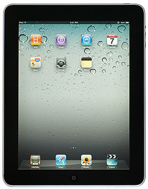
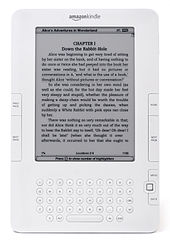
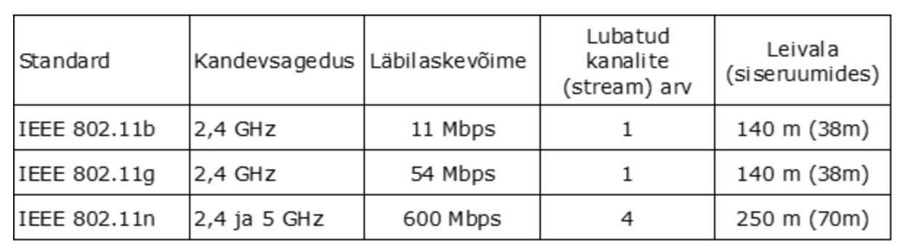

## C.5 Traadita ja kaasaskantavad arvutusseadmed

Selle teema materjale läbi töötades saad ülevaate traadita ja kaasaskantavatest võrguseadmetest, nende kasutusotstarbest, standarditest ja ühilduvusest.

## C.5.1 Multimeedia ja kaasaskantavate seadmete komponendid

Selle alateema materjale läbi töötades õpid:

- Määratlema kaasaskantavad elektroonikaseadmed ja nende funktsionaalsus
- Määratlema põhilised multimeedia sisend/väljund seadmed
- Kirjeldama peamised multimeedia massmälukandjate standardid.

### C.5.1.1 Kaasaskantavad elektroonikaseadmed

::: warning

Kirjeldada kaasaskantavaid seadmeid nagu nutitelefonid, elektronmärkmik, GPS, kaasaskantavate arvutite komponendid.

:::

Kaasaskantavad elektroonikaseadmed on kasutusel praktiliselt igaühel, aidates inimesi nende igapäevatoimingutes. Olgu see siis suhtlemine erinevaid elektroonilise suhtlusvahendeid kasutades, telefonkõned, elektroonilise märkmiku funktsioon või enda asukoha tuvastamine GPS abil. Seadmeid on eri otstarvete jaoks ja seadmete funktsionaalsused tihtipeale kattuvad. Erinevate seadmete ülevaade on toodud allpool.

**Mobiiltelefon** **_cellular phone_** Kasutab raadiosidet kõnede ühendamiseks. Mobiiltelefonid kasutasid algselt analoogsideteenust **_NMT_** / **_Nordic Mobile Telephony_**, mis sai alguse Rootsi inseneridelt ning selle edu pani aluse Nokia ja Ericsson'i tähelennule. Tänapäeval on mobiilside juba täielikult üle läinud digitaaltehnoloogiale ja tehnoloogia on pidavalt edasi arenenud alates **_GSM_** tehnoloogiast kuni **_3G_** ja **_4G_** tehnoloogiateni.

Mobiilsidevõrk jagatakse kärjetaoliselt piirkondadeks ja igasse piirkonda paigutatakse mobiilside tugijaam koos antenniga varustatud raadiosaatja-vastuvõtjaga. Tugijaamad on raadio teel omavahel ühendatud ühtsesse võrku ning võrgu põhijaam on omakorda ühenduses tavalise vaskjuhtmetega telefonivõrguga.

**Nutitelefon** **_smartphone_** on laiendatud funktsioonidega mobiiltelefon, mida saab kasutada nii telefonikõnedeks kui teiste elektrooniliste sidevahendite kasutamiseks nagu e-posti sõnumite saatmiseks ja lugemiseks, veebi lehitsemiseks, enda asukoha tuvastamiseks GPS abil, fotokaamerana ja märkmete salvestamiseks . Lisanduda võib ka muid funktsioone nagu traadita võrguühenduse võimalus, USB liides, Bluetooth liides, sisseehitatud raadio, TV, puutetundlik ekraan, jne.

Nutitelefoni funktsioonid saavad kasutajale kättesaadavaks telefoni sees oleva operatsioonisüsteemi abil. Tuntumad OS'id telefonidele on iOS, Symbian, Android, Windows Phone 7. Hetkel on suure populaarsuse võitnud Android vabavara operatsioonisüsteem, mis kasutab Linux'i kernelit. Android jõudis laiemasse kasutusse läbi Google'i, kes ostis algse OS'i arendaja. Android'il on suur toetus ja saadaval palju erinevat tarkvara üle maailma. Rakendused kirjutatakse Java keeles.

**Elektronmärkmik** **_PDA_** / **_Personal digital assistant_** on peoshoitav seade, milles on ühendatud arvuti ja kalendermärkmiku funktsionaalsus. Reeglina on võimalik ka seadme võrku ühendamine ja võimalik, et seade on kombineeritud ka telefoni funktsionaalsusega. Seadme funktsionaalsuse teeb kättesaadavaks operatsioonisüsteem nagu Palm OS, Symbian, Windows CE, jne. On olemas nii klaviatuuriga kui ilma klaviatuurita elektronmärkmikke. Viimastel täidab klaviatuuri aset puutetundlik ekraan kas virtuaalse klaviatuuriga või kasutades puutetundlikku ekraani läbi menüüde navigeerimiseks. Seadmel on navigeerimiseks pliiatsitaoline lisaseade. Selle seadmega saab tavaliselt ka käekirjas teksti sisestada.

**Pihuarvuti** **_handheld computer_** on arvuti, mida saab mugavalt käes hoida ja puuteekraanilt navigeerida. Pihuarvuti võib kombineerida PDA ja mobiiltelefoni funktsionaalsust.

**Kantav arvuti** **_wearable computer_** on arvuti, mis kinnitatakse keha või rõivaste külge ning millega suheldakse kõnetuvastuse ja kuvarprillide (HMD - Head Mounted Display) abil.

**Tahvelarvuti** **_tablet PC_** on personaalne portatiivne arvuti, millel puudub füüsiline klaviatuur ja mida navigeeritakse puutetundliku ekraani abil. Tahvelarvutid said populaarseks Apple'i iPad toodete turuleilmumisega ja kaasajal on nende valik oluliselt laienenud ning erinevad mudelid töötavad erinevatel operatsioonisüsteemidel.

_Joonis 5‑2. Apple iPad tahvelarvuti (Allikas: http://en.wikipedia.org/wiki/File:1stGen-iPad-HomeScreen.jpg)_

Põhiliseks operatsioonisüsteemiks Apple iOS kõrval on Google Android operatsioonisüsteem, mis ei jää võimaluste poolest alla turuliidrile. Teatud võimalusi on isegi rohkem, kuna Android tahvelarvuti kasutaja saab laadida oma arvutisse palju erinevaid rakendusi ja mänge, mida arendatakse kogu maailmas. Apple'i rakendused on piiratud tootja suva järgi. Samas on piirangutega tagatud rakenduste sobivus seadmele ja vähem probleeme puudulike rakendustega. Tahvelarvuti eelisteks on võrreldes sülearvutiga väiksem kaal ja õhem korpus. Seda on mugav kaasa võtta reisimisel. Jõudluselt on selline arvuti piisav, et võimaldada multimeedia kasutamist, lihtsamate arvutimängude mängimist, erinevate veebiraamatute lugemist, terminalina kasutades saab selle kaudu ühenduda teiste arvutite külge ja teha tööd reisil olles.
Üks tahvelarvuti eriliik on vaid e-raamatute lugemiseks mõeldud seade, mille näiteks on Amazon Kindle.

_Joonis 5‑3. Amazon Kindle (Allikas: http://en.wikipedia.org/wiki/File:Amazon-kindle-gen2.jpg)_

See seade võimaldab laadida hulga e-raamatuid mällu ja neid nii mugavalt lugeda nii reisil kui kodus olles. Raamatu lugemisel on oluline selleks spetsiaalselt kohandatud ja silmi vähem väsitav kõrge kontrastsusega peegeldusteta ekraan, mida saab lugeda ka päikesepaistel. Seetõttu on selline spetsiaalne seade raamatute lugemiseks sobivaim.

**Globaalne positsioneerimissüsteem** (GPS - Global Positioning System) on süsteem, mis võimaldab määrata objekti asukohta satelliitidelt vastuvõetud raadiosignaalide võrdlemise teel ligikaudu 10m täpsusega. Asukoha määramise eelduseks on barjääride puudumine GPS seadme ja satelliitide vahel. GPS kuulub paljude mobiilsete seadmete komplektsusesse. See leiab laialdast kasutust erinevate navigeerimissüsteemide kasutamisel ja ka erinevate objektide teekonna jälgimisel, näiteks logistikaettevõtte autode asukoha määramisel või auto turvasüsteemi osana ärandatud auto leidmisel.

### C.5.1.2 Multimeedia sisend-väljundseadmed

::: warning

Määratleda põhilised multimeedia sisend/väljund seadmed nagu skännerid, digitaalsed kaamerad, mikrofonid, ekraanid, kõlarid, peamikrofonid ja nende kasutusotstarve.

:::

Multimeedia seob erinevad meedialiigid ja sellega seoses võivad olla kasutusel erinevad sisend-väljundseadmed, mille abil mingi osa meediast kas arvutile või tarbijale kättesaadavaks tehakse. Näiteks vajavad videotelefoni funktsionaalsust kasutavad osapooled videokaamerat, mille kaudu jõuab videopilt ühest arvutist teise arvutisse ja peamikrofoni, et lisada videopildile kõne ja teise osapoole kõnet kuulata. Kõrglahutusega multimeediavoo esitamisel võib olla vaja vastava kõrglahutusrežiimi toetusega ekraani ja ruumilist heli võimendavat helisüsteemi, et saada esitatud filmist maksimaalne elamus. Piltide arvutisse saatmiseks ühendatakse kaamera arvuti USB pordi või traadita ühenduse abil arvutiga ja jagatakse niimoodi pilte vaatamiseks sõpradega üle arvutivõrgu või ka kodusele teleriekraanile. Multimeediapresentatsioone, koolitusi ja ajaviiteüritusi aitavad läbi viia multimeediaprojektorid, mis kuvavad multimeediaesitluse otse seinale.

Virtuaalne reaalsus kasutab multimeediakomponente et luua keskkond, mis sarnaneks võimalikult reaalsega. Selle kooslusesse võivad kuuluda erinevad sisend-väljund seadmed, mis vahendavad VR kasutaja ja keskkonna omavahelisi infovooge.

### C.5.1.3 Multimeedia salvestusmeediumid

::: warning

Kirjeldada peamised multimeedia massmälukandjate standardid nagu CDROM, DVD, magent-optiline ketas, välkmälu ja erista nende tehnilisi parameetreid

:::

Multimeedia salvestamisel võib kasutada erinevat salvestusmeediat sõltuvalt sellest milline on kasutatava materjali maht ja otstarve. Erinevad multimeediakomponendid vajavad erineval hulgal mäluruumi. Vajaliku mälu maht sõltub oluliselt salvestatud meedia kvaliteedist ja võib erineda suurtes piirides. Näiteks võib digitaalne foto olla mahuga 100 kB kuni kümnete megabaitideni. MPEG-2 baasil 2-kihilisele DVD-meediale salvestatud filmi maht on suurusjärgus 6 GB, 2-kihilisele Blu-Ray-meediale mahub kuni 50GB infot. Kõrglahutusega täispikk Blu-Ray film võtab reeglina vähem ruumi aga samas saab vaba salvestusmeedia osa kasutada tarbijale filmi kohta täiendava info või uute filmide tutvustuste edastamiseks. CD-plaadid mahutavad 700MB ja neid saab kasutada piltide ja digitaalsete helifailide salvestuseks.

Kaasaegsed CD-mängijad toetavad peale standardsete audio-CD plaatide ka CD-plaatidele kirjutatud MP3 või muus formaadis muusikafailide või raamatute esitamist. Kui ühe standardse audio-CD plaadi kestus on ligikaudu tund siis MP3 kujul võib CD-plaadile salvestada kümnetes tundides muusikat. Oluliseks meediumiks erinevate multimeediafailide salvestamisel on välkmäluseadmed (USB andmekandjad, MP3-mängijad, telefonide ja fotokaamerate mälukaardid, kaasaskantavad massmäluseadmed, jne). Välkmäluseadmete mahud kasvavad kiirelt ja on juba võrreldavad tavalise kõvaketta mälumahtudega, mille tavaline maht on tänapäeval 2 TB ja hinna poolest on kõvaketas ilmselt soodsaima megabaidi hinnaga.

Multimeediaserveri korral on multimeedia sisu salvestatud serveri massmäluseadmel, mille mahud on tänapäeval kümnetes terabaitides. Sealt saab edastada klientidele multimeediat voogesituses üle võrgu.

### C.5.1.4 Kordamisküsimused

::: tip Kordamisküsimused

1.  Mis seade võimaldab helistamist ja asukoha määramist?

- GPS
- GSM
- Nutitelefon X

2. Nutitelefoni operatsioonisüsteem ei ole:

- Android
- Symbian OS
- GPS X
- iOS X

3. GPS seade võimaldab:

- Tuvastada asukohta mobiiltelefoni keskjaama abil
- Tuvastada asukohta garaažis
- Tuvastada asukohta satelliitide abil X

4. Kui palju info mahutab maksimaalselt 2-kihiline DVD plaat?

- 6,0 GB X
- 4,5 GB
- 8,54 GB X

5. Välkmäluseade on:

- Kõvaketas
- Nutitelefoni mälukaart X
- Optiline mäluseade

:::

## C.5.2 Traadita side põhimõtted

Selle alateema materjale läbi töötades õpid:

- Loetlema traadita sides kasutatavad tehnoloogiad ja nende funktsionaalsus
- Määratlema peamised erinevused traadita seadmete standarditel
- Määratlema piirangud ja probleemid, mis seotud traadita ja mobiilsete seadmetega.

### C.5.2.1 Traadita side tehnoloogiad

::: warning

Loetleda traadita sides kasutatavad tehnoloogiad ja nende funktsionaalsus

:::

Traadita side korral toimub andmete ülekanne elektromagnetlainete abil üle raadioeetri. Traadita sideühenduste jaoks kasutatavad sagedused ulatuvad ultrakõrgsagedusalasse (UHF – Ultra High Frequencies), mis jääb vahemikku 300 – 3000 MHz ja lainepikkusega 1-10 dm. See on detsimeterlaineala, kus töötavad koos mobiiltelefonidega, traadita võrguseadmetega, televisioonisaatjatega, beebimonitoridega ka mikrolaineahjud.

Info ülekandmiseks moduleeritakse kandevsignaali. **Moduleerimise** meetodid on:

- Amplituudmodulatsioon (AM), mille puhul kandevsignaali amplituudi varieeritakse vastavalt andmesignaalile
- Sagedusmodulatsioon (FM), mille puhul kandevsignaali sagedust muudetakse vastavalt andmesignaalile
- Faasimodulatsioon (PM), mille puhul kandevsignaali faasi muudetakse vastavalt ülekantavale signaalile

Andmete ülekandmisel üle raadioeetri kodeeritakse bitid sümboliteks. Selleks seatakse biti väärtus vastavusse faasinihkele raadiosignaalis. Teades, et kokku on 360 kraadi faasinihkeid, võime kodeerida mitu bitti ühte sümbolisse.

**Digitaalne faasimodulatsioon (PSK – Phase-Shift Keying)** on faasimodulatsiooni meetod ja selle lihtsaim variant on binaarne faasimodulatsioon, kus kandevlaine faasil võib olla ainult 2 väärtust - 0 ja 180 kraadi. Binaarse faasimodulatsiooni korral edastatakse iga sümboliga üks bitt.

![](data:image/png;base64,iVBORw0KGgoAAAANSUhEUgAAASAAAADNCAIAAACXTDo/AAAAAXNSR0IArs4c6QAAAAlwSFlzAAAOxAAADsMB2mqY3AAACwhJREFUeF7tnEtIVWsUgPPeHvaw0hLDKLyFWtEgESIiwUlEJUGNalSBgx4EDYpqkkGkYZOKmoSRPSBnlZOEBj0McnClBkE+BjXyQZCFQQ6C7rodrnjz1tn7XNc6/z7rO4PI+Pdae31rfWf/Z+9jed++fZvGCwIQ0CHwm05YokIAAn8TQDDmAAKKBBBMES6hIYBgzAAEFAkgmCJcQkMgj7uIGQxBX19fc3Nzb2+vHFtcXHz+/PmKiooM4nBIzhPgCha7xd3d3XV1dXLYxe+voqIi+fHJkyexA3GAAwJcwWI3uaamprKysqWlZfzI+vp6uZp1dnbGjsUBuU6AK1i8Dg8ODg4PDx88eHDiYfKj/GO8QKz2QQDB4vV5YGBADqiurv7hsP7+ftk6xovFagcEEMxBkykxewQQLB77goKCyRer0dHR8vLyyZe1eKFZnYsEECxeV+V2vLjU1tY28bA7d+6sXbs2XiBW+yDw+5kzZ3xUOmVVFhYWHj9+fObMmXPmzJF7HqdPn3727NmlS5dKS0unLAeBcoUAt+kz6WR7e3tra+vr169LSkrklv2HDx/ev39/9uzZ2traiOHGxsby8/MjLmZZcgkg2NT0rrGxUZS7e/duxE9ip06dampqmprcRAmYAIJloTk9PT1VVVUjIyNcxLJA3zYlNzlseX/PdvPmTdkidnV1ZSE3KW0JIJgt7+/ZZDMpf/L1xSygN0+JYNbIOzo6hoaGJOvTp0+tc5PPnACCWSOX/WEqpWwRZaNonZ58tgQQzJT3x48f79+/n0rJxzBT9FlKhmCm4GVzeOLEiYaGBskqf3IX0ZR+NpJxmz4b1KdNy8uDfHbIG2flCmYMnHS+CCCYr35TrTEBBDMGTjpfBBDMV7+p1pgAghkDJ50vAgjmq99Ua0wAwYyBk84XAQTz1W+qNSaAYMbASeeLAIL56jfVGhNAMGPgpPNFAMF89ZtqjQkgmDFw0vkigGC++k21xgQQzBg46XwRQDBf/aZaYwIIZgycdL4IIJivflOtMQEEMwZOOl8EEMxXv6nWmACCGQMnnS8CCOar31RrTADBjIGTzhcBBPPVb6o1JoBgxsBJ54sAgvnqN9UaE0AwY+Ck80UAwXz1m2qNCSCYMXDS+SKAYL76TbXGBBDMGDjpfBFAMF/9plpjAghmDJx0vgggmK9+U60xAQQzBk46XwQQzFe/qdaYAIIZAyedLwII5qvfVGtMAMGMgZPOFwEE89VvqjUmgGDGwEnniwCC+eo31RoTQDBj4KTzRQDBfPWbao0JIJgxcNL5IoBgvvpNtcYEEMwYOOl8EUAwX/2mWmMCCGYMnHS+CCCYr35TrTEBBDMGTjpfBBDMV7+p1pgAghkDJ50vAgjmq99Ua0wAwYyBk84XAQTz1W+qNSaAYMbASeeLAIL56jfVGhNAMGPgpPNFAMF89ZtqjQkgmDFw0vkigGC++k21xgQQzBg46XwRQDBf/aZaYwIIZgycdLlP4OrVq/X19ak6ESz3+02FxgQ+ffrU29uLYMbYSeeRAFcwj12nZjMCCGaG2m+i7u5ut8UjmNvWWxTe3t5eU1OzZ88ei2RB5kCwINuSEyclN9MuXLiwe/funKgmwyICEkw2EvLq6+vLsBQOC4zA3r17Ozs7N2zYENh5mZ5OKIKlNhJHjx6tq6sbf4ZgSoJkU01g3rx5Ux0yefGCEKyxsVHIybVL3vCuXbt2/fp1rmPJGyXO+B8CCxYsqKysDOg52MOHD7du3Zo6odra2vLy8kePHtEvCCSUwOHDh1taWgISbHh4eOPGjeM0S0pK5Fl4QuFy2hCYSCCILaKcUEFBAY2BQO4RCEWw0dHRjOG2tbVt3769uLg4Ly9vxowZVVVVFy9eHBsbyzggB3Z1dck9wBUrVghSea1evfrQoUNDQ0OxyKQegsmNq/7+fvnLrl27Yh2eI4u/BfDatGnTuXPnxk9EPoNduXIlynkNDg7KXeD58+f/0IxZs2YtX778xYsXUYJkZY2ccFbypk365cuXI0eOLFy4cPJ8L1q0SG5BpY0wccGf/37FOjY3FgfR5mPHjoljKaCPHz8WwQYGBtLyffPmzeLFi3/xPidTIs8608bJyoIwBRO7Kioq8vPzf0ZV7o/t2LEjK8QSmjQIwWR/KIKlXmLX7du3o9BctWpV2l2EvOm+fPkySjTjNWEKJteuX9iVoi2fli9fvmyMK7npghBs/NolakW5dsn6hoaGuXPnphVMFoix8sYcWocCFEx21P+5M5wMWZa9ffs2NKRhnk9AgsUCNPlz189kk2mQ52yxghssDlCwbdu2RXnDSq2RXb0BpUBSyLtJxm8oodxFjN5aWSm3s75+/RrxkM+fP7969SriYs/LYlF6/vy5H1atra1/fH/t379f/v7u3bsYtcs3J2KsZikE/BEoKyv7oWj5lwMHDkS5rCVyiyhbvoifFlJcZPMTyGZj/DRC2yLKx9Tp06dHd0e26KEh1Tsf+cA/kYw8Gbpx48bIyEiUjIncIkqFMhARp0GeiW3evDniYrfL5ObhsmXLopdfXV0dfXFurJSr1smTJ+WqJXeD9u3bF/EtPpGCSW2iTcS2zZ49e926dREXe14mX9eIWL5c6yZ+dzTiUcldJh+jZNMkajU1NU3eLqapK8plLsA18igm4tcXxa4Azz+0LaIgkgeG8tgwigZLliyR79AESDXAU0rkFUyGQB6Jrly5Mu00yLXu3r17aZexQAjIO5HsfNL+lmRhYWFzc7M4BrRIBAKUPuIpySV76dKl8u3en9Updt26dStiNONlAV7BhIB8sl2/fv0vnuDLV6Xk/9gwZpXodIm8izhOXO7k7Ny5c/LHTb7s+3+GUm6aFRUVTX7byuDLvv/nNHLj2DwpI9KVLuBFHR0d8psRcm9HHpWWlpbKVkduG8pjirRfq8tiTfI7ICGT7+npkV8CevDggfwX0LJHWLNmzZYtWwQpO8O4MxN0m+MWk6D1gQuWIJKBn2pSb3IEjpXTg0CKAIIxCRBQJIBginAJDQEEYwYgoEgAwRThEhoCCMYMQECRAIIpwiU0BBCMGYCAIgEEU4RLaAggGDMAAUUCCKYIl9AQQDBmAAKKBBBMES6hIYBgzAAEFAkgmCJcQkMAwZgBCCgSQDBFuISGAIIxAxBQJIBginAJDQEEYwYgoEgAwRThEhoCCMYMQECRAIIpwiU0BBCMGYCAIgEEU4RLaAggGDMAAUUCCKYIl9AQQDBmAAKKBBBMES6hIYBgzAAEFAkgmCJcQkMAwZgBCCgSQDBFuISGAIIxAxBQJIBginAJDQEEYwYgoEgAwRThEhoCCMYMQECRAIIpwiU0BBCMGYCAIgEEU4RLaAggGDMAAUUCCKYIl9AQQDBmAAKKBBBMES6hIYBgzAAEFAkgmCJcQkMAwZgBCCgSQDBFuISGAIIxAxBQJIBginAJDQEEYwYgoEgAwRThEhoCCMYMQECRAIIpwiU0BBCMGYCAIgEEU4RLaAggGDMAAUUCCKYIl9AQQDBmAAKKBBBMES6hIYBgzAAEFAkgmCJcQkMAwZgBCCgSQDBFuISGAIIxAxBQJIBginAJDQEEYwYgoEgAwRThEhoCCMYMQECRAIIpwiU0BBCMGYCAIgEEU4RLaAggGDMAAUUCCKYIl9AQQDBmAAKKBBBMES6hIYBgzAAEFAkgmCJcQkMAwZgBCCgSQDBFuISGAIIxAxBQJIBginAJDQEEYwYgoEgAwRThEhoCCJadGSgrK8tOYrLaEvgLhiXhMUfUzBIAAAAASUVORK5CYII=)

Joonis 5‑4. Binaarne faasimodulatsioon (Q- kvadratuurlaine;I-faasislaine)

**Kvadratuur-faasimodulatsiooni** korral võib kandevlaine faasil olla 4 erinevat väärtust sammuga 90 kraadi, mis võimaldab iga sümboliga edastada 2 bitti.

![](data:image/png;base64,iVBORw0KGgoAAAANSUhEUgAAASAAAADNCAIAAACXTDo/AAAAAXNSR0IArs4c6QAAAAlwSFlzAAAOxAAADsMB2mqY3AAAFlJJREFUeF7tnXuIVdXbx/WXd7NyTOZNyAvhmCWRGJiiphRYJJgSqGFpZaUZpaToBJkWpvmPWtpFBJUER4K0QUipKLUbpVhgmCOhEmmT6GQmZdf3885+f5vDmZlz1jl773X2Xuu7/xjOObP2etbzfdZ3PWs969b+33//badHCAiBZBD4TzLZKlchIAT+DwERTPVACCSIgAiWILjKWgiIYKoDQiBBBESwBMFV1kKgvaKIZVSChoaGVatWHT16lHd79+69cuXKmpqaMvLRK84jIA9WsokPHjw4YcIEXlvT/FRVVfH1o48+KjkjveABAvJgJRt59OjRgwYN2rhxY/jmrFmz8Gb79+8vOS+94DoC8mClWfj06dONjY1z5szJfY2v/FhaRkrtBwIiWGl2PnXqFC8MGzYs77Vjx47RdSwtL6X2AAERzAMjS8XKISCClYZ9jx49WjqrCxcuDBw4sKVbKy1rpXYRARGsNKsSjodLdXV1ua9t3bp1yJAhpWWk1H4gcNnSpUv90DQ2LXv27Llw4cJOnTp169aNmMeSJUv27du3du3aPn36xCZDGbmCgML05Viyvr5+8+bNhw8frq6uJmR/7ty5M2fOvPDCC2PHjjXM7vfff+/SpYthYiXLLgIiWDy2e/HFF6Hctm3bDEditbW1K1asiEe2ckkxAiJYBYzz7bffDh06tKmpSU6sAujbFakgh128m6Vt2bKFLuLnn39eAdkSaRcBEcwu3s3S6EzyV8sXKwC9dZEimG3Id+/e/eOPPyJ17969tmVLnnUERDDbkNM/DETSRaSjaFu85NlFQASzivfPP/+8c+fOQKSGYVahr5AwEcwq8HQOFy1a9NxzzyGVv4oiWkW/EsIUpq8E6u3atW8v5CuDvGWp8mCWAZc4vxAQwfyyt7S1jIAIZhlwifMLARHML3tLW8sIiGCWAZc4vxAQwfyyt7S1jIAIZhlwifMLARHML3tLW8sIiGCWAZc4vxAQwfyyt7S1jIAIZhlwifMLARHML3tLW8sIiGCWAZc4vxAQwfyyt7S1jIAIZhlwifMLARHML3tLW8sIiGCWAZc4vxAQwfyyt7S1jIAIZhlwifMLARHML3tLW8sIiGCWAZc4vxAQwfyyt7S1jIAIZhlwifMLARHML3tLW8sIiGCWAZc4vxAQwfyyt7S1jIAIZhlwifMLgSwRjHuQRzc/s2bNyrXS6dOnJ0+evH79+qyYLrjb8sSJE1kpsMpZNgKZuYIguGV8w4YNPXr0mDdvXu/evd9++23UDn7nw8yZM5955pmygYj3RW5h5iIViNTY2PjVV1/BpVw63Xrrrfyrf//+eT9eddVVw4cP53eem2++ma/xlkq52UcgMwSrqalZsmTJ9OnTwYjLVx999NGGhgY+483WrFlzV/NTWYJBKgq2Z88e/v5P8wORqquroUrAmVzrtrxdBcpxexh/T548CfGgJTmMHTt2/Pjx/K0g2X799deXX375ySefvPzyy3NVqK+v//777+fOnWu/1mZJ4r9ZeE6dOjVw4MCjR4+GheXrgQMHwq+jRo1avnx5RVR59913cZ7w5/rrr589e/aOHTuampqKloQqUjTNkSNHXnvttXvuuQd2wVXuEzt+/HjRt+JNsG7dOqCmtLloY45JkybxO7DHK8693LIxBsOi2Bgnlp6mC381f/78a665Zu3atbfddtuHH36Yy4dYypnL2NWrV5PnuHHjRowY8frrrwe3PCf9HDx48IMPPti1a1fAsfDBa91+++00K0kXwIH8s0GwVAHNkG/w4ME04f369Tt06FDowRItJB5s6dKleDCY9vXXXw8dOnTatGl0IxMVOmzYMAa6Lds1flTP0BD5bBCMwMaxY8eCQVelHq5UxnUMGDBg79699APxV8RaGCZZLg9Mo99I4HTixIkPPvggPo0hn+UySJw5AtkgGI0ovZQvvvgiUCyoUrSv5npGSQm1Vq5cidfCddAV3LRpE523KBnG8u7UqVPxnwzMli1bJprFAmkSmWSDYGhOg/3GG28wKuB59tln+RrAgVvjFz4QWuADIa94YYLMDHvOnz//2Wef4TrygoHxyiojNwKMcD6gGQ7NztisjHL6+0qG4jYLFiwIIle5AUPGQvwSPkS94tIIxjKOpwbTG4wrzzAfKlzseQaulb+x55wXsw3yxwqKIhaFOn4zFxWZiQRUU5xVEpU1UD8JgpFt0CgwTou3URDByq60mZlottbHYMQ1Z84cxBGvS256t+VEc4wKMlvNFMJTTz3FOC1KtoRSmIHIzWHbtm0MfZnc37dvX/j7kCFDglU1eloi4B3BGKXs3r37m2++ef/993v27DlmzBg6gTwBNMxuEf6maiY9yZMowVCERSE0EzQQNBNdunRR1a8YAmX7viy+yFLGXr165S35CdZJ0FrTIWRZU7ydq7ZQSqiLmCeOqEzs3cUs2r2CZfbFg9HxY1EfcXbiga02Zl27dh05ciSrFuy090l7sFBHJqNxZTCNtiP4kQ4kP+LJiYjwYxqmHCrmXiwIriC5bYp++umn8xxXS2xxbvgxO6Wy48ECXYh84MdYcYIDpx3BY3fr1o0CXNH89OnThxkIO1p7KMULD0aDfccdd5w9e7Zog0WLzuxt0WTRE1jzYEFR2TVzww03/Nb8tCw8lHv88ccJu0fXSznkIZCZieYolqOPZMIuRLBPhBBIFFnpfPfOO+88d+5cq+wKIiJsSHnllVfSWfhMl8oLgjH0MjQSC0E+/vhjw8RZSQZzvvvuu8KlRXG222mTdew2dZ9gVJrLLrvMELi//vqLDRqGiTORDO9UW1t74cKFoqUlJVMURZMpQUkIuE8w6o05wYLhSkkIpjwxayk7dOhgWEgGq4RbDRMrmQkC7hOMMPSlS5dMsAjScKiOeeL0p2Qn8sWLFw3L2blzZ6baDRMrmQkC7hOMeS32HZtgQRpC+Wz9MEyciWScs0C/17yoGoaZY2WS0n2CgcIDDzzQvXt3EzggGAE3k5RZSTNo0CDzLiJKpW0/TlZwbqucXhCMzfbXXnttUVOxNHHVqlX2NykXLViUBLfccoth44IU+tJa2BEF7ZbvekEw1GaTf+F6xn9ZS3X//ffHi2/Fc2Mds3kXkXl2OyvFKg6LtQL4QjCW3t144400z63S7Oqrr2Y3J3sxrOFuTRCrNFasWMGhJkUlktJJBIoqnmwCH5aHsYIhXCbP7vqgF0R9YsTF2jzW6dlfjEcBbCKPjh07dixQkzp16sRiDptF8kSWF2sRGYNRt4K/4cOicoZblRrTW16LyGTgQw89xOkdfGhJs6qqKqYKOVOoUmgk60Mqmrv7BCPuzKnaLOFN1ejCMsGCOsYyyylTpvAB6WzbwYf/8ccfffv2ZYAKSpygyor7itZGB4W7TzDYxQ7ltAXfK0KwoP4ylczDog3iH/SWw6gp66Q4qyviKQMOUiSaSo4TbOfOnVu2bKGFjoZS/G9XkGBtKUMciAPq2NCdKlcfP/R2c3Q8ishRio899phdSLMqLbgOhiYpqwqkstwuEyzYGJ+2zmEqq8H/F2rRokUvvfRSmkuYubK5TDAOuyUonzmTVLDAwVVmcmIxmsDZMRjui6Ok7ez/L8MeKRyDBVqkHLcyoK7sK856MI2+yqtYwWqp4BZpPdERcJNg7Bpkzoe7IaMD5GEOzJVt377dQ8XjUnn9+vUcfhzk5ibB2MabO8MTF3Ce5MNUWF1dnSfKJqEmk/hsw3OZYMx9zZgxIwnsfMiTeD0dRSdP17JvPgc9GMvt8GDqH0apTDRPNFJRctC7znowoszMfWk5QpQqTvOEB9MBOFEwdJZg3KGcd+lOdJh8y4HmiV6iYonR7e5gF5H+YXgdUXSAvM2BRkrXq0e3vmsECw5F0r6m6DWDRoq+QPR8PM/BNYIxctDiw1jqNAt/2dXS6gbNWPL3JBPXCLZnzx7OrvHEeImqyTAMjqmXWAbIV155JafluRnkoIuo/mEZdaLVV0BS55CWAebcuXM3btzoJsHo1ehkvzLqRKuv0AyHKxLiytO3fJzqIrL7i3MmNAMWVyWWB4uOpFMEY6tFeBNxdGiUA2ACqXCIgoBTBNMALEpVaPkuixKJImo9RxRUnSIYXcTq6uoocOjdPATgGKgKlrIRcIpg3J3n2NUNZds1rhdFsIhIOkUwOjOKcESsEHmvg6e6iFEgdYpgDBiIIkaBQ+/mIQCeWszB2L7s+UARTJwqhIAIBjqbN28e0PxwjBKfSyObFp6LYUKgMAIt1wbxy+zZs48fP170jhirl+gULU3EBDQWXCASMRM7r2NRO4IiSpk5c+amTZsiZpL11/NO12SJJpg0NTWZ6OVUF1EtsRBIDgG81uLFi/Fa3CZHu2M42neKYIopx169mATTzAc9Iy52glrcFVrqUnKnCKaYcuwE08wHkEKwsjcZOkUwhbxiJ5hmPiJC6hTB2OimSZuIFSLvdREsIp5OEYzRAqulIiKi13MR0BgsYn1wimBstWTDZURE9HqIADOqtFlafRalSohgUdBz/F1tD49uYKcIpv1L0StEbg7aXxcdT6cIBhzqJUavE2EOHMgRno4UY7ZeZSWCeWXu0pTVEQyl4dVaatcIxqGIHI0YHRflwBQzBGPdnaCIgoBrBGPSXWdlRqkQ4bvc/BBcJxtLbt5m4hrBgqVipe3Y8db4BRWnndIlNdGrhmsEAxE5sejVghy4+UF7BaMj6SDBJk6c+M4770SHxuccWCHFAEwEi14HHCQYC5/p3uioliiVg1tCdQdvFADDdx0kGONyKkddXV0sAPmZiW6Rj8vuDhIMaKZMmbJ9+/a4MPItHxb4skhK/cNY7O4mweglMoTQkbTlVREOTmJLfHnv6q08BNwkGEpOnTpVvcTyqjvOny5Aee/qLV8INmPGDAYSsnepCATXqeiSmlJxayu9sx6MKsKkM9GwuJDyJJ9ly5blnVLmieIJqdmes90Syrri2dIYcxTroUOHKl6SlgVo3z6NyKcZsRQa0aRIznqwoJ8jJ2ZSCcI0cl8lwWWSOI3tqEm5DdOktklOoQdLLVaGtk5nMpc9WODE2IKpcKJJ5autreVgTZOUSmOOgOMeDCCYDRs3bhzHHRuedWyOXZSUafNgtEEs4Ny2bVsUpfRuK4Nth4McobZr1qw5efLk6tWr01MDUkUw1m0OHjyYNkinZMdeQ9z3YAFkQ4cO5UaM9EzvpIpg8+fP79ev37x582KvXsrQF4LljeDZrrt79+4vv/zy1KlTI0aMuOmmm1gfbLP9tkww1GdKsFV9FdtIthUwuePIjTTMn/KcPn2acybyxmPdunXr1avXhg0brGmKUe3I4hqrSZMmcah4bjUK9f3tt9/w6keOHLFTGA+lWDJzSpAdMmTIFVdc0VaLRS0cM2YMdc5Cae0QjEn23r17d+zYsVWV0RenbbNZsQBs2kQ4HqbPrViEE3/66adffvmlLYKdP3+egf59992XbJ/BVu6ELu66664zZ878+eefrcpEXwDh5itbJfJRjkcEYwsG/aXCRqYucgktwzMH6gItxdmzZwsr8s8//zijbzpN5kuQg6gGzbnh5UZ9+vT54YcfEjVY0kEOdkwOHz68gLvO1c6CvomCmebMffFgEIzBlaElaPgNqWiYof1kwa4Tw8cBfQ01tZ/MF4J98sknly5dMsS3a9euJVVQw2xtJtu3b5+h+6JUDuhrE9uSZGWMYATZDzY/eUoGPzY0NLSlfNHRSO6LRKKy7sEuXrxoXg8c0NdcWcsps0SwrVu3ctYsCw54ampqQjqNHj162rRp/DhhwoRZs2a1iuDIkSM7dOhgCO7ff/+dnjUfhmXOS8bKlc6dOxu+64C+hppWIFna5g0KlGfgwIFvvvlmkIDJUx4+LF++fNSoUcGPBMRAkEt3WmayY8eOvMnWAljTZUoaFqQnKgIozBc3F9B33bp1ZJVbVEwA5jx5vyeqTnYzz4wHC7qF06dPD4gxefLkw4cP84FpHMKDwY+cNAYJ33vvvZbk4V+dOnUyacA4VrEtN2jyekrSsFqlwJR6biHb0pfDW+kaPPHEE59++mmYfuHChc8//zxfmfBgj0J9fX1K9E1vMbLSNuR6Ksp84MABuMQH/uY2pXgzUraqFFQ0adT79u1rYTFH0h4MBAx36LSlL0gCbC6erNvMRfvhhx8O+w5ZqUX2y5kZD1agierRo4dJA8ZhiTzdu3cvkJhx2qJFi9y4swcndt111xUeebICk0PaWtV3//79eWeP0vcOugkBgPQmGhsbTZD3OY0LBLtw4YKhCdlQuGDBgqqqqpbpqWS05Sw5f+utt5YuXWqYYWqTsS6MXQL33nvvq6++WkDfXbt2mV+xR1+xuro6VNmwXUstRHYKlhmCEQbMbS9ZAB4AhMlzBwmkKRzMgDzMiTF+YIjCovKg0zhgwIBHHnmEFvruu+8OIiUkYDGEHRvELoWjeSk/G0wXL16MXgX0NWdX7IX0JUP7vdKyJTIAYFt7GEVkDMBnPFJuFJE0DBUMRTCr1lYojN+J1LO9JaHxWEJjMNodusHBqsuWIBTQty3EcsdgDG6DcW/whMNgQ7T9TJZssDheTAMDY/LgCTKnfxj+khvHjy4aakEwaJZEPDp2glFajqyhtMRyouse5pBLsDxGEcHP5VuMQl3KKksEA3d6cdgVS+fZAA4wP2Puu8xNiE9gWM9+Z/ZWmb9VNGW8BOM0BA7PokMYu7/Ni8rCKPAP27W2ArZF1fcnQcYIVinDME+Nc4BmcXmzWAgGnaAWh6vSJzx+/Hi84EAt6BQ+AZdQP/yFznm8Ep3MTQQrwazQDG/Gw4cSXmstaUSCMZoihpEQtYqq1upamaJv+ZlABCvZ7rTiuDLCj7Nnz2Yyt+T3m18oj2C4LGYagvN5WHsJzcqTrresIeDLhsvYg8Ist+ewTm5IYsaJu8i4eb2kkHdJGy6RxSbrPXv2ME1HkJDLu3SBcuwGTShDESwqsCdOnAiOxWULGbWf9f70IYsuxi9KME7UYDXg3r17oRYiyHn8+PEw2Y1VJlFBz877IlhstoISkAFKQAzIBsfoyLFvn7+E+BADN0IvFxIM7xRu7uRFDqLhK3Pc/A5RoSvUKkrX2HRQRnEjIILFjeh/8wsuieaoAhaXBItCYCBf8+Qxlgv5A52CrxDS5imoSUGgfNu1E8EqUwuKdhErUyxJjRuBzKxFjFtx5ScEbCAggtlAWTK8RUAE89b0UtwGAiKYDZQlw1sERDBvTS/FbSAggtlAWTK8RUAE89b0UtwGAiKYDZQlw1sERDBvTS/FbSAggtlAWTK8RUAE89b0UtwGAiKYDZQlw1sERDBvTS/FbSAggtlAWTK8RUAE89b0UtwGAiKYDZQlw1sERDBvTS/FbSAggtlAWTK8RUAE89b0UtwGAiKYDZQlw1sERDBvTS/FbSAggtlAWTK8RUAE89b0UtwGAiKYDZQlw1sERDBvTS/FbSAggtlAWTK8RUAE89b0UtwGAiKYDZQlw1sERDBvTS/FbSAggtlAWTK8RUAE89b0UtwGAiKYDZQlw1sERDBvTS/FbSAggtlAWTK8RUAE89b0UtwGAiKYDZQlw1sERLDKmL5///6VESypdhH4X7Ssz3kLgHdXAAAAAElFTkSuQmCC)

Joonis 5‑5. Kvadratuur faasimodulatsioon (Q- kvadratuurlaine;I-faasislaine)

Kasutatakse ka **8 faasiga faasimodulatsiooni 8PSK** , mis võimaldab iga sümboliga edastada 3 bitti. Seda kasutatakse näiteks EDGE andmeedastuse korral. Kasutades 3 bitti sümboli kohta saab iga sümbol edastada kaheksa erinevat väärtust. Niimoodi saab tõsta ülekantava info andmeedastuskiirust.

![](data:image/png;base64,iVBORw0KGgoAAAANSUhEUgAAASAAAADNCAIAAACXTDo/AAAAAXNSR0IArs4c6QAAAAlwSFlzAAAOxAAADsMB2mqY3AAAHVhJREFUeF7tnXvwT8X/x7tIJSpKvphcB5GpxCgmSjISQ18alyIVchsjE6GZymVIH2ZcSsp8lDCDUW7TTIyk0E1UGjOFUCqFyCWVdPk+fp/9zZkz7+ue8z5n3+fseZ0/3nM+5/Pa23P3ufva1+6+9vx///33PHkEAUEgHAQuCCdaiVUQEAT+DwEhmLQDQSBEBIRgIYIrUQsCQjBpA4JAiAgIwUIEV6IWBM4XK6KPRrBnz56SkpLdu3cTtmrVqtOmTWvYsKGPeCSI9QjICOa5infs2NGlSxeCzSp7qlSpwp/vvvuu54gkQAIQkBHMcyW3adOmUaNGpaWlTsiBAwcymm3ZssVzXBLAdgRkBPNWwz/++OPhw4eHDh3qDsaffPQWkUgnAwEhmLd6PnToEAGaN2+eEmzv3r2ojt7iEukEICAES0AlSxGLh4AQzBv2lSpVSh+sTp8+3aBBg/RhzVvUIm0jAkIwb7WKOR4uLVu2zB1syZIlTZs29RaRSCcDgQsnTJiQjJIGVsrKlSuPGTOmfPnyFSpUwObx9NNPb968efbs2TVq1AgsDYnIFgTETO+nJteuXbtw4cJdu3ZVq1YNk/3x48ePHj06efLkO+64QzO6P/7445JLLtEUFrH4IiAEC6bupk6dCuWWLl2qORMbP378s88+G0zaEkuEERCCFaFyvvrqq2bNmv3yyy8yiBUBfbNJipHDLN5lqb322muoiB999FER0pYkzSIgBDOLd1lqKJP8yvbFIkBvPEkhmGnI161b99NPP5Hqe++9ZzptSc84AkIw05CjH6okURFRFE0nL+mZRUAIZhTvEydOrF69WiUp0zCj0BcpMSGYUeBRDseOHfvMM8+QKr9iRTSKfjESEzN9MVA/77zzzxfki4O84VRlBDMMuCSXLASEYMmqbymtYQSEYIYBl+SShYAQLFn1LaU1jIAQzDDgklyyEBCCJau+pbSGERCCGQZckksWAkIw//Wd7kaKA858zOheSnxO+Qc6ziGFYH5qD9fZ3bt3b9GihZs2eOa4/fbbHyt7cN2BjIqa48/4Ku3Tp4+flCRMzBEQgnmuQJiDr2wIhvcbd+BJkybhnwP/vjz4wBk3bhz/nTt37vTp03v37u05GQlgBQJCMM/VqEanvn37ukOqocz5CP3w2MGX/v37w7dbb73VczISwAoEhGDBVOP69etxgOPE1bhxY/VesWLFYBKQWOKJgBAsnvUmuY4JAkKwmFSUZDOeCAjBgqm31q1buy9Y+fLLL4OJV2KJOQJCsGAqULkcxSKvolu5cmXbtm2DiVpiiTMCcuzPc+2xmtyzZ0+Cbd269bbbbuNlwYIFmBaV71HH1KHu44NymOkdYe6bhXv8KQcuPeMezwBCMD/1lrItw/Hmi/l+w4YNGOXd/n0zCgvB/OAewzBCsOJUmhCsOLgbT1XmYMYhlwSThIBcX2S0tvFK//bbb7/++uuO19Err7xSfEsZrQOziYmKaAhvvCA+8cQTyuvoqVOnVKqw66KLLlq0aNHdd99tKB+SjFkEhGAm8P7888+7det25MiRjK58oRkE4+ojE1mRNMwiIAQLHW9IVbduXeWPPtuDljho0KA5c+aEnhtJwCwCYuQIHe+BAwceO3YsdzKQcPHixXKhUeiVYTwBGcHChRzlkE0eJ0+e1Enmuuuukz1WOkDFSEZGsHAri0Hp3Llzmml8/fXXct+KJlZxEYsfwTgjzHFGN77qTD4P352D+gigm6nvbGIqVn18+OGHv/32m2bqHB5jxNMUFrF4IPBvfJ7du3ez94+Hs/pOrjdt2sSfTGC2b98+YMAA51//LXv4uGbNGj5OmTLFZEHR9MgY15xXr15dvx2UK1euR48er776KmG5wdlkhiWtkBCI0xwMrzKXX355zZo1cSDjjFSMWlWqVCktLVXtmE238+fPr1GjBm4zWMxV7XvMmDGoamr3bXgPi8jcCsvRZn7/U/awKfHjjz+GLZqJVqhQ4eGHHz5z5sw333zDUEYMzN86duzIL6Z8zUhELFoIhETc8KJlUHKPYLy/8MILTnKMbwxWDGhumZQgwebtrbfeeuihh+rUqYOJYsiQIatWrXIPPvx5xRVXaFb5pZde6s4bw+C8efPuvfde2AVXuU/swIEDwWZeYgsbgfjNwdIba7pLmYMHD7o9ZGi2b09ijFejRo1ihJw9ezbe2him3HxwoiJvKH46MbOlI2U/h5uxM2fOJJJ27dq1atXqpZdeyr2qppOcyJhBwAaCmUHKSYVDX/i0YYJXu3btzz77zBnBMmYDNY+ZmM4gxjD1yiuvZCsLRJ0wYQIjGEzbuXNns2bN0JPFImK46n0kZwPB0tdnadDuA/w+cEkPggGdoYM9GUztUPwYr3AwCn/yRs4WjRtvvDH3jl7mluxI1JlowTT0Rg59sveKCRtjGlO+vHnwJKDcqioDrHNGmxgwxqqPmGfdEZIZ5LHuekolKcJh66CBx58yoWIkwXjopMLUC20NeyMvhw4dUt9Hjx7N3Mx3Tn7//XdGIWZZTLH8zYKIYcSIERn5g2bIMWeGQX/Zo7CYQHh48RdDeiigAzFwZnILDVTMzGwVtnwHTGBXAdV383baoAobdjznhZ1AsPFTu8qAwQsPkSsrPL/KTO8QiRf+dMz0CPjLCU3qpptuwk0v/bS/GJxQrIkxraLJKqYxajE9e+CBBwq3yCuaYWspPJOQym0fAkbIRhHUWogqi1oaUe+AfPr0aWVbKhAfK4PHiWCQRK2DqcfpRGkTanHMPZQxfCHAR/7lj120e5osDRdtMNi6V4b7wKNlAQ0C81tIbsHQAVYNUAAImCCJXuDErPo4508hWDbM40SwQtqN17A0U3TCAhtrjkQhmNcs6cirToF5mm/2plBFESx9nUMIplMdyNhg5Ah2uowxA+MBlgwshDTWYCMPOzaUTzoFLI0UYdmyZWEnJ/HnRSBxBGMFCTs7ezuwdN95553Yvt1WOFa3WGhiXYtmqmPTy4tvUQQYwbCaoBgPHTrU6+5hLC6MVynZrlSp0t69e937PItSrlgmqjnS2SHGLqqrrroq5UIGtU8C8wCkwp7hW7nyBFFIKmJKHjDoe1UXvRo5VIoyB0v6HAxDOa52cyz4sk2pffv2iHniiW9hMwQjeyi6cIxfJ6sYMyEeG69wUpDemyh7BjRTZnpntUMtdSjjrWNaJE4sH84XXrAo+sbEyoChTLUjiNTjjz+e9yYhBrfCzdyaZTdGMPKD5UMpjQzg9COM2OwqVusEPGyMhnLubGPkVFZZzIluyyEcU1ZZt0UeGbdp170vVBMKu8XitJvetwrOlqK77ror77l94kdFpLP3nZB+QMOOR9nX0qRJE8ZnnvRMQrlhw4ZBG/38i6QmAokwcjDX12EXkHFOZN26dZrYxUiMbcTHjx/PyC5KceLECfztPP/88zEqUVyymgiCsTtWsz5+/fVXrnTQFI6LGMzZt29f7txScC6Ypn+JS6Hikk/7CUajufDCCzXr46+//tq4caOmcCzEGJ3Gjx+P7SFvbpFkh35eMRHwhID9BKPd6BMM7ALfhu+pPgIXZpVP80AaSTNZ9bpuFniGLYvQfoKxPe/s2bP61cZxDH3h6EtiOscHgWY+L774YpbaNYVFTAcB+wnGQSx9zzOY8jlhpQNcXGSws6P36udWpmH6WOlI2k8wUHjwwQcvu+wyHTggmGX3MDRq1EhfRQQitjjrACUymggkgmBsOLz22mvzIlK5cuWSkhKdQ8p5o4qOQIsWLTQ7F/KMLq1OrMkTFAKJIBhgccg/dzvjvzhI69evX1DIRiQezrPpq4iss8tlZcFWXFIIxib666+/nu45I82uvvpq9gFZeYEQuzTwd8B2+LztBkkrEchb8HAF7N4JpkrHDgZnmzybXJ1z+8y42JvHPr2UzXgGMKFSDaTiJEEZcf6RoyWVL1+ezRwms5SQtBKxF5E5GG1L/ToPvqiYbhVrTm94LyKLgY888gi7eHlJpxmukVkq3LZtW7HQCHcMKWrs9hMMu3OnTp3Ywhup2YVhgqk2xjbLXr168ULq3KiETvjnn3/WqlWLCSoo4UGVHfdFbY0WJm4/wWDXyJEjo2Z8LwrBVPtlKZlHXVyGtuxYTdknha/F3r17W9jMi1ckywm2evVq7h2nhy4ewplTLiLBskGBHQh3CRzBjNRQH7WK85ofy62IL7/88uDBg72Ckkx5dR0MXVIyix9SqW0mGFoQvXLUlMOQKjKQaMeOHfvcc88FEpVEohCwmWATJ07EKC81rY8AixkYEmUQ00csr6S1czCGL3wDmjn/nxfldIEIzsFUJiOOmw+oixvE2hFMZl/+GpbaLZV+YY2/2CSUnQTj1CBrPtwNKRXsAwHWypYvX+4joARRCHCTk3PDk50E4xive4VHKt4TAiyFidttT4ilCLOIzzE8m40crH3179+/EIySHBZ7PYqild61zFerhSMY2+0YwUQ/LKQx0T3RSRUSg4S1dgTDyszal2xHKKSJ0z0xgnlygMPVEDvKnpR01UdcJru/ZxMuJM/RDGvhCMbNQ1yPEk2445Iruie0RH1bInP6Ll26cGk1Gxodr0GwqGHDhnzkoUaWLFmiip9ROC7IeM2nhQRDP2Qbq1cgRD4FASiheb06Yps3b6Zf27Jly6efforfO3UhOvfucuEGH3m4aW3SpEl8zCZsK/5FI1i6LgHE6R9RLTIqHtnqQzlFknNNhbdXOik4oxPPBx98UK1aNeW6izOskEo5b921axdOy1UMLPrzy5iWTVgnoTjKFIFga9euRYtIcSIL9N27d8dDi5tjKBX0o0rHQNnQuQCOmYNsPgykIbLxl1MtGQ9opsTPKTKEnY/16tU7evSoqsfmzZur74p+OBjOKBxIhqMZiWmCoTxMnz495dARzEGDh2DcjuOGCaUCh+lKx2jatCkqR14Q169fj++avGIikBcBpmHQRlNLxCFX3ggdAU/C+tFGR5Jr6PCWp/JjmmDYf2GLu8MjE2p06tu3rxsj1QU6H6EfKkdeEFERRT/Mi5KmAEhq+iHlCjLNOBHzJKwfbXQkhw8fXlpaWhyC5b0Fz4GJsQjN3vmzcePGOgii1YhnPx2gdGTohp0dCTnk6S7d9sb9+/dz0bNSDh2FX5npcW6VUVgnMzGVMT2ChQoTp7/wMyErYEGBrDmCde7cGcshFyCRLr9YFFE3eKd/dLZccf81f6KqZBMOKs9Ri8cGglGLVBu9JjNparpZs2azZs3ytEgatVopen4YkVDmOQyO0YiTNagPXIFJ/5UxY9gbmSHffPPN2K74xYqoFPvJkyevWbOGjzwLFy6kUviYTbjoRQ4rA0VxT8eVH9gz0pPmI/9S3/Ex5pZZvHhxehAUD1QOLhpOQYdbQnCWZN7boT6YZFhf2KQkPiRHjBiBIpDe4LjDmlues2VGXZruvtMZSa5Up+KoypRQGYVNFtNYWsWpZh2CAQGMogtUWHDZ9oABA9y44J4Fj7w5Oh5aCUZLY1B6SiiaBINdaHE5dGzsY127dvVU0oQLmyYYhFGX0tPC+IU2qp9zf+RddYRcy62utVdPSlXpGDPodDnUHME6jibBGLvyzmAxVIgPYP0WVQSXASnbNVLMTWpEchYoMd9v2LABPdD5ogRw0ztjxgydq+Wg6BdffJG33YSlgmeJN4IuA5h34UNSZ2UZ1YBuS5ZDtNqMPhcjJZk+78pWWloDuwcilXkyE8ER7J577tFqMWVC3JURNUjDy8+Bssdf/LG0ImLO0r+SB8Mxjlz0m05iJT2htHXr1uQAhQm0btnDjkreNRff/x8f2XienIYiJfWHQLoyzJchQ4boDGumjRz+xtmUUKh8Ge3I2eBD+Qkk3QAjiZqKiP3Q002zqOgBohHxqFK8a2IRYN2cDV862Y6likgJaRCavRFrYh06dNAUTqwYRiCdW3YdfFJsTknAjVGL7eaMWqyvcrxNs4uPJcEoG7TRrFSu2ONwrqZwksU0d3sCEWNd69atk4MV0yiUJqjFXaGebac6w1wEZViK0bkWlUYAuyKY/6ipiECE5Z1lQx3a4HaKPTQRRDWCWYrlCEYjYEm0fv36eVsDY10E7y7Km+2iCNATofnkPe7Aaa6SkhLnVrGiZDVOiUaQ9JpZYsiuWbNmjquHYdeiRYs0YzMsFsERDASY2bZs2TLjPfGqTbNVisOyhrGKdXKxtCI6iGPJYbNV+nRTNvsW0igxmnFrc/ookXuzbyEpWhy2CFulAh/fOVKBnw9sOyyVQq327dtjNmSZImrbo9wFj+BWKXf2OLfKIaAVK1awo5q5bpMmTXDEAKSiGXptvTYQzCkzOzw4DJbi49IrImbkI04wBQI9l9yMXmB7iKuRI2Ox6V/ZqypHLQtsE05wcXBSOJJWEQw4OMOCelM4LhIDCHBoyPGOJID4Q0AI5g+3RIRiTitr9AXWtG0EYy6OO6oCQZHgIICmDcFSHOwJMl4RsI1g7GrR9JXpFamkyXP+Ul0nm7SCB1te2wimtop5O7ETLKK2xEY/JZfUFF6ZthEMRGQQK7xZEAM3P8hZwcKRtJBg3bp1w7VO4dAkOQZWO5iACcEKbwMWEozbVVBvZDWskMbBLaFyB28hADphLSQY83Iah+O0ORCYkhaJ3CIfVI1bSDCg6dWr1/Lly4PCKGnxsOOMxXrRDwOpdzsJhpbIFCKbL/VAgLM4EhwncTDM4gKaLJqdBANBji2JluivJTH4owL4CyuhUhCwlmBcDsJEQurbKwLKO6LskPKKWzZ5awlGE2HRGWtYUEglJJ6JEyemeClLSMFDKqZV58FSMKIzxhUrvlxCwq6QaKN5HizKiBWCdhHDWjuCKT1HBjFPbUuGL09w6QjbPIJR/sh2yREcwSKLlU47jqyMzSOYGsQ4ginmRJ32N378eBxr6kiKjD4Clo9gAMFqWLt27XCJo+nrWB+7QiSjNoLRB7GBc+nSpYUUSsKmI2A/wSgz129/++23M2fOjE4LiBTB2LeJ32z6IHEaFXgLSQTBQA1vU9yIEZ3lnUgRbNSoUbVr137ssccCb14SYVIIljKD57guPsk++eQTrodu1arVDTfcwP5gk/23YYJRfJYEM5ZXbBvh9gIWO1VNKRrrpzx4TcTPRMp8rEKFCobd1lKpZpBXzo9xee1uRk558ZXNqI53UTOZSWAqhqo5Isg2bdo0x+XOtMK2bdvS5gzk1gzBWGSvWrVqNvf9lJdBe/78+QbKm9gkLDfTu7ttzIlHjhw5depUNpXg5MmTTPTvv//+cHUGU7FjuujUqdPRo0fPnTuXMU3KCyDcfGUqR0lMJ0EE4wgG+lLuSqYtbtq0iemZBW2BnuLYsWO5C/LPP/9YU95oVllSjBxYNejOcTWhUw01atT44YcfdCR9y4Rt5ODE5C233JJjuHbn3EB5fQMV94BJGcEgmP61znT8mlSMbPWrUyeajwXl1SypebGkEOz9998/e/asJr5c6+ypgWpGa1Js8+bNmsMXubKgvCax9ZRWzAiGkX3Pnj3pJdyxY0f6R7dw3tmIOzgmr7iPYGfOnNFvBxaUV7+whiXjRLCpU6fia3bAgAFujOBb9+7dW7RokcKxFOHWrVuXK1dOE9y///47Ons+NPOcIsbOFe4i1AxrQXk1S2peLDYEg0X79+9nnSqFXV26dOFfDRo0cH9PF4aBOa4eTsGdBqdccMf3oYNA8dPMf3p5586dSw/Fk3KbId0ZH1OizSasmbrdYrEhGLVYWlpar149d300bNiQKu/bt296lacI44SsfPnyOnWJW8WBAwfqSEZZht0qOZbU3TlPL2+bNm02btyIDD0aKoPDsTFjxtCd4XPKHTybcJTBMZm32BCsevXq+rikC7M3atGiRTonVq655pqSkhL9tKIpCW1wDuWjvEuWLDl8+PDKlSuffPJJOilKxyZpftXAxbYPd3mzCUcTk6LkKjYEKxwdnCXy5FYUmaeNHTvWjjt7GMTq16+fe+bJDkx46C7vzp07q1Wr5qCNo3+11QO+TZ8+nQvR3RWRTbjwyrImhgQRjDrjQOHo0aOrVKmSXn80slq1arHlfMWKFRMmTIh7BbMvjFMC991334svvpijvG+++WbKFXtqRd4pfuXKlXNA4Uk47pD6y3+yCAZGkIc1Mc44M0VhU7lSourWrTto0CCuJO7cuTNbh/iCQHzvemaaRP45YDpu3DjKlaO8coGlP9roh0ocwYAGLx3vvPMOW1337du3atUqVoGYzc+ZM8fRlCAhB1v69OnDS7xuaaFTYPzhai92LTvkyVvelOYCGvoNyJOwfrTWSMaGYJiwMFjRNzMF50UZ+jBw8c6zd+9eDuTyopahMwqn1xmHNbJdccB32ihBULSCvZOW2zeVO9Rg71iiI5g2bRqdwsiRIzFLZDRv5CivAw78ZCR3/ty+fXujRo2yNXdPwtZwxltB4nJQh6PHVLbz0AhUzt0feVcfswn7KCyHESEb5505W+UjuDsI1gL00ooVK6rjj3AACwTjDN1EgTHDKIYpFMLCD7MBLIuKCkl+eUdndrKnvjh/5hYusFB2BE/WgUvfdYYmydItNHO3Nv3Y1LHibEZzTHksIejH5khCJ6jFmjgncQ4cOOAjhoxBpkyZAovUs3jxYiXDi/NRvajvGYWDyokF8QjBPFQiNGM041EzN/0HcmY7Vqz0DcY0Txxj0MOGETi13CVydASdYnoS1onQGhkhmOeqZBBjKGM4GjJkCPO0vOExn6QsH2VU4hnH8uqKDFmsNCj/PMw588rnzZsIhI2AEMwnwmh98+bNYwbFMMLkJxvT0Nx0tlMoymFbz5gb0oJX6IFExb1nXsdPnyWUYEEgkJQTzd4sP16ksQoqt7gcIWOnCJv30CGdzfj8a/DgwZpHs7B5OP4zsApiZsTgjv8CkiDmjh07wi47dpl4ATjeskKwwOoPSkAGKAExIBscQ5H7+eefsbxppgF5evTogbcClrM4kAZRoSvUivvZGc3iWykmBAurWtUl0Wyk+P777zXT4AQXd7dypxk2d5NeUDWzJ2I+EBCC+QDNQ5Bhw4YxVdMMgC2R0U/GK024YiEWm50csUAzPZMtW7ZkZVkz83gNYezSFBaxWCAgBAu3mjAzXnCBLsiwS2wY4daH8dh16954xixJEM70799fhzYcKpHruSypdVcxhGCh1ynnozklnTsZDs6MGDFC9MPQK8N4AmLkMAE5C1lsPP/uu+8yelNj+bhfv35s+DCRFUnDLAJCMHN4c7psxowZbEpUThcZtfDDw+8bb7whBx/NVYPZlIRgRvGGWqyPYYufOHEi5nss8kItoxVgPDEhmHHIyxIM+/KH4pRKUk1DQIwc0igEgRAREIKFCK5ELQgIwaQNCAIhIiAEKwhcfO8orzspHtsxYzgeeNwJ4I3HAr/cBUGWsMBCMP8VzhUTx48fnzVrFrTB3ZXDMSj06KOPbt269fTp007sa9euxZM+x8bcPpv8py0hY4KAEMxnReEfbteuXVxJ0bx5865duzoupvnODRX8plz4smXLFtzocirZZ3oSLJ4ICMF81tu2bdsI6dwywVljHDbyhWEKN+7pkeLYnX/5TEyCxRYBIZjPqjt48KD7kgSfsUgw2xEQgtlew1K+oiIgBPMJP6ePlU4ojyCQAwEhmM/m0aFDB0I6tz/iPUo0Rp9QWh1MCOazerFYwKinnnqKy9cxwWN/x1iv4uKLupEdv/bO1exQkXc8HCoBn6lKsLghIJt9/dcYnBk+fDjGepgGuzDWqzGtZ8+e7kgXLFgAGxHgujrnO6tkuLX0n7aEjAkCQrDiVJTspi8O7sZTFRXROOSSYJIQEIIlqbalrMYREIIZh1wSTBICQrAk1baU1TgCQjDjkEuCSUJACJak2payGkdACGYcckkwSQgIwZJU21JW4wgIwYxDLgkmCQEhWJJqW8pqHAEhmHHIJcEkISAES1JtS1mNIyAEMw65JJgkBIRgSaptKatxBIRgxiEvS7BOnTrFSVhSNYvA/wD/zb1Rj6zSmgAAAABJRU5ErkJggg==)

_Joonis 5‑6. 8PSK faasimodulatsioon (Q- kvadratuurlaine;I-faasislaine)_

Et vastuvõtupoolel oleks võimalik kindlaks teha, milline faas vastab millisele signaali väärtusele, tuleb kasutada sünkroniseeritud tugisignaali, mille faas on teada. Seepärast kasutatakse digitaalsetes sidesüsteemides enamasti diferentsiaalset faasimodulatsiooni, mille puhul vajadus tugisignaali järele puudub.

Diferentsiaalmodulatsiooni meetodi puhul on signaali muutuse aluseks signaali eelmine väärtus ehk võetakse arvesse erinevust spetsiifilise andmebiti ja tema eelmise väärtuse vahel.

**Diferentsiaalne binaar-faasinihkemodulatsioon (DBPSK - Differential Bi-Phase Shift Keyeing)** on modulatsiooniskeem, mis kasutab signaali faasi inverteerimist. Null väärtus seotakse muutmata faasiga ja väärtus 1 muudab faasi. Seda kasutatakse näiteks WiFi võrkudes nõrga signaali ülekandmiseks.

**Diferentsiaalne kvadratuur-faasinihkemodulatsioon (DQPSK - Differential Quadrature Phase Shift Keying)** modulatsioonitehnika puhul võib faas omada nelja eri väärtust. Kasutatakse WiFi või Bluetooth võrkudes 2 Mbit/s andmeedastuseks.

4 või enama arvu bittide edastamisel kasutatakse **kvadratuur-amplituudmodulatsioon (QAM - Quadrature Amplitude Modulation)**, mille puhul lisaks faasile moduleeritakse ka kandevlainete amplituudi. Selle modulatsiooni puhul on kahe 90-kraadise nihkega kandevsignaali amplituud muudetud, et esitada andmesignaali.QAM modulatsiooni korral saab iga sümboliga edastada kaks bitti - üks bitt vastab ühe ja teine bitt teise kandevsignaali amplituudile. Kui iga kandevsignaal on moduleeritud kahel tasemel, saame DQPSK modulatsiooni ja korraga saab üle kanda ühe neljast võimalikust sümbolist – 4QAM. QAM eri variatsioonid on vahemikus 16 kuni 256. Mida kõrgem on number, seda lühem distants ja väiksem lubatav müra, et signaali ülekanne oleks korrektne.

Digitaalne ülekanne võib toimuda kas kitsaribatehnoloogias või kasutades spektrilaotustehnikat.

**Spektrilaotustehnoloogia** jagab andmete edastuse üle olemasoleva sagedusriba. Niimoodi saavutatakse signaali parem vastupidavus mürale, häiretele ja pealtkuulamisele. Seda kasutatakse mobiilsides ja traadita võrgunduses.

Erinevad tehnikad spektrilaotuse kasutamiseks on:

- Kiiresti varieerides sidekanali kesksagedust, valides mingi väärtuse teatud sagedusvahemikust. Seda nimetatakse sageduse hüplemiseks (Frequency Hopping).
- Moduleerides ülekantavat signaali pseudojuhusliku bitimustriga, mis garanteerib, et signaali levitatakse pidevalt soovitud sagedusvahemikus.

Sellist modulatsiooniskeemi, mille puhul teostatakse moduleerimine koos spektri laiendamisega, saab teostada järgmiste tehnikatega:

- Barkeri kood (Barker code) on otsejada-spektrilaotuse (DSSS - Direct Sequence Spread Spectrum) puhul andmevoo moduleerimiseks kasutatav 11 bitist koosnev bitijada, mis oma matemaatiliste omaduste tõttu on eriti sobiv raadiolainete moduleerimiseks. Barkeri koodiga moduleerimisel genereeritakse seeria kildudeks nimetatavaid andmeobjekte. Iga andmebitti "kodeeritakse" 11-bitise Barkeri koodiga, nii et edastatavas signaalis on iga andmebitt esindatud 11 killust koosneva koodina. DSSS on kasutusel näiteks IEEE 802.11b standardile vastavates raadiokohtvõrkudes
- CCK (Complementary Code Keying) ehk otsejada-spektrilaotusega kodeerimismeetod, mis kasutab koodide seeriaid (Complementary Sequences), mid saab lihtsasti sünkroniseerida kasutades matemaatilist algoritmi. Seda kasutatakse IEEE 802.11b ja 802.11g raadiokohtvõrkude standardis 5,5 ja 11 Mbit/s andmeedastuskiiruse jaoks.
- OFDM (Orthogonal FDM) see on modulatsioonimeetod, mida kasutatakse digitaaltelevisiooni (DVB-T) ja traadita võrgu standardite (802.11g, 802.11n) jaoks. OFDM'i spektrilaotusmeetod jaotab edastatavad andmed üle paljude kandevsageduste, mis erinevad üksteisest täpsete sageduste võrra. Hulk saatjaid ühendatakse ja igaüks saadab osa infovoost. Digitaalses andmesides kasutatakse 48 kanalit 64'st, et andmeid üle kanda.
- Seadmete ühendumisel on võimalikud ümberlülitumised teistele modulatsiooniskeemidele, kui kõrgematel andmeedastuskiirustel ei õnnestu saavutada veavaba andmesidet. Näiteks sideseansi loomisel üritatakse alustada andmevahetust maksimaalsel kiirusel. Kui tekivad probleemid siis vähendatakse järjest kiirust. 802.11g standardi puhul tehakse esimene ühenduskatse kasutades OFDM moduleerimisskeemi kiirusel 54 Mbit/s. Kui see ei õnnestu siis tehakse teine katse CCK moduleerimisskeemiga, mis rakendab kättesaadavat 8 bitti 11 Mbit/s ülekandeks või probleemide jätkudes 6 bitti kaheksast et ühenduda kiirusega 5,6 Mbit/s.
- Kasutajate eraldamine ja põrgete vältimine andmeliikluses saavutatakse eri kanalite kasutamisega. Kolm üldist meetodit on sageduse jagamine, aja jagamine ja koodi jagamine.

- FDMA (Frequency Divison Multiple Access) annab igale kasutajale erineva sageduse.
- TDMA (Time Division Multiple Access) eraldab kasutajad ajas, määrates erinevad ajaintervallid iga kanali jaoks. Iga kanalit nimetatakse ajaintervalliks, kuna see reserveerib kindla ajaintervalli iga raadiopaketi jaoks. Seda kasutab mobiilsidesüsteem GSM.
- CDMA (Code Division Multiple Access) on kasutusel enamikes 3G süsteemides. Erinevad kasutajad eraldatakse koodidega.
- WCDMA (Wideband Code Division Multiple Access) CDMA süsteemi lairibaversioon. WCDMA on üks UMTS standardiga IMT-2000 lubatud raadioside meetodeid. Vahel kasutatakse WCDMA kohta ka nimetust FDD (Frequency Division Duplex).

### C.5.2.2 Levinud standardid ja nende erinevused

::: warning

Määratleda peamised erinevu- sed traadita seadmete standarditel nagu Bluetooth, IEEE802.11, IEEE802.16 (WiMax).

:::

Tuntumad võrgud jagunevad:

- WLAN (Wireless Lan) ehk traadita arvutivõrk mis on kasutusel laialdaselt enamuses ettevõtetes, kodudes, mobiilsetes seadmetes ja mujal, selle võrgu seadmeid katab standard IEEE 802.11
- WPAN (Wireless Personal Area Network) ehk traadita personaalvõrk, mis on piiratud ulatusega raadiokohtvõrk. Seda kasutatakse lähiraadiuses töötavate seadmete omavahel ühendamiseks ja seadmete levivõimsus on jagatud klassidesse, millega piiratakse seadmete leviraadiust ja samas pikendatakse aku tööaega. Seadmed, mis seda võrguühendust kasutavad võivad olla mobiiltelefonid, pihuarvutid ja nende lisaseadmed (näiteks käed-vabad komplekt, GPS, jne), arvutid ja lisaseadmed (hiir, klaviatuur, printerid, jne). Neid seadmeid puudutav standard on 802.15.
- GSM (Global System for Mobile communications) ehk globaalne mobiilsidesüsteem on kogumik European Telecommunications Standards Institute (ETSI) poolt hallatud standardeid teise põlvkonna digitaalse mobiilside rakendamiseks. Kasutatakse mobiiltelefonides, pihuarvutites, kaugjuhtimiskontrollerites. Võimaldab madala kiirusega (9600 bit/s) andmeühendust internetiga ja tekstisõnumite vahetust.GSM standardite alla kuulub ka GPRS (General Packet Radio Service), mis võimaldas andmevahetuskiirust kuni 56 kbit/s ja selle teenusega sai võimalikuks interneti püsiühendusteenus üle mobiilside.
- UMTS (Universal Mobile Telecommunications System) ehk universaalne mobiilsidesüsteem Kolmanda põlvkonna (3G) laiaribaline mobiilside tehnoloogia andmeedastuskiirusega kuni 2 Mbit/s. Peale kõne- ja andmeside võimaldab UMTS edastada ka audio- ja videoinformatsiooni mobiilseadmetele üle kogu maailma läbi statsionaarsete, mobiil- ja satelliitsidesüsteemide. Seda standardiseerib ITU IMT-2000 standardite seeria.

#### GSM

**GSM** (Global System for Mobile Communication) on läbi aegade populaarseim mobiilside tehnoloogia. GSM defineerib sidevõrgu, mis koosneb tugijaamadest (BTS – Base Transceiver Station), mille komplekti kuuluvad raadiosaatja, vastuvõtja ja antrennid. Gruppi tugijaamu nimetatakse kärjeks ja seda kontrollib tugijaamakontroller (BSC – Base Station Controller). Viimase ülesandeks on hallata ja jagada kanaleid ja lülitada mobiiltelefone üleminekul ühe tugijaama piirkonnast teise. Mobiilvõrgu keskjaam (MSC – Mobile Switching Centre) haldab ühendust tugijaamakontrollerite ja traadiga võrgu vahel. Kaks erinevat sagedust on kasutusel GSM andmesides. Esimene on 900 MHz kandis ja teine ligikaudu 1800 MHz. Tugijaamade võimsus on suurusjärgus 20 W ja mobiiltelefonidel 2 W. Mobiiltelefonide ehk terminalide võimsus on kontrollitud tugijaamade poolt, mis seavad võimsuse minimaalseks kui ühendus on hea, et vähendada võimalust häirida teisi aktiivseid ühendusi samas kärjes. GSM kannab kõnet üle tihendatud digitaalses formaadis ja seda tihendamistehnikat nimetatakse RPELTP (Regular Pulse Excitation Long Term Predictor), mis võimaldab kanda kõne üle kiirusel 13 kbit/s.

Külgnevate tugijaamade raadioside saab võimalikuks kasutades sagedusjaotusega hulgipöördustehnikat FDMA (Frequency Division Multiple Access), mis eraldab erinevad sagedusalad naaberjaamadele. Sagedusalade sees erinevad saate- ja vastuvõtusagedused, et tagada terminalide poolt võimalikud häired ühenduse ajal. Et samaaegselt saaksid erinevad terminalid võrku kasutada on rakendatud ajajaotusega hulgipöördus tehnoloogia TDMA (Time Division Multiple Access). Selle tehnikaga jaotatakse peakanal ajaintervallideks ja seejärel edastatakse üht ja sama kanalit mööda mitu kõnet, eraldades igaühele neist teatud ajaintervalle.

Modulatsioonitehnika, mida tugijaamade ja terminalide poolt kasutatakse on GSMK.
**GPRS** digitaalse andmeside tehnika kasutab ära vabad ajaintervallid. Baasandmeedastuskiirus GSM'il on 9600 bit/s aga vabade ajaintervallide ärakasutamisel võib andmeedastuskiirus tõusta kuni 56 kbit/s.

Täiustatud GSM andmeside ( **EDGE** - Enhanced Data rates for GSM Evolution) on GPRS tehnologia järglane, mis võimaldab andmeedastuskiirust kuni 384 kbit/s. Võimaldab peale andmeside ka multimeediarakenduste kasutamist. EDGE on GSM tehnoloogia täiendus ja kasutab sedasama ajajaotusega hulgipöörduse (TDMA) struktuuri ja olemasolevaid GSM võrke.

#### UMTS

**GSM** süsteem on üle minemas UMTS süsteemile, mida tuntakse ka 3G süsteemina, kuna tegemist on mobiiltelefonside kolmanda põlvkonnaga. UMTS loogiline struktuur on põhimõttelt sarnane GSM'ile. On olemas kärjed (UTRAN - UMTS Terrastrial Radio Access Network), mida teenindavad „node B" seadmed, mida omakorda kontrollib raadiovõrgu kontrollerijaam (RNC – Radio Network Controller). Mobiilvõrgu keskjaam (Core Network) lisab ühenduskanali traadiga võrgu ja raadiovõrgu kontrollerjaamade vahel.

![](data:image/png;base64,iVBORw0KGgoAAAANSUhEUgAAArcAAADGCAIAAABHHj9tAAAAAXNSR0IArs4c6QAAAAlwSFlzAAAOwwAADsMBx2+oZAAAJo5JREFUeF7tnT9+nL7TgNfvWexvkY9P4JzAm8aV23SbMtukc5kujV16u7Sp0sQ+wc8nyCdFnLv41R8QghWLAAEDPDSJ19Jo9Iy8DKNBc/b29rbhggAEIAABCEAAAkcE/g8mEIAABCAAAQhAIEgAL4GFAQEIQAACEIBAmABeAisDAhCAAAQgAAG8BNYABCAAAQhAAAJtCJz52YtnZ2dt+tJ2JAJkmI4EmmEgAAEIQKBMoOolcEOStkKU64ZRpBkFfSAAAQishAB5CSsxNNOEAAQgAAEItCZALKE1spE7yIwlsDk18jKIHI6wUyQomkEAApEE8BIiQU3WTKyXwA1psjVRM7DMpSKNEvpAAAKtCLDj0AoXjSEAAQhAAAIrIoCXsCJjM1UIQAACEIBAKwJ4Ca1w0RgCEIAABCCwIgJ4CSsyNlOFAAQgAAEItCJA9mIrXBM0lpmSJlOrCcwjaUjhRuG9mHEWC2nF43Bezyh4CdJtLfOrX6ZW0m05sH7CjSJcvYGNM5J4II8Eek3DsOOwJmszVwhAAAIQgEAbAngJbWjRFgIQgAAEILAmAngJa7I2c4UABCAAAQi0IYCX0IYWbSEAAQhAAAJrIoCXsCZrM1cIQAACEIBAGwJ4CW1o0RYCEIAABCCwJgJ4CWuyNnOFAAQgAAEItCGAl9CGFm0hAAEIQAACayKAl7AmazNXCEAAAhCAQBsCeAltaNEWAhCAAAQgsCYCeAlrsjZzhQAEIAABCLQhgJfQhhZtIQABCEAAAmsigJewJmszVwhAAAIQgEAbAngJbWjRFgIQgAAEILAmAngJa7I2c4UABCAAAQi0IYCX0IYWbSEAAQhAAAJrIoCXsCZrM1cIQAACEIBAGwLTegn/Ht6ffXpuoe/zp7N2HUqyWw/XQjOaQgACEIAABBZHoL+XoG+96qre7PX9/Ozs/cO/Tsh077yv//9OwobtFON6CJ/CsICQDgEIQAACsyXQ30vQU7+6ujp8LTkEzz8Pu92uM5brx7e3/30+N/39/3cWOG3HBUxhWoCMDgEIQAACkxBI4yVc3t3tXn78cnGDfw9fD7ubG39GWchBBxiqcQcbdihFHvydhbpdBk+iC1mcGKWM13+69zq5iMiR8HLIQHXXY+oPL/Yvm8O20L5OWkh0q92WSdYHg0IAAhCAwJoJpPES1AP/jecm/Pv142V3c11wVXfOi/3l05u5Xu9/bz1H4bD9+u7Vfr7ZX0TfN/89fHQS87DD86fyKHX7Heoev/19/2qDFc+fPm6+Z4rlEZGQ8NAqOf/8P6X21Wanp2bEhaSVejY2WPNqZO4QgAAEICCLQCovwbgJ+28mE/H5235z/8V3ErTX8PSYfXL++W63+f03DzzsnrKthcrnEZwOP/3MRx3AuHLjaml+eMOJ+/vwvnAR1KfXj/nWxvmH26uXP69Zy7LwCG1Mkzpprn9jg9iRVt5OOZ5dk16Sk8siS8nlIhACEIDA5ASSeQnaTdiYO6tKSbi6/WBzCuz1+uelNNGLd97duIyguEs3oFGP8SYoUU6RfNlfZLsXZ2fbQ0jEYa92CEpXsUWgNw/MFRYeZayAtMbhogTPr1Hp5ult8RhEKmik/+16p9eeaL7IjvJHs4HdTpZbEna3y9+Wqs27rQS1jpNxvVGvv9xvvP227pYiy7U7O3pCAALDEEjnJWzUd+WVchOOnYSN8gpK2iuv4erdRXBCdZ+HGut4v7qeLouNChP6L648SuD1Vi301sbHPNeyvEtR6BkQHmGBOmmua2ODiEHm10TdUbcHL2ik7KYiSxpxwEIx0wsssuNuOmfUbmVdba7uza6WGVdf7uen3WFb8gi06N1Or+SKRJWim0fLqmOd/3cZjFvFTMVvQ5ZrW2K0hwAEhiaQ0EvY6Ij9YatuB3fZ2wm58vYX+Xex2Rkogg2HbfY8Wfk8eua5D2JGKb9pEZZx/vl7MAVCPZ9WwgybwsFRNwIbKtnoZ9FKnKLYPylGDEkr6dPYIJqA8IaZZ5TvOBmA+eN9vijM4/+DTWM1n1UCAeVHe3Un31z+54erOiPQITDffMb/+PJFLaUjN+H2TrnBZZciH7aUlhPUxe6QuFn5IY0inuIn6oaSczvPko4QgAAEOhJI6SUYN2GzKeUtWrXUU6N+ZrO3hosft1nioP7V1f3T7Q+zTaAzD+MfLYu7iO5n7kB6nyCTVX1nokIn00d/PV8/Os2+vrvP3t0MCPcaXvy5eype8jTZDHqjo1aaP3hwuI62m0W3V5sGUrgItQmeL/v9xoSCVNvnT7pTHghQ8R+vv/Iy/v7etAk6nQClXVPf4ciCFGGP80K5lzWO6IlNNDe6WiU/b7I5qT8GtYzypF0X2XJtY/NnZ7EGUBICEJgzAT9Ar+ZRCtjzQyIC7j2IDvJkGiVGq9yVctH9o9kXXHTbYrvI56V+UxVQbly8ZZLLr3Qp7ThkOxDuT7Yk22tZ6eRE6rFNn4pNA2qWpltqXvrBm03xX93CAxK3bmKMEidpkFbC1RtkzqMLBXIq5J3v6qkUkCMnaSyhM9eldzyRiLHsqav76fELro0Jnhu9vZNtAyTcXPBRZ87Bk3sxR/9Sv8Gb74WZEFEgJVEHg16KtJahzNcjf3YolZALgYUS8NOb3f8736SD0mZNDi9hYPOZW2IgV2PgYeWI11kg/nZ+TP6m3lLIXlfRWY+l7YbwzPzUAt078jIZt3kui3YS8mH1Bpj6IfTmgvUTvv2KHKJzs275s52HoyMEVkOgciMPOgSdYQSlVUbsLHySjngJA2PPvusjbnQDKzKdeC8LpKxEbf6mir0U2w/H6HS+qucW2MwQe1aHurTUowTautmbYzVsX92vuv8QfqnB+BblN2q1Z+LyKfvVJKuoWn1BaDo7MjIEZkzAv09XbuQjzKoyoq/MCKP3HAIvoSdAuscQuH50Gw8x+ZuqzSbLda0ciGEG0xsS/sEaXnheNa8kSzapl5/zobc2ys6FOeYreLiWiY+UBKfeUwrlzzbNhN9DAAJVAsEdhMkx+U6D03ByreoUOFPqut8pdf0fxSq9KsVkGmVQrfSB3t6LMOqOqQ7xLr3+Evho0kWhz/xWL2iYsIfWXr2+MEH0aFCj9OcrXL3+E5QgAcjWCoqD/c+M7mhidSaWIOFPGx2qD+be24mhNIPm8wlGRWriEFnhEpXdUD6ffFRNGAwCKydgH83dw/qMaDid7RTkaE4sQY4twprIfDgYWCtTHiw/4kolCxyfo6FaqCpd8edrDGlmKZGNgY3SF6Fw9fpOT0b/NUO2d9YZBQ9OLxk50xHmJQzxfTuEzBG/EWT+2cvUakSzSBxKuFGEqyfRou11WiFksYH69tYL9JAwO3YckpgSIRCAAAQgMDaBmW4uxGPytyHie6VtiZeQlifSIAABCEBgcAIu/2DwkWQMoNyFqfIVEngJobI0fnFer1BPoMyPX/vn/cNfZ5Co6jilwkG2SpC9ioF8mTKsjRYQgAAEINCVgJ+f2FXGLPvZuML4vkJvLyFUlqZ8vN7vvOjj8yeVb2bmqU6pz0+80/03WVnfuz/7g2e95uo4NQOdkDnLxYHSEIAABCCwWv/AN73zFUZbD729BK1p+eQZUwH6/ot+dVxd5nA7e9Dt9WOekm5Oy/vzqh/61am47iwbfeCOP/P8bF5Ta9L94I7UqRvopMzRyDJQEgK15xiaWtN6WYUvHU0ql5tOog5CIACBaQi4FIRphhc26phBhd5eQrgsTXYIv3H9ti4+ECjzo86s60U/NFBfmb0UovMJAvqWf+rWDjwIQAACAQIrfHejcR2MFlTo7SWYcMH/tL5Pl/uL/OmtOIXfzMTEEIJlfvqeUh8aqK/MRuvQoCOB68dsLXTsTzcIQGBlBNaWpdjWvCMEFVJ4Cdm08puz3h9wdfbCUy7K/Ogj+YsUhfdF3CGCVd1AfWRGDEuTSALHaa3+9kEg6TWY3OoPVpeUWtvRlUMgghFpNJpBQBABdhlijDF0UKG3lxAoS6M3IW5/XFgfUF/2Kzpc5ierA6SbqdPvVVpjDJWsTc1AaiRTW6iTzBbD0/QUgVBaa9E+8NtgcmvZRwgnutZ2PGxV/QebLauWA1kKLFgIzIkAuwytrGWDCq26xDb2i1OpPpUCl/w4OYGERhlVlHH4KhtCOjnVfhT6bYFa/zbrWu7iyVO/KNV5zl+e8QZoaj25bRMrkNC+iTUz4oSrN8SUx5e5GMiLmcjIa2AIbr1jCbHeCO2mJDD+K7Y6W+X1/rep/xwI94d+G0hu9ZnVJ6U2dMyE+LWmp7TFXMYe6rlkLvNHT6+y4sgwiCJ0Bj5ERAEvobM5ZtDR7flYf3ZsjQNprZ4Kld8Gk1t9jeuSUhs7ZkKu3l2MDWCm403gU86U1HLVnnAN4CL0XFbJHQW8hJ4WEdrdP35kAv+gROX0OyeB3xbJrb6ciKTUSsdDfp6XOVnj9oN60YarnsDEPiWmEUBg8jWAi5BkFaR1FPASkhhFkBDfP5hSrUBaq6fO8W/Dya3+DGqSUms7Xt0/ZUm0F/vLJxlFpqe0SJN/4DZQZSqJVoMSkPBcgYuQ0MQJHQVhlaMTQlqKqPi/HLuRfCJykHaneeoQxVIMnG4e8UvFjXlizXSQdnoqyQWmI7ccSR0gj7kGToDuoPlyzDbYTJJQxUsYzD6JBMeYudE/SKRLISZGq+SDIjDhbbhxzST0Ka1DyZoZYQG3gjzaGmh8omil9ggYlzREf7Z4CdLXwwkbu+/xxj/C5JPsv/KSq4TASKM03hsGIhmp3kCjr0RsJOSp1kDQCpE6r8SCQ0yzJ2HyEoYwyuAyldWt4ad5eWHw+TFAegJ2zbhlk34AJIonIHAN9LyBiUcuQsGeOQp4CSKsGK8EX/TxrGhpCeBTJl0JJvPWnAGiDuqYy9HfrIGka2BdwvASZmNv/IPZmEqMoqtfM60LiNdWKnc2ff75+/5VHUH/8eGfOujr8j/p79dKXgMEEkb7qugTTsBLGM1M3QeS/HfefVb0HJLAgtZMdrRmtQ6HfZm267O8X8S8VUHzf39/K7udf/6u3rLdHnY310NasZ9s4WsAF6GfeVv37uwo4CW0Zj1+B5t8YP/mxx+dEedFQPi9oRvMq6tqndnnn4fdTtUF6Xj5RcxbFTRXR4aaozfs0aGPMp2ERa6BjpamW28CeAm9EY4lAF9hLNLeOOoxM/S0mnhDumaUZj1CRBa5Ti7v7nYvP37p2rLm0qdp7m5u/Pl75cPPKnGHQAFxf2chuMtQ/lALzxdCcCBjwgcT3rCjF+eGuc/K2x/NRu++3uWvAQIJ3a3bo2e3cAJeQg/kU3SV//fvqLTeEy7fFd23cquA8Cg2USdBb9yBz8eR7z4Tr9H/+sv9xrtJNs9yRuukeTK6xfWN5yb8+/XjpRTsV8j1AZt21qbKWOEodCsgrsbbHH7q+712StR49ojvEwO97Pcbo4EKMDx/2qrsBauMqW86RdBhcWsgbqXQKjUBvITUREeR5//9L3IbonNAeAz8Kthdrgqh4uEv+2/ZHWUYDVQVC/9ZOnKQJd0ntJuQQdZe2v0XL9hvvIan/E58/vlut/n9Nw887PLTuSufNzD03ATPSTg9UK6BTl7I8hp1+ZFCl0i7pWwmcA0QSEhp4JayOoQT8BJaMpbU3J2XEJ+y4F6Y7vmfRgwqQnuxf9kcdOno/K0x7/nOD7cGYrMmXps/DZYezb1wb/G0GPjQ7gk40aqta+RtITRIe//wNzBR5STkt4D8t7d391eHbTW/LnsOVSjyy2tRDF0ZpSZyXnqWbsRfarAQn9Ldto+8tE21qrgqIVZXKDy+gLgbz/ggdzoZIXYgzzUIrJZ21kvTeiFrIA0MpLQjgJfQjpfM1pGPC9aFT3I1clC5XVms9e3tZKGlVrHZ508fN9+zqLJLZwt+qBR82V/8vMmCvspbufhzZ3/Y7NVLbHoCwY7/Hj6qB1UTLH67+7M/HM1UPyceVaG++Pxd+QlfrVzvqgtQ145SroP9O69qqUSeuPM1WkM3kOxTRk1go7ZdrtQmwLGToNmURCivoa5QeIsC4tl4/vZG5EB6jajlp51D9R6EC3LETXPAVlOtgQGnhOjhCeAlDM94rBEifYWx1Ikbp11s9vox9zjOP9zmj4vBD/Xo+dezblv8oCLA2fNkqKP33Kj2wh+fjrPo9XNr4C15Hc5+yf2PfO51kfC6UUyJaxdLNyJdNkKy0HXkOhnTp4xbKxttyMNW3Xftg31x2V8UwadSofDuBcSN2K8fvRyIkwMV+qg1onIRssulJJja5zbVQXmP22MHNBJDgmYjrwFfY7YbEtivn4i2mw54Cf14y+sd+fcvRfGWsdkiHK/3M7Ir+GHMBAMdq7HrGDFZG+1TVPyEukj4qVGyZ1CzSTHgnWRm68QyNv7eJnBIgXov8WlntrfUdfHj9rWIX/UpIG580Rc/UfLEQN5SUUthkymjFcr3uIoi5yqwFXBAWyy2JE1nuQaSzBwhbQjgJbShNZ+2s9mGbBWbLYfjsyBz8MMYSwU7VkPKMYJcG+snfPvlPqgLUJ8apXgINUY8uV3TSrtQ4zncJ/TJBEViojqlwD2cqxzXAo9OeM2u4kNzusG1OdpAX8WbBrp1/lPd/7VbEjgVITiQL8NECrJXHPSoT5cuxuT6Pl6XlO9tyB4CxlwDBBJ6GCpl11bhBLyElOilyeqwDZl4CkV2d024NRybbdZCpbm7WIJrHfywWZbKUHDSjJpZfkE4LKzv8LVJ62Yre+9UqwtQ141iQ9xH2Q1mCt7eTMyU2rSZjU/ZZlITti1vStnTGqVfrAHpFppOP7yE6diPOLL9ChhxQD2UCdfqFC4bcA2HW2tis2FVCxFnX9/dZykDwQ9jphrueP2o8xtN4pkKC+sMzMql7/D1ifLq6F6/S12Aum4U1V6VCDCj26t4IeNERl7MbJvbTO9TNus4jxbauurIhuwqb4DIngFrQLZ9ptFOJ727kQkHTWOEk6PKNEoqrfQ7AN4usnpz8es7b0/ZkNFt1PsJU5xLE7ZMUMuhl44adKsO7TlFIZVR7FTSShtC4NDI5yg/rdXSShthDUT8lYz0fSLuW+toNccbl1jCHL8KlqNzTGx28Ifotjh7HF3QdijXXr92P25pofGDT53h0HEgAqyBgcDOSyxewrzstTRtG2Kz5iWEwJtvE2NofV5yb331GQGl0wZ7S0QABEYmEP/wmkIxexhbpYSH/rB82psNVrodPnfuWaUwR1CaVfO4e3CUFHNKKqNFAqPbiLJuo/8j/5dAQKZRZGolwV4T6iDcKMLVm9BwCYeWDHkE3fTrpdlLQjal6MoekOZ9Xpz2ZrFXf+X1cLJsOY6gtJru1VESmjihqEiLEEtI6p4hDAIQgAAEZBBwJTz0advBF5NOnWPmTmLLJhOQdrK7DAYJtMBLSAARERCAwGAEepbY7Nl9sGkhWAqBnueY9ewuhcIJPfASZmAkVIQABNISkFeOPO38kBZPoOc5Zj27x+s5WUu8hMnQM7BsAibvKS9n6dWRlK012sUR8EuTx/Wg1YIIuN2HU+eYRcz3dPdJK4ZHaB/bBC8hlhTtZkPAL0vdWennn+qMXXXCkaofqV7FDJR36iyZjp0JlCIA4RLb3qdHrp3XfcBy5J1nR8dRCJRPeztxjlmMNrXdK2fKxciS24Z3HBKmjA4hSi2dIcT2lNlKK50GnGUO9xw2rrsaLx+u89Aqp9nIsLnNlaBinBqjt2pllNG16/wKVV6BvGzLcG65q1ZeTC/c3Wv4tMtXi/7QpbgHPvQXQ3Yqp10ZXsfxuZZGlLwGJOs2sdkmGj7SIsQS5Dpwi9Fswuhu56FNmSBVnjhU7mcxhpnRRP7aAkp5HadTueVZcebS5CrdS79LW458RkxRFQJRBPASojDRqA+B5uhuJr1ykknpwBJ33Il/iknow/cPfwtldYw52DP/9LhBHqeOOWtF1YnS2QvFpccqJ9Un2f7oQ38Rfb0KWm4+odxyHQDOSij4+w2h7gWXtOXIF8GbSUCgIICXsKLVYG9mk074+dPHzXcTXlNB2lD1w5f9XlUrUJcqWBBsHPzw38PH/caen/J292d/CM1RH6y+vzSy9eiqGo++pesXqd3D579fP16ubj+oEEK4sRFb1jCvEJxFsOUUm5jUzMkHV4F9XYRLJYkUomtyy230R5drvnD+Yah7LihtOfLkM0cgBKYmgJcwtQXGHV99fU7qKwSjuyUEuyd3p40OBeu7++5ObxCoS5d6DEA1bZzs88932TErnpvgOQk1jY3cQopXzFlXilxKSrOlN+k6CRhQV9tUxTrtnb85NV0X+PavUveaP7q05cjH/cseZLS0a8B++QyiKELbE4g/MBsvoT3dmfewD9Np//7jkQSju3XdY0PBumZU01Vto+4itv6zcxM8X6O2cXkUzzXQ1ZhOvgjhbWAUWyBNSk/8+wnXSWjmWRlus5VQk1tebADpuFE5suN398SnLUc+scXSDy9sDaSfIBKbCfjJlar1RLmWDFtLIKFRjkW59dHWAK20KvLJTxynbqLExSnslZ+ciKCESmZ75R2HIg3dj1F7jWx3X0g1Vd41LmuY5blbik54ubM3TlvIbdu3MkqjcF+anWFjl9MN+kvoqYDfPfAyRELp04lKC3nZa2A6K4kYOX6pEEtodqQW3MKt1vFDC8Hobh3qhlCwfqbPkxzUM/s2lJdgYtTb/DHe5MibDAR12fD1R7UjcXNtNTjR2FdRhRwKx8M9uBptfprAeJ0yc1tSfvxpGUFjceXIxS+J5a0B8cilKIiXIMUSJ/QoZdH3+OHEECN9BQSju3VqtQgF6wLUas9as7n4c1d6xHfSs4Cz5Xfx49a9VWedgpeXwkkwAe2n3WEbauypqzTcZG10yzyrvlBcKRNMkpjBoguoOKFPmRKY0HLkKac4nKyFrIHhAC1R8pmyuptXfDrDElEIndMkRrHPi/7aqNBppZV+YeDPnX5rYVmXnpfnbag98a/vPN9j9MlaoyR81j+xANTk3ECnm/H1MuZCEL4G7LKJXDBjclvbWK2sQCxhbcsjar5+aCGqw8lGS43u6hzHImNRv/Ag4Uq453l6OjxWSjB3UAfWgFjTzFExYgnSrdbK6RtiMsFHxlitzLkDLzqzb3GRBM06m57Fro70zY8GHMIOzTJjjdIsqUuLtPGnLhrQZ+on9cY1YE007UJlmbTlj5cgfc20tehw8/G/AuRoNdx8ZydZglFObENIUG92Nm2rsATIjVtREpRsC3ZJ7dvyZ8dhSdYfdi5ptyGG1RXpExFgG2Ii8IKGZQ0IMkYKVfASUlBEBgQgUCaAT8mKcGuggiJtji2cWxFoG0hQwvESWhFedWP7WqD9y181CCYPAQhAYDUE8BJWY+quE7XOAf5BV34r7ceaWanhvWm7NXCMgnDCJMujQyCBWMIklprNoP4Xffv4QbmA8riT9utBl2tDj6vH+kbDp1yfzaszZg0sbA0QS1iYQdNMR86D4CS+hnYs8oMU0wBdgZR+PuUKAK1giq3WAOGEkVdEt0ACsYSRzdRxOOeb9//PaQ14CLB8rh/f3qY9+qDjSpmmmxyfcpr5M2peZ7xt0hKOwmhrp7OLgJcwmo16DZTqJLUTSrR6CGg9mdKzuVdC+czVULYhA1f31z7I6w/1mUymnoL5SDV4//CgnvTVZfsGpZ1QMNi+KrYUwAiWfA58qD5SOropKPVcIy8uMXwB6f6upJOAT9l6qcvowBqQYYeFaMGOw0IM2W0aYwQP1H1z+zs/ltAcVnj5ZP2e1/vf28JRUM6AKoOgP3/avey/KR9AlVxSbXRVZ/Vh/mz/st9vTH91mOMpaUEgz5/Koxe3b1+s3/X508fN90xbVTjSeC/KWQl8qD5/2V/8vLEzU/UndeEp+8Nm//F0x27WC/eavU+ZEsZKZc1oDRBOGGGN9gkkEEsYwUBChxg2eOAm/VfVcXYugnry/6XKMz/lhzWff77bbX7/NTdede2eMk/g+sb/uAqw6H9SWoC7KRd9/yWvDq1Gf/nxqxg9eIb09WPunpjCkX9etdzgh3YKVohuW/ygKkk3dRS6SspqjeFTzgLEipUcYg3gKAy6oHq6CHgJg1pHqPAxd5EPe7Vh4F26PpJ/XbzLb7xdYHWRph733Rfd9hAxarFFoDc/siv4YYQwb4PEkxbTcdo2I/mU006S0U8SGHQN4CgMtPr6uwh4CQOZRq5Yu2jav9bYcUZqr8CLt282yisoSepXLbKLNLN7UVxNOYrlLYpM+eCHMYQ6d4wRPkybMX3KYWaA1L4ExlkDOAp97XTUP4mLgJeQ3C6iBY7pHzgQ55+/q335C5trqCPxh22es2h2AG4/nDdBKzYlyi3bSjPts9SCpjGPf//8rRwXMS2CH8bI7twxRniqNiP7lKnURk5CAmOuARyF5IZLIpDsxSQYEXKCgEpCfNodtiZTMPu/fTq5+HHbWGvZZAPoXYLQ+QVtpan2r7c/ii2H5kMRrh+16kbbr+/ud3aWwQ9jlkDnjjHCU7eZxKdMPQnk9SIw/hrAUehlsLxzqiiClUfl6CRGGVBIWnunUlSmVqlmp9+dUO8nBNMZU40xgBzhRhGu3gAGmUDkMiAvYxYTmN/e1M22csLRiSUkhImohRDoly6xEAhMAwJTESCi0Jl8chdBaYKX0NkcdFwiAfP2wvawu/vcmC6xxOkzJwjIIICj0MEOQ7gI7Dh0MMTYXQYyfM9pyNSq56Tm3l24UYSrN3frW/0XBnlh0xl0jQ3HiljCoIZDOAQgAAEIdCRgIwrq6th/Hd3cq6oDTRcvYSCwiIUABCAAgb4E7HsWOAp1HEd4VRUvoe8ipj8EIAABCAxKAEfhGO/QIQQ3Il7CoGsb4RCAAAQgkIAAuw8+xBFCCHgJCVYtIhoJ2GrKjc3aNzC1nocQ3F4VekAAAuMQcLsPa96AGC2EgJcwzqpe+SjqGOJNfgJzUSDJrPL8lGZdhln/7N/zddPi96qSpH47Mbuydtdf7jdFPceVY2b6EFgTgdX6Cs4/SHtoUuPaYcehERENuhJ4/lkp03B1/2r/wvWxx54fcHWlTmH+Zio9HF3KidAnOWcFmtQByx9NDOH8v0uv7HNXDekHAQjMk8DashrH3GKorAi8hHn+icxBa+UkbC7/Cx5OdH2z2/g1nG7v7r0qUN7knj+pE46eisqNqhJD9oMSgZswh2WAjhAYjoBLVljqHoSLoo4cP/BNhpcw3AJeueR/f39vrt5dhCjoYpBlB+JCVY4M1GvUMnY310GSqm70y5/XlUNm+hBYOwFXB35hJyv4+wsTughqeeElrP1vbLD5q2II1VCCKe6oLrOFUKmldP75bveyt9sJ7tIy6i6151CKRww2EQRDAAIzILCYfIWp8g/qbIyXMIPVvxgVs7yEJ+UOBLIQdF3lIz9hMXNnIhCAwAgEfF9hXtsQ/ubCtMGDipnwEkZYtwxRJqBeUAjsLqg21k/49ss11/kLh5/htEaoQgACEAgTqGxDSHYXKs6BKP/AwsVL4M9sIAIqb6BuR8DuLoReajAOxH7v9hnMz9viNUnvAAads1CTHDnQjBALAQjMjMCxuyDBY3CegXtzQaBz4CyNlzCzRT8fdXXeQG16YW2Q4FynMXqTVC81vN5vsnwGk9HwPavprHIWapIj58MITSEAgXEIOHfBfy1itIRH3y3wPQPJzoGzy5mvpdV+HJsxSiQBmUaJ0koddfD13WvxGmPkjOOaKeHbzVM1BzKu70JbRRllurkLV286MClHBnIHmsHoQudbYVppHaaTvAuxhORIEZgTGPJIA30YQ907klgAAhCAQDQBP8wQ3KGoRAJO/xiUFq2LxIZ4CRKtshSdhjtHWR/reP8lfJDCUugxDwhAYDICwZt9zIeTaTzYwOw4DIY2kWCZIUSZWiVCPlcxwo0iXL25Wr2sN5CXYUdRsyCWIMocKAMBCEAAAhAQRAAvQZAxUAUCEIAABCAgigBegihzoAwEIAABCEBAEAG8BEHGQBUIQAACEICAKAJ4CaLMgTIQgAAEIAABQQTwEgQZA1UgAAEIQAACogjgJYgyB8pAAAIQgAAEBBHASxBkDFSBAAQgAAEIiCKAlyDKHCgDAQhAAAIQEEQAL0GQMVAFAhCAAAQgIIoAXoIoc6AMBCAAAQhAQBABvARBxkAVCEAAAhCAgCgCeAmizIEyEIAABCAAAUEE8BIEGQNVIAABCEAAAqII4CWIMgfKQAACEIAABAQRwEsQZAxUgQAEIAABCIgigJcgyhwoAwEIQAACEBBEAC9BkDFQBQIQgAAEICCKAF6CKHOgDAQgAAEIQEAQAbwEQcZAFQhAAAIQgIAoAngJosyBMhCAAAQgAAFBBPASBBkDVSAAAQhAAAKiCOAliDIHykAAAhCAAAQEEcBLEGQMVIEABCAAAQiIIoCXIMocKAMBCEAAAhAQRAAvQZAxUAUCEIAABCAgigBegihzoAwEIAABCEBAEAG8BEHGQBUIQAACEICAKAJ4CaLMgTIQgAAEIAABQQTwEgQZA1UgAAEIQAACogjgJYgyB8pAAAIQgAAEBBHASxBkDFSBAAQgAAEIiCKAlyDKHCgDAQhAAAIQEETg7O3tzalzdnYmSDVUyQn4NhJCRS0VgVoJgTOVGsKNIly9qayWdlwgp+WJNEWA73qWQRcCOJRdqA3fR7Lrxg1sePtvgDwC5LUNgZewNoszXwhMQ4Ab2AjcgTwC5LUNQV7C2izOfCEAAQhAAAKxBPASYknRDgIQgAAEILA2AngJa7M484UABCAAAQjEEiAvIZYU7SAAgT4EyHjtQy++r+QM1vhZ0FIOAbwEObZAEwhAAAIQgIAsAuw4yLIH2kAAAhCAAATkEMBLkGMLNIEABCAAAQjIIoCXIMseaAMBCEAAAhCQQwAvQY4t0AQCEIAABCAgiwBegix7oA0EIAABCEBADgG8BDm2QBMIQAACEICALAJ4CbLsgTYQgAAEIAABOQTwEuTYAk0gAAEIQAACsgjgJciyB9pAAAIQgAAE5BDAS5BjCzSBAAQgAAEIyCKAlyDLHmgDAQhAAAIQkEMAL0GOLdAEAhCAAAQgIIsAXoIse6ANBCAAAQhAQA4BvAQ5tkATCEAAAhCAgCwCeAmy7IE2EIAABCAAATkE/h8R4KGloUoCkgAAAABJRU5ErkJggg==)

Joonis 5‑7. UMTS võrgu arhitektuur

Keskjaama osa on SGSN (Serving GPRS Support Node), mille funktsioon on turvalisus ja juurdepääsukontroll ja GGSN (Gateway GPRS Support Node), mis marsruudib IP pakette välisest IP võrgust SGSN suunas.

Traadiga võrgu osas rakendab UMTS ATM tehnoloogiat ja traadita võrgu osas lairiba-CDMA (WCDMA - Wideband Code-Division Multiple Access) tehnoloogiat. WCDMA pakub kõne-, video- ja andmeedastusteenust madalama võimsuse juures ja kiireid ühendusi personaalvõrkudega ning internetiga. WCDMA puhul sagedusmoduleeritakse pseudo-juhusliku bitimustriga moduleeritud raadiosignaali. Erinevad jaamad saavad samal sagedusel töötada, kuna kasutatakse erinevaid pseudo-juhuslikke bitimustreid moduleerimise ajal. Telefonisignaalid vahendatakse sagedusjaotusega dupleksimistehnikaga (FDD - Frequency Division Duplexing), kasutades sama sagedust ülekandeks ja vastuvõtuks aga erinevates ajaintervallides.

Tugijaamade võimsus on 20 W ja vähem kui 250 mW terminalidel, mille võimsust kontrollib tugijaam ja seab selle minimaalsele võimsusele, mis võimaldab kvaliteetset ühendust.

Andmeedastuskiirus on alates 200 kbit/s kuni kümnete megabittideni sekundis.

#### 4G

**4G** ehk neljanda põlvkonna mobiilsidevõrgu standard on 3G ja 2G standardite järeltulija. See standard on spetsifitseeritud ITU poolt IMT-Advanced (International Mobile Telecommunication Advanced) nime all ja sisaldab nõuded 4G'le. Tipp andmeedastuskiirus 4G puhul ulatub juba 100 Mbit/s (kiirelt liikuvatel objektidel) ja 1Gbit/s aeglastelt liikuvatel või statsionaarsetel objektidel. 4G pakub laialdast ja turvalist IP-baasil lairiba mobiilsidet, mille kaudu saab peale kõnede edastada ka erinevaid multimeediateenuseid kasutajatele. 4G baseerub sellistel tehnoloogiatel nagu WiMAX (40 Mbit/s) ja LTE (Long Term Evolution, 100 Mbit/s). Raadioülekandel kasutatav moduleerimistehnoloogia baseerub OFDMA'l.

#### WLAN

**WLAN** ehk traadita kohtvõrk on spetsifitseeritud standardiseerijaga IEEE 802.11. Mõeldud on WLAN võrkudele, mille puhul seadmete kaugus on saja meetri sees.

WLAN on hea kasutada järgmistel juhtudel:

- Võrguühenduse loomine kohtades, kus kaabeldus ei ole võimalik
- Ajutiste võrkude ülespanekuks seminariruumides ja klassides
- Avalike internetijuurdepääsupunktide jaoks
- Koduvõrkude jaoks.

Vanim traadita võrgu standard on **802.11a** , mis töötas 5,5 GHz sagedusel ja võimaldas andmeedastust kuni 54 Mbit/s. See ei ole ühilduv kaasaegsete WLAN tehnoloogiatega, kuna viimased töötava 2,4 GHz sagedusalas. 802.11a kasutas OFDM moduleerimisskeemi.

Üks edukamaid ja kauem kasutusel olnud spetsifikatsioone on **802.11b**. Selle järgi defineeritakse traadita võrku nimega WiFi. See standard opereerib võimsustega suurusjärgus 100 mW, UHF sagedusalas 2,4 GHz. Spektrilaiendus saadakse DSSS kaudu, moduleerides raadiosignaali pseudo-juhusliku bitimustriga. Modulatsioonivariandid võivad varieeruda, kuna juhtprotokoll konfigureerib selle vastavalt mõõdetud signaali-müra suhtele. Kui see on piisavalt hea siis kasutatakse kiireid moduleerimisskeeme, muidu valib protokol lihtsama ja aeglasema modulatsiooniskeemi. Ühenduskiirus luuakse kiirusel 11 Mbit/s kasutades 8-bit CCK ja langetatakse 5,5 Mbit/s 7-bit CCK või 2 Mbit/s DQPSK modulatsiooniga või 1 Mbit/s DBPSK modulatsiooni abil.

**IEEE 802.11g** töötab samal sagedusel nagu 802.11b aga kasutab OFDM moduleerimist kui kiireimat moduleerimisskeemi. Kui ühenduse kiirus langeb siis lülitutakse aeglasemate algoritmitde peale.

**IEEE 802.11n** töötab samuti 2,4 GHz sagedusel ja võimaldab kuni 600 Mbit/s andmeedastuskiirust. Sellise kiiruse saavutamiseks kasutab 802.11n kahte uut tehnikat:

- MIMO (Multiple Input Multiple Output) ehk mitu sisendit - mitu väljundit. See võimaldab mitme saate- ja vastuvõtuantenni abil saavutada suurem andmeedastuskiirus. Jõudluse saavutamiseks kasutatav tehnoloogia on SDM (Spatial Division Multiplexing), mis jagab ülekantava andmeliikluse sõltumatuteks andmevoogudeks. Samaaegsete voogude arv on piiratud antennide arvuga saate ja vastuvõtu poolel. Maksimaalselt on võimalik kuni 4 andmevoogu.
- Kanalite laiuse tõstmine 40 MHz'ni on teine tehnika, mis võimaldab kahekordistada andmekiiruse võrreldes 20 MHz kanaliga. Seda saab lubada vaid 5 GHz töörežiimis või 2,4 GHz režiimis juhul kui on kindlalt teada, et see ei häiri teiste sama sagedusala seadmete tööd.

::: danger Vale formaat

Pildikujul tabel tuleb üle viia tekstikujule

:::

Joonis 5‑8. WLAN standardid

#### HomeRF

**HomeRF** (Home Radio Frequency) protokoll on olemelektroonikaseadmete omavahelise ühenduse standardiserimiseks.Standardis on integreeritud DECT (Digital Enhanced Cordless Telephony) ja WLAN tehnoloogia kasutades SWAP (Shared Wireless Access Protocol) protokolli. Tegemist on avatud standardiga, mis lubab erinevatel tarbeelektroonikaseadmetel (PC, perifeeriaseadmed, traadita telefonid, jne) jagada ja ühendada heli- ja andmeside kodus.

SWAP kasutab andmesideks 802.11 standardit koos FHSS (Frequency Hopping Spread Spectrum) ehk sagedushüpitamisega spektrilaotusmeetodiga, kus signaali ülekandmisel toimub kandevsageduse kiire muutmine, nii et ühe signaali ülekandeks kasutatakse paljusid erinevaid sageduskanaleid. Heli ülekandeks kasutab SWAP DECT standardit. Heli ja teiste kriitiliste teenuste haldamiseks kasutatakse TDMA protokolli. Andmeliikluse haldamiseks on kasutusel CSMA/CA (Carrier Sense Media Access/Collision Avoidance). Modulatsioon on FSK tüüpi ja baseerub 2. või 4. tasemel, mille ülekandekiirused on 0,8 või 1,6 Mbit/s. HomeRF töötab sagedusel 2,4 GHz ja võimaldab andmete/heli ülekannet ulatuses kuni 50 meetrit.

#### WPAN

**WPAN** (Wireless Personal Area Networks) ehk traadita personaalvõrk on mõeldud kasutamiseks inimese töötsooni vahetus läheduses. Tüüpiline võrgu tööraadius on 10m. Personaalvõrk on näiteks Bluetooth. See põhineb raadioside standardil IEEE 802.15.1 ja töötab samas sagedusalas nagu WiFi ehk 2,4 GHz. Bluetooth seadmed võimaldavad vahetada nii andmeid kui heli kasutades **Pico LAN kohtvõrku**. Selle võrgu ühenduse topoloogiana on kasutusel täht-topoloogia, seadmed on ühendatud Ad-hoc võrku, ja seadmed saavad olla kas juhtseadmed (master) või alluvad seadmed (slave).

![](data:image/png;base64,iVBORw0KGgoAAAANSUhEUgAAAZQAAAFyCAIAAABdurtoAAAAAXNSR0IArs4c6QAAAAlwSFlzAAAOxAAADsMB2mqY3AAAKddJREFUeF7tnTt64j4Xh+1vLeFf5MkKyArINKnSpoMyaaZLmW4aKKFLmyrNhBWEFfBQDOyF78g3BPgi32X79TNFBnQ5eo/8Q5KlY/d4PDpcEIAABLpG4H9dMxh7IQABCCgCiBf9AAIQ6CQBxKuTbsNoCEAA8aIPQAACnSSAeHXSbRgNAQggXvQBCECgkwQQr066DaMhAAHEiz4AAQh0kgDi1Um3YTQEIIB40QcgAIFOEkC8Ouk2jIYABBAv+gAEINBJAohXJ92G0RCAAOJFH4AABDpJwCUkTif9VtRo13WLZrUuH13XOpc0axDi1SzvtmsT8erHPd+bhrTdIzpcP9PGDjsP0yEwZAKI15C9T9sh0GECiFeHndeC6euZ694vDqeaD4v76P/63y3YRpUDI4B4Dczh5Zq7/lpNp3evf9bliiE3BCoggHhVAHEwRSjtelw+TldfWeolI7RZmCb4W/uIIdpgukydDUW86qTbs7I97Zo4ExP1um76Kdvh76fz9OumZ3RoTtMEEK+miXe3vkC7nLLqhXZ1tw9YZTniZZU7bDZGtMtZPcj+Ktd9kL8yZ45JYy+0y2Yvd8k2xKtL3mrTVjXu+pYNrt61n4/T1Wt0O97+8x5KHhbvq9BuNXN8f2bO2KYfe1Q34tUjZ9bZlGjO6FVy8+spXb1uXt7uXkdqlDbaPc3HmnptNqx31emoAZXdk8MiA/JYuab25lRNbxpSzp+Dzs3Ia9Dup/EQ6C4BxKu7vsNyCAyaAOI1aPfTeAh0lwDi1V3fYTkEBk0A8Rq0+2k8BLpLAPHqru86arl+7LGjTcBsKwggXla4ASMgAIG8BBCvvMSGm17F8gquMGKEhIcIPwqjemmp9Mhf0cezrxPBmOzDxUvL8xJAvPISG2r69ezBiY4HLScKw3o22r2FB4aePp+9IIWTZXiG6LgPP5OUD9v53jtYdLsNTwvFZh8qXtqdnwDilZ/ZMHOoc4lyLFsLo3r4tw1PasspoNfNZrf30ESDLPnMZ6XOFr29eDFw5NzQ1P8wKfsw8dLq/AQQr/zMBprDH1J9OM8yUQynjWN/OBVcajwmM8FohCbHt9NZXWcfKFuaXYQA4lWE2oDz3Lz8HL/9UKo3/91tPv9q8ewDLOPbkT+0+vsZjLwkxkQYhOIUZCIp+4Dh0vRcBBCvXLiGm1hbW3dlaOUtek2WsqrlhY7wLm84dvPyEX422t0FM0T5cL71Q4E9O2/heCwu+3AB0/LcBIgqkRtZpzP0JhhDbxrS6e7UrvGMvNrlT+0QgEBBAohXQXBkgwAE2iWAeLXLn9ohAIGCBBCvguDIBgEItEsA8WqXP7VDAAIFCSBeBcENMZv2outoF320476Ct2BXUMQQ3TLYNiNeg3V97obLptM7/5DP6aji8W33R23vquRSrxyK2/VaSeEU0jsCiFfvXFpXg9TLYoO981oVk6V/SFu/YgJLaEG8wvFVXEiJ0a2DetXlwN6Vi3j1zqV1NWi/29z95x2ulq31395bGbVT2nqtMYEl1LFu/x3bwQuz40NKyPsgUa+6HNi7chGv3rm0pgZJEIjw0KInX+ow9tsuQcGuA0uE6hVoFyElanLTkIpFvIbk7arbKhK2n18NleIDS/jqFWiXMoSQElW7Y2jlIV5D83jR9qogEEHALlGnMCaOo00mtZKvA0vIYE3U6/3503n6JXNPQkoU9QP5IgKIF53BkIDEtdn+8wLgyFNBx48R4UYRJrRCYgNLqKnm43Sz8bUrPiJFtCBmaBHJhk2AqBLD8n+ZYAwy4Hp2Pn78iKj1XOvZ/b/fRjWUaUg9tlNq0wQYeTVNvLv11f4oUAIVboOBWXcpYXljBBh5NYbaiop6M2DpTUOs6BbdNIKRVzf9htUQGDwBxGvwXQAAEOgmAaaN3fRbUatltlU0q3X5ZJesdTZhUIMEEK8GYVMVBCBQHQGmjdWxpCQIQKBBAohXg7CpCgIQqI4A4lUdS0qCAAQaJIB4NQibqlIJSCgKCXMooQ7hBAETAoiXCSXS6AREXGL/laX09Xh0vx5n7gMqVhblMPLztHEYfq6ulTNXBkfRtXKcqf+f5XFZSSWymWP6fZToORJBR+JQyGluCR5WSckU0jMCiFfPHFpBc9JP3oSTusPXbLRajb/3TxJlQmq9CgZ9siTXUZ4o8dpZf82+Vqvt8fhTQasooncEmDb2zqXlGpS5i1VEanJY/LsfbW/38/3P+2g3Wc/SlSuPRV7MnfVMZo5f7tfKeZQq8mQn7YAIIF4DcnZmU/1Rj1wpEqbenzHa7d6OErlGouO8HZfu+61apYq7TAqM8knJi/uRzENl5UvWvx6PMhOd1BmAJ5MHCawmwLTRavc0adzF5C5prufO1t/LiT7UksHS8+JwHYXLsMCojVLy9HHyOEmbgTYJhLosJ4B4We6g5szLozVqPUpZNnlMWezKU6DfzOtNEinz0ebIUJOdBBAvO/3StFWx46z4wdd6NnvYrqZvYqIEpV+GC/YXFucoMMx5+RxzPF/+qEcBXBCIJYB40TGclKeB11/JJ/P90V+KWhycz5H7cxXdIVeBkQP0cdf74vC0G70siRtB/0wkgHjROXKLlx6LJu8Iy3zbhHlKXDhMAjxtHKbfT61O14i4J49j57AI88cc5clfoD72Cvfun6oYuoNofxIBRl6D7hv6lojr2H6x33pTxdnbVPbWO1+rsfP9szxfVY9yGRYYOUBf85K3c9+9vVyUPGhX0fgrAogXnUIRyDX7k9HRlzfkuh05SfuwchXo+0Afxcl2rxrfsIbPe0EA8eqFG0s3Io/WGG1oyFOgZr3MFvc79f/UTRilm0sBfSDAmlcfvNhkG+TcjvbvQd4SW1Xt/t592V7vxZZ498LjcEEgkQAjLzpHvmmj4YaGAiMvyfJ9PPoLaLKy9jqic9I50wjQP+gf+cTrglfiKSLvmKRhYj9Z/h35+G7QBJg2Dtr9hRqvRSKsdEPDeP4tM0c/0qH6YyqRwvy6uCAQQ4CRF90i38jLcENDgWnj4n72ugliG56CHFYX5hBP94wA4tUzhxZsjrnWXG1okKASMbsazAuMLE4aYnE4u6BT+54N8eq7h83al1NrvJCB3iURuF5+9tf6lbNAvzCjTRhmDSJV/wkgXv33sUkLzbVGVqP+fp6KfN1s5uPxy89lvFPzAqOyZvfRqSPH2bw6RJUw8dyA0yBeA3a+1nRzrfGjSkRZZUNDFGRCR2leYJTrNJxznD9r5/bLJaoEvTOFAOJF91AEzLVG4p1KdOaI2sV/T5/n3ypx4QmiStA10wkgXvSQfOKlhZQI0XlvDzKRnnQ98vZJBNd+t3lYTY8VvU4NH/eSAOLVS7fmbpT5yOv+bGXq05k+/SyrEa972VYfXpvXP9/720mcLOZuGxl6SgDx6qljczbLXLz0lam/6t0b7stPTLxT8wJjLZXnju9uTIzWnM0ieZ8JIF599q552wprjXu/kJegVTJtPNsqcfjnjl6vDxiZt4iUvSeAePXexUYNzClep7cHHZxJbOCtnAUqI8/27sv/57+vX6dm1BgSDYMA4jUMP2e1MofW1Pb2oIstqmysz3La0L9HvIbeA/z2m4uXv88r5e1BhcNAe4asnYMXIOzmv5Q3QuIzCKhOy7IC/SCveGW+PSgTafyeicNiNvrcjp9ke/2dM13ubx2eNmaiHHACxGvAzteanmfkdX88vWh27boPF79/mZtLkxLcu+7T/vjrxhl5UQl52kjXTCeAeNFD8k0bM98elDSOS5mfXnzlq1umCOK5gRNAvAbeAYLmm4+8vHWpWt4eFNng/bF33RFrGvTOFAKIF90j38jLkFcuNQxHXjP/PJB6JjAefz59sFXCkPYwkyFew/T7ZavNtUY/gaiXcvOSERUncxooAzp/e8RMQkokvxESh0Eg+LVjZE5XSFqlipUb/QSiji52lHQ+E4w5RXQJn/c20h2NCTDyMkbV64TmI6+8GPxtXya/kTKme36920wfJf109b78vnMmahbJBYFYAogXHUMRiHaWXuAwEZ1MgpkTxmAWwHsbM1GSQCOAeNEd8hEwX/PKVy7vbczLa/DpEa/Bd4GcAHKteeUq+36x/nDeb17eJNdh8T7a3R2XagrJOaFcGIeTGPEajq9tbynvbbTdQ5bZh3hZ5pABm8N7Gwfs/CJNR7yKUCMPBCDQOoH/tW4BBkAAAhAoQADxKgCNLBCAQPsEEK/2fYAFEIBAAQKIVwFoZIEABNongHi17wMsgAAEChBAvApAIwsEINA+AcSrfR9gAQQgUIAA4lUAGlkgAIH2CSBe7fsACyAAgQIEEK8C0MgCAQi0TwDxat8HWAABCBQgwNnGAtAqzpIUCLDiaiiuHIFK4jKWM4HcZwQQr/Y7hGGg0fYNHbAF+MhC5zNttNApmAQBCGQTQLyyGZECAhCwkADiZaFTMAkCEMgmgHhlMyIFBCBgIQHEy0KnYBIEIJBNAPHKZkQKCEDAQgKIl4VOwSQIQCCbAOKVzYgUEICAhQQQLwudgkkQgEA2AcQrmxEpIAABCwkgXhY6BZMgAIFsAohXNiNSQAACFhJAvCx0CiZBAALZBBCvbEakgAAELCSAeFnoFEyCAASyCSBe2YxIAQEIWEgA8bLQKZgEAQhkE0C8shmRAgIQsJAA4mWhUzAJAhDIJoB4ZTMiBQQgYCEBxMtCp2ASBCCQTQDxymZECghAwEICiJeFTsEkCEAgmwDilc2IFBCAgIUEEC8LnYJJEIBANgHEK5sRKSAAAQsJIF4WOgWTIACBbAKIVzYjUkAAAhYSQLwsdAomQQAC2QQQr2xGpIAABCwk4B6PRwvNGpRJrosXbHd4t3wk1toONLSvjP4UH3kJoK5cl45cz1z3fnEw969kmK3NkyemrKqcCkyhiH4TEFGw/yrpguLiJRXbTydW19dfq+n07vVPFXJUEj/ZIQCBogRKiVfRStvNp7Trcfk4XX2F6rWe3S8WMhrzrtMQSw3Q/I++Qov1lLP1YXHvfX8axYWfnH0YU067BKgdAn0gMDzx8rRr4kx09XI2r5+3ezWQ3M+37/6Ecj172M79z263q8jXm9fdo/rwe7p6GO3evCxOMIpbz/xPvExPn89eQQnl9KHzDLsNLD607f/BiVegXc6Fek3fXm6UL27+u9vs9kpzROPCz17eppGfxvPfE/Wf0e04+FOy+N8e/m2d1UMwWhu9bryCkspp2/HUX5IAiw8lAZbPPjTxki4XCsyD/BXNHMuT9EoY+2O14Fp6MsfVRwIsPrTv1YGJl+py36G27OfjZPWSkVX45WHxfpo2prhMjdo+/148xCxQTvu9AguyCLD4kEWoge+HJV7RnNEje/PrKVm9bl4+5lt/DvjsvM3HJr6YLGWlaxRtIPGW/ouUY1IXadokwOJDm/Sjugtvd5ASCudtMqP9dtpvYZP+srOucx99n9ZA1Y3kD+blw2hUH/6tf3ZK8D0Nlxdk8B/+GSbVPjqhiC8nEVVXelRJO4c18rLi5wIjuk6AxQc7PIh42eEHrOgOARYfbPFV4VG60ZBPja/PnsDpg+LYAXJhe5IyGtlZea15CrTfwjyt6Wfabvkow1oL7kq/l5SkWu/Ii70wtvxGFbdDHRqo5GBnDhNk/2eus6c5iiapt/WwF8fjahWv670wSV1HP7Ec/K19JPcPfbmWu66MMpXJW0tjKNSIQH/uyjrFK3YvjBFfleh0fufw99N5+uVtgG/gKhxOxN8i0YCFVAGB4gS6eVfGtrdG8UrYC2OMPVSvJrWrpPrINL5kCcZ0Kk94PpC6nLhFh8v9IbBKLAeg/MMKp4+CLW7RMFk7p65PPbWPTxPS04f3i3966xIKqRzAMArs4l2Z5Jn6xKv8QRxfvRrSLv++8xcRy1xd1q/Edq8e3v1z69/TjXcI/eblRw6kj/2NTT9yLPSweH69C88uqA/kknPq0Wdy4P0h0LT17Nn58NZr1RGH4Bi8yu8EZ6vedq+nEw0JhZRx0ZDzduyuTHdVbeJlvhdGGSiHaLb/vIM1+lkcpV7vzw3MGX3ZipQr2iOf648ItK9fnR2CxXSY6XegR+IRJ3DUdbLzs1bKkeEpdqV2b9Pg7NRkGRTmHXHwj8HLL9QmPAfvTJbRJtDEQmwXoMLer7fndOquzPRxXeKVYy+MslH69t2rd7BmtHs6ncWRe2WzqXW963rAVeZRv65fvRyCJfYnGYqpwZXCqT1b2fg+9S45Bx9cp3mgmnl6134X/BFTQXwhmT27xQSFlcu3ub6e05W70tR3he9Vn7L9V4qdDTTBpAqTNDVxjqZ+3hzudLxFHWUJ9uclfX6RITJQjZrUbPI838n+8Ptg3ujXeZE4qj2pkJpwJBdr6KNIfQzTX1cYZSxcQvn9U43RLdNGMbKukZepdraUrqoVrkzzLZ9CaiMeFZYsmPjJ0Og0TkptYswUUlYAvCzesfdgRSuhjPWfcOTlVR4tf51qNygk0wWNJWDxoTHUQUWFVbakahauN2/GJDsbsz+zoswEeZtskj48WnyKEOQdLfav6bfByMsbLqlLDdH0o8pnQYe0/qwdQfY/Hc/np8PMYWmq9rOzF6cvwspM2ldxmnQf+c2puMqwuAIlF8hSk/HpxZa0s/jztUqezTUg1Sl2NtAEkypM0jQAiipSCNjfi3Tju9KjSto50Glj9FNZ68Odkr5BTSwnwOJDuw4a9MgrQq+rTJlHRf5aqVx+IdF/032MxrV7D5jUnuSjxnyXq6JciU2aX1OaknbaP/Jq4kWtF8vqxeb/F1JoqFw1dQuKbYaA33PqrqvkTV6DeU3clZlm2y9emU2oJoEvWOU7on39rBo+lJJEoO4HyvSoJPI1ild0HO70IteYd7JqqfTtjbEvao19pWuld5UvYcWKjPbXFMtOru4SuP7l85fDil36EL5y5eriXdm4eMm7Vp3oPT3+O8Bi38k6WUaTtOg9rfEvao3N3t0Oj+V9I9CBxYee3ZXF1neiUUZydn/njxZG9Xy/jnwX7AfStwj5yWNfN5CUPasBUlFWkpa/t9/ClgFZUH0uH/mqXMxqP2Ph7NHUIaF2W+7KLDuN4NU3bfSHVB/Os4x8w8An1+9kVZu5wxHalTxd/jRX80rX01pj3QE79SCKdgZUtMmqur3R3EDP4sUHa+/KIt6pT7x8a1TslG8V2Ub+jHsnqxqc3Y68pCqygJ8p9kWtSdmLtNrLI0Po7fzDj95ietl0s5vanJJOzudEx96DBcXLiM/+GknOQLaFgqxOfs+dq3f2VtBIirgiYPFdmcdbdYmXHkFOhlbeolfCO1nD97SOdnfB8ZT4F7XGZc/T1LO0/ogvjM3iBdcLrvDuXc/uFwvvzg2HjpJIwiB4QQ4kkfxvtlDZrmLxNR3xvTAECTIwPgtROx5fHkf04p2fv6WwcHVZGSv/ecqqcHDf235X5nWI0eQyLpFUVDhvkxmv7Lya9mshFLz1tmjhTQuscAqxoL0v9LSidzoKqJWgDv9FM92UVyW1RVKP7xAGdtAbEveZNrWPjjBqn0lzzyb/OqywZ+pvZvVON6orem/r+dJAkx0lta64XnRas63VaMNepJvfVo/K666SdtY18sqroc2ml8FEEBlP1atGF2/h9FGFEPPi46k7KvhUDQnCz3RDo2FLYgnNNitfbYd/22jKHuVUzY/mbl6IwEfvSbF/xQVBvYyhehVkNTGkqhS4eX31Vzz959GyXhALOl/DGk3N4kOjuM8qG6Z4OY9L2Zcx6sz8rpb+ocLh3P13ueSn1MuL9CyaIyti89+adsnE/zoIqkp5HkP1wtrUaKhTf0UhuFRknMRArbVAKFcoiw/l+JXMPVDxUk8SPiTypydfXrRp770SfhTqs8GGEd/yJRhV00giFenZE6OrFTEPT7g2GAVBjY+hemFq96KhGrBePYw+n/aR+Mo+RPmvP3P6dsKI/TK4/PTj/0ukWdXLPF7+coKfdfWpQvqrX4WEEgxMGWaSwYqXLl8SND0IQu2edcfrLiHB8Zxgwf7sS/MS7O9m8tRvLOoVo13nL8Pwg3mpS80U1R0rEBMGs3rUMEkZPSixn0aKhSw+tOy+AYqXbHUJfi3VTef/edrnH91Xp2Te11oWf4lGMuv3YEwJZ0kukrfsdlW9CnkaO0fzwpc+PGgLgdfWnoKgnr4LY6j6n0RF54iGqpbhrmeyFrCKN4HFh3ZdU6d4aZuiLl77J22uYMdUBUW0C7/d2tUCU/zyuJIbeVyhL9V7pqrX+nhvanTd99vgMaHMdcJNJupFZ77Ge68FUiNUbxuJmiiF+2G8tIm7xmQZLtz11y4b09o7uPjQp7sy79PNKL34Nz2vzOyvHyZ/T4PPUrYOmJv0Pc1+SJ1pp3l1NaVszcLzfRE1tS5Hsed7N3JkrD/plY9OR9hOLwk5HXSLuqV+0u08i5Qot8LFbRBTgumGG8OtEpbcldEhhDKuK75XK+uW09wSd5Ocfx390gVe13weJjzfTeS32UQBs+y8pJc3fRn6lbiwhAF2qZfF2lX2sGEJHxXJmtyHbbkrK+n59U0bZQoQLl+Ey9kJ04WYwBL+y7KVpAUvzI4PKaHWzys9UVI+npfphMOKdFadyFFPCM53ZljBqF9GdPKuTHJBbeIla6/a8oWvT2+7cBnkwpxo3SR6AB+qV6BdaiU3WG2R99LKGZ24PaOlupm/cCNGliqla5lteowgfaQfTyEt7gRduyvTUdYmXnHVSvfcXx++jQ8s4atXoF2qsGpCSsTT8GUrUq5iMeTSc1ncozHNFgKtDPytvSszvVKbeGlHatQRZm8KKJc2bNVsuw4sEWwdff70ox7Udmb3esBVZI0hK0+mG0gAAZ9AvfrVkbvSsDPUJl5qG1Gw1efm5c3xH7C7bhhhQjNPHjdfB5aQ79VBlU0YsSU+pIQ2MDNs71myiwFXkSLIA4FKCcjvoH+nVFpqVFgH7krzhhdf5clcIZIB17PzUesyhoSt+fc7o4ZYO/3O0dgKVzqrTJLm7iRlTQSufVSTvuhrF4X7Z0qPsuSujIaZhdsoJdQ38lI7Fat9FHjZL+Uc4vYsHJV5xy2DzLwWUvabQNZqQZHvI2I1DcFsvivz9pYaR155TakpfcqvUGNDHkZeNTm3sWJjR17N/AQW6KUFsjRGUq+opJ01jrxawZGr0pp+3HLZQGIIpBOglybxGfTIK4Ki/wLUvZZx7YmSvz/c/A0QaHHkJa3L20Pypm8AYGwVJe1EvAKq0RJ+SaAF+kHzNRYwcuBZWhSvAt2jQJZW/FvSzkFPG3WH+YurNQ27WukZVNp1AmrHxPBOfZh7jZHXJavmu0vzNZr3D1L6BHqzVcIqh5bs+YhX+94s6cL2GzAAC5rxkV9LtIJRmGsz1hY2L3atuUBpTBsLQCMLBOoi4OtOM5sw6mpDU+UiXk2Rph4IGBBAtgwgBUlKTRvNq2k3peUdoiuD/Had2G7t3fJRV6wtaWdx8Wq3M/Wp9pIu7BMKa9vSLR91xdqSdiJe7d8vJV3YfgMGYEG3fNShHT9lZkWIV/t3XrdujPZ5tWEBPmqDekadLNhb6BRMggAEsgkgXtmMSAEBCFhIAPGy0CmYBAEIZBNAvLIZkQICELCQAOJloVMwCQIQyCaAeGUzIgUEIGAhAcTLQqdgEgQgkE0A8cpmRAoIQMBCAoiXhU7BJAhAIJsA4pXNiBQQgICFBBAvC52CSRCAQDYBxCubESkgAAELCSBeFjoFkyAAgWwCiFc2I1JAAAIWEkC8LHQKJkEAAtkEEK9sRqSAAAQsJIB4WegUTIIABLIJIF7ZjEgBAQhYSADxstApmAQBCGQTQLyyGZECAhCwkADiZaFTMAkCEMgmgHhlMyIFBCBgIQHEy0KnYBIEIJBNAPHKZkQKCEDAQgKIl4VOwSQIQCCbAOKVzYgUEICAhQQQLwudgkkQgEA2AcQrmxEpIAABCwkgXhY6BZMgAIFsAohXNiNSQAACFhJAvCx0CiZBAALZBNzj8ZidihR1EnBdt87iKbsaAtwp1XCsrhTEqzqWlAQBCDRIgGljg7CpCgIQqI4A4lUdS0qCAAQaJIB4NQibqiAAgeoIIF7VsaQkCECgQQKIV4OwqQoCEKiOAE8bq2PZi5LWCa2Y9KJ1NKJPBBCvPnmzgrbM3JlfyspxpuEf87Hz8rOsoHSKgEB1BBCv6lj2pCQ19nJnX/vb7c3Lm/x9WLw/O28/L2XHXveLQyyhn5ebnpCjGc0SQLya5d2R2mTTv76h/OK/xRpxWNzHZrx5+SlWILkGTgDxGngHiG++qNV8f/SHRDISezjXsiRklWicGvclnJfigA6dVSfA00b6QwyB4/d0N7p3Z2v59+7O9rLoZXZVdU5TdOriMqufVAMiwMhrQM7O2dS1s/5SWUa3zs1LZt5o2JU0/jJf84otoaphXWZDSNAVAohXVzzVtJ2yvL7bO0tvmV5mjunL9SZrZOZrXohX087uZn2IVzf9VrPVMkp6+nx+3Wz8ZSbXnR2PiVslKteaygusmRbFt0MA8WqHu+W1evKxd91RKF5p/SSv1vhjOrkeJ/EDurwFWg4T82oiwIJ9TWB7UKzR9qukpShRvdjF+9nakUcBj1+u/JNHAQl7v3pAjybUToCRV+2Iu1jBveu+HY+yQ2J/PP49OJ8j9ycu4m7mIvp1Au+T72AN7bBwR5/H4+U+L0ZeXewzzduMeDXPvAs1Hhaz0W4rZ4TG87vN53L/dP3AMVO5YttpsrSPeHWhi7RvI+LVvg9stWDtHP4p227+i33YqM8Kr7ePRt9efCVjuqdw+6vMGV9HMT0Q8bK1S9hlF+Jllz/sseYivETKVol8WqPGdJ+rqTo1OV29L7/vnMnlc8x8BdqDDEuaJYB4Ncu7I7WpDaWvf+40a5cVbZWQw9k3sm/M3/46eUwa08UO5Tge1JHu05CZiFdDoLtVjRr77OfehDG6EsdeuQZK7v3i+JOxXz9Xgd0Ci7UVEkC8KoTZn6L8p42GQXByac3i3nU+jr+0bRjXOzJyFdgf6LQkJwHEKyewYSRfHxYPo914/jtqbkrUrVxacz9bOKtPZ/x0KvlqIJarwGE4hFbGEEC86BZx3cKdfU9Xo9tTMImUqFv5tOawuKzv6tR3vgJx4FAJIF5D9Xxqu3Pt4cqlNRJj5+if9vaui/8GH8aFD8tlEk4dAgHEawhezt3GxczdPR5/a4teKWeFzMXL39glYQ4jg9jnlds3ZIh++Xj8TGe4JjC7XzibV9leH321TH5EmEO87u8lUsV8fJqN/lJb9zkeRB8sQoCRVxFqA8hz/Qq0SrZKSFCv0cuPF1MiuGKGdOZqOABH0MREAogXneOMQIH3NubUmsPBudHV61oUcxaIBwdKAPEaqOOTml3gvY25tEZC4mzfF3eb3WlCerV3P1eB+G+wBBCvwbo+qeG539uYS2tM9u7nKhD/DZYA4jVY16c13CRwTZQ/l9aY7HjIVSD+GywBIqkO1vUZDY9inCatghUDN586cupbyoz+FSuHXBBg5EUfiCOwns0etn7gmvHq62O+rWqHfbAJw5my5kXPK0kA8SoJsMfZTd/bmHOWl70JI2eBPXYBTUtd3GCTKh0kloAE3krf0FBszUty8fYgulwlBBh5VYKxb4UYbmiImm0eBlpKdh7uH6cbyfu+mj7tly/hNtUocrR8lVJg7Ld9cwDtMSCAeBlAGl4Skw0NQiXz0eF1Au+TxLcHFShweM6hxQEBxIuuEEMgU0TS54z+tyZLVwnqdjq5rRtnbhVOHQIBtkoMwcu521jfhgY5kx1twuCNs7kdQwaNAOJFd4ghsNvO715HX+4s+peEKenN2EmjpJ/9XN6YLWG85J/8cfw+7Znwq8hbIP4bLAGmjYN1fXrDszc0pEzosuZ3GW8Pup5yZhWIE4dIAPEaotfN2ywa9rV2Vl9n4U+vs5scJ5KN9R8vN3oEHPXg8TywatJSGuJl7rLhpGTaOBxf52ipyIrsaZCZ3YM7u31397fv6Zn1uV6S0LztRqP7RTSik/Lf3VlSySYF5mgPSftIAPHqo1dLtEkW0UWzZKnr8cs9Pn45zkpiB6acDYqq8uUmZYg0WR6PbzsRLKlCRmGiiT/725SSMwss0Uqy9oEA08Y+eLHCNrju/XR697h8nDgqSmCu+Vp64mDMpV6q9jmdbh6XsoFfTSJT3g6Zq/YKIVBUJwggXp1wU4NGrmXctfpaTVfTx+njZPVQWQ+JwhzKaM5JPZjdYGupqsMEKuuaHWaA6TEE1ANBT8Wc1fRbVEx7XVlhXgVCTBeui4z9J4B49d/HtBACvSTAgn0v3UqjINB/AohX/31MCyHQSwKIVy/dSqMg0H8CiFf/fUwLIdBLAohXL91KoyDQfwKIV/99TAsh0EsCbJXopVuNGqWHXTbKYHEiXsVgsXPqMg3xqous/eX25vBNbxpif5+xykKmjVa5A2MgAAFTAoiXKSnSQQACVhFAvKxyR6eMWc8kBIUeh/6wuI/+r//dqVZhbGcIIF6dcZVthsqxbQme8/on6bi1bfZiT98IIF5982hT7VHaJWG/phIiOqNKGaGpV816V/C39hFDtKY81rt6EK/eubSZBnnaJQELTdTr2qJTtsPfT+fplx7Zvhn7qaX7BBCv7vuwjRYE2iVxUMupF9rVhvd6Uifi1RNHNtsM0S5Hgqyq60H+ypw5Jo290K5m/dav2hCvfvmzmdaocde3bGr3rv18nK5eo9vx9t9BWXZYvEsEaP9SQ7b3Z+aMzXisl7UgXr10a72NiuaMXjU3v57S1evm5U1ev61GaaPd03ysqddmw3pXva7qdekcD+q1e1Mb15tTNb1pyHD7YqGWM/IqhI1MEIBA2wQQr7Y9QP0QgEAhAohXIWxkggAE2iaAeLXtAeqHAAQKEUC8CmEjEwQg0DYBxKttDwy6fv3Y46BB0PgCBBCvAtDIAgEItE8A8WrfB120QMXyCq4wYoSEhwg/CqN6aan0yF/Rx7OvU9tjsncRDDY3RwDxao51f2pazx6c6HjQcqIatp6Ndm/hgaGnz2cvSOFkGZ4hOu7DzyTlw3a+9w4W3W7D00Kx2fsDjJbUQQDxqoNq38tU5xLlWLYWRvXwbxue1JZTQK+bzW7vQYgGWfKZT0WdLXp78WLgyLmhqf9hUva+g6R9ZQggXmXoDTavP6T6cJ5lohhOG8f+cCq41HhMZoLRCE2Ob6fTus4+WLo03IwA4mXGiVQxBG5efo7ffijVm//uNp9/vdARZ9f4duQPrf5+BiMviTERBqE4BZlIyg52CCQTQLzoHbkJaGvrrgytvEWvyVJWtbzQEd7lDcduXj7Cz0a7u2CGKB/Ot34osGfnLRyPxWXPbRcZhkWAqBLD8rfe2t4EY+hNQ4bbFwu1nJFXIWxkggAE2iaAeLXtAeqHAAQKEUC8CmEjEwQg0DYBxKttD1A/BCBQiADiVQgbmSAAgbYJIF5te6Cj9Wsvuo520Uc77it4C3YFRXSULGabEkC8TEmRTicgm07v/EM+p6OKx7fdH7W9q5JLvXIobtdrJYVTSC8IIF69cGPTjVAviw32zmtVT5b+IW39igksoQXxCsdXcSElRrcO6tW0YztVH+LVKXfZYux+t7n7zztcLVvrv723MmqntHUrYwJLqGPd/ju2gxdmx4eUkPdBol62ONxKOxAvK91iuVESBCI8tOjJlzqM/bZLULDrwBKhegXaRUgJy91tq3mIl62e6ZpdImH7+dVQKT6whK9egXaphhJSomvutsFexMsGL3TNBhUEIgjYJeoUxsRxtMmk1qLrwBIyWBP1en/+dJ5+ydyTkBJd878l9iJeljiiW2ZIXJvtPy8AjjwVdPwYEW4UYUJrS2xgCTXVfJxuNr52xUekiBbEugUGaxskQFSJBmFbVlWZYAwy4Hp2Pn78iKj1XOvZ/b/fRjWUaUg9tlNqEwQYeTVBuX911P4oUAIVboOBWf/o0aJKCDDyqgRjJwvpzYClNw3pZDdqz2hGXu2xp2YIQKAEAcSrBDyyQgAC7RFg2tge+7ZrltlW2yZUVr/skq2sLArqCAHEqyOOwkwIQOCcANNGegQEINBJAohXJ92G0RCAAOJFH4AABDpJAPHqpNswGgIQQLzoAxCAQCcJIF6ddBtGQwACiBd9AAIQ6CQBxKuTbsNoCEAA8aIPQAACnSSAeHXSbRgNAQggXvQBCECgkwQQr066DaMhAAHEiz4AAQh0kgDi1Um3YTQEIIB40QcgAIFOEkC8Ouk2jIYABBAv+gAEINBJAv8HB9fsdyh8bIIAAAAASUVORK5CYII=)

Joonis 5‑9. WPAN piconet võrk

Korraga saab võrgus olla üks juhtseade ja kuni 7 alluvat seadet. Seadmed jagavad ühte taktsignaali. Juhtseade otsustab milline alluvatest saab andmeid vahetada. Sellele standardile vastavaid seadmeid saab kasutada näiteks arvuti lisaseadmete ühendamiseks (näiteks printer), telefonide või PDA lisaseadmete ühendamiseks. Bluetooth kasutab FHSS meetodit ja GFSK modulatsiooni, millega saavutatakse maksimaalne ülekandekiirus 1 Mbit/s. Täiustatud versioon võimaldab ülekandekiirust kuni 3 Mbit/s kasutades 8DPSK modulatsiooniskeemi. Lisaks kuulub Bluetooth'i spetsifikatsiooni grupp protokolle, mis kirjeldavad kuidas kanda üle heli koos andmetega.

Seadmed jagunevad võimsuse järgi klassideks:

- Klass 1 võimsusega 1 mW võimaldab tööraadiust kuni 100m
- Klass 2 võimsusega 2,5 mW kuni 10 m
- Klass 3 võimsusega 1 mW kuni 5 m

Bluetooth tehnoloogia tutvustus veebis: [http://www.bluetooth.com/Pages/Basics.aspx](http://www.bluetooth.com/Pages/Basics.aspx)

**High Data Rate WPAN** ehk kõrgkiirusega personaalvõrk võimaldab andmevahetust kuni 55 Mbit/s. See võrk on spetsifitseeritud standardiga IEEE 802.15.3. Kasutab piconeti jagatud topoloogiat koos keskse kontrolleriga, mida nimetatakse PNC (Piconet Controller). Viimane erineb Bluetooth juhtseadmest selle poolest, et on vastutav seadmetevaheliste sideühenduste ajastamiste eest aga andmeliiklus ei käi läbi PNC. See tähendab, et seadmed saavad ühenduda partnervõrgu abil üksteisega. Iga Piconet võib sisaldada ühte PNC ja kuni 255 alluvat seadet.

### C.5.2.3 Traadita ja kaasaskantavate arvutusseadmetega seotud probleemid

::: warning

Määratleda piirangud ja probleemid, mis seotud traadita ja mobiilsete seadmetega nagu leviulatus, ühenduskiirus, ühilduvus.

:::

Kaablite puudumine piirab traadita võrku ühendatud seadmete **turvalisust,** levitakistused halvendavad andmete **kättesaadavust** või andmete **puutumatust**. Eetri kaudu pole andmete liikumine piiratud vaid levib kontrollimatult väliskeskkonda. See võib tekitada ka **häireid** ja segada teiste seadmete või naabervõrkude tööd.

WLAN 802.11b/g/n kasutab andmete edastamiseks kanaleid, mis on sagedusvahemikud 2,4 GHz sageduspiirkonnas. Neid kanaleid on võimalik juurdepääsupunkti kaudu ümber lülitada ja sellest võib olla abi kui läheduses töötavad teised võrgud, mis juhtuvad kasutama sama kanalit hakkavad andmeliiklust häirima.

![](data:image/png;base64,iVBORw0KGgoAAAANSUhEUgAAAl0AAACNCAIAAAACQVh6AAAAAXNSR0IArs4c6QAAAAlwSFlzAAAOxAAADsMB2mqY3AAAYOVJREFUeF7t3XnAp1VVB/AhbTHbFDVFLS3ARFwQjTUEXJABZBEhBBoBnRFFGEBkVSgQUdbBQAZkiyBFBCoFc4lKJbRMS8JiUFu0xVJLrWy1z8yZefjxW57lPvd5531n7u+P4eV9n995zv3ec892zz13k+9973uLyqcgUBAoCBQECgIFgTUIfF/BoSBQECgIFAQKAgWBCoFiF4swFAQKAgWBgkBB4EEEil0s0lAQKAgUBAoCBYFiF4sMFAQKAgWBgkBBYBoCJV4sclEQKAgUBAoCBYESLxYZKAgUBAoCBYGCQIkXiwwUBAoCBYGCQEGgHoGSRy0SUhAoCBQECgIFgZJHLTJQECgIFAQKAgWBkkctMlAQKAgUBAoCBYGSRy0yUBAoCBQECgIFgbYIlP3FtkiV5woCBYGCQEFgY0Cg2MWNYZbLGAsCBYGCQEGgLQLFLrZFqjxXECgIFAQKAhsDAsUubgyzXMZYECgIFAQKAm0RKHaxLVLluYJAQaAgUBDYGBAodnFjmOUyxoJAQaAgUBBoi0Cxi22RKs8VBAoCBYGCwDQE7ly204oHVv/hgRU7rf0pCag7l22y7M6kb+b9UrGLKXj+3//9X8rX2n1nUOLtWEh5Cts+3/ve91K+XPudgQAZjuEYzUBsZ4d3KsEh5nFozgcFfCECMjTgk/TvXLbFfWd88rjN5/7Nmd+4YdpFK+Sb3/zmO9/5zr/927/NC9h//ud/nn/++T//8z+/3377/fEf/3Fe4n/913+9ZMmS5z//+RdccMF//dd/5SWO87e85S2XXHJJXrJhAPbff3+Y+Pzar/1aRvooX3311TvvvPPee+/9B3/wBxkpg/rAAw/E8Hbbbffc5z73Ix/5SEbi3/rWt04//XSUzz333H//93/PSPnP//zPX/ayl73whS/86Ec/movsf//3f//e7/3eDTfcEKr/85//vFfstNNO73//+/tbmv/5n//59Kc//e53v9sPqP3N3/zNpZdeam32Zx61v/u7v1uxYgVq3/72t0899VSzefjhhz/wwJq4pccHDmbtiiuu+NM//dMAhHibzWuvvXahW0dK4LbbbvvN3/zNCh4L4bWvfe2HP/zhHoCt/eqqFTuds9WqlXuu+V9x4ybrPhEB+s2yZcvid9Vvxp7pz0QmChumXSTKr3/968877zwLJhNQa8kQoOuvv/6oo4766Z/+6V/+5V/urzhG2aOJ/uqv/uroo4+mpP7yL/8yL+ef+9znAPKpT30qL1nU/v7v/97qWrp06fLly7fddtuM9Gn/3/md33nd6163zTbb0N0ZKf/ET/zEL/7iL77hDW94+tOf/k//9E+Pe9zjMhL/wz/8ww984APUzfve974/+qM/ykiZW4PVrbba6m1ve9s///M/96dMgG+66aYjjzzyYx/7GB3FG3v729/+lKc8Zd99933Xu971F3/xFz1fQQtbLBTxwx/+cLC85jWvYW9Y4p5kfZ0kQ5jv+wM/8AO/8Ru/YWFaOH4PmZ7EGe/TTjuNof3a176GFFfvf//3fw899NDLLrvs61//ek/i6/Hr//Zv/wZ86/Qzn/lMsGH2P/jBD65cuZLa6cvY3csXL1900F7rQsXNj/skJ2L1Z9Ul996+NjV65b1brYrfnLM66zr1mb585Pn+hmkXv+/7vu/Zz372Ix/5yLx2C+T06XHHHWcFHnDAAZYNLzjPPCxaRF522GGHs84668lPfvLP/uzP/vAP/3AuyujwDxhdbu8QDu+Xv/xlOEPjsY997DOe8YyMbAs1eLjsFkz4mhkp//iP//hBBx3ENP7rv/4rc05aMhJ/9KMf/ZM/+ZP/+I//+MQnPtHPGSl/8YtfJHjMGEXW32iFZnzUox7F0IYki5O+9KUvEe8TTzzxYQ97mJntwzxh+9Ef/dGtt96aXfHz93//9z/nOc9hILMIIWpm7Qd/8AdJyBOe8ISTTz6ZAX7Ri170la98pQ/Pvou9pz3taZtuumnY7z333POUU055/OMfv8UWW3hpT+Lr8evGRSzplsovkfEy3XIDMOzL2I6XrLpj6+VLYpfRpwoYt1h+9zraO4bd3HzLrWc/05ePPN/fMO3iM5/5TOuEms5otwLvX/iFX+DzfuELX+C506oZ1wlvnV3ccccdr7rqKnbdsswzw2uo3HHHHXQHleotGckGKSA/9alPvf/++9/85jd/6EMfykj/u9/9riAD5WuuueYd73hHRspB6r3vfS/rdfDBB+elbO4omt/6rd9ClgHOSPwFL3iBeI5sC+wy6LJFi1gpWVMIBDUGjNLkk4X16pnMJ2wvfelLX/WqVyHLAMtzHn/88Yhn8Vaf97znnXTSST/yIz8ij7rPPvvwcojKzTffbCeiJ+DCZZ4BK/gf//EfSO2+++4/8zM/c+WVV3JxuNo9ia/Hr8OKynrxi18c4/rOd75jtfpfKeI8XO25ctVBN28ROdI7z7/5oNWx4erocMcZ5Ns8k4ezzlQ2TLsIBp5vluU3iagUGcVEno499tiMZoYESQ3dd99955xzjmigp6s+xvaNN9546623XnjhhXbp7r678t86i8vULzzpSU86++yzpZtEAx//+MfzEF1DxQzax5XQgwnOe6rpMcYAbiptXorqMvKM1J/8yZ9wmO68806qx4RmJH7YYYfZQvu5n/s55lbqIhdl/kdIshhRBCbhxjrCR4qy/ytCC8fHqswSLAY1fKLGhPvZ1oPd3F/6pV965Stf2Z9nFNhyaPiB4P3Lv/yLTRPLc0HnUQMWiyjm+hvf+IYUukS0XDcHMcvQNj/u+kvuXbzaMu6539bLt1ize7jk5lnz0eaZLHPZncgGaxdBYUFmN41UngQ9fcdzHN2+7o78lG9YgfbSGDDx4iMe8YgsNIPIG9/4RtnCLbfckj7dbLPNMlJGir6wH8Po2hPlZWckriJG5ZTaCvGi1FZowFwf20j33nuvV2R0boI3iQpBzK/+6q+SQFnKXAyjo/SDw0T8fuqnfsrOaC7KrCDTiBqplme7+OKLmQFpAHFS/1egU5lG69HPuUwjOqjhWdnUMcccEzlVG9L9eR7VHpY5DxhZSzJjfigLkwlEqkyDjWq5B9E8B8s+Rb9QeM+Va6tQV+8Zrim92XPl2v3FT37yk2t+4S/rKlXXPT3xzOpvrS3cSRhaxq9ssHaRabHXlXeXDu6cLKaFo3r55ZcLwjLOBO0sF8SuyAUR1rwGZpdddnn5y18uXSavJU2UkW2kdtttN5bg13/918Ver3jFKzISFywirtCJ837GGWeY04zEVY0yLVlU/xhX22+/vZS1optDDjmE3c3Is5yecN8WGkcko2xTkSFv9L6dRXWeLI3KNYFpf+alH+EczscP/dAPWZW5rAs6scb/4R/+QdD/1a9+VfQT6ev+Hzz/2I/9GDoWI4so5cg65vVy+jOZQIEJVDMYc6G6SlX2XnvttXjxYv+bQG1D/comuXy3DRWgqeMKT8if8mrqeBfK2SOYOZid4dgWZAyB89CYDAfI0JwvUCEsq3IOBGMjeUWxixvJRJdhFgQKAgWBgkArBHImplq9sDxUECgIFAQKAgWBeYxAiRfn8eQU1goCBYF1CCgYUc5qT3GsQkT6VGlP7FmqHvJxaNJvFAFIv/v4U94qtjInGzwCC9su2nlSnmclOCoweVBM+YBzrFFs7aMQOQ6WOQXhi47cNW41e1LtnwLOsdPZDr1Ze1Xhg2fsCGr7ojrOIkTc5rYHaqRHpQB+8Izz0cdUhPt6vC7e7twhto1FyY9t/8ZDBQ6qK0DAhsLC0W05A1ck6XgyyvF2b6EvlGWCyJPQgEkNzxQTluK04pii8Uun77FKGcXBavUseNBPwP+ij5lqIqa+YhbUHgaseaT+dNWBsLohlYcONQIqjtl5l9/M4nwW1J7Hs1HHTCnDUZYZx0a9COdeqp6oBpBZUPuKiSOWj3nMY/wMN2gDx0B0PwgNbuprprIN1IiYOwKDIHkjgTGVPaHGM4KQwS14HXozlpZQB0uQVMgz1kJIdx5zFFCba/MYs9YSasJ/0UUXIW6+HCDWKzHmxew7dO+XCmi9Qo9GBNU9GYIGSV6n+4HD/r/yK79SM48GSEoBCLrRmudKqq13UhQTZw2aO29pA/X6tR+q1ahHC1/18pg6gpsR0QZRyuAxIlcN358UqTaqx5HR6Rt+/0mry00d51+y6PoWLVI9eP6WUama+9Oah9kvXsB20az/9m//tsM35o+kqqOjyKqRqq62VKwNRWX0lyo+jRk123SqzHEIB7M233xznWtmzT250RlLjaWl63PCCSdUZZwaMKrtRM0ha8Kkv5qDU1pSaR5hweNK6y8to/x1FuzOMzh74EkLzzFkxaLxJKOiJFXrAEvd2x3J8mqKSU2mjmj0rOdf/epXW/azKNO/KLOL+N91110d56qeVM+pHYGuN6tWrVKI7+1sG+m3wjngjtlR0944i7K3++snPvEJ0KlnA8hoPaQuBxpKmQ6NpgCCbWcZHSJWtatFS7Qs0I5kaj1RDdSYMVlK8M2a3n6mA8MUk4YvhmDBs14U3y233DKrrHQW1Chb/M6DO4qqJM/onHtT3Oggpjc6DmGYVCQJcbhlKiY1UJMKHDIMVLnvvvWtb1WrrrWCU2IgIpAkxPlXYjOVciPUjl2SB6brTW96Eyb5bVqWaOZpfltCTewNcFSqceLsqRpUhZc4d2CUSKjJZHFNKMFj7eqhRsHJel0p2A9ulh572ujEAEGt9BG3Fs7v//7vO+pq7hzzR1/VLp7roUYBbgRJzyPrHZIkISgTDC2imEmnYpw64HyoAY5TPY6rs6YqVNUGe9cswaYcHJAlJ3jWK8ArKm+SVAfUt99+OxmjZAihwl2y/dnPfrYe6ty6vjM9Tp4TX7Ay17w9J7VGnXsnFykKM04MqEofrg/FQo8ZIwwVgXfp6bjWLq5atsnt+7U7aTG/7eIC3l+0tCwVi01/PytWz7BKdjQAtESrhiDsjd94WNTFN3TSTvcKetz/zhI3yhpNpwkR55JXfaX5lb5YNYMmfJSRQ42kiuHRH9nJa6bLyqkRZCqMqUPZOiR/8SRtyGjxeVks/4ssGfWMd2n1Ym0zORR3jenyLTabUsOGZUA7VDxYHoYf5+K9nc1GGTUIsAF0h1bUDjjW8CzWhAPVQ/HpRcmaVg8z4fpZYzsiJLbQ2ykUz/BSvUi/csOc1RVzFtToU808G/No1nwdwtSfxQwTfgnKDBvTVXMicyrUKDMqlB2zGqaaBqm6+hkLq4a4OTWKWZiAWjQ5CbVv0d2CrRivc290biDvnAyFzuRgm5cwi3Ij1CHYfHzQcfn5HCadgmsPNVkaleqA+q677hLGCYOYChaFjZEY0BcU5p5vhBoRKpX8Y4PLVZ3uraBmb2Cil6k1CwfemMmFQyPUKFspzg2bd2utOj2CYSJnkUa2wJJngPXcJw/6RuGBSWMga4yib4lBGXKmkZvCWlRHLUOqA2rnhTCsvbDeQC95yUvITCPUne1Y7i/AytC0oMIq7Rc90ONzzz33cOINrRJ+XppJoeWsWat7tBVDe74e0jd8tHP42puj3CEVn9GLqFa3i1vz/w/962Tb8QcfWEvgwUfW3Uy1jsS6TgIjd16tuwdrKg9ThriA7aLFQH9R7g78WWMWQIzvz/7sz6yHaO0dE2+dUKmSCTwmvxdz0KpWV6S5pn58kUawojiqBEjfao9Jp1jVjgAK6cJ6ea+Aj1FhemON/e7v/q4H6rt/WVocZ244AXUizRf54yjLqfLUQp8KX7hvbDD9xa6IKYkypSAKrJFUvSgNkHFlh6owlLhT0xzhUB/WgFOGUBLExDNsLY+y3j2EFcVE/wqFhdpVaI4IlYp4RJ/UooBDGy3jMiNcBOtTmE5PzcqjToUaV+JautUsiNhwTi+bCBrKxJlKD/DZaS7tK2sSPpNQ+yK9TwMyJ77LYmGYYOA85pT1Mr+0A9tQo1JBbXSixlGofV0AhB+H3vwLZP0ngTO6JeZ5gZSc1ax5rKCmrCeh5i2FdJEToSf+2WaCFGajD9QQiAiPNGJePgAI0YbbQBqh9hi5Mu8sCn8rshoBtdm3KHgMeNZLgf8nF2oS+U+iukao0WGkOb4ib2kbkWhAJ7gHpuFzX4ShtDm3FfPXXXedxAZfigslTq1ZL/4EYRPkW2y/6Y41ElJdQR0UvMsKtXKPOOKIRqjrXzoHf5VnIp9Gx6KTqEre6BCwwB+koR4JvKFJHtAAXDpLTPzduSPKWN/wB1Ysue+MODlzx6I1XcLvvP3eS6Iz3INZ1jX3Uq35/7G/TrYUX/eAtnJLzzhu8yn0ly1edMca+mdsPauj1zQeps/F2qYEC/M/NJedA2aD816NgH8kP2Md0vV8yfg99SFIYjDoKW0VOZXc2PpBM3XCIweoreR4ks/F1lLQRErminMav2fDpFn8ENFAGyyZIr0iBRPkz/OWJVmkxCl9KUGer1/aLNHUn0ryM33neRqnkTgFIYQSBUaXLB86mpKim1g14PiNjgSosQfeDgd6gRFqpAw6TiVMqoH7CjAdXWetoU1tISjONiNo+qtWOMJQ0bnIrIb+JNQetkTlrBw6Rll6GQV+iWhV93Nm3gPCaLA0sj0Gtef10KEm3F1FNfOrREW2oPxgckUwHpCklV+lQeqJB9S0cLQ3iw8niW3Q0hpZZsa0srIUE1fMXwkqAyYnWU+5gtqQqydHoRa7MMk+/sovlLIWq3WC2vMV5YAaIPjkmXHFIhXvX94D5AHSBmpmzzAJCRsWxEehFvNB7FnPepY8qnlksSwo1qgN1JLbrJQQPzY7eUhWNOPHC+EIWtrSITrk8SO9lOxhGCz+bRQPDwinLAd5DlY8nh+DOgbCllAgfuaFtIG6zasHfYbwiBdtJ4kCqxdRfVw6qoYvyC/xe/kAWxXWtb4c1gX9RlHwnuUtWrN3x9LVfcOXLvJvfMfPI5+lawzW2k6pU/5n4q8P6aoaX6gorvnfCfqIr3v5uh9HfrWGv8m3zBzfAo4XpVDiJikTKRNiqViWVjL3h5UiEBb56Aabv1o8xIKeJRa+HvHB1A/APGkxyJzwvChuLjChYUtYYirPW6rmF9Qiz8u/3Ezy1OgMCg1ZRDwgSEWyTL77nve8h6Inmiwuu85PJ810hyDMiqUCBDec5fq76+gjQQalzBDSINY54hJE1JC4lt5nZuxySaviky/p7fqD8ILHyn8mh2CNQVuAwuGIYr/IQtMg1Bz/A29sALa57SyBV7PoMrTGYlA1F35Nhdor2CrxIj/DxicfVlpYxIxtr6YTJScZjyomnoX5KNQBHQkxcRSoaIMXwsqKNqTWGTOKm9aOhnaQ9xgMZ1GuoBbxGKzHQM2isB/UsckycKoZ29z2GIJnzDI3or4maxRqI2UGsMEXCaipMG4ZQ8h5Ys8YWth6gHbrCnX0EBZjBdQAkQag/bkdcOPfmEE7AiJFb2mE2ugYReYWdJZe8FxBzUWwlKQQ+B9+JkVWH5XNIWuEGmUzIoAza6wg3vzAUlop9oaR5ZbxJm2O2m7kBVLrXFXSwqg3Lkajsw1sJTKuAAn3awzqmDjmhOowQMNshLrxvUM/YCAWI5C5O95F+9GQ1qwcGw3AF4FSqEcTTRVQGla39Bj9RhsAkN7rxuRo33DfDHO25hPlNREErtrqnLWJVA/csWjxuqzqQ/460VL8gRXnrI0Gq+3Lh9J3Scfd961aw/Cq+8bjxQfuv3ftUMZ5mDHCh9m17jb4efO0mbY8uMziOakYSpkyJb4WiY0f9QKsoNRQFJitno9Vq0g200V5UWpCGUu9po7RGrNCCA1baNmI1SxpEmNHh25l1ap6QpRJlewW/5e73dichUZDFhH2ybeseewhjjKjwnpRtYZGrfiTTRSai/4yHL+U3appjMlUsKAMgLgn7ucDDhtpDZByy54OMnCbl/F2K8EvmYfGjl8sKBwYAOpG2YhIi2mXd5IhRJy+wC2PXiaZMcCqZBeeZZUxI2+jfNSW6izZmYRa+AIZ8wgT1CxmeVrrGSlbrWJfmto80on18jgKtR04AsBumU2eDcr2FKlOo2APWCD/MuGYoT4wzF4y9gRp6itGoebBkCU6hTJiSKJ6FrbhehsIEOTf0DGbJGe0QGyS+CjUZtPzmGEG8IYak4NtGUs/QCMKeZgZQYz0SXuozT6R43UBJDr5AcSgULbvAF7zyC8USJEQlBuhNhAZe7JqOSBOjK016FVQk8MwLdIVhsMjCUeWkNdDjTJ/habmFYEUEal19CMzT1T4YRadtWkgoGDmeR7sXDQ8q/+Ya1IKc1Abvi9CksUdhTomjmKx5Em4qLeNVDe9edi/s4KxC2O/xgAJj58F3GAx1waiSFCEzaEn5NQF3aXRnQ0jYkCe4VxfjP1Q7h/4wDVf3+mo7Tff/gWPOm/7azc7a58999nuA1tu+TKej89HHnXYUY+5YadNd3i1/3nnh/ZceeeSLb7xqWvu3vSo448/7DsnbnHtZod96VUP+esWD//0Dtuv+fZnvvXkx+1y1D7bbb9ZRW81ucOWjNHffrune/WaNzxy26Vfe+wabjZbSwWRRc/Yf4KH2TOwgOtRhxWrQr0gUBAoCBQE5gcC1UGQ1RU6a8+EDMjZAs6jDohKIV0QKAgUBAoC8waBB++k2mTxInU3AzO2AcaLdkqUWkgbSrNIZ8mw+6gFkIrpCaYUyumnny5jg7L8A7I2UeSXRncx014h5WgjTUJJrg/xOPMg3aeMtsvp2ukvj2NzyEZKWfLKdqyCkf6A2JuJagVsg0UeW/Ym7rltTCbXAyUhGUchRwGxO6XStT4J2QZ/WTv1Gp4MQPAsG2wSZc/afL3mGSlfW6o2GuXnAxAzqxKn/2W5dlXtHMtgS6SHhJhHWUo7YWNNJxKGIEOuUEumuloy2JYJrz/h0OZFspSKsCBM5KolIx2qNKbN1+ufsXFut88CCUC8xc6r1/W/C1oe2C6mGQwJMY80iZRy1KUv6I/aQBqSwBtaVAhLHZOi+p4eC3rICcxvgPGirX7bD6bZmrRdx7rYk8/SCIqORsp+hhXIRtJKfq457NF+PqgMGf+4H5F1JLV+tl/S07oEA3Z07KvbEbT3w4axLsDJcksRlWQLB3ELzI4UqH2iZUzPD01nnyNOKdgiNaegBlGWK4psqgWr9lFsLKEMkPpamJbDYQ7hDOGoyzWDhpBFQkgCQEiFfS/bw+QZ2+jXdxFqyTapwyfZVnHDAPsBOP0u5Fv7ZvNl+wrbALFk7FzGEFoyVv9YUCMbdjQhD3bgZwEkJIRsR7Mkb4FJFkCyDLwPEcvTcABlwZoUUhQNpPrQ3AC/27oSd4E9yH9UB6hjxRB8iwkUBFZV3Rlf4UyeqgFVCRlpBinVE0r1lFllp4yg808qXYegzJaLWuKwSvaPuLbluZqur+aVqwFpPI/RlaznWRdlJiopEr7b+BVhnKLoxscSHpDCUTgzeuwkgcjUr0ha7LHHHqrAchGs6HB/FVprPpWd8nonKNFlwZqU9c7J/GRgA4wXw3mJpA3Qh/BlkEV8iFsSg+0heA7KnY/rtmMlAGn3bLensC2LNQTU+BgakCHYDkC6gdj66bJkRqEadMm0npNBHhxUPSZy/MCKZavP/yd9tLZZ1/Um6fvjX9pg7WIYgOHsIuJD2Jjh2B6C20qaBsI5QLaGB2U+y0IaIxKADMF2ADIc4ANRHhSQgVb6ENM3hLAl0BxOzyQwE19xZHGrvaKepurWtskmVQ+5B5vHTbOBm+910L2335n87okvbrB2MR9EhVJBoCBQECgIDIrAnbdfufWWq80io7iuoVvVQ675zZkNY7GLzZCXJwoCBYGCQEFgQAR0pNlxqy1Wm8Xbr1x6R3X91J4rZ15Z9WDf8DWhpH43996fmoYt8eKAU1tIFwQKAgWBgkAaAmvCxco+rjN76/Kndy/fYu11HFssX9PmbW1HN21RD1qbfl3XBy7t9Q/5VokXM4BYSBQECgIFgYJAfwSqNqdh9h5sD151JB9tKb7mPo4WlyB35qvYxc6QlS8UBAoCBYGCQGYEIg26535Lr1zcqrZURHnOVquqlOuiRZGIzfLZYO1inIgfolAeWY6Mgq4sh+4nZzEKDrPM7iiRqOocrtpwoOI9ION5OKgHBWSIeTSnA0EdlAcCJKAYbh6zr5fQHsMBMgTDnWgOJ0Wd2Fj78IPXYey5cvUtG2tzpovXFuNMIfnAB2++e21ydbUZlYCNup0snw3QLppvx7BcjxCH6uKMWq7VjlRYxLh8PBfZmMs4Aohy9nN1QTC0UkY0gloY8uxsV/PoLaDOi0mwHb1R8h7aq862Rh+47BKCILaD/ywqIIgMBEh4kLEM/WxV5p3HWDJDABJ8hoTkXTIZZy2NVMxF1fMvjUjub4kTq7oZprH6RDw4Wn8jw7r6lw9eXbz65ilWcuv91jya5bOA75nSssFVSho1uapGyzd3xOig5rYULWP86zokf7IO/cnNbT4e8KSvxMfXaduqa+gYmu6RcS1L9AbTbMU9O25d8bxLiPxJ0yz/q5ESxaclo99rXOlJN/7oa6pFC7KzWit5AGP+qj+hHzCmkZV2WXi+++67tWjSqEkvLqxqTka3xp1Q0TpLmy5ta2bdi2b1IkjotWfTqsO1usGSgdx6663eglX9w+CgM5mmVtp4akDq95jxjNuLovfmVMEaBUSHMy/CEuHVZwQ4OmZpnQVq7FWA4EeDMVMAEAOZCohntA3yakMzTB8tRmFiEn0gbxRmSj8/bOts4k8avnjYDOIfV/5kyNGgdYzzAMS/APEYgp4xp3HrJMw1lsO2LmJajELVw94IENRw5X/rAUEneoOZI51cYo7cR2a82oaREBS8V7sy0+Hy2wCEzOg/h5NZnW89DBATgUMUtMFD2f96ixuOQI2yIbsnyM+kyHR4o4Z5vBNTAK5ZPe3MF9BIoHF5C6E1UgMHow66xmLu4ro0gJAcD/s5ACEhmPHMVAkxy8QA2xjwMUcWI85NHwo+/tcbvcj8+j3MXWIFNF3WvAXauML/VCHxRa+Gho+H9UTFnp/Jg85Q0WnPMwhqbwYQ13IBByBAJio1gJgRPGPeujAvuPUvBPBjyYARIIZspfslQIzRPPrZ3HkG/zUSkkVBJxMxEOyF8BNUbBN18EJJ91fgaCvofwkV+fSM3xMkvwQaTIzU8AdKeEwdlKulTrzn6Udt/+iUIT9ww4kP7PS2fbLlUReSXbRyKEeqnIKzpFkRF7z51x17rOCXv/xla4yIW7eWMXl1pyDFZ51QBywNKbEayYevWABWFyVrlVpyFpL1Zj17hpSYGOreW1whSzKsEFrYDYvWHgpEys/urqPELRWSxBh89KMftVDpKSLl8li2zYoimi42s64w4HY3lDHjpW6208uR2BmLL2pGjFsrmRC7vU87b4YWTbqVjLoq0qi9Difvf//7ie8zn/lMHBoI2aUxgeCLhJ70uzveVzQ8pMU0ecIDBPyeImZxvQjzdCg+cYV/7cRYX98FCJPvLRSE3xu7Z6gD440ri+lN3Lq518/4BxdWjcszBoKyW/Hw5meAmAVrz0QgjklN0QBl+ABx+yMYvYIF8l3MuzLQjMTHL6OJqyfhabkGcV8HHWOgn7gHYIiOe/KwZB6tbYrY2ylfShDPnoxbo9/97nfHDXNm2d2c0MAGImbcFBgOG2PS/Z55QIRVi6lB1mV1rrr0e7o1ACEtvhiAgAtoeAM+CQF49GEPrU1yCIkvmlmzYDb15qaGEDEdrjxEVn9dfBq+n804MTabRJcka1qNZ0Mg5yQHNd8lIawssvFSIh12EQ4kxNtNPQkx/GhvDRzThBlEYO4HbyEhiOiKaV68hTwYO+ahpyMo4n5jIeAZ5qBmeEwiSwABzgTKJsVyYOrMkXeZC/iT82ox4sdvLAQcAh+HmPcW6xEafoMZbzcc023UJBw1xpJehpjfQwBKiPgWKcIGYQ5AvA7yBgs0owagn32Ioqm3ZDxPG2DM7cdEyCT6mawGIOaafIYQAsS8aGHoZ8YVt97il4wrCQxAfBEPGDDppAJ7JMTEeQzzFgUJsZQIHuKxwFPUeqbvmFniZF7oHy4IMTOJ+AeUXuHwD+eVnrTSDS2cY1JkTqFtCJ4xWcZoNq0OYBJy00EeBsqBPzj0LfZJNIpIPHr7o/IZRfQGbJyRaa4XUUbmhmjStqY8EqTmyRqwVMhiWsdnuoC1IAEWgzuNLX6L0xJyVydZp6EstrQexDg0divWFeqs11vf+lZq5YQTTsDtiSeeGE28kptrW8mUiwtgXTLuHlH3wmto6S1vfvObKTsSH3Y94YNyRJNuJGAbXOVhjZ133nkumnAruvXDhCS37ebT0GgWJ72sMSM1RFlTiO7HcAmz1yX3krbOaVIqQPTgTlqKyZziE88WP545BAlo+Ap1iRpj6apTRE499VTKwh3orp7W6pPep5o732m+hhVWjZCwECtWrGAP3JBOGZ122mniHhe/UFJUPAlPY5t+p+94PLr46oirdyg55HOYUKqQum9zW++sV7NntCdvg5l0gzG2XU7iYYJtBVk4af3oLRbKl59Eqi06l+iyi+yf257dQW2lI558j0osmZi7I444wgXRkBF5uxuHM2ceqwvGOwFuEjlYDI955D2ABXG6yNrEvFtlkhdLJzY8bFlhQz/esIXufwZgBNB0ToKppqOY2NCriPMSdBI2zNtuu82C2n333btyuOCen792kf8ilrJaTDm7Ev51NLbvibIp//CHP8w1JjTMLfeWEPOGGMXwVS0kEk9zicxIWycNRQEx224sop6EERZ2qCGephe5cshw3KNNgolap5XDiotF8EPrURm0p5/DAItF+LZ8PUPwJyahk3W0hEDt64iwLhxhKi+WE9fbqnDHNzQ4ECyNJdcef5T55iIeXohJ5K4CM65BQNCLUKZbTQf1dNhhh7Wn7Elzx2FCAWVaDw7Q5hkAinUXIJpEH0CFpmivskkIvUk8YEJZG4I28eEkcUG8Qm93/N90000MvJd2YjsgJQl8BeEdvR9X/GCY8BgOn4lVo9QYYOFje+KicDLGVTJSE+qL+PSvMJGytnzIs2fcscU2+N/2lA0ZINCOQDzSIUIonFsvRH2HHXZAjb00s10B4R5ZcbvuuisKwjv+qDXOHTG/onOSw0swjzwnoEXk1/JjsOYLZYsOAjR7AMKkSQhBgF205Kn+/fbbr4+7MMqPSWQXsQp2S4a3OoQhoR4FqaG4TCiPKrTBcJ+QImuNciPA11xzDTAjd7XhfeaXXYydFeiTLcuPFpbTIL6RHumJvrmM3S8KiCK2WhCfStM6FKRaVNYMd96rBSJWPpmYtbkinJKfYRGZJYuQdqvhlkzzuylrmtG6NbpIzU1+qKGIS/hurIiQa//996+5FCY2hCS7aC7P8/v8PHWTAKs0DlmnbvxAH1m9swDBWGxHISsmYOOtSXHerNu74AxAaTf/Up2sS8T3s6y1BBrOXRPB2Jh6T87ihEbzJDSofh46JKmGWRcAgQ4DuKVemTc87LvvvpH4moq2SQGLMTIDfBf6nWmcNY9YBQh9JNj1ImizcLNML0NL/DxMfiTfyLbB1kgIQPAAYc+I2uNKqanPA8STHCw+B1niEOyzzz41d3Yao1CPU4gZP6DJ0kyVkIiHjJFI+4EJMZVmkPPkXZPMgE5S1NAgbO0AXPp3Vi4HekCLfVMmivkPizX1w/RaiWiabukB2R1BsCBv6jBDQvzJarVeCIklU3PNXABCv2PGYrckt9122yz7ahYXH8jiRdxgMSMzmZZgCFgQNNfUCzG76667uCNSL1lY7apaaQNzTR44ExYXroDWyYfr+sY5fn6+2MXwDTm5pJ8FYjOYGZ+ecFirBJ3WEP2cf/75lAsfPKoE28RqVi8jKv7gLLMENAhrShriJtgokrQC7aVZfu5xjY0i72qZi0dfasIw2VFSTnVanHFfKLYjq3nVVVcJVrwa5ditaYkJN5xuEjv6CttAl4U9YLRIMBCuvPJKWRGAeB3i7e9gs0ljyOyoVUEH4SquGIxiEFGFTCZ9x4Hl+xvRVDU6dRTmRZANXjgDhN8dgKAMEPwbiKygcLYTIOjYEqOYCBinh8Fjcqpr57wo7rZFmdKRN/Y6+LQHhNZj7Zg60ZIXASTy5FUtiTwbb08undmgU9pTNjVxi+xLXvKSCJtMWQBCeLBNrV9wwQUHHHAAa+E37WUPe+yo9MBBBx1k7Nhmw0Jrk0MyL8qn+0yxeWQLpTHbX2IKEJ4WU8fFwaFRhITgMCpBSAh7b8nErmdLtgkb2Ys9VzPFOtpErFwogo0yBUKwOQeuJ2u/0kMao+xAIscCsfC9oo8ZG5VwIADEMockK2L6zGNLk1aBxluSJnX1FRVEijDZkkJLjZH2GNfTbNIzljkpwlX79Z72xjn41vq3iwTR+uRYsSWkOZzuXPPNMFhCyNJTlFTU+CXAaoEJqhgD+TousyCMD0jP0q2CWgvbak8T0ygBxxhfVTrUhhANYuVbSFIxMIkFkBAuR4m8Lxr4ZZddJpHIGHC3I1nnLdYb+mmAWNhxNkMNDjwhbB4NQR5PWEbVWv81UUvNFFSAiMBEEqwUjQwQqpZ3HDtzeE4AxEvjQmmml2AIgMyj2RQuyD3SgP5qUGlubwXILbfcIjq0Sx3VywyDF5GfMLQJgj0KCOMKECoVIHSQi+9jfpMlBNsoRJUWd4HjCI0IxNkV4TU56SMhxstjIMwE20AAIs4Ln8ar0wAxjxBmw8xj1N0ITM0d74dgM7HJEhJnbACCgj1IZDOmQCsJ4Qpbhm6HbeMeERs7uFwWnITw+1ZLtztB0aV9BZMBGiliFNnINDrz51vrsx5Vxg+OEgIAtWwseMo0zbqMAUrsYkMrMmMyXSTJgklTpoj7Omst+8R3ltWh/bnSavCYLkoqDnskqDyUw7r4gTxFGS0vVeDCN48UKK2UtgwqynjDZBwpYdp5IdZYHBTpA0iMV46UGqX7rF7K+swzz2QUI8hLk/KK7QiMAGIeBc0Yjoxfy9hi6tt9l4fERZDrM4kMObaJisgjJrE/IPS+eIskC7luvPFGWjtq+fpLCP/ASoEt2bBw/Mx09ZcQFBBEnFvG8ae1LZlLL71U2oY67glI5BKYBEkRcTljI5cIkD5LxsxaFMJEs2bJWIl8MmxDJgBJlpCQvaDA3w2ouQhEJUp/00Q6vhWU/UA2eEsoi/45CkC25McoW63yZ5GW5wDZSyK34cWm6Zk+nDd+twLNdjv5j7wOHy5OgDR+fR4+sH7sIpVh4YnkrBmetSwQJZgLHZ6j1BPfSjBHmOK0Qy7iVgiRVX0XxwDoEWMREKT51KNcyRGRJPraIpERAgj+c60B2t8aQzAiSPtVbXzVRtCkB0WicWZDPtaS8EkutR17ndS6VFvsZokPWEc/N7LU5oGoMxI9c8XIBufJVihYstDndvCc+DSsC8UnsxpZ9/4fugbgmCQhcqokpH8NGq7Is4M0KoBAIRXMraHLyGFPM1CNNw7SRHV3nD7KJSEmjm+6dOlS5hC3djrgwwBnUSZAiMSVhCrKNH77NHL9XMNBciICfVEv8ZgstfVGIiopxcaEHusvP3NAgVaJzRquocQDWU07LDAHrNa/Yq7zqHIdDgyBjChLelh+uSCQmZF/51iROfEiu5VxSuTQ41wgG8C0VBufcpLiXbuAMk6yfAnOtc0GC4+yoEbtnXBLw4p7izVpj1A6UaFmwpoUT2A7Vh1Nzfmt6k3473SKFCiea0pLaqYGZVsdZtNGoE/sHoWSpaHESVzFtAI5tgRx+0a0hkiuOhMWCS6Aq7m1v9i+uLQaBUiByXKTDRISZ/ljDds/VgIK8KOOOoqX01UmzR0ZMHaZCZOITnXsxJ/8nqPmXaq3ulL2PBAQl6vgHChjJnujTlg0QCAhCelfgBi4U4wCOJNlPVZ+mD+Z3Pe+970yIkxCAttEztjthAl3rM2q5AplEi7bzPDsvffeCZSJrumjc3HrB0sm1p03mkSeK4bNYyWTCa+Y/Arxi8OONnqTT/5M5SSWjJrSKGozxYTfv14HtFyecRYQuhIx175CUTDwSka6fn09Pj938SI1Z7vowgsvZK6WLVsmB5LFrauwsypoHxMQ5zqyxENB3KrmUGM7jsOPbsUzw8IOqsqrGUg/dD1lxStkziWXMExfV8vAD5HPiZJRf40kfntZUQJD+4jkcB4tS6rvRlov2nxEr5D2wQFDrnGBY4gGfuSRR/JvRk1UGHWcm24WF/NV+qgl54QkzEBkUKtYP36gTNkJsEd1UqdMAJxF5HG6GeUKEDTZMwV16Dtp4O10bqeCC7ZcHg8dZsAXR+tdIzVHq/qQn2ix1BKKeExIFKWMZGCyIhoODBhAkGWH2gMiTeewoH19TobCLrp+VAX7GUHjghXhwXx7yngmq7oo+AokoTHqocZbPOCv7DGeQ2DaYyKLIMwieGYQbxVjfo52CiZanpl4yLUmuAtTOfEWgMQmMcUV/UPa81zzZPBP2tl7fhvPWwo39lM6wZKFmbxEgn8yb2lQYrHDuiAGNUfxokSKdSIwokkpoPZauHGeJJd46CSJeEWFXi7caXbVepHE4KpHUessfjwgF6e4X92QuvBG6wgQBDm2bBKa9VY8zlQwvcK7RmcCyD6RB2sEBGVwyaFR2W3K0/njYghurHmsPwAXlMW7JogPVL/N4GFqGg7sU5viF88bo1hH3q/xULaCHbU2kdhsLH4hS6w+xWoSsV2fHscqRSbWF3qGb9Eo2GI7/ooypcYnSYhnZLyjkUWjhAjLWH0xXyMg0fWNQybQV3s569RKiHqA5lwTA+ngWv16xKqsKWtEShuXTBCPNjcO2zQ6slKLJAogUeZWI1H+iqw9aW6fDgydjjw2KpwQbMWl1jjXsJO7MJV4pDGiMRspAiBxjUOojcwsoAfgpmiRpyXgzuVSDDf8bBtvs1g06xI1b3/72826XXeS1KgROo3WaqEOwn2zDHIZRTxww23L0ap+RrmebQ9QMeeee67j2NqjSPfVj0IQYDGERWzUCAaFPv+RRmsEhz5lvWilNoAEXFw5ucTw3Gd9GAyTaCoZDMU1jafCg3I0lZURqmeb5rXZHMfpoNHo4yMucoIJF7sREKWnJISvagYb3Sbq6aSTTlIFxssxm5IQNfSjJwsLjR+U2wi26Fz5SfQ8qvmEErFV6RlotJGQCC/Mez1lIJNPpVIaJHFu6o0iUmhyDgTBjZQ97BlLhifUZskE8Sg54YM2zqO9w5AQgNS7WWyV7UwVDFLil1xyiTxeeJ9ZPiHY5MQ8Rp6w5yfOy3MOQooi4Yx4T7Lz7euxZg22UfjnA+fDxotKJy6//HJzrMAh8lS5Plagg0qxtdDfZRvjSiZNToaD3CkxVRER2PnI89jkGAs4WBcqANuxqZCARqTsonfa6NfZHhVAwkSSl1wEJIeJMVHpGGN0tJ0VScLXvOY1ads2ILX41eaMld7ZH/KuaImQ5kUaL94EjmOAqEzh0zh4EEnjrlD7upwq34W7I3Ac/ToTS/aijDCNZ9SkImh5gSNlMUo8+nrHKf40J4+LwziJj21TjY1aKMy62Eo89NBDuwISz6tZJSGT+4KCYLaTbHRNbldscHD1FdJ3ZkxCxMH8D0F52pLhJrKLpEt5zpiEpCEw9i27J9hTXtCVWuQ8CCffcaoGEzUK0+NcYFfi8/x5hesUgqElL5+hBzhgvChm4pNyf7R/zGsUgWLlq8+OzZu8GMljsGpxIjuNuEWilyYrdcopp1CgFXtyoXbXibvfJGjqoBNBD9U8uT5ZL79MNoq+S7XFZtgocWrFhwY3qDSjiFoUqkXn2OrDuQGIOprYvEmbR9+lOMYoIxVH6dOMYkCxfPly/pw9WnkO1rdiz5yyxD13mGh/cc9knGRjjI3psw1DANjssRjdrrDFaDfRoJKNIgRkjCehZtKgFG9MWzK+GLc3jEVgXGqUAZK8ZHiKZ599tn0WbYq5fWkyVvMtUj3Jdpu3hOMl4TELsSiIHRW8NmQXxDN8QUqmPkG1fgcySLxoLu0mOsMguS+bnHGEfEaqJK4EolZyVcAHhxYh9W15+yEuqenDebTn5wK/9rWvVQsQ5SciGDwnFJeOcUKkpIaY3jhiBQqKzyuy1HMjjjLFjaA0FHOuxUaWGjxaDzW6IArtoqtI1YinD9rRsofPwXKbxGgE45fJ7cgrZiLngbhuNeaO/fazqC4i0T48+y4O6UdBs7w0QOjBGEL/vaWolLFrKznB83Ai1ma2s+RxvqjPJyJCEoJhgIDakhSkCvqTnZuKH7JnswC8JCR29C0ZEtIfEG60HUdZHEny7IfqYslguE0FKQ0T7hoHK4ZZMx2xZATN5rExnd5nWuf4u7FNK+VOT0pE9ZecvPznr0eV6FPnJl1un4YU5mVXHYcdHS2veJf9rcsob9Qo902VjbRGlovHKH01hNaz5JXNKsUIPoxNn3iuYphI0aeOQ9inpEdkmbLojqCPuFifMVDYAg33PPRvyFdRpj6uuOIK+3aCRZo6wqb+QoJncYwGYAoubPEqOkW5cfOszXvRkaQVsmiULP8jOcn54PCmJTnH3ogIytj2r3ScohKUs0hI+GEsgVow+81yGEuWLOlvXUI8/CvFp3IHIHH9YXhRbfCsfwZxsqG2i0NJVxJsizELIDwP65H2kFax+5hFNkbXozAAzsru6nHgzko2sHZxZWmjPQAIz8w8SgL392n6T1AuCiFFEhiSc9mnoz+Tme2i/TPVCibbpTadrnRoOZIoSc+lpkdfysxYflHX2pKZNo9FbwsahP/OS8hInM+rb4ulQpOmnUGs4Z+tpZh0PHn961+fRStV76JDlUHSDmoiOp2FaEQbn6oxwUJCokN341daPoAUV4wu0y0I1FlC51FA2F3RA0WZXfGJPp3xsLXmGGIWQ16xbaVwEeJoSt44hisGEJibx7yAhIujzZYdevznJQ4NRjFyqjXLXNhgrmV327v1/DDTJzRP3rttKedz/xjhsWYjXZxxwWYYiHg214dfQ406oRjtejN+mEN7RdHULftHJSTdkZ0sgvJX4rnYYJeFc/1b1Nz3/1hddLSEDFJyLHZQaMD+ZIOCUgKxhc0YPwtlbOXmoiyLIJ0VDT+FpERF1JiFOEMOaslk1Lg455xzDvCzUObQiIpCQogKZNToZ6GMiOjZabzYa0FcttNAchEX8bOIynHRlMKxcZ6LMp9JRVJQi145uSiLm630oCaYICFcqFzEKzpCf3clKsnJTtlU2oy3JzpJmQhJd/V5o6+rCZd47ENkfn6XkhETzx/essVGsh/qaxwVYgCyW37FS/R+Xoc3fAq5e1UDQ2xuWyEo09TeYrfSZb+su2A6S8m4HSlNYWIIHE+wt3c/650pAnrttdeqO42NYY5t43m49t4Zu4jzqK1wplsThlwBtEQFvR+CF+FdLkDiPikrFmUH+LQAlBWX6Gs/6ponnZcIQ+gZ4ZH0b3JB1uhbyJ6NYSWvTtTIWIik44L7LDwTYyo+qm9wjudcmSHU4tKi4FNaiPgNseoZxcWLF7MxZCYLJhUR8oznqbekMfNtjqPU8AMQlQrZtWteBNKoycZnaWqY9vbJb+Wpu2G3CJk0Am86F2dBJxqFxAU62XfL4wg54rlURjV2lImvYGj04KM4xl1X3qiwMzn1FCY8IvKx7SKBo1dIxyWrEhpfMKTKxk7M6Dx6qSmW9EjeC4wZ5OpOnsaLUzHJSa04DuVfTI51/hOm+yW7nmZ9IRxtWViCUfZY94svvlj+R1lZsrQH2+ZrrDd3BJFy48mAWC8rVqywyWovY6wOSw2LiQBIsoTEkvHvGNRSF9Dm6yS7I3G7C8sxdhIUIMaCbGNHi65zobmBGzk4Ogmd/xrfZX4JNgNpOJEkVJpkQzEZ+dE3CkLgn1wc3sj8+nqADEg6xnb1+uIh3pshXiS173jHO4YwihYJwXXMi93KbhT1UWQDqOnsRlHsYmtd1pfsjrr/XnT66adb53yItKiR3IhUhC/UxGQNheZYK1euTD4262iaPfBjjjlmzCiSEobBWQUZuTRhVV6IMblfgEw6BNq0ygmnURZ6Kj4SdRGPyXa4JCeauKYRl9gkIfAcM1EipOOPP15RkkMmaZQVIqpVjkrLMfefVVMp471plH1d+hR9h/cni5PFef6aHLUQPDtzrNck1EBmjOWu09gGBUDkEqyRsYiZISHzPLY0yjXfcvTIETqp2ui1lPfDJ9ZSn2mUNFKcH65VFqOIT7Mgr5OX4flAzVqzcUMzr39meqZ0qTzhhXx9TzpTv06Y2EVh0BDEbWNUeyR56ctfKbSZtXPGs3au0V2ysavU6cPWMiEckanfIlWx45jwUaSnft2+0azvopy8OWrTyEqeNV5kk3cZeeL2cpiBqWx7YzQlSQDEV5QXMo2zvkt4pONiF7brRw7cntwsxgwqeQ+JWuHZzNqJB4gItSu31fNKLrkas76OZ5ynEbfVB8lZ0ks8kiWkkR8Tof/GrDXV+PWaB2Jn1NBqpCiNfp8lk/bGOfsWGRhiR7kr/6t3CJI/IoA3vvGNigWSKdR8kcVNVsT1/NhTjLZn2T88cZ5vI1kMOF4dbTjaf4ShbR7GA9eb5m3zcDwjjNASzEH4xq/QjFVZROPDHqCFW0LNs77pppsw34asZ6hgMLaREDRRjusdWn6wTbYbH+ZGcCbsGzU+WT2A7ZblYyZFPNoSvaAv8nZYVj6znh+4xc3M7dnmobYsCFL9xJ9oTxkgLQU7zm8MYSCdpOLct2Sj/dAIJy2v0CzNeWp8kfBaXirZhWqkvx4fiEun1yMDvfKocmuSA5Zi9rDX6Si6LC3ZWM+M+h2pJFs42XnGLZ7phUbKdo8c7pSVap8MoYIdr2zTj1GuhuZtnzykRs2j3m9K2Bs5Z2OE723YCFISCdKzjWQ9gCa227eFpG6UlrSh7Blkq2qOxq8wGyqHoy9u/cfBGxc8vetd74qGLG0+iu6E5hZ848NxpJ2FbnwyHiB49K+qt8ae9bFjygy0pEz/WjJtxmhcQlKxV0vKMhw67rZsQyPhLDEwRImcSXQ60CpoL36NAzQ0u0uCxehY2X7JNFKuHoC2JdNeQtpTXu9PUmJRYL/eOEm2yeqz3/SmN1lgyRRqvshu8WcTMo2NzHDAHf1uEw00khp7gOjbqKBEWn7RrpiyT55Rm+dZL+UebZ6MZyzLNujRMrY8afb2lJFtny6jFzplqLjYbdjGLUA6pcF5LS0p48GktI9LBDHHHntsS4kSBTbGc9VcBNRtTj0hyz115KP9PHJxWs4jzdtpyYC6Dc/BqiXTXkICjZbz2B4KT0JDnzy74J2+Vf9wVWzcacl0ZYC4Ju8UdH3XXD4fUrS+hpZ4rp/Pq5rLToYKtLwmXbqG6VIy5xxrrm3q4BDQHDfetN5gyXWVswZrbaOJePvLkFVd89ztyTtUUNN9Q3zGjcVz1/IzOU9c1Rz5J3O2o6R6JHXbF3+blLjDRD36rDpPlIUj/jWPnUrLrAR1NPXVmOI53hioGwOj0ckyQEkI6eW4z3bqPJIQbCto0uOt/XkJB7q5LI5j1vQ6oVBQNrq4N7vlksGnr3BAo8POrG9ZL+6OIEWdrvk1QAU+QtJoQTeVODukPlAhaKclA2pb7DbV6q8/RJn8UCDtJcTz0RVd9VbeHpDQUJVqMfoh7R7mCkBWMBqCAzaqBcFrm0DiBOW8XTIQZxexDZCu+qGlEK6vx0gRCQEa8Wu/ZHJxm5JH1dROwtBdptpW5eIj6NCkGjUlF+PVMyMAtRU6REKD8pKEqb+TaCpvspfO8DFONSWC6gJg0hVny5IwRY/yWZ+48NYd0V3XKpVEy0/2j65eJMKwe5pQnWh5Uyv1SWDaXOYtYR4ZPFq1pl437rNtn3GN8dJ62ouz1jVyK5pk3gQQXeeRmlazWp/DxLNnJAO7EmeT6jOT5IdgN14TNvledtQk1twCZpaVaxK/rjzHHSb1gt2VZjxP/x599NHKuKqTwWl0qEcngMd2ahgtS2aIjSGml0gT7DRu5/O3uIOUTFxbNtefrqGx2EUzkU6Zt06v4CO03OHvRNbDViniXb/V5nlyaS2llVFF7VLNJjOdOERFrnyvWgO7dG0G2PUZ0twp69uJPnPbMmnZiayHrUCfrt+K5yV1eRizWqhYNeYxTULq+dGcSJOpTuU57QdoJVoyQ+SyLBl+ZHL5dPshdH2SXTz55JP7bA/RM/I0QyR7u46lPJ+MQOc8alyh+YY3vCH5ZPosyx/+lORY9qOK1KgggMtWk4xK80csb5pUxJB8mYDsq/PyXP7Jho20ErYlo/q0e5Y8lNTS0nM0V0bTxQUL7klPG7hvSQ0574i9saPcXITqetU04qJn6gm2Y41wQU2T1mfnGt8YFyCPARKXWkifJmdsyC3enM9xpdqoANOPghtRDue3fbJ6bBSgUJsazYFH/0Q8xHNuyejTIFf9F7bHLrUHiILwnh3SxdAc6GijWrEdaUbSCLGuiYrRsUc5d65WOxVlSGq3RtLGAGmUKw9QX9wI45rVVt5fzaPOG31W9FROoGqfW947+8ZWm4EP+oxZpqyogrm8h7JbHpXucMDWcZ/2u2jtIbPCtfRt/3z7J9lyenaIJAaVp0y0fQHeVJ6lo/UFVnI9muIj4pZQm+rWehyoNtpnLHmILJ11+OGHt8dw8kkmhLofywBHB4CeaS7JQ0mtydyy7H3L6taacaEcVSGjz7CUtuj6oOG7+++/P4fDKYVROpFf6ZqbHeMkjtJPpo5Vt9pWfO5zn9uHc3vbk9vtwlAbvT2XDLJ02RjbdIgl078gPMuVapO4sViadim8SmgRR+xVMtdUzPIgFfAn91WomeXwM3rOVx8pGvS75jph36QXS50iTY1aqO9OX2n/sPijT/qi5kWKC6ItZ3tmWj5JxC2G9qfuZpEl0K5zsnM2+gCeW551q+fWwEcrD4Wh9lG4IC3HWP/Y2AlC78qVH5s8m8jdznLIbLLOjeB1OuA4CxNE1IVS+tUDUaXc5pxl43SICUZlWF2VjJ+orvGLjQ8gO5b3QzZXBnWsNpWoSym3L/etYT6aRDaOLuEBLqle/F17INAD5rpRz2QRhqmDallgnADIev/KHNemdogXVdzZpX/5y1/eyw5P+7L9M+tQOjF7GGr5sS5CBOmFvNWtpF86KCoM+6eUedaHHHKItKQwDkK2iwCC5+QmmaMwG7jUkPxh/NKZQt2H1ftkmUeGCtsy1ajhGf8yUclNMsdYUvMcpRmiLmpadWv/e4ZRk890GD+qmSx4alrs2ycVWbGNyC677OKcePwGz3SrfECfhGFFXNTotB/30W8AzovS2z1LFSIJ0dVBjIhy9Kjkofdpozo6j7IpsjVxNDDKtSQSs+yVMAMkJKHerVHy9YcT4ldLpvF5D5AiMJrrRj3DTZd1qylKavO6qc8QZgkVW93JFObtF6lEFYgsxdxw2NYucoXkrw844IC893nGIHlnQ/Q/RNnWmiPJQ6QXrHOZNxok1zzpumlL47rrrkNQGQ4llTF1QKXyaVCWHRLgukygcfW2HBeNzz+I1h7ynBkz4ShHZyKcaEZKt7Zkqc1jGI6D7dwmid/2bRAaiTssgTK760m7awnpuJpXsLJhYKwXKUo2uJGflg8QNomE0O+6omdcMmSPFY+GfJZMRjNGhplG4tdyjJ0e0+RPgXHLOk/+ty4TZKnNKzjBPMghzuPbgAD1nBmPNoPN9Uz0lIdbLoL1dNrW3TBdVIlgMYvnO8YTmi4ZyeL5To5WsCgSzY6mNUm+RV3tD7rV82DiOelOIODWDxpwZNxnVlHieJakkx0pBT5tWtu0REykpc+4XRlaT5ioniVjTYG4NipNOMIoZ9xSUrwThRUifrUb/je5KGYMKMkDH77ti1/8YvkPxU0ZXUlFPbaRuDjW46GHHprxgm5S50CqsZBDgtfzDN8oJopQttlmGyBYMkAmh7lOD6OmqGesFqml3DY+Bme5Ck4k5hsfJkXUFyXWZmigsCWcvQYQkxC2uodQd40IDP2ABIO70rLfqTKL7VZ2kZWWwBFkOBOdffxUnoThEEYRZYUhAy0ba1LSLJdRDFRlTa1DNSCveMUrhlg26h146zYXs2SxRiXBSX9eKjOW0SgGfekmRRAoZ5cQ4uGYCtMlUs9lFINnyV5Fntzb3XbbLaNRDOICLxedUhByfdkXoz1LXgJAslN2dlNmUue8Npaj09vFi4JymOddjHjgdkiB7LDDDvWTSJB49vRMp6HZiYw2I50G2+bhWDKUSf/9nTavm8tnnNGiwcxLrnTXLOZb5VHV+nMht9tuu+wQ8MjOOuusseLALG+RYFEHmHw1Uj0PzmhLZA3BNj9dwvAzn/lMFhBGicjbqMu1eoewuIowZSOz84wgn8yllUOc7TV9stZ2zbOzLYbms48VGOd6C0DsFu+55565CI7S0WLCYh+CMrJ2NIZIHorVmIH+Ba6Toxb/Cex0k6kHRA5GeqAraPYdrEcpnK5fbHyeObQLM2cpx0Z+Mj4gvc/jnINEcXO8aJdYnn2PPfYY4j5lzi+3OlcNyOgESOvZ8JfiG8Jpsq1I8WWpARkTGj4vz9q/sjdpt+nOkkItLm3+uZZviEw43SQtOURobiWIYIa4ppznBApsZ8xXV+AzumIvMW7GhGQQ1wVNfuWggw7KqG4qUtB+0YtelD3GRZ9F5FgPoUNE/DJsQwReghKZFVsb0tc1B1vFZ0S068FB2gPZTiFmyxlH0+mdIbRTSwaGe8yCMtdDePZjPDfbRSUPDvLr5TFE6EolDWEUDVJmjDIdwigirupsILEz5dQHF9U2TMYOkNxSO1LyY8y58or2HSlbijiLCBBJYCo1b04Sq3YW45hNrjLXGBQ+UWbAuJ90a17xDi2pMlDmMKMjwrpon+YoCAPGp0zuQjBrWikdgIi9Mm7lxrv4Bza55Yfk9/I6fCaOHxnN2/JKCILWoNo9fnDNIVG7S12NIsrYrmqh8y4ZxIlc9NzJDkhLhTDQYzHX7JH9mozLapLbhjyqtSdudeo8r9YIPqQR8lbrVcPTjksLj4w1dRVlFZLq+zOWoVaULRI5PR/qwzKTK8uYp2VX5JqUTVEfSttbVtm1EW5rzwFwSRt5IaEM5Nt8q+Uzis7hwCIq78yb37MhqugXG2pH8a+esCVLjY/BQeU250OqE/G8RfPy1VwQURdvNaFrbg3zcTOwGNqmlwxwxlpowoZVahpNDl/PJhizhqBVhetEMrIdL6J8xV72Aqd2ZrC1yd1MvvqKlwMZiZxGoer6ANVhLyavhHTlYbjnHQzLWPc+lc8Gu2iT03mpl770pUMM0uZfTe/pPm+0ttvcn5fwCmXQFnbySqh5o1QktsNi6clOA2a8DY4aVagmvPCvOsmMXqQZFF5IhosDdJVj1BNQnfUVASiLK7xQQCvwykhZ7isODLAx2M4ICG+MjREByIWIJFRR1XQq7zoiPo0ziwHIrrvu2vXrNc9T8bFklOaqdM0Y0tH+JIScoKnBevb6qRiUqkBpyYxsV1jttNNOZvCee+6ZRI82YDKTYwbJIbI3xO4DlkjI9ttvn1FC5g+pgw8+eIgK0IcMsKaRAefLhWQrVqwYqNkBJ72xN0Taq8nxED2ag5nh2MZzdKzAv8R1hIz9P0Cmj0Yb3OS9sw0gVdsRP7S/e69xaAAZnce8czp60Xn/jkWjY6n6pIjOXbGZ3It8DB8z6KLHUWoZ+5sQklF480qIGLpa6cQjo4SMQTRQK5krrrjiggsumEq8a0+cSZkfa0fVuCg6PZBXsDu9euiHMwr/JKt18SJplppwF9IQnkJ468muVg1LFIekxxAb2tYAtm3FZ2fb2oi7hKLWXLQhqpOWzIK8JKRtkqqfC/WndrT9de01PPCXxbg2cSs/XQpO55T+bEf0TPSreeSwRw/C/sSJR9yzGKT8rwP4caq954caEhtVdSuC0dgO6Uk2vk4ebMZXZxYdMrntttuyNNsUlIsXK6iB41xWlgP4fCYJJ+F4LBnTKjdujyMLIGNE4KzAOGN0XtGXMOPijHX9jdRR/xol9ed59wgqtmVo46blIdBevzQJvwz2cDzU2UUbzqoe8mbGYiTMgLN09niGGBj1kcuijLEnZ0KBDsEzW6WKfbRzh6QQfLLse91xxx2oVbU2zJjivSyHvWwPq1AfbRZDWrI082Olbr755lGLIv+mM1mWDSR7UfbSqnnk6KgKybIbTXW6GiWa+cVH2lMSu79u4qQSj9EbT6EhVZvFDCjrHz1pQFQUWGaBmnMz2pCd1GF7CJ8V1Cq/BqpU1LiOXR879GXnmIj2R8lizF4HF7IHDVnx/rI3hMbrSRNo2Y9Kj7K0uiZqFovnnnuu8kV7XdnDI9k2rhY5HmJsakwwnFAh1jhVPESudPbK+3AUHFml9arAy7t0abeHpG6+kbGaB1jWY445ZunSpUMcPxVpoZ+rkeboKFgpZoCEZNz5q+jLKKinGGKjy6wxioxKVWFIGk844QTnAnvqPqZLmHX88ccPwbadxej700fSpn6XeChSy36BeXY+GwmqpZLRgX9l1Am/zOoQeqaRmfLA0AjMjBeZLkXVTgtkN4qGFM1ihjCKiCecJWqJcrT1avlwp8eYQ43fRqsG1MhImjkD14nO5MPKUPlWY02xrecs9bqq+QWIYxIi4dnznimjENRy0seMooyc4fQ/Cj3ZX4k9s5vbP5VKQpRRjJbdRwNuZ1J7zqPNRZZ1zCgy8MrF+1eB8T/GjCIJURrdv3jNDE4axThK2xOQqV935Gbsnq9cb+GhKqEaTY2Y2VxGkexFO/jsH1l9xPsvmeyM9Scozy+b2p/OVAoz7aKaOptSQ5zSs0vnwoGBTmhQ9wm9J9qAy+298MILB0pK6Ow11rCDsZEDsc57aj2rgl0cm0fBAX3aU+sxUe4LncwjCXx77qixUijHhuvoRxGp6vOePVOIx2gSNegDmabu2TOFSLurZOyeBOGFo2+dbmaYlEZJVGQna/BE1ZK0PbcY7QcLhsZeyrSziz3PVEiuaEE+yZ4Nguirnv0jWO9/ZelUriwiW4mVhIDdmZNc5fQytDathtAtXD3rNGNb/OxTlkyQQh6iWVXwM/NcvzMiQhYN+7OfObVOqHtKP/tmAMGi64WhiCfDPeuLyhcdonDOITtlBAVYDt2P7eEbDs/agkxuD81omUcx7ljzBNs8lHXPjBwdRC9r3DwGiMPy3tinYp7Zln5EeSxeZN0NpOdhdjGW5qJjkNpi9LqeCWHiwTFnvUZPHPNvoGTD263FyakXepMfowJu7Li9CFK/nj6AkDFFN4YvOh+dR9PnjL91lMwzapYMIdGOfEyH2J3RcyPLDveY7AHEfsFA+5dkkqW3Ve+lNFiA1kfOK+atF+mi7JoW/WgQk2XLfwi914emYF07s4FO98/cX1y+fLmDOxpY92G9fLcPAoKYiy66iBI/8sgj0+jw9wVeeobFYh79UIi8yOyuSbwC5eyNb4Ky/arozpUGSM23mDQeG6eqjyWYSl/g6xr3008/PdldU8PJsqoinuRNyMKNGGhLQmjONRlCX4uAWZQh5hEaiPfczZ06j7J2KqKd2cgue7FkTOIQvkLU7g2xTz8EDp1oWrCWbf+S4MmXTs+jeh+lPEQSFQfybAMl0zlxQ3TcxjMrImbvmbCaNeUSHXE54tiHK8Ru9SmXV1xOk05tSikjpFAwuQiT6rHd4t9JtmF19dVXx33CaR9p2FlX2dlwdbY9uQhTLY8Ngqlfh7P0fssr9CbHRfvIo07dodTxwO5dn7YmQjqKfqrBJvAqYNNw9i3x3Kwl408kpE+y/VOf+lRcWD35caAiy3meScpS1mrdkwGp+aKd49jXMChzPVX4k99ryeRtjVRxIrGstVPP7ZjkcQ36RXsijioN8YrpdpGOkJzJtas8yjfzbrXk7RZW0cf2QLvu7IcLNDI2oBnFRD88vsLU2ZVEFRAkWy/pWVaKXp4krsR/5513To6NbHfpMjWVMTQ12ujT3NVKnuUNyDbL0yavBIJnw3WqjpCilFtODrwAQtFP7fQviyVtmyzzQJa+i8sRJz9iUImyZEBkFFS6Tv06KBqvWKp5L5A/+MEPziplAvVYLVjyEMa+CJC8rZEq+kIu65FDKRXvYHdebQDqgS4XtF7sESSv9FzzMgQdu1oDbWxNz6NyyXmRJ5544hCJaUtFZmaIRAefnSs3UJgb+1JDJDpiT3TqLpGYzPa+GxPTlAh/HyYnn3xydqGk9dSpUxNDrDfWBSDJJqpmsBKD/AyOQna2ASIVZr1M3dxyBlkco3VUwkQwigq+7Gho1Jnw9fqvMLq2RQdaMqJz7tFAu33ZoWgkKF10ySWXKK/de++9CRLPcogMcyMb5YE5QGB6vKjUR6H8EEZRvIjsEEZRYMRoDbTC46DSEEYRIHieVToR5SGj5/3by0RcuVDTlkGbgqldH9u8wuZQze2gvBNbYm3oTD5jHinTGqOoOcjUJs5tXmdDC/FZRlFCW1lgGzqTzwCEuZ1lA+hQNVBpZ8CpYOMdq4upGDDLMvzJ3YtAUbNkxLjSv2l1kpYMCZkFCNfHdl3P0uKpMxW11kPs1FCJsJLJoAdkF/IaRf6rJTNQtlOVfvIGQdpymJtvAS3LaaIpy3nqAIR0A93QZKVp7DIEarw5NSZjVfK5XqRX00BnZZxs0zVj1l5FpFbStJ44AFk1lrNAoDvEowkQUZTy1TWWj76blZ1rfJ0qFdUNNUmqT37yk2l2kca0rVWz8SmbnbwtKhlec0CIGrWg0vwbk1iTBeFX2etKu+CFnRbC1nAlZ4h4mjm3p1VzZIKEOKoxxPkB3Nqomzzk0yh4jQ/wISRI5I00kHJOo/H5Tg/wbyyZgewi45Eme52GMPcP873kNftsgc/ieXq8aHqmbkr1H7k4YIi2GhjjsAvpBkraCDIGKt20aaGWela1Mc/UOh/tK9Z+CigdKrUGbS1YX/3qV7cnOPqkoL9mO0SgcPbZZ6dR5obXh+annXZa2hYjJDFWU73mKMUBBxyQxjbxqAm8rCZTnKabGMWaYkJ/Uq5ccztg/XCIR01RKAmRv00LjCyZGh1iX8AtkskHkGoGRQMsWbLEAbO0eaz/FrEX6RpXn+3zqa+QUXCIeYi9A6875ZRT3HM+BCDrl6ZFR4pmbb334W2KXRR40SAD2UW1kQceeGAfjmd9lz+uZV2fs1w1XGkcPHlQL8sokN19991rTuFQW2l1N4wif6pmAfN/005fRWXN5NmPChAPUKZp+Td1E9CuSVdQfGn9O3zRztCshCTmPRCd9RNmVt3EC17wgllfpE8Bkubf+FbNSVNQE560OMPsu1KKRp7FdkxiGiAawzqkWINk9i3eUfEbiDix5KoqWBviNvXkJdMoruFeNz62EB8w0UPM9RS7yD+ld4bYAoS7NHf/JmFT50/mTRJsoOlHOeNdvqP8S/jUt1mhttLaaki+M6g1Ws9xCG3QE8ZFPGw71VhrJvnaa69Na35m/6Y+byxjKa2dMNFy7FLHNSbERLh/ICGqM0GOxNSYPXEArZcANVHxrfroRGJZ/9UEpWaa7GvUACLlcOaZZ6Y1rydd9elu7X8H6ganbPCmm25KAKTxK+aR4NmHTnNVa+ibBc2SBjpmJkPb5/7kRljW4wNAG+J6lil20WqJ6pjso0XWGnZOIztlBCk1RynSIol6fuxLkaqBNq5Nav1BLobNIkwYF3VGX9fUCtn04tEnZJ5lFNxDVLOV66U666b101FWU29QdUtRE5jgJNLUOsDVaHlQO/OQcAKa6bLnVOPwoQmThO00sRo/tca5IbpKq6CdsKYwzITUnMoVHu24444J5Wa0vEZL9UdvnaYY6GSCpNQQuTUI04rkR4+F7HUMYncx6EBlg3Ikth4SlkyCUM3xV0h+TQYomZkp5zQ0nXIw9pBDDqlPg6S9Mi6DHSLbaSlG8fQQ028Z4DnBhDSiRFdiuMYLufHGG1VVHHfccV2bgyiNUWbirHojD10fMIMAGahOnY2Bc4JxahwFjUZIQJ1dQngt0RqmRkJsuKracLFJI5+jD4hOxPTsU/JOcH2MYj3KDKWl0+sHInomsV2FthM4c/8wS+/sk/0aZ2aGAG3uR1TeOBWBKfFi3IM8hOnCgaqHgSjbZRniXFqgNtwxLFqpPjQPzZLQBrDRzTfRjiUkHE9mVxrr1GmQtIS5vfR6o8hwpnUGQXZW15hqbUhkJQAiR4rterfJMwm5X8q3sc0bC6RZQYKCI1Scm3r9rgw7bX8R5XqjqNI1rdC6caTIJndRqCduRECzYIcwijJeQ5TRGlE06GnEbSE+ADRl5GkiWjPeKfGi19gceuELXyhhlZC+m/UyyhQ1ulKOXh1ago6oG8Ymm9jMiDsHiGxGmLBNMcFEFyjrIS/bdKXonAED9dTmZP6kItxqUSrJpWg/Ll9UBy8nqXpzKmUo2UjzgESZtsXtxwUQBtX+orSPt0yyFBPtFAcNsscee7SnbH4BgjLxYHenfhFxKk/d+eGHHx5lMi0XM8p6u0gsq4REZCrb8tVXXXWVqh9Jp/aSD0nBophexRDTO5UlQAnc/VWv2vY1MoGkTldsjNLQqYAYl1062XhdONrzDDTELRknsgAyax5tqWjKKsblcbaHOiTEVq74mEM5lSts2xnSvUgBV3vKbeY6bgLxdqXFzFhG4iZaMaque3J3u+22W8YymRDIuOaF+GXkOSaa+rJZc/DBB4tJ8hJvMyPDPWMKbATYr3nlK1+ZNwk0RUEwXa973evcBdNJ77QZvCmRNqQuO6n4NpQ9E2Um3Pa8AKFsYYtRopVJXqnCKmffesP2VK3nT7HdS6V2clE9DBBbRzTaLAODLDthOqaqxRrYEaQgiGMNSyjDqqtiCmXNc5plYGI6EEe500RjldfMRag/bwNtswyT9hONDfwwjSRkVozu7STfv57pZL2wEa3SYTKVpTBCGKDyOrkg1ZKpyaN6I0C6yl7MUTTCniUA2DYuei0hEVKvEIAc+/GSz50kpFHPhJsS1VWNcXYjtckHYskMcXA8bckkDGGOvxLqUVN+Jj/vq6fYRerDCWUuRl6pCs8lgrmuC7jNmFFGH+X2Gq0N2WDbAiZb2SlHhBR6ZBYzHogF2fXtvgiTmugkxpXQh8UXGQA2ZhZLMdH145o13qgpr5EQlH3SAKlnqQ8gjRISJrNrx/NgCc41EhKAdKWMmcYl0zjRsyaxDZKNE91yeU4+liwhjW80rvCZaoS/kUjNSk9bMo1vHA6QxlcP/YC5sN2b/djMzHumhh5PoV8QKAgUBAoCBYF5iMD0fjfzkNHCUkGgIFAQKAgUBOYAgWIX5wDk8oqCQEGgIFAQWDAIFLu4YKaqK6Mus3XYPK3HStd3lefrEVAdoGR0iEseCvIFgYJAdgSKXcwO6XwhqKL4jDPO0P5/vjC0EfOhiFHbs+yXMGzEiJahFwQGRKDYxQHBXb+kVaJSx2mXIaxfzje8tytidG4he1PNDQ+oMqKCwHxAoNSjzodZGIQHp5v33Xffo446ynnztM7jg7C18RFlFOW09crQY2HZsmUbHwBlxAWBBYZAsYsLbMLas+vWcpcf6TnipPAQB0bbc7KRP+n0GL9EQvuyyy5zXdxGjkYZfkFg/iNQ7OL8n6NEDj/+8Y+7XU8fr6c97WnFLiaCmONr7OJXv/pVnd+PPfbYrn3Dc7y/0CgIFAS6IVDsYje8FtDT7tNwk7vbCt3KtIDY3iBZlUfda6+9jjjiiKOPPnqDHGAZVEFgQ0Kg1N1sSLP5kLFo4fic5zwnezO/DRavIQcmXt9qq63ktId8SaFdECgI5EGgxIt5cJyfVDQPnId20UVOn/jEJ9RnMttiWf2j/a/SWU0OXbBQIekiaDcJu702LibzmNuUXDnrYhNbp9tss010HHV5uktU6ruBz4fZiV6y83A65gM4hYeCwLxCoMSL82o6MjMzD7WwhstO8rl0SYL3vPPOu++++y6//PKrr77asXd98T/72c9WEHzsYx9z2Zn7/+I3blPaddddXZXu52OOOcZJ+fj9SSed5BbJzMANQM5czMPpGGCghWRBYMEjUOzigp/ChTUAlz66qoVpvPLKK91UpUTTzaLusl+5cuUTn/jE973vfdVwHG9wBdIXv/hFBzHdJuGiSpf5RYwYFxjFk+4si7s7BI7s5amnnqq85cwzz1xYsBRuCwIFgfmDQLGL82cuNgpO3Ad50UUXPelJT2LwXOK47bbbvuUtb3ExsruXFacona1QkDgVIMqmuk/YjdP333+/W4790gOM6+LFi93g6nPPPfe41NAv7d55YLvtttNWJi7JK5+CQEGgIJCAQLGLCaCVr6QjILx7/OMff9NNNznkvvPOOy9ZsmTTTTe95ZZbTjnllOc///muUqtIO/PnYnSHL++9994vfOELkpD+N66TFDieddZZ8q4+tiTDWAo399lnn6985SsHHnjgueeem85i+WZBoCCwcSNQ7OLGPf9zPnqG7fzzz9e71baicwva1F188cWf+9znLr30Umf7xi4rtxnpeIOdyFtvvXXvvfeurkH2mLhQ6Y2PADSu5EX5Pe95zze/+U2pVNZ3zkdWXlgQKAhsIAgUu7iBTORCGcbnP/95O4tKUq+55hp1N9ddd90NN9zw7W9/+/rrr/e/VZWN4aiskT5Vs6riRo8C0aS7QXzRnxi/qu7GM2EX77rrrtNPP/273/3uVVddJQBdKIAUPgsCBYH5hsDD5KPmG0+Fnw0YAb2zZUH9y7D516GL5z3veRKh8b9PfepTn/KUp8TwFdfYd/SbJzzhCbvssoutR1GgrOlmm22GgkMd0RJdvPisZz3LFiPj6kSHWp7vfOc7j3jEI5797GdvwDCWoRUECgLDIVDOLw6HbaFcECgIFAQKAgsPgZJHXXhzVjguCBQECgIFgeEQKHZxOGwL5YJAQaAgUBBYeAgUu7jw5qxwXBAoCBQECgLDIVDs4nDYFsoFgYJAQaAgsPAQKHZx4c1Z4bggUBAoCBQEhkOg2MXhsC2UCwIFgYJAQWDhIfD/wZrFoi1v1o4AAAAASUVORK5CYII=)

Joonis 5‑10. WiFi kanalite sageduslik jaotus (Allikas: http://en.wikipedia.org/wiki/File:2.4\_GHz\_Wi-Fi\_channels\_(802.11b,g\_WLAN).svg)

WiFi puhul võib tekkida **probleeme leviga** kui seade ja juurdepääsupunkt on eraldatud seinaga ja puudub otsenähtavus. Mida kaugemale läheb võrguseade juurdepääsupunktist seda närgemaks jääb signaal ja seda madalamale kiirusele lülitub võrku ühendatud seade. Probleemiks võib olla ka kasutajate liikumisel ühe juurdepääsupunkti levialalast teise.

Häired võivad olla WiFi võrkude ja samal sagedusel töötavate teiste võrkude nagu näiteks Bluetooth või HomeRF vahel. Erinevad võrguv võivad olla integreeritud samasse seadmesse (näiteks sülearvuti või pihuarvuti) ja sel juhul võivad samaaegselt töötavad erinevad võrgud üksteist häirida. Selle vastu aitab kui kasutada korraga ainult ühte võrku ja teine välja lülitada.

Traadita võrkude probleemiks on andmeedastuskiiruse erinevus traadiga võrkudega võrreldes. Kui kaasaegsetes ettevõtetes on traadiga võrgud jub 1 Gbit/s või isegi 10 Gbit/s, siis WiFi maksimaalne reaalne andmeedastuskiirus 802.11n kaudu on 100 Mbit/s suurusjärgus.

Probleemiks võib olla ka pahatahtlike kasutajate võimalikud **rünnakud** traadita võrkudele. Sissetungija, kes on saanud ühenduse ettevõtte või kodu traadita võrku võib kasutada seda ära internetiühenduse loomiseks ja loodud ühenduse abil kuriteo sooritamiseks. Seetõttu peavad WiFi võrgud olema turvatud. Turvamine koosneb kahest komponendist: võrku autentimisest ja andmeliikluse krüpteerimisest.

Erinevate kaitsemeetodite hulka kuuluvad:

- **WEP** (Wired Equivalent Privacy), mille puhul autentimine võrku toimub jagatud võtmega, mis määratakse ära traadita juurdepääsupunkti kaudu. Andmevahetus kliendi ja juurdepääsupunkti vahel krüpteeritakse kasutades 64-bitist või 128-bitist võtit. WEP võti on staatiline ja lihtsas lahtimurtav ning seda ei soovitata kasutada. Samas on WEP suhteliselt vähe ressurssi nõudev ja hästi ühilduv erinevate seadmetega.
- **WPA/WPA2** (WiFi Protected Access (2)) on kõige turvalisem WiFi võrgu kaitsemeetod. Autentimisvariante on palju ja tugevaim autentimisprotokoll on EAP (Extensible Authentication Protocol). Viimane võimaldab ka autentimist avaliku võtme infrastruktuuri sertifikaate kasutades. WPA kasutab andmete krüpteerimiseks TKIP (Temporal Key Integrity Protocol) protokolli, mis võimaldab krüpteerida andmed kuni 128-bitise võtmega ja võti vahetub iga paketiga. WPA2 puhul lisandus teine krüpterimismeetod - AES (Advanced Encryption Standard), mis on hetkel kõige tugevama krüpteeringuga ja toetab kuni 256-bitist võtit koos võtmevahetusega.

Erinevad kaitsemeetodid WiFi võrgu kaitseks:

- Tulemüüriga saab kaitsta ettevõtte võrku paigutades juurdepääsupunkti väljapoole tulemüüri. Siis puudub juurdepääs sisevõrgule aga on olemas internetijuurdepääs külalistele või internetirakenduste kasutamiseks.
- SSID (Service Set Identifier) peitmine võimaldab varjata juurdepääsupunkti nime, mida ei saadeta kõigile. Samas on võrku võimalik ühenduda neil, kes nime teavad.
- Media access control (MAC) aadressi filtreerimine võimaldab piirata juurdepääsu ainult registreeritud kasutajale, kelle arvuti või muu seadme MAC aadress on juurdepääsupunkti nimekirjas.
- Ettevõtte tasemel RADIUS (Remote and Dial-Up Service) serveri abil autentimine võimaldab keskset haldust ja parimat kaitset traadita võrgule.

### C.5.2.4 Kordamisküsimused

::: tip Kordamisküsimused

1. Kuidas kantakse üle infosignaali?

- Elektromagnetlainete abil X
- Moduleerimise abil
- Spektrilaotustehnoloogia abil

2. Kuidas saab võimalikuks mitme biti info ülekandmine faasimodulatsiooniga?

- Vastandades igale faasinihkele ühe biti
- Vastandades konkreetsele faasinihkele juhusliku numbrilise väärtuse
- Vastandades konkreetsele faasinihkele ühe konkreetse numbrilise väärtuse kahendkoodis X

3. Mille poolest erinevad WLAN ja WPAN?

- Piconet võrk X
- Ad-hoc võrgu toetus
- Sagedusdiapasoon

4. Miks on vaja, et Bluetooth seadmete võimsus oleks madal?

- Andmeedastuskiiruse tõstmiseks
- Leviraadiuse tõstmiseks
- Häirekindluse tõstmiseks X

5. Milline krüpteering on tõhusaim WiFi võrgu jaoks?

- WEP 128 bitise võtmega
- TKIP 128 bitise võtmega
- AES X

6.  Milline meetod aitab tõhusaimalt kaitsta WiFi võrku?

- MAC aadresside filtreerimine
- WPA kasutamine koos jagatud võtmega
- WPA kasutamine RADIUS serveriga

:::

## C.5.3 Traadita võrgundus ja protokollid

Selle alateema materjale läbi töötades õpid:

- Kirjeldama peamisi traadita võrgu (WLAN) komponente ja määratleda nende otstarve ja ühilduvus
- Kirjeldama peamised satelliitsidevõrgu komponendid
- Kirjeldama peamised mobiilside tugijaamade protokollid
- Määratlema raadiosagedustuvastus (RFID) ja selle kasutusalad

### C.5.3.1 Traadita võrgu komponendid

::: warning

Kirjeldada peamisi traadita võrgu (WLAN) komponente ja määratleda nende otstarve.

:::

Traadita võrgu või WLAN võrgu sünonüümiks on WiFi tehnoloogia. Sellistes võrkudes on võimalikud kaks ühendusmeetodit: Ad-hoc või infrastruktuurivõrk.

**Ad-hoc** võrk on seadmetevaheline raadiovõrk ilma juurdepääsupunktita. Selle abil saab konfigureerida ühe seadme kaudu võrgu SSID ja lasta teistel seadmetel võrguga ühendus luua. Seda on hea kasutada näiteks juhul kui on vaja jagada ühe arvuti välist internetiühendust ajutiselt mingi koosviibimise või seminari tarbeks teistele arvutitele.

**Infrastruktuuri võrk** on tavaline statsionaarne WiFi võrguühendusmeetod, kus on konfigureeritud eraldi võrguseadmed – **juurdepääsupunktid** (Access Point) jagama võrguühendust klientidele. Sel moel on võimalik keskselt turvata ja hallata kasutajate juurdepääsu traadita võrgule.

Ettevõtte puhul on juurdepääsupunktid tavaliselt hallatavad RADIUS'e (Remote and Dial-Up Service) serveri kaudu, mis koondab kokku autentimispäringud erinevatelt kasutajatelt läbi juurdepääsupunktide ja lubab või keelab kasutajatel võrku siseneda vastavalt seadistatud reeglitele.

![](data:image/png;base64,iVBORw0KGgoAAAANSUhEUgAAAhEAAABUCAIAAACz9vKzAAAAAXNSR0IArs4c6QAAAAlwSFlzAAAOxAAADsMB2mqY3AAAD3hJREFUeF7tXTt23LgSZc9a1BP4aAXtFUiTOFLqrBWqE2cOlU0ihepsUkdKLK3AWoGPA0t78eBH/AiQAAmCxdbt5M2jgULhXrAKVYRQmz9//jT4AQEgAASAABBIQOCvhDZoAgSAABAAAkCAIwCfgXUABIAAEAACqQhsvNzUZrNJ7fou2yGV9y5px6SBABBQCAR8BsxibHUwh0oHHHj3/pcYTK3FyBFhCi9UbMH4cUU3ziBCIcEVT81ngKm1eHcwRZ8pUm83HevXhQXfM+iwA02AABAAAtQRgM+gzhD0AwJAAAjQQQA+gw4X0AQIAAEgQB0B+AzqDEE/IAAEgAAdBOAz6HABTYAAEAAC1BGAz6DOEPQDAkAACNBBAD6DDhfQBAgAASBAHQH4DOoMQT8gAASAAB0E4DPocAFNgAAQAALUEYDPoM4Q9AMCQAAI0EEAPoMOF9AECAABIEAdAfgM6gxBPyAABIAAHQTgM+hwAU2AABAAAtQRgM+gzhD0AwJAAAjQQQA+gw4X0AQIAAEgQB0B+AzqDEE/IAAEgAAdBOAzanPBapigIlht0DEeEAAChRAg4zOerzcf798KzYq4GFa1DZ6DOEdMPXBEnyOpIZiqyVSGz7iWzDi/6+cZlGXuQ/uPt/uPm1kGmUHvHJHMbWjPgbAjB7mqbeHdq8I9YbC6THGzZP+omSjbhE4ANdw1w2c8SDv3erdrdnev8v88XBTXqGku2Eg/bs5mkExNpAQRzoMaL7Y+IKhFgxsiasZxQaa0EfzztD9e0sqSzGpCM3xG5MUWSaV7GYSIFWX5YLPCBh5+vP9txLdrk/fZHl4aRogOPIJyKpqcQKyV+SiorOc8Kk5o1FDvKZEoAVrOu3tbWt9o85fFN+V9u2DL8HdieJtWKde81RKG3YftqAVTsdMCTDEL/bR/OfzbJl1s/DVf7CFLvmtY2XPdzE7KB/u6VtU4bsmglmnkzOrep/sMNp+Xw6F5UmHH8/Xn5r82IDneyk8UwYdv958PjQpYvv46HDvr6uzmh4hq9ly2CDyCciquR9d86NWZ+x89Gpfd1RLM7Il3Qr0weo0HH07kNdOVB5rT8e56S8t3tI7XeH487vb73fHRTxJP2gUzPi6P4rVjv6dGvcXbD7uJnIS7nwJTF5/2jSSBYbc9nCvsXu9+XhoT/3LYPn5SuRq2Ed7++ir/T3P4rD7lPl+7fds3JPacjXe8vP0gsj6O25qFKCW0iM9gVl0nqS4e2rTS2T9Xu5dfr3yg0MO3799e9l9VCuri4WmfMM2g8IR+a2uysrAjB16+EeApTf6/OgEZfJgjNdw215d321fz7omT5abp529zVIS7jKsvX64CTkNL9HfBiUPpkMK8dFbP2HY4Ubjf7HSYEmZNm8Ozm682Ye0/cNOojebZ3+eNtJNv97fH3d0Xle/nfV++fWdkx54LFPdP6jXy18ZIKoa7lfEZ9jhmNfG8kvoFHr7+0v86rGaPnPTOK2xZLuxwQw6ThYg970k5OolEJxfpRM12JG5F38mpS6uh7B5TdUle63p3bjya87/1pz7hMv454yaoDemDYJhdcBpWYrt32HoHGZlnV+apZ9ubNsACrSox5Zs1FpypjXPanBnsOu66tHIvsecDUufI5Zf2Ge5qUrFs8OGISDcoJ42KVbdaIEXL8bJTjtFEYtx8sFWuomYefW9lSiU5dckHbCP8NZyIKOfdA0u1NRjbb1ev5tyJ2H4yl9E0wsaLLWmhHw/8eK6D26/OEfjebW8hBWYUMwtTzHs3+08sQvDNGvMhWR+B2oygeud1KB57PgCUiODlr9h5pdI+w5rC878mztCPzUMekrWbI5E/jc7eDsbbRkHhMy60dynaxNixRGJa1GxF6MmpSw54N0tPnYaZvLv6OOFmrDkn0mXM4DSYTH72Rmbb/YBD7CfC22HqBGn9SjIlzJdKKomYT39zMm49BZhYvDgYR6YIL9emtM/gHybEOafN5vbDnfpGEXzI1qRYj7wp+xrEP3YHfipKlrudsJxyYFCVpINVvdBra9qXSEw0HypCT01dsg2S+IAY2ug6s58j+q4Nb+J4F1/uTA6KuwxjunkeOB5p6F1wZyB7P/b2+2dXkbOb/+4C2ZWR297Eia6imVn3IvzTn3FvfmgTuOH/kvFnA3zRX30z3riN8WLPF8LJ+/rEtJj+PepUJUiKas6uZ8QUTfSpM/lnNeZFZycO1N419pyfSTDt3VYsbaG6e88NNJEOtlTdJPjQiNL/HFM1QEh9pqQS3W2sfDhhzTh/D8WRl7Tw/zBno0RAwDZdkjG3i/gH6+SV4dXqoiTq/vaxK28gX/6EuWnEpskY07vL1DSaxuiwij5dWErHGQt5vhMb1gssRs/OCg9EKlCeyHQygbHn7pixRGJv1Hy8VKnwYIQ+kLo04+sMcZqqo8Ga1lFSNnsg2H7NFpFDe+pQaC4SgCabF9kFO5O0Yjmm++XPu1eZ82axhdnt8sfeVpnYtjeTuEpMZWq1puaIM9K9fSlee0ZM3yD3b4vak8t2DkEfZ94/mThDbTDFuPZzN85o97GqGdugmo2om1V0whdrxHbO+tHujqUulXqBh/bZayc+kgh5U/ARTYcxnf1gS70k+jmdOMoJd6fDVP8LdcIU9E+tCwvfGdmmUO6VShnHE5NTBJygEPZQvzyJoBVRJnGs/Gb8L5vYnywVO6uRqYHGM7Of37znXZBDpLwstJmaiNDU7nSYAk1BLruwIDc1ddFP6b/8x+0p2tPuO31jGHuF7OQGbQzWoR2YWgdPrZbwGcvwhaTqMriPHRXefSxytfuBqbkRR24qA+Ei0Wt6TqNfsyLKZEx+VU2LgCOFTOeriDKrgj9D2SLgFGGqiCYZM19J05lyU+JiRXFGRl7euBI0llFTRuLLjI1RMxHQR6Ey+6F5bQTAVDXES+Smnh/ZcTz2tyjsckZ2uNO6Dmf6LMIXs8560+90pSHhNBCAd18Lj9WZWvLCaNv6LWIJC/gM+eej8kw3u0GZX7pS8TelItWSzFeECEMBASBAEIGV2p8CPqO97lJeh1X7dOWsFakIrjOoBASAABBYEIEMn+HGQdxHtp8ugpfpdy7Ttip/8bMN/J7TnNutIwFFV6v24IRdIatbzYoP7RcBXJAHukOvdDNEF1BodlIIOHYpaAmD1fS69qdjMO2Kp0lFddPs8GT0M3yGcwm/uVSzty6VXb+PX0LAE4/q2qCsgIThGbjDwJ99TjWrbhHAyVi+JwHwJO+Jbcw1goBjl3osYbeaXtD+uNUHovX+wsr0VSUwdrgAlRk+o7GchuUyUupSsYiCffRQX8f5tUGh682js/nNrhruXnrTaZ52L3e1alYFyIEIIODUtHKL4aqAWsfTzkb1mp1lNFVg87MCQH4QAc8uDVToS6qm51UfiNX7C6g2YP2ydugDM8/xGcZpWOUUEutSWY6CX6+Wc7jqeAjU4YhMK/Fe7sHlcAIN5LHnbn35/oJ9gXr0BgsVhiOtV3F5hGpPpewoH3SBaqasVWojpW/dUywVwSw6lG+XEi1hog5jpFWyflk+oxEX+D8+C5ehzkcl1qXicYaaEq9On+P22A11dpn1Xsxxrb8NT7BSXh9+ffXoTRiOtF7ie1+qmVt7KnFHGc4KRCpOC03zXstSk1utHN8uJVrCxPmOkVbJ+uX5DFFE8nj72bgM+WS4LhVzm2ZG2mOk3m7NC7/o8qAx0MdVs8rKkiXyTaaZri/v1bKPKRitR5+YHiQz8dNRJFx7KmVHqZ2GU2TxBErs0SHXsUuJltDTPmZ/cqWNs36joMz0GbLy8IuOMtiYbFEn1KViJfYaWb5P/NrErKm8x25Bta+/9iejRun9I/Psa/2dIoCj4FtVp6xa9s7MctKDq4JkFcqqms5P521RdbsalvhztnApuEBWQIYTzqWAGWXkVoFWXSVtu5RmCS39eu1PrrRs6zceKO9SSSZo+jWTXQlu5TBT522OseaTOREcSVIp9YZEpZXWGy7Yp+R4DEYL9JWa3jQ5Q+BMk57Zu5AyGnKPCq1Np+SJLNi3sws0pvfNnOTY5oXAGTu81Y+OJgUmU05EF5bcOGOkc+JfdMx372Dh4ZGS6XezL9qsrG2oUl5qPtBTNZAePN20nqSsMlnh4cxfNW0P5/I7YPqOMpgVCFacJjHXEUoQYmqE9ivtUifOUOWKW4ycQsblXOLckrJ2Ino92FplSeifzpAouS0NVMqTtaTFz652l1Iw3CpC3Vbno0nlEDhhaG3KxkkIyi0oau4VXl/+OHDmYGqcJvURqzxiFxbchZ7h61NuS9b7U0ZtV3Sp3SsTPqTMwpXyMmCdoekQOM6QQcqyJPTPoKCoGaBaWGQWOLMylaXJwqhVHL4LS6XcVMU5LjOUnYCSG4GgHkX2CMvM8ORGHaTMHNmY8F8nB9sCEwJTC4AeHxI+YzwdtiXRzmC8OPSsgsCgAZJawLtXYaNvEDC1OAVBBZCbyuBFhmn92acMcWObajVi0cxYwafTzwuo7ZRgTdDA1OCSosOU3CgMKvzeGiA3NZVxiWBP9mnqAOhfDoHuRhVGoRy6JSWBqZJoziwLuak8gGWcIX95PdG6LgLw7nXxHj8amBqP3RI94TOyUddxhv09I1sKOsyMALz7zAAXEw+mikFZRRC+Z2TA3HMaL/0jR5EAJeGsbca8Tq8pnSw5mOpfXXSYwveMIFNdowefkWEwe3yGltLvPFIkJCpUUFTiiCtqBu++FrLoMAWfAZ9R/q3JMtNB55ElIWuDVn62a5aYgjO8OwWG6TCVogkFxCrr0IUF3zPmoqD72WOukSB3FAIgaBRsC3QCUwuAHh8SPmN2OuwVP/tgGCAfAZikfMyW6QGmlsHdHRU+ox4L+KuOeliPGgnefRRsC3QCUwuA3g4Jn7Eg+BiaKALw7kSJ6agFpuozBZ9RH3OMCASAABBYKwLwGWtlDnoDASAABOojAJ9RH3OMCASAABBYKwLwGWtlDnoDASAABOojAJ9RH3OMCASAABBYKwLwGWtlDnoDASAABOojAJ9RH3OMCASAABBYKwLwGWtlDnoDASAABOojAJ9RH3OMCASAABBYKwKBu9DXOpUqetMpDoprOHsIJwUOKWWqvCUZg9ABh44mGfDN33S4fsb8OmCEMggUqd1URhWSUkh5d5IIUVGKCFN4oWILwiPIjzOorCPoAQSAABAAAvQQwPcMepxAIyAABIAAVQTgM6gyA72AABAAAvQQgM+gxwk0AgJAAAhQRQA+gyoz0AsIAAEgQA+B/wFraTnMAsDXFQAAAABJRU5ErkJggg==)

Joonis 5‑11. WLAN võrku autentimine RADIUS'e serveri abil

### C.5.3.2 Erinevate tehnoloogiate ühilduvus

::: warning

Hinnata erinevate WLAN tehnoloogiate ühilduvus.

:::

Traadita võrguühenduse loomiseks peavad ühenduses osalevad seadmed olema omavahel ühilduvad. Selleks otstarbeks on loodud mitmeid standardeid erinevate seadmete jaoks. Seadmed, mis kuuluva eri standardite alla ei ole enamasti ühilduvad, olgugi, et nad kasutavad töötamisel sama sagedusala. Näiteks 2,4 GHz sagedusalas töötavad WLAN IEEE 802.11 ja Bluetooth IEEE 802.15, mis sellest hoolimata omavahel ei ühildu. Standardid arenevad pidevalt ja ka sama standardi alla kuuluvad erinevad seadmete versioonid võivad omavahel mitte kokku sobida. Näiteks on WLAN 802.11a kokkusobimatu WLAN 802.11 standardi alla kuuluvate teiste seadmete versioonidega. Kuna paljude seadmete tööks kasutatavad sagedusalad ühtivad siis kasutatakse teatud seadmetel võimsuse piiramist, et need ei segaks teiste samas sagedusalas töötavate seadmete tööd.

### C.5.3.3 Satelliitsidevõrgu komponendid

::: warning

Kirjeldada peamised satelliitsidevõrgu komponendid.

:::

Satelliitside tehnoloogiat saab kasutada arvutitevaheliseks andmevahetuseks üle pikkade vahemaade ja paikadest kuhu muud internetiühendused ei ulatu. Näiteks mägede piirkonnas, kõrbes ja merel. Satelliitside kasutab telekommunikatsiooni satelliite, mis on paigutatud geostatsionaarsele orbiidile nii et iga satelliit katab fikseeritud osa maast.

**Maa tugijaam** on termin, mis kirjeldab kombinatsiooni antennist, madala mürateguriga võimendist (LNA – Low-Noise Amplifier) ja saatja-vastuvõtjast, mis tüüpiliselt töötab sagedusel 20 GHz ning modemist andmesideks.

**VSAT** (Very Small Aperture Satellite Antenna) ligikaudu 3m või väiksema läbimõõduga satelliidiantenn. Sellele lisandub vastuvõtu-saate seade satelliidiga infovahetuseks ja samuti arvutiga ühendamiseks. Ühenduskiirused võivad ulatuda kuni 1Gbit/s. Probleemiks on teenuse kallim hind ja võimalikud viivitused.

### C.5.3.4 Mobiilside keskjaamade protokollid ja rakendused

::: warning

Kirjeldada peamised mobiilside tugijaamade protokollid nagu mobiilne IP, WAP, Bluetooth, UMTS.

:::

**Andmesideprotokollid** , mida kasutatakse mobiilseks andmesideks on GPRS, EDGE, 3G, 4G. Nende protokollide tehnilisest poolest oli juttu eespool.

**Traadita rakenduste protokoll** on WAP (Wireless Application Protocol). Seda kasutatakse mobiilsete seadmete eripära arvestatavatele internetirakendustele juurdepääsuks. WAP'i toetavad erinevad pihuarvutitele mõeldud operatsioonisüsteemid. WAP kasutab olemasolevaid interneti standardeid ja ühendusprotokolle. WAP'i lüüsi ja rakendusserveri vaheline infovahetus toimub nagu tavalises veebiserveris. Rakenduste loomisel on aluseks spetsiaalne keskkond WAE (Wireless Application Environment), mis on disainitud paindlikuks ja lihtsasti laiendatavaks. Rakenduste kirjutamiseks on kasutusel WML (Wireless Markup Language)

**Mobiilne IP** protokoll ühendab mobiilsed seadmed võrku andes seadme kasutajatele mobiilse IP (IPv4 ja IPv6) ja vabaduse uidata (Roam) väljaspool koduvõrku, samaaegselt säilitades koduvõrgu IP aadressi. Selleks määratakse 2 IP aadressi tugijaamast. Üks aadress on koduvõrgu IP aadress ja see määratakse staatiliselt ja seda kasutatakse pakettide edastamiseks mobiilsele seadmele. Teine aadress on dünaamiliselt määratud kärje poolt, mille piirkonnas kasutaja asub. Kasutajale mõeldud ja kodujaama saadetud paketid varustatakse teise dünaamilise IP päisega ja suunatakse nii kasutajale. Paketid, mis kasutaja seadmes olev rakendus välja saadab varustatakse koduvõrguaadress IP päisega ja saadetakse niimoodi teele. Kodujaam eemaldab välise IP päise ja edastab paketi sihtaadressile. Niimoodi tagatakse pakettide kohalejõudmine kasutajale kus iganes kärje levialas ta parajasti ei viibiks.

WiFi toetus on enamikel pihuarvutitel ja nutitelefonidel sees ja seda saab kasutada seadme otse traadita võrku ühendamiseks.
Bluetooth protokoll on kasutuses mobiilsete seadmete omavahel või arvutiga ühendamiseks või lisaseadmete kasutamiseks.

### C.5.3.5 Mobiilse protokolli rakendusala

::: warning

Määratleda iga mobiilse protokolli rakendusala tugijaamades.

:::

::: danger Puuduv materjal

Õppekava punkti kohta puudub õppematerjal või on see muu materjali hulgast raskesti leitav.

:::

### C.5.3.6 Raadiosagedustuvastus

::: warning

Määratleda raadiosagedus- tuvastus (RFID) ja selle kasutus- alad nagu passituvastus, toote jälgimine, ühistranspordi piletisüsteem, inventuuri- süsteemid.

:::

**RFID** (Radio Frequency Identification) ehk raadiosagedustuvastus on tehnoloogia, mis kasutab raadiolaineid, et kanda üle andmed **lugemisseadme** ja objekti külge ühendatud **elektroonilise lipiku** vahel eesmärgiga tuvastada ja jälgida mingi objekti liikumist. See teeb võimalikuks anda igale kaubale poes unikaalne identifitseerimisnumber või tuvastada inimesi, loomi, põhivara, dokumente, jne.

Enamik RFID lipikuid koosneb kahest osast: kiip, andmete salvestamiseks ja info töötlemiseks ning antenn info vastuvõtuks ja saatmiseks. RFID võib olla **passiivne** (ilma akuta, saavad töötamiseks vajaliku energia lugemisseadme poolt loodud elektromagnetvälja poolt), **aktiivne** (akuga) või akuga passiivne (akut kasutatakse kui on vaja infot töödelda). Passiivsete lipikute hinnad on suurusjärgus 5 senti, aktiivsed on kallimad. RFID tuvastus on võimalik mõne meetri kauguselt või ka kaugemalt väljaspool kasutaja nähtavust. Rakendused osakavad lipikuid lugeda ka hulgi.

![](data:image/png;base64,iVBORw0KGgoAAAANSUhEUgAAAOcAAACTCAIAAAD6JZmgAAAAAXNSR0IArs4c6QAAB0BJREFUeF7tnctrXFUYwDMzeVhLHylJBmJSBcVFI9ioYAXdCELXutW9e/8AwaXgvq51WwVXrtxqRU0Fk0XVTRMDedAntc1jZrxxILlMbnrPPefMPec736/MajiP7/t9v8Lpx+mZxvr6+gh/ICCKQFNUtAQLgQMCWIsH8gg0Dk8Ija0/Rjd/l5cBEesg0Jm61G0v9nM9snZ0+euxpWs6CJClPAL7Cx/uLX7cj5sTgrz6ETHW4oA8Algrr2ZEjLU4II8A1sqrGRGX9BB606/sz7wKJgjUSaC1vdLcWBrYMd9DKLE2P7TOuNlLM4HCJiydL81KpJA759oUqqgtB6zVVvEU8sXaFKqoLQes1VbxFPIt6SFkt2y6s1dSSJQcoiSQv8l1GGBpD4E7X1EWU01Qha3VUms5IagRJKFEsTahYqpJBWvVlDqhRLE2oWKqSQVr1ZQ6oUSPegjZLZvm+k8JpUYqAgh02691Z98cCLS0h3BkrYAUCVEHgVJrOSHoECGtLLE2rXrqyAZrddQ5rSyxNq166sgGa3XUOa0seedLUj0Lb0g5PtAW4ZqFTdjOC+/tvv1pv1rc+ZJkrfkNKfOspKzZm1p4cvXLfl6cEMzry8hYCGBtLJUgDnMCWGvOipGxEMDaWCpBHOYEsNacFSNjIcA7X7FUYiCO0reuDscX3jUpfKBNyprN7eXWxs0BIJ3n39195zOjzhfvfIWSuvTe09OtNe9nSRzJCSGUluxrTwBr7dkxMxQBrA1Fnn3tCWCtPTtmhiKAtaHIs689AZu3wh0vGdkHq2lmc+O35vqNgYwl/nt/GL0OG2v5FchQf32wtk+eE0IoA9nXngDW2rNjZigCWBuKPPvaE8Bae3bMDEUAa0ORZ197AjY9BF4Es+ftNtPuVaxh9J7CrmljrRt5ZnsmoPB2GCcEzw6xXA0EsLYGyGzhmQDWVgf6YLWxcdPXZ+TBavUItM/A2soGNB6unW78fW7iL/dPtk62WuUI1E/AWhsFJp7tnjrj4ZOtY7O9+jk2PQTHO18RPixVSYNOa2Jyrjd+qpfN2t/Z6XU7+enN1lhrfCz/TWd3r9vZy3/TaLZGJyayb3YfN+6uNVqdnUoBDAxubCy1jv00Qf5VrLBdqmHsbmOt450v84tL5rUcxpon7b778vvnL833rV379ZdHm1v5kecvXmwvLOS/2Vhevnf7dv6b0zPTc6+/0bf23srq+K1vzDM1HJl/FWsY3oRdkxOCoQYMi4gA1nouxtbmne+/up7/ZN943kP9clirXgGBALDWc9GmZy5c/eiD/Cf7xvMe6pfDWvUKCATgrYcg+mGpSoXrPjM5Od/y1vla7TSf3K0UwMDg0lexwv57fxi7e7PWvPcU4chK0jT++fHCubW+tY5/ss7XnftzvefeclmHO18u9BTN3fm3+fihh0+2jiJq/lKFWmWWvTNzj3ov3t95yf2TrZOtVjkC9ROwtroCZ+d77cu+PiNn56tHoH0G1mo3QGL+WCuxatpjxlrtBkjMH2slVk17zFir3QCJ+WOtxKppjxlrtRsgMX+slVg17TFjrXYDJOaf8u2ZsZ+/GL317UBVuu3F7uwViaU6KWbHt/ALgUS4Zv7SVcrWjv/wSevYTxuk5OtTcjG/WGcOJOya+d05IZhXjZGxEMDaWCpBHOYEsNacFSNjIYC1sVSCOMwJYK05K0bGQiDlHsLYjc9H//xusPM1tdBpX44F/9DiKHwL3/GnCWpbs/R/wqVsbWnyQ3OGhZ0IlBaOE4ITXyYHIYC1QbCzqRMBrHXCx+QgBLA2CHY2dSKAtU74mByEAD2EA+yOb/YHqVwamxb+3EFpDwFrD6rv+GZ/GgIFycL8Hhl3voIUiE29EeBc6w0lC9VGAGtrQ81G3ghgrTeULFQbAaytDTUbeSNAD+HEHkLhm/3ewLPQ/wQK75HR+bo2oIddqwXH6iRQai0nhDrLwV5+CGCtH46sUicBrK2TNnv5IYC1fjiySp0EsLZO2uzlh8BR58v8VawIH4Gq7bEqP9RZ5akESgU7stbxVSzzjpJ5yaSsaZ4RI60JcOfLGh0ToyDAuTaKMhBEJQJYWwkXg6MggLVRlIEgKhHA2kq4GBwFgVzny+1VrNoegYrwsaooKpl6EHnBbG4qps6H/GInwAkh9goR33ECWIsV8ghgrbyaETHW4oA8Algrr2ZEbNND4FUsvKmfQP5FMBtreRWr/pqxI3e+cEA2Ac61suunM3qs1Vl32Vljrez66Ywea3XWXXbWNj0Ex1tXsoER/fAJtLZXMscG9sn3EGysHX7Y7KCaAO98qS5/qslzrk21sinnhbUpVzfV3LA21cqmnBfWplzdVHMr6SEUvp+VKgvyioRAhXe+uMkVSc0Io5AAd74QQzYBzrWy66czeqzVWXfZWWOt7PrpjB5rddZddtZHnS9ucsmuZOrRF7/zlXrW5JcOAU4I6dRSTyZYq6fW6WT6H0Qlr9r+5CgPAAAAAElFTkSuQmCC)

Joonis 5‑12. RFID lipik (Allikas: http://en.wikipedia.org/wiki/File:EPC-RFID-TAG.svg)

RFID toimimismehhanismid võivad süsteemiti erineda aga tavaliselt toimub infovahetus RFID lugemisseadme poolt algatades, mis saadab välja elektromagnetlained koos signaaliga, millele RFID lipik on disainitud vastama. RFID lipik moduleerib lugemisseadme signaali ja saadab selle tagasi lugemisseadmele, mis eraldab sellest digitaalse info.

Reaal-aja positsioneerimissüsteemid ei vasta lugemisseadme signaalidele vaid saadavad ise välja signaale teatud ajaintervallide tagant. Lugejad võtavad signaali vastu ja tarkvara kalkuleerib lipiku asukoha.

Rohkem infot RFID kohta: [http://www.rfidjournal.com/faq#16](http://www.rfidjournal.com/faq#16)

### C.5.3 Kordamisküsimused

::: tip Kordamisküsimused

1. Milline standard ühildub IEEE 802.11g standardiga?

- IEEE 802.15.3
- IEEE 802.11n
- IEEE 802.15.1 X

2. Mobiilseks andmesideks kasutatav protokoll on:

- EDGE X
- GPS
- PSK

3. Milleks kasutatakse mobiilset IP'd?

- Tugijaamade vaheliseks juhtinfo vahetuseks
- Tugijaamade vahelise uitühenduse võimaldamiseks
- Mobiilse seadme uitühenduse võimaldamiseks X

4. Kuidas saab energiat passiivne RFID?

- Päikesepatarei abil
- Patarei abil
- Elektromagnetiliste lainete abil X

:::

## Soovitatavad praktilised harjutused

- Võimalusel katsetada nutitelefoniga e-posti kasutamist ja veebilehitsemist
- Salvestada CD-meediale MP3 faile ja proovida seda esitada vastava toetusega multimeediaseadmes
- Kontrollida üle enda koduvõrgu WiFi juurdepääsupunkti seaded. Kas võrku saamiseks on rakendatud turvaseadeid? Millised?
- Ühendada sülearvutid Ad-hoc WiFi võrku.
- Ühendada arvuti ja Bluetooth toetusega telefon.

## Lisamaterjalid

- EUCIP programmi materjal: Learning Materials for Information Technology Professionals (EUCIP-Mat)

- CompTIA Security+ Study Guide, 4th Edition by Emmett Dulaney

- CompTIA Network+® Certification Study Guide, 4th Edition Glen E. Clarke

- TCP/IP Fundamentals for Microsoft Windows: [http](http://www.microsoft.com/downloads/en/confirmation.aspx?FamilyID=c76296fd-61c9-4079-a0bb-582bca4a846f&displaylang=en)

- http://www.microsoft.com/downloads/en/confirmation.aspx?FamilyID=c76296fd-61c9-4079-a0bb-582bca4a846f&displaylang=en)

- Personal Networks – An Architecture for 4G Mobile Communications Networks:
  [http://www-new.telenor.com/no/resources/images/045-058_Architecture-4G-MobileCom_tcm26-36773.pdf](http://www-new.telenor.com/no/resources/images/045-058_Architecture-4G-MobileCom_tcm26-36773.pdf)

- GPRS and 3G Wireless Applications The Ultimate Guide to Maximizing Mobile Internet Technologies by Christoffer Anderson

- Terminid: [http://vallaste.ee/](http://vallaste.ee/), [http://en.wikipedia.org](http://en.wikipedia.org)
