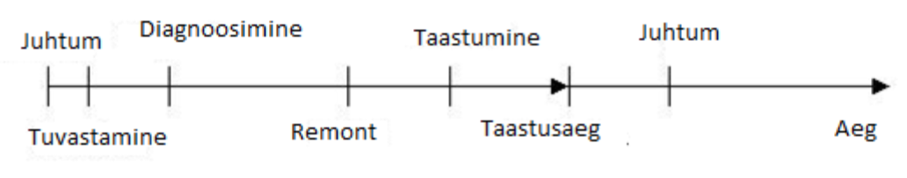
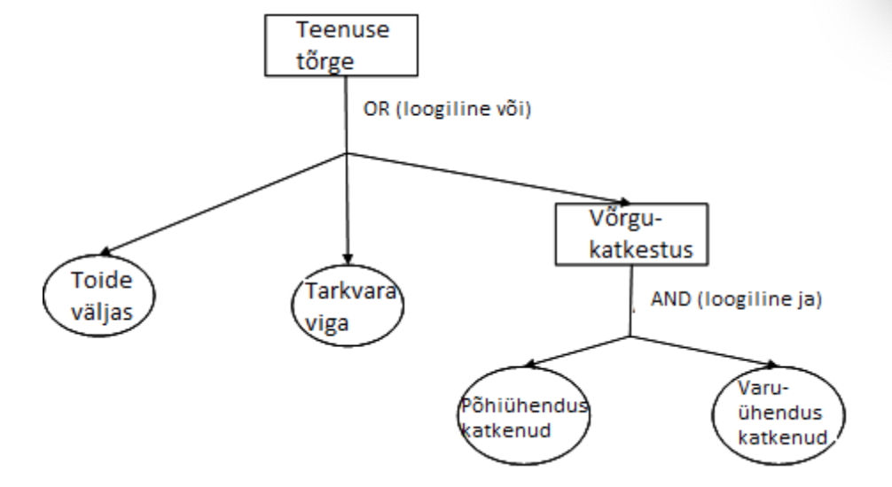

# 7. Teenuste tarne ja tugi

Selle teema materjale läbi töötades õpid:

- Mõistma kliendipõhise IT kasutajatoe tähtsust ja osata kohaldada lihtsamaid IT teenuste osutamise põhimõtteid
- Aru saama konfiguratsiooni- ja muudatusehalduse põhimõtetest ja muudatuste planeerimise vajadusest.

## 7.1 Kliendisuhted ja teenustaseme lepingud

Selle alateema materjale läbi töötades õpid:

- Kirjeldama teenustaseme haldusprotsessi ja selle tulu
- Loetlema ja kirjeldada peamised teenustaseme lepingu **_SLA_** elemendid
- Võrdlema teenustaseme lepingu, partnerlepingu ja käitluslepingu kasutusotstarvet.

### 7.1.1 Teenustaseme haldusprotsess

::: warning

Kirjeldada teenustaseme haldusprotsessi ja selle tulu.

:::

**Teenustaseme haldusprotsess** **_SLM_** / **_Service Level Management_** peab tagama, et organisatsioonile vajalikku IT teenust pakutakse piisavas mahus ning selleks vajalike ressursside **_inimeste, süsteemide_** kasutamine on efektiivne.

IT teenus - IT teenuseosutaja poolt ühele või mitmele kliendile osutatav teenus. IT teenus kasutab infotehnoloogiat ning toetab kliendi äriprotsesse. IT teenuse moodustavad inimeste, protsesside ja tehnoloogia kombinatsioon ning see peab olema kirjeldatud teenustaseme lepingus.

Teenustaseme haldusprotsessi osapooled on:

- **Teenuseosutaja** **_IT Service Provider_** - IT ettevõte, kellel on vastavad teadmised, spetsialistid ja partnerid, et pakkuda IT teenuseid oma sisemistele või välistele klientidele
- **Klient** **_Customer_** – IT teenuse tarbija, kelle põhitegevus ei ole seotud IT teenuste pakkumisega kuid kes vajab IT infrastruktuuri vahendeid oma äritegevuse teostamiseks.

Teenustaseme haldusprotsess sisaldab järgmisi komponente:

- Läbirääkimised
- Defineeringud
- Mõõtmised
- Haldamine
- Kvaliteedi parendused IT teenusele.

Oluline eesmärk on jõuda osapoolte läbirääkimistel arusaamisele, et teenuseosutaja poolt pakutud teenuste kvaliteet ja hind vastavad kliendi ootustele. Pakutud teenus peab olema mõõdetav ja mõõdikud kajastuma ka osapoolte vahelistes lepingutes. Oluline teenustaseme haldusprotsessi eesmärk on teha kliendi ja teenuseosutaja vaheline kommunikatsioon võimalikult lihtsaks, et vajadusel korrigeerida teenuseid ja nendega seotud mõõdikuid.

Teenustaseme haldusprotsessiga seotud peamised dokumendid on:

- IT teenuste kataloog **_Services Catalogue_** – kirjeldab kogu teenuseosutaja tootevalikut koos erinevate teenuse tasemetega, mida suudetakse garanteerida
- Teenustaseme nõuded **_SLR – Service Level Requirements_** – kliendi nõuete kirjeldus, mis tuleneb kliendi ja teenuseosutaja vahelisest koostööst
- Teenustaseme lepingud **_SLA – Service Level Agreements_** – kliendi ja teenuseosutaja vahel sõlmitud lepingud tellitud teenustega ja garanteeritud teenuse tasemega
- Käitluslepped **_OLA - Operational Level Agreement_** – IT teenust pakkuva ettevõtte sisemine täpsustatud leping
- Partnerlepingud **_UC - Underpinning Conracts_** – teenuseosutaja lepingud kolmanda osapoolega teenuste täitmiseks
- Teenuse kvaliteediplaan **_Service Quality Plan_** – plaan tegevustest vastava tasemega teenuse pakkumiseks

Teenustaseme halduse lisaülesanded:

- Monitooring ja aruandlus
- Teenuse täiustamise plaan **_SIP - Service Improvement Plan_** – tegevused, teenuse kvaliteedi parendamiseks
- Kliendisuhete haldus **_CRM - Customer Relationship Management_** – tegevused, mis seotud kliendiga suhtlemisega

### 7.1.2 Teenustaseme lepingu elemendid

::: warning

Loetleda ja kirjeldada peamised teenustaseme lepingu **_SLA_** elemendid nagu teenuste definitsioon, jõudluse mõõtmine., probleemihaldus, intellektuaalne omandiõigus ja konfidentsiaalne info, garantiid ja lepingu lõpetamine.

:::

Teenustaseme haldusprotsessi üks peamisi tegevusi on defineerida teenustaseme lepingu sisu. Selles dokumendis peab olema detailselt kirjas läbirääkimiste käigus väljaselgitatud kliendi poolt nõutud teenused koos garanteeritud teenuse tasemega ja mõõdikutega, mille järgi hinnata nõuete täitmist.

Teenustaseme lepingus kliendi ja teenuseosutaja vahel defineeritud peamised aspektid on:

- Teenuste loetelu, mida klient nõuab teenuseosutajalt
- Hindamismõõdikud iga pakutava teenuse jaoks **_ja soovitatavalt aktsepteeritavad ning mitteaktsepteeritavad teenuse tasemed_**
- Mõlema osapoole kohustused ja vastutus
- Tegevused, mis võetakse ette spetsiifiliste olukordade puhul

Harilikult spetsifitseerib teenustaseme leping järgmist:

- Nõutud teenused
- Lepingu kestus
- Lepingu kehtivustingimused
- Garanteeritud teenuse tase **_näiteks reageerimisaeg tõrke korral või garanteeritud käideldavus perioodi jooksul_**
- Konfidentsiaalsusnõuded, mis seotud kliendi intellektuaalse omandi kaitsega
- Nõutud aruandlusdokumentatsioon ja selle esitamissagedus
- Poolte vastutus
- Teenuse maksumus
- Trahvid teenuse lepingule mittevastava täitmise korral
- Lepingu lõpetamise tingimused

Teenustaseme lepingu koostamise reeglid:

- Leida aeg, et defineerida vastutused ja jõuda üksmeelele vastutuste jaotamisel
- Lepingus pakutavad teenused peavad olema mõõdetavad
- Iga lepingus pakutud teenus peab olema äärmisel täpselt spetsifitseeritud
- Kõik lepingu täitmisega seotud osapooled peavad olema esindatud läbirääkimistel teenustaseme lepingu loomisel
- Lepingu loomise protsess toimub iteratiivselt etappidena. Osapooled loovad lepingu kavandi, mis esitatakse vastavatele töögruppidele muudatuste tegemiseks. Protsess jätkub kuni mõlemad osapooled on tulemusega rahul.

### 7.1.3 Erinevad lepingutüübid

::: warning

Võrrelda teenustaseme lepingu, partnerlepingu ja käitluslepingu kasutusotstarvet.

:::

Kui **teenustaseme leping** on ametlik leping kliendi ja teenuseosutaja vahel, siis **käitluslepe** on tüüpiliselt kasutuses teenuseosutaja IT osakonnas, et teisendada kliendiga kokkulepitud mõõdikud parameetriteks, mida on võimalik lihtsasti hinnata. Käitluslepe on töödokument, milles sisalduvad vajalikud detailid teenustaseme lepingus kirjeldatud teenuste täitmise kohta. Käitluslepe defineerib nõuded **_aja ja ressursi osas_**, mis on seotud IT teenuste arendajatega ja hooldusmeeskonnaga.

Käitlusleppe peamised elemendid on:

- Pakutava teenuse definitsioon ja selle seos vastava allüksusega
- Lepingu osapooled
- Teenindatavate kasutajate hulk
- Ärikahjud teenuse käideldavuse puudumisel
- Kriitilised teenindusperioodid ehk tipptunnid või perioodid kuude lõikes
- Mitteaktiivsusperioodid hoolduseks kui teenuse käideldavus ei ole kriitiline
- Teenuse katkemise vältus, peale mida läheb käiku taasteplaan
- Käideldavuse hindamismeetodid **_mõõdetakse minimaalse nõutud sooritusvõimee järgi ja aja järgi, mil teenus ei olnud aktiivne_**
- Aruandluse graafik

Palju IT teenuse pakkujaid kasutab oma partnereid teenuste osutamisel sõlmides nendega **partnerlepingud**. Need on lepingud, mis sõlmitakse IT ettevõtete vahel ja oma sisult sarnanevad need käitluslepetega. Erinevalt käitluslepetest on partnerlepingud osapooltele ametlikud ja nende kaudu delegeeritakse ka vastutus teatud teenuse täitmise eest alltöövõtjale.

Kogu teenuse pakkumise protsess peab olema monitooritud ja kaetud aruandlusdokumentidega. Teenuse aruanded peavad olema täidetud jooksvalt.

Kliendile tuleb koostada perioodilist aruandlust ja edastada need vastavalt lepingus määratud sagedusele ja enne lepingu ülevaatamist või pikendamist.

Teenuste täitmise jälgimine on võimalik vaid siis kui teenused on mõõdetavad. Seetõttu on eluliselt tähtis määrata spetsiifilised mõõdikud igale teenustaseme lepingus kirjeldatud teenusele ja kirjeldada need mõõdikud ka teenustaseme lepingus.

Peale selle peab teenustaseme leping defineerima garanteeritud teenuse kvaliteedi ja rahalised trahvid, mis tulenevad teenuse garanteeritud taseme mittetäitmisest.

Järgnevalt mõned võimalikud mõõdikud teenuste hindamiseks:

- Teenuse käideldavus perioodi jooksul protsentides
- Teenuseosutaja reageerimisaeg tõrke ilmnemisel
- Teenusega seotud teenindajate hulk
- Spetsiifilised teenused

Teenustaseme lepingu jälgimis- ja aruandlustegevusel on järgmised eesmärgid:

- Kokku leppida ja korraldada nõutud teenuse tase
- Mõõta ja aru anda teenuse tasemest, vajalikest ressurssidest ja teenuse täitmise maksumusest
- Pidevalt parendada pakutavat teenuse taset
- Koordineerida teiste teenuse haldamise protsessidega
- Perioodiliselt vaadata üle teenustaseme leping, et ära hoida lahknevused kliendi muutunud nõuete ja teenuses fikseeritud teenuse taseme vahel
- Teenuse taseme hindamine vastavalt lepingus sätestatud mõõdikutele.

#### 7.1. Kordamisküsimused

::: tip Kordamisküsimused

1. Teenustaseme haldusprotsessi tegevused on?

- Läbirääkimised X
- Teenuste kataloog
- Teenustaseme leping

2. Teenustaseme haldusprotsessi dokument ei ole?

- Teenustaseme leping
- Käitlusleping
- Hooldusleping X

3. Teenustaseme lepingus on fikseeritud?

- Käideldavusnäitajad X
- Muudatuste nõukoja otsused
- Riskianalüüs

4. Partnerleping sõlmitakse?

- Teenustaseme lepingu lisana
- Ettevõtte sisese osakonnaga
- IT teenuse delegeerimiseks välisele partnerile X

:::

## 7.2 Mahu ja talitluspidevuse planeerimine

Selle alateema materjale läbi töötades õpid:

- Kirjeldama mahuhaldust ja selgitada selle alamprotsesse
- Tuvastama mahuplaani otstarve ja peamised elemendid
- Määratlema riski, ohu ja haavatavuse mõisted ja meetmed riskide vähendamiseks
- Määratlema talitluspidevusplaani otstarve ja peamised elemendid.

### 7.2.1 Mahuhaldus

::: warning

Kirjeldada mahuhaldust ja selgitada selle kolem alamprotsessi **_äri, teenus ja komponent_** tähtsust.

:::

**Mahuhalduse** protsessi peaeesmärk on tagada, et IT teenuste ja IT infrastruktuuri mahud oleksid piisavad teenustaseme sihtide saavutamiseks tulusal ja õigeaegsel viisil. Mahuhaldus arvestab kõigi IT teenuste osutamiseks vajalike ressurssidega ja esitab lühi-, kesk- ja pikaajalised ärinõuete plaanid.

Mahuhalduse ülesanded on:

- Jälgida IT teenuste sooritusvõimet ja efektiivsust ning selleks vajalikke infrastruktuuri komponente
- Kasutada olemasolevaid ressursse efektiivselt
- Mõõta äri nõuete täitmiseks olulised ressursid
- Koostada prognoose tulevaste äri nõuete jaoks, et hoida äri toimivana
- Saada kindlus, et pakutud ressursid suudavad garanteerida teenustaseme lepingus defineeritud teenuste kvaliteedi.

Mahuhalduse tegevusi tuleb analüüsida järgmisi seoseid arvestades:

- Arvestada maksumuse seost võimekusega, et tagada olemasolevate ressursside efektiivne kasutus
- Arvestada pakutud teenuse vastavust nõudlusega, et kliendid oleksid rahul ja ressursid vastaksid nõudlusele.

**IT infrastruktuuride teek** **_ITIL - IT Infrastructure Library_** on komplekt praktikatest ja põhimõtetest IT teenuste haldamiseks ja osutamiseks ning on kujunenud IT teenuste osutamise hea tava standardiks.

ITIL mudeli järgi jaguneb mahuhaldus kolmeks alamprotsessiks:

- **Äri mahuhaldus** **_Business Capacity Management_**, mille ülesanne on tagada, et tulevaste IT teenuste maht on õieti planeeritud. See kontrollib olemasolevate ressursside kasutust erinevate IT teenuste poolt, et hinnata trendi ja luua vastavad prognoosid tulevaste nõuete täitmiseks.
- **Teenuse mahuhalduse** **_Service Capacity Management_** eesmärk on kontrollida pakutavate teenuste sooritusvõimet ja mahtu. Mahuplaani jaoks kogutakse, salvestatakse ja analüüsitakse IT teenuste ressursside tarbimise ja kasutusstatistika ajalisi graafikuid.
- **Komponentide mahuhaldus** **_Component Capacity Management_** mis vastutab selle eest, et mõista konfiguratsioonielementide mahtu, kasutatust ja sooritusvõimet. Vastavaid andmeid kogutakse, salvestatakse ja analüüsitakse kasutamiseks mahuplaanis.

### 7.2.2 Mahuplaani elemendid

::: warning

Tuvastada mahuplaani otstarve ja peamised elemendid.

:::

Erinevad mahuhalduse alamprotsessid seavad eesmärgiks täiesti erinevad aspektid.

Äriprotsesside mahuhaldus koondab tähelepanu olemasolevatele ja tulevastele äri vajadustele, teenuse mahuhaldus keskendub olemasolevate teenuste käimashoidmisele ja komponentide mahuhaldus on fokusseerunud tehnoloogiale, mis on kõiki teenuseid toetav infrastruktuur.

Mahuhalduse protsessi poolt läbiviidavad tegevused realiseeritakse jooksvalt, hoolduse käigus ja perioodiliste mahuhaldusinfo andmebaasi ning dokumentide ülevaatamisel.

Info erinevate teenuste sooritusvõimeest kogutakse jälgimistegevuste käigus **mahuhalduse andmebaasi** **_CDB – Capacity Management Database_**. Viimane on keskne infohoidla, mida kasutavad kõik kolm mahuhaldusealamprotsessi oma kogutud andmete talletamiseks. Seda infot kasutatakse mahuhalduse planeerimisel ja prognooside koostamisel jälgitavate teenuste jaoks. Peale selle on andmebaasis info teenuste omavahelistest seostest ja teenuste ning ressursside omavahelistest seostest.

Korrektseks info kogumiseks andmebaasi on vaja jälgitavad subjektid **_teenused ja nendega seotud ressursid_** varustada mõõdikutega.

Teenuste kvaliteeti tuleb mõõta erinevate vaatenurkade alt:

- Äri areng
- Tehnoloogia
- Olemasolevad äri nõuded
- Finantsaspektid.

Iga spetsifitseeritud mõõdiku jaoks peab mahuhalduse protsess defineerima soovitud sihid ja garanteerima nende saavutamise.

Prognoosid ja ressursside kogus, mis on vajalik teenuste käimashoidmiseks ning äri nõuded vormistatakse spetsiifilisse dokumenti, mida nimetatakse **mahuplaaniks.**

Kõik alamprotsessid annavad oma osa selle dokumendi sisu uuendamisse. Mahuplaan on paindlik dokument, mida võidakse regulaarselt muuta ja parandada. Mahuplaani koostamisel on möödapääsmatu võtta aluseks mahuhalduse andmebaas. Peamine mahuplaani koostamise eesmärk on defineerida täpselt kogu IT infrastruktuur, mida on vaja käimas hoida, selleks, et garanteerida lepingutega määratud teenuste tasemed.

Tüüpiline mahuplaan sisaldab järgmist infot:

- Plaani ulatus ehk põhilised IT infrastruktuuri elemendid, mis on seotud planeerimisega
- Kasutatud meetodid – defineerib kuidas ja millal info plaani koostamiseks saadakse
- Äristsenaarium – see kirjeldab kliendi ettevõtte olemasolevat seisu ja võimalikke muutusi tulevikus
- Teenuste aruanne – kokkuvõttev profiil igast kliendile pakutavast teenusest
- Tulevased teenuse tasemed – teenuse kasvuprognoos
- Ressursside aruanne – erinevate teenustega seotud ressursside kasutusmäär
- Tulevane ressursivajadus – ressursid, mis vaja, et täita oodatavaid teenuse tasemeid
- Teenuse parendamise võimalused – tegevused teenuste parendamiseks.

### 7.2.3 Riskihindamismeetodid

::: warning

Määratleda riski, ohu ja haavatavuse mõisted ja tuua näiteid nagu teenuse tõrge, andmete kadu.

:::

Enne riskianalüüsi protsessi kirjeldamist on oluline defineerida sellega seotud terminid:

- **Risk** **_Risk_** – tõenäosuslik sündmus, mis võib põhjustada kahju või mõjutada võimet saavutada eesmärke. Riski mõõdetakse ohu tõenäosuse, varade haavatavusega sellele ohule ja mõjuga, mis riski realiseerumisel tekiks.
- **Oht** **_Threat) – igasugune olukord, sündmus või tegevus, mis võib haavatavuse ära kasutada ja süsteemi kahjustada. Igasugust intsidentide potentsiaalset põhjust tuleb käsitleda ohuna. Näiteks elektrikatkestus on oht, mis võib ära kasutada elektrisüsteemi poolt tekitatud haavatavuse. Iga oht on määratud tasemega, mis näitab võimalikku sündmuse esinemissagedust (statistika baasil_**. Seda taset kasutatakse riskide hindamisel.
- **Haavatavus \*\*\***Vulnerability\*\*\* – nõrkus, mida oht võib ära kasutada. Näiteks avatud tulemüüri port või piisava jahutussüsteemita serveriruum. Puuduv meede kvalifitseeritakse samuti haavatavuseks..
- **Vara \*\*\***Asset\*\*\* – teenuseosutaja varad sisaldavad kõike, mida saab kasutada teenuste osutamiseks nagu juhtimine, organisatsioon, protsess, teadmised, inimesed, informatsioon, rakendused, infrastruktuur ja finantskapital.

Teine faas IT teeninduse mahuhalduse protsessis on aluseks, et defineerida IT **talitluspidevusplaan**. See on plaan, mis kirjeldab ühe või mitme IT teenuse taastamiseks vajalikke samme.

Selles faasis on põhilised tegevused järgmised:

- Hinnatakse ohtude ja haavatavuse taseme järgi **_riskianalüüs_**
- Hinnatakse ja mõõdetakse riskitase **_riskianalüüs_**
- Defineeritakse tegevused riskide vähendamiseks aktsepteeritavale tasemele **_riskihaldus_**.

**Riskianalüüsi** **_Risk analysis) käigus analüüsitakse varade väärtust ärile, tuvastatakse ohud ja hinnatakse varade haavatavust nende ohtude suhtes. Riskianalüüs võib olla kvantitatiivne (andes arvulise tulemuse_** või kvalitatiivne.

Riskianalüüsi käigus arvutatakse riskitasemed järgmiste näitajate alusel:

- Ressursside väärtus
- Erinevate ressursside riskitase arvestades nendega seotud ohtudega
- Ressursside haavatavus

**Riskihaldus** **_Risk Management_** on protsess, mis vastutab riskide määramise, analüüsi ja juhtimise eest. See sisaldab vajalike vastumeetmete tuvastamist, valimist ja kasutuselevõttu vastavalt ressursside tuvastatud riskitasemele ja riskide piiramist aktsepteeritavale tasemele.

### 7.2.4 Riskide vähendamise meetmed

::: warning

Loetleda riskipiiramise abinõude näiteid.

:::

Riskihalduse metoodika tähendab iga riski jaoks mingi valiku tegemist. Valik võib olla üks järgnevatest:

- Riskist hoidumine sellega seotud funktsiooni kasutusest eemaldamisega või nõrga lüli süsteemist kõrvaldamisega
- Riski vähendamine aktsepteeritud tasemele sisaldab sobivate vastumeetmete kasutamist, mis võivad toimida erinevat teed pidi:

  - Kanda risk üle kolmandale osapoolele **_näiteks kindlustuse kasutamine_**
  - Piirata ohu esinemise võimalust
  - Piirata ohu mõju
  - Tuvastada tõrke või ohu esinemissagedus

- Aktsepteerida riski –klient võib otsustada lubada riski kui selle vastumeetmed osutuvad liialt kulukaks.

Ohtude hindamise meetodid sõltuvad kasutuselvõetud metoodikast.

Näiteks CRAMM **_CCTA Risk Analysis and Management Method_** metoodika järgi on ohutasemete väärtused järgmised:

- Väga madal – üks juhtum iga 10 aasta jooksul
- Madal – üks juhtum iga 3 aasta jooksul
- Keskmine – üks juhtum aastas
- Kõrge – üks juhtum 4 kuu jooksul
- Väga kõrge – üks juhtum kuus

Haavatavuse hindamine CRAMM järgi:

- Madal –juhtumi esinemisel on halvima stsenaariumi tõenäosus alla 33%
- Keskmine – juhtumi esinemisel on halvima stsenaariumi tõenäosus vahemikus 33-66%
- Kõrge – halvim stsenaarium juhtub üle 66% tõenäosusega

Ohtude hindamine on seotud riskianalüüsiga, mille käigus ohtude tasemed arvutatakse. Ohud, mida riskianalüüsis arvestada võivad olla näiteks järgmised:

- Loodusõnnetused
- Seadmete või dokumentide vargused
- Elektrikatkestused
- Kliimaseadmete rike
- Riistvara rike
- Riistvara või tarkvara hooldusega seotud inimlik eksimus
- Vandalism

Riskide mõõtmise aluseks on süsteemile tekitatud potentsiaalne kahju ohusündmuse esinemisel.

Rusikareegel riski hindamisel arvestab ohu poolt tekitatavat kahju ja ohu esinemise tõenäosust:

```
R = D × P
```

kus R on risk, D on potentsiaalne kahju ja P on ohu esinemise tõenäosus
Üldine riskihindamise definitsioon infoturbe alal on riski tõenäosus esitatud funktsioonina süsteemi haavatavusest ja ohu tasemest järgmiselt:

```
P = f ***V, T***
```

kus V on haavatavus, T on oht, P on tõenäosus

Juhuslike riskide puhul on riski esinemise tõenäosus funktsioon süsteemi haavatavusest ja tõrkejuhtumi eripärasest tõenäosusest **_näiteks üleujutuse või elektrikatkestuse esinemise tõenäosus_**

```
P = f ***V, p***
```

kus V on haavatavus, p on eripärane tõenäosus

Ohusündmuste tõsidus on tavaliselt väljendatav ka rahalises kahjus. Riski tase, mis võtab arvesse riski seose vastava vara kohta on väljendatav:

```
L=f***V,T,A***
```

kus L on riskitase, V haavatavus, T oht ja A vara väärtus

Kui riski tase on hinnatud on vaja defineerida vastumeetmed ohtudele. Iga vastumeede on spetsiifiline kaitsvale objektile ja sellega seotud ohtudele. Defineeritud vastumeetmed peavad katma kõiki tuvastatud riske. Kui vastumeetmed on tarvitusele võetud tuleb hinnata allesjäänud riskivõimalust. Selle järgi saab teha järeldusi, kas vastumeetmed on piisavad.

Üldine riskianalüüsi ja riskihalduse põhimõte on esitatav lihtsa diagrammiga, kus riskianalüüs ja riskihaldus on kaks erinevat aga seotud tegevust.

![]**_../images/c7_risk.png_**

**Joonis 7-1. Riskianalüüsi ja riskihalduse seosed \***Allikas: Learning Materials for Information Technology Professionals (EUCIP-Mat)**\***

Sellel diagrammil on esitatud riskianalüüsi ja riskihalduse põhielemendid ja nendevahelised seosed.

**Avariijärgne taasteplaan** **_Disaster Recovery Plan) on dokument, mis on sageli kaasatud IT teenuse talitluspidevusplaani (Service Continuity Plan_**. See defineerib protsessid, poliitikad ja protseduurid normaalolukorra taastamiseks piiratud ajaraamides, kriitilised operatsioonid, äritegevuse jätkamiseks peale kahjujuhtumi esinemist. Katkestuse lubatud vältus peab olema valitud vastavalt äri nõuetele.

See plaan pakub välja tehnoloogilised ja organisatoorsed lahendused, mis võimaldavad kriitilistel tegevustel edasi toimida avariiolukorras, kuni tavalise tööolukorra taastumiseni. Plaani tegemise oluline alus on välja valida ja defineerida need protsessid ja teenused, mis peavad olema kaitstud avariijärgses taasteplaanis pakutavate lahendustega.

### 7.2.5 Talitluspidevusplaan

::: warning

Määratleda talitluspidevusplaani ja varutalitluspidevusplaani otstarve ja peamised elemendid nagu rikketaluvus, taaskäivitamise protseduurid, personalitöö, alternatiivsed ressursid, varundus.

:::

Üks peamisi IT teenuse talitluspidevuse halduse eesmärke on ära hoida või minimiseerida kahjud, mida juhuslikud ebasoovitavad sündmused võivad põhjustada ärile.

IT halduses tähendab termin "avarii" igasugust sündmust, mis võib põhjustada katkestuse osutatavale IT teenusele, kahjustades vähem või rohkem äriprotsessi.

**IT talitluspidevusplaan** **_Service Continuity Plan_** defineerib vastumeetmed avariiolukordadega toimetulekuks vastavalt nende kriitilisusele.

**Varutalitluspidevuse plaan** **_Contingency Plan_** on täiendav plaan milles kirjeldatakse vastumeetmed olukordadele kui IT talitluspidevusplaan ebaõnnestub.
IT talitluspidevuse halduse protsessi peamine eesmärk on vähendada miinimumini avariiolukorra poolt tekitatud ärikatkestus.
Protsessi võib jagada nelja faasi:

- Algfaas. Siin defineeritakse talitluspidevuse plaanide kavandid ühe ärikomponendi suhtes. Need kavandid võivad olla sisendiks kogu protsessile.
- Nõuete analüüs ja strateegiate defineerimine. Selles faasis on jõutud kliendi ja teenuseosutaja vahel kokkulepeteni peamiste riskide osas, millele on vaja defineerida vastumeetmed ja sellega seoses ka kulutada raha.
- Rakendamine:

  - Riskipiiramismetoodikate rakendamine

  - Talitluspidevus- ja varutalitluspidevusplaani vormistamine

  - Taastusmeetodite ja protseduuride väljatöötamine

  - Plaanide testimine

- Talitluspidevusplaani hooldus ja perioodiline ülevaatus, mille käigus hinnatakse IT teenuste talitluspidevusplaani vastavust äri arengule.

### 7.2. Kordamisküsimused

::: tip Kordamisküsimused

1. Mahuhalduse eesmärk on?

- Hinnata riske
- Hinnata sooritusvõimet X
- Tagada serveris piisavalt vaba massmäluseadme salvestusruumi

2. Kõik mahuhaldusega seotud tegevused peavad alati olema üle vaadatud, et leida tasakaal:

- Hinna ja mahu vahel
- Pakkumise ja nõudluse vahel X
- Äri ja nõudluse vahel

3. Talitluspidevusplaani peamine eesmärk on?

- Ärikahju vähendamine miinimumini X
- Tõrkeolukordade ärahoidmine
- Tõrkeolukordade lahendamine

4. Riski kalkuleerimise rusikareegel on **_R=risk;D=kahju;P=ohu esinemise tõenäosus_**:

- `R = D + P`
- `R = D / P`
- `R = D × P` X

:::

## 7.3 Käideldavushaldus

Selle alateema materjale läbi töötades õpid:

- Määratlema käideldavushalduse otstarve ja defineerida sellega seotud mõisted ning käideldavusmõõdikud
- Määratlema käideldavushalduse meetodid ja tehnikad.

### 7.3.1 Käideldavushalduse mõisted

::: warning

Määratleda käideldavushalduse otstarve ja defineerida mõisted: käideldavus, töökindlus, tõrge, taastumine.

:::

Teenused, mis peavad pidevalt toimima on muutunud tavaliseks IT keskkondades. Ajutine teenuse maasolek võib põhjustada väga halba mõju ettevõtte klientide rahulolule ja kogu ettevõtte mainele. Kuna äriprotsesside komponendid on tihedalt läbipõimunud IT komponentidega on oluline et käideldavushalduse protsess arvestab ärile iseloomulike nõuetega.

**Käideldavuse halduse protsess** **_Availability Management Process_** vastutab teenuse osutamise alas teenuste käideldavuse halduse eest eesmärgiga garanteerida käideldavuse taseme säilimine, mis rahuldab ärivajadusi.

Käideldavuse halduse protsessiga seotud terminid:

- **Käideldavus** **_Availability_** – IT komponendi võime täita nõutud funktsionaalsust etteantud ajavahemikus. Käideldavuse määravad töökindlus, hooldatavus, teenindatavus, sooritusvõime ja turvalisus. Tavaliselt väljendatakse käideldavust protsendina. Arvutus põhineb kokkulepitud teenusajal ja maasolekul. Parim praktika soovitab arvutada käideldavust lähtudes IT teenuse ärilisest väljundist.
- **Töökindlus** **_Reliability_** – mõõt iseloomustamaks, kui kaua võib konfiguratsioonielement või IT teenus täita ettenähtud funktsioone ilma katkestuseta. Selleks mõõduks on enamasti MTBF (Mean Time Between Failure) või MTBSI (Mean Time Between Service Incidents\_\*\*. Terminit töökindlus saab kasutada ka iseloomustamiseks tõenäosust, et protsess, funktsioon, jne suudab tarnida nõutava tulemuse.
- **Tõrge** **_Failure_** - kaotatud võime toimida vastavalt spetsifikatsioonile või tarnida nõutavat tulemit. Terminit tõrge võib kasutada IT teenuste, protsesside, tegevuste, konfiguratsioonielementide, jms kohta. Sageli põhjustab tõrge intsidendi, mis takistab teenuse nõuetele vastavat toimimist.
- **Taastatavus** **_Recoverability_** – teenuse võime taastuda tõrkeolukorrast kiirelt ja korrektselt

Taastatavuse omadust iseloomustavad järgmised parameetrid:

- **Hooldatavus** **_Maintainability_** - mõõt, mis näitab, kui kiiresti ja efektiivselt on võimalik tõrke järel konfiguratsioonielemendi või IT teenuse töövõime taastada. Hooldatavust mõõdetakse ja raporteeritakse tihti näitajaga **_MTRS_** / **_Mean Time to Restore Service_**. Hooldatavust kasutatakse ka tarkvara või IT teenuse arenduse kontekstis, et iseloomustada selle omadust olla kergesti muudetav või parandatav.
- **Vastupanuvõime** **_Resilience_** - konfiguratsioonielemendi või IT teenuse võime panna vastu tõrgete tekkele või taastuda kiiresti tõrke ilmnemist.
- **Teenindatavus** **_Serviceability_** - tarnija, kui kolmanda poole võime täita lepingut. See leping sisaldab konfiguratsioonielemendi töökindluse, hooldatavuse või käideldavuse kokku lepitud tasemeid.

Ülejäänud mõisted seoses käideldavuse haldusega:

- **Turvalisus** **_Security_** – rakendatavad halduspoliitikad, et tagada teatud spetsiifiliste teenuste hoolduseks turvaparameetrid
- **Elutähtis ärifunktsioon** **_VBF – Vital Business Function_** - äriprotsessi funktsioon, mis on äri edukuse suhtes otsustav. Elutähtsad ärifunktsioonid on olulised ärijätkuvuse halduse, IT teenuste talitluspidevuse halduse ja käideldavushalduse seisukohast.

### 7.3.2 Käideldavuse mõõdikud

::: warning

Võrrelda üldkasutatavaid käideldavusmõõdikuid nagu käideldavusprotsent, tõrkesagedus, keskmine tõrketa tööaeg, tõrke mõju.

:::

Intsidentide elutsükli saab jagada erinevateks faasideks:

- Intsidendi toimumisaeg **_Incident Occurrence_** on aeg kui kasutajal ilmneb probleem
- Tuvastamine **_Detection_** – aeg, mil IT osakonda informeeritakse intsidendist
- Diagnoos **_Diagnosis_** – intsidendi põhjuse tuvastamise aeg
- Remont **_Repairing_** – aeg kui võetakse tarvitusele vastumeetmed probleemi lahendamiseks
- Taastumine **_Recovery_** – aeg kui probleemiga seotud teenused on täielikult taastunud.



_Joonis 7-2. Intsidendi elutsükkel ajateljel (Allikas: Learning Materials for Information Technology Professionals (EUCIP-Mat))_

Vastavalt eelpoolloetletud sündmuste järgnevusele on kasutusel järgmised mõõdikud käideldavuse taseme hindamiseks:

- Keskmine parandusaeg **_MTTR_** / **_Mean Time to Repair_** - keskmine ajavahemik, mis kulub konfiguratsioonielemendi või IT teenuse parandamiseks peale tõrget ehk keskmine aeg ajavahemik IT osakonna teavitamisest kuni teenuse taastumiseni.
- Keskmine tõrketa tööaeg **_MTBF_** / **_Mean Time Bewteen Failure_** - töökindluse mõõdik. MTBF on keskmine ajavahemik, millal konfiguratsioonielement või IT teenus toimivad ilma katkestuseta. Seda mõõdetakse IT teenuse taastumise momendist kuni järgmise tõrke tuvastamiseni.
- Keskmine intsidentide vaheline aeg **_MTBSI_** / **_Mean Time Between System Incident_** - töökindluse mõõdik. MTBSI on keskmine ajavahemik süsteemi või IT teenuse ühe tõrke algusest kuni järgmise tõrke alguseni.

  ```
  MTBSI = MTBF + MTTR
  ```

- Käideldavuse protsent **_Availability percentage_** – mõõdab käideldavust protsentides vastavalt valemile:

  ```
  käideldavus = ((AST – DT) / AST) × 100
  ```

  kus `AST` / **_Agreed Service Time_** on kokkulepitud teenusaeg ja `DT` **_Downtime_** on maasolekuaeg

- Mittekäideldavuse protsent **_Unavailability percentage_** – vastand käideldavuse protsendile
- Kestus **_Duration_** – käideldavuse protsendi ajaline väljendus
- Tõrkesagedus **_Frequency of Failure_** – keskmine tõrkesagedus
- Tõrkemõju **_Impact of Failure_** – tõrke poolt põhjustatud kahju hinnang äri perspektiivis

### C.7.3.3 Käideldavushalduse meetodid ja tehnikad

::: warning

Määratleda käideldavushalduse meetodid ja tehnikad nagu komponendi tõrke mõju analüüs, vigade puu analüüs.

:::

Käideldavushalduse protsessi väljatöötamiseks on erinevaid metodoloogiaid:

- **Komponendi tõrke mõju analüüs** **_CFIA – Component Failure Impact Analysis_** - tehnika, mis aitab määrata komponendi tõrke puhul selle mõju IT teenustele. Koostatakse mõjude maatriks, mille ühel küljel on IT teenused ja teisel komponendid. See võimaldab tuvastada kriitilised komponendid (mille tõrge mõjub mitmele IT teenusele.
- **Riskihalduse metoodika vahend** **_CRAMM – CCTA Risk Analysis and Management Method_**, http://www.cramm.com
- **Vigade puu analüüs** **_FTA – Fault Tree Analysis_** - tehnika mida kasutatakse probleemini viiva sündmuste ahela koostamiseks.

**Komponendi tõrke mõju analüüs** – selle metoodika abil saab tuletada info, mille alusel toimib IT teenuse talitluspidevuse haldusprotsess. Analüüsi tulemusena saadakse teada üksteisest sõltuvad IT teenused ja komponendid, mille alusel tuvastatakse:

- Kriitilised teenused **_Critical services_**, mille toimimine sõltub mitmetest komponentidest
- Üksainus tõrkeallikas **_SPOF – Single Point of Failure_** - konfiguratsioonielement, mille tõrge tekitab kohe intsidendi ja mille puhul vastumeetmeid pole veel rakendatud. SPOF võib olla isik, protsessi või tegevuse samm või IT infrastruktuuri komponent.
- Teenused, mille jaoks on defineeritud efektiivne taastumine tõrkeolukorrast.

Vigade puu analüüs – võimaldab luua sündmuste ahela, mis põhjustab IT teenuse tõrke. Ahela loomiseks ühendatakse graafiliselt ja loogiliselt erinevate süsteemikomponentide tõrked.

Allpool on toodud lihtne vigade puu analüüsi mudel, kus puu juur vastab IT teenuse tõrkele ja oksad kujutavad kombineeritud sündmusi, mis esindavad tõrke põhjust:



_Joonis 7-3. Vigade puu mudel (Allikas: Learning Materials for Information Technology Professionals (EUCIP-Mat))_

Sündmused, mida vigade puu analüüs katab on järgmised:

- Baas-sündmus **_Base event_** – ühe IT infrastruktuuri komponendi tõrge (kas riistvara tõrge või inimlik eksimus\_\*\*.
- Summaarne sündmus **_Resulting event_** – üks vahepealne oks vigade puus, mis vastab sõndmuste kombinatsiooni tulemusele
- Tingimuslik sündmus **_Conditional event_** – ainult teatud tingimustel toimuv sündmus (näiteks kliimaseadme rike võib põhjustada teenuse tõrke kui ruumi temperatuur seetõttu ületab lubatud piiri
- Päästik-sündmus **_Trigger event_** – sündmus, mis põhjustab ühe või enam muud sündmust.

Sündmused vigade puus kombineeritakse loogikaoperatsioonidega:

- `AND` – loogiline ja, mille puhul summaarne sündmus esineb vaid siis kui kõik sisendväärtused on tõesed
- `OR` – loogiline või, mille puhul summaarne sündmus esineb kui üks baas-sündmustest on tõene
- `XOR` **_Exclusive OR_** – loogiline välistav või, mille puhul summaarne sündmus ilmneb kui üks sisenditest on tõene
- Tõke **_Inhibition_** – sündmus toimub kui sisendid ei ole tõesed

Vigade puu analüüs on toetav instrument käideldavuse planeerimisel ja parenduste tegemisel käideldavushalduse protsessile.

### 7.3 Kordamisküsimused

::: tip Kordamisküsimused

1. Milline kombinatsioon järgnevatest on käideldavuse mõõdikud?

- A. Maasoleku protsent
- B. Tõrke esinemise sagedus
- C. Tõrke mõju
- D. Juhtumite arv aastas

- A, C, D X
- B, D
- B, C
- A,B,C

5. Mida saab mõõta MTBF abil?

- Kõvaketta vea esinemise keskmist sagedust X
- Keskmist tõrkeolukorra kestust
- Keskmist tõrkeolukorra taastamise aega

6. Käideldavushalduse analüüsi tööriist on?

- Komponendi tõrke mõju analüüs X
- Komponendi testimisrakendus
- MTTR

7. Miks ei ole reeglina mõistlik tagada teenuse käideldavus 100% perioodi jooksul?

- Hoolduse tegemise vajadus
- Suured kulud X
- Elektrikatkestused ei võimalda seda teha

:::

## 7.4 Kasutajatugi

Selle alateema materjale läbi töötades õpid:

- Määratlema kasutajatoe otstarve tugiteenuseid pakkuvas ettevõttes
- Tuvastama erinevad kasutajatoe tüübid
- Defineerima intsidendihalduse süsteemi peamised komponendid.

### 4.4.1 Kasutajatoe eesmärk

::: warning

Määratleda kasutajatoe otstarve tugiteenuseid pakkuvas ettevõttes.

:::

Erinevalt teenuse tarne ja teenuse toe protsessidest ei ole **kasutajatugi** **_Service Desk_** defineeritud protsessina, vaid tegemist on funktsiooniga, mis on elulise tähtsusega teenuse halduse protsessi jaoks. Kasutajatugi on üksainus kontaktpunkt teenuseosutaja ja kasutajate vahel. Tüüpiline kasutajatugi haldab intsidente ja kasutaja pöördumisi ja tema ülesandeks on ka igasugune suhtlemine kasutajatega. Kasutades kasutajatoe poolt pakutud funktsioone võivad kasutajad saada ühendust teenuseosutajaga, näiteks teatada tõrkejuhtumist, nõuda muudatust mingile teenusele või saada abi teenuste kasutamiseks.

Kasutajatoe rakendamise eelised:

- Üks kontakt kliendile probleemide lahendamiseks ja edasi suunamiseks
- Võimaldab eristada teeninduse tasemed **_klienditugi, spetsialist, ekspert_**
- Juhtumite tsentraalne arhiiv ja haldus
- Kulude kokkuhoid teenuseosutajale

Kasutajatoe eesmärgid:

- Tagada kahesuunaline ühendus süsteemi ja kasutajate vahel (ühelt poolt abi ja treening, soovituste andmebaas, teiselt poolt nõuete ja kaebuste vastuvõtmine), et optimeerida kogu IT infrastruktuuri.
- Võimaldada arvutikasutajatel töötada maksimaalse efektiivsusega, lahendades kiirelt iga kahtluse, mis tavakasutajast klient võib esitada. Teine eesmärk on koguda kokku kõik soovitused teenuse parendamiseks.
- Pakkuda operatiivset tehnilist tuge teistele protsessidele teenuse toetuse alal (muutuste haldus ja käideldavushaldus protsessid) ja anomaaliate korrigeerimiseks ning tõrkejuhtumite taastamistegevusteks.

Kui reaktiivne kasutajatugi vaid lahendab probleeme siis proaktiivne lähenemine on kasutajatoe kogutud info põhjal järelduste tegemine, planeerimine ja koostöö, mis aitab lahendada probleemide algpõhjuseid, koordineerida muudatuste sisseviimist ja võita klientide usaldust. Kaasaegsed kasutajatoe teenused on rajatud proaktiivse lähenemise baasil.

### 7.4.2 Erinevad kasutajatoe liigid

::: warning

Tuvastada erinevad kasutajatoe tüübid ja nende rakendamise sobivus vastavalt erinevatele asjaoludele.

:::

Kasutajatoe funktsiooni õige rakendamine on teenuseosutamise edu aluseks ning see tuleb luua ametliku äri parendamise projektina, millel on selgelt defineeritud vastutused, omanik ja ärieesmärgid.

Võimalikud kasutajatoe mudelid:

- Lokaalne kasutajatugi **_Local Service Desk_** – üks kasutajatugi iga kliendi ettevõtte füüsilise asukoha kohta. Sellisel juhul on kasutatavate protseduuride standardiseerimine ja teadmiste jagamine fundamentaalse tähtsusega.
- Keskne kasutajatugi **_Central Service Desk_** – kõik pöördumised kasutajatoe poole registreeritakse kesksest füüsilisest asukohast. Sellise mudeli puhul on käitluskulud kontrolli all ja ressursside haldamine optimaalne.
- Virtuaalne kasutajatugi **_Virtual Service Desk_** – üks tehnilise toe keskus, millele pääsevad juurde kõik lokaalsed kasutajatoed. See lahendus leiab rakendust ettevõtetel, mille kontorid asuvad erinevates maades.

Kasutajatoe sooritusvõime ja efektiivsuse hindamiseks tuleb defineerida mõõdikud, mis aitavad täpsustada kasutajatoe peamisi eesmärke.

Korrektse kasutajatoe disainimisel tuleb arvestada järgmiste põhitõdedega:

- Kokku võtta ja defineerida ärieesmärgid
- Leida ressursid ja finantsid
- Defineerida tööprotseduurid
- Konsulteerida kliendiga ja lõppkasutajatega kasutajatoe funktsioonide defineerimisel
- Defineerida mõõdikud kasutajatoe hindamiseks
- Koolitada kliendid ja lõppkasutajad uut teenust kasutama ja mõistma selle tulu.

Tänapäeval on erinevaid tehnoloogiaid, mida rakendatakse kasutajatoe loomisel:

- Erinevad elektroonilise side kanalid: e-post, kiirsuhtlus, veebipäringud, internetifoorumid, **_VoIP_** telefonikõned, videokõned, jne.
- Veebipõhised rakendused probleemilahenduste ja utiliitide, diagnostikatööriistade või draiverite otsimiseks
- Kaugabi tööriistad, mis võimaldavad klienditoe esindajal võtta üle kontroll kliendi arvutis ja aidata probleemi lahendada või õpetada kasutama mingit teenust. Sellised tööriistad võivad olla riistvarapõhised näiteks Intel’i vPro või tarkvaralised, mis omakorda jagunevad eraldi tööriistadeks, mis võivad olla integreeritud operatsioonisüsteemi (näiteks Windows 7 kaugabi funktsioon) või olla saadaval ka eraldi haldustarkvaradena (näiteks Siteremote või TeamViewer).
- Operatsioonisüsteemipõhised utiliidid probleemi kohta info kogumiseks näiteks **_Problem Step Recorder_**, crash dump, sündmuste logid, mida saab kasutajatoele edastada probleemi olemuse selgitamiseks.

Iseteeninduslike kasutajatoe keskkondade puhul on olulised järgmised faktorid:

- Klienti toetavate abiprotsesside kaasatus, mis abistavad probleemi defineerimisel
- Kommunikatsioon vastuseks kliendi päringule mille järgi on aru saada, et tema probleem on lahendamisele jõudnud ja lahenduse staatuse jälgimisvõimalus
- Lihtne kasutajaliides.

Kasutajatoe ülesannete ja vastutuse määr on enamasti selgelt defineeritud ja intsidendid, mida ei suudeta kiirelt lahendada, suunatakse edasi tehnilise toe meeskonnale lahendada, kes omakorda on vastutav juhtumi lahendamise eest ja tulemuse edastamise eest kasutajatoele. Kasutajatugi vastutab klientide probleemilahenduse käiguga kursishoidmise eest ja vahendab kliendi ning tehnilise toe meeskonna suhtlust.

Kasutajatoe funktsioonide hulka kuuluvad:

- Kõnedele vastamine
- Juhtumite salvestamine ja jälgimine
- Probleemituvastusele kaasaaitamine
- Klientide informeerimine juhtumi staatusest ja arenemisest
- Esimese hinnangu andmine probleemile, püüda leida lahendus ja vajadusel edastama probleemi tehnilisele osakonnale
- Hallata päringute elutsüklit
- Teise ja kolmanda astme tehnilise osakonnaga suhtlemine probleemi lahendamiseks
- Jagada haldusinfot ja soovitusi teenuste parendamiseks
- Klientide koolitusvajaduste kohta märkuste tegemine
- Klientidele probleemilahenduste edastamine ja juhtumite sulgemine

### 7.4.3 Kasutajatoe elemendid

::: warning

Defineerida intsidendihalduse süsteemi peamised komponendid.

:::

Kasutajatoe poolt kogutud info intsidentidest on kasutatav, et hinnata kogu IT infrastruktuuri kvaliteeti ja käideldavuse taset. Selle info analüüs on väga kasulik teistele teenuse haldusprotsessidele nagu käideldavuse haldus, teenustaseme haldus ja äri talitluspidevuse haldus protsess ning kõigile protsessidele, mis toimivad teenuste tehnilise toe valdkonnas. Näiteks kui mingi probleem juhtub korduvalt võib olla vajalik uuendada või muuta sellega seotud komponente. Muudatused viib läbi muutuste haldamise protsess.

Kogutud info on kasulik ka kasutajatoele, et planeerida proaktiivseid lahendusi probleemidele.

Tegevused, mis viiakse läbi kasutajatoe poolt probleemide lahendamiseks ja kasutajatega suhtlemiseks on kokku intsidendihaldus **_Incident Management_**. See on protsess, mis vastutab intsidentide kogu elutsükli haldamise eest. Intsidendihalduse esmane eesmärk on taastada IT teenus kasutajatele nii kiiresti kui võimalik.

Intsident on IT teenuse planeerimata katkemine või kvaliteedi langus. Näiteks tarkvara viga, riistvara tõrge, inimlik eksimus. Konfiguratsioonielemendi tõrge, mis pole veel teenusele mõju avaldanud, on samuti intsident. Näiteks ühe kõvaketta tõrge kettamassiivis.

Riistvara või tarkvara uuendamisnõue ei kvalifitseeru intsidendiks ja seda käsitleb muutuste halduse protsess.

Intsidendi staatus on tema hetkepositsioon oma elutsüklis intsidendihalduse protsessis.
Mõned näited statuse kategooriatest:

- Uus **_New_** – kohe peale juhtumi algatamist
- Aktsepteeritud **_Accepted_**
- Täitmisele määramise järjekorras **_Waiting for assignment_**
- Täitmisele määratud **_Assigned to specialist_**
- Täitmisel **_WIP – Work in Progress_**
- Täidetud **_Solved_**
- Suletud **_Closed_**

Oluline on klientide informeerimine juhtumi progressist. Selle eest on vastutav kasutajatugi.

Kui klient on saatnud päringu kasutajatoele võtab viimane ette järgmised tegevused:

- Info salvestamine (kuupäev, aeg, kasutaja, jne.)
- Kui tegemist on muudatusettepanekuga lähtud kasutajatugi selle edastamisel vastavatest ettevõtte protseduuridest
- Kui tegemist on intsidendiga kogub kasutajatugi ja salvestab info intsidendist ja selle põhjustest
- Intsidendile määratakse prioriteet. See sõltub intsidendi mõjust ärile ja teenuse taastamise pakilisusest
- Kasutajatugi otsib lahendus enda eelmiste intsidentide kohta kogutud infobaasist
- Kui lahendus leiti siis see rakendatakse ja intsident suletakse
- Kui lahendus puudub edastatakse intsident tehnilisele meeskonnale. Kui viimane lahendab probleemi salvestab kasutajatugi lahenduse enda infobaasi
- Kasutajatugi informeerib klienti intsidendi sulgemisest.

Peamised tulud, mida annab intsidendihaldus on järgmised:

- Ärile tervikuna:

  - Vähendatud intsidendi mõju kiire reageerimisega ja sellest tulenev efektiivsus

  - Proaktiivne kasulike süsteemitäiustuste tuvastamine

  - Ärile suunatud haldusinfo kättesaadavus teenustaseme lepingute jaoks

- IT organisatsioonile:

  - Parandatud jälgimine, mis võimaldab paremini mõõta teenustaseme lepingutes lubatud sooritusvõimet

  - Parandatud haldusinfo teenuste kvaliteedi vaatepunktist

  - Parem meeskonna kasutatus, mis viib suurema efektiivsuse saavutamiseni

  - Kadunud või ebakorrektsete intsidentide ja teeninduspäringute puudumine

  - Täpsem info konfiguratsioonihalduse andmebaasis **_CMDB_** / **_Configuration Management Database_**

  - Parandatud lõpptarbijate ja klientide rahulolu

Mõned ITIL’i juhtnöörid intsidendihalduseks:

- Ära planeeri kasutada intsidendihaldust isolatsioonis. Kui võimalik laienda planeerimisulatus kaasates teiste tehniliste protsesside rakendamise, integreerimise ja käitluse. Kui kõiki teenuse toe protsesse ei saa ressursipuudusel korraga rakendada alusta kasutajatoe funktsioonist koos intsidendihaldusega.
- Planeeri andmebaasi loomine, kus sisaldub info intsidentidest.
- Planeeri kommunikatsioon kasutajatoe ja tehnilise meeskonna vahel, et kasutajatugi oskaks ära tunda teada probleem ja neid kiirelt lahendada.

### 7.4 Kordamisküsimused

::: tip Kordamisküsimused

1. Millised kombinatsioonid järgmistest on kasutajatoe eesmärgid?

- A. Garanteerida vastastikune kommunikatsioon süsteemi ja kasutajate vahel
- B. Võimaldada kasutajatoe operaatoritel töötada maksimaalse efektiivsusega
- C. Pakkuda tugiinfot teistele teenuse toe protsessidele
- D. Kontrollida süsteemi toimimist peale konfiguratsioonimuudatuste sisseviimist

- A, B
- A,C,D
- Kõik
- A,B,C X

Kasutajatoe erinevad liigid on:

- Globaalne, lokaalne, keskne
- Lokaalne, virtuaalne, keskne X
- Keskne, globaalne, virtuaalne

Intsidendihaldus on:

- Tegevused, mis seotud seadme remontimisega
- Tegevused, mis seotud juhtumi ennetamisega
- Tegevused, mis viiakse läbi kasutajatoe poolt juhtumite lahendamiseks X

:::

## 7.5 Muutuste haldamine

Selle alateema materjale läbi töötades õpid:

- Kirjeldama IT infrastruktuuri konfiguratsiooni-, muudatuse- ja versioonihalduse parimad praktikad
- Defineerima muudatuse taotluse otstarve ja selle peamised elemendid.

### 7.5.1 Konfiguratsioonihalduse praktikad

::: warning

Kirjeldada IT infrastruktuuri konfiguratsioonihalduse parimad praktikad.

:::

**Konfiguratsioonihaldus** **_Configuration Management_** on protsess, mis vastutab IT teenuse osutamiseks vajalike konfiguratsioonielementide ja nende seoste haldamise eest. Seda infot hallatakse läbi konfiguratsioonielementide kogu elutsükli. Konfiguratsioonihaldus on osa laiemast teenuse, vara- ja konfiguratsioonihalduse protsessist.

**Konfiguratsioonielement** **_CI_** / **_Configuration Item_** on igasugune komponent, mida on IT teenuse osutamiseks vaja hallata. Iga konfiguratsioonielemendi kohta on info talletatud konfiguratsioonikirjesse (mis paikneb konfiguratsioonihalduse süsteemis) ja konfiguratsioonielemente haldab läbi kogu elutsükli konfiguratsioonihaldus.

Konfiguratsioonielementideks on tavaliselt IT teenused, riistvara, tarkvara, ehitused, inimesed ja ametlik dokumentatsioon.

Põhilised konfiguratsioonihalduse tegevused on:

- Info kogumine iga konfiguratsioonielemendi kohta
- Erinevate konfiguratsioonielementide vaheliste seoste analüüsimine ja defineerimine
- Info talletamine spetsiaalses konfiguratsioonihalduse andmebaasis **_CMDB_** / **_Configuration Management Database_**, kus hoitakse konfiguratsiooni kirjeid läbi kogu nende elutsükli.
- Süsteemi terviklikkuse kontroll peale iga konfiguratsioonimuudatust
- Pidev IT infrastruktuuri analüüs ja jälgimine

Konfiguratsioonihalduse protsess annab IT infrastruktuuri ja teenuste loogilise mudeli. See tuvastab, jälgib, hooldab ja kontrollib erinevate konfiguratsioonielementide arengut infrastruktuuris.

Selle protsessi eesmärgid on:

- Saada toetavat infot IT organisatsioonile
- Defineerida ja dokumenteerida protseduurid, et hallata konfiguratsioonielemente
- Saada liides teiste haldusprotsesside jaoks, mis saavad selle kaudu infot kõigi konfiguratsioonielementide kohta
- Saavutada kõigi konfiguratsioonielementide kohene aruandlus
- Kontrollida, et infrastruktuur sisaldab ainult autoriseeritud konfiguratsioonielemente
- Kontrollida ja garanteerida konfiguratsioonihalduse andmebaasi terviklikkus

Konfiguratsioonihalduse protsess on sageli toetatud teise protsessi poolt, mida nimetatakse **versioonihalduseks** **_Release Management Process_**. Viimansega on seotud tegevused, mis kontrollivad versioonide arendamise ja haldamisega seotud tegevusi eesmärgiga kaitsta IT-keskkonda ja IT-teenuseid. Peamised tegevused on versioonide planeerimise, installeerimise ja testimise korraldamine ning koopiate haldamine. See protsess on vastutav kõigi lepinguliste ja juriidiliste kohustuste eest, mis on seotud IT infrastruktuuris aktiivselt kasutusel olevate riistvara- ja tarkvarakomponentidega. Selleks, et turvata tarkvarade originaalkoopiaid, säilitatakse need kaitstud alas, mida nimetatakse tarkvara püsikoguks (DSL - Definitive Software Library). See on andmestu, milles säilitatakse ja kaitstakse tarkvaraliste konfiguratsioonielementide lõplikke, kinnitatud versioone.

Tarkvara püsikogu on füüsiline andmestu või säilituskeskkond, kuhu on paigutatud tarkvara originaalversioonid. Tegelikkuses võib tarkvara püsikogu koosneda ühest või enamast tarkvara-andmestust või failihoidlast. Kohustuslik on eraldada lõplikud versioonid arendus- ning testfailidest, mida võib samuti tarkvara püsikogus hoida. Tarkvara püsikogusse lubatakse paigaldada vaid kinnitatud (autoriseeritud) tarkvara, seda reguleerivad muudatuste halduse ning versioonide halduse protseduurid.

Analoogselt tarkvara püsikogule hoitakse riistvara varuosad eraldi turvatud asukohas, mida nimetatakse riistvara laoks **_DHS_** / **_Definitive Hardware Store_**.

### 7.5.2 IT muutuste halduse praktikad

::: warning

Kirjeldada IT muudatusehalduse ja versioonihalduse parimad praktikad.

:::

IT keskkonnas, kus toimub tehnoloogia kiire areng, mille baasil pakutakse teenuseid, mis omakorda toetavad ärivajadusi, on vajadus ka pidevateks muudatusteks IT infrastruktuuris.

Peale selle on enamus intsidentidega seotud probleemilahendusi seotud mingi tõrkuva konfiguratsioonielemendi vahetusega. Iga muudatus, mis rakendatakse IT infrastruktuuris kätkeb endas riski kogu süsteemile. Kõik need faktorid loovad vajaduse planeerida selleks tarbeks eraldi protsess, muudatustehaldus, mis vastutab muutuste haldamise eest IT infrastruktuuris. On eriliselt tähtis, et muudatustehaldus oleks läbipaistev ja omaks avatud kommunikatsioonikanaleid, et tagada sujuv üleminek kui muutus aset leiab.

**Muudatusehaldus** **_Change Management_** on protsess, mis juhib kõigi muudatuste tervet elutsüklit. Muudatusehalduse esmane eesmärk on võimaldada läbi viia kasulikke muudatusi minimiseerides sealjuures võimalikke IT teenuste katkestusi.

IT kontekstis võib muudatuse põhjus olla erinev:

- Probleemi lahendamine
- Uus kasutuselevõetud IT teenus
- Teenuste optimeerimine
- Maksumuse vähendamine

Muudatused, mida haldab muudatustehaldus võivad olla seotud kõigi IT infrastruktuuri komponentidega:

- Riistvara
- Ühendusseadmed
- Võrguseadmed
- Tarkvararakendused
- Süsteemitarkvara
- Toetavad protseduurid ja dokumentatsioon

Märkusena, et rakenduste arendamine ei ole osa muudatustehaldusest. Rakendusi hallatakse projektihalduse protsessiga **_Project Management Process_**.

Äri kontekstis, mida toetab IT infrastruktuur, annavad põhjuse eraldi protsessi loomiseks muudatustehalduse tarbeks, järgmised tegurid:

- Vajadus analüüsida ja prognoosida IT muudatuste mõju ärile ja äri muutuste mõju IT infrastruktuuri komponentidele.
- On vajadus välja tuua probleemid, mis põhjustavad suurimaid muudatusi
- Loomulik äri areng ja uute nõuete esilekerkimine põhjustavad muudatusi IT infrastruktuuris. Sellised muudatused on vaja analüüsida ja ette planeerida kui võimalik.

Muudatuste haldusega seotud terminoloogia ITIL’i baasil:

- **Muudatus** **_Change_** - igasugune lisamine, modifitseerimine või eemaldamine, mis võib IT teenust mõjutada. Muudatuse alla käivad IT teenused, konfiguratsioonielemendid, protsessid, dokumentatsioon jne.
- **Muudatuste nõukoda** **_CAB_** / **_Change Advisory Board_** - inimeste grupp, kes aitab muudatuste halduril muudatusi hinnata, määrata prioriteet ja ajatada. See nõukoda koostatakse tavaliselt IT teenuseosutaja erinevate valdkondade, äripoole ja kolmandate isikute nagu tarnijate esindajatest.
- **Muudatuse taotlus** **_RFC_** / **_Request for Change_** - ametlik ettepanek teha muudatus. RFC sisaldab soovitava muudatuse üksikasju ja võib olla paberil või elektrooniline. Mõistet RFC kasutatakse tihti ekslikult muudatuse kirje või muudatuse enda asemel.
- **Muudatuste ajakava** **_Change Schedule_** - dokument, mis sisaldab kinnitatud muudatusi ja nende kavandatud läbiviimise aegu. Muudatuste ajakava kutsutakse ka eelseisvate muudatuste ajakavaks **_FSC_** / **_Forward Schedule of Changes_**.

Tegevused, mis viiakse läbi muudatuste taotluste haldamisel on järgmised:

- Muudatuse taotluste registreerimine ja filtreerimine **_RFC logging and filtering_** – muudatuse taotlused analüüsitakse, klassifitseeritakse ja salvestatakse. Igale muudatuse taotlusele omistatakse prioriteet.
- Planeerimine **_Planning_** – selle käigus luuakse muudatuste ajakava
- Muudatuse taotluste kinnitamine **_RFC approval_** - muudatuste nõukoda otsustab, milliseid muudatusi rakendatakse
- Ehitamine ja testimine **_Build and testing_** – muudatuste rakendamine
- Rakendamisejärgne ülevaatus **_Post implementation review_** – kõik muutused vaadatakse üle ettemääratud perioodi möödumisel
- Muudatuse taotluse sulgemine **_RFC closure_** – muudatused on lõplikult teostatud
- Juhatuse aruandlus **_Management reporting_**

Muudatuste registreerimine on üks peamisi tegevusi muudatustehalduse protsessis. Selle käigus salvestatakse järgmine info:

- Muudatuse taotluse identifitseerimisnumber
- Tegevused ja muudatused seoses muudatuse taotlusega
- Muudatusega seotud infrastruktuurikomponendid
- Muudatuse taotluse staatus
- Muudatuse taotluse prioriteet ja klassifitseering.

Muudatuse taotluse klassifitseerimine lihtsustab märgatavalt taotluse planeerimist ja muid tegevusi, mis viiakse läbi teiste teenuse toe protsesside poolt (konfiguratsioonihaldus ja probleemihaldus).

Muudatuse taotluse prioritiseerimine aitab samuti kaasa muudatuse taotluse planeerimisel. Prioriteet määratakse vastavalt sellele kui suur on probleemi mõju ärile ja kui tungivalt on muudatust vaja. Allpool on prioriteedi määrad, mida ITIL soovitab:

- Otsekohe **_Immediate_** – nõutud on kohene tegutsemine, sest tekkinud probleem põhjustas teenuse toimimast lakkamise või tõsised probleemid teenuse kasutamisel suurele hulgale lõppklientidele või on tegemist missioonikriitilise teenuse tõrkega.
- Kõrge **_High_** – probleem mõjutab tõsiselt paljusid kasutajaid
- Keskmine **_Medium_** – tegemist ei ole kriitilise probleemiga aga selle lahendamist ei saa edasi lükata järgmise korralise versioonimuudatuseni või uuendamiseni
- Madal **_Low_** – muudatus on õigustatud ja vajalik aga võib oodata kuni järgmise korralise versioonimuudatuseni või uuendamiseni.

Muudatuse taotluse kategooriad määratakse, et näidata muudatuse potentsiaalse mõju ja riskifaktor süsteemile:

- Standardne **_Standard_** – tavaline muudatus, riski tase on madal. Sellised muudatused võib rakendada ilma muudatuste nõukoja kinnituseta
- Esimene tase **_First level_** – lihtsasti rakendatav ja madal riskifaktor. Vajab muudatuste nõukoja kinnitamist
- Teine tase **_Second level_** – keskmise riskitaseme ja mõjuga muudatus. Vajab muudatuste nõukoja heakskiitu
- Kolmas tase **_Third level_** – väga kõrge riskitase ja mõju. Vaja kiirelt kokku kutsuda muudatuste nõukoda, et muudatust kaalud ja heaks kiita või tagasi lükata.

### 7.5.3 Muutuse taotluse eesmärk ja elemendid

::: warning

Defineerida muudatuse taotluse otstarve ja selle peamised elemendid.

:::

**Muudatuse taotluses** peavad olema sees järgmised punktid:

- Muudatuse taotluse number
- Muudetavate konfiguratsioonielementide kirjeldus
- Muudatuse põhjus
- Muudatuse tegematajätmise mõju
- Muudetava konfiguratsioonielemendi versioon
- Muudatuse taotluse esitaja nimi, asukoht ja telefon
- Taotluse kuupäev
- Muudatuse prioriteet
- Soovitused muudatuste nõukojale (vastavalt vajadusele)
- Planeeritud muudatuse toimumise aeg
- Ennistamise plaan ehk ebaõnnestunud muudatuse järel olukorra taastamise sammud
- Riskianalüüs ja riskihaldus
- Mõju äri talitluspidevusplaanile
- Muudatuse taotluse staatus

Muudatuse edukaks läbiviimiseks on vaja hinnata selle mõju ärile ja IT infrastruktuurile. Mõju arvestamisel on aluseks erinevad tegurid, mida peab hindama ja analüüsima:

- Mõju IT infrastruktuurile ja kliendi teenusele, nagu see on defineeritud teenustaseme lepingus
- Mõju teistele teenustele, mis toimivad samas infrastruktuuris
- Mõju teistele struktuurielementidele organisatsioonis nagu turvalisus, kontoriteenused, transport, äri
- Muudatuse mitterakendamise mõju
- IT, äri, ja muud ressursid, mis on vaja muudatuse rakendamiseks
- Täiendavad ressursid, mida on vaja siis kui muudatus rakendatakse.

Selle analüüsi eesmärk on tuvastada, kas muudatuse poolt saadud tulu õigustab sellega seotud riske. Sellest sõltuvalt teeb muudatuste nõukoda otsuse muudatuse läbiviimise osas.

Spetsiifiline võit, mida muudatuste haldussüsteem annab sisaldab järgmist:

- IT teenuste parem kohandatus äri nõuetele
- Selge protseduur ja kommunikatsioonikanal muudatuste läbiviimiseks nii äri kui tehnilise toe töötajatele
- Parandatud riskianalüüs
- Vähendatud negatiivne muudatuse mõju teenustaseme lepingule ja teenuste kvaliteedile
- Parem hinnaanalüüs välja pakutud muudatuste läbiviimiseks
- Parandatud probleemi ja käideldavuse haldus läbi muudatustehalduse protsessi kogutud info
- Parem IT meeskonna produktiivsus, kuna muudatused on planeeritud ja ei nõua jooksva töö katkestamist või ebaõnnestunud muudatuste ennistamist
- Täiendatud IT protsesside tunnetus, mille aluseks on teenuste kvaliteet ja pädev lähenemine.

Muudatusi võib läbi viia ükshaaval aga see ei ole sageli praktiline. Kui võimalik, peab muudatusehaldus ajastama heaskiidetud muudatused järgmiste versiooniuuenduste sees ja soovitama sellele vastava ressursside paigutuse. Muudatusehalduse ja versioonihalduse vahel on selge järgnevus. Versioonihalduse protsess mõjutab muudatusehaldust ja täpsemalt on selle roll arendada ja koondada standardsed muudatused uutesse tarkvara- ja riistvaraversioonidesse, mis võetakse kasutusele IT infrastruktuuris. Kuna versioonid on muudatuse ilmingud, siis muudatuse protsess algatab versioonimuudatused läbi dokumenteeritud versioonihalduse protsessi.

Autoriseeritud muudatuse taotlused tuleb edastada asjaga seotud tehnilistele gruppidele, et muudatused rakendada. Muudatusehaldus on koordineeriv roll, mis tagab, et need tegevused on kaetud ressurssidega ja korrektselt täidetud vastavalt ajakavale.

On oluline, et samad standardid ja meetodid, mida kasutati algse konfiguratsioonielemendi jaoks on kasutusel ka muudatuse läbiviimisel. Ennistamisprotseduurid peavad olema enne muudatust defineeritud, et neid oleks võimalik ebaõnnestumiste korral koheselt rakendada olukorra taastamiseks.

Muudatuste vastupidise mõju ärahoidmiseks teenuse kvaliteedile on tungivalt soovitatav testida kõiki muudatusi eelnevalt kaasa arvatud ennistamiste protseduur.

### 7.5 Kordamisküsimused

::: tip Kordamisküsimused

1. Konfiguratsioonielement ei ole?

- Teenus
- Ehitis
- Rakenduse viga X

2. Milline kombinatsioon järgnevatest on kasutusel muutuse mõju hindamiseks:

- A. Muutuse mitterakendamise mõju
- B. Mõju teistele IT-ga mitte-seotud infrastruktuuridele
- C. Täiendavad ressursid, mis on vajalikud peale muudatuse rakendamist

- A,B,C X
- A,B
- C

3. Milline kombinatsioon järgmistest on muutuste halduse kasu:

- A. Parendatud riski hindamise tegevused
- B. Vähendatud muutuse negatiivne mõju teenuste kvaliteedile ja SLA-dele
- C. Parem taotletud muudatuste maksumuse hindamine enne nende sisseviimist
- D. Konfiguratsioonielementide piiratud arv, mis on seotud muudatusettepanekutega

- A,B,D
- A,C
- B
- A,B,C X

:::

## Soovitatavad praktilised harjutused

- Koosta teenustaseme leping ja vali käideldavuse mõõdikud.
- Tuvasta vabalt valitud arvuti kõvaketta mudeli keskmine tõrketa tööaeg spetsifikatsioonist. Kuidas seda tähistatakse?
- Millised on tehnilised vahendid, et tagada teenuse käideldavus ühe komponendi rikke korral? Loetle erinevate süsteemi osade jaoks variante.

## Lisamaterjalid

- EUCIP programmi materjal: Learning Materials for Information Technology Professionals (EUCIP-Mat)

- Terminid: http://www.itsmf.ee ITIL®V3 terminite ja määratluste sõnastik
